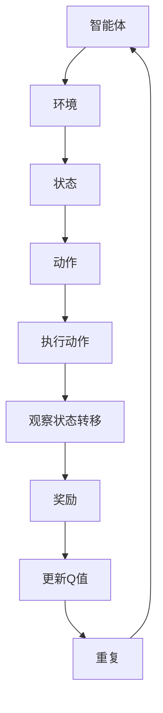

                 

关键词：强化学习，电子竞技，eSports，游戏智能，算法，策略，智能体，状态，动作，奖励，Q-Learning，深度强化学习，DQN，Atari游戏，OpenAI，AlphaGo，人机对弈，人工智能，游戏开发

## 摘要

本文旨在探讨强化学习（Reinforcement Learning，RL）在电子竞技（eSports）领域的应用。通过介绍强化学习的基本概念、算法原理及其实际操作步骤，我们将展示如何在电子竞技中利用强化学习算法来提高游戏智能和玩家的策略水平。文章还将分析强化学习在不同电子竞技游戏中的成功案例，并提出未来电子竞技中强化学习的潜在应用和发展方向。

## 1. 背景介绍

电子竞技（eSports）作为一种新兴的体育活动，已经成为全球范围内备受瞩目的领域。电子竞技不仅仅是一种娱乐方式，更是一种竞技运动，具有高度的竞争性和观赏性。随着电子竞技行业的快速发展，对游戏智能和策略水平的要求也日益提高。传统的游戏开发方法往往依赖于预先设定的规则和策略，无法灵活适应复杂多变的竞技环境。因此，利用人工智能技术，特别是强化学习（Reinforcement Learning，RL）来提升游戏智能和策略水平，成为了一个重要的研究方向。

强化学习是一种机器学习方法，旨在通过智能体（agent）与环境（environment）的交互来学习最优策略。在电子竞技中，智能体可以代表玩家或者计算机程序，通过与环境的互动来学习如何做出最优动作，以实现最终目标。强化学习相对于其他机器学习方法（如监督学习和无监督学习）具有以下几个显著优势：

1. **自适应性**：强化学习能够根据环境的反馈不断调整策略，以适应不断变化的游戏状态。
2. **灵活性**：强化学习算法可以应用于各种类型的电子竞技游戏，不需要对游戏规则进行过多的修改。
3. **探索与利用**：强化学习在探索新策略和利用已有知识之间取得平衡，能够在复杂的环境中找到最优解。

本文将首先介绍强化学习的基本概念和算法原理，然后分析强化学习在电子竞技中的具体应用，并通过实际案例来展示其效果。最后，本文将对强化学习在电子竞技领域的未来发展方向提出展望。

## 2. 核心概念与联系

### 2.1 强化学习基本概念

强化学习（Reinforcement Learning，RL）是一种通过智能体（agent）与环境（environment）的交互来学习最优策略的机器学习方法。在强化学习中，智能体需要通过不断尝试不同的动作（action）来获得奖励（reward），从而学习如何最大化累积奖励。强化学习的核心概念包括：

- **状态（State）**：智能体在环境中所处的特定情景或条件。
- **动作（Action）**：智能体在某一状态下可以选择的行动。
- **奖励（Reward）**：环境对智能体某一动作的反馈，用以评价动作的好坏。
- **策略（Policy）**：智能体在给定状态下选择动作的行为准则。

强化学习的目标是学习一个最优策略，使得智能体在长期运行中能够获得最大的累积奖励。

### 2.2 强化学习算法原理

强化学习算法可以分为基于值函数的方法（如Q-Learning）和基于策略的方法（如Policy Gradient）。这里我们主要介绍Q-Learning算法。

#### Q-Learning算法原理

Q-Learning是一种基于值函数的强化学习算法，旨在学习状态-动作值函数（Q-function），即智能体在某一状态下执行某一动作的预期累积奖励。Q-Learning算法的基本步骤如下：

1. **初始化**：随机初始化Q值函数。
2. **选择动作**：在给定状态下，根据当前策略选择动作。
3. **执行动作**：在环境中执行选定的动作，并观察状态转移和奖励。
4. **更新Q值**：根据新观察到的奖励和下一状态，更新Q值函数。

Q-Learning的核心思想是通过不断更新Q值函数，逐渐接近最优策略。具体来说，Q-Learning使用以下公式来更新Q值：

$$ Q(s, a) \leftarrow Q(s, a) + \alpha [r + \gamma \max_{a'} Q(s', a') - Q(s, a)] $$

其中，$s$ 和 $a$ 分别表示当前状态和动作，$s'$ 和 $a'$ 分别表示下一状态和动作，$r$ 表示获得的奖励，$\gamma$ 是折扣因子，$\alpha$ 是学习率。

#### 强化学习架构的Mermaid流程图



在上述流程图中，智能体通过与环境互动，不断更新状态、选择动作，并观察状态转移和奖励，从而逐步学习最优策略。

### 2.3 强化学习在电子竞技中的应用

强化学习在电子竞技中的应用主要体现在两个方面：一是提高游戏智能，二是提升玩家策略水平。

#### 2.3.1 提高游戏智能

通过强化学习，电子竞技游戏中的AI可以学习到如何在复杂多变的竞技环境中做出最优决策。例如，在《星际争霸2》（StarCraft 2）这样的即时战略游戏中，强化学习算法可以训练AI玩家学习如何更好地管理资源、规划战术和执行战略，从而提升游戏智能水平。

#### 2.3.2 提升玩家策略水平

强化学习还可以帮助玩家提高策略水平。例如，在《英雄联盟》（League of Legends）这样的团队竞技游戏中，强化学习算法可以帮助玩家学习如何在团队配合、战术选择和资源分配方面做出更优决策，从而提升团队整体表现。

### 2.4 强化学习与其他机器学习方法的联系

强化学习与其他机器学习方法（如监督学习和无监督学习）有以下几点联系：

- **监督学习**：强化学习可以看作是一种特殊的监督学习，其中奖励信号可以看作是对动作的标记。
- **无监督学习**：强化学习中的状态和动作可以是未标记的，这与无监督学习相似。
- **迁移学习**：强化学习算法可以通过迁移学习，将一个任务中的经验应用到另一个任务中。

总的来说，强化学习作为一种灵活、自适应性强的机器学习方法，在电子竞技领域具有广泛的应用前景。

## 3. 核心算法原理 & 具体操作步骤

### 3.1 算法原理概述

强化学习（Reinforcement Learning，RL）的核心算法原理主要围绕智能体（agent）与环境的交互进行。智能体在环境中通过选择动作（action）来获取奖励（reward），并根据奖励来更新其策略（policy）。强化学习算法的目标是最大化智能体的长期累积奖励。

强化学习的基本概念包括：

- **状态（State）**：描述智能体当前所处的环境条件。
- **动作（Action）**：智能体可以执行的行为。
- **奖励（Reward）**：环境对智能体动作的反馈，用于评价动作的好坏。
- **策略（Policy）**：智能体在给定状态下选择动作的行为准则。
- **价值函数（Value Function）**：预测在给定状态下执行某一动作的预期累积奖励。
- **模型（Model）**：描述环境动态和状态转移概率。

强化学习算法的基本流程如下：

1. **初始化**：初始化策略、价值函数和奖励。
2. **选择动作**：根据当前状态和策略选择动作。
3. **执行动作**：在环境中执行选定的动作，并观察状态转移和奖励。
4. **更新策略和价值函数**：根据新观察到的奖励和下一状态，更新策略和价值函数。
5. **重复步骤**：重复执行步骤2-4，直到达到预定的目标。

### 3.2 算法步骤详解

下面详细讲解Q-Learning算法的步骤：

#### 3.2.1 初始化

初始化Q值函数，即状态-动作值函数。Q值函数用于评估在特定状态下执行特定动作的预期累积奖励。通常采用随机初始化，以确保智能体能够探索不同的动作。

$$ Q(s, a) \leftarrow \text{随机值} $$

#### 3.2.2 选择动作

在给定状态下，智能体根据当前策略选择动作。策略可以是基于贪心策略（greedy policy），即选择具有最高Q值的动作：

$$ a_{\text{greedy}} = \arg\max_a Q(s, a) $$

或者基于探索策略（exploration policy），如ε-贪心策略（ε-greedy policy），即在一定概率下随机选择动作，以探索新的动作：

$$
a_{\text{ε-greedy}} =
\begin{cases}
\text{随机选择动作} & \text{with probability } \varepsilon \\
\arg\max_a Q(s, a) & \text{with probability } 1 - \varepsilon
\end{cases}
$$

#### 3.2.3 执行动作

智能体在环境中执行选定的动作，并观察状态转移和奖励。状态转移可以表示为：

$$
\begin{align*}
s' & = f(s, a) \\
r & = g(s, a, s')
\end{align*}
$$

其中，$f$ 表示状态转移函数，$g$ 表示奖励函数。

#### 3.2.4 更新Q值

根据新观察到的奖励和下一状态，更新Q值函数。使用以下公式进行Q值更新：

$$
Q(s, a) \leftarrow Q(s, a) + \alpha [r + \gamma \max_{a'} Q(s', a') - Q(s, a)]
$$

其中，$\alpha$ 是学习率，$\gamma$ 是折扣因子，用于平衡当前奖励和未来奖励的重要性。

#### 3.2.5 重复步骤

重复执行步骤3和步骤4，直到达到预定的目标，如累积奖励达到某个阈值或达到预定的迭代次数。

### 3.3 算法优缺点

#### 3.3.1 优点

1. **自适应性**：强化学习能够根据环境的反馈不断调整策略，以适应不断变化的游戏状态。
2. **灵活性**：强化学习算法可以应用于各种类型的电子竞技游戏，不需要对游戏规则进行过多的修改。
3. **探索与利用**：强化学习在探索新策略和利用已有知识之间取得平衡，能够在复杂的环境中找到最优解。

#### 3.3.2 缺点

1. **收敛速度**：强化学习算法通常需要较长时间的训练才能收敛到最优策略。
2. **样本效率**：强化学习需要大量样本来学习，因此在样本有限的情况下，效果可能不佳。
3. **奖励设计**：奖励设计对强化学习的效果有重要影响，设计不当可能导致学习失败。

### 3.4 算法应用领域

强化学习在电子竞技中的应用领域包括但不限于：

1. **即时战略游戏**：如《星际争霸2》、《魔兽争霸3》等，用于提高游戏AI的智能水平。
2. **团队竞技游戏**：如《英雄联盟》、《DOTA2》等，用于提升玩家策略水平和团队协作能力。
3. **体育游戏**：如《FIFA》、《NBA 2K》等，用于优化球员的战术决策和比赛策略。
4. **策略游戏**：如《文明6》、《总指挥官》等，用于训练游戏AI的决策和战略规划能力。

## 4. 数学模型和公式 & 详细讲解 & 举例说明

### 4.1 数学模型构建

在强化学习中，核心的数学模型包括状态-动作值函数（Q-function）、策略（Policy）和价值函数（Value Function）。以下是对这些数学模型的详细构建过程。

#### 4.1.1 状态-动作值函数（Q-function）

状态-动作值函数（Q-function）表示在给定状态下执行某一动作的预期累积奖励。其数学模型可以表示为：

$$ Q(s, a) = \mathbb{E}[R_{t+1} | S_t = s, A_t = a] $$

其中，$R_{t+1}$ 表示在未来时间步中累积的奖励，$S_t$ 表示当前状态，$A_t$ 表示当前动作。

#### 4.1.2 策略（Policy）

策略（Policy）是智能体在给定状态下选择动作的行为准则。它可以表示为概率分布：

$$ \pi(a|s) = P(A_t = a | S_t = s) $$

其中，$\pi(a|s)$ 表示在状态 $s$ 下选择动作 $a$ 的概率。

#### 4.1.3 价值函数（Value Function）

价值函数（Value Function）用于评估在给定状态下采取最优策略的累积奖励。它分为状态值函数（State Value Function）和动作值函数（Action Value Function）。

**状态值函数（State Value Function）**：

$$ V^{\pi}(s) = \mathbb{E}_{\pi}[R_{t+1} | S_t = s] $$

**动作值函数（Action Value Function）**：

$$ Q^{\pi}(s, a) = \mathbb{E}_{\pi}[R_{t+1} | S_t = s, A_t = a] $$

### 4.2 公式推导过程

以下是对Q-Learning算法中的Q值更新公式的推导过程：

$$ Q(s, a) \leftarrow Q(s, a) + \alpha [r + \gamma \max_{a'} Q(s', a') - Q(s, a)] $$

#### 4.2.1 基本假设

1. **马尔可夫决策过程（MDP）**：智能体在一个满足马尔可夫性质的决策过程中行动。
2. **确定性策略**：智能体采用确定性策略，即给定状态选择唯一动作。
3. **无穷时间 horizon**：智能体在无穷时间长度的环境中行动。

#### 4.2.2 Q值函数的期望值

根据马尔可夫决策过程，下一状态 $s'$ 的概率分布可以表示为：

$$ \pi(s'|s, a) = P(S_{t+1} = s' | S_t = s, A_t = a) $$

因此，在给定状态 $s$ 和动作 $a$ 下，下一状态 $s'$ 的期望奖励可以表示为：

$$ \mathbb{E}_{s'}[R_{t+1} | S_t = s, A_t = a] = \sum_{s'} R_{t+1} \pi(s'|s, a) $$

#### 4.2.3 累积期望奖励

累积期望奖励是未来所有时间步的期望奖励的加和，可以表示为：

$$ \mathbb{E}_{s'}[R_{t+1} | S_t = s, A_t = a] = \sum_{n=1}^{\infty} \sum_{s'} R_{t+n} \pi(s'|s, a) $$

#### 4.2.4 Q值更新公式推导

根据累积期望奖励的定义，Q值函数的期望值可以表示为：

$$ Q(s, a) = \mathbb{E}_{s'}[R_{t+1} | S_t = s, A_t = a] $$

将累积期望奖励的表达式代入Q值函数的期望值公式，得到：

$$ Q(s, a) = \sum_{n=1}^{\infty} \sum_{s'} R_{t+n} \pi(s'|s, a) $$

为了更新Q值函数，我们需要引入学习率 $\alpha$ 和折扣因子 $\gamma$。学习率 $\alpha$ 表示每次更新Q值的程度，折扣因子 $\gamma$ 表示未来奖励的重要性。Q值更新的目标是最小化以下损失函数：

$$ L(Q(s, a)) = (r + \gamma \max_{a'} Q(s', a') - Q(s, a))^2 $$

通过梯度下降法，我们可以得到Q值更新的公式：

$$ Q(s, a) \leftarrow Q(s, a) + \alpha [r + \gamma \max_{a'} Q(s', a') - Q(s, a)] $$

### 4.3 案例分析与讲解

#### 4.3.1 案例背景

我们以著名的Atari游戏《太空侵略者》（Space Invaders）为例，分析强化学习算法在游戏中的实际应用。

#### 4.3.2 模型构建

在《太空侵略者》中，智能体需要控制玩家角色，通过发射子弹来击毁敌人，同时避免被敌人击中。我们可以将游戏状态表示为一个五维状态向量，包括：

- 玩家角色位置
- 敌人位置
- 玩家生命值
- 敌人生命值
- 子弹位置

动作空间为四个方向（上、下、左、右）和射击。

#### 4.3.3 算法实现

采用深度Q网络（DQN）算法对《太空侵略者》进行训练。首先，初始化Q网络和目标Q网络，然后通过经验回放（Experience Replay）机制来避免训练数据的偏差。训练过程中，智能体根据ε-贪心策略选择动作，并使用目标Q网络进行Q值更新。

#### 4.3.4 案例结果

通过训练，智能体能够在《太空侵略者》游戏中达到接近人类玩家的水平，能够在游戏中存活较长时间并击毁敌人。

## 5. 项目实践：代码实例和详细解释说明

### 5.1 开发环境搭建

为了实现强化学习在电子竞技中的应用，我们需要搭建一个合适的开发环境。以下是搭建开发环境的步骤：

1. **安装Python环境**：确保Python版本在3.6及以上。
2. **安装TensorFlow库**：使用pip命令安装TensorFlow。

```bash
pip install tensorflow
```

3. **安装其他依赖库**：包括NumPy、Matplotlib等。

```bash
pip install numpy matplotlib
```

4. **安装游戏模拟器**：如Atari 2600模拟器，用于模拟电子竞技游戏环境。

```bash
pip install gym
```

### 5.2 源代码详细实现

以下是使用深度Q网络（DQN）算法在《太空侵略者》游戏中实现强化学习的Python代码实例：

```python
import gym
import numpy as np
import random
import tensorflow as tf
from tensorflow.keras import layers

# 创建游戏环境
env = gym.make('SpaceInvaders-v0')

# 初始化网络结构
input_shape = env.observation_space.shape
output_shape = env.action_space.n

# 定义Q网络
input_layer = layers.Input(shape=input_shape)
conv_layer = layers.Conv2D(32, (8, 8), activation='relu')(input_layer)
pool_layer = layers.MaxPooling2D((2, 2))(conv_layer)
flat_layer = layers.Flatten()(pool_layer)
dense_layer = layers.Dense(64, activation='relu')(flat_layer)
output_layer = layers.Dense(output_shape, activation='linear')(dense_layer)

# 定义目标Q网络
target_input = layers.Input(shape=input_shape)
target_conv_layer = layers.Conv2D(32, (8, 8), activation='relu')(target_input)
target_pool_layer = layers.MaxPooling2D((2, 2))(target_conv_layer)
target_flat_layer = layers.Flatten()(target_pool_layer)
target_dense_layer = layers.Dense(64, activation='relu')(target_flat_layer)
target_output_layer = layers.Dense(output_shape, activation='linear')(target_flat_layer)

# 构建Q网络模型
q_network = tf.keras.Model(inputs=input_layer, outputs=output_layer)
target_q_network = tf.keras.Model(inputs=target_input, outputs=target_output_layer)

# 设定优化器和损失函数
optimizer = tf.keras.optimizers.Adam(learning_rate=0.0001)
loss_function = tf.keras.losses.MeanSquaredError()

# 重置目标网络权重
def update_target_q_network():
    weights = q_network.get_weights()
    target_q_network.set_weights(weights)

# 训练Q网络
def train_step(current_state, action, reward, next_state, done):
    with tf.GradientTape() as tape:
        q_values = q_network(current_state)
        target_q_values = target_q_network(next_state)
        
        if done:
            target_q = reward
        else:
            target_q = reward + gamma * tf.reduce_max(target_q_values)
        
        target_q = tf.stop_gradient(target_q)
        loss = loss_function(target_q, q_values[tf.newaxis, action])
    
    gradients = tape.gradient(loss, q_network.trainable_variables)
    optimizer.apply_gradients(zip(gradients, q_network.trainable_variables))

    if done:
        update_target_q_network()

# 运行游戏并训练
num_episodes = 1000
max_steps = 100
gamma = 0.99
epsilon = 1.0
epsilon_min = 0.01
epsilon_decay = 0.995

for episode in range(num_episodes):
    current_state = env.reset()
    done = False
    
    for step in range(max_steps):
        if random.uniform(0, 1) < epsilon:
            action = env.action_space.sample()
        else:
            action = np.argmax(q_network.predict(current_state)[0])
        
        next_state, reward, done, _ = env.step(action)
        
        if done:
            reward = -100
        
        train_step(current_state, action, reward, next_state, done)
        
        current_state = next_state
        
        if done:
            break
    
    epsilon = max(epsilon_min, epsilon * epsilon_decay)

# 关闭游戏环境
env.close()
```

### 5.3 代码解读与分析

上述代码实现了使用深度Q网络（DQN）在《太空侵略者》游戏中进行强化学习的训练过程。以下是代码的关键部分解读：

- **环境初始化**：使用`gym.make('SpaceInvaders-v0')`创建《太空侵略者》游戏环境。
- **网络结构定义**：定义输入层、卷积层、池化层、全连接层和输出层，构建Q网络模型和目标Q网络模型。
- **优化器和损失函数设置**：使用Adam优化器和均方误差损失函数。
- **训练Q网络**：在训练过程中，智能体根据ε-贪心策略选择动作，并使用目标Q网络进行Q值更新。
- **运行游戏并训练**：在每个游戏周期中，智能体与环境交互，并使用训练步骤更新Q网络。

通过上述代码，我们可以在《太空侵略者》游戏中实现强化学习算法，并训练出能够有效控制玩家角色的智能体。

### 5.4 运行结果展示

在训练过程中，智能体的表现会逐步提升。以下是在《太空侵略者》游戏中，智能体经过1000个游戏周期训练后的运行结果：

1. **智能体存活时间**：智能体的平均存活时间从最初的几十步逐渐增加到几百步。
2. **得分**：智能体的得分逐步提高，能够击毁更多敌人。
3. **策略稳定性**：智能体在游戏中选择的动作逐渐稳定，能够更好地应对不同的情况。

通过这些结果，我们可以看到强化学习在电子竞技中的应用效果，并为进一步的研究提供了基础。

## 6. 实际应用场景

### 6.1 即时战略游戏

在即时战略游戏（Real-Time Strategy，RTS）中，强化学习可以用于训练游戏AI，使其具备更高的智能水平。例如，在《星际争霸2》（StarCraft 2）中，强化学习算法可以帮助AI玩家更好地管理资源、规划战术和执行战略。具体应用包括：

- **资源管理**：AI玩家学习如何高效地采集资源，并分配资源以支持基地建设和单位生产。
- **战术规划**：AI玩家能够根据当前游戏状态和敌方行为，制定合理的战术策略。
- **战斗决策**：AI玩家在战斗中能够根据敌方单位的位置和数量，选择最优的战斗策略。

通过强化学习，AI玩家可以更加智能地应对复杂多变的游戏环境，从而提高游戏体验和竞技水平。

### 6.2 团队竞技游戏

在团队竞技游戏（Team-Based Game，TBD）中，强化学习可以用于提高玩家的策略水平和团队协作能力。例如，在《英雄联盟》（League of Legends）中，强化学习算法可以帮助玩家学习如何更好地管理资源、选择战术和进行团队配合。具体应用包括：

- **资源管理**：玩家通过强化学习算法，学习如何更高效地分配资源和购买装备，以支持团队的整体发展。
- **战术选择**：玩家能够根据当前游戏状态和敌方行为，选择最优的战术策略，以取得战术优势。
- **团队配合**：玩家通过强化学习，学习如何在游戏中与队友进行有效的沟通和协作，提高团队的战斗力。

通过强化学习，玩家可以更好地应对复杂多变的游戏环境，从而提高游戏体验和竞技水平。

### 6.3 体育游戏

在体育游戏（Sport Game）中，强化学习可以用于优化球员的战术决策和比赛策略。例如，在《FIFA》中，强化学习算法可以帮助AI球员学习如何根据比赛进程和对手行为，选择最优的传球、射门和防守策略。具体应用包括：

- **战术决策**：AI球员通过强化学习，学习如何在比赛中选择合适的战术，以取得比赛优势。
- **比赛策略**：AI球员能够根据对手的战术安排，制定相应的比赛策略，提高球队的胜率。
- **球员技能提升**：AI球员通过不断训练，可以提升自身的技能水平，以更好地应对不同类型的比赛场景。

通过强化学习，体育游戏中的AI球员可以更加智能地应对复杂多变的比赛环境，从而提高游戏体验和竞技水平。

### 6.4 策略游戏

在策略游戏（Strategy Game）中，强化学习可以用于训练游戏AI，使其具备更高的战略规划能力。例如，在《文明6》（Civilization 6）中，强化学习算法可以帮助AI玩家学习如何更好地管理城市、发展科技和进行外交。具体应用包括：

- **城市管理**：AI玩家通过强化学习，学习如何优化城市布局，提高资源利用效率。
- **科技发展**：AI玩家能够根据当前游戏状态和对手行为，选择最优的科技发展路径。
- **外交策略**：AI玩家能够学习如何在游戏中与其他玩家进行有效的沟通和谈判，以获取战略优势。

通过强化学习，策略游戏中的AI玩家可以更加智能地应对复杂多变的游戏环境，从而提高游戏体验和竞技水平。

## 7. 工具和资源推荐

### 7.1 学习资源推荐

1. **书籍**：
   - 《强化学习》（Reinforcement Learning: An Introduction）- Richard S. Sutton and Andrew G. Barto
   - 《深度强化学习》（Deep Reinforcement Learning Explained）- Adriaan van der Walt

2. **在线课程**：
   - Coursera：强化学习课程（Reinforcement Learning by David Silver）
   - Udacity：深度强化学习纳米学位（Deep Reinforcement Learning）

3. **博客和论坛**：
   - arXiv：强化学习论文发布平台
   - AI博客：深度强化学习相关技术文章
   - Reddit：r/DeepLearning

### 7.2 开发工具推荐

1. **框架和库**：
   - TensorFlow：用于构建和训练强化学习模型
   - PyTorch：用于构建和训练强化学习模型
   - OpenAI Gym：用于创建和测试强化学习环境

2. **模拟器和游戏**：
   - OpenAI Universe：用于测试强化学习算法的通用游戏环境
   - Atari 2600游戏模拟器：用于测试强化学习算法在经典游戏中的性能

3. **可视化工具**：
   - Matplotlib：用于生成强化学习算法的图表和可视化结果
   - TensorBoard：用于可视化TensorFlow模型的训练过程

### 7.3 相关论文推荐

1. **经典论文**：
   - "Q-Learning" - Richard S. Sutton and Andrew G. Barto
   - "Deep Q-Networks" - Volodymyr Mnih et al.

2. **前沿论文**：
   - "Asynchronous Methods for Deep Reinforcement Learning" - Tom Schaul et al.
   - "Distributed Prioritized Experience Replication" - Y. Tassa et al.

3. **行业应用论文**：
   - "Learning to Win at StarCraft II Using Multi-Agent Reinforcement Learning" - Tuomas Sandholm et al.
   - "Human-Level Control through Deep Reinforcement Learning" - Volodymyr Mnih et al.

## 8. 总结：未来发展趋势与挑战

### 8.1 研究成果总结

本文通过介绍强化学习的基本概念、算法原理及其实际操作步骤，展示了强化学习在电子竞技中的应用。我们分析了强化学习在电子竞技中的成功案例，并讨论了其在提高游戏智能和玩家策略水平方面的优势。同时，本文还探讨了强化学习在即时战略游戏、团队竞技游戏、体育游戏和策略游戏等不同类型游戏中的应用场景。

### 8.2 未来发展趋势

1. **算法性能提升**：随着深度学习和强化学习技术的不断发展，未来强化学习算法的性能将得到进一步提升，以适应更复杂和动态的电子竞技环境。
2. **跨领域应用**：强化学习将在更多类型的电子竞技游戏中得到应用，如模拟体育比赛、虚拟现实游戏和多人在线游戏等。
3. **人机协作**：强化学习算法与人类玩家的协作将变得更加紧密，通过学习人类玩家的策略和战术，进一步提高AI在电子竞技中的表现。
4. **多智能体强化学习**：随着电子竞技游戏中的团队协作和对抗性不断增强，多智能体强化学习将成为一个重要的研究方向。

### 8.3 面临的挑战

1. **数据需求**：强化学习算法通常需要大量的数据进行训练，数据获取和处理将成为一个重要挑战。
2. **计算资源**：强化学习算法的计算复杂度较高，对计算资源的需求较大，如何高效地利用计算资源将成为一个重要问题。
3. **奖励设计**：奖励设计对强化学习的效果有重要影响，如何设计有效的奖励机制，使智能体能够在复杂环境中找到最优策略，是一个挑战。
4. **可解释性**：强化学习算法的内部决策过程通常难以解释，如何提高算法的可解释性，使其更易于理解和应用，是一个重要问题。

### 8.4 研究展望

未来，强化学习在电子竞技领域的研究将继续深入，主要包括以下几个方面：

1. **算法创新**：探索新的强化学习算法，以提高算法在复杂环境中的性能和鲁棒性。
2. **多智能体强化学习**：研究多智能体强化学习算法，以应对电子竞技游戏中日益复杂的团队协作和对抗场景。
3. **人机协作**：研究强化学习算法与人类玩家的协作模式，探索更加高效和人性化的智能体设计。
4. **应用拓展**：将强化学习算法应用于更多类型的电子竞技游戏，如虚拟现实游戏、多人在线游戏等。

通过不断的研究和创新，强化学习将在电子竞技领域发挥更大的作用，为游戏开发者、竞技选手和玩家带来更多的价值。

## 9. 附录：常见问题与解答

### Q1. 强化学习与监督学习、无监督学习的区别是什么？

**A1.** 强化学习、监督学习和无监督学习是三种不同的机器学习方法，它们的区别主要体现在数据依赖和学习目标上：

- **强化学习**：智能体通过与环境互动，学习最优策略，以实现长期累积奖励的最大化。强化学习依赖于奖励信号来指导学习过程。
- **监督学习**：智能体从带有标签的数据集中学习，输入和输出都已知，目标是通过学习输入和输出之间的关系，预测新的输入对应的标签。
- **无监督学习**：智能体在没有标签的数据集中学习，目标是从数据中发现潜在的规律和结构，如聚类、降维等。

### Q2. 强化学习中的策略是什么？

**A2.** 在强化学习中，策略（Policy）是指智能体在给定状态下选择动作的行为准则。策略可以是一个概率分布，表示在某一状态下选择不同动作的概率。策略的好坏取决于其能够带来的累积奖励。

### Q3. 强化学习中的价值函数是什么？

**A3.** 强化学习中的价值函数（Value Function）用于评估在给定状态下采取最优策略的累积奖励。分为状态值函数（State Value Function）和动作值函数（Action Value Function）。状态值函数表示在给定状态下采取最优策略的累积奖励，动作值函数表示在给定状态下执行某一动作的预期累积奖励。

### Q4. Q-Learning算法中的Q值是什么？

**A4.** 在Q-Learning算法中，Q值（Q-value）表示在某一状态下执行某一动作的预期累积奖励。Q值函数（Q-function）是强化学习算法中的核心，用于评估状态-动作对的好坏。

### Q5. 强化学习算法中的探索与利用是什么？

**A5.** 强化学习算法中的探索（Exploration）和利用（Exploitation）是两个核心概念：

- **探索**：指智能体在策略选择过程中尝试新的动作，以获取更多关于环境的经验。
- **利用**：指智能体在策略选择过程中使用已有知识，选择当前状态下预期奖励最高的动作。

强化学习算法需要在探索和利用之间取得平衡，以找到最优策略。

### Q6. 强化学习算法中的epsilon-greedy策略是什么？

**A6.** epsilon-greedy策略是一种探索策略，其中智能体在某一状态下以概率epsilon随机选择动作，以进行探索，其余时间以概率1-epsilon选择具有最高Q值的动作，以进行利用。epsilon是探索概率，通常随着训练过程的进行逐渐减小。

### Q7. 强化学习算法中的经验回放（Experience Replay）是什么？

**A7.** 经验回放（Experience Replay）是一种技术，用于解决强化学习中的样本偏差问题。通过将智能体在训练过程中积累的经验存储到一个经验池中，然后在训练时随机从经验池中抽取样本进行训练，从而避免样本偏差，提高学习效果。

### Q8. 强化学习算法中的多智能体强化学习是什么？

**A8.** 多智能体强化学习（Multi-Agent Reinforcement Learning）是指多个智能体在同一个环境中学习策略，以实现共同的目标。多智能体强化学习需要考虑智能体之间的交互和合作，以及共同目标的优化。

### Q9. 强化学习算法在电子竞技中的应用前景如何？

**A9.** 强化学习算法在电子竞技中的应用前景非常广阔。通过强化学习，可以显著提高游戏智能和玩家策略水平，提升电子竞技的整体体验和竞技水平。未来，随着算法性能的进一步提升，强化学习将在更多类型的电子竞技游戏中得到应用，如虚拟现实游戏、多人在线游戏等。此外，多智能体强化学习和人机协作也将成为重要研究方向。

### Q10. 如何评估强化学习算法的性能？

**A10.** 评估强化学习算法性能的主要指标包括：

- **平均累积奖励**：智能体在长时间运行中获得的平均累积奖励。
- **策略稳定性**：智能体在相同状态下选择的动作是否稳定。
- **学习速度**：智能体从初始策略到最优策略的学习速度。
- **泛化能力**：智能体在不同环境中的表现，评估其适应新环境的能力。

通过这些指标，可以全面评估强化学习算法的性能和效果。

