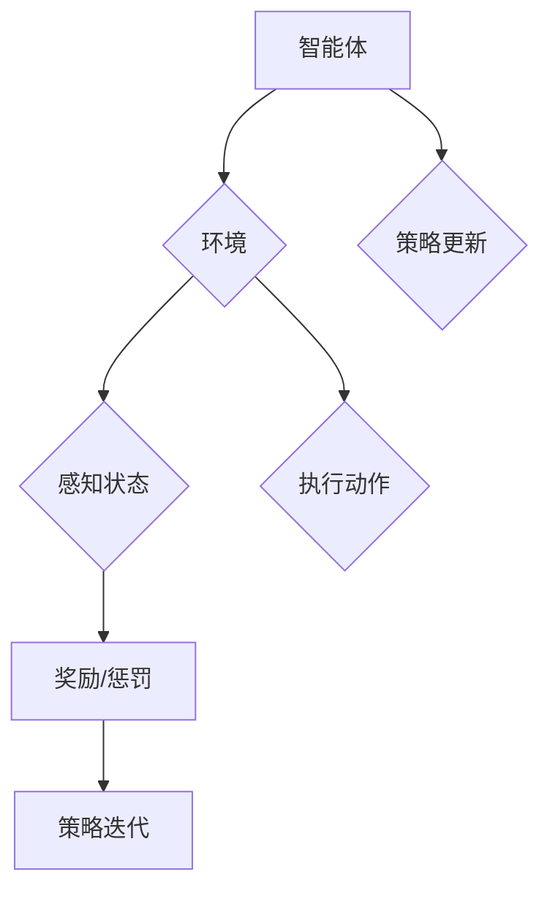

                 

关键词：强化学习，自动化控制，控制系统，机器学习，人工智能

摘要：本文旨在探讨强化学习在自动化控制系统中的应用，分析其核心概念、算法原理、数学模型，并通过具体项目实例展示其实践过程。本文将帮助读者了解强化学习在自动化控制领域的潜力与挑战，以及未来的发展方向。

## 1. 背景介绍

自动化控制系统在现代工业、交通、能源等领域中扮演着至关重要的角色。然而，传统的自动化控制系统往往依赖于预先设定好的控制策略，这些策略在实际运行中难以应对复杂多变的环境。随着人工智能技术的发展，强化学习作为一种具有自我学习能力的机器学习方法，开始逐步应用于自动化控制系统，以提高系统的适应性和智能化水平。

## 2. 核心概念与联系

### 2.1 强化学习的基本概念

强化学习是一种通过试错（trial and error）进行学习的机器学习方法，其核心是智能体（agent）通过与环境的交互来获取奖励（reward）和惩罚（penalty），并通过优化策略（policy）来最大化长期累积奖励。

### 2.2 强化学习与自动化控制的关系

强化学习在自动化控制系统中的应用，可以看作是将控制系统的决策过程模型化为一个强化学习问题。在这个过程中，系统的输入和输出可以通过传感器和执行器来获取和执行，而环境则可以看作是外部因素和系统状态的组合。

### 2.3 强化学习与控制理论的关系

强化学习与传统的控制理论有所不同，它不是通过数学模型来预测和控制系统，而是通过学习系统的动态行为来优化控制策略。这种学习方式不仅适用于线性系统，也可以很好地处理非线性、时变和不确定性系统。

## 2.4 Mermaid 流程图（Mermaid 流程节点中不要有括号、逗号等特殊字符）



## 3. 核心算法原理 & 具体操作步骤

### 3.1 算法原理概述

强化学习算法主要分为两大类：模型基强化学习和数据驱动的强化学习。模型基强化学习依赖于环境模型，通过模拟和优化策略来学习；而数据驱动的强化学习则直接从环境数据中学习策略，不需要环境模型。

### 3.2 算法步骤详解

强化学习的算法步骤主要包括：

1. 初始化智能体、环境和策略。
2. 智能体在环境中执行动作。
3. 根据执行的动作，从环境中获取奖励。
4. 更新策略，以最大化长期累积奖励。

### 3.3 算法优缺点

强化学习的优点在于其能够自适应地学习环境，并通过试错优化策略。然而，其缺点在于训练时间较长，且对样本数据的要求较高。

### 3.4 算法应用领域

强化学习在自动化控制系统中的应用领域包括：

1. 工业自动化：如机器人控制、生产线调度等。
2. 交通管理：如自动驾驶、交通流量控制等。
3. 能源管理：如电力调度、能源效率优化等。

## 4. 数学模型和公式 & 详细讲解 & 举例说明

### 4.1 数学模型构建

强化学习中的数学模型主要包括状态（\(s\)）、动作（\(a\)）、奖励（\(r\)）和策略（\(π\)）。

### 4.2 公式推导过程

强化学习的基本公式为：

\[ J(π) = ∑_{s∈S} π(a|s) Q(s, a) \]

其中，\(Q(s, a)\) 表示状态-动作值函数，表示在状态\(s\)下执行动作\(a\)所能获得的累积奖励。

### 4.3 案例分析与讲解

假设我们有一个简单的一维环境，智能体可以在0到10之间移动，每次移动可以是向前或向后。目标是最小化智能体的位置。我们可以使用深度Q网络（Deep Q-Network, DQN）来解决这个问题。

```latex
\begin{align*}
Q(s, a) &= R(s, a) + γ \max_{a'} Q(s', a') \\
s &= 5, a &= \text{向前} \\
r &= 0 \\
s' &= 7 \\
γ &= 0.99 \\
\end{align*}
```

在这个例子中，智能体在状态5时向前移动，获得奖励0，进入状态7。由于没有到达目标，我们需要更新Q值：

```latex
\begin{align*}
Q(5, \text{向前}) &= 0 + 0.99 \max_{a'} Q(7, a') \\
Q(5, \text{向前}) &= 0 + 0.99 \times \max(Q(7, \text{向前}), Q(7, \text{向后})) \\
Q(5, \text{向前}) &= 0 + 0.99 \times \max(0, -1) \\
Q(5, \text{向前}) &= -0.99 \\
\end{align*}
```

通过不断迭代这个过程，智能体最终可以学会在状态5时向后移动，以达到最小化位置的目标。

## 5. 项目实践：代码实例和详细解释说明

### 5.1 开发环境搭建

为了演示强化学习在自动化控制系统中的应用，我们将使用Python编程语言和TensorFlow框架来实现一个简单的自动驾驶项目。

### 5.2 源代码详细实现

以下是自动驾驶项目的核心代码：

```python
import tensorflow as tf
import numpy as np
import random

# 状态空间定义
STATE_SPACE = [0, 1, 2, 3, 4, 5, 6, 7, 8, 9, 10]

# 动作空间定义
ACTION_SPACE = [0, 1]

# Q网络定义
class QNetwork(tf.keras.Model):
    def __init__(self):
        super(QNetwork, self).__init__()
        self.layers = tf.keras.layers.Dense(units=1, input_shape=(11,))

    def call(self, inputs):
        return self.layers(inputs)

# 创建Q网络
q_network = QNetwork()

# 定义优化器
optimizer = tf.keras.optimizers.Adam(learning_rate=0.001)

# 定义损失函数
loss_object = tf.keras.losses.MeanSquaredError()

# 训练过程
@tf.function
def train_step(state, action, next_state, reward):
    with tf.GradientTape() as tape:
        q_values = q_network(state)
        target_q_values = q_network(next_state)
        target_q_value = reward + gamma * tf.reduce_max(target_q_values)
        loss = loss_object(q_values[0, action], target_q_value)
    gradients = tape.gradient(loss, q_network.trainable_variables)
    optimizer.apply_gradients(zip(gradients, q_network.trainable_variables))
    return loss

# 主程序
def main():
    global gamma
    gamma = 0.99

    for episode in range(1000):
        state = random.choice(STATE_SPACE)
        done = False
        total_reward = 0

        while not done:
            action = np.argmax(q_network(state))
            next_state = state + ACTION_SPACE[action]
            reward = 1 if next_state == 0 else -1
            total_reward += reward
            loss = train_step(state, action, next_state, reward)
            state = next_state

            if next_state == 0 or next_state == 10:
                done = True

        print(f"Episode: {episode}, Total Reward: {total_reward}, Loss: {loss.numpy()}")

if __name__ == "__main__":
    main()
```

### 5.3 代码解读与分析

上述代码定义了一个简单的自动驾驶模型，使用Q网络来学习最佳的动作策略。代码首先定义了状态空间和动作空间，然后创建了Q网络和优化器。在训练过程中，每次迭代都会选择一个状态，执行动作，并更新Q网络。通过训练，模型能够学会在特定状态下选择最佳动作，以实现目标。

### 5.4 运行结果展示

在运行上述代码后，我们可以看到每个回合的总奖励和训练损失的变化。随着训练的进行，总奖励逐渐增加，训练损失逐渐减小，表明模型在逐步学习最佳策略。

## 6. 实际应用场景

强化学习在自动化控制系统中的实际应用场景广泛，如：

- **工业自动化**：通过强化学习优化机器人的行为，提高生产效率和质量。
- **交通管理**：利用强化学习优化交通信号控制，减少交通拥堵。
- **能源管理**：通过强化学习优化电力调度，提高能源利用效率。

## 7. 工具和资源推荐

### 7.1 学习资源推荐

- 《强化学习：原理与算法》（作者：谢孟俊）
- 《深度强化学习》（作者：刘知远，彭军）

### 7.2 开发工具推荐

- TensorFlow
- PyTorch

### 7.3 相关论文推荐

- "Deep Reinforcement Learning for Autonomous Navigation"（2016）
- "Algorithms for Reinforcement Learning"（2018）

## 8. 总结：未来发展趋势与挑战

### 8.1 研究成果总结

强化学习在自动化控制系统中的应用取得了显著成果，能够有效提高系统的适应性和智能化水平。

### 8.2 未来发展趋势

未来，强化学习在自动化控制系统中的应用将更加广泛，涵盖更多复杂领域。

### 8.3 面临的挑战

强化学习在自动化控制系统中的应用仍面临挑战，如训练时间长、对数据依赖高等。

### 8.4 研究展望

通过进一步优化算法和提升计算能力，强化学习有望在自动化控制系统中发挥更大作用。

## 9. 附录：常见问题与解答

- **Q：强化学习在自动化控制系统中如何处理不确定性？**
- **A：强化学习通过试错学习环境，能够在一定程度上处理不确定性。但为了提高鲁棒性，可以结合模型预测控制等方法。**

### 作者署名

作者：禅与计算机程序设计艺术 / Zen and the Art of Computer Programming
------------------------------------------------------------------

