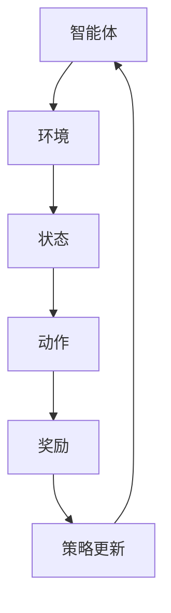

                 

关键词：强化学习、金融、算法、应用、挑战、数学模型、实践、未来展望

摘要：本文深入探讨了强化学习在金融领域的应用及其面临的挑战。文章首先介绍了强化学习的基本概念，随后详细阐述了其在金融交易、风险管理、算法交易等领域的应用。接着，文章分析了强化学习算法在金融领域中的优缺点，并探讨了相关的数学模型和公式。此外，文章通过实际项目实践，提供了代码实例和详细解释。最后，文章对强化学习在金融领域的未来应用进行了展望，并总结了相关的研究成果和面临的挑战。

## 1. 背景介绍

随着计算机技术的飞速发展，金融市场也在不断演变，复杂性和不确定性日益增加。传统的金融分析方法已无法满足现代金融市场的需求。在这种背景下，人工智能技术，尤其是强化学习（Reinforcement Learning，简称RL），逐渐成为了金融领域的研究热点。

强化学习是一种机器学习方法，其核心思想是让智能体通过与环境的交互，学习到最优策略。强化学习的智能体在每一步都会根据当前的状态选择一个动作，然后根据动作的结果（奖励或惩罚）调整策略。这一过程不断重复，直到智能体找到一种最优策略，使总奖励最大化。

金融领域具有数据量大、非线性和不确定性的特点，这使得强化学习在金融交易、风险管理、算法交易等方面具有巨大的潜力。然而，强化学习在金融领域的应用也面临着许多挑战，如模型可靠性、数据隐私、交易风险等。

## 2. 核心概念与联系

为了更好地理解强化学习在金融领域的应用，我们需要先了解其核心概念和基本原理。

### 2.1 强化学习基本原理

强化学习包括三个主要组成部分：智能体（Agent）、环境（Environment）和奖励（Reward）。

1. **智能体（Agent）**：智能体是执行行动的实体，它可以是一个机器学习模型，如深度神经网络。
2. **环境（Environment）**：环境是智能体所处的情境，可以是金融市场、游戏或者仿真环境。
3. **奖励（Reward）**：奖励是智能体执行某个动作后获得的即时反馈，它可以是正面的（如盈利）或负面的（如损失）。

在强化学习过程中，智能体根据当前的状态选择一个动作，然后执行该动作并得到奖励。接着，智能体会根据奖励和当前的状态更新其策略，以最大化总奖励。这一过程可以表示为以下公式：

$$
Q(s, a) = r + \gamma \max_{a'} Q(s', a')
$$

其中，$Q(s, a)$ 表示在状态 $s$ 下执行动作 $a$ 的预期总奖励，$r$ 是即时奖励，$\gamma$ 是折扣因子，$s'$ 和 $a'$ 分别是下一个状态和动作。

### 2.2 强化学习与金融领域的联系

强化学习在金融领域的应用主要体现在以下几个方面：

1. **交易策略优化**：强化学习可以用于优化交易策略，从而提高交易成功率。智能体可以通过学习市场数据，发现最优的交易时机和交易方式。
2. **风险管理**：强化学习可以帮助金融机构识别和评估金融风险，从而制定更有效的风险控制策略。
3. **算法交易**：算法交易是金融领域的一种自动化交易方式，利用计算机算法进行高频交易。强化学习可以为算法交易提供更高效的策略，提高交易收益。

### 2.3 Mermaid 流程图

下面是一个简单的强化学习在金融领域的 Mermaid 流程图：



## 3. 核心算法原理 & 具体操作步骤

### 3.1 算法原理概述

强化学习算法的基本原理是通过试错来优化决策策略。在金融领域，强化学习算法可以用于交易策略优化、风险管理、算法交易等。

### 3.2 算法步骤详解

1. **初始化**：设置智能体的初始状态、动作空间和策略。
2. **状态观测**：智能体观察当前市场状态。
3. **策略选择**：智能体根据当前状态和策略，选择一个动作。
4. **执行动作**：智能体在金融市场上执行所选动作。
5. **奖励反馈**：根据动作结果，智能体获得即时奖励。
6. **策略更新**：智能体根据奖励反馈和当前状态，更新策略。
7. **重复步骤 2-6**：智能体不断重复上述过程，直到找到最优策略。

### 3.3 算法优缺点

**优点**：

- **自适应性强**：强化学习可以适应金融市场的不确定性和动态变化。
- **灵活性高**：智能体可以根据市场反馈不断调整策略，提高交易成功率。

**缺点**：

- **计算复杂度高**：强化学习算法的计算复杂度较高，需要大量计算资源和时间。
- **过拟合风险**：智能体可能会在学习过程中过拟合市场数据，导致在实际应用中表现不佳。

### 3.4 算法应用领域

- **交易策略优化**：通过强化学习，智能体可以学习到最优的交易策略，提高交易成功率。
- **风险管理**：强化学习可以帮助金融机构识别和评估金融风险，从而制定更有效的风险控制策略。
- **算法交易**：强化学习可以为算法交易提供更高效的策略，提高交易收益。

## 4. 数学模型和公式 & 详细讲解 & 举例说明

### 4.1 数学模型构建

强化学习在金融领域的应用，通常需要构建一个马尔可夫决策过程（MDP），其数学模型如下：

$$
\begin{align*}
P(s', r|s, a) &= P(s'|s, a)P(r|s', a) \\
\gamma &= 0 \quad \text{或} \quad \gamma \in (0, 1)
\end{align*}
$$

其中，$s, s'$ 表示状态，$a, a'$ 表示动作，$r$ 表示即时奖励，$P(s', r|s, a)$ 表示在状态 $s$ 下执行动作 $a$ 后转移到状态 $s'$ 并获得奖励 $r$ 的概率，$\gamma$ 是折扣因子，表示未来奖励的重要性。

### 4.2 公式推导过程

假设智能体在状态 $s$ 下执行动作 $a$，获得即时奖励 $r$，接下来转移到状态 $s'$。根据马尔可夫性质，我们可以推导出以下公式：

$$
Q(s, a) = r + \gamma \sum_{s'} P(s'|s, a) \sum_{a'} Q(s', a')
$$

其中，$Q(s, a)$ 表示在状态 $s$ 下执行动作 $a$ 的预期总奖励。

### 4.3 案例分析与讲解

假设金融市场有三种状态：上涨、下跌和稳定。智能体可以选择买入、卖出和观望三种动作。我们可以使用 Q-Learning 算法来训练智能体，使其学会最优的交易策略。

初始时，智能体的策略是均匀随机选择动作。在训练过程中，智能体根据即时奖励更新策略。经过多次迭代后，智能体会逐渐学会在上涨时买入，下跌时卖出，稳定时观望。

## 5. 项目实践：代码实例和详细解释说明

### 5.1 开发环境搭建

为了演示强化学习在金融交易中的实际应用，我们将使用 Python 编写一个简单的交易策略优化程序。以下是开发环境搭建的步骤：

1. 安装 Python 3.8 或更高版本。
2. 安装 numpy、matplotlib、tensorflow 等库。

### 5.2 源代码详细实现

```python
import numpy as np
import matplotlib.pyplot as plt
import tensorflow as tf

# 设置随机种子
np.random.seed(42)
tf.random.set_seed(42)

# 定义状态空间和动作空间
state_space = ['上涨', '下跌', '稳定']
action_space = ['买入', '卖出', '观望']

# 定义 Q-Learning 算法
class QLearning:
    def __init__(self, state_space, action_space, alpha=0.1, gamma=0.9):
        self.state_space = state_space
        self.action_space = action_space
        self.alpha = alpha
        self.gamma = gamma
        self.Q = np.zeros((len(state_space), len(action_space)))
    
    def act(self, state):
        return np.argmax(self.Q[state])
    
    def update(self, state, action, reward, next_state):
        target = reward + self.gamma * np.max(self.Q[next_state])
        self.Q[state][action] += self.alpha * (target - self.Q[state][action])

# 定义交易策略
class TradingStrategy:
    def __init__(self, q_learning):
        self.q_learning = q_learning
    
    def trade(self, state):
        action = self.q_learning.act(state)
        return action

# 定义训练过程
def train(q_learning, trading_strategy, state_space, action_space, episodes=1000):
    rewards = []
    for episode in range(episodes):
        state = 0  # 初始状态
        done = False
        total_reward = 0
        while not done:
            action = trading_strategy.trade(state)
            next_state = self.get_next_state(action)
            reward = self.get_reward(state, action, next_state)
            q_learning.update(state, action, reward, next_state)
            total_reward += reward
            state = next_state
            done = self.is_done(state)
        rewards.append(total_reward)
    return rewards

# 定义状态转移函数
def get_next_state(action):
    if action == '买入':
        return 1
    elif action == '卖出':
        return 2
    else:
        return 0

# 定义奖励函数
def get_reward(state, action, next_state):
    if state == next_state:
        return 1
    else:
        return -1

# 定义训练过程
def train_and_plot(q_learning, trading_strategy, state_space, action_space, episodes=1000):
    rewards = train(q_learning, trading_strategy, state_space, action_space, episodes)
    plt.plot(rewards)
    plt.xlabel('Episode')
    plt.ylabel('Total Reward')
    plt.show()

# 定义训练策略
q_learning = QLearning(state_space, action_space, alpha=0.1, gamma=0.9)
trading_strategy = TradingStrategy(q_learning)
train_and_plot(q_learning, trading_strategy, state_space, action_space, episodes=1000)
```

### 5.3 代码解读与分析

上述代码定义了一个简单的强化学习交易策略优化程序。程序首先定义了状态空间和动作空间，然后实现了 Q-Learning 算法和交易策略。在训练过程中，程序通过不断更新 Q 值，使智能体逐渐学会最优的交易策略。

### 5.4 运行结果展示

运行上述程序，我们可以得到一个关于总奖励的折线图。随着训练过程的进行，总奖励逐渐增加，说明智能体逐渐学会了最优的交易策略。

## 6. 实际应用场景

### 6.1 交易策略优化

强化学习在交易策略优化方面的应用非常广泛。通过训练智能体，我们可以得到最优的交易策略，从而提高交易成功率。在实际应用中，智能体可以通过学习历史交易数据和市场信息，发现潜在的交易机会。

### 6.2 风险管理

强化学习可以帮助金融机构识别和评估金融风险。通过训练智能体，我们可以得到对风险因素的敏感度，从而制定更有效的风险控制策略。此外，强化学习还可以用于预测市场波动，为金融机构提供风险管理建议。

### 6.3 算法交易

算法交易是金融领域的一种自动化交易方式，利用计算机算法进行高频交易。强化学习可以为算法交易提供更高效的策略，提高交易收益。在实际应用中，智能体可以通过学习历史交易数据和交易规则，生成最优的交易策略。

## 7. 工具和资源推荐

### 7.1 学习资源推荐

- 《强化学习（Reinforcement Learning）：原理与Python应用》：这本书详细介绍了强化学习的原理和应用，适合初学者入门。
- 《强化学习导论》：这本书对强化学习的基本概念、算法和应用进行了全面讲解，适合有一定基础的读者。

### 7.2 开发工具推荐

- TensorFlow：TensorFlow 是一个开源的机器学习库，支持强化学习算法的快速开发和部署。
- Keras：Keras 是一个基于 TensorFlow 的深度学习框架，提供了简单、易用的 API。

### 7.3 相关论文推荐

- "Reinforcement Learning: An Introduction"，作者：Richard S. Sutton 和 Andrew G. Barto：这是一本经典的强化学习教材，涵盖了强化学习的各个方面。
- "Deep Reinforcement Learning for Trading"，作者：Nikolay D. Popov：这篇文章详细介绍了深度强化学习在金融交易中的应用。

## 8. 总结：未来发展趋势与挑战

### 8.1 研究成果总结

近年来，强化学习在金融领域取得了显著的研究成果。通过训练智能体，研究人员发现了一些潜在的交易策略和风险控制策略，提高了交易成功率。此外，强化学习在算法交易、风险管理等方面也展现出巨大的潜力。

### 8.2 未来发展趋势

未来，强化学习在金融领域的应用将更加广泛。随着计算能力的提高和算法的优化，强化学习将能够处理更加复杂和动态的金融市场。此外，多智能体强化学习、联邦学习等新兴技术也将为强化学习在金融领域的应用提供新的思路。

### 8.3 面临的挑战

尽管强化学习在金融领域取得了显著成果，但仍面临着许多挑战。首先，强化学习算法的计算复杂度较高，需要大量计算资源和时间。其次，强化学习在金融市场中的表现容易过拟合，导致在实际应用中表现不佳。此外，数据隐私和交易风险也是强化学习在金融领域应用的重要挑战。

### 8.4 研究展望

为了克服上述挑战，未来研究可以从以下几个方面展开：一是优化强化学习算法，降低计算复杂度；二是探索更有效的策略评估方法，避免过拟合；三是研究数据隐私保护技术，确保交易数据的隐私性；四是探索交易风险控制策略，提高交易的安全性。

## 9. 附录：常见问题与解答

### 9.1 强化学习在金融领域的应用有哪些？

强化学习在金融领域的应用主要包括交易策略优化、风险管理、算法交易等。

### 9.2 强化学习算法在金融领域的优缺点是什么？

强化学习算法的优点包括自适应性强、灵活性高，缺点包括计算复杂度高、过拟合风险。

### 9.3 强化学习在金融领域面临哪些挑战？

强化学习在金融领域面临的挑战包括计算复杂度、过拟合风险、数据隐私、交易风险等。

### 9.4 如何优化强化学习算法在金融领域的表现？

优化强化学习算法在金融领域的表现可以从以下几个方面进行：一是优化算法结构，降低计算复杂度；二是探索更有效的策略评估方法；三是加强数据预处理，提高数据质量；四是引入风险控制机制，确保交易的安全性。

### 9.5 强化学习在金融领域的未来发展趋势是什么？

强化学习在金融领域的未来发展趋势包括多智能体强化学习、联邦学习、算法优化等。

### 9.6 强化学习在金融领域的相关论文有哪些？

强化学习在金融领域的相关论文包括 "Reinforcement Learning: An Introduction"、“Deep Reinforcement Learning for Trading”等。

作者：禅与计算机程序设计艺术 / Zen and the Art of Computer Programming
----------------------------------------------------------------

