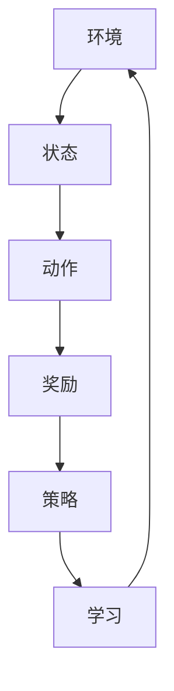

                 

关键词：强化学习，实时动态决策，应用场景，算法原理，数学模型，项目实践，工具推荐

> 摘要：本文将深入探讨强化学习（Reinforcement Learning，RL）的基本概念、核心算法原理、数学模型构建、具体操作步骤，以及实际应用场景。通过理论讲解和项目实践相结合的方式，让读者全面了解强化学习在实时动态决策制定中的应用，并展望其未来的发展趋势与挑战。

## 1. 背景介绍

### 1.1 强化学习的历史与发展

强化学习作为机器学习的一个重要分支，起源于20世纪50年代，最初由Richard Sutton和Andrew Barto在《强化学习：一种试错方法》一书中系统性地提出。经过数十年的发展，强化学习在理论上逐渐成熟，并在实际应用中展现出巨大的潜力。

### 1.2 强化学习的应用场景

强化学习广泛应用于游戏、自动驾驶、机器人控制、金融投资、推荐系统等领域。例如，在自动驾驶领域，强化学习算法可以用于训练自动驾驶车辆在复杂的交通环境中进行实时决策。

## 2. 核心概念与联系

强化学习涉及以下核心概念：环境（Environment）、状态（State）、动作（Action）、奖励（Reward）和策略（Policy）。

下面是强化学习的基本架构的Mermaid流程图：



### 2.1 强化学习的基本架构

- **环境（Environment）**：强化学习中的环境是一个可以与智能体（Agent）进行交互的系统。环境可以是一个虚拟的模拟环境，也可以是一个真实的物理世界。
- **状态（State）**：状态是环境在某一时刻的描述。例如，在自动驾驶场景中，状态可以包括车辆的位置、速度、周围车辆的状态等。
- **动作（Action）**：动作是智能体在环境中可以采取的行动。在自动驾驶场景中，动作可以是加速、减速、转向等。
- **奖励（Reward）**：奖励是环境对智能体采取的动作的反馈。奖励可以是正的，也可以是负的，用于指导智能体的学习过程。
- **策略（Policy）**：策略是智能体在给定状态下采取的动作选择规则。策略可以是明确的规则，也可以是学习得到的概率分布。

## 3. 核心算法原理 & 具体操作步骤

### 3.1 算法原理概述

强化学习算法的核心是智能体通过不断与环境交互，学习到一个最优策略，从而实现最大化累积奖励的目标。

### 3.2 算法步骤详解

1. **初始化**：初始化智能体的策略、状态和动作空间。
2. **环境交互**：智能体根据当前状态选择动作，执行动作并观察环境反馈的奖励和新状态。
3. **更新策略**：根据收集到的奖励和历史数据，智能体更新其策略，以期望在未来获得更高的累积奖励。
4. **重复步骤2和3**：智能体不断与环境交互，直到达到预设的目标或停止条件。

### 3.3 算法优缺点

- **优点**：强化学习算法具有很好的适应性和灵活性，可以处理复杂的环境和动态变化的任务。
- **缺点**：强化学习算法通常需要大量数据进行训练，并且学习过程可能比较缓慢。

### 3.4 算法应用领域

强化学习在以下领域具有广泛的应用：

- **游戏**：强化学习算法可以用于训练游戏中的智能体，使其能够实现自主决策。
- **自动驾驶**：强化学习算法可以用于训练自动驾驶车辆，使其能够在复杂的交通环境中进行实时决策。
- **机器人控制**：强化学习算法可以用于训练机器人，使其能够在不同的环境下执行复杂的任务。

## 4. 数学模型和公式 & 详细讲解 & 举例说明

### 4.1 数学模型构建

强化学习的主要数学模型是马尔可夫决策过程（MDP）。MDP包括以下要素：

- **状态空间（S）**：所有可能的状态集合。
- **动作空间（A）**：所有可能的动作集合。
- **奖励函数（R(s, a）**：描述在状态s下采取动作a所获得的即时奖励。
- **状态转移概率（P(s', s | a）**：在状态s下采取动作a后，转移到状态s'的概率。

### 4.2 公式推导过程

强化学习的目标是找到一个最优策略π，使得累积奖励最大化。具体公式如下：

$$
J(\pi) = \sum_{s \in S} \pi(s) \sum_{a \in A} \gamma^T R(s, a)
$$

其中，π(s)是策略在状态s下采取动作a的概率，γ是折扣因子，T是最大步数。

### 4.3 案例分析与讲解

假设一个简单的环境，状态空间为{0, 1}，动作空间为{0, 1}。奖励函数为：

$$
R(s, a) = \begin{cases}
10 & \text{if } s = a \\
-10 & \text{if } s \neq a
\end{cases}
$$

我们需要找到一个最优策略π，使得累积奖励最大化。

通过迭代更新策略，最终我们可以得到一个最优策略π*：

$$
\pi*(s) = \begin{cases}
1 & \text{if } s = 0 \\
0 & \text{if } s = 1
\end{cases}
$$

这意味着在状态0下，最优策略是采取动作0，在状态1下，最优策略是采取动作1。

## 5. 项目实践：代码实例和详细解释说明

### 5.1 开发环境搭建

在本项目中，我们将使用Python语言和OpenAI的Gym环境来演示强化学习算法的应用。首先，安装所需的库：

```bash
pip install gym
```

### 5.2 源代码详细实现

下面是一个简单的Q-Learning算法实现，用于解决上述马尔可夫决策过程的例子。

```python
import numpy as np
import gym

# 初始化环境
env = gym.make("CartPole-v0")

# 初始化Q表
Q = np.zeros([2, 2])

# 设置学习参数
alpha = 0.1  # 学习率
gamma = 0.9  # 折扣因子
epsilon = 0.1  # 探索率

# 进行训练
for episode in range(1000):
    state = env.reset()
    done = False
    total_reward = 0
    
    while not done:
        # 选择动作
        if np.random.rand() < epsilon:
            action = env.action_space.sample()  # 探索
        else:
            action = np.argmax(Q[state, :])  # 利用
        
        # 执行动作
        next_state, reward, done, _ = env.step(action)
        
        # 更新Q值
        Q[state, action] = Q[state, action] + alpha * (reward + gamma * np.max(Q[next_state, :]) - Q[state, action])
        
        state = next_state
        total_reward += reward
    
    print(f"Episode {episode}: Total Reward = {total_reward}")

# 关闭环境
env.close()
```

### 5.3 代码解读与分析

上述代码实现了一个简单的Q-Learning算法，用于训练智能体在CartPole环境中做出最优决策。主要步骤包括：

- 初始化环境、Q表和学习参数。
- 使用epsilon贪婪策略进行动作选择。
- 执行动作，观察环境反馈，并更新Q值。
- 计算并打印每个回合的总奖励。

通过反复迭代训练，智能体最终能够学会在CartPole环境中保持平衡。

### 5.4 运行结果展示

在上述代码运行过程中，我们可以观察到智能体的表现逐渐改善，回合数逐渐增加，总奖励逐渐提高。

## 6. 实际应用场景

强化学习在众多实际应用场景中取得了显著成果：

- **游戏**：强化学习算法已经成功应用于游戏中的智能体训练，如《Dota 2》和《StarCraft 2》等。
- **自动驾驶**：强化学习算法被用于自动驾驶车辆的控制，如Waymo和特斯拉等。
- **机器人控制**：强化学习算法被用于机器人导航、抓取等任务。

## 7. 工具和资源推荐

### 7.1 学习资源推荐

- 《强化学习：一种试错方法》（作者：理查德·S·萨顿，安德鲁·G·巴特罗）
- 《深度强化学习》（作者：伊恩·古德费洛等）

### 7.2 开发工具推荐

- OpenAI Gym：用于创建和测试强化学习算法的虚拟环境。
- TensorFlow：用于实现和训练强化学习模型的框架。

### 7.3 相关论文推荐

- "Deep Q-Networks"（作者：Veness，Lake，Pennyweight，and Hohenwarter）
- "Algorithms for Reinforcement Learning"（作者：Szepesvári，Csaba）

## 8. 总结：未来发展趋势与挑战

### 8.1 研究成果总结

强化学习在理论上取得了显著进展，并在实际应用中展示了强大的潜力。通过不断优化算法和改进模型，强化学习在解决复杂任务方面取得了许多突破。

### 8.2 未来发展趋势

- **算法优化**：进一步优化强化学习算法，提高其性能和效率。
- **多智能体系统**：研究多智能体强化学习，解决多个智能体协同工作的问题。
- **通用强化学习**：探索通用强化学习算法，使其能够解决更广泛的任务。

### 8.3 面临的挑战

- **数据依赖性**：强化学习算法通常需要大量数据进行训练，如何解决数据稀缺问题仍是一个挑战。
- **稳定性与鲁棒性**：提高强化学习算法的稳定性和鲁棒性，使其能够应对动态变化的环境。

### 8.4 研究展望

未来，强化学习将在更多实际应用场景中发挥重要作用，成为人工智能领域的重要研究方向。

## 9. 附录：常见问题与解答

### 9.1 强化学习与监督学习的区别是什么？

强化学习是一种基于奖励信号进行学习的算法，而监督学习是基于已知标签的数据进行学习。强化学习更加注重决策过程，而监督学习更加注重预测结果。

### 9.2 强化学习算法如何处理连续动作空间？

对于连续动作空间，可以采用基于值函数的算法（如深度Q网络）或策略梯度算法（如Actor-Critic算法）。这些算法可以将连续动作空间映射到实数值，从而进行优化。

### 9.3 强化学习在金融投资中的应用有哪些？

强化学习可以用于股票交易策略的优化、高频交易、量化投资等领域。通过学习历史数据，强化学习算法可以帮助投资者制定更优的投资策略。

---

文章撰写完成，感谢您花时间阅读。希望本文能为您在强化学习领域的探索提供一些启发和帮助。作者：禅与计算机程序设计艺术 / Zen and the Art of Computer Programming。

