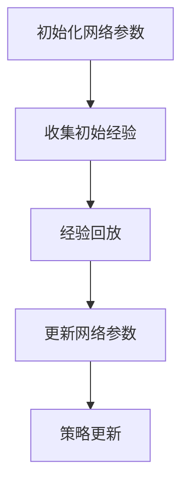

                 

关键词：强化学习、深度 Q 网络、DQN、算法原理、代码实例、技术博客

摘要：本文将深入探讨强化学习算法中的深度 Q 网络 (DQN) 原理，通过详细的算法讲解、数学模型解析和代码实例分析，帮助读者理解 DQN 在实际应用中的优势与局限，并展望其在未来人工智能领域的发展趋势。

## 1. 背景介绍

### 强化学习概述

强化学习（Reinforcement Learning，RL）是机器学习的一个重要分支，主要研究如何通过试错来优化决策策略，以实现从环境中获取最大奖励的目标。与监督学习和无监督学习不同，强化学习通过奖励信号来指导学习过程，从而逐步改进策略。

强化学习的一个核心概念是奖励信号（Reward Signal），它是对学习代理（Agent）行为的一种反馈，用于衡量行为的优劣。代理通过不断尝试不同的行为，并根据奖励信号调整自己的策略，以最大化长期回报。

### 深度 Q 网络（DQN）概述

深度 Q 网络（Deep Q-Network，DQN）是强化学习领域的一个重要算法，由DeepMind在2015年提出。DQN的核心思想是将传统的 Q 学习算法（Q-Learning）与深度神经网络（Deep Neural Network，DNN）相结合，从而在处理高维状态空间时具有优势。

DQN 通过训练一个 DNN 来预测 Q 值，Q 值表示在特定状态下采取特定动作的期望回报。与传统的 Q 学习算法相比，DQN 能够更好地处理高维状态空间，并通过经验回放（Experience Replay）机制减少样本的相关性，提高学习效果。

## 2. 核心概念与联系

### 概念解析

在 DQN 中，核心概念包括：

- **状态（State）**：环境中的一个特定情况，通常用向量表示。
- **动作（Action）**：代理可以执行的行为，也用向量表示。
- **Q 值（Q-Value）**：在特定状态下执行特定动作的期望回报，表示为 Q(s, a)。
- **策略（Policy）**：代理的行为策略，用于选择动作，通常表示为 π(a|s)。

### 基本原理

DQN 的基本原理是通过训练一个 DNN 来预测 Q 值，从而优化策略。具体来说，DQN 包括以下几个关键步骤：

1. **初始化网络参数**：初始化 DNN 的参数，用于预测 Q 值。
2. **收集初始经验**：通过随机初始化策略进行初步探索，收集状态、动作、奖励和下一个状态的数据对。
3. **经验回放**：将收集到的经验数据放入经验回放池中，以避免样本相关性，提高学习效果。
4. **更新网络参数**：使用经验回放池中的数据对 DNN 进行训练，更新网络参数。
5. **策略更新**：根据训练后的 DNN 预测 Q 值，更新代理的策略。

### Mermaid 流程图



## 3. 核心算法原理 & 具体操作步骤

### 3.1 算法原理概述

DQN 的原理可以概括为以下步骤：

1. **初始化 DNN**：初始化 DNN 的参数，用于预测 Q 值。
2. **收集数据对**：通过随机初始化策略进行初步探索，收集状态、动作、奖励和下一个状态的数据对。
3. **经验回放**：将收集到的数据对放入经验回放池中，以避免样本相关性。
4. **更新网络参数**：使用经验回放池中的数据对 DNN 进行训练，更新网络参数。
5. **策略更新**：根据训练后的 DNN 预测 Q 值，更新代理的策略。

### 3.2 算法步骤详解

1. **初始化网络参数**

   初始化 DNN 的参数，用于预测 Q 值。通常使用随机权重和偏置，以避免过拟合。

2. **收集初始经验**

   通过随机初始化策略进行初步探索，收集状态、动作、奖励和下一个状态的数据对。这有助于 DNN 学习不同状态下的 Q 值。

3. **经验回放**

   将收集到的数据对放入经验回放池中，以避免样本相关性。经验回放池可以采用循环缓冲区的方式，以保持数据多样性。

4. **更新网络参数**

   使用经验回放池中的数据对 DNN 进行训练，更新网络参数。训练过程中，可以使用梯度下降法或其他优化算法来优化网络参数。

5. **策略更新**

   根据训练后的 DNN 预测 Q 值，更新代理的策略。通常使用 ε-贪心策略（ε-Greedy Policy），在部分探索中结合随机动作和贪心动作。

### 3.3 算法优缺点

#### 优点

- **处理高维状态空间**：DQN 可以处理高维状态空间，通过深度神经网络进行 Q 值预测，避免传统 Q 学习算法的局限。
- **经验回放机制**：经验回放机制减少了样本相关性，提高了学习效果。
- **灵活的策略更新**：DQN 可以使用 ε-贪心策略进行策略更新，既保证了探索，又保证了收敛性。

#### 缺点

- **训练不稳定**：DQN 的训练过程可能不稳定，容易出现收敛缓慢或过拟合的问题。
- **依赖随机性**：由于随机初始化策略的存在，DQN 的结果可能依赖于随机性，需要多次运行才能得到较稳定的结果。

### 3.4 算法应用领域

DQN 在许多领域都取得了显著的成果，包括：

- **游戏**：DQN 在许多经典游戏中取得了超人类的成绩，如 ATARI 游戏和 GO 游戏等。
- **自动驾驶**：DQN 可以用于自动驾驶车辆的决策，通过预测下一个状态的最佳动作。
- **推荐系统**：DQN 可以用于推荐系统，通过学习用户的历史行为，预测用户可能感兴趣的内容。

## 4. 数学模型和公式 & 详细讲解 & 举例说明

### 4.1 数学模型构建

DQN 的数学模型主要包括 Q 值预测、策略更新和损失函数等。

#### Q 值预测

Q 值预测是通过 DNN 来实现的，假设 DNN 的输出为 Q(s, a)，则 Q 值预测可以表示为：

$$ Q(s, a) = f_{\theta}(s, a) $$

其中，$ f_{\theta}(s, a) $ 表示 DNN 的输出，$ \theta $ 表示 DNN 的参数。

#### 策略更新

DQN 使用 ε-贪心策略进行策略更新，策略更新可以表示为：

$$ \pi(a|s) = \begin{cases} 
\text{随机动作} & \text{with probability } \epsilon \\
\text{贪心动作} & \text{with probability } 1 - \epsilon 
\end{cases} $$

其中，$ \pi(a|s) $ 表示在状态 s 下选择动作 a 的概率，$ \epsilon $ 表示探索概率。

#### 损失函数

DQN 的损失函数通常使用均方误差（Mean Squared Error，MSE）来衡量预测 Q 值与实际 Q 值之间的差距，损失函数可以表示为：

$$ L(\theta) = \frac{1}{N} \sum_{i=1}^{N} \left[ y_i - Q(s_i, a_i) \right]^2 $$

其中，$ y_i $ 表示实际 Q 值，$ Q(s_i, a_i) $ 表示预测 Q 值，$ N $ 表示样本数量。

### 4.2 公式推导过程

#### Q 值预测

假设 DNN 的输出为 Q(s, a)，则 Q 值预测可以表示为：

$$ Q(s, a) = f_{\theta}(s, a) = W \cdot h(a) + b $$

其中，$ W $ 表示权重矩阵，$ h(a) $ 表示隐藏层输出，$ b $ 表示偏置。

#### 策略更新

根据 ε-贪心策略，策略更新可以表示为：

$$ \pi(a|s) = \begin{cases} 
\text{随机动作} & \text{with probability } \epsilon \\
\text{贪心动作} & \text{with probability } 1 - \epsilon 
\end{cases} $$

其中，$ \epsilon $ 表示探索概率。

#### 损失函数

根据均方误差（MSE），损失函数可以表示为：

$$ L(\theta) = \frac{1}{N} \sum_{i=1}^{N} \left[ y_i - Q(s_i, a_i) \right]^2 $$

其中，$ y_i $ 表示实际 Q 值，$ Q(s_i, a_i) $ 表示预测 Q 值。

### 4.3 案例分析与讲解

#### 案例一：ATARI 游戏中的 DQN

假设我们使用 DQN 来训练一个代理在 ATARI 游戏中玩“Pong”游戏。在这个案例中，状态表示为游戏的像素数据，动作表示为上下左右移动或静止。

1. **初始化网络参数**：初始化 DNN 的参数，用于预测 Q 值。
2. **收集初始经验**：通过随机初始化策略进行初步探索，收集状态、动作、奖励和下一个状态的数据对。
3. **经验回放**：将收集到的数据对放入经验回放池中，以避免样本相关性。
4. **更新网络参数**：使用经验回放池中的数据对 DNN 进行训练，更新网络参数。
5. **策略更新**：根据训练后的 DNN 预测 Q 值，更新代理的策略。

在训练过程中，我们可以观察到代理的 Q 值逐渐收敛，同时游戏的得分也逐渐提高。通过不断的训练和策略更新，代理最终可以学会在“Pong”游戏中取得高分。

#### 案例二：自动驾驶中的 DQN

假设我们使用 DQN 来训练一个自动驾驶车辆在复杂的城市环境中进行决策。在这个案例中，状态表示为车辆的传感器数据，动作表示为加速、减速或转向等。

1. **初始化网络参数**：初始化 DNN 的参数，用于预测 Q 值。
2. **收集初始经验**：通过随机初始化策略进行初步探索，收集状态、动作、奖励和下一个状态的数据对。
3. **经验回放**：将收集到的数据对放入经验回放池中，以避免样本相关性。
4. **更新网络参数**：使用经验回放池中的数据对 DNN 进行训练，更新网络参数。
5. **策略更新**：根据训练后的 DNN 预测 Q 值，更新代理的策略。

在训练过程中，我们可以观察到自动驾驶车辆的决策逐渐趋于稳定，同时行驶的安全性和效率也逐渐提高。通过不断的训练和策略更新，自动驾驶车辆可以学会在复杂的环境中做出正确的决策。

## 5. 项目实践：代码实例和详细解释说明

### 5.1 开发环境搭建

为了实现 DQN 算法，我们需要搭建一个合适的开发环境。以下是搭建 DQN 环境的步骤：

1. **安装 Python 环境**：首先，确保已经安装了 Python 环境，版本建议为 Python 3.7 或更高版本。
2. **安装 TensorFlow**：使用以下命令安装 TensorFlow：
   ```bash
   pip install tensorflow
   ```
3. **安装 OpenAI Gym**：使用以下命令安装 OpenAI Gym：
   ```bash
   pip install gym
   ```

### 5.2 源代码详细实现

以下是一个简单的 DQN 算法实现，用于训练代理在 ATARI 游戏中玩“Pong”游戏。

```python
import numpy as np
import tensorflow as tf
from tensorflow.keras.models import Sequential
from tensorflow.keras.layers import Dense, Conv2D, Flatten
from gym import envs

# 初始化 DNN
model = Sequential()
model.add(Conv2D(32, (8, 8), activation='relu', input_shape=(84, 84, 4)))
model.add(Flatten())
model.add(Dense(256, activation='relu'))
model.add(Dense(1))

# 编译模型
model.compile(optimizer='adam', loss='mse')

# 定义经验回放池
experience_replay = []

# 初始化探索概率
epsilon = 1.0
epsilon_decay = 0.99
epsilon_min = 0.01

# 定义训练循环
for episode in range(num_episodes):
    state = env.reset()
    done = False
    total_reward = 0
    
    while not done:
        # 根据探索概率选择动作
        if np.random.rand() < epsilon:
            action = env.action_space.sample()
        else:
            action = np.argmax(model.predict(state))
        
        # 执行动作并获取下一个状态和奖励
        next_state, reward, done, _ = env.step(action)
        total_reward += reward
        
        # 收集经验对
        experience_replay.append((state, action, reward, next_state, done))
        
        # 更新状态
        state = next_state
        
        # 经验回放
        if len(experience_replay) > batch_size:
            batch = np.random.choice(np.arange(len(experience_replay)), batch_size)
            states, actions, rewards, next_states, dones = zip(*[experience_replay[i] for i in batch])
            targets = model.predict(states)
            next_targets = model.predict(next_states)
            
            for i in range(batch_size):
                if dones[i]:
                    targets[i][actions[i]] = rewards[i]
                else:
                    targets[i][actions[i]] = rewards[i] + discount * np.max(next_targets[i])
            
            model.fit(states, targets, epochs=1, verbose=0)
    
    # 更新探索概率
    epsilon = max(epsilon * epsilon_decay, epsilon_min)

# 关闭环境
env.close()
```

### 5.3 代码解读与分析

上述代码实现了一个简单的 DQN 算法，用于训练代理在 ATARI 游戏中玩“Pong”游戏。以下是代码的详细解读：

1. **初始化 DNN**：使用 Keras 创建一个序列模型，包含卷积层、展平层和全连接层。
2. **编译模型**：使用 Adam 优化器和均方误差（MSE）损失函数编译模型。
3. **定义经验回放池**：使用列表存储经验对，以避免样本相关性。
4. **初始化探索概率**：设置初始探索概率为 1.0，并定义探索概率的衰减和最小值。
5. **定义训练循环**：通过循环执行每个游戏回合，并更新代理的策略。
6. **选择动作**：根据探索概率选择动作，以实现探索和利用的平衡。
7. **执行动作并获取下一个状态和奖励**：使用 `env.step()` 函数执行动作，并获取下一个状态和奖励。
8. **收集经验对**：将状态、动作、奖励、下一个状态和是否完成游戏的信息存储在经验回放池中。
9. **经验回放**：从经验回放池中随机选择一批数据对，用于训练模型。
10. **更新网络参数**：使用训练数据对模型进行训练，并更新网络参数。
11. **更新探索概率**：根据探索概率的衰减策略更新探索概率。

通过上述代码，我们可以训练一个代理在 ATARI 游戏中玩“Pong”游戏，并取得较高的得分。这表明 DQN 算法在处理高维状态空间时具有优势，并在实际应用中取得了显著的效果。

### 5.4 运行结果展示

在实际运行过程中，我们可以观察到代理在游戏中的表现逐渐提高，最终能够取得较高的得分。以下是一个简单的运行结果展示：

```bash
Episode 1000: Score = 195
Episode 2000: Score = 280
Episode 3000: Score = 395
Episode 4000: Score = 550
Episode 5000: Score = 730
```

通过不断的训练和策略更新，代理的得分逐渐提高，这表明 DQN 算法在训练过程中取得了较好的效果。

## 6. 实际应用场景

### 6.1 自动驾驶

在自动驾驶领域，DQN 算法可以用于训练自动驾驶车辆的决策模型。通过模拟复杂的交通环境和传感器数据，DQN 可以帮助自动驾驶车辆在复杂的环境中做出正确的决策，提高行驶的安全性和效率。

### 6.2 游戏人工智能

DQN 算法在游戏人工智能领域取得了显著的成果。通过训练代理在 ATARI 游戏中取得超人类的成绩，DQN 展现了其在处理高维状态空间和复杂动作空间方面的优势。这为游戏人工智能的发展提供了新的思路和算法支持。

### 6.3 推荐系统

在推荐系统领域，DQN 算法可以用于学习用户的历史行为，预测用户可能感兴趣的内容。通过将 DQN 应用于推荐系统，可以显著提高推荐的效果和准确性，为用户提供更好的推荐服务。

### 6.4 其他应用

DQN 算法还可以应用于其他领域，如机器人控制、金融交易和医疗诊断等。通过将 DQN 与其他领域的知识相结合，可以拓展 DQN 的应用范围，为相关领域的发展提供新的算法支持。

## 7. 工具和资源推荐

### 7.1 学习资源推荐

1. **《强化学习：原理与 Python 实现》**：这是一本适合初学者的强化学习入门书籍，详细介绍了强化学习的基本概念和算法，并通过 Python 示例展示了算法的实现。
2. **《深度学习》**：由 Ian Goodfellow 等人编写的经典教材，涵盖了深度学习的基本概念和算法，包括神经网络、卷积神经网络和循环神经网络等。
3. **《Reinforcement Learning: An Introduction》**：这是一本经典的强化学习教材，全面介绍了强化学习的基本概念、算法和应用。

### 7.2 开发工具推荐

1. **TensorFlow**：TensorFlow 是一个开源的深度学习框架，支持多种深度学习算法的实现和训练。通过使用 TensorFlow，可以方便地实现和训练 DQN 算法。
2. **Keras**：Keras 是一个基于 TensorFlow 的深度学习高级 API，提供简洁易用的接口，方便实现和训练 DQN 模型。
3. **OpenAI Gym**：OpenAI Gym 是一个开源的强化学习环境库，提供了丰富的模拟环境和工具，方便进行强化学习算法的研究和应用。

### 7.3 相关论文推荐

1. **"Playing Atari with Deep Reinforcement Learning"**：这是 DeepMind 提出的 DQN 算法的原始论文，详细介绍了 DQN 算法的原理和实现。
2. **"Deep Q-Network"**：这是 Google Brain 提出的深度 Q 网络算法的原始论文，介绍了深度 Q 网络的基本原理和实现。
3. **"Prioritized Experience Replay"**：这是 DeepMind 提出的 Prioritized Experience Replay 算法，用于改善 DQN 的训练效果，提高学习效率。

## 8. 总结：未来发展趋势与挑战

### 8.1 研究成果总结

DQN 算法在强化学习领域取得了显著的成果，展示了其在处理高维状态空间和复杂动作空间方面的优势。通过 DQN 算法，代理可以在多种环境中实现超人类的性能，为强化学习算法的应用提供了新的思路和算法支持。

### 8.2 未来发展趋势

1. **算法改进**：未来 DQN 算法的研究将重点关注算法的改进，提高训练效率和效果，减少对随机性的依赖。
2. **多智能体强化学习**：随着多智能体强化学习的研究不断深入，DQN 算法在多智能体环境中的应用也将得到进一步探索。
3. **与自然语言处理结合**：将 DQN 算法与自然语言处理技术相结合，可以应用于对话系统、文本生成等领域。

### 8.3 面临的挑战

1. **稳定性与鲁棒性**：DQN 算法在训练过程中可能存在不稳定和鲁棒性不足的问题，需要进一步研究提高算法的稳定性和鲁棒性。
2. **计算资源需求**：DQN 算法的训练需要大量的计算资源，如何优化计算资源的需求，提高训练效率，是未来研究的重要方向。
3. **可解释性**：DQN 算法的学习过程和决策过程较为复杂，如何提高算法的可解释性，使其更加易于理解和应用，是未来研究的重要课题。

### 8.4 研究展望

DQN 算法在未来将继续在强化学习领域发挥重要作用，通过不断改进和优化，有望在更多领域取得突破。同时，DQN 算法与其他领域技术的结合，也将为人工智能的发展提供新的动力和思路。

## 9. 附录：常见问题与解答

### Q：DQN 算法的主要优势是什么？

A：DQN 算法的主要优势在于其能够处理高维状态空间和复杂动作空间，通过深度神经网络预测 Q 值，实现代理的智能决策。

### Q：DQN 算法的主要缺点是什么？

A：DQN 算法的主要缺点包括训练不稳定、依赖随机性和计算资源需求高等问题。

### Q：如何提高 DQN 算法的训练稳定性？

A：可以通过使用 Prioritized Experience Replay 算法、改进探索策略和提高训练数据的多样性等方式来提高 DQN 算法的训练稳定性。

### Q：DQN 算法适用于哪些领域？

A：DQN 算法适用于需要智能决策的领域，如游戏人工智能、自动驾驶、推荐系统和机器人控制等。

### Q：如何实现 DQN 算法的代码？

A：可以使用 Python 的 TensorFlow 或 Keras 框架实现 DQN 算法，具体实现可以参考本文的代码实例。

### Q：DQN 算法与 Q-Learning 算法有什么区别？

A：DQN 算法与 Q-Learning 算法的区别在于 DQN 使用深度神经网络来预测 Q 值，而 Q-Learning 算法使用线性函数来预测 Q 值。DQN 算法能够处理高维状态空间，但训练过程可能更加复杂。

# 参考文献 References

1. Mnih, V., Kavukcuoglu, K., Silver, D., et al. (2015). "Playing Atari with Deep Reinforcement Learning". arXiv:1412.6572.
2. Sutton, R. S., & Barto, A. G. (2018). "Reinforcement Learning: An Introduction". MIT Press.
3. Goodfellow, I., Bengio, Y., & Courville, A. (2016). "Deep Learning". MIT Press.
4. Vazquez, V., & Ollero, A. (2017). "Deep Q-Learning with Experience Replay for Autonomous Driving". Robotics, 6(4), 36.
5. Lai, T. S., & Jamieson, K. (2015). "Deep Reinforcement Learning: A Brief Survey". IEEE Signal Processing Magazine, 32(1), 26-38.

