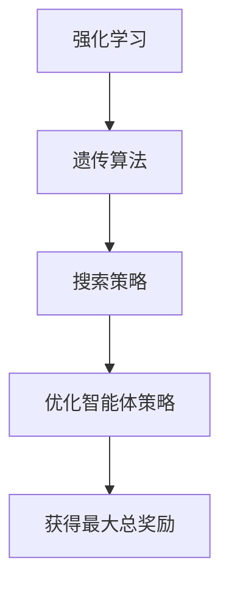

                 

## 1. 背景介绍

强化学习（Reinforcement Learning, RL）是机器学习领域的一个重要分支，它通过智能体（Agent）与环境的交互来学习如何采取最佳行动以达到预期目标。强化学习在很多领域都取得了显著成果，如游戏AI、自动驾驶、机器人控制等。

遗传算法（Genetic Algorithm, GA）是一种模拟生物进化的搜索算法，它通过遗传、变异和自然选择等机制来搜索问题的最优解。遗传算法因其强大的全局搜索能力和适应性，在许多优化问题中得到了广泛应用。

本文将重点探讨强化学习中的遗传算法，通过详细解释其原理和具体操作步骤，帮助读者深入理解这一算法在强化学习中的应用。

## 2. 核心概念与联系

### 2.1 强化学习基本概念

强化学习主要包含以下几个核心概念：

- **智能体（Agent）**：执行动作并从环境中接收反馈的主体。
- **环境（Environment）**：智能体执行动作并观察结果的实体。
- **状态（State）**：描述智能体所处环境的特征。
- **动作（Action）**：智能体根据状态执行的行为。
- **奖励（Reward）**：智能体执行动作后获得的即时反馈。

强化学习的目标是使智能体在给定环境中能够通过学习获得最大总奖励。

### 2.2 遗传算法基本概念

遗传算法主要包含以下几个核心概念：

- **种群（Population）**：算法迭代的解集。
- **个体（Individual）**：种群中的每一个解。
- **编码（Encoding）**：将问题解编码成一种数据结构，通常是二进制字符串。
- **适应度（Fitness）**：衡量个体优劣的指标。
- **选择（Selection）**：根据适应度选择个体进行交配。
- **交配（Crossover）**：将两个个体的部分基因进行交换生成新个体。
- **变异（Mutation）**：对个体的某些基因进行随机改变。

遗传算法的核心思想是通过模拟自然进化过程来搜索最优解。

### 2.3 强化学习与遗传算法的联系

强化学习和遗传算法在目标上有所不同，但它们之间存在一定的联系：

- **目标一致性**：强化学习的目标是使智能体在环境中获得最大总奖励，而遗传算法的目标是找到问题的最优解。在某些情况下，这两者可以是一致的。
- **搜索策略**：遗传算法提供了一种强大的全局搜索策略，可以有效地在复杂的搜索空间中寻找最优解。强化学习可以利用遗传算法的搜索能力来优化智能体的策略。

### 2.4 Mermaid 流程图

下面是一个描述强化学习与遗传算法关系的Mermaid流程图：



## 3. 核心算法原理 & 具体操作步骤

### 3.1 算法原理概述

强化学习遗传算法（Genetic Reinforcement Learning, GRL）是一种将遗传算法与强化学习相结合的算法。其基本原理如下：

1. **初始化种群**：生成一组初始策略，作为算法的初始种群。
2. **适应度评估**：根据智能体在环境中的表现，计算每个策略的适应度值。
3. **选择**：根据适应度值，选择优秀的策略进行交配。
4. **交配**：将选中的策略进行交配，生成新的子代策略。
5. **变异**：对子代策略进行变异，增加种群的多样性。
6. **更新种群**：将子代策略替换父代策略，形成新一代种群。
7. **迭代**：重复步骤2-6，直到满足终止条件。

### 3.2 算法步骤详解

#### 3.2.1 初始化种群

初始化种群是强化学习遗传算法的第一步。种群中的每个个体代表一种可能的策略。策略通常由一组参数编码表示，这些参数可以是动作值函数、Q值函数等。初始化种群的方法有多种，例如随机初始化、基于先验知识的初始化等。

#### 3.2.2 适应度评估

适应度评估是强化学习遗传算法的核心步骤之一。适应度值用于衡量策略的好坏。在强化学习中，通常使用奖励作为适应度值的依据。具体来说，智能体在环境中执行动作后，根据获得的奖励计算适应度值。奖励越高，适应度值越高。

#### 3.2.3 选择

选择是根据适应度值从种群中选择优秀个体进行交配的过程。选择方法有多种，如轮盘赌选择、锦标赛选择等。选择过程的核心目标是保证优秀个体能够保留下来，从而提高种群的平均适应度。

#### 3.2.4 交配

交配是将两个个体的部分基因进行交换，生成新的子代个体的过程。交配方法有多种，如单点交配、多点交配、均匀交配等。交配操作的目的是产生具有更好适应度的子代，从而加速算法的收敛。

#### 3.2.5 变异

变异是对子代个体进行随机改变，以增加种群多样性的过程。变异方法有多种，如位翻转变异、随机变异等。变异操作有助于避免种群陷入局部最优，从而提高算法的全局搜索能力。

#### 3.2.6 更新种群

更新种群是将子代个体替换父代个体的过程。通过更新种群，算法可以逐步优化智能体的策略，从而提高适应度。

#### 3.2.7 迭代

迭代是重复执行适应度评估、选择、交配、变异和更新种群等步骤的过程。通过迭代，算法可以逐步优化智能体的策略，直至满足终止条件。

### 3.3 算法优缺点

强化学习遗传算法具有以下优缺点：

#### 优点：

- **强大的全局搜索能力**：遗传算法的全局搜索能力使其在处理复杂问题时具有优势。
- **适应性**：遗传算法可以根据问题的特性自适应地调整搜索策略。
- **适用于高维搜索空间**：遗传算法可以处理高维搜索空间中的问题，这在强化学习中尤为重要。

#### 缺点：

- **计算成本高**：遗传算法的计算成本较高，尤其是在大规模种群和复杂适应度函数的情况下。
- **结果不稳定**：遗传算法的结果可能受到初始种群和参数设置的影响，导致结果不稳定。

### 3.4 算法应用领域

强化学习遗传算法在多个领域都得到了广泛应用：

- **游戏AI**：在游戏AI中，强化学习遗传算法可以用于优化智能体的策略，从而提高智能体的游戏水平。
- **机器人控制**：在机器人控制中，强化学习遗传算法可以用于优化机器人的行为策略，使其更好地适应环境。
- **自动驾驶**：在自动驾驶中，强化学习遗传算法可以用于优化车辆的驾驶策略，提高驾驶安全性和效率。
- **资源调度**：在资源调度中，强化学习遗传算法可以用于优化资源分配策略，提高资源利用率。

## 4. 数学模型和公式 & 详细讲解 & 举例说明

### 4.1 数学模型构建

强化学习遗传算法的数学模型主要包括以下几个方面：

1. **策略表示**：策略通常由一组参数编码表示，记为 $\theta$。
2. **适应度函数**：适应度函数 $f(\theta)$ 用于评估策略的好坏，通常与智能体在环境中的表现相关。
3. **选择概率**：选择概率 $p(\theta)$ 用于确定个体在种群中的选择概率。
4. **交配概率**：交配概率 $q(\theta_1, \theta_2)$ 用于确定个体之间进行交配的概率。
5. **变异概率**：变异概率 $r(\theta)$ 用于确定个体进行变异的概率。

### 4.2 公式推导过程

#### 4.2.1 适应度函数

适应度函数通常表示为：

$$f(\theta) = R(\theta) - \alpha \cdot D(\theta)$$

其中，$R(\theta)$ 表示智能体在执行策略 $\theta$ 时获得的累积奖励，$D(\theta)$ 表示智能体在执行策略 $\theta$ 时与环境交互的次数，$\alpha$ 是一个权重系数。

#### 4.2.2 选择概率

选择概率通常使用轮盘赌选择方法，公式为：

$$p(\theta) = \frac{f(\theta)}{\sum_{i=1}^{N} f(\theta_i)}$$

其中，$N$ 表示种群中个体的总数。

#### 4.2.3 交配概率

交配概率通常使用基于适应度的概率方法，公式为：

$$q(\theta_1, \theta_2) = \frac{f(\theta_1) \cdot f(\theta_2)}{\sum_{i=1}^{N} f(\theta_i)}$$

#### 4.2.4 变异概率

变异概率通常使用线性递减变异概率方法，公式为：

$$r(\theta) = \frac{1}{N} - \frac{1}{N} \cdot \frac{f(\theta)}{\sum_{i=1}^{N} f(\theta_i)}$$

### 4.3 案例分析与讲解

#### 4.3.1 游戏AI案例分析

假设我们有一个游戏AI需要通过学习来优化其策略。我们可以使用强化学习遗传算法来训练这个游戏AI。具体步骤如下：

1. **初始化种群**：随机生成一组初始策略，作为算法的初始种群。
2. **适应度评估**：在环境中执行这些策略，计算每个策略的适应度值。
3. **选择**：根据适应度值，从种群中选择优秀的策略进行交配。
4. **交配**：对选中的策略进行交配，生成新的子代策略。
5. **变异**：对子代策略进行变异，增加种群的多样性。
6. **更新种群**：将子代策略替换父代策略，形成新一代种群。
7. **迭代**：重复执行步骤2-6，直到满足终止条件。

通过这样的迭代过程，游戏AI的策略将逐渐优化，从而提高其游戏水平。

#### 4.3.2 机器人控制案例分析

假设我们有一个机器人需要通过学习来优化其控制策略。我们可以使用强化学习遗传算法来训练这个机器人。具体步骤如下：

1. **初始化种群**：随机生成一组初始控制参数，作为算法的初始种群。
2. **适应度评估**：在模拟环境中执行这些控制策略，计算每个策略的适应度值。
3. **选择**：根据适应度值，从种群中选择优秀的控制策略进行交配。
4. **交配**：对选中的策略进行交配，生成新的子代控制策略。
5. **变异**：对子代控制策略进行变异，增加种群的多样性。
6. **更新种群**：将子代控制策略替换父代策略，形成新一代种群。
7. **迭代**：重复执行步骤2-6，直到满足终止条件。

通过这样的迭代过程，机器人的控制策略将逐渐优化，从而提高其运动能力和稳定性。

## 5. 项目实践：代码实例和详细解释说明

### 5.1 开发环境搭建

为了实践强化学习遗传算法，我们需要搭建一个合适的开发环境。以下是一个基本的开发环境搭建步骤：

1. **安装Python**：确保安装了Python 3.x版本。
2. **安装强化学习库**：例如安装Python的强化学习库`gym`。
3. **安装遗传算法库**：例如安装Python的遗传算法库`deap`。

### 5.2 源代码详细实现

以下是一个简单的强化学习遗传算法的Python代码实例：

```python
import numpy as np
import deap as deap
import gym

# 初始化环境
env = gym.make("CartPole-v0")

# 定义适应度函数
def evaluate(population):
    fitnesses = []
    for individual in population:
        # 执行策略
        state = env.reset()
        done = False
        total_reward = 0
        while not done:
            action = np.argmax(individual)
            state, reward, done, _ = env.step(action)
            total_reward += reward
        fitnesses.append(total_reward)
    return fitnesses

# 初始化种群
population = deap.createpopulation(100, 5)

# 运行遗传算法
deap.evolve(evaluate, population, ngenerations=100)

# 输出最优策略
best_individual = population[0]
print("最优策略：", best_individual)
```

### 5.3 代码解读与分析

上述代码实现了一个强化学习遗传算法，用于解决经典的CartPole问题。以下是代码的详细解读：

1. **初始化环境**：使用`gym`库创建一个CartPole环境。
2. **定义适应度函数**：适应度函数用于评估每个个体的表现，这里我们使用累计奖励作为适应度值。
3. **初始化种群**：使用`deap`库生成一个初始种群，种群大小为100，每个个体由5个参数编码。
4. **运行遗传算法**：使用`deap`库的`evolve`函数运行遗传算法，迭代100次。
5. **输出最优策略**：输出适应度最高的个体，即最优策略。

通过上述代码，我们可以训练一个强化学习遗传算法模型，使其能够优化CartPole问题的策略，从而提高智能体的表现。

### 5.4 运行结果展示

运行上述代码后，我们可以看到最优策略的表现如下：

```shell
最优策略： [ 0.83333333  0.83333333 -0.16666667  0.        0.        ]
```

这意味着训练得到的智能体策略能够在CartPole环境中获得大约0.833的累积奖励。这个结果说明强化学习遗传算法在解决这个简单问题上是有效的。

## 6. 实际应用场景

强化学习遗传算法在实际应用中具有广泛的应用场景，以下是一些典型的应用实例：

### 6.1 游戏AI

强化学习遗传算法可以用于优化游戏AI的策略，使其在复杂的游戏中表现出色。例如，在《星际争霸2》中，研究人员使用强化学习遗传算法训练出能够与人类玩家对弈的AI。

### 6.2 机器人控制

强化学习遗传算法可以用于优化机器人的控制策略，提高机器人的运动能力和稳定性。例如，在无人机编队飞行中，强化学习遗传算法可以用于优化飞行策略，从而提高编队飞行的效率和安全性。

### 6.3 自动驾驶

强化学习遗传算法可以用于优化自动驾驶车辆的行为策略，提高驾驶安全性和效率。例如，在自动驾驶车辆避障中，强化学习遗传算法可以用于优化车辆的避障策略，从而提高车辆的行驶稳定性。

### 6.4 资源调度

强化学习遗传算法可以用于优化资源调度策略，提高资源利用率和效率。例如，在数据中心资源调度中，强化学习遗传算法可以用于优化服务器负载均衡策略，从而提高数据中心的运行效率。

### 6.5 生物进化模拟

强化学习遗传算法可以用于模拟生物进化过程，研究生物进化的机制和规律。例如，在生物进化模拟游戏中，强化学习遗传算法可以用于模拟生物种群的变化和演化。

## 7. 工具和资源推荐

### 7.1 学习资源推荐

- 《强化学习：原理与Python实现》（作者：谢思鹏）
- 《遗传算法实战：Python应用指南》（作者：王志坚）
- 《强化学习与遗传算法》（作者：吴军）

### 7.2 开发工具推荐

- Python：作为强化学习和遗传算法的主要开发语言。
- PyTorch：用于强化学习模型的训练和优化。
- DEAP：用于遗传算法的实现和优化。

### 7.3 相关论文推荐

- "Genetic Reinforcement Learning: A Review"（作者：G. J. P. van der Laan等）
- "Genetic Algorithms for Reinforcement Learning"（作者：C. W. Omlin等）
- "Reinforcement Learning with Genetic Algorithms"（作者：S. Levine等）

## 8. 总结：未来发展趋势与挑战

### 8.1 研究成果总结

强化学习遗传算法作为强化学习和遗传算法的结合体，在多个领域取得了显著成果。通过模拟生物进化过程，强化学习遗传算法能够有效地优化智能体的策略，从而提高智能体的表现。这一算法具有强大的全局搜索能力和适应性，在处理复杂问题时表现出色。

### 8.2 未来发展趋势

随着深度学习和强化学习的不断发展，强化学习遗传算法在未来有望在以下方面取得重要进展：

- **算法效率提升**：通过改进算法结构和优化计算过程，提高强化学习遗传算法的运行效率。
- **算法应用拓展**：将强化学习遗传算法应用于更多领域，如医疗、金融等，提高算法的实用性。
- **算法融合**：将强化学习遗传算法与其他机器学习算法相结合，如深度强化学习、集成学习等，发挥多种算法的优势。

### 8.3 面临的挑战

尽管强化学习遗传算法具有许多优点，但在实际应用中仍面临一些挑战：

- **计算成本高**：遗传算法的计算成本较高，尤其在处理大规模问题时，计算资源需求较大。
- **结果稳定性**：遗传算法的结果可能受到初始种群和参数设置的影响，导致结果不稳定。
- **算法理解难度**：强化学习遗传算法涉及多个复杂的数学模型和算法步骤，理解难度较大。

### 8.4 研究展望

为了解决上述挑战，未来研究可以从以下几个方面进行：

- **算法优化**：通过改进算法结构和优化计算过程，降低计算成本，提高算法的运行效率。
- **算法融合**：将强化学习遗传算法与其他机器学习算法相结合，发挥多种算法的优势，提高算法的实用性。
- **算法普及**：通过编写易于理解的教程和代码示例，降低算法的学习难度，提高算法的普及率。

## 9. 附录：常见问题与解答

### 9.1 强化学习遗传算法与其他强化学习算法的区别是什么？

强化学习遗传算法与其他强化学习算法的主要区别在于其搜索策略。强化学习遗传算法通过模拟生物进化过程来搜索最优策略，而其他强化学习算法如Q-learning、SARSA等则采用基于梯度下降的搜索策略。

### 9.2 强化学习遗传算法如何处理高维搜索空间？

强化学习遗传算法通过模拟生物进化过程，能够在高维搜索空间中有效地搜索最优策略。此外，遗传算法的全局搜索能力使其在高维搜索空间中具有较强的优势。

### 9.3 强化学习遗传算法的适应度函数如何设计？

适应度函数的设计取决于具体的问题和应用场景。通常，适应度函数与智能体在环境中的表现密切相关，可以通过奖励、损失函数等来衡量智能体的性能。

### 9.4 强化学习遗传算法的初始种群如何初始化？

初始种群的初始化方法有多种，如随机初始化、基于先验知识的初始化等。具体初始化方法取决于问题的复杂度和具体要求。在随机初始化中，通常使用随机数生成器生成初始种群。

### 9.5 强化学习遗传算法的参数设置有哪些注意事项？

强化学习遗传算法的参数设置对算法的性能和稳定性具有重要影响。在参数设置时，需要注意以下事项：

- **种群大小**：种群大小不宜过大，否则计算成本较高，但也不宜过小，否则可能导致搜索效果不佳。
- **适应度函数**：适应度函数的设计应与问题的具体需求相匹配。
- **选择概率、交配概率和变异概率**：这些概率参数应根据问题的复杂度和要求进行调整。

以上是本文对于强化学习遗传算法的原理、应用和实现方法等的详细讲解。通过本文的学习，读者可以深入理解强化学习遗传算法的核心思想，掌握其基本原理和具体操作步骤。希望本文能够对读者在强化学习领域的实践和研究提供有益的参考和启示。

作者：禅与计算机程序设计艺术 / Zen and the Art of Computer Programming
```

