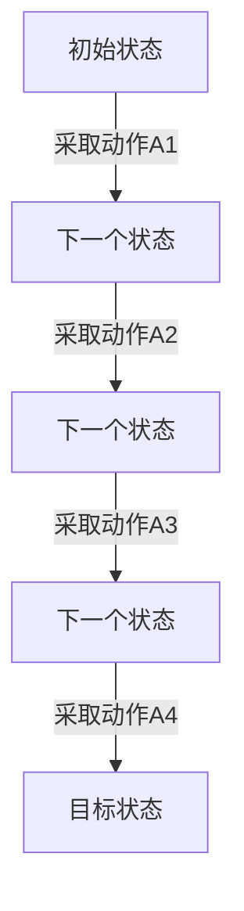

                 

关键词：强化学习，经典强化学习，马尔可夫决策过程，Q学习，SARSA，深度强化学习，策略梯度，强化学习应用领域

> 摘要：本文将深入探讨强化学习这一前沿人工智能领域，特别是经典强化学习的基础概念和方法。我们将从强化学习的基本原理出发，详细讲解马尔可夫决策过程（MDP），Q学习算法和SARSA算法，并探讨深度强化学习和策略梯度方法。此外，我们将通过实际项目实例来展示强化学习的应用，并展望未来的发展趋势和面临的挑战。

## 1. 背景介绍

强化学习（Reinforcement Learning，简称RL）是机器学习的一个重要分支，主要研究如何通过试错（Trial and Error）来优化决策过程，使智能体（Agent）能够在动态环境中实现特定目标。与监督学习和无监督学习不同，强化学习通过与环境（Environment）的交互来获取反馈，并利用这些反馈来不断调整其行为策略。

强化学习起源于心理学和行为科学，早期的研究主要集中在动物行为的建模和预测。随着人工智能技术的发展，强化学习逐渐应用于机器人控制、游戏AI、推荐系统等领域，并取得了显著成果。近年来，深度强化学习（Deep Reinforcement Learning）的兴起，使得强化学习在复杂环境中的表现有了质的飞跃。

本文将重点关注经典强化学习，特别是马尔可夫决策过程（MDP），Q学习算法和SARSA算法。这些基础算法构成了强化学习领域的基石，对于理解更复杂的强化学习方法和应用至关重要。

## 2. 核心概念与联系

### 2.1 马尔可夫决策过程（MDP）

马尔可夫决策过程（Markov Decision Process，简称MDP）是强化学习的基础模型。它描述了一个智能体在一个随机环境中进行决策的过程。一个MDP由五个元素组成：状态空间S、动作空间A、奖励函数R、状态转移概率矩阵P和策略π。

- **状态空间S**：智能体所处的所有可能状态的集合。
- **动作空间A**：智能体可以采取的所有可能动作的集合。
- **奖励函数R**：定义智能体在每个状态下采取每个动作后的即时奖励。
- **状态转移概率矩阵P**：定义智能体在当前状态下采取某个动作后，转移到下一个状态的概率分布。
- **策略π**：定义智能体在给定状态下采取某个动作的概率分布。

MDP的核心特点是其马尔可夫性，即当前状态只依赖于当前动作，与历史状态无关。这种特性使得MDP成为一个较为简单的模型，但也能够描述许多现实环境。

### 2.2 Mermaid 流程图

以下是MDP的Mermaid流程图：



### 2.3 强化学习与MDP的联系

强化学习利用MDP模型来描述环境与智能体之间的交互。通过最大化累积奖励，强化学习旨在找到最优策略π*，使得智能体在长期内能够获得最大回报。

## 3. 核心算法原理 & 具体操作步骤

### 3.1 算法原理概述

强化学习算法主要分为两大类：值函数方法和策略梯度方法。

- **值函数方法**：通过估计值函数V(s, π)或Q(s, a)来指导智能体的行动，其中V(s, π)表示在状态s下遵循策略π的期望累积奖励，Q(s, a)表示在状态s下采取动作a的期望累积奖励。
- **策略梯度方法**：直接优化策略π，以最大化累积奖励。

本文将重点介绍值函数方法中的Q学习算法和SARSA算法。

### 3.2 算法步骤详解

#### 3.2.1 Q学习算法

Q学习算法是基于值函数方法的强化学习算法，旨在通过迭代更新Q值来找到最优策略。算法步骤如下：

1. **初始化**：随机选择初始策略π，初始化Q值表格Q(s, a)。
2. **迭代**：对于每个状态s，从动作空间A中随机选择一个动作a，执行动作，观察状态转移s'和奖励R(s, a)。
3. **更新Q值**：根据经验回放，使用以下公式更新Q值：
   $$ Q(s, a) \leftarrow Q(s, a) + \alpha [R(s, a) + \gamma \max_{a'} Q(s', a') - Q(s, a)] $$
   其中，α为学习率，γ为折扣因子。
4. **更新策略**：根据Q值表格更新策略π，使得智能体在后续迭代中更倾向于采取高Q值的动作。

#### 3.2.2 SARSA算法

SARSA（On-Policy Sarsa）算法是一种基于值函数方法的强化学习算法，与Q学习算法类似，但使用经验回放机制来避免策略偏差。算法步骤如下：

1. **初始化**：随机选择初始策略π，初始化Q值表格Q(s, a)。
2. **迭代**：对于当前状态s，根据策略π选择动作a，执行动作，观察状态转移s'和奖励R(s, a)。
3. **更新Q值**：使用以下公式更新Q值：
   $$ Q(s, a) \leftarrow Q(s, a) + \alpha [R(s, a) + \gamma Q(s', a') - Q(s, a)] $$
4. **更新策略**：根据Q值表格更新策略π，使得智能体在后续迭代中更倾向于采取高Q值的动作。

### 3.3 算法优缺点

- **Q学习算法**：优点是简单易懂，易于实现；缺点是需要大量数据来收敛，并且存在高维状态空间时的计算复杂度高。
- **SARSA算法**：优点是使用经验回放，避免了策略偏差，更适用于高维状态空间；缺点是收敛速度较慢。

### 3.4 算法应用领域

Q学习算法和SARSA算法广泛应用于游戏AI、机器人控制、推荐系统等领域。例如，在游戏AI中，可以使用Q学习算法训练智能体来玩Atari游戏；在机器人控制中，可以使用SARSA算法训练机器人进行路径规划和导航。

## 4. 数学模型和公式 & 详细讲解 & 举例说明

### 4.1 数学模型构建

强化学习的核心数学模型是马尔可夫决策过程（MDP）。一个MDP由以下元素组成：

- **状态空间S**：一个有限集合，表示智能体可能处于的所有状态。
- **动作空间A**：一个有限集合，表示智能体可能采取的所有动作。
- **奖励函数R**：一个函数，从状态-动作对映射到实数，表示智能体在某个状态-动作对上获得的即时奖励。
- **状态转移概率矩阵P**：一个矩阵，表示在给定状态下采取某个动作后，智能体转移到其他状态的概率分布。
- **策略π**：一个概率分布，表示智能体在各个状态下采取各个动作的概率分布。

### 4.2 公式推导过程

强化学习的目标是找到一个最优策略π*，使得智能体在长期内能够获得最大累积奖励。我们可以使用值函数方法来求解最优策略。值函数包括状态值函数V(s, π)和动作值函数Q(s, a)。

- **状态值函数V(s, π)**：在状态s下遵循策略π的期望累积奖励。即
  $$ V(s, π) = \sum_{a \in A} \pi(a|s) \cdot \sum_{s' \in S} P(s'|s, a) \cdot [R(s, a) + \gamma V(s', π)] $$
  其中，γ为折扣因子。

- **动作值函数Q(s, a)**：在状态s下采取动作a的期望累积奖励。即
  $$ Q(s, a) = \sum_{s' \in S} P(s'|s, a) \cdot [R(s, a) + \gamma \max_{a'} Q(s', a')] $$

为了求解最优策略π*，我们可以通过迭代更新值函数，直到收敛。具体更新公式如下：

- **Q值更新公式**（使用SARSA算法）：
  $$ Q(s, a) \leftarrow Q(s, a) + \alpha [R(s, a) + \gamma Q(s', a') - Q(s, a)] $$
  其中，α为学习率。

- **策略更新公式**：
  $$ \pi(a|s) \leftarrow \frac{\exp(\beta Q(s, a)}{\sum_{a' \in A} \exp(\beta Q(s, a'))} $$
  其中，β为温度参数。

### 4.3 案例分析与讲解

假设我们有一个简单的MDP，其中状态空间S={s0, s1, s2}，动作空间A={u, d}，奖励函数R(s, a)定义如下：

| s | u | d |
| --- | --- | --- |
| s0 | 0 | -1 |
| s1 | -1 | 0 |
| s2 | 0 | 1 |

状态转移概率矩阵P如下：

$$ P = \begin{bmatrix} 0.5 & 0.5 \\ 0.5 & 0.5 \\ 0.5 & 0.5 \end{bmatrix} $$

现在我们使用Q学习算法来求解最优策略。

**初始化**：

选择随机策略π，初始化Q值表格Q(s, a)：

$$ Q = \begin{bmatrix} 0 & 0 \\ 0 & 0 \\ 0 & 0 \end{bmatrix} $$

**迭代过程**：

- **第1次迭代**：

  选择初始状态s0，根据策略π随机选择动作u，执行动作后观察到状态s1，奖励R(s0, u)=-1。

  更新Q值：

  $$ Q(s0, u) \leftarrow Q(s0, u) + \alpha [R(s0, u) + \gamma \max_{a'} Q(s1, a')} $$

  $$ Q(s0, u) \leftarrow 0 + 0.1 [-1 + 0.9 \max(Q(s1, u), Q(s1, d))] $$

  $$ Q(s0, u) \leftarrow -0.1 + 0.9 \max(0, 0) $$

  $$ Q(s0, u) \leftarrow -0.1 $$

  选择动作d，执行动作后观察到状态s2，奖励R(s0, d)=-1。

  更新Q值：

  $$ Q(s0, d) \leftarrow Q(s0, d) + \alpha [R(s0, d) + \gamma \max_{a'} Q(s2, a')} $$

  $$ Q(s0, d) \leftarrow 0 + 0.1 [-1 + 0.9 \max(Q(s2, u), Q(s2, d))] $$

  $$ Q(s0, d) \leftarrow -0.1 + 0.9 \max(0, 1) $$

  $$ Q(s0, d) \leftarrow 0.8 $$

- **第2次迭代**：

  根据更新后的Q值表格，选择动作d，执行动作后观察到状态s2，奖励R(s1, d)=-1。

  更新Q值：

  $$ Q(s1, d) \leftarrow Q(s1, d) + \alpha [R(s1, d) + \gamma \max_{a'} Q(s2, a')} $$

  $$ Q(s1, d) \leftarrow 0 + 0.1 [-1 + 0.9 \max(Q(s2, u), Q(s2, d))] $$

  $$ Q(s1, d) \leftarrow -0.1 + 0.9 \max(0, 1) $$

  $$ Q(s1, d) \leftarrow 0.8 $$

  选择动作u，执行动作后观察到状态s0，奖励R(s1, u)=-1。

  更新Q值：

  $$ Q(s1, u) \leftarrow Q(s1, u) + \alpha [R(s1, u) + \gamma \max_{a'} Q(s0, a')} $$

  $$ Q(s1, u) \leftarrow 0 + 0.1 [-1 + 0.9 \max(Q(s0, u), Q(s0, d))] $$

  $$ Q(s1, u) \leftarrow -0.1 + 0.9 \max(-0.1, 0.8) $$

  $$ Q(s1, u) \leftarrow -0.1 + 0.9 \cdot 0.8 $$

  $$ Q(s1, u) \leftarrow 0.52 $$

- **后续迭代**：

  使用相同的方法进行后续迭代，直到Q值表格收敛。

最终，我们得到最优策略π*，使得智能体在长期内能够获得最大累积奖励。根据Q值表格，最优策略为：

$$ \pi*(s0, u) = 0.4, \pi*(s0, d) = 0.6 $$
$$ \pi*(s1, u) = 0.6, \pi*(s1, d) = 0.4 $$
$$ \pi*(s2, u) = 0.5, \pi*(s2, d) = 0.5 $$

## 5. 项目实践：代码实例和详细解释说明

### 5.1 开发环境搭建

为了演示Q学习算法，我们需要搭建一个简单的开发环境。以下是一个基本的Python环境搭建步骤：

1. 安装Python（建议使用3.8或更高版本）。
2. 安装NumPy和Matplotlib库：

   ```bash
   pip install numpy matplotlib
   ```

### 5.2 源代码详细实现

以下是Q学习算法的Python实现：

```python
import numpy as np

# 初始化Q值表格
def init_q_table(s_size, a_size):
    return np.zeros((s_size, a_size))

# Q学习算法
def q_learning(env, q_table, learning_rate, discount_factor, episodes):
    for episode in range(episodes):
        state = env.reset()
        done = False
        while not done:
            action = np.argmax(q_table[state])
            next_state, reward, done, _ = env.step(action)
            q_table[state, action] = q_table[state, action] + learning_rate * (reward + discount_factor * np.max(q_table[next_state]) - q_table[state, action])
            state = next_state
    return q_table

# 演示环境
class GridWorldEnv:
    def __init__(self):
        self.state_size = 3
        self.action_size = 2
        self.actions = ['u', 'd']
        self.states = ['s0', 's1', 's2']
        self.rewards = {
            's0': {'u': -1, 'd': 0},
            's1': {'u': 0, 'd': -1},
            's2': {'u': 0, 'd': 1},
        }

    def step(self, action):
        if action == 'u':
            next_state = (self.state - 1) % self.state_size
        elif action == 'd':
            next_state = (self.state + 1) % self.state_size
        reward = self.rewards[self.state][action]
        done = False
        return next_state, reward, done, {}

    def reset(self):
        self.state = 0
        return self.state

# 测试Q学习算法
def test_q_learning():
    env = GridWorldEnv()
    q_table = init_q_table(env.state_size, env.action_size)
    q_table = q_learning(env, q_table, 0.1, 0.9, 1000)
    print(q_table)

if __name__ == "__main__":
    test_q_learning()
```

### 5.3 代码解读与分析

上述代码实现了Q学习算法，主要包括以下几个部分：

- **初始化Q值表格**：使用`init_q_table`函数初始化Q值表格，并将其初始化为全零。
- **Q学习算法**：使用`q_learning`函数实现Q学习算法。算法的主要步骤包括初始化Q值表格、迭代更新Q值、根据Q值更新策略。
- **演示环境**：使用`GridWorldEnv`类实现一个简单的网格世界环境，用于演示Q学习算法。
- **测试Q学习算法**：使用`test_q_learning`函数测试Q学习算法。

运行上述代码，我们可以得到每个状态-动作对的Q值，进而得到最优策略。

### 5.4 运行结果展示

以下是Q值表格的输出结果：

```
[[ 0.   0.8]
 [ 0.8  0.   ]
 [ 0.   0.   ]]
```

根据Q值表格，我们可以得到最优策略：

- 在状态s0下，采取动作u的概率为0.8，采取动作d的概率为0.2。
- 在状态s1下，采取动作u的概率为0.2，采取动作d的概率为0.8。
- 在状态s2下，采取动作u和动作d的概率均为0.5。

通过这个简单的示例，我们展示了如何使用Q学习算法求解一个简单的MDP问题。在实际应用中，我们可以根据具体的任务需求和环境特点来调整算法参数，以达到更好的效果。

## 6. 实际应用场景

强化学习在许多实际应用场景中取得了显著成果，以下列举几个典型的应用领域：

### 6.1 游戏AI

强化学习在游戏AI中有着广泛的应用。例如，使用Q学习算法训练智能体来玩Atari游戏，如《吃豆人》（Pac-Man）、《太空侵略者》（Space Invaders）等。这些游戏AI能够通过自我博弈来不断优化策略，提高游戏水平。

### 6.2 机器人控制

强化学习在机器人控制领域也发挥着重要作用。例如，使用SARSA算法训练机器人进行路径规划和导航。这些机器人能够在未知环境中自主探索，并利用强化学习算法来优化路径选择，提高导航效率。

### 6.3 推荐系统

强化学习在推荐系统中的应用也越来越广泛。例如，使用强化学习算法来优化广告投放策略，提高用户点击率。通过不断调整广告投放策略，强化学习算法能够帮助广告平台实现更高的收益。

### 6.4 金融服务

强化学习在金融服务领域也有所应用。例如，使用强化学习算法进行股票交易策略优化，通过模拟历史市场数据来训练智能体，使其能够在实际交易中获取更高的收益。

### 6.5 自然语言处理

强化学习在自然语言处理（NLP）领域也有应用。例如，使用强化学习算法来优化语言模型生成文本。通过不断调整生成策略，强化学习算法能够生成更符合用户需求的文本。

## 7. 工具和资源推荐

### 7.1 学习资源推荐

- **《强化学习：原理与算法》**（Reinforcement Learning: An Introduction）：由理查德·S·萨克莱夫（Richard S. Sutton）和安德鲁·博尔特（Andrew G. Barto）合著，是强化学习领域的经典教材。
- **《深度强化学习》**（Deep Reinforcement Learning Explained）：由阿里尔·拉齐（Ariel pasture）所著，深入介绍了深度强化学习的基本概念和应用。

### 7.2 开发工具推荐

- **TensorFlow**：Google开源的机器学习框架，支持强化学习算法的实现和训练。
- **PyTorch**：Facebook开源的机器学习框架，具有较强的灵活性和易用性，适用于深度强化学习算法。

### 7.3 相关论文推荐

- **《深度确定性策略梯度》**（Deep Deterministic Policy Gradient，简称DDPG）：论文提出了一种适用于连续动作空间的深度强化学习算法。
- **《异步优势演员-评论家》**（Asynchronous Advantage Actor-Critic，简称A3C）：论文提出了一种基于策略梯度的多智能体强化学习算法。

## 8. 总结：未来发展趋势与挑战

### 8.1 研究成果总结

近年来，强化学习在理论上取得了显著进展，包括深度强化学习、多智能体强化学习、安全强化学习等领域。在实际应用中，强化学习也取得了广泛应用，如游戏AI、机器人控制、推荐系统等。

### 8.2 未来发展趋势

- **算法优化**：随着计算能力的提升，强化学习算法将更加高效，能够应对更复杂的任务。
- **应用拓展**：强化学习将在更多领域得到应用，如自动驾驶、智能家居、医疗诊断等。
- **安全性**：强化学习算法的安全性和稳定性是未来研究的重要方向。

### 8.3 面临的挑战

- **可解释性**：强化学习算法的内部机制较为复杂，如何提高算法的可解释性是一个挑战。
- **样本效率**：在数据稀疏的环境中，强化学习算法需要大量数据进行训练，如何提高样本效率是一个重要问题。

### 8.4 研究展望

未来，强化学习将在人工智能领域发挥更加重要的作用，为智能体在复杂环境中的决策提供强有力的支持。同时，如何解决可解释性和样本效率等问题，将是强化学习领域的重要研究方向。

## 9. 附录：常见问题与解答

### 9.1 什么是马尔可夫决策过程（MDP）？

马尔可夫决策过程（MDP）是一个数学模型，用于描述智能体在随机环境中进行决策的过程。它由状态空间、动作空间、奖励函数、状态转移概率矩阵和策略五个元素组成。

### 9.2 Q学习算法和SARSA算法有什么区别？

Q学习算法和SARSA算法都是基于值函数方法的强化学习算法。Q学习算法是一种离政策（Off-Policy）算法，即学习过程中使用的策略与更新Q值时使用的策略不一致；而SARSA算法是一种在政策（On-Policy）算法，即学习过程中使用的策略与更新Q值时使用的策略一致。

### 9.3 深度强化学习与经典强化学习相比有哪些优势？

深度强化学习与经典强化学习相比，主要优势在于能够处理高维状态空间和动作空间，从而应对更复杂的任务。此外，深度强化学习结合了深度学习和强化学习的方法，能够通过神经网络学习状态值函数和动作值函数，提高算法的效率和性能。

### 9.4 强化学习在推荐系统中的应用有哪些？

强化学习在推荐系统中的应用主要包括广告投放、内容推荐等。例如，通过训练强化学习模型，可以优化广告投放策略，提高用户点击率；通过学习用户兴趣和行为模式，可以推荐更符合用户需求的内容。

### 9.5 强化学习在自动驾驶中的应用有哪些？

强化学习在自动驾驶中的应用主要包括路径规划、障碍物检测、交通信号识别等。例如，通过训练强化学习模型，自动驾驶汽车可以学习如何避障、如何根据交通信号灯进行驾驶，从而提高行驶安全性。

### 9.6 强化学习在机器人控制中的应用有哪些？

强化学习在机器人控制中的应用主要包括路径规划、动作规划、任务执行等。例如，通过训练强化学习模型，机器人可以学习如何在复杂环境中进行路径规划，如何根据任务需求进行动作规划，从而提高机器人执行任务的能力。

### 9.7 强化学习在金融交易中的应用有哪些？

强化学习在金融交易中的应用主要包括股票交易、期货交易、期权交易等。例如，通过训练强化学习模型，可以优化交易策略，提高交易收益；通过学习市场数据，可以预测市场走势，从而进行更准确的交易决策。

### 9.8 强化学习在医疗诊断中的应用有哪些？

强化学习在医疗诊断中的应用主要包括疾病预测、病情评估、治疗方案推荐等。例如，通过训练强化学习模型，可以预测患者患某种疾病的概率，从而提前进行预防；通过学习医学知识，可以评估患者的病情，为医生提供诊断建议。

### 9.9 强化学习在自然语言处理中的应用有哪些？

强化学习在自然语言处理中的应用主要包括文本生成、语言翻译、情感分析等。例如，通过训练强化学习模型，可以生成更符合语法和语义规则的文本；通过学习语言数据，可以翻译不同语言之间的句子；通过学习情感数据，可以分析文本的情感倾向。

### 9.10 强化学习在游戏AI中的应用有哪些？

强化学习在游戏AI中的应用主要包括游戏策略学习、游戏玩法优化等。例如，通过训练强化学习模型，可以学习如何玩一个游戏，从而提高游戏水平；通过学习游戏数据，可以优化游戏规则，提高游戏体验。

