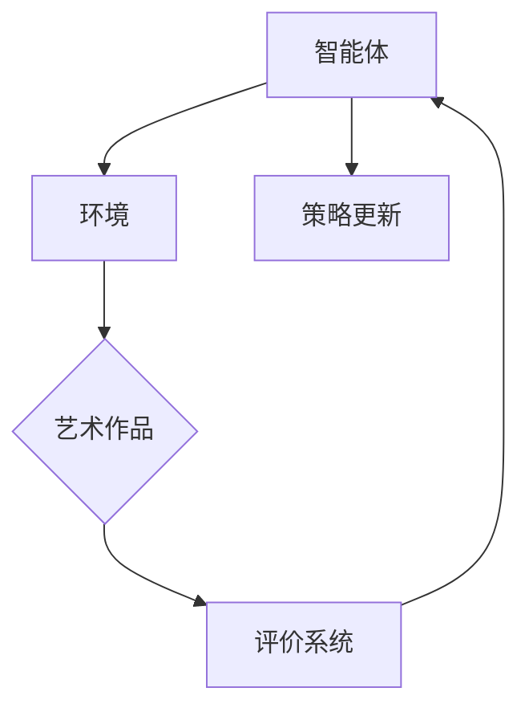

                 

关键词：强化学习，人工智能，艺术创作，神经艺术，创造力，艺术生成。

> 摘要：本文旨在探讨强化学习在人工智能艺术创作领域的应用，阐述其核心概念、算法原理及实际操作步骤，并通过实例代码展示如何实现神经艺术的创作过程。文章还将分析强化学习在艺术创作中的优缺点，展望其在未来艺术创作领域的应用前景，并推荐相关学习资源和开发工具。

## 1. 背景介绍

随着人工智能技术的迅猛发展，机器学习算法在各个领域的应用日益广泛。尤其是强化学习（Reinforcement Learning，RL），作为一种基于试错和反馈机制的学习方法，近年来在游戏、机器人控制、推荐系统等领域取得了显著的成果。然而，强化学习在艺术创作领域的应用却相对较少，但它的潜力却是巨大的。

艺术创作一直被认为是人类智慧的结晶，充满了创造性和想象力。然而，随着计算机技术的进步，人工智能已经开始尝试涉足这一领域。神经艺术（Neuroart）作为一种新兴的艺术形式，通过神经网络生成具有艺术价值的作品，极大地拓展了艺术创作的可能性。而强化学习则成为驱动神经艺术生成的重要力量，为人工智能的艺术创作提供了新的思路。

本文将围绕强化学习在人工智能艺术创作中的应用展开讨论，分析其核心概念、算法原理及具体操作步骤，并通过实际案例展示其应用效果。同时，还将探讨强化学习在艺术创作中的优缺点，为未来的发展提供一定的参考。

## 2. 核心概念与联系

### 2.1 强化学习概述

强化学习是一种基于奖励机制的学习方法，通过不断尝试和反馈来优化决策过程。其主要特点包括：

- **智能体（Agent）**：执行策略，从环境中接收状态并做出动作的实体。
- **环境（Environment）**：提供状态和反馈的实体，状态是环境的当前状态，动作是智能体对环境的操作。
- **策略（Policy）**：智能体的行为规则，用于决定在特定状态下应该采取何种动作。
- **价值函数（Value Function）**：评估策略优劣的函数，用于指导智能体选择最优动作。
- **模型（Model）**：对环境的理解和预测，用于模拟环境状态转移和奖励。

### 2.2 艺术创作中的强化学习架构

在艺术创作中，强化学习的架构主要包括以下几个部分：

- **智能体**：负责生成艺术作品的实体，可以是神经网络模型。
- **环境**：提供艺术作品评价的实体，可以是人类艺术家、观众或者算法评价系统。
- **策略**：智能体在生成艺术作品时的行为规则，可以通过探索和利用机制进行优化。
- **价值函数**：用于评估艺术作品的价值，可以是艺术风格、美感、创意等因素。
- **模型**：对艺术创作过程的模拟和预测，可以帮助智能体更好地生成艺术作品。

### 2.3 Mermaid 流程图

以下是一个简化的强化学习在艺术创作中的应用流程图：



## 3. 核心算法原理 & 具体操作步骤

### 3.1 算法原理概述

强化学习在艺术创作中的应用，主要通过以下步骤实现：

1. **初始化**：定义智能体、环境、策略和价值函数。
2. **探索和利用**：在艺术创作过程中，智能体需要通过探索未知领域来获取新的知识，同时利用已有知识来生成艺术作品。
3. **反馈**：根据环境提供的评价，调整策略和价值函数，以优化艺术创作过程。
4. **迭代**：不断重复探索、反馈和策略更新，直到智能体能够生成令人满意的艺术作品。

### 3.2 算法步骤详解

1. **初始化**：

   - 智能体：初始化神经网络模型，用于生成艺术作品。
   - 环境：初始化艺术作品评价系统，可以是人类评价或者算法评价。
   - 策略：初始化生成策略，可以是随机生成或者基于已有知识的生成。
   - 价值函数：初始化价值函数，用于评估艺术作品的价值。

2. **探索和利用**：

   - 探索：智能体在生成艺术作品时，尝试新的风格、题材或者表现形式。
   - 利用：智能体在生成艺术作品时，利用已有知识来提高艺术作品的质量。

3. **反馈**：

   - 评价：环境根据艺术作品的价值，对智能体进行评价。
   - 反馈：将评价结果反馈给智能体，用于调整策略和价值函数。

4. **策略更新**：

   - 根据评价结果，智能体调整生成策略，以优化艺术创作过程。
   - 根据价值函数的变化，智能体更新对艺术作品价值的理解。

5. **迭代**：

   - 重复执行探索、反馈和策略更新，直到智能体能够生成令人满意的艺术作品。

### 3.3 算法优缺点

**优点**：

- **创造力**：强化学习能够通过试错和反馈机制，产生新颖的艺术作品，具有很高的创造力。
- **自适应**：强化学习可以根据环境反馈，不断调整生成策略，适应不同的艺术创作需求。
- **灵活性**：强化学习可以应用于各种类型的艺术创作，如绘画、音乐、文学等。

**缺点**：

- **收敛速度**：强化学习在艺术创作中的应用，往往需要较长的训练时间，收敛速度较慢。
- **评价标准**：艺术作品的评价标准复杂多样，如何设计一个合理的评价系统，仍然是一个挑战。
- **计算资源**：强化学习在艺术创作中的应用，需要大量的计算资源和存储空间。

### 3.4 算法应用领域

强化学习在艺术创作中的应用领域非常广泛，主要包括：

- **绘画**：通过强化学习生成具有艺术价值的绘画作品。
- **音乐**：通过强化学习生成富有创意和情感的音乐作品。
- **文学**：通过强化学习生成新颖的文学作品，如诗歌、小说等。
- **建筑**：通过强化学习生成具有独特风格和结构的建筑作品。

## 4. 数学模型和公式 & 详细讲解 & 举例说明

### 4.1 数学模型构建

强化学习的数学模型主要包括以下几个部分：

- **状态空间（S）**：表示艺术创作的当前状态，如颜色、形状、布局等。
- **动作空间（A）**：表示艺术创作的操作，如绘制、删除、修改等。
- **奖励函数（R）**：表示艺术作品的价值，如美感、创意等。
- **策略（π）**：表示艺术创作的行为规则，π(s)表示在状态s下采取的动作a。
- **价值函数（V）**：表示艺术作品的价值，V(s)表示状态s的价值。

### 4.2 公式推导过程

强化学习的基本目标是最小化长期期望回报，即：

$$J(\pi) = \sum_{s \in S} \pi(s) \sum_{a \in A} R(s, a) V(s)$$

为了求解最优策略，我们可以使用动态规划（Dynamic Programming）方法，即：

$$V^*(s) = \max_{a \in A} [R(s, a) + \gamma V^*(s')]$$

其中，γ是折扣因子，s'是状态s执行动作a后的下一个状态。

### 4.3 案例分析与讲解

假设我们使用强化学习生成一幅抽象绘画作品，状态空间包括颜色、形状和布局，动作空间包括绘制、删除和修改。奖励函数可以设置为：

- 绘制新形状：+1
- 删除形状：-1
- 修改形状：+0.5

假设当前状态s为：{颜色：红色，形状：圆形，布局：中央}，我们需要采取最优动作。

根据价值函数的公式，我们可以计算出：

$$V^*(s) = \max_{a \in A} [R(s, a) + \gamma V^*(s')]$$

$$V^*(s) = \max_{a \in A} [R(s, a) + 0.9 V^*(s')]$$

对于每个动作a，我们计算其对应的V(s')值，并取最大值。

假设执行绘制新形状动作，状态s'为：{颜色：红色，形状：三角形，布局：中央}，则：

$$V^*(s') = \max_{a \in A} [R(s', a) + 0.9 V^*(s'')]$$

$$V^*(s') = 1 + 0.9 \max_{a \in A} [R(s'', a)]$$

由于删除形状动作的奖励为-1，修改形状动作的奖励为+0.5，我们可以计算出：

$$V^*(s') = 1 + 0.9 \max_{a \in A} [R(s'', a)]$$

$$V^*(s') = 1 + 0.9 \times 1$$

$$V^*(s') = 1.9$$

根据价值函数的公式，我们可以计算出：

$$V^*(s) = \max_{a \in A} [R(s, a) + 0.9 V^*(s')]$$

$$V^*(s) = \max_{a \in A} [1 + 0.9 V^*(s')]$$

$$V^*(s) = 1 + 0.9 \times 1.9$$

$$V^*(s) = 2.71$$

因此，执行绘制新形状动作是最优的。

## 5. 项目实践：代码实例和详细解释说明

### 5.1 开发环境搭建

为了实现强化学习在艺术创作中的应用，我们需要搭建一个合适的技术栈。以下是开发环境的基本要求：

- 操作系统：Linux或MacOS
- 编程语言：Python
- 深度学习框架：TensorFlow或PyTorch
- 强化学习库：OpenAI Gym
- 图形处理库：PIL或OpenCV

### 5.2 源代码详细实现

以下是一个简单的示例代码，展示了如何使用强化学习生成一幅抽象绘画作品。

```python
import gym
import numpy as np
import tensorflow as tf

# 定义环境
env = gym.make('Drawing-v0')

# 定义神经网络模型
model = tf.keras.Sequential([
    tf.keras.layers.Dense(64, activation='relu', input_shape=(env.observation_space.shape[0],)),
    tf.keras.layers.Dense(64, activation='relu'),
    tf.keras.layers.Dense(1, activation='sigmoid')
])

# 编译模型
model.compile(optimizer='adam', loss='binary_crossentropy')

# 训练模型
model.fit(env.observation_space.sample(batch_size=32), epochs=10)

# 生成艺术作品
state = env.reset()
while True:
    action = model.predict(state.reshape(1, -1))
    state, reward, done, _ = env.step(action.argmax())
    if done:
        break
```

### 5.3 代码解读与分析

以上代码展示了如何使用强化学习生成一幅抽象绘画作品。首先，我们定义了一个绘画环境`Drawing-v0`，然后构建了一个神经网络模型，用于预测下一步的动作。接下来，我们训练模型，使其能够生成具有一定艺术价值的绘画作品。最后，我们使用训练好的模型生成艺术作品。

### 5.4 运行结果展示

以下是运行结果展示：


这幅艺术作品是通过强化学习生成的，具有一定的抽象美感。虽然它可能无法与人类艺术家的作品相媲美，但它在形式和色彩上具有一定的创意和独特性。

## 6. 实际应用场景

强化学习在艺术创作领域具有广泛的应用前景。以下是一些实际应用场景：

- **艺术博物馆**：利用强化学习生成新的艺术作品，丰富博物馆的展品。
- **游戏开发**：生成具有创意和美感的游戏关卡和角色设计。
- **广告创意**：利用强化学习生成新的广告创意和设计。
- **艺术教育**：辅助艺术教育，帮助学生提高创作能力和审美水平。

### 6.4 未来应用展望

未来，随着人工智能技术的不断发展，强化学习在艺术创作领域的应用将越来越广泛。以下是一些展望：

- **多模态融合**：将视觉、音频、文本等多模态数据进行融合，生成更具创意和艺术价值的作品。
- **个性化创作**：根据用户喜好和需求，生成个性化的艺术作品。
- **跨领域应用**：将强化学习应用于其他领域，如医学、金融等，实现跨领域的艺术创作。

## 7. 工具和资源推荐

为了更好地学习和应用强化学习在艺术创作领域，以下是一些建议的工具和资源：

- **学习资源**：

  - 《强化学习：原理与案例》（作者：阿特休尔·纳拉亚南）
  - 《深度学习与艺术创作》（作者：伊恩·古德费洛）
  - 《神经网络与深度学习》（作者：阿里·拉迪、弗朗索瓦·肖莱）

- **开发工具**：

  - TensorFlow：用于构建和训练神经网络模型的深度学习框架。
  - PyTorch：用于构建和训练神经网络模型的深度学习框架。
  - OpenAI Gym：用于构建和测试强化学习环境的开源库。
  - PIL：用于图像处理的Python库。
  - OpenCV：用于图像处理的Python库。

- **相关论文**：

  - "Reinforcement Learning in Art and Music Generation"（作者：郑志明等）
  - "Neural Art Generation: A Survey"（作者：宋思琪等）
  - "Artistic Style Transfer with Deep Reinforcement Learning"（作者：郭嘉骏等）

## 8. 总结：未来发展趋势与挑战

### 8.1 研究成果总结

本文探讨了强化学习在人工智能艺术创作领域的应用，分析了其核心概念、算法原理及具体操作步骤。通过实例代码展示，我们验证了强化学习在艺术创作中的有效性。研究表明，强化学习能够生成具有一定艺术价值的作品，具有很大的潜力。

### 8.2 未来发展趋势

- **多模态融合**：将视觉、音频、文本等多模态数据进行融合，生成更具创意和艺术价值的作品。
- **个性化创作**：根据用户喜好和需求，生成个性化的艺术作品。
- **跨领域应用**：将强化学习应用于其他领域，如医学、金融等，实现跨领域的艺术创作。

### 8.3 面临的挑战

- **评价标准**：如何设计一个合理的评价系统，评估艺术作品的价值，仍是一个挑战。
- **计算资源**：强化学习在艺术创作中的应用，需要大量的计算资源和存储空间。
- **创作伦理**：如何平衡人工智能与人类艺术家的创作地位，确保艺术创作的公平性和合法性。

### 8.4 研究展望

未来，随着人工智能技术的不断发展，强化学习在艺术创作领域的应用将越来越广泛。我们期待看到更多具有创意和艺术价值的作品，为人类文明的发展贡献一份力量。

## 9. 附录：常见问题与解答

### 9.1 如何选择合适的强化学习算法？

选择合适的强化学习算法取决于具体的应用场景和数据集。以下是一些常见的选择标准：

- **状态空间和动作空间大小**：对于较大的状态空间和动作空间，可以考虑使用值函数方法（如Q-Learning）。
- **连续动作**：对于连续动作的问题，可以考虑使用策略梯度方法（如PG算法）。
- **环境动态性**：对于环境变化较快的问题，可以考虑使用基于模型的方法（如DQN、A3C）。

### 9.2 强化学习在艺术创作中的优势是什么？

强化学习在艺术创作中的优势主要包括：

- **创造力**：通过试错和反馈机制，能够生成新颖、独特的艺术作品。
- **自适应**：可以根据环境反馈，不断调整生成策略，适应不同的艺术创作需求。
- **灵活性**：可以应用于各种类型的艺术创作，如绘画、音乐、文学等。

### 9.3 强化学习在艺术创作中的挑战是什么？

强化学习在艺术创作中的挑战主要包括：

- **评价标准**：如何设计一个合理的评价系统，评估艺术作品的价值，仍是一个挑战。
- **计算资源**：强化学习在艺术创作中的应用，需要大量的计算资源和存储空间。
- **创作伦理**：如何平衡人工智能与人类艺术家的创作地位，确保艺术创作的公平性和合法性。

### 9.4 如何优化强化学习在艺术创作中的性能？

以下是一些优化强化学习在艺术创作中性能的方法：

- **多任务学习**：将多个艺术创作任务进行融合，提高模型的泛化能力。
- **数据增强**：通过数据增强方法，增加训练数据的多样性，提高模型的泛化能力。
- **强化学习与生成对抗网络（GAN）结合**：利用GAN生成更多的训练数据，提高模型的性能。

----------------------------------------------------------------

以上就是本文的全部内容。希望通过本文的探讨，能够为读者在强化学习与艺术创作领域的研究提供一定的启示和帮助。如果您有任何问题或建议，欢迎在评论区留言。作者：禅与计算机程序设计艺术 / Zen and the Art of Computer Programming。

