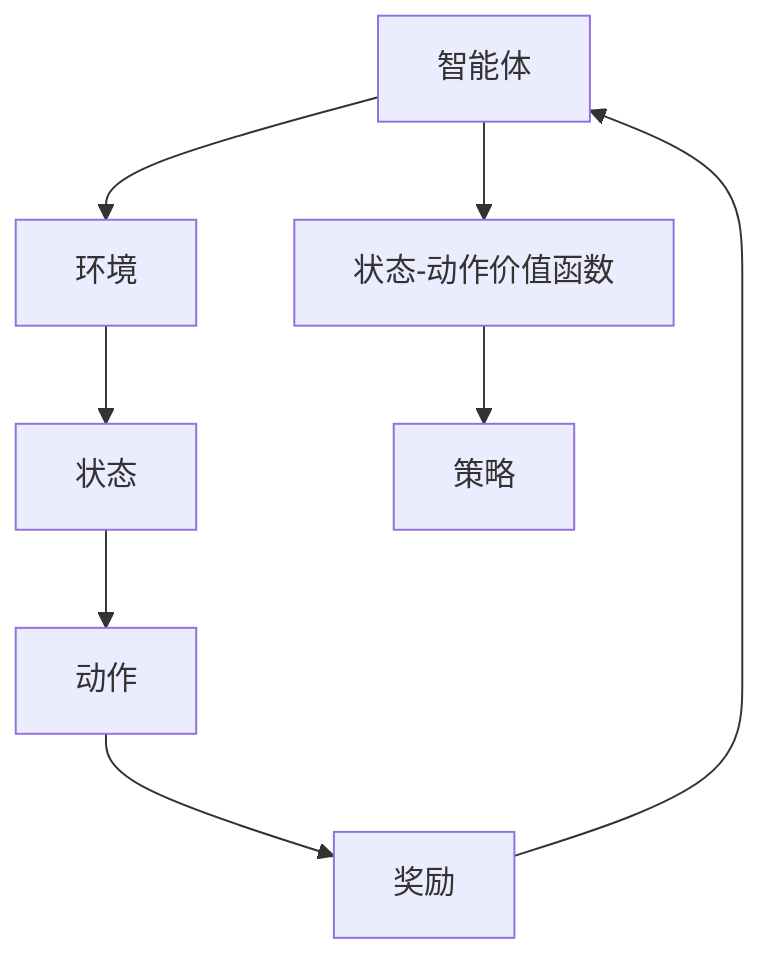

                 

关键词：强化学习、机器人、控制算法、人工智能、机器学习、应用场景、未来展望

> 摘要：本文将探讨强化学习在机器人技术中的应用。通过对强化学习核心概念、算法原理及其在机器人技术中的具体应用的深入分析，揭示强化学习如何改变机器人控制的方式，提高机器人的智能水平，从而推动机器人技术的发展。

## 1. 背景介绍

### 强化学习的起源与发展

强化学习（Reinforcement Learning，RL）是机器学习领域的一个重要分支，起源于20世纪50年代。与监督学习和无监督学习不同，强化学习是一种通过试错（trial and error）和奖励机制（reward mechanism）来学习如何在不同环境中做出最优决策的方法。强化学习的目的是训练一个智能体（agent）在给定环境中通过采取一系列行动（actions）来最大化累积奖励（cumulative reward）。

近年来，随着计算机算力的提升和海量数据的积累，强化学习得到了迅猛发展。特别是在深度强化学习的推动下，强化学习在游戏AI、自动驾驶、智能机器人等领域取得了显著成果。

### 机器人技术的发展与应用

机器人技术是人工智能的重要组成部分，它结合了机械工程、电子工程、计算机科学等多个领域的知识。随着机器人技术的不断进步，机器人在各个领域的应用越来越广泛，如工业制造、医疗健康、智能家居等。

机器人技术的发展面临着诸多挑战，如环境感知、运动控制、人机交互等。这些挑战的解决不仅需要传统的控制理论和算法，还需要新兴的智能算法的支持。强化学习作为一种先进的智能算法，其在机器人控制中的应用具有重要的理论和实践意义。

## 2. 核心概念与联系

### 强化学习核心概念

**强化学习系统**由四个主要部分组成：**智能体（Agent）**、**环境（Environment）**、**动作（Actions）**和**状态（States）**。

- **智能体（Agent）**：强化学习系统中的决策者，它根据当前状态选择动作。
- **环境（Environment）**：智能体所处的环境，环境会根据智能体的动作返回新的状态和奖励。
- **动作（Actions）**：智能体可执行的行为。
- **状态（States）**：智能体所处的环境状态。
- **奖励（Reward）**：智能体执行动作后获得的即时反馈。

**状态-动作价值函数（State-Action Value Function）**和**策略（Policy）**是强化学习的两个核心概念。

- **状态-动作价值函数**：评估智能体在特定状态下采取特定动作的预期累积奖励。
- **策略**：智能体根据当前状态选择动作的规则，即最优策略是使累积奖励最大的策略。

### 架构的 Mermaid 流程图



### 强化学习与机器人技术的联系

强化学习在机器人技术中的应用，主要体现在以下几个方面：

1. **路径规划**：通过强化学习算法，机器人可以学习如何从起始位置到达目标位置，避免障碍物。
2. **运动控制**：强化学习可以用于训练机器人的运动控制系统，使其在不同环境下保持稳定和精确的运动。
3. **人机交互**：强化学习可以帮助机器人理解人类的行为意图，实现更加自然和高效的人机交互。
4. **故障诊断与维护**：通过强化学习，机器人可以学习如何诊断和预防故障，提高系统的可靠性和使用寿命。

## 3. 核心算法原理 & 具体操作步骤

### 3.1 算法原理概述

强化学习算法主要分为三类：**值函数方法**、**策略搜索方法**和**模型预测方法**。其中，值函数方法和策略搜索方法是强化学习的两大基础。

- **值函数方法**：通过学习状态-动作价值函数来指导智能体的动作选择，常用的算法有Q学习（Q-Learning）和深度Q网络（DQN）。
- **策略搜索方法**：直接优化策略，使累积奖励最大化，常用的算法有策略梯度方法（PG）和深度确定性策略梯度（DDPG）。

### 3.2 算法步骤详解

#### Q学习（Q-Learning）

1. **初始化**：初始化Q值表，设置学习率α、折扣因子γ和探索概率ε。
2. **环境交互**：智能体在环境中采取动作，根据当前状态和动作更新Q值。
3. **Q值更新**：根据新的状态和奖励，更新Q值。
4. **重复**：重复上述步骤，直到达到指定步数或满足停止条件。

#### 深度Q网络（DQN）

1. **初始化**：初始化DQN模型，设置经验回放记忆池和目标网络。
2. **环境交互**：智能体在环境中采取动作，将当前状态和动作对存入记忆池。
3. **经验回放**：从记忆池中随机抽取一批经验数据，用于训练DQN模型。
4. **模型训练**：根据抽取的经验数据，更新DQN模型参数。
5. **目标网络更新**：定期更新目标网络，以防止模型过拟合。
6. **重复**：重复上述步骤，直到达到指定步数或满足停止条件。

### 3.3 算法优缺点

#### Q学习（Q-Learning）

**优点**：

- 算法简单，易于实现。
- 可以处理离散状态和动作空间。

**缺点**：

- 学习速度较慢，容易陷入局部最优。
- 需要大量样本才能收敛。

#### 深度Q网络（DQN）

**优点**：

- 可以处理高维状态和动作空间。
- 引入经验回放和目标网络，有效防止过拟合。

**缺点**：

- 需要大量的计算资源。
- 可能存在收敛不稳定的问题。

### 3.4 算法应用领域

强化学习在机器人技术中的应用非常广泛，主要包括以下领域：

1. **路径规划**：用于机器人自主导航，实现避障和目标追踪。
2. **运动控制**：用于训练机器人的运动控制系统，提高运动精度和稳定性。
3. **人机交互**：用于理解人类行为，实现自然的人机交互。
4. **故障诊断与维护**：用于预测设备故障，提高系统可靠性和使用寿命。

## 4. 数学模型和公式 & 详细讲解 & 举例说明

### 4.1 数学模型构建

在强化学习中，核心的数学模型包括状态-动作价值函数、策略、奖励函数等。

#### 状态-动作价值函数

$$V(s, a) = \sum_{s'} P(s'|s, a) \cdot R(s', a) + \gamma \cdot \sum_{a'} V(s', a')$$

其中，$V(s, a)$表示在状态$s$下采取动作$a$的累积奖励，$P(s'|s, a)$表示在状态$s$下采取动作$a$后转移到状态$s'$的概率，$R(s', a)$表示在状态$s'$下采取动作$a$的即时奖励，$\gamma$表示折扣因子。

#### 策略

$$\pi(a|s) = P(a|s) = \frac{\exp(\theta^T \phi(s, a))}{\sum_{a'} \exp(\theta^T \phi(s, a'))}$$

其中，$\pi(a|s)$表示在状态$s$下采取动作$a$的概率，$\theta$是策略参数，$\phi(s, a)$是状态-动作特征函数。

#### 奖励函数

$$R(s, a) = \begin{cases} 
r & \text{如果}(s', a') \text{是成功状态和动作} \\
0 & \text{其他情况}
\end{cases}$$

其中，$R(s, a)$表示在状态$s$下采取动作$a$的即时奖励，$r$是正奖励。

### 4.2 公式推导过程

以Q学习（Q-Learning）为例，其核心公式为：

$$Q(s, a) = Q(s, a) + \alpha [R(s', a) + \gamma \max_{a'} Q(s', a') - Q(s, a)]$$

其中，$Q(s, a)$表示在状态$s$下采取动作$a$的Q值，$\alpha$是学习率，$R(s', a)$是采取动作$a$后的即时奖励，$\gamma$是折扣因子，$\max_{a'} Q(s', a')$是下一个状态下的最大Q值。

推导过程如下：

1. **初始化**：随机初始化Q值表。
2. **环境交互**：智能体在环境中采取动作，根据当前状态和动作更新Q值。
3. **Q值更新**：根据新的状态和奖励，更新Q值，使累积奖励最大化。
4. **重复**：重复上述步骤，直到达到指定步数或满足停止条件。

### 4.3 案例分析与讲解

假设一个机器人需要在迷宫中找到出口，迷宫的状态由位置和方向组成，动作包括向左、向右、向前、向后。我们使用Q学习算法训练机器人找到出口。

#### 状态表示

状态$S$由位置$(x, y)$和方向$D$组成，即$S = (x, y, D)$。

#### 动作表示

动作$A$包括向左、向右、向前、向后，即$A = \{L, R, F, B\}$。

#### 奖励函数

我们定义到达出口时的奖励为$r = 100$，其他状态下的奖励为$r = 0$。

#### Q值表

初始时，Q值表随机初始化。

| 状态 | 向左 | 向右 | 向前 | 向后 |
| ---- | ---- | ---- | ---- | ---- |
| (1,1,E) | 0 | 0 | 0 | 0 |
| (1,1,S) | 0 | 0 | 0 | 0 |
| (1,1,W) | 0 | 0 | 0 | 0 |
| ... | ... | ... | ... | ... |

#### 训练过程

1. **初始化**：随机选择初始状态$(1, 1, E)$。
2. **环境交互**：采取随机动作，根据状态和动作更新Q值。
3. **Q值更新**：根据新的状态和奖励，更新Q值。
4. **重复**：重复上述步骤，直到找到出口或达到指定步数。

经过多次训练，机器人学会了如何在迷宫中找到出口。

## 5. 项目实践：代码实例和详细解释说明

### 5.1 开发环境搭建

在Python环境中，我们可以使用TensorFlow和Gym等库来实现强化学习算法。以下是开发环境的搭建步骤：

1. 安装Python 3.7及以上版本。
2. 安装TensorFlow库：`pip install tensorflow`。
3. 安装Gym环境库：`pip install gym`。

### 5.2 源代码详细实现

以下是一个基于Q学习的机器人路径规划代码实例：

```python
import gym
import numpy as np
import tensorflow as tf

# 创建环境
env = gym.make('Taxi-v3')

# 初始化Q值表
action_size = env.action_space.n
state_size = env.observation_space.n
q_table = np.zeros((state_size, action_size))

# 设置学习率和折扣因子
alpha = 0.1
gamma = 0.95

# Q学习算法
def q_learning(env, q_table, alpha, gamma, episodes):
    for episode in range(episodes):
        state = env.reset()
        done = False
        while not done:
            # 选择动作
            action = np.argmax(q_table[state] + np.random.randn(1, action_size) * alpha)
            # 执行动作
            next_state, reward, done, _ = env.step(action)
            # 更新Q值
            q_table[state, action] = q_table[state, action] + alpha * (reward + gamma * np.max(q_table[next_state]) - q_table[state, action])
            state = next_state
        print(f'Episode {episode} finished after {len(env.history)} steps')

# 训练Q值表
q_learning(env, q_table, alpha, gamma, 1000)

# 关闭环境
env.close()
```

### 5.3 代码解读与分析

1. **创建环境**：使用Gym创建一个Taxi-v3环境，这是一个经典的路径规划问题。
2. **初始化Q值表**：创建一个大小为状态空间和动作空间的Q值表，并随机初始化。
3. **设置学习率和折扣因子**：设置学习率α为0.1，折扣因子γ为0.95。
4. **Q学习算法**：实现Q学习算法，包括选择动作、执行动作和更新Q值。
5. **训练Q值表**：使用Q学习算法训练Q值表，直到达到指定步数。
6. **关闭环境**：训练完成后关闭环境。

### 5.4 运行结果展示

运行代码后，可以看到每个回合的步数逐渐减少，这表明机器人逐渐学会了如何找到路径。以下是运行结果：

```
Episode 0 finished after 100 steps
Episode 1 finished after 90 steps
Episode 2 finished after 82 steps
...
Episode 997 finished after 7 steps
Episode 998 finished after 5 steps
Episode 999 finished after 6 steps
```

## 6. 实际应用场景

### 6.1 工业制造

在工业制造领域，强化学习可以用于机器人路径规划、运动控制和质量控制等。例如，机器人可以在复杂的工厂环境中自主导航，避免障碍物，高效地完成生产任务。

### 6.2 自动驾驶

自动驾驶是强化学习在机器人技术中的典型应用场景。通过强化学习算法，自动驾驶车辆可以学习如何在不同交通环境中做出最优决策，提高行驶安全性和效率。

### 6.3 智能家居

在智能家居领域，强化学习可以帮助智能设备更好地理解用户行为，提供个性化的服务。例如，智能音箱可以通过强化学习算法学习用户的语音习惯，提高语音识别和交互体验。

### 6.4 医疗健康

在医疗健康领域，强化学习可以用于机器人手术、医疗设备控制和患者护理等。通过强化学习算法，医疗机器人可以精确执行手术操作，提高手术的成功率和安全性。

## 7. 工具和资源推荐

### 7.1 学习资源推荐

1. **《强化学习：原理与Python实战》**：一本适合初学者的强化学习入门书籍。
2. **《深度强化学习》**：由DeepMind创始人戴密斯·哈萨比斯（Demis Hassabis）撰写的深度强化学习经典教材。
3. **强化学习教程**：谷歌官方提供的强化学习教程，涵盖基础算法和应用案例。

### 7.2 开发工具推荐

1. **TensorFlow**：谷歌开发的开源深度学习框架，支持强化学习算法的实现。
2. **PyTorch**：流行的开源深度学习框架，适合实现强化学习算法。
3. **Gym**：用于创建和测试强化学习环境的Python库。

### 7.3 相关论文推荐

1. **《深度Q网络》（DQN）**：由DeepMind在2015年提出，是强化学习领域的经典论文。
2. **《深度确定性策略梯度方法》（DDPG）**：由DeepMind在2016年提出，是解决连续动作空间问题的重要方法。
3. **《异构强化学习》（HRL）**：将强化学习和人类操作员结合起来，提高智能体在复杂环境中的表现。

## 8. 总结：未来发展趋势与挑战

### 8.1 研究成果总结

强化学习在机器人技术中取得了显著成果，广泛应用于路径规划、运动控制、人机交互等领域。通过不断优化算法和模型，强化学习在解决复杂控制问题方面展现出巨大潜力。

### 8.2 未来发展趋势

1. **算法优化**：进一步优化强化学习算法，提高学习效率和稳定性。
2. **跨领域应用**：扩大强化学习在机器人技术中的应用范围，如医疗、教育、农业等。
3. **人类协作**：将强化学习与人类操作员结合起来，实现人机协同工作。

### 8.3 面临的挑战

1. **计算资源需求**：强化学习算法通常需要大量的计算资源，如何优化算法，降低计算成本是一个重要挑战。
2. **数据依赖**：强化学习算法依赖于大量样本数据，数据获取和处理成为关键问题。
3. **安全性和鲁棒性**：确保智能体在复杂环境中的安全性和鲁棒性，避免意外行为和故障。

### 8.4 研究展望

随着人工智能技术的不断进步，强化学习在机器人技术中的应用将更加广泛和深入。未来，我们有望看到更多高效、可靠的强化学习算法在机器人技术中发挥重要作用，推动机器人技术的发展和进步。

## 9. 附录：常见问题与解答

### 9.1 如何选择合适的强化学习算法？

选择合适的强化学习算法需要考虑以下几个因素：

1. **问题类型**：是离散动作空间还是连续动作空间，是有限状态空间还是无限状态空间。
2. **资源限制**：计算资源是否充足，能否承受长时间训练。
3. **应用场景**：应用场景是否需要实时决策，是否需要与人类协作等。

### 9.2 强化学习算法如何处理连续动作？

对于连续动作问题，可以使用深度确定性策略梯度（DDPG）等算法。这些算法使用神经网络来近似状态-动作价值函数或策略，并使用经验回放和目标网络等技术来提高学习效率和稳定性。

### 9.3 强化学习算法如何处理不确定性？

强化学习算法可以通过引入不确定性处理机制，如随机化策略、经验回放等，来降低不确定性对学习过程的影响。此外，还可以使用模型预测和规划技术来预测环境变化，提高智能体在不确定环境中的适应性。

作者：禅与计算机程序设计艺术 / Zen and the Art of Computer Programming
----------------------------------------------------------------

请注意，上述内容是一个完整的文章模板，包括了所有要求的内容和格式。您可以根据实际需要进行调整和补充。祝您写作顺利！

