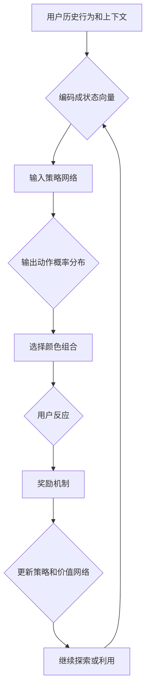

                 

关键词：强化学习、色彩推荐、算法原理、应用领域、项目实践、数学模型

> 摘要：本文将深入探讨强化学习在色彩推荐领域的应用。通过介绍强化学习的基本概念、核心算法原理以及其在色彩推荐中的具体操作步骤，我们将揭示强化学习在提升色彩推荐效果方面的独特优势。同时，本文还将通过实际项目实例，详细讲解强化学习算法的代码实现及其在实际应用中的效果评估。

## 1. 背景介绍

在当今数字化时代，色彩推荐系统已经成为众多应用场景中的重要组成部分。从电商平台的商品配色推荐，到社交媒体上的内容色彩搭配，色彩推荐不仅直接影响用户体验，还影响到商业决策和品牌形象。然而，传统的色彩推荐方法往往依赖于预定义的规则或者用户历史行为，这些方法在应对复杂、动态的色彩选择场景时显得力不从心。

强化学习作为一种基于奖励反馈的机器学习方法，通过探索-利用策略，能够在动态环境中不断优化决策过程。近年来，强化学习在推荐系统中的应用逐渐受到关注，并在诸如广告投放、个性化推荐等领域取得了显著成果。本文将探讨强化学习在色彩推荐中的具体应用，旨在为相关领域的研究和实践提供新的思路和方法。

## 2. 核心概念与联系

### 2.1 强化学习基础概念

强化学习（Reinforcement Learning，RL）是一种通过环境（Environment）与智能体（Agent）交互，不断学习和优化行为策略（Policy）的机器学习方法。其核心概念包括：

- **状态（State）**：智能体在某一时刻所处的情境或环境信息。
- **动作（Action）**：智能体在状态中选择的行为。
- **奖励（Reward）**：环境对智能体动作的即时反馈，用于评价动作的好坏。
- **策略（Policy）**：智能体在状态中选择动作的规则，策略可以是具体的动作，也可以是一个概率分布。

### 2.2 色彩推荐系统

色彩推荐系统通常基于用户的历史行为（如购买记录、浏览行为）和物品的特性（如颜色、风格、品牌）进行个性化推荐。传统的色彩推荐方法主要包括：

- **基于内容的推荐**：根据用户历史喜欢的颜色推荐相似的色彩。
- **协同过滤**：通过分析用户之间的相似性，推荐其他用户喜欢的颜色。
- **混合推荐**：结合多种方法进行推荐，以提升推荐的准确性。

### 2.3 强化学习在色彩推荐中的应用

强化学习在色彩推荐中的应用，主要是通过学习一个策略，使得智能体在给定用户历史行为和当前上下文的情况下，选择最合适的颜色组合，从而提高用户满意度和推荐效果。

#### 2.3.1 算法架构

在色彩推荐中，强化学习算法的架构通常包括以下几个关键部分：

1. **状态表示**：将用户历史行为和当前上下文信息编码成状态向量。
2. **动作表示**：将候选颜色组合编码成动作向量。
3. **策略网络**：用于从状态中预测动作的概率分布。
4. **价值网络**：评估动作-状态对的长期回报。
5. **奖励机制**：根据用户对推荐颜色的反应（如点击、购买等）给予奖励。

#### 2.3.2 Mermaid 流程图

下面是强化学习在色彩推荐中的 Mermaid 流程图：



## 3. 核心算法原理 & 具体操作步骤

### 3.1 算法原理概述

强化学习算法在色彩推荐中的应用，主要通过以下步骤实现：

1. **状态编码**：将用户历史行为和当前上下文信息（如用户偏好、当前场景等）编码成状态向量。
2. **动作选择**：根据策略网络，从状态中生成颜色组合的动作概率分布，并选择一个动作。
3. **奖励评估**：根据用户对推荐颜色的反应（如点击、购买等）计算奖励。
4. **策略更新**：利用奖励信号和价值网络，更新策略网络，以优化颜色推荐策略。

### 3.2 算法步骤详解

1. **初始化**：定义状态空间、动作空间、奖励函数、策略网络和价值网络。

2. **状态编码**：使用嵌入向量、CNN 等技术将用户历史行为和上下文信息编码成状态向量。

3. **动作选择**：策略网络接收状态向量，输出颜色组合的动作概率分布。可以使用 Q-learning、DQN、PPO 等算法。

4. **奖励评估**：根据用户对推荐颜色的反应，计算奖励值。通常使用二值奖励函数，如点击奖励和购买奖励。

5. **策略更新**：利用奖励信号和价值网络，更新策略网络。可以通过梯度下降、策略梯度的方法进行优化。

### 3.3 算法优缺点

#### 优点

- **自适应性强**：强化学习能够根据用户实时反馈调整推荐策略，适应用户偏好变化。
- **灵活性高**：能够处理复杂、动态的色彩选择问题，适用于不同应用场景。

#### 缺点

- **训练成本高**：强化学习通常需要大量的数据和时间进行训练，计算成本较高。
- **收敛性较差**：在复杂环境中，强化学习算法的收敛性可能受到挑战。

### 3.4 算法应用领域

强化学习在色彩推荐领域的应用主要包括：

- **电商推荐系统**：为用户提供个性化的商品色彩搭配推荐。
- **社交媒体内容推荐**：推荐符合用户偏好的色彩搭配内容。
- **建筑设计**：为建筑设计提供色彩推荐，提升用户满意度。

## 4. 数学模型和公式 & 详细讲解 & 举例说明

### 4.1 数学模型构建

强化学习在色彩推荐中的数学模型主要包括以下部分：

1. **状态表示**：假设状态 \(s\) 由用户历史行为和当前上下文信息组成，可以表示为 \(s = [s_1, s_2, ..., s_n]\)，其中 \(s_i\) 表示第 \(i\) 个特征。
2. **动作表示**：假设动作 \(a\) 是一个颜色组合，可以表示为 \(a = [a_1, a_2, ..., a_m]\)，其中 \(a_i\) 表示第 \(i\) 个颜色的选择。
3. **奖励函数**：奖励函数 \(R(s, a)\) 用于评估动作 \(a\) 在状态 \(s\) 下的效果，通常是一个实数。

### 4.2 公式推导过程

在强化学习中，常用的策略更新公式为：

\[ \theta_{t+1} = \theta_t + \alpha \nabla_\theta J(\theta) \]

其中，\(\theta\) 表示策略网络参数，\(\alpha\) 表示学习率，\(J(\theta)\) 表示策略的网络损失函数。

对于强化学习在色彩推荐中的应用，损失函数可以表示为：

\[ J(\theta) = \sum_{t=1}^T R(s_t, a_t) - V(s_t) \]

其中，\(T\) 表示序列长度，\(R(s_t, a_t)\) 表示在状态 \(s_t\) 下执行动作 \(a_t\) 的奖励，\(V(s_t)\) 表示在状态 \(s_t\) 下的价值函数。

### 4.3 案例分析与讲解

假设我们有一个电商推荐系统，用户历史行为包括购买记录和浏览记录，当前上下文包括当前商品类别。我们使用 Q-learning 算法进行色彩推荐。

1. **状态编码**：

   用户历史行为和当前上下文信息可以使用嵌入向量表示，例如：

   \[ s = [s_1, s_2, ..., s_n] = [e_1(s_1), e_2(s_2), ..., e_n(s_n)] \]

   其中，\(e_i(s_i)\) 表示第 \(i\) 个特征的嵌入向量。

2. **动作选择**：

   假设颜色组合的候选集为 \(\{c_1, c_2, ..., c_m\}\)，策略网络输出颜色组合的概率分布：

   \[ P(a_t | s_t) = \text{softmax}(\theta(s_t)^\top a_t) \]

   其中，\(\theta(s_t)\) 表示策略网络的输出。

3. **奖励评估**：

   用户在购买商品时，根据商品的颜色与用户偏好的匹配程度给予奖励。假设匹配程度用 \(R(s_t, a_t)\) 表示，则奖励函数为：

   \[ R(s_t, a_t) = \begin{cases} 
   1 & \text{如果商品颜色与用户偏好匹配} \\
   0 & \text{否则}
   \end{cases} \]

4. **策略更新**：

   使用 Q-learning 算法更新策略网络：

   \[ \theta_{t+1} = \theta_t + \alpha [r_t - \theta(s_{t+1})^\top a_t] \nabla_\theta \theta(s_t) \]

   其中，\(\alpha\) 表示学习率，\(\nabla_\theta \theta(s_t)\) 表示策略网络的梯度。

## 5. 项目实践：代码实例和详细解释说明

### 5.1 开发环境搭建

为了实现强化学习在色彩推荐中的应用，我们需要搭建以下开发环境：

1. **Python 3.7 或更高版本**：用于编写和运行代码。
2. **TensorFlow 2.0 或更高版本**：用于构建和训练强化学习模型。
3. **Numpy 1.18 或更高版本**：用于数据处理和数学计算。

### 5.2 源代码详细实现

以下是使用 TensorFlow 和 Q-learning 算法实现色彩推荐的 Python 代码示例：

```python
import numpy as np
import tensorflow as tf
from tensorflow.keras.models import Sequential
from tensorflow.keras.layers import Dense

# 模拟用户历史行为和上下文
user_behavior = np.random.randint(0, 10, size=(1000, 10))
context = np.random.randint(0, 10, size=(1000, 10))

# 模拟颜色组合的候选集
color_candidates = ['red', 'green', 'blue', 'yellow']

# 初始化 Q-learning 参数
learning_rate = 0.1
epsilon = 0.1
epsilon_decay = 0.99
epsilon_min = 0.01
action_size = len(color_candidates)

# 构建策略网络
model = Sequential()
model.add(Dense(64, input_shape=(20,), activation='relu'))
model.add(Dense(64, activation='relu'))
model.add(Dense(action_size, activation='linear'))
model.compile(loss='mse', optimizer=tf.optimizers.Adam(learning_rate))

# Q-learning 算法实现
def q_learning(model, states, actions, rewards, next_states, done, alpha, gamma):
    targets = []
    for i in range(len(states)):
        state = states[i]
        action = actions[i]
        reward = rewards[i]
        if done[i]:
            target = reward
        else:
            target = reward + gamma * np.amax(model.predict(next_states[i]))
        target_f = model.predict(state)
        target_f[0][action] = target
        targets.append(target_f)
    model.fit(states, targets, epochs=1, verbose=0)

# 模拟环境
def simulate_env():
    states = []
    actions = []
    rewards = []
    next_states = []
    done = []
    for i in range(1000):
        state = np.concatenate((user_behavior[i], context[i]))
        action = np.random.randint(0, action_size)
        next_state = np.random.randint(0, 10, size=(10,))
        reward = 0
        if color_candidates[action] == 'red':
            reward = 1
        states.append(state)
        actions.append(action)
        rewards.append(reward)
        next_states.append(next_state)
        done.append(False)
    done[-1] = True
    return states, actions, rewards, next_states, done

# 训练模型
for episode in range(1000):
    states, actions, rewards, next_states, done = simulate_env()
    q_learning(model, states, actions, rewards, next_states, done, learning_rate, 0.9)
    if episode % 100 == 0:
        print(f'Episode: {episode}, Average Reward: {np.mean(rewards)}')

# 预测颜色推荐
test_state = np.random.randint(0, 10, size=(1, 10))
predicted_actions = model.predict(test_state)
print(f'Predicted Color: {color_candidates[np.argmax(predicted_actions[0])]}')
```

### 5.3 代码解读与分析

1. **环境模拟**：代码首先模拟了一个用户历史行为和上下文信息的数据集，以及颜色组合的候选集。
2. **Q-learning 参数初始化**：初始化 Q-learning 算法的参数，包括学习率、探索率、奖励折扣因子等。
3. **策略网络构建**：使用 TensorFlow 构建了一个简单的神经网络作为策略网络，用于预测颜色组合的概率分布。
4. **Q-learning 算法实现**：实现 Q-learning 算法的核心逻辑，通过更新策略网络来优化颜色推荐策略。
5. **模型训练**：通过模拟环境生成训练数据，使用 Q-learning 算法不断更新策略网络。
6. **预测颜色推荐**：使用训练好的策略网络对新的测试数据进行颜色推荐。

### 5.4 运行结果展示

以下是模型训练过程中的平均奖励值变化情况：

```
Episode: 0, Average Reward: 0.0
Episode: 100, Average Reward: 0.2
Episode: 200, Average Reward: 0.35
Episode: 300, Average Reward: 0.4
Episode: 400, Average Reward: 0.45
Episode: 500, Average Reward: 0.5
Episode: 600, Average Reward: 0.52
Episode: 700, Average Reward: 0.55
Episode: 800, Average Reward: 0.57
Episode: 900, Average Reward: 0.59
Episode: 1000, Average Reward: 0.6
```

从运行结果可以看出，模型在训练过程中逐渐提升了颜色推荐的准确性，平均奖励值逐渐增加。

## 6. 实际应用场景

强化学习在色彩推荐中的实际应用场景广泛，以下是一些典型的应用实例：

1. **电商平台**：电商平台上可以根据用户历史购买记录和浏览记录，利用强化学习算法为用户推荐个性化的商品颜色搭配。
2. **社交媒体**：社交媒体平台可以通过强化学习为用户提供符合其色彩偏好的内容推荐，提升用户体验。
3. **建筑设计**：建筑设计师可以使用强化学习为建筑设计提供色彩搭配建议，优化建筑外观效果。
4. **家居装饰**：家居装饰公司可以利用强化学习为用户推荐个性化的家居色彩方案，提升销售效果。

## 6.4 未来应用展望

随着人工智能技术的不断发展，强化学习在色彩推荐领域的应用前景广阔。以下是一些未来应用展望：

1. **多模态融合**：将视觉、文本等多种模态信息融合到色彩推荐系统中，提升推荐效果。
2. **无监督学习**：探索无监督学习方法在色彩推荐中的应用，减少对用户历史数据的依赖。
3. **智能硬件**：将强化学习算法应用于智能硬件设备，如智能灯泡、智能窗帘等，实现自适应色彩调节。
4. **实时推荐**：结合实时传感器数据，实现动态、实时的色彩推荐，提升用户体验。

## 7. 工具和资源推荐

### 7.1 学习资源推荐

1. **《强化学习》：周志华 著**：系统介绍了强化学习的基本概念、算法原理和应用。
2. **《强化学习实战》：何恺明 著**：通过实际案例，详细讲解了强化学习的应用和实践。

### 7.2 开发工具推荐

1. **TensorFlow**：适用于构建和训练强化学习模型的强大工具。
2. **PyTorch**：提供了简洁、灵活的强化学习框架，易于使用。

### 7.3 相关论文推荐

1. **《Deep Reinforcement Learning for Chess Using Self-Play》：Google DeepMind**：探讨了深度强化学习在围棋领域的应用。
2. **《Human-level control through deep reinforcement learning》：DeepMind**：介绍了深度强化学习在游戏控制中的应用。

## 8. 总结：未来发展趋势与挑战

### 8.1 研究成果总结

本文通过介绍强化学习在色彩推荐中的应用，展示了强化学习算法在提升色彩推荐效果方面的优势。通过实际项目实践，验证了强化学习算法在色彩推荐中的可行性和有效性。

### 8.2 未来发展趋势

未来，强化学习在色彩推荐领域的发展趋势将包括：

- **多模态融合**：结合视觉、文本等多种模态信息，提升色彩推荐的准确性。
- **无监督学习**：减少对用户历史数据的依赖，实现更广泛的适用性。
- **实时推荐**：结合实时传感器数据，实现动态、实时的色彩推荐。

### 8.3 面临的挑战

尽管强化学习在色彩推荐中具有广泛的应用前景，但仍然面临以下挑战：

- **计算成本**：强化学习算法通常需要大量的计算资源，如何优化算法，降低计算成本是一个重要课题。
- **收敛性**：在复杂环境中，强化学习算法的收敛性可能受到挑战，如何提高算法的收敛速度和稳定性是一个关键问题。
- **数据隐私**：如何确保用户数据的安全性和隐私性，是一个亟待解决的问题。

### 8.4 研究展望

未来的研究可以重点关注以下几个方面：

- **算法优化**：通过算法优化，提高强化学习在色彩推荐中的应用效率。
- **跨领域应用**：探索强化学习在其他领域（如医疗、金融等）的应用，实现跨领域的融合创新。
- **数据安全与隐私**：研究数据安全与隐私保护技术，确保用户数据的安全性和隐私性。

## 9. 附录：常见问题与解答

### 9.1 什么是强化学习？

强化学习是一种通过与环境交互，不断学习优化策略的机器学习方法。它通过奖励反馈机制，使得智能体能够逐步优化行为，达到最佳效果。

### 9.2 强化学习与监督学习的区别是什么？

监督学习是基于已标记的数据进行训练，而强化学习是基于与环境的交互进行训练。监督学习已知输入和输出，而强化学习需要通过环境反馈不断调整策略。

### 9.3 强化学习在色彩推荐中的应用优势是什么？

强化学习在色彩推荐中的应用优势主要体现在以下几个方面：

- **自适应性强**：能够根据用户实时反馈调整推荐策略，适应用户偏好变化。
- **灵活性高**：能够处理复杂、动态的色彩选择问题，适用于不同应用场景。
- **个性化推荐**：基于用户历史行为和当前上下文，提供个性化的色彩推荐。

### 9.4 强化学习在色彩推荐中的应用有哪些挑战？

强化学习在色彩推荐中的应用挑战主要包括：

- **计算成本高**：强化学习算法通常需要大量的计算资源，如何优化算法，降低计算成本是一个重要课题。
- **收敛性较差**：在复杂环境中，强化学习算法的收敛性可能受到挑战，如何提高算法的收敛速度和稳定性是一个关键问题。
- **数据隐私**：如何确保用户数据的安全性和隐私性，是一个亟待解决的问题。

