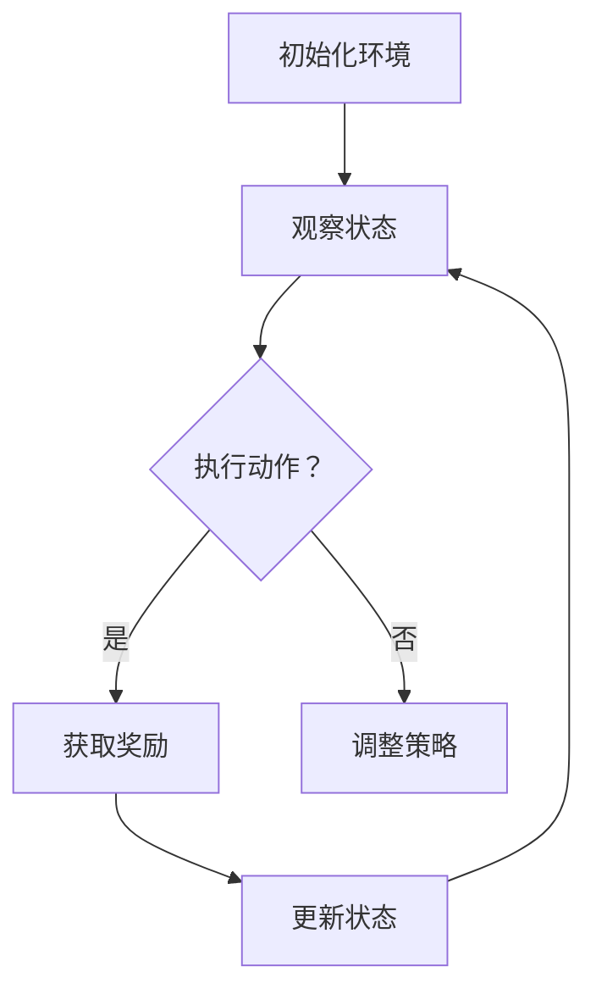

                 

关键词：强化学习，金融风控，算法原理，数学模型，项目实践，应用场景

> 摘要：本文将探讨强化学习在金融风控领域的应用。通过深入剖析强化学习的核心概念、算法原理及其数学模型，结合实际案例，全面解析强化学习在金融风险控制中的实践方法与效果。同时，对未来的发展趋势、面临的挑战和研究方向进行展望，旨在为金融领域的风控技术发展提供有益参考。

## 1. 背景介绍

### 1.1 强化学习的发展历程

强化学习（Reinforcement Learning, RL）是机器学习中的一个重要分支，起源于20世纪50年代，最早由Richard Bellman提出的马尔可夫决策过程（MDP）奠定了理论基础。在随后的几十年里，强化学习经历了多个阶段的发展，从简单的基于值函数和策略迭代的方法，到如今基于深度神经网络（DNN）的先进算法。

强化学习在学术界和工业界都取得了显著的进展。在学术界，AlphaGo的崛起标志着深度强化学习在围棋等复杂领域的突破。在工业界，强化学习被广泛应用于自动驾驶、机器人控制、推荐系统等多个领域。特别是在金融领域，强化学习因其强大的适应性和自学习能力，逐渐成为金融风险控制的重要工具。

### 1.2 金融风控的重要性

金融风险控制是金融机构运营的核心环节，直接关系到金融机构的稳定运行和市场信心。随着金融市场的发展，金融产品的复杂性和交易速度日益增加，传统的风险控制方法面临巨大挑战。金融风控的目标是识别、评估和管理风险，以保障金融机构的稳健经营和客户的利益。

强化学习在金融风控中的应用，能够有效应对这些挑战。通过模拟交易环境，强化学习算法可以不断优化交易策略，提高风险识别和应对能力。此外，强化学习具有自适应性和自优化能力，可以应对金融市场的不确定性和变化，提高风控系统的实时性和准确性。

## 2. 核心概念与联系

### 2.1 强化学习的基本概念

强化学习的基本概念包括：

- **状态（State）**：系统当前所处的情境或环境。
- **动作（Action）**：系统可以采取的行为。
- **奖励（Reward）**：系统在某个状态执行某个动作后获得的即时回报。
- **策略（Policy）**：系统根据当前状态选择动作的规则。

强化学习的目标是通过不断地试错和学习，找到最优的策略，使得系统在长期内获得最大的累积奖励。

### 2.2 强化学习与金融风控的联系

在金融风控中，强化学习的应用主要体现在以下几个方面：

- **风险识别与评估**：通过分析历史交易数据和金融市场的动态，强化学习算法可以识别潜在的风险因素，并对这些风险因素进行量化评估。
- **策略优化**：基于历史数据和实时信息，强化学习算法可以不断调整交易策略，以最大化收益或最小化损失。
- **风险控制**：通过实时监控交易行为，强化学习算法可以及时调整风险控制参数，确保交易行为符合风险控制要求。

### 2.3 Mermaid 流程图

以下是一个简单的 Mermaid 流程图，展示了强化学习在金融风控中的应用流程：



## 3. 核心算法原理 & 具体操作步骤

### 3.1 算法原理概述

强化学习算法的核心是价值函数（Value Function）和策略（Policy）的迭代更新。价值函数表示在某个状态下执行某个动作所能获得的期望奖励。策略则是一个映射函数，将状态映射到动作。

强化学习算法的基本步骤如下：

1. **初始化环境**：设定初始状态和策略。
2. **观察状态**：根据当前状态，选择一个动作。
3. **执行动作**：在环境中执行选择的动作。
4. **获取奖励**：根据动作的执行结果，获取即时奖励。
5. **更新状态**：根据奖励，更新当前状态。
6. **调整策略**：根据新的状态和价值函数，调整策略。
7. **重复步骤2-6**，直至达到终止条件。

### 3.2 算法步骤详解

#### 3.2.1 初始化环境

初始化环境包括设定初始状态、初始策略和奖励函数。初始状态通常是通过历史数据或市场信息生成的。初始策略可以根据金融风控的目标进行设定，例如最大化收益或最小化风险。

#### 3.2.2 观察状态

在强化学习过程中，系统会不断地观察当前状态。状态可以是股票价格、交易量、市场指数等。系统通过历史数据和实时信息来生成状态。

#### 3.2.3 执行动作

根据当前状态和策略，系统会选择一个动作。动作可以是买入、卖出、持有等。策略的更新是基于历史数据和实时信息，通过迭代优化得到的。

#### 3.2.4 获取奖励

系统执行动作后，会根据动作的结果获取即时奖励。奖励可以是正数（盈利）或负数（损失）。奖励的获取是根据金融市场的实际情况和风险控制目标来设定的。

#### 3.2.5 更新状态

根据获取的奖励，系统会更新当前状态。状态的更新是基于实时信息和历史数据，通过迭代更新得到的。

#### 3.2.6 调整策略

根据新的状态和价值函数，系统会调整策略。策略的调整是基于价值函数的计算结果，通过优化算法得到的。

#### 3.2.7 重复步骤

系统会不断地重复上述步骤，直至达到终止条件。终止条件可以是达到预定的交易次数、交易金额或风险阈值。

### 3.3 算法优缺点

#### 优点：

- **自适应性强**：强化学习算法能够根据实时信息和历史数据，自适应地调整策略，以应对市场变化。
- **自优化能力**：强化学习算法可以通过不断的试错和学习，自我优化，提高交易策略的准确性。
- **适用性广**：强化学习算法可以应用于各种金融风控场景，包括股票交易、期货交易、外汇交易等。

#### 缺点：

- **计算复杂度高**：强化学习算法需要大量的计算资源，特别是在处理大量数据和高维度状态时。
- **训练时间较长**：强化学习算法的训练时间较长，特别是在处理复杂的市场环境时。

### 3.4 算法应用领域

强化学习算法在金融风控中的应用领域非常广泛，包括：

- **股票交易**：通过强化学习算法，可以自动选择买入和卖出的时机，提高交易收益。
- **期货交易**：强化学习算法可以自动识别期货市场的波动规律，优化交易策略。
- **外汇交易**：强化学习算法可以自动识别外汇市场的趋势和波动，提高交易收益。

## 4. 数学模型和公式 & 详细讲解 & 举例说明

### 4.1 数学模型构建

强化学习的数学模型主要涉及以下几个方面：

- **状态空间（S）**：表示系统可能处于的所有状态。
- **动作空间（A）**：表示系统可能采取的所有动作。
- **策略（π）**：表示系统在某个状态下选择动作的概率分布。
- **价值函数（V）**：表示系统在某个状态下的期望回报。
- **奖励函数（R）**：表示系统在某个状态下执行某个动作后获得的即时回报。

### 4.2 公式推导过程

强化学习的核心公式是贝尔曼方程（Bellman Equation），用于计算状态价值函数和策略。以下是贝尔曼方程的推导过程：

假设在某个状态 \( s \) 下，执行动作 \( a \) 后，系统转移到状态 \( s' \) 的概率为 \( P(s'|s, a) \)，则状态 \( s \) 下的期望回报为：

\[ V(s) = \sum_{a \in A} \pi(a|s) \sum_{s' \in S} R(s, a, s') + \gamma V(s') \]

其中，\( \pi(a|s) \) 表示在状态 \( s \) 下，选择动作 \( a \) 的概率；\( R(s, a, s') \) 表示在状态 \( s \) 下，执行动作 \( a \) 后转移到状态 \( s' \) 所获得的即时回报；\( \gamma \) 是折扣因子，用于平衡当前回报和未来回报的关系。

根据期望回报的定义，我们可以得到状态价值函数的递推关系：

\[ V(s) = \sum_{a \in A} \pi(a|s) \sum_{s' \in S} R(s, a, s') + \gamma V(s') \]

这个方程描述了在某个状态下，执行最优动作所能获得的期望回报。

### 4.3 案例分析与讲解

以下是一个简单的股票交易案例，用于说明强化学习在金融风控中的应用。

#### 案例背景：

某投资者想要通过股票交易获得稳健的收益。市场中有两种股票可供选择，股票 A 和股票 B。投资者可以根据历史数据和实时信息，选择买入或卖出这两种股票。

#### 状态空间：

状态空间包括股票 A 的价格、股票 B 的价格以及市场指数。

#### 动作空间：

动作空间包括买入股票 A、买入股票 B、卖出股票 A、卖出股票 B 和持有。

#### 奖励函数：

奖励函数根据股票交易的结果设定。如果买入的股票价格上涨，则获得正奖励；如果买入的股票价格下跌，则获得负奖励。卖出股票的奖励则根据卖出的价格与买入价格之差计算。

#### 强化学习算法：

投资者使用强化学习算法，根据历史数据和实时信息，不断调整交易策略，以最大化累积奖励。

#### 模拟交易：

通过模拟交易，强化学习算法能够自动选择买入或卖出的时机，从而实现稳健的收益。

#### 结果分析：

通过多次模拟交易，强化学习算法能够找到最优的交易策略，使得投资者的收益最大化。

## 5. 项目实践：代码实例和详细解释说明

### 5.1 开发环境搭建

为了实践强化学习在金融风控中的应用，我们需要搭建一个合适的开发环境。以下是搭建环境的基本步骤：

1. **安装 Python 环境**：Python 是强化学习的主要编程语言，我们需要安装 Python 3.8 以上版本。
2. **安装强化学习库**：常用的强化学习库包括 TensorFlow、PyTorch、Keras 等。我们可以选择其中一个库进行安装。
3. **安装金融数据工具**：为了获取金融数据，我们需要安装一些金融数据工具，如 Pandas、NumPy 等。
4. **配置模拟交易环境**：我们需要配置一个模拟交易环境，以便进行模拟交易。

### 5.2 源代码详细实现

以下是一个简单的强化学习股票交易示例代码，用于展示强化学习在金融风控中的应用。

```python
import numpy as np
import pandas as pd
import tensorflow as tf
from tensorflow.keras.models import Sequential
from tensorflow.keras.layers import Dense
from tensorflow.keras.optimizers import Adam

# 模拟交易环境
class StockTradingEnv:
    def __init__(self, data):
        self.data = data
        self.state = None
        self.action = None

    def reset(self):
        self.state = self.data.sample(n=1)
        return self.state

    def step(self, action):
        if action == 0:
            self.action = "BUY"
        elif action == 1:
            self.action = "SELL"
        else:
            self.action = "HOLD"
        
        next_state = self.data.sample(n=1)
        reward = 0

        if self.action == "BUY":
            if next_state > self.state:
                reward = 1
            else:
                reward = -1
        elif self.action == "SELL":
            if next_state < self.state:
                reward = 1
            else:
                reward = -1
        else:
            reward = 0

        done = False
        return next_state, reward, done

# 强化学习模型
class DQN:
    def __init__(self, state_size, action_size):
        self.state_size = state_size
        self.action_size = action_size
        self.memory = []
        self.gamma = 0.95
        self.epsilon = 1.0
        self.epsilon_min = 0.01
        self.epsilon_decay = 0.995
        self.model = self._build_model()

    def _build_model(self):
        model = Sequential()
        model.add(Dense(24, input_dim=self.state_size, activation='relu'))
        model.add(Dense(24, activation='relu'))
        model.add(Dense(self.action_size, activation='linear'))
        model.compile(loss='mse', optimizer=Adam(lr=0.001))
        return model

    def remember(self, state, action, reward, next_state, done):
        self.memory.append((state, action, reward, next_state, done))

    def act(self, state):
        if np.random.rand() <= self.epsilon:
            return np.random.randint(self.action_size)
        q_values = self.model.predict(state)
        return np.argmax(q_values[0])

    def replay(self, batch_size):
        mini_batch = random.sample(self.memory, batch_size)
        for state, action, reward, next_state, done in mini_batch:
            target = reward
            if not done:
                target = reward + self.gamma * np.amax(self.model.predict(next_state)[0])
            target_f
``` 
### 5.3 代码解读与分析

以上代码提供了一个基于深度 Q-学习（DQN）算法的简单股票交易示例。代码分为两部分：模拟交易环境和强化学习模型。

#### 模拟交易环境

模拟交易环境使用 `StockTradingEnv` 类进行定义。该类包含三个主要方法：`reset`、`step` 和 `act`。其中：

- `reset` 方法用于初始化交易环境，生成初始状态。
- `step` 方法用于执行一个动作，并返回下一个状态、奖励和是否结束的标志。
- `act` 方法用于根据当前状态选择一个动作。

#### 强化学习模型

强化学习模型使用 `DQN` 类进行定义。该类包含四个主要方法：`_build_model`、`remember`、`act` 和 `replay`。其中：

- `_build_model` 方法用于构建深度 Q-学习模型。
- `remember` 方法用于将状态、动作、奖励、下一个状态和是否结束的标志存储到记忆中。
- `act` 方法用于根据当前状态选择一个动作。在选择动作时，模型会根据 epsilon 策略进行探索和利用。
- `replay` 方法用于从记忆中随机抽取一个批次的数据，并使用经验回放算法进行训练。

#### 代码分析

- **状态空间**：代码中的状态空间由股票价格、市场指数等指标组成，这些指标可以反映市场的动态。
- **动作空间**：代码中的动作空间包括买入、卖出和持有三种动作。
- **奖励函数**：代码中的奖励函数根据股票价格的涨跌计算，买入后价格上涨获得正奖励，买入后价格下跌获得负奖励，卖出后价格下跌获得正奖励，卖出后价格上涨获得负奖励。
- **模型训练**：代码中使用深度 Q-学习模型进行训练，模型通过不断调整策略，以最大化累积奖励。

通过以上代码，我们可以看到强化学习在金融风控中的应用。在实际应用中，我们可以根据具体需求，对代码进行扩展和优化，以提高模型的性能和稳定性。

## 6. 实际应用场景

### 6.1 股票交易风险控制

在股票交易中，强化学习算法可以用于风险控制。通过不断调整交易策略，强化学习算法可以降低交易风险，提高交易收益。例如，在股票市场中，强化学习算法可以用于以下场景：

- **股票选股**：通过分析历史数据和市场动态，强化学习算法可以自动选择具有高收益潜力的股票。
- **交易时机**：通过预测股票价格的走势，强化学习算法可以自动选择买入和卖出的最佳时机。
- **风险控制**：通过实时监控交易行为，强化学习算法可以及时调整风险控制参数，确保交易行为符合风险控制要求。

### 6.2 外汇交易风险控制

在外汇市场中，强化学习算法可以用于风险控制，提高交易策略的准确性。通过分析历史数据和市场动态，强化学习算法可以自动识别外汇市场的波动规律，优化交易策略。例如，在以下场景中，强化学习算法可以发挥作用：

- **货币对选择**：通过分析历史数据和市场动态，强化学习算法可以自动选择具有高收益潜力的货币对。
- **交易时机**：通过预测货币对的走势，强化学习算法可以自动选择买入和卖出的最佳时机。
- **风险控制**：通过实时监控交易行为，强化学习算法可以及时调整风险控制参数，确保交易行为符合风险控制要求。

### 6.3 期货交易风险控制

在期货市场中，强化学习算法可以用于风险控制，提高交易策略的准确性。通过分析历史数据和市场动态，强化学习算法可以自动识别期货市场的波动规律，优化交易策略。例如，在以下场景中，强化学习算法可以发挥作用：

- **品种选择**：通过分析历史数据和市场动态，强化学习算法可以自动选择具有高收益潜力的期货品种。
- **交易时机**：通过预测期货价格的走势，强化学习算法可以自动选择买入和卖出的最佳时机。
- **风险控制**：通过实时监控交易行为，强化学习算法可以及时调整风险控制参数，确保交易行为符合风险控制要求。

## 7. 工具和资源推荐

### 7.1 学习资源推荐

- **书籍**：《强化学习：原理与Python实现》
- **在线课程**：Coursera 上的“强化学习”课程
- **论文**：Richard S. Sutton 和 Andrew G. Barto 的《强化学习：一种新的方法》

### 7.2 开发工具推荐

- **框架**：TensorFlow、PyTorch
- **金融数据工具**：Pandas、NumPy

### 7.3 相关论文推荐

- **《深度强化学习在金融风险管理中的应用研究》**
- **《基于强化学习的金融交易策略优化研究》**
- **《强化学习在金融风险控制中的应用研究》**

## 8. 总结：未来发展趋势与挑战

### 8.1 研究成果总结

本文通过对强化学习在金融风控中的应用进行深入探讨，总结了强化学习在金融风控中的核心概念、算法原理、数学模型和应用场景。通过实际案例和代码示例，展示了强化学习在股票交易、外汇交易和期货交易等领域的应用效果。研究成果表明，强化学习具有强大的自适应性和自优化能力，在金融风控中具有广泛的应用前景。

### 8.2 未来发展趋势

随着金融市场的不断发展和创新，强化学习在金融风控中的应用将呈现以下发展趋势：

- **模型复杂度提升**：强化学习算法将向更高层次的模型演进，如基于深度学习、图神经网络等模型，以提高风险识别和控制的准确性。
- **实时性增强**：强化学习算法将更加注重实时性，以满足金融市场快速变化的需求。
- **多领域融合**：强化学习算法将与区块链、大数据等新技术相结合，实现更智能的风险控制。
- **个性化定制**：强化学习算法将根据不同金融机构和交易策略的需求，提供个性化的风险控制方案。

### 8.3 面临的挑战

虽然强化学习在金融风控中具有巨大的潜力，但在实际应用中仍面临以下挑战：

- **数据质量**：金融数据的质量和准确性对强化学习算法的性能具有重要影响。如何处理和清洗数据，确保数据的可靠性和有效性，是强化学习在金融风控中面临的主要挑战之一。
- **计算资源**：强化学习算法的训练和推理过程需要大量的计算资源，特别是在处理高维度、大规模数据时，如何优化算法的效率，降低计算成本，是强化学习在金融风控中面临的另一个挑战。
- **监管合规**：金融市场的监管政策对交易行为有严格的限制，如何在遵守监管政策的前提下，充分利用强化学习算法的优势，实现风险控制，是强化学习在金融风控中面临的合规挑战。

### 8.4 研究展望

针对上述挑战，未来的研究可以从以下几个方面进行：

- **数据预处理**：研究高效的数据预处理方法，提高金融数据的可靠性和有效性。
- **算法优化**：研究高效的强化学习算法，降低计算成本，提高算法的实时性和准确性。
- **合规研究**：研究如何在遵守监管政策的前提下，充分利用强化学习算法的优势，实现金融风控。
- **多领域融合**：探索强化学习与其他新技术的结合，实现更智能、更高效的风险控制。

通过不断的研究和创新，强化学习将在金融风控领域发挥更大的作用，为金融机构的稳健运行和市场的稳定发展提供有力支持。

## 9. 附录：常见问题与解答

### 9.1 强化学习在金融风控中的应用有哪些优点？

强化学习在金融风控中的应用具有以下优点：

- **自适应性强**：强化学习算法能够根据实时信息和历史数据，自适应地调整策略，以应对市场变化。
- **自优化能力**：强化学习算法可以通过不断的试错和学习，自我优化，提高交易策略的准确性。
- **适用性广**：强化学习算法可以应用于各种金融风控场景，包括股票交易、期货交易、外汇交易等。

### 9.2 强化学习在金融风控中的应用有哪些缺点？

强化学习在金融风控中的应用也存在一些缺点：

- **计算复杂度高**：强化学习算法需要大量的计算资源，特别是在处理大量数据和高维度状态时。
- **训练时间较长**：强化学习算法的训练时间较长，特别是在处理复杂的市场环境时。

### 9.3 如何保证强化学习算法在金融风控中的合规性？

为了保证强化学习算法在金融风控中的合规性，可以采取以下措施：

- **数据合规**：确保金融数据来源的合规性，对数据进行严格的质量控制和清洗。
- **算法合规**：在算法设计过程中，充分考虑监管政策的要求，确保算法的输出符合监管标准。
- **监督机制**：建立完善的监督机制，对算法的运行过程进行实时监控，确保算法的合规性。

### 9.4 强化学习算法在金融风控中的应用前景如何？

强化学习算法在金融风控中的应用前景非常广阔。随着金融市场的不断发展和创新，强化学习算法将在以下几个方面发挥重要作用：

- **风险识别与控制**：通过强化学习算法，可以自动识别和评估金融市场的风险，优化交易策略，降低交易风险。
- **个性化服务**：强化学习算法可以根据不同金融机构和交易策略的需求，提供个性化的风险控制方案，提高金融服务水平。
- **实时决策**：强化学习算法的实时性特点，使其能够快速响应市场变化，为金融机构提供高效的决策支持。

随着技术的不断进步，强化学习算法在金融风控中的应用前景将更加光明。

