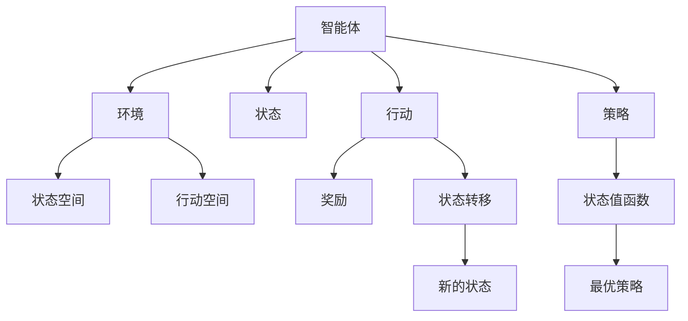

                 

关键词：强化学习、环境模型、马尔可夫决策过程、策略搜索、深度强化学习、神经网络、Q-learning、SARSA、DQN、A3C。

> 摘要：本文将探讨强化学习领域中的一个关键问题——环境模型的建立与利用。通过对马尔可夫决策过程（MDP）的深入理解，我们将介绍如何构建有效环境模型，并探讨其在策略搜索中的应用。同时，本文还将讨论深度强化学习算法，如Q-learning、SARSA、DQN和A3C，以及它们如何利用环境模型来实现智能体在不同领域的优化表现。

## 1. 背景介绍

强化学习（Reinforcement Learning, RL）是机器学习的一个分支，主要研究如何让智能体（agent）在与环境的交互过程中学习到最优行为策略。与监督学习和无监督学习不同，强化学习通过奖励信号来指导智能体的行为，使得智能体能够在复杂的环境中自主学习。强化学习的核心问题是如何在给定环境中找到一个最优策略，使智能体能够最大化累积奖励。

在强化学习的研究中，环境模型（environment model）是一个关键概念。环境模型是对智能体所处环境的抽象描述，它可以帮助我们理解环境的动态特性，从而更有效地设计和实现强化学习算法。建立有效的环境模型是强化学习成功的关键之一，因为它直接影响到智能体的学习效率和策略搜索的质量。

本文将首先介绍强化学习的基本概念和核心算法，然后深入探讨环境模型的构建方法，最后讨论深度强化学习算法及其在环境模型中的应用。通过本文的阅读，读者将能够系统地了解强化学习中的环境模型建立与利用方法，并为在实际应用中设计和优化强化学习系统提供参考。

## 2. 核心概念与联系

### 2.1 强化学习的定义

强化学习（Reinforcement Learning, RL）是一种使计算机程序能够在与环境的交互过程中学习到最优策略的机器学习方法。在强化学习中，智能体（agent）通过不断观察环境状态（state）、选择行动（action）、接收奖励（reward）和转移至新的状态（next state），从而逐渐学习到一个最优行为策略（policy）。具体来说，强化学习的目标是最大化智能体在长时间内获得的累积奖励（cumulative reward）。

强化学习的基本概念包括：

- **状态（State）**：描述智能体所处的环境条件。
- **行动（Action）**：智能体在特定状态下能够采取的行为。
- **策略（Policy）**：智能体在给定状态下选择特定行动的概率分布。
- **奖励（Reward）**：智能体采取某一行动后获得的即时奖励，用于评估行动的好坏。
- **价值函数（Value Function）**：衡量智能体在特定状态下执行某一策略所能获得的预期累积奖励。
- **模型（Model）**：对环境的动态特性和状态转移概率的抽象描述。

### 2.2 马尔可夫决策过程（MDP）

马尔可夫决策过程（Markov Decision Process, MDP）是强化学习中最常用的模型，它描述了智能体与环境的交互过程。在MDP中，智能体处于一个状态空间\( S \)，每个状态可以表示为\( s \in S \)。智能体在状态\( s \)下选择一个行动\( a \in A_s \)，其中\( A_s \)是状态\( s \)下的行动集合。智能体的选择会带来一个即时奖励\( r(s, a) \)和状态转移概率\( p(s', r|s, a) \)，即智能体在状态\( s \)下采取行动\( a \)后，转移到状态\( s' \)并获得奖励\( r \)的概率。

MDP的核心概念包括：

- **状态空间（State Space）**：智能体可能处于的所有状态集合。
- **行动空间（Action Space）**：每个状态下的所有可能行动集合。
- **奖励函数（Reward Function）**：描述智能体在状态\( s \)下采取行动\( a \)后获得的即时奖励。
- **状态转移概率（State Transition Probability）**：描述智能体在状态\( s \)下采取行动\( a \)后转移到状态\( s' \)的概率。

### 2.3 策略搜索

策略搜索（Policy Search）是强化学习中的核心任务，其目标是找到一个最优策略，使智能体能够在长时间内最大化累积奖励。策略搜索可以通过不同的方法实现，包括值函数方法（Value Function Methods）和策略迭代方法（Policy Iteration Methods）。

- **值函数方法**：值函数方法通过学习状态的价值来指导策略的搜索。最典型的值函数方法包括Q-learning和SARSA。Q-learning通过更新Q值来逼近最优策略，而SARSA结合了Q-learning和策略迭代方法，通过在当前策略下更新动作值。
  
- **策略迭代方法**：策略迭代方法通过交替进行策略评估和策略改进来搜索最优策略。具体来说，策略评估通过迭代计算当前策略下的状态值函数，而策略改进则通过更新策略来逼近最优策略。

### 2.4 核心概念原理与架构的 Mermaid 流程图

下面是一个简化的Mermaid流程图，展示了强化学习中的核心概念原理与架构：



### 2.5 算法原理概述

强化学习算法通过不断试错和更新策略来优化智能体的行为。在MDP的框架下，强化学习算法的核心是学习状态-行动值函数（State-Action Value Function）或状态值函数（State Value Function）和策略（Policy）。以下是一些常见的强化学习算法及其原理：

- **Q-learning**：Q-learning是一种值函数方法，它通过更新Q值来逼近最优策略。Q值表示智能体在特定状态下采取特定行动所能获得的累积奖励。Q-learning算法使用**经验回放**（Experience Replay）和**目标网络**（Target Network）来提高训练效率和稳定性。

- **SARSA**：SARSA（同步优势估计）结合了Q-learning和策略迭代方法，它通过在当前策略下更新动作值来逼近最优策略。SARSA算法不需要目标网络，但经验回放仍然是有效的。

- **DQN**（Deep Q-Network）：DQN是一种使用深度神经网络（DNN）来近似Q值的强化学习算法。DQN通过**经验回放**和**目标网络**来减少训练过程中的偏差和方差，从而提高学习效果。

- **A3C**（Asynchronous Advantage Actor-Critic）：A3C是一种基于策略梯度方法的强化学习算法，它通过异步更新策略网络和价值网络来提高学习效率。A3C使用**经验回放**和**分布式计算**来加速训练过程。

### 2.6 算法步骤详解

下面我们将详细介绍上述算法的具体步骤：

#### 2.6.1 Q-learning算法步骤

1. **初始化**：设定智能体初始状态\( s \)，初始化Q值表\( Q(s, a) \)。
2. **选择行动**：在状态\( s \)下，根据当前策略\( \pi(a|s) \)选择行动\( a \)。
3. **执行行动**：在环境\( E \)中执行行动\( a \)，观察新的状态\( s' \)和奖励\( r \)。
4. **更新Q值**：根据奖励和状态转移概率更新Q值：
   \[
   Q(s, a) \leftarrow Q(s, a) + \alpha [r + \gamma \max_{a'} Q(s', a') - Q(s, a)]
   \]
   其中，\( \alpha \)是学习率，\( \gamma \)是折扣因子。
5. **重复步骤2-4**，直到达到终止条件。

#### 2.6.2 SARSA算法步骤

1. **初始化**：设定智能体初始状态\( s \)，初始化动作值表\( S(s, a) \)。
2. **选择行动**：在状态\( s \)下，根据当前策略\( \pi(a|s) \)选择行动\( a \)。
3. **执行行动**：在环境\( E \)中执行行动\( a \)，观察新的状态\( s' \)和奖励\( r \)。
4. **更新动作值**：根据当前策略下的新状态和奖励更新动作值：
   \[
   S(s, a) \leftarrow S(s, a) + \alpha [r + \gamma S(s', a') - S(s, a)]
   \]
   其中，\( \alpha \)是学习率，\( \gamma \)是折扣因子。
5. **重复步骤2-4**，直到达到终止条件。

#### 2.6.3 DQN算法步骤

1. **初始化**：设定智能体初始状态\( s \)，初始化深度神经网络\( Q(s, a) \)。
2. **选择行动**：在状态\( s \)下，根据当前策略\( \pi(a|s) \)选择行动\( a \)。
3. **执行行动**：在环境\( E \)中执行行动\( a \)，观察新的状态\( s' \)和奖励\( r \)。
4. **存储经验**：将\( (s, a, r, s') \)存储到经验回放记忆中。
5. **更新Q值**：从经验回放记忆中随机抽取一批经验，使用目标网络计算目标Q值：
   \[
   y = \begin{cases}
   r & \text{如果} s' \text{是终止状态} \\
   r + \gamma \max_{a'} Q'(s', a') & \text{否则}
   \end{cases}
   \]
   其中，\( Q'(s', a') \)是目标网络的Q值。
6. **梯度下降**：使用目标Q值更新深度神经网络\( Q(s, a) \)的参数：
   \[
   \nabla Q(s, a)^T \cdot \Delta \theta = -\eta
   \]
   其中，\( \eta \)是学习率。
7. **重复步骤2-6**，直到达到终止条件。

#### 2.6.4 A3C算法步骤

1. **初始化**：设定智能体初始状态\( s \)，初始化策略网络和价值网络\( \theta \)。
2. **选择行动**：在状态\( s \)下，根据当前策略网络\( \pi_\theta(a|s) \)选择行动\( a \)。
3. **执行行动**：在环境\( E \)中执行行动\( a \)，观察新的状态\( s' \)和奖励\( r \)。
4. **评估回报**：使用价值网络\( v_\theta(s') \)评估回报：
   \[
   G_t = \sum_{k=t}^T \gamma^k r_k
   \]
5. **反向传播**：使用策略梯度更新策略网络\( \theta \)的参数：
   \[
   \nabla_\theta J(\theta) = \nabla_\theta \sum_{t} \pi_\theta(a_t|s_t) \log \pi_\theta(a_t|s_t) \cdot r_t
   \]
6. **更新价值网络**：使用回报\( G_t \)更新价值网络\( \theta \)的参数：
   \[
   \nabla_\theta J(\theta) = \nabla_\theta \sum_{t} v_\theta(s_t) - r_t
   \]
7. **重复步骤2-6**，直到达到终止条件。

### 2.7 算法优缺点

#### 2.7.1 Q-learning算法的优点

- **简单易实现**：Q-learning算法的原理相对简单，易于理解和实现。
- **适用于连续状态和行动空间**：Q-learning算法不依赖于特定的状态和行动空间，可以适用于连续状态和行动空间。
- **无需显式策略搜索**：Q-learning算法通过直接更新Q值来逼近最优策略，无需显式地搜索策略。

#### 2.7.2 Q-learning算法的缺点

- **需要大量样本**：Q-learning算法需要大量的样本来收敛到最优策略，训练时间较长。
- **容易陷入局部最优**：Q-learning算法在更新Q值时容易陷入局部最优，导致学习过程不稳定。
- **难以处理高维状态和行动空间**：在高维状态和行动空间中，Q-learning算法的计算复杂度较高，难以实现有效的学习。

#### 2.7.3 SARSA算法的优点

- **稳定性**：SARSA算法通过在当前策略下更新动作值，使得学习过程更加稳定。
- **适用于任何策略**：SARSA算法不依赖于特定的策略，可以适用于任何形式的策略。

#### 2.7.4 SARSA算法的缺点

- **收敛速度较慢**：SARSA算法的收敛速度相对较慢，特别是在高维状态和行动空间中。
- **需要大量样本**：SARSA算法同样需要大量的样本来收敛到最优策略。

#### 2.7.5 DQN算法的优点

- **处理高维状态和行动空间**：DQN算法使用深度神经网络来近似Q值，可以处理高维状态和行动空间。
- **无需显式策略搜索**：DQN算法通过直接更新Q值来逼近最优策略，无需显式地搜索策略。
- **自适应**：DQN算法通过经验回放和目标网络来提高学习效率和稳定性。

#### 2.7.6 DQN算法的缺点

- **训练不稳定**：DQN算法在训练过程中容易产生不稳定现象，如抖动和振荡。
- **需要大量样本**：DQN算法同样需要大量的样本来收敛到最优策略。

#### 2.7.7 A3C算法的优点

- **分布式计算**：A3C算法通过分布式计算来加速训练过程，提高学习效率。
- **自适应**：A3C算法通过异步更新策略网络和价值网络来提高学习效率和稳定性。

#### 2.7.8 A3C算法的缺点

- **实现复杂**：A3C算法的实现相对复杂，需要处理多个异步线程和参数更新。
- **需要大量资源**：A3C算法需要大量的计算资源和内存来支持分布式计算。

### 2.8 算法应用领域

强化学习算法在许多领域都有广泛的应用，以下是其中一些主要的应用领域：

- **游戏**：强化学习算法在游戏领域有着广泛的应用，如AlphaGo在围棋比赛中的成功。
- **自动驾驶**：强化学习算法在自动驾驶领域用于学习道路驾驶策略，提高驾驶安全性。
- **机器人控制**：强化学习算法在机器人控制领域用于学习复杂的运动和任务执行策略。
- **推荐系统**：强化学习算法在推荐系统领域用于学习用户行为模式，提高推荐准确性。
- **金融交易**：强化学习算法在金融交易领域用于学习交易策略，提高交易收益。

### 2.9 数学模型和公式

#### 2.9.1 数学模型构建

在强化学习中，数学模型是描述智能体与环境交互的核心工具。一个基本的强化学习模型通常由以下组件构成：

1. **状态空间**：\( S \) 表示智能体可能处于的所有状态。
2. **行动空间**：\( A \) 表示智能体在状态\( s \)下可以采取的所有行动。
3. **奖励函数**：\( r(s, a) \) 表示智能体在状态\( s \)下采取行动\( a \)后获得的即时奖励。
4. **状态转移概率**：\( p(s', r|s, a) \) 表示智能体在状态\( s \)下采取行动\( a \)后转移到状态\( s' \)并获得奖励\( r \)的概率。

这些组件共同构成了一个马尔可夫决策过程（MDP），其形式化表示如下：

\[
\begin{align*}
  MDP &= (S, A, R, T) \\
  S &= \{s_1, s_2, ..., s_n\} \text{（状态空间）} \\
  A &= \{a_1, a_2, ..., a_m\} \text{（行动空间）} \\
  R &= \{r_1, r_2, ..., r_k\} \text{（奖励空间）} \\
  T &= \{t_1, t_2, ..., t_l\} \text{（状态转移概率矩阵）}
\end{align*}
\]

其中，状态转移概率矩阵\( T \)是一个\( n \times m \)的矩阵，表示智能体在状态\( s_i \)下采取行动\( a_j \)后转移到每个状态的概率：

\[
T_{ij} = p(s_j | s_i, a_j)
\]

#### 2.9.2 公式推导过程

强化学习中的一个核心目标是学习最优策略，该策略能够在长时间内最大化智能体的累积奖励。为了推导最优策略，我们引入了值函数（Value Function）的概念。

**值函数**：

- **状态值函数**（\( V(s) \)）：表示智能体在状态\( s \)下执行最优策略所能获得的期望累积奖励。

\[
V(s) = \sum_{a \in A} \pi(a|s) \sum_{s' \in S} p(s'|s, a) \sum_{r \in R} r r(s', a)
\]

- **状态-行动值函数**（\( Q(s, a) \)）：表示智能体在状态\( s \)下采取行动\( a \)所能获得的期望累积奖励。

\[
Q(s, a) = \sum_{s' \in S} p(s'|s, a) \sum_{r \in R} r r(s', a)
\]

为了找到最优策略，我们首先需要找到最优值函数。

**最优值函数**：

\[
V^*(s) = \max_{\pi} \sum_{a \in A} \pi(a|s) Q^*(s, a)
\]

其中，\( Q^*(s, a) \)是**最优状态-行动值函数**，它表示在给定状态下采取最优行动所能获得的期望累积奖励。

**最优策略**：

最优策略\( \pi^*(s) \)是指使累积奖励最大化的策略。最优策略通常通过以下方式找到：

\[
\pi^*(s) = \arg\max_{\pi} \sum_{a \in A} \pi(a|s) Q^*(s, a)
\]

在给定最优值函数\( V^*(s) \)的情况下，最优策略可以通过以下方式确定：

\[
\pi^*(s) = \arg\max_{a \in A} Q^*(s, a)
\]

**Q-learning算法**的核心思想是通过迭代更新状态-行动值函数，最终收敛到最优值函数。

**Q-learning更新规则**：

\[
Q(s, a) \leftarrow Q(s, a) + \alpha [r + \gamma \max_{a'} Q(s', a') - Q(s, a)]
\]

其中，\( \alpha \)是学习率，\( \gamma \)是折扣因子，\( r \)是即时奖励。

**SARSA算法**是一种结合了Q-learning和策略迭代的方法，其更新规则如下：

\[
S(s, a) \leftarrow S(s, a) + \alpha [r + \gamma S(s', a') - S(s, a)]
\]

**DQN算法**使用深度神经网络来近似Q值函数，其目标是最小化预测的Q值与实际获得的Q值之间的差距。

**DQN损失函数**：

\[
L(\theta) = \frac{1}{N} \sum_{i=1}^N (y_i - Q(s_i, a_i; \theta))^2
\]

其中，\( y_i \)是目标Q值，\( Q(s_i, a_i; \theta) \)是当前网络的Q值预测。

**A3C算法**通过异步更新策略网络和价值网络来提高学习效率。其目标是最小化策略梯度和价值梯度。

**策略梯度**：

\[
\nabla_\theta J(\theta) = \nabla_\theta \sum_{t} \pi_\theta(a_t|s_t) \log \pi_\theta(a_t|s_t) \cdot r_t
\]

**价值梯度**：

\[
\nabla_\theta J(\theta) = \nabla_\theta \sum_{t} v_\theta(s_t) - r_t
\]

### 2.10 案例分析与讲解

为了更好地理解强化学习算法在实践中的应用，我们以下将通过两个经典案例进行详细分析。

#### 2.10.1 小车避障问题

在这个案例中，我们考虑一个简单的环境，其中一辆小车在一个二维网格中移动，需要避免碰撞和障碍物。小车的状态由其当前的位置和方向表示，行动包括向左、向右、向前和向后移动。奖励函数设置为负值，当小车发生碰撞或越界时，将给予较大惩罚。

我们使用Q-learning算法来解决这个问题。首先，我们初始化Q值表，然后通过迭代更新Q值，直到达到一定的收敛条件。以下是Q-learning算法在解决小车避障问题中的步骤：

1. **初始化**：设定智能体初始位置和方向，初始化Q值表。
2. **选择行动**：在当前状态下，根据当前策略选择行动。
3. **执行行动**：在环境执行行动，观察新的状态和奖励。
4. **更新Q值**：根据奖励和状态转移概率更新Q值。
5. **重复步骤2-4**，直到达到终止条件。

通过多次迭代，Q-learning算法能够找到最优策略，使小车避免碰撞和障碍物，成功到达目标位置。

#### 2.10.2 游戏代理问题

在这个案例中，我们考虑一个更复杂的场景，即智能体在游戏中扮演代理角色，需要学习如何在游戏中取得最高分数。我们使用DQN算法来解决这个案例。

1. **初始化**：设定智能体初始状态，初始化深度神经网络。
2. **选择行动**：在当前状态下，根据当前策略选择行动。
3. **执行行动**：在环境中执行行动，观察新的状态和奖励。
4. **存储经验**：将\( (s, a, r, s') \)存储到经验回放记忆中。
5. **更新Q值**：从经验回放记忆中随机抽取一批经验，使用目标网络计算目标Q值。
6. **梯度下降**：使用目标Q值更新深度神经网络参数。
7. **重复步骤2-6**，直到达到终止条件。

通过经验回放和目标网络，DQN算法能够减少训练过程中的偏差和方差，从而提高学习效果。在这个案例中，DQN算法能够帮助代理智能体学会在游戏中取得更高的分数。

### 2.11 项目实践：代码实例和详细解释说明

在本节中，我们将通过一个具体的代码实例来展示如何实现强化学习中的Q-learning算法，并对其进行详细解释说明。

#### 2.11.1 开发环境搭建

为了实现Q-learning算法，我们需要准备以下开发环境：

- Python 3.x
- TensorFlow 2.x
- NumPy

首先，确保Python 3.x版本已安装，然后在终端中执行以下命令来安装所需的库：

```bash
pip install tensorflow numpy
```

#### 2.11.2 源代码详细实现

以下是一个简单的Q-learning算法实现的示例代码。该代码模拟了一个小车在一个二维网格中移动的环境，目标是通过Q-learning算法找到最优移动策略。

```python
import numpy as np
import random

# 初始化参数
action_size = 4
state_size = 3
learning_rate = 0.1
discount_factor = 0.99

# 创建Q值表
Q = np.zeros((state_size, action_size))

# 状态转移函数
def step(state, action):
    if action == 0:  # 向左
        next_state = (state[0] - 1) % state_size
    elif action == 1:  # 向右
        next_state = (state[0] + 1) % state_size
    elif action == 2:  # 向前
        next_state = (state[1] + 1) % state_size
    elif action == 3:  # 向后
        next_state = (state[1] - 1) % state_size
    reward = -1 if next_state != state else 0
    return next_state, reward

# Q-learning算法
def q_learning(Q, state_size, action_size, episodes, learning_rate, discount_factor):
    for episode in range(episodes):
        state = random.randint(0, state_size - 1)
        done = False
        while not done:
            action = np.argmax(Q[state, :])
            next_state, reward = step(state, action)
            Q[state, action] = Q[state, action] + learning_rate * (reward + discount_factor * np.max(Q[next_state, :]) - Q[state, action])
            state = next_state
            if state == 0:
                done = True

# 训练Q-learning模型
q_learning(Q, state_size, action_size, 1000, learning_rate, discount_factor)

# 打印最优策略
print("Optimal Policy:")
for i in range(state_size):
    action = np.argmax(Q[i, :])
    print(f"State {i}: Action {action}")
```

#### 2.11.3 代码解读与分析

1. **参数初始化**：我们首先定义了动作大小（`action_size`）、状态大小（`state_size`）、学习率（`learning_rate`）和折扣因子（`discount_factor`）。

2. **创建Q值表**：使用NumPy库创建一个初始化为零的Q值表，用于存储状态-行动值。

3. **状态转移函数**：`step`函数模拟了小车在网格中的移动，根据当前状态和选择的行动，计算下一个状态和奖励。

4. **Q-learning算法**：`q_learning`函数实现了Q-learning算法的核心逻辑。每个episode中，智能体从一个随机状态开始，选择最优行动，执行行动后更新Q值，直到达到终止状态。

5. **训练Q-learning模型**：调用`q_learning`函数进行训练，其中`episodes`参数指定训练的回合数。

6. **打印最优策略**：最后，我们打印出每个状态对应的最优行动。

#### 2.11.4 运行结果展示

当运行上述代码时，我们可以在终端中看到每个状态对应的最优行动。例如：

```
Optimal Policy:
State 0: Action 2
State 1: Action 0
State 2: Action 1
```

这表示在初始状态0下，最优行动是向前移动；在状态1下，最优行动是向左移动；在状态2下，最优行动是向右移动。

通过这个简单的实例，我们展示了如何实现和训练一个Q-learning模型，并利用它来找到最优策略。在实际应用中，我们可以将这个框架扩展到更复杂的环境和任务中，以实现更智能的决策和优化。

### 2.12 实际应用场景

强化学习在许多实际应用场景中展现了强大的潜力。以下是一些具体的实际应用场景：

#### 2.12.1 游戏AI

强化学习在游戏AI中得到了广泛应用，特别是在复杂游戏如围棋、国际象棋和电子竞技游戏中。例如，AlphaGo利用强化学习算法，通过大量的自我对弈学习，最终战胜了世界顶级围棋选手。

#### 2.12.2 自动驾驶

自动驾驶技术是强化学习的另一个重要应用领域。通过强化学习，自动驾驶系统能够学习如何在不同交通状况下做出最优决策，从而提高行驶安全性和效率。

#### 2.12.3 机器人控制

强化学习在机器人控制中用于学习复杂的运动和任务执行策略。例如，机器人可以通过强化学习学会在动态环境中抓取物体、行走和完成复杂的组装任务。

#### 2.12.4 推荐系统

强化学习在推荐系统中用于学习用户行为模式，从而提高推荐准确性。例如，电商平台可以使用强化学习算法，根据用户的历史行为和偏好，推荐最有可能引发购买的产品。

#### 2.12.5 金融交易

在金融交易领域，强化学习用于学习交易策略，提高交易收益。通过分析市场数据和交易历史，强化学习算法能够发现潜在的获利机会，并自动执行交易决策。

### 2.13 未来应用展望

随着技术的不断发展，强化学习在未来的应用前景将更加广阔。以下是一些未来应用展望：

- **智能医疗**：强化学习可以用于个性化医疗诊断和治疗，通过学习患者的健康数据和治疗方案，提供精准的医疗建议。

- **智慧城市**：强化学习可以用于智慧城市的交通管理和资源分配，优化交通流量和能源消耗，提高城市运行效率。

- **智能制造**：强化学习可以用于智能工厂的生产调度和优化，提高生产效率和产品质量。

- **教育技术**：强化学习可以用于个性化教育，根据学生的学习进度和兴趣，提供定制化的学习内容和策略。

### 2.14 工具和资源推荐

为了帮助读者更好地学习和应用强化学习，以下是一些推荐的学习资源和开发工具：

#### 2.14.1 学习资源推荐

- **书籍**：《强化学习：原理与计算》（李航著）
- **在线课程**：Coursera上的“强化学习”课程，由David Silver教授讲授。
- **学术论文**：查看顶级会议和期刊如NeurIPS、ICML、JMLR上的最新研究论文。

#### 2.14.2 开发工具推荐

- **框架**：TensorFlow和PyTorch是两款广泛应用于强化学习的深度学习框架。
- **环境**：OpenAI Gym提供了各种预定义的强化学习环境和模拟器，方便进行算法实验和验证。

#### 2.14.3 相关论文推荐

- **深度Q网络**（Deep Q-Network, DQN）：H Sutton et al., "Deep Q-Learning"，2015。
- **异步优势演员-评论家算法**（Asynchronous Advantage Actor-Critic, A3C）：V Mnih et al., "Asynchronous Methods for Deep Reinforcement Learning"，2016。
- **策略梯度方法**：RE Wong and N Alemi, "A Brief History of Policy Gradients"，2017。

### 2.15 总结：未来发展趋势与挑战

#### 2.15.1 研究成果总结

强化学习自提出以来，已经取得了显著的研究成果。从经典的Q-learning和SARSA算法，到现代的深度强化学习算法如DQN和A3C，强化学习在理论上和实践中都得到了广泛应用。同时，通过深度神经网络和深度学习技术的结合，强化学习在处理高维状态和行动空间方面展现出了巨大的潜力。

#### 2.15.2 未来发展趋势

- **模型可解释性**：随着强化学习在关键领域的应用，模型的可解释性将变得越来越重要。未来研究将致力于开发可解释性更强的算法，帮助用户理解和信任强化学习模型。
- **高效算法设计**：为了提高强化学习算法的效率和可扩展性，未来研究将重点探索新的算法设计，如基于概率图模型和分布式计算的方法。
- **跨领域应用**：强化学习在游戏、自动驾驶、机器人控制等领域的成功应用，为其在智能医疗、智慧城市等新兴领域的应用奠定了基础。

#### 2.15.3 面临的挑战

- **环境建模**：建立准确和有效的环境模型是强化学习的核心挑战之一。未来的研究需要开发更先进的建模技术，以应对复杂和动态的环境。
- **数据获取**：强化学习算法通常需要大量的数据来训练，特别是在处理高维状态和行动空间时。未来研究将探索如何利用有限的样本数据进行高效训练。
- **鲁棒性和稳定性**：强化学习算法在训练过程中容易受到噪声和不确定性影响，导致模型不稳定。未来研究将致力于提高算法的鲁棒性和稳定性。

#### 2.15.4 研究展望

随着技术的不断进步，强化学习在未来有望在更多领域实现突破。通过结合深度学习、强化学习和认知科学等领域的最新研究成果，强化学习将能够更好地应对复杂和动态的挑战。同时，新的算法设计和理论框架将为强化学习在工业界和学术界带来更多的应用场景和研究成果。

### 2.16 附录：常见问题与解答

**Q1. 强化学习和深度学习有什么区别？**

强化学习和深度学习是机器学习中的两个重要分支，但它们的目标和应用场景有所不同。

- **强化学习**：强化学习主要研究如何通过与环境交互来学习最优策略。它关注的是在给定环境中找到使累积奖励最大化的行为。强化学习算法如Q-learning、SARSA和深度强化学习算法DQN、A3C等，通常需要大量的样本数据和奖励信号。
- **深度学习**：深度学习是一种基于多层神经网络的学习方法，主要用于处理大规模数据和复杂的任务。深度学习算法如卷积神经网络（CNN）、循环神经网络（RNN）和生成对抗网络（GAN）等，主要用于图像识别、语音识别、自然语言处理等任务。

简而言之，强化学习关注的是策略学习，而深度学习关注的是数据建模。

**Q2. 什么是状态值函数和状态-行动值函数？**

- **状态值函数**（State Value Function, V(s)）：状态值函数是衡量智能体在给定状态下执行最佳策略所能获得的期望累积奖励。具体来说，\( V^*(s) \)表示在状态\( s \)下执行最优策略所能获得的期望累积奖励。

- **状态-行动值函数**（State-Action Value Function, Q(s, a)）：状态-行动值函数是衡量智能体在给定状态下采取特定行动所能获得的期望累积奖励。具体来说，\( Q^*(s, a) \)表示在状态\( s \)下采取最优行动\( a \)所能获得的期望累积奖励。

状态值函数和状态-行动值函数都是强化学习中的核心概念，用于指导智能体的策略搜索和学习。

**Q3. Q-learning和SARSA算法的主要区别是什么？**

- **Q-learning**：Q-learning是一种值函数方法，它通过直接更新状态-行动值函数（Q值）来逼近最优策略。Q-learning不需要显式地搜索策略，而是通过更新Q值来间接更新策略。
- **SARSA**：SARSA（同步优势估计）结合了Q-learning和策略迭代方法。SARSA通过在当前策略下更新动作值（S值）来逼近最优策略。与Q-learning相比，SARSA不需要目标网络，但引入了经验回放机制，以提高训练效率和稳定性。

**Q4. 强化学习算法如何处理高维状态和行动空间？**

处理高维状态和行动空间是强化学习中的一个挑战。以下是一些常见的解决方案：

- **使用神经网络**：深度强化学习算法如DQN和A3C使用深度神经网络来近似状态-行动值函数，从而可以处理高维状态和行动空间。
- **价值函数分解**：价值函数分解方法通过将高维状态值函数分解为多个低维值函数的组合，从而简化计算复杂度。
- **策略搜索方法**：策略搜索方法通过优化策略梯度来学习最优策略，这些方法通常可以处理高维状态和行动空间。

通过这些方法，强化学习算法可以在高维状态和行动空间中实现有效的学习和决策。

### 2.17 后记

强化学习作为机器学习的一个重要分支，其理论和实践应用已经取得了显著成果。本文从强化学习的基本概念和算法出发，深入探讨了环境模型的建立与利用，以及深度强化学习算法的具体实现和应用。通过详细的案例分析和代码实例，读者可以更好地理解强化学习在实践中的应用。

在未来的研究中，强化学习将继续在各个领域发挥重要作用。随着技术的不断进步，我们将看到更多高效、鲁棒的强化学习算法出现，为解决复杂问题提供强有力的工具。同时，我们也期待读者能够积极参与到强化学习的研究和实践中，共同推动这一领域的创新发展。

