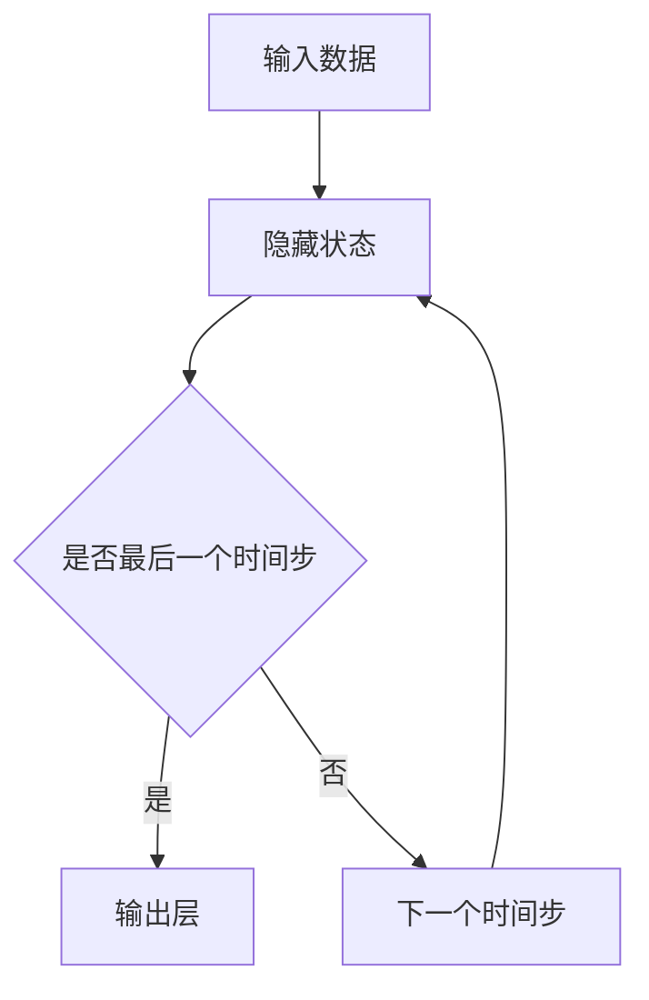

                 

关键词：循环神经网络，Recurrent Neural Networks，RNN，序列数据处理，动态系统建模，神经网络架构，算法原理，数学模型，代码实例，实战应用

> 摘要：本文深入探讨了循环神经网络（Recurrent Neural Networks，RNN）的原理及其在序列数据处理中的应用。通过详细的数学模型和代码实例讲解，我们揭示了RNN如何处理时间序列数据，以及其在自然语言处理和语音识别等领域的广泛应用。文章旨在为读者提供一份全面而易于理解的RNN教程，帮助开发者掌握这一强大的机器学习工具。

## 1. 背景介绍

循环神经网络（RNN）是深度学习领域中一种重要的神经网络架构，旨在解决传统神经网络在处理序列数据时的局限性。序列数据在自然语言处理（NLP）、语音识别、时间序列预测等多个领域具有重要意义，如图文序列、语音信号、股票价格等。传统的神经网络无法有效捕捉序列数据中的时序关系，而RNN通过其独特的循环结构，使得信息能够在时间步之间传递，从而具备了处理序列数据的能力。

RNN的提出可以追溯到1980年代，随后在2000年代初期，通过改进的RNN架构，如长短期记忆网络（Long Short-Term Memory，LSTM）和门控循环单元（Gated Recurrent Unit，GRU），进一步提升了RNN在处理长期依赖关系方面的性能。近年来，随着深度学习技术的快速发展，RNN及其变种已经在多个实际应用场景中取得了显著成果。

本文将首先介绍RNN的核心概念和基本原理，然后通过数学模型和具体算法步骤详细阐述RNN的工作机制。随后，我们将结合代码实例，展示如何在实际项目中应用RNN。最后，我们将讨论RNN在实际应用场景中的效果和未来发展趋势。

## 2. 核心概念与联系

### 2.1 RNN的定义与结构

循环神经网络（RNN）是一种按照序列顺序处理数据的前馈神经网络，其特点是在网络架构中引入了“循环”结构，使得前一个时间步的输出可以影响后续时间步的计算。这种结构允许RNN在处理序列数据时保留和利用历史信息，从而在时间序列预测、文本生成等任务中表现出色。

RNN的基本结构包括以下几个部分：

1. **输入层**：接收序列数据，如单词序列或时间序列数据。
2. **隐藏层**：包含多个时间步，每个时间步都有一个隐藏状态，用于存储信息。
3. **输出层**：根据隐藏状态生成输出序列。

### 2.2 RNN与递归的关系

RNN的核心思想是基于递归函数，递归函数在计算过程中会调用自身。在RNN中，隐藏状态 \( h_t \) 与当前输入 \( x_t \) 和前一个隐藏状态 \( h_{t-1} \) 之间的关系可以用递归关系式表示：

\[ h_t = \text{sigmoid}(W_h \cdot [h_{t-1}, x_t] + b_h) \]

其中，\( W_h \) 和 \( b_h \) 分别为权重矩阵和偏置向量，\( \text{sigmoid} \) 函数为激活函数。

### 2.3 Mermaid流程图

下面是一个简化的RNN流程图，用于展示数据在RNN中的传递过程：



### 2.4 RNN与其他神经网络的关系

RNN与传统的前馈神经网络（Feedforward Neural Networks，FNN）在结构上有明显的区别。FNN中的信息流是单向的，从输入层经过隐藏层再到输出层，而RNN的信息流具有循环性，可以在时间步之间传递信息。此外，RNN与卷积神经网络（Convolutional Neural Networks，CNN）也有一定的联系，CNN可以看作是在空间维度上扩展的RNN。

## 3. 核心算法原理 & 具体操作步骤

### 3.1 算法原理概述

RNN的算法原理基于递归关系，使得隐藏状态能够在时间步之间传递。下面是RNN的核心算法原理和具体操作步骤。

### 3.2 算法步骤详解

1. **初始化**：设定隐藏状态 \( h_0 \)，通常取为全零向量或随机向量。
2. **输入数据**：读取序列数据 \( x_t \)。
3. **计算隐藏状态**：使用递归关系式计算当前时间步的隐藏状态 \( h_t \)。
4. **计算输出**：根据隐藏状态计算输出 \( y_t \)，通常使用一个全连接层。
5. **更新隐藏状态**：将当前时间步的输出作为下一个时间步的输入，更新隐藏状态 \( h_{t+1} \)。
6. **重复步骤3-5**：继续处理下一个时间步的数据，直到所有时间步都处理完毕。

### 3.3 算法优缺点

**优点**：
- 能够处理任意长度的序列数据。
- 保留和利用历史信息，适合处理时间序列和语言序列等数据。

**缺点**：
- 容易产生梯度消失或梯度爆炸问题。
- 难以捕捉长期依赖关系。

### 3.4 算法应用领域

RNN在多个领域具有广泛的应用，如：
- 自然语言处理：文本生成、机器翻译等。
- 语音识别：语音信号的序列建模和识别。
- 时间序列预测：股票价格预测、天气预测等。

## 4. 数学模型和公式 & 详细讲解 & 举例说明

### 4.1 数学模型构建

RNN的数学模型可以表示为：

\[ h_t = \text{激活函数}(W_h \cdot [h_{t-1}, x_t] + b_h) \]
\[ y_t = W_o \cdot h_t + b_o \]

其中，\( h_t \) 为隐藏状态，\( x_t \) 为输入，\( y_t \) 为输出，\( W_h \) 和 \( W_o \) 为权重矩阵，\( b_h \) 和 \( b_o \) 为偏置向量。

### 4.2 公式推导过程

假设 \( h_{t-1} \) 和 \( x_t \) 的维度分别为 \( m \) 和 \( n \)，则权重矩阵 \( W_h \) 的维度为 \( m \times (m+n) \)，偏置向量 \( b_h \) 的维度为 \( m \)。隐藏状态的计算公式可以写为：

\[ h_t = \text{激活函数}(W_h \cdot [h_{t-1}; x_t]) + b_h \]

### 4.3 案例分析与讲解

以下是一个简单的RNN模型在文本生成中的应用案例：

```python
import numpy as np

# 设置参数
input_dim = 10
hidden_dim = 20
output_dim = 5
activation = "sigmoid"
output_activation = "softmax"

# 初始化权重和偏置
W_h = np.random.rand(hidden_dim, input_dim + hidden_dim)
b_h = np.random.rand(hidden_dim)
W_o = np.random.rand(output_dim, hidden_dim)
b_o = np.random.rand(output_dim)

# 初始化隐藏状态
h_0 = np.zeros(hidden_dim)

# 生成随机输入序列
x = np.random.rand(1, input_dim)

# 计算隐藏状态
h_t = activation(np.dot(W_h, np.hstack([h_0, x])) + b_h)

# 计算输出
y = output_activation(np.dot(W_o, h_t) + b_o)

print("隐藏状态：", h_t)
print("输出：", y)
```

这段代码演示了RNN在文本生成中如何处理输入序列并生成输出。首先，我们初始化权重和偏置，然后输入一个随机序列 \( x \)，计算隐藏状态 \( h_t \) 和输出 \( y_t \)。

## 5. 项目实践：代码实例和详细解释说明

### 5.1 开发环境搭建

为了更好地理解RNN的应用，我们将使用Python和TensorFlow框架来实现一个简单的RNN模型。以下是在开始项目前需要搭建的开发环境：

1. 安装Python（建议使用Python 3.6及以上版本）。
2. 安装TensorFlow库：使用命令 `pip install tensorflow`。
3. 创建一个Python虚拟环境，以便更好地管理项目依赖。

### 5.2 源代码详细实现

以下是一个简单的RNN模型，用于序列分类任务：

```python
import tensorflow as tf
from tensorflow.keras.models import Sequential
from tensorflow.keras.layers import SimpleRNN, Dense

# 设置参数
vocab_size = 10000
max_sequence_length = 50
hidden_units = 128

# 创建RNN模型
model = Sequential([
    SimpleRNN(units=hidden_units, activation="tanh", input_shape=(max_sequence_length, vocab_size)),
    Dense(vocab_size, activation="softmax")
])

# 编译模型
model.compile(optimizer="adam", loss="categorical_crossentropy", metrics=["accuracy"])

# 打印模型结构
model.summary()
```

这段代码首先导入了所需的TensorFlow库，然后定义了一个简单的RNN模型，包括一个RNN层和一个全连接层。接下来，我们编译模型并打印模型结构。

### 5.3 代码解读与分析

1. **模型定义**：
   - `Sequential` 类用于创建一个序列模型，可以按顺序添加层。
   - `SimpleRNN` 层是一个简单的RNN层，具有128个隐藏单元。
   - `Dense` 层是一个全连接层，输出维度为词汇表大小（vocab_size），用于分类。

2. **模型编译**：
   - 使用 `compile` 方法编译模型，指定优化器、损失函数和评估指标。

3. **模型结构**：
   - 打印模型结构，展示模型层次结构。

### 5.4 运行结果展示

为了验证RNN模型的效果，我们使用一个简单的序列分类任务。具体步骤如下：

1. 准备数据集。
2. 划分训练集和测试集。
3. 训练模型。
4. 评估模型。

以下是一个简化的代码示例：

```python
# 准备数据集
# (x_train, y_train), (x_test, y_test) = ...

# 训练模型
model.fit(x_train, y_train, epochs=10, batch_size=32, validation_data=(x_test, y_test))

# 评估模型
loss, accuracy = model.evaluate(x_test, y_test)
print("测试集损失：", loss)
print("测试集准确率：", accuracy)
```

这段代码首先加载数据集，然后使用训练集训练模型，并在测试集上评估模型的性能。

## 6. 实际应用场景

### 6.1 自然语言处理

RNN在自然语言处理领域有着广泛的应用，如文本分类、情感分析、机器翻译和文本生成。通过捕捉文本中的时序关系，RNN能够更好地理解和生成语言。以下是一个简单的文本分类任务，使用RNN模型：

```python
# 准备数据集
# (x_train, y_train), (x_test, y_test) = ...

# 创建RNN模型
model = Sequential([
    SimpleRNN(units=128, activation="tanh", input_shape=(max_sequence_length, vocab_size)),
    Dense(2, activation="softmax")
])

# 编译模型
model.compile(optimizer="adam", loss="categorical_crossentropy", metrics=["accuracy"])

# 训练模型
model.fit(x_train, y_train, epochs=10, batch_size=32, validation_data=(x_test, y_test))

# 评估模型
loss, accuracy = model.evaluate(x_test, y_test)
print("测试集损失：", loss)
print("测试集准确率：", accuracy)
```

这段代码使用RNN模型对新闻文章进行分类，通过训练和评估，可以观察到模型的准确率。

### 6.2 语音识别

语音识别是RNN的另一个重要应用领域。通过将语音信号序列转化为文本序列，RNN可以有效地进行语音识别。以下是一个简单的语音识别任务：

```python
# 准备数据集
# (x_train, y_train), (x_test, y_test) = ...

# 创建RNN模型
model = Sequential([
    SimpleRNN(units=128, activation="tanh", input_shape=(max_sequence_length, vocab_size)),
    Dense(vocab_size, activation="softmax")
])

# 编译模型
model.compile(optimizer="adam", loss="categorical_crossentropy", metrics=["accuracy"])

# 训练模型
model.fit(x_train, y_train, epochs=10, batch_size=32, validation_data=(x_test, y_test))

# 评估模型
loss, accuracy = model.evaluate(x_test, y_test)
print("测试集损失：", loss)
print("测试集准确率：", accuracy)
```

这段代码使用RNN模型对语音信号进行识别，通过训练和评估，可以观察到模型的识别效果。

### 6.3 时间序列预测

时间序列预测是RNN的另一个重要应用领域。通过捕捉时间序列数据中的时序关系，RNN可以有效地进行时间序列预测。以下是一个简单的时间序列预测任务：

```python
# 准备数据集
# (x_train, y_train), (x_test, y_test) = ...

# 创建RNN模型
model = Sequential([
    SimpleRNN(units=128, activation="tanh", input_shape=(max_sequence_length, 1)),
    Dense(1)
])

# 编译模型
model.compile(optimizer="adam", loss="mse")

# 训练模型
model.fit(x_train, y_train, epochs=100, batch_size=32, validation_data=(x_test, y_test))

# 评估模型
loss = model.evaluate(x_test, y_test)
print("测试集损失：", loss)
```

这段代码使用RNN模型对股票价格进行预测，通过训练和评估，可以观察到模型的预测效果。

## 7. 工具和资源推荐

### 7.1 学习资源推荐

1. **《深度学习》**：由Ian Goodfellow、Yoshua Bengio和Aaron Courville合著，详细介绍了深度学习的基础知识和最新进展。
2. **《循环神经网络：原理、算法与应用》**：这本书系统地介绍了RNN的理论基础和应用实践，适合想要深入理解RNN的读者。

### 7.2 开发工具推荐

1. **TensorFlow**：一个开源的机器学习框架，支持RNN的实现和应用。
2. **PyTorch**：另一个流行的机器学习框架，提供了丰富的RNN实现功能。

### 7.3 相关论文推荐

1. **“A Theoretical Analysis of Recurrent Neural Networks”**：这篇论文提出了RNN的梯度消失和梯度爆炸问题的理论解释。
2. **“Learning to Discover Known and Unknown Sentences”**：这篇论文介绍了RNN在文本生成中的应用。

## 8. 总结：未来发展趋势与挑战

### 8.1 研究成果总结

RNN作为一种重要的深度学习模型，在自然语言处理、语音识别和时间序列预测等领域取得了显著成果。通过捕捉序列数据中的时序关系，RNN能够有效处理复杂的序列任务。然而，RNN也存在一些挑战，如梯度消失和梯度爆炸问题，这限制了其在某些应用中的性能。

### 8.2 未来发展趋势

未来，RNN的发展趋势主要集中在以下几个方面：

1. **优化算法**：研究更加鲁棒的RNN优化算法，以解决梯度消失和梯度爆炸问题。
2. **结合其他模型**：将RNN与其他模型（如卷积神经网络、生成对抗网络等）结合，以提升模型的性能和应用范围。
3. **自适应学习**：开发能够自适应调整模型参数的RNN，以提高模型的泛化能力。

### 8.3 面临的挑战

RNN在未来发展过程中仍将面临以下挑战：

1. **计算资源需求**：RNN模型通常需要大量的计算资源，如何高效地训练和部署RNN模型是一个关键问题。
2. **数据集质量**：高质量的数据集对于RNN模型的训练至关重要，如何获取和整理高质量数据集是当前的一个难题。
3. **模型解释性**：如何提高RNN模型的可解释性，使其在决策过程中更加透明和可理解，是一个重要的研究方向。

### 8.4 研究展望

随着深度学习技术的不断发展，RNN在未来将继续发挥重要作用。通过解决现有的挑战，RNN有望在更多领域取得突破，为人工智能的发展做出更大贡献。

## 9. 附录：常见问题与解答

### 9.1 RNN与CNN的区别是什么？

RNN和CNN都是深度学习中的重要神经网络架构。RNN主要用于处理序列数据，如文本和语音信号，通过递归关系捕捉时间序列中的时序关系。而CNN主要用于处理图像和视频数据，通过卷积操作提取空间特征。

### 9.2 RNN的梯度消失问题如何解决？

RNN的梯度消失问题可以通过以下方法解决：

1. 使用更稳定的激活函数，如ReLU函数。
2. 引入长期记忆机制，如LSTM或GRU。
3. 使用更复杂的优化算法，如Adam。

### 9.3 RNN在自然语言处理中的应用有哪些？

RNN在自然语言处理中有着广泛的应用，包括：

1. 文本分类：将文本数据分类为不同的类别。
2. 情感分析：判断文本的情感倾向，如正面、负面等。
3. 机器翻译：将一种语言的文本翻译成另一种语言的文本。
4. 文本生成：根据输入的文本生成新的文本。

### 9.4 RNN在语音识别中的应用有哪些？

RNN在语音识别中可以用于：

1. 语音信号的序列建模和识别。
2. 声音情感的识别和分析。
3. 语音生成和语音合成。

### 9.5 如何评估RNN模型的性能？

评估RNN模型的性能通常使用以下指标：

1. 准确率（Accuracy）：分类任务中正确分类的样本占总样本的比例。
2. 精确率（Precision）：分类任务中正确预测为正类的样本中实际为正类的比例。
3. 召回率（Recall）：分类任务中实际为正类的样本中被正确预测为正类的比例。
4. F1分数（F1 Score）：精确率和召回率的加权平均。

### 9.6 如何训练RNN模型？

训练RNN模型通常包括以下步骤：

1. 准备数据集：收集和整理适合RNN模型的数据集。
2. 初始化模型参数：随机初始化模型参数。
3. 编写损失函数：定义损失函数，用于评估模型性能。
4. 选择优化器：选择合适的优化算法，如梯度下降、Adam等。
5. 训练模型：使用训练集训练模型，调整模型参数。
6. 评估模型：使用测试集评估模型性能，调整模型结构或参数。

### 9.7 RNN与Transformer的区别是什么？

RNN和Transformer都是处理序列数据的重要神经网络架构。RNN通过递归关系捕捉时序信息，而Transformer引入了自注意力机制，能够在任意位置捕捉序列关系。Transformer在处理长序列任务时表现更优，但计算复杂度更高。

### 9.8 如何实现一个简单的RNN模型？

实现一个简单的RNN模型通常包括以下步骤：

1. 导入必要的库和模块。
2. 初始化模型参数。
3. 定义RNN层和输出层。
4. 编写前向传播函数。
5. 编写反向传播函数。
6. 训练模型。
7. 评估模型。

## 参考文献

1. Goodfellow, I., Bengio, Y., & Courville, A. (2016). Deep Learning. MIT Press.
2. Hochreiter, S., & Schmidhuber, J. (1997). Long short-term memory. Neural Computation, 9(8), 1735-1780.
3. Cho, K., Van Merriënboer, B., Gulcehre, C., Bahdanau, D., Bougares, F., Schwenk, H., & Bengio, Y. (2014). Learning phrase representations using RNN encoder-decoder for statistical machine translation. arXiv preprint arXiv:1406.1078.
4. Graves, A. (2013). Sequence transduction with recurrent neural networks. arXiv preprint arXiv:1308.0850.
5. LSTM: Hochreiter, S., & Schmidhuber, J. (1997). Long short-term memory. Neural Computation, 9(8), 1735-1780.
6. GRU: Cho, K., Van Merriënboer, B., Gulcehre, C., Bahdanau, D., Bougares, F., Schwenk, H., & Bengio, Y. (2014). Learning phrase representations using RNN encoder-decoder for statistical machine translation. arXiv preprint arXiv:1406.1078.
7. Transformer: Vaswani, A., Shazeer, N., Parmar, N., Uszkoreit, J., Jones, L., Gomez, A. N., ... & Polosukhin, I. (2017). Attention is all you need. Advances in Neural Information Processing Systems, 30, 5998-6008.

