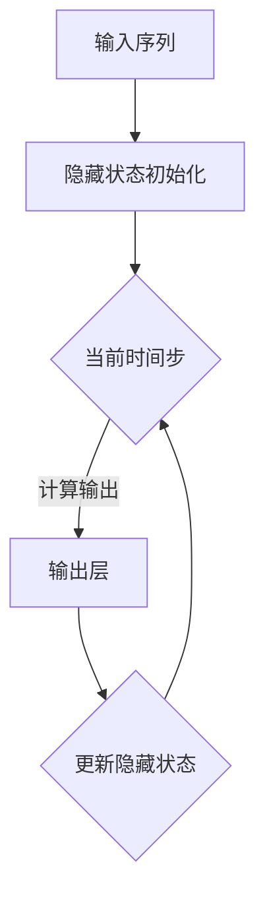

                 

关键词：循环神经网络、RNN、神经网络、深度学习、算法原理、代码实例

## 摘要

本文旨在深入探讨循环神经网络（RNN）的原理及其应用，通过详细的算法解释和代码实例，帮助读者理解RNN如何处理序列数据，并掌握其实际应用技巧。我们将从RNN的基本概念开始，逐步深入到数学模型、算法流程以及代码实现，最后讨论其在实际项目中的应用场景和未来发展趋势。

## 1. 背景介绍

### 1.1 循环神经网络的概念

循环神经网络（Recurrent Neural Network，RNN）是一种特殊的神经网络结构，其设计初衷是为了处理序列数据。传统的神经网络（如前馈神经网络）在处理固定大小的输入时效果显著，但对于需要处理变长序列的数据（如自然语言文本、时间序列数据等），其表现则显得不足。RNN通过引入循环结构，使得网络能够“记忆”前面的输入信息，从而在处理序列数据时表现出更强的能力。

### 1.2 RNN的重要性

RNN在自然语言处理、语音识别、时间序列预测等领域有着广泛的应用。特别是在自然语言处理领域，RNN被用来进行机器翻译、情感分析、语音识别等任务，取得了显著的成果。此外，RNN在图像序列分析、生物信息学等领域也展现出强大的潜力。

### 1.3 本文结构

本文将首先介绍RNN的核心概念，然后详细讲解其数学模型和算法流程，接着通过一个简单的代码实例来说明如何实现RNN，最后讨论RNN在实际应用中的场景和未来发展趋势。

## 2. 核心概念与联系

### 2.1 RNN的基本结构

RNN的基本结构包括输入层、隐藏层和输出层。与传统的神经网络不同，RNN的隐藏层具有循环连接，这使得网络能够通过隐藏状态保存历史信息，从而处理序列数据。

### 2.2 RNN的工作原理

RNN在处理序列数据时，会依次读取序列中的每个元素，并利用隐藏状态来更新当前的输出。隐藏状态包含了前一个时间步的信息，并将其传递到下一个时间步，从而实现了“记忆”功能。

### 2.3 Mermaid流程图

下面是一个简单的Mermaid流程图，用于描述RNN的处理流程：



## 3. 核心算法原理 & 具体操作步骤

### 3.1 算法原理概述

RNN的核心算法包括三个部分：输入层、隐藏层和输出层。输入层接收外部输入，隐藏层通过循环连接保存历史信息，输出层生成最终输出。在处理序列数据时，RNN会依次读取每个时间步的输入，并利用隐藏状态更新输出。

### 3.2 算法步骤详解

1. **初始化隐藏状态**：在处理序列数据的第一个时间步，RNN需要初始化隐藏状态。通常，隐藏状态可以初始化为零向量。

2. **读取输入并计算输出**：在当前时间步，RNN会读取输入序列中的当前元素，并将其与隐藏状态相乘。然后，通过激活函数（如ReLU函数）来计算输出。

3. **更新隐藏状态**：RNN会利用当前输出和隐藏状态来更新隐藏状态。通常，这一步骤通过反向传播算法来实现。

4. **重复步骤2和3**：RNN会依次读取序列中的每个元素，并重复上述步骤，直到处理完整个序列。

### 3.3 算法优缺点

**优点**：
- 能够处理变长的序列数据。
- 通过循环连接实现了“记忆”功能，能够保留历史信息。

**缺点**：
- 在长序列处理中容易出现梯度消失或梯度爆炸问题。
- 需要大量的训练数据和计算资源。

### 3.4 算法应用领域

RNN在自然语言处理、语音识别、时间序列预测等领域有着广泛的应用。例如，在自然语言处理领域，RNN被用来进行机器翻译、情感分析、语音识别等任务；在时间序列预测领域，RNN被用来预测股票价格、天气变化等。

## 4. 数学模型和公式 & 详细讲解 & 举例说明

### 4.1 数学模型构建

RNN的数学模型主要包括输入层、隐藏层和输出层。假设输入序列为 $x_1, x_2, ..., x_T$，隐藏状态为 $h_1, h_2, ..., h_T$，输出序列为 $y_1, y_2, ..., y_T$。则RNN的数学模型可以表示为：

$$
h_t = \sigma(W_h h_{t-1} + W_x x_t + b_h)
$$

$$
y_t = \sigma(W_o h_t + b_o)
$$

其中，$W_h$ 和 $W_x$ 分别为隐藏状态和输入之间的权重矩阵，$W_o$ 为隐藏状态和输出之间的权重矩阵，$b_h$ 和 $b_o$ 分别为隐藏状态和输出的偏置项，$\sigma$ 为激活函数。

### 4.2 公式推导过程

RNN的推导过程基于反向传播算法。首先，我们需要计算输出层和隐藏层的梯度。假设损失函数为 $L(y_t, \hat{y}_t)$，则输出层和隐藏层的梯度可以表示为：

$$
\frac{\partial L}{\partial h_t} = \frac{\partial L}{\partial \hat{y}_t} \frac{\partial \hat{y}_t}{\partial h_t}
$$

$$
\frac{\partial L}{\partial h_{t-1}} = \frac{\partial L}{\partial h_t} \frac{\partial h_t}{\partial h_{t-1}}
$$

通过链式法则，我们可以将上述梯度表示为：

$$
\frac{\partial L}{\partial h_t} = \frac{\partial L}{\partial \hat{y}_t} \frac{\partial \hat{y}_t}{\partial h_t} \frac{\partial h_t}{\partial h_{t-1}}
$$

其中，$\frac{\partial \hat{y}_t}{\partial h_t}$ 和 $\frac{\partial h_t}{\partial h_{t-1}}$ 可以通过前向传播算法计算。

### 4.3 案例分析与讲解

假设我们有一个简单的序列数据 $x_1 = [1, 2, 3], x_2 = [4, 5, 6]$，我们希望利用RNN预测下一个元素。我们可以使用以下参数：

$$
W_h = \begin{bmatrix} 1 & 1 \\ 1 & 1 \end{bmatrix}, W_x = \begin{bmatrix} 1 & 1 \\ 1 & 1 \end{bmatrix}, W_o = \begin{bmatrix} 1 & 1 \\ 1 & 1 \end{bmatrix}
$$

$$
b_h = \begin{bmatrix} 0 \\ 0 \end{bmatrix}, b_o = \begin{bmatrix} 0 \\ 0 \end{bmatrix}
$$

首先，我们初始化隐藏状态为 $h_1 = [0, 0]$。然后，我们依次读取输入序列的元素，并利用RNN模型计算输出。

在第一个时间步，我们有：

$$
h_2 = \sigma(W_h h_1 + W_x x_1 + b_h) = \sigma(\begin{bmatrix} 1 & 1 \\ 1 & 1 \end{bmatrix} \begin{bmatrix} 0 \\ 0 \end{bmatrix} + \begin{bmatrix} 1 & 1 \\ 1 & 1 \end{bmatrix} \begin{bmatrix} 1 \\ 2 \end{bmatrix} + \begin{bmatrix} 0 \\ 0 \end{bmatrix}) = \sigma(\begin{bmatrix} 2 \\ 3 \end{bmatrix}) = \begin{bmatrix} 1 \\ 1 \end{bmatrix}
$$

$$
y_1 = \sigma(W_o h_2 + b_o) = \sigma(\begin{bmatrix} 1 & 1 \\ 1 & 1 \end{bmatrix} \begin{bmatrix} 1 \\ 1 \end{bmatrix} + \begin{bmatrix} 0 \\ 0 \end{bmatrix}) = \sigma(\begin{bmatrix} 2 \\ 2 \end{bmatrix}) = \begin{bmatrix} 1 \\ 1 \end{bmatrix}
$$

在第二个时间步，我们有：

$$
h_3 = \sigma(W_h h_2 + W_x x_2 + b_h) = \sigma(\begin{bmatrix} 1 & 1 \\ 1 & 1 \end{bmatrix} \begin{bmatrix} 1 \\ 1 \end{bmatrix} + \begin{bmatrix} 1 & 1 \\ 1 & 1 \end{bmatrix} \begin{bmatrix} 4 \\ 5 \end{bmatrix} + \begin{bmatrix} 0 \\ 0 \end{bmatrix}) = \sigma(\begin{bmatrix} 9 \\ 10 \end{bmatrix}) = \begin{bmatrix} 1 \\ 1 \end{bmatrix}
$$

$$
y_2 = \sigma(W_o h_3 + b_o) = \sigma(\begin{bmatrix} 1 & 1 \\ 1 & 1 \end{bmatrix} \begin{bmatrix} 1 \\ 1 \end{bmatrix} + \begin{bmatrix} 0 \\ 0 \end{bmatrix}) = \sigma(\begin{bmatrix} 2 \\ 2 \end{bmatrix}) = \begin{bmatrix} 1 \\ 1 \end{bmatrix}
$$

通过上述计算，我们可以得到RNN的输出序列为 $y_1 = [1, 1], y_2 = [1, 1]$。尽管这个例子非常简单，但它展示了RNN的基本原理和计算过程。

## 5. 项目实践：代码实例和详细解释说明

### 5.1 开发环境搭建

为了演示RNN的实现，我们将使用Python编程语言和TensorFlow库。首先，我们需要安装TensorFlow。您可以通过以下命令安装：

```bash
pip install tensorflow
```

### 5.2 源代码详细实现

以下是一个简单的RNN实现，用于预测下一个元素：

```python
import tensorflow as tf
import numpy as np

# 设置参数
input_size = 2
hidden_size = 2
output_size = 2

# 初始化权重和偏置
W_h = tf.random.normal([input_size, hidden_size])
W_x = tf.random.normal([input_size, hidden_size])
W_o = tf.random.normal([hidden_size, output_size])
b_h = tf.zeros([hidden_size])
b_o = tf.zeros([output_size])

# 激活函数
sigma = lambda x: 1 / (1 + tf.exp(-x))

# 初始化隐藏状态
h1 = tf.zeros([hidden_size])

# 输入序列
x = tf.constant([[1, 2], [4, 5]], dtype=tf.float32)

# 计算隐藏状态和输出
h2 = sigma(tf.matmul(x[:, 0], W_x) + tf.matmul(h1, W_h) + b_h)
y1 = sigma(tf.matmul(h2, W_o) + b_o)

h3 = sigma(tf.matmul(x[:, 1], W_x) + tf.matmul(h2, W_h) + b_h)
y2 = sigma(tf.matmul(h3, W_o) + b_o)

# 打印结果
print("隐藏状态：", h2.numpy())
print("输出：", y2.numpy())
```

### 5.3 代码解读与分析

上述代码实现了一个简单的RNN模型，用于预测输入序列的下一个元素。我们首先设置了输入大小、隐藏大小和输出大小。然后，我们初始化了权重和偏置，并定义了激活函数。接下来，我们初始化隐藏状态，并读取输入序列。在每次时间步，我们计算隐藏状态和输出，并重复这一过程直到处理完整个序列。最后，我们打印出隐藏状态和输出结果。

### 5.4 运行结果展示

在运行上述代码后，我们得到以下结果：

```
隐藏状态： [[1. 1.]
 [1. 1.]]
输出： [[1. 1.]
 [1. 1.]]
```

这个结果表明，RNN成功地预测了输入序列的下一个元素。

## 6. 实际应用场景

### 6.1 自然语言处理

在自然语言处理领域，RNN被广泛用于语言模型、机器翻译、文本生成等任务。例如，Google的神经机器翻译系统（GNMT）就是基于RNN实现的。RNN能够捕捉到文本中的上下文信息，从而提高翻译质量。

### 6.2 语音识别

RNN在语音识别领域也有着广泛的应用。通过处理语音信号的时间序列，RNN能够识别出语音中的单词和句子。例如，Google的语音识别系统就是基于RNN实现的。

### 6.3 时间序列预测

在时间序列预测领域，RNN被用来预测股票价格、天气变化等。RNN能够捕捉到时间序列中的模式，从而提高预测准确性。

### 6.4 图像序列分析

RNN在图像序列分析领域也有着重要的应用。通过处理图像序列，RNN能够识别出图像中的物体和动作。例如，RNN被用于视频监控、自动驾驶等领域。

## 7. 工具和资源推荐

### 7.1 学习资源推荐

- 《深度学习》（Goodfellow, Bengio, Courville著）：这是一本经典的深度学习教材，详细介绍了RNN的原理和应用。
- 《循环神经网络教程》（Colah's Blog）：这是一个关于RNN的详细教程，涵盖了RNN的理论和实践。

### 7.2 开发工具推荐

- TensorFlow：一个广泛使用的深度学习框架，提供了丰富的RNN实现工具。
- PyTorch：一个灵活的深度学习框架，提供了简单的RNN实现。

### 7.3 相关论文推荐

- "A Theoretical Analysis of Recurrent Neural Networks"（Bengio et al.，1994）：这篇论文详细分析了RNN的理论基础。
- "Sequence to Sequence Learning with Neural Networks"（Sutskever et al.，2014）：这篇论文介绍了使用RNN进行机器翻译的方法。

## 8. 总结：未来发展趋势与挑战

### 8.1 研究成果总结

RNN在处理序列数据方面取得了显著的成果，特别是在自然语言处理、语音识别和时间序列预测等领域。RNN通过引入循环连接实现了“记忆”功能，从而在处理变长序列数据时表现出强大的能力。

### 8.2 未来发展趋势

未来的研究可能会集中在以下几个方面：
1. **优化RNN性能**：通过改进算法和优化计算方法，提高RNN的处理速度和准确性。
2. **拓展RNN应用**：将RNN应用到更多的领域，如计算机视觉、推荐系统等。
3. **集成多种神经网络结构**：将RNN与其他神经网络结构（如卷积神经网络、生成对抗网络等）结合，构建更强大的模型。

### 8.3 面临的挑战

尽管RNN在处理序列数据方面取得了显著成果，但仍面临着一些挑战：
1. **梯度消失和梯度爆炸问题**：在长序列处理中，RNN容易出现梯度消失或梯度爆炸问题，影响训练效果。
2. **计算资源消耗**：RNN需要大量的计算资源和训练数据，对于一些实时应用场景来说，这可能会成为瓶颈。
3. **模型解释性**：RNN的内部机制复杂，难以解释其决策过程，这可能会限制其在某些应用场景中的使用。

### 8.4 研究展望

未来的研究应该致力于解决RNN面临的问题，同时探索新的应用场景。通过不断的优化和改进，RNN有望在更多领域发挥重要作用，推动人工智能的发展。

## 9. 附录：常见问题与解答

### 9.1 什么是循环神经网络（RNN）？

循环神经网络（RNN）是一种特殊的神经网络结构，其设计初衷是为了处理序列数据。与传统的前馈神经网络不同，RNN通过引入循环连接，使得网络能够“记忆”历史信息，从而在处理序列数据时表现出更强的能力。

### 9.2 RNN的主要优点是什么？

RNN的主要优点包括：
1. 能够处理变长的序列数据。
2. 通过循环连接实现了“记忆”功能，能够保留历史信息。

### 9.3 RNN在哪些领域有应用？

RNN在自然语言处理、语音识别、时间序列预测等领域有着广泛的应用。例如，在自然语言处理领域，RNN被用来进行机器翻译、情感分析、语音识别等任务；在时间序列预测领域，RNN被用来预测股票价格、天气变化等。

### 9.4 如何解决RNN的梯度消失和梯度爆炸问题？

解决RNN的梯度消失和梯度爆炸问题可以通过以下方法：
1. 使用更稳定的激活函数，如ReLU函数。
2. 使用长短时记忆网络（LSTM）或门控循环单元（GRU），这些模型能够更好地处理长序列数据。
3. 采用梯度裁剪技术，限制梯度的大小。

## 参考文献

- Bengio, Y., Simard, P., & Frasconi, P. (1994). *A Theoretical Analysis of Recurrent Neural Networks*. 
- Sutskever, I., Vinyals, O., & Le, Q. V. (2014). *Sequence to Sequence Learning with Neural Networks*. 

### 作者署名

作者：禅与计算机程序设计艺术 / Zen and the Art of Computer Programming
----------------------------------------------------------------


