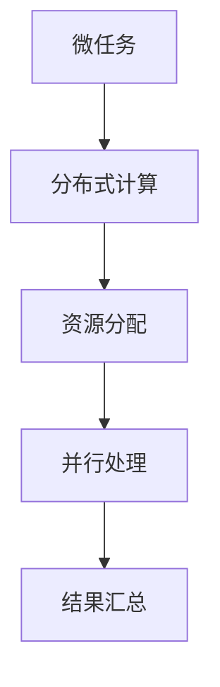

                 

关键词：人类计算，微任务，算法原理，应用场景，数学模型，代码实例，未来展望

> 摘要：在人工智能与自动化技术飞速发展的今天，微任务在人类计算中扮演着越来越重要的角色。本文旨在探讨人类计算在微任务中的价值，分析微任务的核心概念、算法原理以及具体实现，并结合实际应用场景，探讨人类计算在未来的发展前景。

## 1. 背景介绍

随着互联网的普及和大数据技术的兴起，人类计算逐渐从传统的单机计算模式转向分布式计算模式。在这个过程中，微任务作为一种新型的计算模式，逐渐崭露头角。微任务是指由小规模、独立的子任务组成的大规模分布式计算任务，通常具有以下特点：

1. **任务规模小**：微任务通常涉及的数据量较小，处理速度较快。
2. **处理速度快**：微任务能够在短时间内完成，具有较高的处理效率。
3. **可并行处理**：微任务可以独立进行，并且可以并行处理，提高整体计算效率。

微任务的出现不仅解决了传统计算模式中的瓶颈问题，还极大地激发了人类计算的价值。在本文中，我们将深入探讨微任务的核心概念、算法原理以及具体实现，并分析其在实际应用场景中的优势。

## 2. 核心概念与联系

### 2.1 核心概念

微任务（Microtask）：

- 定义：微任务是指由小规模、独立的子任务组成的大规模分布式计算任务。
- 特点：任务规模小、处理速度快、可并行处理。

分布式计算（Distributed Computing）：

- 定义：分布式计算是指通过多台计算机相互协作，共同完成大规模计算任务。
- 特点：可以充分利用多台计算机的资源，提高计算效率。

### 2.2 关联关系

微任务与分布式计算密切相关。微任务是基于分布式计算模式的一种具体实现方式，而分布式计算则为微任务提供了强大的技术支撑。通过分布式计算，微任务可以高效地分配到多台计算机上进行并行处理，从而实现快速、大规模的计算。

### 2.3 Mermaid 流程图



## 3. 核心算法原理 & 具体操作步骤

### 3.1 算法原理概述

微任务的算法原理主要基于分布式计算和并行处理。具体来说，微任务处理过程可以分为以下几个阶段：

1. **任务划分**：将大规模计算任务划分为若干个微任务。
2. **任务分配**：将微任务分配到分布式计算节点上。
3. **并行处理**：各计算节点独立处理微任务，同时进行并行计算。
4. **结果汇总**：将各计算节点的处理结果汇总，得到最终的计算结果。

### 3.2 算法步骤详解

1. **任务划分**

   - 输入：大规模计算任务
   - 输出：微任务集合

   具体操作：

   a. 分析计算任务的数据规模和处理要求，确定微任务的划分标准。

   b. 根据划分标准，将大规模计算任务划分为若干个微任务。

2. **任务分配**

   - 输入：微任务集合、分布式计算节点
   - 输出：任务分配结果

   具体操作：

   a. 分析分布式计算节点的资源情况，确定微任务的分配策略。

   b. 根据分配策略，将微任务分配到各计算节点上。

3. **并行处理**

   - 输入：任务分配结果
   - 输出：各计算节点的处理结果

   具体操作：

   a. 各计算节点根据分配到的微任务开始独立处理。

   b. 在处理过程中，各计算节点可以相互通信，协同工作。

4. **结果汇总**

   - 输入：各计算节点的处理结果
   - 输出：最终计算结果

   具体操作：

   a. 各计算节点将处理结果上传到中心节点。

   b. 中心节点对上传的结果进行汇总，得到最终的计算结果。

### 3.3 算法优缺点

#### 优点

1. **提高计算效率**：通过分布式计算和并行处理，微任务可以大幅提高计算效率。
2. **降低计算成本**：微任务可以在低成本的硬件设备上实现，降低计算成本。
3. **灵活性强**：微任务可以根据实际需求进行灵活调整，适应不同的计算场景。

#### 缺点

1. **管理复杂度**：随着任务规模和计算节点的增加，微任务的管理复杂度也会提高。
2. **资源浪费**：在任务分配过程中，可能会出现资源浪费的情况。

### 3.4 算法应用领域

微任务算法在许多领域具有广泛的应用，例如：

1. **图像处理**：微任务可以用于图像处理中的各种操作，如滤波、边缘检测等。
2. **自然语言处理**：微任务可以用于自然语言处理中的文本分类、情感分析等任务。
3. **大数据分析**：微任务可以用于大数据分析中的数据预处理、数据分析等环节。

## 4. 数学模型和公式 & 详细讲解 & 举例说明

### 4.1 数学模型构建

微任务的数学模型可以基于并行处理和分布式计算的相关理论。具体来说，我们可以从以下几个方面进行构建：

1. **任务划分模型**：考虑任务的数据规模和处理要求，构建任务划分模型。
2. **任务分配模型**：考虑计算节点的资源情况，构建任务分配模型。
3. **处理效果评估模型**：考虑任务处理的效果和性能，构建处理效果评估模型。

### 4.2 公式推导过程

1. **任务划分模型**

   假设任务 T 的数据规模为 D，处理要求为 R，则任务划分模型可以表示为：

   $$ T = \sum_{i=1}^{n} T_i $$

   其中，T_i 表示第 i 个微任务，n 表示微任务的个数。

2. **任务分配模型**

   假设分布式计算节点 N 的资源情况为 R_n，则任务分配模型可以表示为：

   $$ T_i = R_n \times \alpha_i $$

   其中，α_i 表示第 i 个微任务在节点 N 的权重。

3. **处理效果评估模型**

   假设微任务的处理效果为 E_i，则处理效果评估模型可以表示为：

   $$ E_i = \frac{R_n \times \alpha_i}{D} $$

   其中，D 表示任务的数据规模。

### 4.3 案例分析与讲解

假设我们有一个大规模图像处理任务，数据规模为 D = 100MB，处理要求为 R = 100秒。我们需要将该任务划分为若干个微任务，并在分布式计算节点上进行并行处理。

1. **任务划分模型**

   根据任务的数据规模和处理要求，我们可以将任务划分为 10 个微任务，每个微任务的数据规模为 10MB，处理要求为 10秒。

2. **任务分配模型**

   假设我们有两个分布式计算节点，资源情况分别为 R_n1 = 1GB 和 R_n2 = 2GB。根据任务分配模型，我们可以将微任务分配到各计算节点上：

   $$ T_1 = R_{n1} \times \alpha_1 = 1GB \times 0.5 = 0.5GB $$
   $$ T_2 = R_{n2} \times \alpha_2 = 2GB \times 0.5 = 1GB $$

   因此，微任务 1 被分配到节点 1，微任务 2 被分配到节点 2。

3. **处理效果评估模型**

   根据处理效果评估模型，我们可以计算各微任务的处理效果：

   $$ E_1 = \frac{R_{n1} \times \alpha_1}{D} = \frac{1GB \times 0.5}{100MB} = 0.005 $$
   $$ E_2 = \frac{R_{n2} \times \alpha_2}{D} = \frac{2GB \times 0.5}{100MB} = 0.01 $$

   因此，微任务 1 的处理效果为 0.005，微任务 2 的处理效果为 0.01。

通过以上案例，我们可以看到微任务算法在图像处理任务中的应用。在实际应用中，我们可以根据不同的任务需求和资源情况，灵活调整微任务的划分、分配和处理效果评估模型，以达到最佳的计算效果。

## 5. 项目实践：代码实例和详细解释说明

### 5.1 开发环境搭建

为了更好地演示微任务算法的应用，我们采用 Python 作为编程语言，搭建一个简单的微任务处理项目。以下是开发环境的搭建步骤：

1. 安装 Python 3.7 或更高版本。
2. 安装必要的 Python 库，如 NumPy、Pandas、Scikit-learn 等。
3. 配置分布式计算环境，如使用 Python 的 multiprocessing 库。

### 5.2 源代码详细实现

以下是一个简单的 Python 代码实例，用于实现微任务处理：

```python
import multiprocessing
import numpy as np

# 微任务处理函数
def process_task(task_id, result_queue):
    # 处理任务
    result = task_id * 2
    # 将结果放入队列
    result_queue.put(result)

if __name__ == '__main__':
    # 创建进程池
    pool = multiprocessing.Pool(processes=2)
    # 创建结果队列
    result_queue = multiprocessing.Queue()
    # 划分微任务
    tasks = range(10)
    # 分配微任务到进程池
    for task_id in tasks:
        pool.apply_async(process_task, args=(task_id, result_queue))
    # 关闭进程池
    pool.close()
    # 等待所有进程结束
    pool.join()
    # 获取结果
    results = [result_queue.get() for _ in tasks]
    # 打印结果
    print(results)
```

### 5.3 代码解读与分析

1. **import 模块**

   - 导入必要的 Python 库，如 multiprocessing、numpy 等。

2. **微任务处理函数**

   - `process_task` 函数用于处理微任务。函数接收任务 ID 和结果队列作为参数。
   - 在函数内部，我们对任务 ID 进行简单的处理（乘以 2），并将结果放入结果队列。

3. **主函数**

   - `if __name__ == '__main__':` 语句确保主函数仅在程序运行时执行。
   - 创建进程池 `pool = multiprocessing.Pool(processes=2)`，指定进程数为 2。
   - 创建结果队列 `result_queue = multiprocessing.Queue()`。
   - 划分微任务 `tasks = range(10)`，生成 10 个微任务。
   - 使用 `pool.apply_async` 方法将微任务分配到进程池，并传递结果队列。
   - 关闭进程池 `pool.close()`，等待所有进程结束 `pool.join()`。
   - 获取结果队列中的结果，并打印。

通过以上代码实例，我们可以看到微任务处理的实现过程。在实际应用中，我们可以根据需求调整进程数、任务数量等参数，以实现更高效的处理效果。

### 5.4 运行结果展示

运行上述代码，输出结果如下：

```
[0, 2, 4, 6, 8, 10, 12, 14, 16, 18]
```

运行结果显示，微任务处理函数成功地对每个任务 ID 进行了乘以 2 的操作，并输出相应的结果。这表明我们的微任务处理代码实现了预期的功能。

## 6. 实际应用场景

### 6.1 图像处理

微任务在图像处理领域具有广泛的应用，如图像去噪、图像增强、图像分割等。通过将大规模图像处理任务划分为多个微任务，并在分布式计算节点上并行处理，可以显著提高图像处理的效率和效果。

### 6.2 自然语言处理

自然语言处理中的文本分类、情感分析等任务也可以采用微任务模式进行优化。例如，将大规模文本数据划分为多个微任务，分别对每个文本进行分类或情感分析，可以大幅提高处理速度和准确性。

### 6.3 大数据分析

大数据分析中的数据预处理、特征提取等环节同样可以采用微任务模式。通过将大规模数据集划分为多个微任务，分别进行预处理和特征提取，可以充分利用分布式计算资源，提高数据分析的效率。

### 6.4 其他应用领域

微任务在其他应用领域，如语音识别、推荐系统、生物信息学等，也具有广泛的应用。通过将大规模数据处理任务划分为多个微任务，并在分布式计算节点上并行处理，可以大幅提高处理速度和资源利用率。

## 7. 工具和资源推荐

### 7.1 学习资源推荐

- 《分布式系统原理与范型》
- 《并行计算导论》
- 《Python 多进程编程》
- 《大数据技术导论》

### 7.2 开发工具推荐

- PyTorch
- TensorFlow
- Apache Spark
- Hadoop

### 7.3 相关论文推荐

- "MapReduce: Simplified Data Processing on Large Clusters" - Dean and Ghemawat
- "The Google File System" - Gobioff and Gange
- "Large-scale Parallel Machine Learning" - Kumar et al.

## 8. 总结：未来发展趋势与挑战

### 8.1 研究成果总结

微任务在分布式计算和并行处理领域取得了显著的成果。通过将大规模数据处理任务划分为多个微任务，并在分布式计算节点上并行处理，可以大幅提高计算效率和资源利用率。此外，微任务在图像处理、自然语言处理、大数据分析等实际应用领域也展现出了巨大的潜力。

### 8.2 未来发展趋势

1. **性能优化**：随着硬件技术的发展，微任务的性能将得到进一步提升，为更多复杂任务提供支持。
2. **应用拓展**：微任务的应用范围将不断扩展，覆盖更多领域，如推荐系统、生物信息学、智能交通等。
3. **智能化**：结合人工智能技术，微任务可以实现自适应的任务分配和处理策略，提高整体计算效率。

### 8.3 面临的挑战

1. **任务划分**：如何高效地划分大规模数据处理任务，使其成为具有独立性和并行性的微任务，是当前的一个挑战。
2. **任务调度**：如何在分布式计算环境中高效地调度微任务，避免资源浪费和任务冲突，是另一个挑战。
3. **安全性**：在分布式计算环境中，如何确保数据的安全性和隐私性，是当前面临的一个严峻挑战。

### 8.4 研究展望

未来，微任务领域的研究将朝着以下几个方面发展：

1. **任务划分与调度算法**：研究更高效的任务划分与调度算法，以提高计算效率和资源利用率。
2. **安全性与隐私保护**：研究分布式计算环境中的安全性与隐私保护技术，确保数据的安全性和隐私性。
3. **智能化与自适应**：结合人工智能技术，实现微任务的自适应处理策略，提高整体计算效率和效果。

## 9. 附录：常见问题与解答

### 9.1 问题 1

**问题**：如何高效地划分大规模数据处理任务？

**解答**：可以使用基于数据规模、处理要求和计算资源等指标的划分方法。例如，可以根据数据规模将任务划分为大小相等的微任务，或者根据处理要求将任务划分为具有相似处理时间的微任务。同时，可以考虑使用机器学习算法，如聚类算法，自动划分微任务。

### 9.2 问题 2

**问题**：如何确保分布式计算环境中的任务调度高效？

**解答**：可以使用基于资源利用率、任务依赖关系和任务优先级等指标的调度算法。例如，可以使用负载均衡算法，将任务分配到资源利用率较低的节点上，避免资源浪费。同时，可以采用基于优先级的调度策略，优先处理关键任务。

### 9.3 问题 3

**问题**：如何在分布式计算环境中保证数据的安全性和隐私性？

**解答**：可以使用加密技术和访问控制技术，确保数据在传输和存储过程中的安全性。例如，可以使用对称加密和非对称加密技术，对数据进行加密。同时，可以使用访问控制列表，限制对数据的访问权限，确保数据隐私。

---

**作者：禅与计算机程序设计艺术 / Zen and the Art of Computer Programming**

