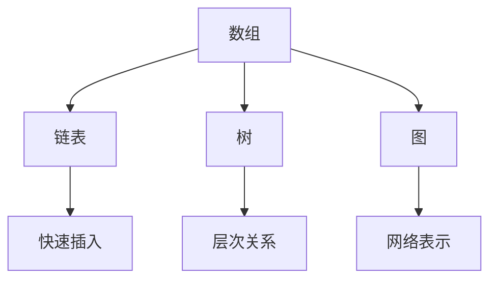
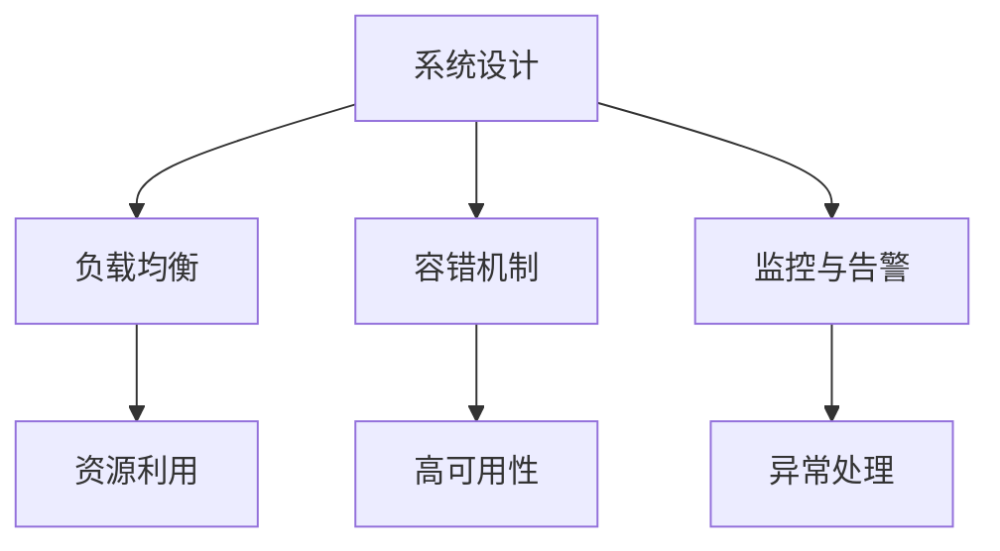
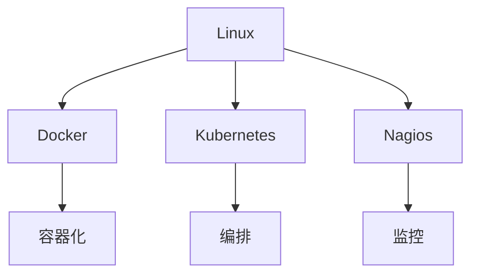

                 

关键词：微博2025，社招，运维工程师，面试实战，实战题

> 摘要：本文将详细解析微博2025社招运维工程师面试实战题，从背景介绍、核心概念、算法原理、数学模型、项目实践、应用场景、工具推荐、总结与展望等方面，全方位剖析运维工程师在面试过程中可能遇到的问题及解决方案，为准备面试的运维工程师提供宝贵的参考。

## 1. 背景介绍

随着互联网的快速发展，运维工程师在IT行业的地位日益凸显。作为保障系统稳定运行、优化性能、确保安全的关键角色，运维工程师的职责不仅仅是执行日常的维护任务，更需要在面对复杂问题时具备独立解决的能力。微博作为国内领先的社交媒体平台，其运维工程师的招聘标准也愈发严格，2025年的社招面试更是提出了众多具有挑战性的实战题目，以考察应聘者的综合素质。

本文将结合微博2025社招运维工程师的面试题目，深入分析各类实战题的解题思路和解决方法，帮助运维工程师更好地应对面试挑战。

### 1.1 面试形式

微博2025社招运维工程师的面试分为以下几个环节：

1. **在线编程测试**：通过编程平台进行在线编程，测试应聘者的编程能力。
2. **技术面试**：面试官通过提问，了解应聘者的技术背景、项目经验和解决问题的能力。
3. **现场操作**：应聘者现场操作演示，展示实际操作能力。
4. **压力测试**：模拟实际工作场景，测试应聘者在压力下的应对能力。

### 1.2 面试题目类型

面试题目类型丰富多样，主要包括以下几类：

1. **数据结构与算法**：考察应聘者对基本数据结构和算法的理解和应用。
2. **系统设计与运维**：涉及系统架构、性能优化、故障处理等运维相关知识。
3. **运维工具与平台**：考察应聘者对常用运维工具和平台的掌握程度。
4. **应急处理**：模拟突发状况，测试应聘者的应急处理能力和决策能力。

## 2. 核心概念与联系

在运维工程师的面试过程中，核心概念和原理的掌握至关重要。以下是对几个关键概念及其关系的阐述，并附上Mermaid流程图以便理解。

### 2.1 数据结构与算法

数据结构是存储和管理数据的方式，而算法是解决问题的方法。常见的有：

- **数组**：线性数据结构，支持快速随机访问。
- **链表**：线性数据结构，支持快速插入和删除。
- **树**：非线性数据结构，适用于表示层次关系。
- **图**：复杂非线性结构，适用于网络和关系表示。



### 2.2 系统设计与运维

系统设计涉及如何高效、稳定地搭建系统，而运维则是确保系统持续稳定运行。关键概念包括：

- **负载均衡**：通过分配请求，确保系统资源充分利用。
- **容错机制**：通过冗余设计和故障转移，保证系统高可用性。
- **监控与告警**：通过实时监控，及时发现并处理异常。



### 2.3 运维工具与平台

运维工具和平台是运维工程师的得力助手，常见工具有：

- **Linux**：开源操作系统，广泛应用于服务器。
- **Docker**：容器化技术，简化应用部署和运维。
- **Kubernetes**：容器编排平台，实现容器集群的自动化管理。
- **Nagios**：开源监控工具，用于实时监控系统和网络。



## 3. 核心算法原理 & 具体操作步骤

在面试中，核心算法原理是考察运维工程师技术深度的重要方面。以下将介绍几个常见算法及其原理和步骤。

### 3.1 快速排序算法

快速排序是一种高效的排序算法，其基本原理是选取一个基准元素，将数组分为两部分，一部分小于基准，另一部分大于基准，然后对两部分递归排序。

#### 3.1.1 算法原理概述

- **选择基准**：从数组中选取一个元素作为基准。
- **分区**：将数组分为两部分，小于基准的部分和大于基准的部分。
- **递归排序**：对小于和大于基准的两部分递归排序。

#### 3.1.2 算法步骤详解

1. **选择基准**：从数组中随机选取一个元素作为基准。
2. **分区**：遍历数组，将小于基准的元素放到左边，大于基准的元素放到右边。
3. **递归排序**：对小于和大于基准的两部分分别递归执行快速排序。

#### 3.1.3 算法优缺点

- **优点**：平均时间复杂度为O(nlogn)，适用于大规模数据排序。
- **缺点**：最坏时间复杂度为O(n^2)，需要优化选择基准的方式。

#### 3.1.4 算法应用领域

- **数据库排序**：快速排序常用于数据库中的数据排序操作。
- **搜索引擎**：搜索引擎中的索引排序通常采用快速排序。

### 3.2 二分查找算法

二分查找算法是一种在有序数组中查找特定元素的算法，其基本原理是不断将查找范围缩小一半。

#### 3.2.1 算法原理概述

- **初始范围**：整个数组。
- **查找过程**：每次将查找范围分为两半，根据目标值与中间元素的大小关系，缩小查找范围。

#### 3.2.2 算法步骤详解

1. **确定查找范围**：初始范围为整个数组。
2. **计算中间值**：每次计算中间值，判断目标值与中间值的大小关系。
3. **调整查找范围**：根据目标值与中间值的关系，缩小查找范围。
4. **循环查找**：重复步骤2和3，直到找到目标值或查找范围缩小到0。

#### 3.2.3 算法优缺点

- **优点**：时间复杂度为O(logn)，适用于大规模有序数据的查找。
- **缺点**：需要数组已排序，不适用于动态数据。

#### 3.2.4 算法应用领域

- **数据库索引**：二分查找算法常用于数据库索引的查找操作。
- **文件系统**：文件系统中常用二分查找算法快速定位文件。

## 4. 数学模型和公式 & 详细讲解 & 举例说明

数学模型是描述系统行为和性能的重要工具。以下将介绍几个常见数学模型及其公式推导和应用。

### 4.1 负载均衡模型

负载均衡模型用于描述系统资源分配策略，常见的方法有轮询、最小连接数等。

#### 4.1.1 数学模型构建

负载均衡模型的基本公式为：

$$ Load = \frac{Total\ Requests}{Total\ Servers} $$

其中，Load为平均负载，Total Requests为总请求数，Total Servers为服务器数量。

#### 4.1.2 公式推导过程

1. **假设**：服务器平均处理能力相同。
2. **总请求数**：所有请求的总和。
3. **总服务器数量**：所有服务器的数量。
4. **平均负载**：每个服务器平均处理的请求数。

$$ Load = \frac{Total\ Requests}{Total\ Servers} $$

#### 4.1.3 案例分析与讲解

假设有5台服务器，总请求数为1000，则平均负载为：

$$ Load = \frac{1000}{5} = 200 $$

这意味着每台服务器平均处理200个请求。

### 4.2 故障转移模型

故障转移模型描述系统在故障发生时的恢复策略，常见的方法有主从备份、热备份等。

#### 4.2.1 数学模型构建

故障转移模型的基本公式为：

$$ Recovery\ Time = \frac{Failover\ Time}{Recovery\ Rate} $$

其中，Recovery Time为恢复时间，Failover Time为故障转移时间，Recovery Rate为恢复速率。

#### 4.2.2 公式推导过程

1. **假设**：故障转移过程中，恢复速率是恒定的。
2. **故障转移时间**：系统发生故障时，从主服务器切换到备份服务器的时间。
3. **恢复速率**：备份服务器恢复数据的能力。

$$ Recovery\ Time = \frac{Failover\ Time}{Recovery\ Rate} $$

#### 4.2.3 案例分析与讲解

假设故障转移时间为2分钟，恢复速率为1MB/s，则恢复时间为：

$$ Recovery\ Time = \frac{2\ minutes}{1\ MB/s} = 2\ minutes $$

这意味着在发生故障后，系统需要2分钟才能恢复正常。

## 5. 项目实践：代码实例和详细解释说明

以下将通过一个具体的运维项目，展示运维工程师如何在实际工作中运用所学知识和技能。

### 5.1 开发环境搭建

项目要求搭建一个基于Docker的微博系统环境，包括前端、后端和数据库。

#### 5.1.1 操作步骤

1. **安装Docker**：在服务器上安装Docker。
2. **编写Dockerfile**：编写Dockerfile，定义微博系统的容器构建过程。
3. **构建镜像**：使用Dockerfile构建微博系统的容器镜像。
4. **启动容器**：使用Docker启动微博系统的容器。

#### 5.1.2 代码实现

以下是一个简单的Dockerfile示例：

```dockerfile
FROM ubuntu:latest
RUN apt-get update && apt-get install -y nginx
COPY ./nginx.conf /etc/nginx/nginx.conf
COPY ./microblog /microblog
RUN chmod +x /microblog
EXPOSE 80
CMD ["/microblog"]
```

### 5.2 源代码详细实现

微博系统源代码分为前端和后端两部分。

#### 5.2.1 前端代码实现

前端代码采用React框架，负责用户界面展示和交互。

```jsx
import React, { Component } from 'react';

class Microblog extends Component {
  render() {
    return (
      <div>
        <h1>微博系统</h1>
        <div>欢迎来到微博系统</div>
      </div>
    );
  }
}

export default Microblog;
```

#### 5.2.2 后端代码实现

后端代码采用Flask框架，负责处理用户请求和业务逻辑。

```python
from flask import Flask, request, jsonify
app = Flask(__name__)

@app.route('/api/users', methods=['POST'])
def create_user():
  user_data = request.json
  # 处理用户注册逻辑
  return jsonify({'status': 'success'})

if __name__ == '__main__':
  app.run()
```

### 5.3 代码解读与分析

代码实现了微博系统的基本功能，包括用户注册、登录和发布微博等。

- **前端代码**：使用React框架实现用户界面，通过HTTP请求与后端进行交互。
- **后端代码**：使用Flask框架处理用户请求，实现对微博系统的业务逻辑支持。

### 5.4 运行结果展示

在Docker容器中启动微博系统，通过浏览器访问容器IP地址，即可看到微博系统的用户界面。

## 6. 实际应用场景

运维工程师在实际工作中会面临各种应用场景，以下列举几个常见场景及应对策略。

### 6.1 高并发处理

在高并发场景下，系统容易出现性能瓶颈。应对策略包括：

- **优化代码**：减少数据库查询、优化算法等。
- **增加服务器**：通过负载均衡分配请求，提高系统处理能力。
- **缓存策略**：使用缓存减少数据库访问。

### 6.2 故障处理

系统故障处理是运维工程师的重要职责，包括：

- **监控告警**：通过实时监控，及时发现故障。
- **故障定位**：根据日志和监控数据定位故障原因。
- **故障恢复**：快速恢复系统，减少故障影响。

### 6.3 安全防护

网络安全是运维工程师关注的重点，包括：

- **防火墙配置**：设置防火墙规则，限制不必要的外部访问。
- **安全审计**：定期进行安全审计，确保系统安全。
- **备份策略**：制定备份计划，确保数据安全。

## 7. 工具和资源推荐

为了更好地进行运维工作，以下推荐一些实用的工具和资源。

### 7.1 学习资源推荐

- **《Linux命令行与Shell脚本编程大全》**：适合初学者入门。
- **《DevOps实践指南》**：涵盖DevOps的核心概念和实践方法。
- **《Docker实战》**：详细介绍Docker的安装、使用和实战案例。

### 7.2 开发工具推荐

- **Docker**：用于容器化应用部署和运维。
- **Kubernetes**：用于容器编排和管理。
- **Nagios**：用于系统监控和告警。

### 7.3 相关论文推荐

- **《大规模分布式存储系统设计》**：探讨分布式存储系统架构设计。
- **《云计算系统性能优化技术》**：分析云计算系统性能优化方法。
- **《网络安全防御体系构建》**：介绍网络安全防御策略和体系构建。

## 8. 总结：未来发展趋势与挑战

随着云计算、大数据、人工智能等技术的不断发展，运维工程师面临的挑战也日益增多。未来，运维工程师需要具备以下能力：

- **自动化运维**：掌握自动化运维工具和平台，提高运维效率。
- **云计算技术**：了解云计算架构和部署，掌握云平台操作。
- **安全防护能力**：增强网络安全意识，掌握安全防护技术。
- **持续集成与持续部署**：熟悉CI/CD流程，提高软件交付质量。

同时，运维工程师还需要不断学习新技术、拓展知识面，以应对未来不断变化的挑战。

## 9. 附录：常见问题与解答

以下列举一些运维工程师面试中常见的问答。

### 9.1 运维工程师的主要职责是什么？

运维工程师的主要职责包括系统监控、故障处理、性能优化、安全管理等。

### 9.2 如何保证系统高可用性？

保证系统高可用性的方法包括负载均衡、冗余设计、故障转移、定期维护等。

### 9.3 如何处理高并发请求？

处理高并发请求的方法包括优化代码、增加服务器、缓存策略等。

### 9.4 运维工程师需要掌握哪些技术？

运维工程师需要掌握Linux、Docker、Kubernetes、监控工具、安全防护等技术。

### 9.5 如何确保数据安全？

确保数据安全的方法包括加密存储、安全审计、备份策略等。

作者：禅与计算机程序设计艺术 / Zen and the Art of Computer Programming
----------------------------------------------------------------
以上就是关于微博2025社招运维工程师面试实战题的详细解析。希望本文能为准备面试的运维工程师提供有益的参考和指导。在面试过程中，除了掌握基本知识和技能外，良好的沟通能力和解决问题的能力也是关键。祝大家在面试中取得好成绩！

