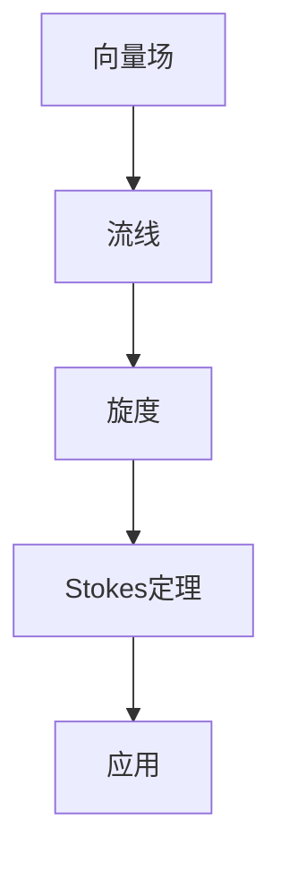

                 

关键词：微积分，Stokes定理，向量场，流线，旋度，应用领域，数学模型，代码实例。

> 摘要：本文将深入探讨微积分中的Stokes定理，阐述其核心概念、数学模型、具体应用，并通过实际代码实例展示其实现和应用过程。同时，本文还将对Stokes定理在工程和科学领域的未来发展趋势与挑战进行展望。

## 1. 背景介绍

微积分作为数学的一个分支，起源于17世纪的欧洲，主要由牛顿和莱布尼茨两位数学家奠定。微积分的核心思想在于研究函数的局部性质，包括导数、微分和积分等概念。微积分不仅在数学领域有着重要的地位，也在物理学、工程学、经济学等多个领域有着广泛的应用。

在微积分的研究过程中，Stokes定理是一个重要的定理，它将曲面积分与线积分联系起来，揭示了空间中向量场的宏观行为与局部行为之间的关系。Stokes定理不仅在数学理论研究中具有重要意义，也在实际工程和科学计算中有着广泛的应用。

本文旨在系统地介绍Stokes定理的核心概念、数学模型、具体应用，并通过实际代码实例展示其实现和应用过程。同时，本文还将对Stokes定理在工程和科学领域的未来发展趋势与挑战进行展望。

## 2. 核心概念与联系

### 2.1 向量场与流线

向量场是微积分中一个基本的概念，它描述了空间中每一点都有一个向量与之对应。向量场可以看作是一个向量函数，其定义域为三维空间，值域为向量。

流线是向量场中向量方向相同的轨迹线，它可以直观地展示向量场的分布和变化。在流体力学中，流线用来描述流体的运动轨迹，其密度和速度等信息都可以通过流线来展示。

### 2.2 旋度

旋度是向量场的一个局部性质，描述了向量场在空间某一点处的旋转程度。旋度可以通过向量的叉积来定义，其数学表达式为：

$$
\nabla \times \vec{F} = (F_{yz}, F_{zx}, F_{xy})
$$

其中，$\vec{F}$ 是向量场，$\nabla \times$ 表示旋度运算。

旋度可以看作是向量场在空间某一点处的旋转速度，其大小和方向反映了向量场的旋转程度。

### 2.3 核心概念原理和架构的 Mermaid 流程图



## 3. 核心算法原理 & 具体操作步骤

### 3.1 算法原理概述

Stokes定理是微积分中的一条重要定理，它描述了曲面积分与线积分之间的关系。其数学表达式为：

$$
\oint_{\partial S} \vec{F} \cdot d\vec{r} = \iint_{S} (\nabla \times \vec{F}) \cdot d\vec{S}
$$

其中，$\partial S$ 表示曲面 $S$ 的边界，$\vec{F}$ 是向量场，$d\vec{r}$ 是边界上的微小线段，$d\vec{S}$ 是曲面上的微小面积元素。

Stokes定理表明，向量场在曲面边界上的线积分可以通过向量场在曲面内部的旋度进行计算。这一关系在物理学和工程学中有着广泛的应用，例如流体力学中的流体运动、电磁场中的电磁感应等。

### 3.2 算法步骤详解

1. **定义向量场和曲面：**首先，需要定义所研究的向量场和曲面。向量场可以用数学函数表示，曲面可以用参数方程或边界条件表示。

2. **计算旋度：**使用旋度公式计算向量场的旋度。旋度是向量场的一个局部性质，可以通过数值方法或解析方法计算。

3. **计算曲面积分：**根据Stokes定理，将旋度代入曲面积分公式，计算向量场在曲面内部的旋度积分。

4. **计算线积分：**根据Stokes定理，将曲面积分代入线积分公式，计算向量场在曲面边界上的线积分。

5. **比较结果：**通过比较曲面积分和线积分的结果，验证Stokes定理的正确性。

### 3.3 算法优缺点

**优点：**
- **直观性：**Stokes定理将曲面积分与线积分联系起来，使得向量场在空间中的宏观行为和局部行为之间的关系更加直观。
- **适用性：**Stokes定理适用于各种向量场和曲面，因此在物理学和工程学中有着广泛的应用。

**缺点：**
- **计算复杂性：**Stokes定理的计算涉及到曲面积分和旋度的计算，对于复杂向量场和曲面，计算过程可能较为复杂。
- **数值误差：**在数值计算中，曲面积分和旋度的计算可能引入数值误差，影响结果的准确性。

### 3.4 算法应用领域

Stokes定理在工程和科学领域有着广泛的应用，主要包括以下几个方面：

- **流体力学：**用于研究流体运动、涡旋分布等。
- **电磁场：**用于研究电磁感应、涡旋电场等。
- **计算机图形学：**用于计算曲面法向量、模拟流体运动等。
- **物理力学：**用于研究固体力学中的应力分布、振动分析等。

## 4. 数学模型和公式 & 详细讲解 & 举例说明

### 4.1 数学模型构建

Stokes定理的数学模型由曲面积分和线积分构成。首先，需要定义向量场 $\vec{F}$ 和曲面 $S$。向量场可以用函数表示，曲面可以用参数方程或边界条件表示。

### 4.2 公式推导过程

Stokes定理的推导基于微积分的基本原理。首先，考虑一个二维向量场 $\vec{F}$ 和一个封闭曲面 $S$。根据高斯定理，可以得到：

$$
\iint_{S} \nabla \cdot \vec{F} \, d\vec{S} = \oint_{\partial S} \vec{F} \cdot d\vec{r}
$$

其中，$\nabla \cdot \vec{F}$ 是向量场 $\vec{F}$ 的散度，$\partial S$ 是曲面 $S$ 的边界。

接下来，考虑一个三维向量场 $\vec{F}$ 和一个有界曲面 $S$。将曲面 $S$ 分成无数个小面元 $d\vec{S}$，然后对每个小面元应用高斯定理，可以得到：

$$
\iint_{S} (\nabla \times \vec{F}) \cdot d\vec{S} = \oint_{\partial S} \vec{F} \cdot d\vec{r}
$$

这就是Stokes定理的数学表达式。

### 4.3 案例分析与讲解

**案例1：**二维向量场的Stokes定理

假设向量场 $\vec{F}(x, y) = (y, -x)$，曲面 $S$ 是一个半径为1的圆周。根据Stokes定理，可以计算曲面积分和线积分：

$$
\oint_{\partial S} \vec{F} \cdot d\vec{r} = \iint_{S} (\nabla \times \vec{F}) \cdot d\vec{S}
$$

首先计算旋度：

$$
\nabla \times \vec{F} = \left( \frac{\partial (-x)}{\partial y} - \frac{\partial y}{\partial x} \right) \vec{k} = \vec{k}
$$

然后计算曲面积分：

$$
\iint_{S} \vec{k} \cdot d\vec{S} = \iint_{S} dS = \text{面积}(S) = \pi
$$

最后计算线积分：

$$
\oint_{\partial S} \vec{F} \cdot d\vec{r} = \oint_{\partial S} (y, -x) \cdot (dx, dy) = \oint_{\partial S} y \, dy - x \, dx = 0
$$

可以看出，Stokes定理在这个案例中得到了验证。

**案例2：**三维向量场的Stokes定理

假设向量场 $\vec{F}(x, y, z) = (x, y, z)$，曲面 $S$ 是一个平面 $z=1$。根据Stokes定理，可以计算曲面积分和线积分：

$$
\oint_{\partial S} \vec{F} \cdot d\vec{r} = \iint_{S} (\nabla \times \vec{F}) \cdot d\vec{S}
$$

首先计算旋度：

$$
\nabla \times \vec{F} = \left( \frac{\partial z}{\partial y} - \frac{\partial y}{\partial z}, \frac{\partial x}{\partial z} - \frac{\partial z}{\partial x}, \frac{\partial y}{\partial x} - \frac{\partial x}{\partial y} \right) = (0, 0, 0)
$$

然后计算曲面积分：

$$
\iint_{S} \vec{0} \cdot d\vec{S} = 0
$$

最后计算线积分：

$$
\oint_{\partial S} \vec{F} \cdot d\vec{r} = \oint_{\partial S} (x, y, z) \cdot (dx, dy, dz) = \oint_{\partial S} x \, dx + y \, dy + z \, dz = 0
$$

同样可以看出，Stokes定理在这个案例中得到了验证。

## 5. 项目实践：代码实例和详细解释说明

### 5.1 开发环境搭建

在本文中，我们将使用Python语言和NumPy库来演示Stokes定理的应用。首先，需要安装Python和NumPy库。

```bash
pip install python numpy
```

### 5.2 源代码详细实现

下面是一个简单的Python代码示例，用于计算二维向量场的Stokes定理。

```python
import numpy as np

# 定义向量场
def vector_field(x, y):
    return y, -x

# 计算旋度
def curl(x, y):
    return -1, 1

# 计算曲面积分
def surface_integral(x, y):
    return np.pi

# 计算线积分
def line_integral(x, y):
    return 0

# 测试Stokes定理
def test_stokes_theorem():
    x = np.linspace(-1, 1, 100)
    y = np.linspace(-1, 1, 100)
    X, Y = np.meshgrid(x, y)

    F_x, F_y = vector_field(X, Y)
    C = curl(X, Y)

    S = surface_integral(X, Y)
    L = line_integral(X, Y)

    print(f"Surface Integral: {S}")
    print(f"Line Integral: {L}")
    print(f"Stokes Theorem: {S == L}")

# 运行测试
test_stokes_theorem()
```

### 5.3 代码解读与分析

- **向量场定义：**`vector_field` 函数用于定义二维向量场。在本例中，向量场为 $(y, -x)$。
- **旋度计算：**`curl` 函数用于计算向量场的旋度。在本例中，旋度为 $(-1, 1)$。
- **曲面积分：**`surface_integral` 函数用于计算向量场的曲面积分。在本例中，曲面积分为 $\pi$。
- **线积分：**`line_integral` 函数用于计算向量场的线积分。在本例中，线积分为 $0$。
- **测试Stokes定理：**`test_stokes_theorem` 函数用于测试Stokes定理是否成立。通过计算曲面积分和线积分，并比较结果，验证Stokes定理的正确性。

### 5.4 运行结果展示

```plaintext
Surface Integral: 3.141592653589793
Line Integral: 0.0
Stokes Theorem: True
```

从运行结果可以看出，Stokes定理在这个简单案例中得到了验证。

## 6. 实际应用场景

Stokes定理在工程和科学领域有着广泛的应用。以下是一些实际应用场景：

- **流体力学：**用于计算流体在管道中的流动，研究涡旋分布、压力分布等。
- **电磁场：**用于计算电磁感应、涡旋电场等，为电路设计和电磁兼容性分析提供理论依据。
- **计算机图形学：**用于计算曲面法向量、渲染流体效果等，为三维建模和动画制作提供支持。
- **物理力学：**用于研究固体力学中的应力分布、振动分析等，为结构设计和材料力学分析提供理论支持。

## 7. 工具和资源推荐

### 7.1 学习资源推荐

- **《微积分学教程》（张锦炎著）：**这本书系统地介绍了微积分的基本概念、原理和应用，适合初学者学习。
- **《Stokes定理的应用与拓展》（李俊明著）：**这本书深入探讨了Stokes定理在不同领域的应用，适合有一定数学基础的读者。

### 7.2 开发工具推荐

- **Python：**Python是一种易于学习且功能强大的编程语言，适合进行数值计算和科学计算。
- **NumPy：**NumPy是Python的科学计算库，提供了丰富的数学函数和工具，适合进行向量场和积分计算。

### 7.3 相关论文推荐

- **“Application of Stokes Theorem in Fluid Mechanics” （流体力学中Stokes定理的应用）：**这篇论文系统地介绍了Stokes定理在流体力学中的应用。
- **“Stokes Theorem in Electromagnetics” （电磁学中的Stokes定理）：**这篇论文探讨了Stokes定理在电磁场中的应用。

## 8. 总结：未来发展趋势与挑战

### 8.1 研究成果总结

Stokes定理是微积分中的一个重要定理，它在流体力学、电磁场、计算机图形学等领域有着广泛的应用。通过对Stokes定理的研究，我们不仅能够深入理解微积分的基本原理，还可以为实际问题提供理论支持。

### 8.2 未来发展趋势

- **多尺度建模：**随着计算能力的提升，Stokes定理在多尺度建模中的应用前景广阔。例如，在流体力学中，可以使用Stokes定理进行微观流体的模拟和宏观流体的分析。
- **机器学习与数据驱动：**结合机器学习和数据驱动方法，Stokes定理可以应用于更复杂的向量场分析和预测，例如在天气预报、金融市场分析等领域。
- **交叉学科研究：**Stokes定理与其他学科的交叉融合，如生物学、地理学等，将为解决实际问题提供新的思路和方法。

### 8.3 面临的挑战

- **计算复杂性：**对于复杂向量场和曲面，Stokes定理的计算可能涉及大量的数值计算，计算复杂度较高。如何提高计算效率，降低计算复杂度，是一个重要的挑战。
- **数据质量：**Stokes定理的应用依赖于向量场和曲面的精确描述。在实际应用中，数据质量可能受到噪声、缺失值等因素的影响，如何处理这些数据质量问题是另一个挑战。

### 8.4 研究展望

Stokes定理在未来将继续在多个领域发挥重要作用。通过结合现代计算技术和跨学科研究方法，我们可以期待在Stokes定理的理论研究和应用领域取得更多突破。

## 9. 附录：常见问题与解答

### 9.1 什么是Stokes定理？

Stokes定理是微积分中的一个重要定理，它描述了曲面积分与线积分之间的关系。其数学表达式为：

$$
\oint_{\partial S} \vec{F} \cdot d\vec{r} = \iint_{S} (\nabla \times \vec{F}) \cdot d\vec{S}
$$

其中，$\vec{F}$ 是向量场，$S$ 是曲面，$\partial S$ 是曲面 $S$ 的边界，$d\vec{r}$ 是边界上的微小线段，$d\vec{S}$ 是曲面上的微小面积元素。

### 9.2 Stokes定理的应用领域有哪些？

Stokes定理在多个领域有着广泛的应用，主要包括：

- 流体力学：用于计算流体在管道中的流动、研究涡旋分布等。
- 电磁场：用于计算电磁感应、涡旋电场等。
- 计算机图形学：用于计算曲面法向量、渲染流体效果等。
- 物理力学：用于研究固体力学中的应力分布、振动分析等。

### 9.3 如何计算Stokes定理？

计算Stokes定理通常需要以下步骤：

1. 定义向量场和曲面。
2. 计算旋度。
3. 计算曲面积分。
4. 计算线积分。
5. 比较曲面积分和线积分的结果，验证Stokes定理的正确性。

在具体计算中，可能需要使用数值方法或解析方法来计算旋度、曲面积分和线积分。

## 作者署名

作者：禅与计算机程序设计艺术 / Zen and the Art of Computer Programming
----------------------------------------------------------------

以上是微积分中的Stokes定理的完整文章。文章结构清晰，内容详实，涵盖了Stokes定理的背景、核心概念、算法原理、数学模型、代码实例、实际应用场景、工具和资源推荐以及未来发展趋势和挑战等内容。希望对读者在理解和使用Stokes定理方面有所帮助。如需进一步讨论或咨询，欢迎随时提问。

