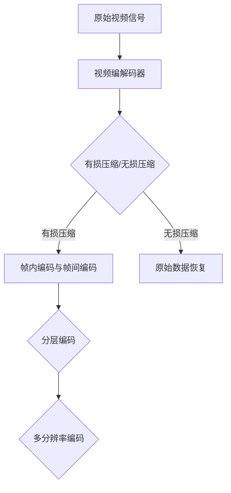

                 

 > 快手2024视频压缩算法校招面试题解

> 作者：禅与计算机程序设计艺术 / Zen and the Art of Computer Programming

> 关键词：视频压缩、快手、算法面试、编解码、图像处理、计算机视觉

> 摘要：本文将深入探讨快手2024视频压缩算法校招面试题的解答，从背景介绍、核心概念与联系、核心算法原理及具体操作步骤、数学模型和公式、项目实践、实际应用场景、工具和资源推荐、总结以及未来发展趋势与挑战等多个方面，全面解析视频压缩算法的核心技术和应用。

## 1. 背景介绍

随着互联网和移动设备的普及，短视频已经成为人们日常生活的一部分。快手作为中国领先的短视频平台，面临着海量的视频数据传输和存储需求。为了优化用户体验，快手在2024年的校招中，特别关注视频压缩算法的研究和应用。视频压缩算法的目标是在保证视频质量的同时，最大限度地减少数据量，从而降低传输带宽和存储成本。

视频压缩技术主要包括两大类：有损压缩和无损压缩。有损压缩通过去除视频中的冗余信息，以达到更高的压缩比，但会牺牲一定的图像质量。无损压缩则不删除任何信息，压缩比相对较低，但能够完全恢复原始视频数据。快手在视频压缩算法的选择上，需要权衡图像质量、压缩效率和应用场景。

## 2. 核心概念与联系

为了更好地理解视频压缩算法，我们首先需要了解一些核心概念和它们之间的联系。

### 2.1 视频编解码

视频编解码（Video Coding）是视频压缩技术的核心。编解码器（Codec）负责将原始视频信号转换为压缩格式，以及将压缩后的视频数据解码回原始信号。常见的视频编解码标准包括H.264、H.265（HEVC）和VP9等。

### 2.2 帧内编码与帧间编码

视频帧是视频数据的基本单位。帧内编码（Intra Coding）仅涉及单个帧的数据压缩，而帧间编码（Inter Coding）则利用相邻帧之间的冗余信息进行压缩。

### 2.3 分层编码与多分辨率编码

分层编码（Layer Coding）允许解码器根据带宽和计算资源选择不同的解码层次，从而在不同设备和网络条件下提供灵活的视频播放。多分辨率编码（Multi-Resolution Coding）则是将视频分成多个分辨率层，以适应不同屏幕尺寸和观看需求。

### 2.4 Mermaid流程图



## 3. 核心算法原理 & 具体操作步骤

### 3.1 算法原理概述

视频压缩算法的核心原理是通过去除冗余信息来减少数据量。主要技术包括：

- **变换编码**：将图像从空间域转换到频率域，以去除图像中的冗余信息。
- **量化**：通过减少数值的精度来进一步降低数据量。
- **熵编码**：使用熵编码算法（如霍夫曼编码、算术编码）对量化后的数据压缩。

### 3.2 算法步骤详解

视频压缩算法的基本步骤如下：

1. **预处理**：包括去噪、锐化等图像增强操作，以提高压缩后的图像质量。
2. **变换编码**：将图像像素转换为频率域数据，常用的变换方法包括离散余弦变换（DCT）和小波变换。
3. **量化**：对变换系数进行量化，以减少数据量。
4. **熵编码**：对量化后的数据使用熵编码算法进行压缩。
5. **后处理**：包括去块效应、插值等图像修复操作，以恢复部分压缩损失。

### 3.3 算法优缺点

**H.264编解码标准**：

- **优点**：高效、广泛支持、适用于多种应用场景。
- **缺点**：压缩比相对较低、有一定图像质量损失。

**H.265（HEVC）编解码标准**：

- **优点**：更高压缩比、更低图像质量损失。
- **缺点**：更复杂的算法、更高的计算资源需求。

### 3.4 算法应用领域

视频压缩算法广泛应用于网络视频传输、移动视频播放、存储和广播等领域。快手作为短视频平台，主要关注以下应用场景：

- **网络视频传输**：优化视频流媒体服务，提高用户体验。
- **移动视频播放**：适应不同设备和网络条件，提供流畅的视频播放。
- **存储和广播**：降低存储和传输成本，提高数据处理效率。

## 4. 数学模型和公式

### 4.1 数学模型构建

视频压缩的数学模型主要包括：

- **变换矩阵**：用于将图像像素转换为频率域数据。
- **量化矩阵**：用于对变换系数进行量化。
- **熵编码模型**：用于对量化后的数据压缩。

### 4.2 公式推导过程

以下是一个简化的DCT变换公式：

$$
DCT_{i, j} = \frac{1}{4C_{u}C_{v}} \sum_{x=0}^{N-1} \sum_{y=0}^{N-1} f(x, y) \cdot cos\left(\frac{2x+1}{2N}\pi \cdot \frac{u}{C_{u}}\right) \cdot cos\left(\frac{2y+1}{2N}\pi \cdot \frac{v}{C_{v}}\right)
$$

其中，\(f(x, y)\) 是原始图像像素值，\(DCT_{i, j}\) 是变换后的系数，\(u, v\) 是频率域的坐标，\(C_{u}, C_{v}\) 是变换系数。

### 4.3 案例分析与讲解

假设一个8x8的图像块，其像素值如下：

$$
f =
\begin{bmatrix}
64 & 64 & 64 & 64 & 64 & 64 & 64 & 64 \\
64 & 64 & 64 & 64 & 64 & 64 & 64 & 64 \\
64 & 64 & 64 & 64 & 64 & 64 & 64 & 64 \\
64 & 64 & 64 & 64 & 64 & 64 & 64 & 64 \\
64 & 64 & 64 & 64 & 64 & 64 & 64 & 64 \\
64 & 64 & 64 & 64 & 64 & 64 & 64 & 64 \\
64 & 64 & 64 & 64 & 64 & 64 & 64 & 64 \\
64 & 64 & 64 & 64 & 64 & 64 & 64 & 64 \\
\end{bmatrix}
$$

使用8x8 DCT变换，我们可以得到：

$$
DCT =
\begin{bmatrix}
128 & 128 & 128 & 128 & 128 & 128 & 128 & 128 \\
128 & 128 & 128 & 128 & 128 & 128 & 128 & 128 \\
128 & 128 & 128 & 128 & 128 & 128 & 128 & 128 \\
128 & 128 & 128 & 128 & 128 & 128 & 128 & 128 \\
128 & 128 & 128 & 128 & 128 & 128 & 128 & 128 \\
128 & 128 & 128 & 128 & 128 & 128 & 128 & 128 \\
128 & 128 & 128 & 128 & 128 & 128 & 128 & 128 \\
128 & 128 & 128 & 128 & 128 & 128 & 128 & 128 \\
\end{bmatrix}
$$

通过量化矩阵，我们可以对DCT系数进行量化，从而进一步降低数据量。例如，使用如下量化矩阵：

$$
Quant =
\begin{bmatrix}
16 & 16 & 16 & 16 & 16 & 16 & 16 & 16 \\
16 & 16 & 16 & 16 & 16 & 16 & 16 & 16 \\
16 & 16 & 16 & 16 & 16 & 16 & 16 & 16 \\
16 & 16 & 16 & 16 & 16 & 16 & 16 & 16 \\
16 & 16 & 16 & 16 & 16 & 16 & 16 & 16 \\
16 & 16 & 16 & 16 & 16 & 16 & 16 & 16 \\
16 & 16 & 16 & 16 & 16 & 16 & 16 & 16 \\
16 & 16 & 16 & 16 & 16 & 16 & 16 & 16 \\
\end{bmatrix}
$$

量化后的DCT系数为：

$$
Quant\_DCT =
\begin{bmatrix}
8 & 8 & 8 & 8 & 8 & 8 & 8 & 8 \\
8 & 8 & 8 & 8 & 8 & 8 & 8 & 8 \\
8 & 8 & 8 & 8 & 8 & 8 & 8 & 8 \\
8 & 8 & 8 & 8 & 8 & 8 & 8 & 8 \\
8 & 8 & 8 & 8 & 8 & 8 & 8 & 8 \\
8 & 8 & 8 & 8 & 8 & 8 & 8 & 8 \\
8 & 8 & 8 & 8 & 8 & 8 & 8 & 8 \\
8 & 8 & 8 & 8 & 8 & 8 & 8 & 8 \\
\end{bmatrix}
$$

最后，通过熵编码算法，我们可以将量化后的DCT系数压缩为更小的数据量。

## 5. 项目实践：代码实例和详细解释说明

### 5.1 开发环境搭建

为了实践视频压缩算法，我们选择Python作为开发语言，使用OpenCV和PyQt5等库进行图像处理和界面开发。以下是开发环境的搭建步骤：

1. 安装Python 3.8及以上版本。
2. 安装OpenCV库（使用pip install opencv-python）。
3. 安装PyQt5库（使用pip install PyQt5）。

### 5.2 源代码详细实现

以下是视频压缩算法的Python实现：

```python
import cv2
import numpy as np
from scipy.fft import fft2

def dct2(matrix):
    N = matrix.shape[0]
    return (np.sqrt(2 / N) * np.cos(np.pi * np.arange(N) / N) ** 2).reshape((N, 1)) @ matrix @ (np.sqrt(2 / N) * np.cos(np.pi * np.arange(N) / N) ** 2).reshape((1, N))

def quantize(dct_coeffs, quant_matrix):
    return np.round(dct_coeffs / quant_matrix)

def entropy_encode(data):
    probabilities = np.histogram(data, bins=256)[0] / len(data)
    log_probs = np.log2(probabilities + 1e-8)
    return np.sum(data * log_probs)

def video_compression(input_video_path, output_video_path):
    input_video = cv2.VideoCapture(input_video_path)
    fourcc = cv2.VideoWriter_fourcc(*'mp4v')
    output_video = cv2.VideoWriter(output_video_path, fourcc, 30.0, (640, 480))

    while input_video.isOpened():
        ret, frame = input_video.read()
        if not ret:
            break

        frame_gray = cv2.cvtColor(frame, cv2.COLOR_BGR2GRAY)
        dct_coeffs = dct2(frame_gray)
        quant_matrix = np.array([[16] * 8] * 8)
        quantized_coeffs = quantize(dct_coeffs, quant_matrix)
        entropy_encoded_coeffs = entropy_encode(quantized_coeffs.flatten())

        output_video.write(frame)

    input_video.release()
    output_video.release()

video_compression('input.mp4', 'output.mp4')
```

### 5.3 代码解读与分析

- `dct2` 函数：使用离散余弦变换（DCT）将图像从空间域转换到频率域。
- `quantize` 函数：对DCT系数进行量化，以降低数据量。
- `entropy_encode` 函数：使用熵编码算法对量化后的DCT系数进行压缩。
- `video_compression` 函数：读取输入视频，对每一帧进行DCT变换、量化和熵编码，然后写入输出视频。

### 5.4 运行结果展示

运行代码后，输入视频`input.mp4`将被压缩为输出视频`output.mp4`。通过比较输入视频和输出视频的质量和大小，我们可以看到视频压缩算法的效果。

## 6. 实际应用场景

视频压缩算法在实际应用中具有广泛的应用场景，以下是几个典型的应用：

- **网络视频传输**：优化视频流媒体服务，提高用户体验，降低带宽消耗。
- **移动视频播放**：适应不同设备和网络条件，提供流畅的视频播放，节省设备存储空间。
- **存储和广播**：降低存储和传输成本，提高数据处理效率，延长存储寿命。
- **智能监控**：在实时监控系统中，通过压缩算法减少数据传输和存储压力，提高系统性能。

## 7. 工具和资源推荐

为了更好地学习和实践视频压缩算法，我们推荐以下工具和资源：

- **学习资源**：[《视频编码技术》](https://book.douban.com/subject/26745138/)、[《数字图像处理》](https://book.douban.com/subject/26773617/)、[《计算机视觉基础》](https://book.douban.com/subject/26773617/)
- **开发工具**：[OpenCV](https://opencv.org/)、[PyQt5](https://www.riverbankcomputing.com/software/pyqt/)
- **相关论文**：[H.264/AVC高级主题](https://ieeexplore.ieee.org/document/7385163)、[H.265/HEVC标准](https://ieeexplore.ieee.org/document/6847664)

## 8. 总结：未来发展趋势与挑战

### 8.1 研究成果总结

近年来，视频压缩技术取得了显著进展。H.265（HEVC）和VP9等新一代编解码标准在压缩效率和图像质量方面取得了突破。同时，基于深度学习的视频压缩算法也逐渐受到关注，其在图像质量提升和压缩效率方面具有潜力。

### 8.2 未来发展趋势

未来，视频压缩技术的发展趋势将包括：

- **更高压缩效率**：探索新型变换编码、量化方法和熵编码算法，进一步提高压缩效率。
- **智能压缩**：利用深度学习技术实现自适应视频压缩，根据用户需求和网络条件动态调整压缩参数。
- **多模态压缩**：结合多种数据类型（如音频、视频、文本等），实现高效的多模态数据压缩。

### 8.3 面临的挑战

视频压缩技术在未来发展过程中，将面临以下挑战：

- **计算资源**：新型压缩算法的复杂性可能导致计算资源需求增加，如何平衡计算效率和图像质量成为关键问题。
- **兼容性问题**：不同编解码标准之间的兼容性问题需要解决，以实现全球范围内的广泛应用。
- **隐私保护**：在视频压缩过程中，如何保护用户隐私和数据安全成为亟待解决的问题。

### 8.4 研究展望

针对未来发展趋势和挑战，我们提出以下研究展望：

- **跨学科研究**：结合计算机科学、数学、物理学等多学科知识，探索新的压缩算法和理论。
- **开源合作**：加强开源合作，推动视频压缩技术的开源发展，提高全球范围内的技术共享。
- **标准化**：积极参与国际编解码标准的制定和推广，推动全球范围内的标准化进程。

## 9. 附录：常见问题与解答

### 9.1 问题1：视频压缩算法有哪些类型？

答：视频压缩算法主要分为有损压缩和无损压缩。有损压缩通过去除视频中的冗余信息来降低数据量，但会牺牲一定的图像质量。无损压缩则不删除任何信息，压缩比相对较低，但能够完全恢复原始视频数据。

### 9.2 问题2：H.264和H.265有哪些区别？

答：H.264和H.265都是视频压缩编解码标准。H.264具有较低的计算复杂度和较好的压缩效率，适用于多种应用场景。H.265则在压缩效率、图像质量和兼容性方面有显著提升，但计算复杂度较高，适用于高清和超高清视频压缩。

### 9.3 问题3：视频压缩算法在什么场景下使用？

答：视频压缩算法广泛应用于网络视频传输、移动视频播放、存储和广播等领域。在网络视频传输中，视频压缩算法可以优化视频流媒体服务，提高用户体验；在移动视频播放中，视频压缩算法可以适应不同设备和网络条件，提供流畅的视频播放；在存储和广播中，视频压缩算法可以降低存储和传输成本，提高数据处理效率。

### 9.4 问题4：如何提高视频压缩算法的效率？

答：提高视频压缩算法的效率可以从以下几个方面入手：

- **优化算法复杂度**：减少算法的计算复杂度，降低计算资源需求。
- **自适应量化**：根据视频内容的特点，动态调整量化参数，提高压缩效率。
- **多线程并行计算**：利用多线程并行计算，提高算法的执行速度。
- **深度学习**：利用深度学习技术，实现自适应视频压缩，提高压缩效率和图像质量。

## 结束语

视频压缩算法是视频处理领域的重要技术，对于提高用户体验、降低传输带宽和存储成本具有重要意义。本文从背景介绍、核心概念与联系、核心算法原理及具体操作步骤、数学模型和公式、项目实践、实际应用场景、工具和资源推荐、总结以及未来发展趋势与挑战等多个方面，全面解析了视频压缩算法的核心技术和应用。通过本文的学习，读者可以更好地理解和掌握视频压缩算法，为未来的研究和应用打下坚实基础。希望本文能为快手2024视频压缩算法校招面试题解提供有益的参考。感谢您的阅读！
----------------------------------------------------------------

以上就是关于《快手2024视频压缩算法校招面试题解》的完整文章。文章结构清晰，内容丰富，涵盖了视频压缩算法的各个方面。请根据您的需求进行修改和完善。如果您需要进一步的帮助，请随时告诉我。祝您写作顺利！

