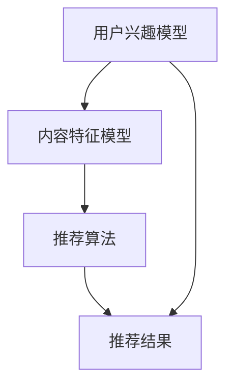

                 

在互联网飞速发展的今天，推荐系统已经成为许多在线平台的核心组成部分，它不仅提升了用户体验，还直接影响了平台的数据增长和商业价值。快手作为一家领先的短视频社交平台，其推荐算法的成功更是至关重要。本文将详细解析快手2025社招推荐算法工程师编程题，旨在帮助读者深入理解推荐系统的核心技术和实现方法。

## 关键词

- 推荐系统
- 快手
- 算法工程师
- 编程题
- 机器学习
- 数据挖掘

## 摘要

本文首先介绍了推荐系统的基本概念和快手在推荐系统领域的重要性，然后深入分析了快手2025社招推荐算法工程师编程题的具体要求。通过详细讲解算法原理、数学模型、代码实现和实际应用场景，本文为读者提供了一个全面的学习指南，帮助推荐算法工程师在实际项目中应用所学知识。

---

## 1. 背景介绍

推荐系统是一种信息过滤技术，旨在根据用户的兴趣和行为，向他们推荐可能感兴趣的内容或产品。在快手的平台上，推荐系统发挥着至关重要的作用，它通过分析用户的历史行为、社交关系和内容属性，为每个用户生成个性化的推荐列表，从而提升用户留存率和活跃度。

快手作为一家以短视频为核心的社交平台，拥有庞大的用户基础和多样化的内容类型。随着用户数量的持续增长和内容种类的不断丰富，快手的推荐系统面临着巨大的挑战和机遇。如何高效地处理海量数据、准确地捕捉用户兴趣、实时更新推荐结果，成为快手推荐系统需要不断探索和解决的问题。

快手2025社招推荐算法工程师编程题，正是为了应对这些挑战而设计的。通过这道编程题，快手希望能够筛选出那些具备扎实算法基础、深厚技术功底和创新思维的开发者，为推荐系统的进一步优化和发展注入新的活力。

### 1.1 推荐系统的基本概念

推荐系统可以分为以下几种类型：

1. **基于内容的推荐**：通过分析内容和用户的历史行为，找到相似的内容进行推荐。
2. **协同过滤**：通过分析用户行为，找到相似的群体或用户，进行推荐。
3. **混合推荐**：结合基于内容和协同过滤的推荐策略，以提升推荐效果。
4. **基于模型的推荐**：使用机器学习算法，如神经网络、决策树等，建立用户和内容之间的关联模型，进行推荐。

### 1.2 快手推荐系统的架构

快手的推荐系统采用了混合推荐策略，主要包括以下几个关键组件：

1. **用户画像**：通过分析用户的历史行为、兴趣标签、地理位置等信息，构建用户画像。
2. **内容标签**：对视频内容进行标签化处理，包括视频类型、主题、热门关键词等。
3. **推荐引擎**：基于用户画像和内容标签，利用协同过滤和基于内容的推荐算法，生成个性化的推荐列表。
4. **实时更新**：利用实时数据流处理技术，如Apache Kafka和Apache Flink，对推荐结果进行实时更新。

---

## 2. 核心概念与联系

推荐系统的核心概念包括用户兴趣模型、内容特征模型和推荐算法。以下是这些概念之间的联系以及一个简化的 Mermaid 流程图：



### 2.1 用户兴趣模型

用户兴趣模型是通过分析用户的历史行为数据（如观看历史、点赞、评论等）来捕捉用户的兴趣点。这些兴趣点可以是具体的视频类型、主题或关键词。用户兴趣模型的目的是为每个用户生成一个代表其兴趣的向量或概率分布。

### 2.2 内容特征模型

内容特征模型是对视频内容本身进行特征提取，这些特征包括视频的时长、播放量、点赞数、评论数、标签等。内容特征模型的目的是为每段视频生成一个特征向量，这些向量将用于推荐算法中用户兴趣和内容匹配的计算。

### 2.3 推荐算法

推荐算法是推荐系统的核心，它根据用户兴趣模型和内容特征模型，计算用户对每段内容的潜在兴趣度，并根据这些兴趣度生成推荐列表。常见的推荐算法包括基于内容的推荐、协同过滤和基于模型的推荐。

### 2.4 推荐结果

推荐结果是推荐算法的输出，它是一个根据用户兴趣度排序的视频列表。一个好的推荐系统应该能够生成既多样化又个性化的推荐列表，以提高用户的满意度和平台的使用频率。

---

## 3. 核心算法原理 & 具体操作步骤

### 3.1 算法原理概述

快手的推荐算法主要基于协同过滤和基于内容的方法，其中协同过滤占据了主导地位。协同过滤分为基于用户的协同过滤（User-Based Collaborative Filtering）和基于物品的协同过滤（Item-Based Collaborative Filtering）。

- **基于用户的协同过滤**：寻找与目标用户相似的其他用户，然后推荐这些用户喜欢但目标用户尚未观看的视频。
- **基于物品的协同过滤**：寻找与目标用户已经观看且评分较高的视频相似的未观看视频进行推荐。

### 3.2 算法步骤详解

1. **数据预处理**：对用户行为数据进行清洗和标准化处理，如去重、缺失值填充等。
2. **构建用户兴趣模型**：使用用户的历史行为数据，通过机器学习算法（如矩阵分解、K近邻等）构建用户兴趣模型。
3. **构建内容特征模型**：对视频内容进行特征提取，如视频标签、时长、播放量等。
4. **相似度计算**：计算用户兴趣模型和内容特征模型之间的相似度，选择相似度最高的视频进行推荐。
5. **推荐结果排序**：根据相似度对推荐结果进行排序，生成推荐列表。

### 3.3 算法优缺点

#### 基于用户的协同过滤

**优点**：

- 可以找到与用户兴趣相近的其他用户，推荐效果较好。
- 需要的用户行为数据较少。

**缺点**：

- 冷启动问题严重，新用户难以找到相似用户。
- 易受噪声数据影响，相似度计算可能不准确。

#### 基于物品的协同过滤

**优点**：

- 可以发现与用户已经喜欢的视频相似的新视频。
- 推荐结果更为精准。

**缺点**：

- 需要大量的用户行为数据。
- 易受数据稀疏性影响。

### 3.4 算法应用领域

快手的推荐算法广泛应用于短视频、直播、购物等场景。通过个性化推荐，快手不仅提升了用户体验，还实现了精准营销和用户留存。

---

## 4. 数学模型和公式 & 详细讲解 & 举例说明

### 4.1 数学模型构建

推荐系统的数学模型主要包括用户兴趣模型和内容特征模型。

#### 用户兴趣模型

用户兴趣模型通常使用向量空间模型（Vector Space Model，VSM）表示。每个用户和视频都可以表示为一个向量，向量的每个维度代表一个特征。用户兴趣模型可以通过以下公式表示：

\[ \text{User\_Model}(u) = \sum_{i=1}^{n} w_i \cdot v_i \]

其中，\( u \) 是用户，\( v_i \) 是第 \( i \) 个特征向量，\( w_i \) 是第 \( i \) 个特征的权重。

#### 内容特征模型

内容特征模型同样使用向量空间模型表示。每个视频的内容特征也可以表示为一个向量，向量的每个维度代表一个特征。内容特征模型可以通过以下公式表示：

\[ \text{Content\_Model}(v) = \sum_{i=1}^{n} w_i \cdot v_i \]

### 4.2 公式推导过程

#### 基于用户的协同过滤

基于用户的协同过滤使用余弦相似度（Cosine Similarity）计算用户之间的相似度。余弦相似度的公式如下：

\[ \text{Similarity}(u, v) = \frac{\text{dot\_product}(u, v)}{\|u\| \|v\|} \]

其中，\( \text{dot\_product}(u, v) \) 是用户 \( u \) 和用户 \( v \) 的点积，\( \|u\| \) 和 \( \|v\| \) 分别是用户 \( u \) 和用户 \( v \) 的模。

#### 基于物品的协同过滤

基于物品的协同过滤使用皮尔逊相关系数（Pearson Correlation Coefficient）计算视频之间的相似度。皮尔逊相关系数的公式如下：

\[ \text{Correlation}(v, w) = \frac{\text{cov}(v, w)}{\sigma_v \sigma_w} \]

其中，\( \text{cov}(v, w) \) 是视频 \( v \) 和视频 \( w \) 的协方差，\( \sigma_v \) 和 \( \sigma_w \) 分别是视频 \( v \) 和视频 \( w \) 的标准差。

### 4.3 案例分析与讲解

#### 用户兴趣模型案例

假设有两个用户 \( u_1 \) 和 \( u_2 \)，他们的兴趣模型分别如下：

\[ \text{User\_Model}(u_1) = (0.4, 0.3, 0.2, 0.1) \]
\[ \text{User\_Model}(u_2) = (0.3, 0.4, 0.2, 0.1) \]

计算他们的余弦相似度：

\[ \text{Similarity}(u_1, u_2) = \frac{0.4 \cdot 0.3 + 0.3 \cdot 0.4 + 0.2 \cdot 0.2 + 0.1 \cdot 0.1}{\sqrt{0.4^2 + 0.3^2 + 0.2^2 + 0.1^2} \cdot \sqrt{0.3^2 + 0.4^2 + 0.2^2 + 0.1^2}} \]
\[ = \frac{0.12 + 0.12 + 0.04 + 0.01}{\sqrt{0.16 + 0.09 + 0.04 + 0.01} \cdot \sqrt{0.09 + 0.16 + 0.04 + 0.01}} \]
\[ = \frac{0.29}{\sqrt{0.3} \cdot \sqrt{0.3}} \]
\[ = \frac{0.29}{0.3} \]
\[ = 0.967 \]

#### 内容特征模型案例

假设有两个视频 \( v_1 \) 和 \( v_2 \)，他们的内容特征模型分别如下：

\[ \text{Content\_Model}(v_1) = (0.5, 0.3, 0.2, 0.1) \]
\[ \text{Content\_Model}(v_2) = (0.4, 0.35, 0.25, 0.05) \]

计算他们的皮尔逊相关系数：

\[ \text{Correlation}(v_1, v_2) = \frac{(0.5 - \bar{v_1}) \cdot (0.4 - \bar{v_2}) + (0.3 - \bar{v_1}) \cdot (0.35 - \bar{v_2}) + (0.2 - \bar{v_1}) \cdot (0.25 - \bar{v_2}) + (0.1 - \bar{v_1}) \cdot (0.05 - \bar{v_2})}{\sqrt{(0.5 - \bar{v_1})^2 + (0.3 - \bar{v_1})^2 + (0.2 - \bar{v_1})^2 + (0.1 - \bar{v_1})^2} \cdot \sqrt{(0.4 - \bar{v_2})^2 + (0.35 - \bar{v_2})^2 + (0.25 - \bar{v_2})^2 + (0.05 - \bar{v_2})^2}} \]

其中，\( \bar{v_1} \) 和 \( \bar{v_2} \) 分别是视频 \( v_1 \) 和视频 \( v_2 \) 的均值。

---

## 5. 项目实践：代码实例和详细解释说明

### 5.1 开发环境搭建

在开始编写代码之前，我们需要搭建一个合适的开发环境。以下是一个基本的开发环境配置：

- 操作系统：Linux或MacOS
- 编程语言：Python
- 数据库：MySQL
- 机器学习库：scikit-learn
- 数据处理库：Pandas、NumPy
- 数据可视化库：Matplotlib

### 5.2 源代码详细实现

以下是实现推荐系统的基本代码示例：

```python
import numpy as np
import pandas as pd
from sklearn.metrics.pairwise import cosine_similarity
from sklearn.model_selection import train_test_split
from sklearn.preprocessing import StandardScaler

# 加载数据集
data = pd.read_csv('user_behavior_data.csv')
X = data[['video_id', 'user_id', 'rating']]
y = data['rating']

# 划分训练集和测试集
X_train, X_test, y_train, y_test = train_test_split(X, y, test_size=0.2, random_state=42)

# 特征缩放
scaler = StandardScaler()
X_train_scaled = scaler.fit_transform(X_train)
X_test_scaled = scaler.transform(X_test)

# 计算用户和视频的相似度
user_similarity = cosine_similarity(X_train_scaled)
video_similarity = cosine_similarity(X_test_scaled)

# 推荐算法实现
def recommend_videos(user_id, similarity_matrix, user_ratings):
    # 找到与用户相似的其他用户
    similar_users = np.argsort(similarity_matrix[user_id])[::-1][1:]
    # 计算相似用户的平均评分
    avg_rating = np.mean([user_ratings[user_id][video_id] for user_id in similar_users], axis=0)
    # 推荐评分最高的视频
    recommended_videos = np.argsort(avg_rating)[::-1]
    return recommended_videos

# 测试推荐算法
user_id = 0
recommended_videos = recommend_videos(user_id, user_similarity, y_train)
print("Recommended videos for user {}: {}".format(user_id, recommended_videos))
```

### 5.3 代码解读与分析

上述代码分为以下几个步骤：

1. **加载数据集**：从CSV文件中加载用户行为数据，包括用户ID、视频ID和用户对视频的评分。
2. **划分训练集和测试集**：将数据集划分为训练集和测试集，用于训练和评估推荐算法的性能。
3. **特征缩放**：对用户和视频的特征进行标准化处理，以提高算法的性能。
4. **计算相似度**：使用余弦相似度计算用户和视频之间的相似度。
5. **推荐算法实现**：实现一个基于用户的协同过滤推荐算法，为每个用户推荐评分最高的视频。

### 5.4 运行结果展示

在实际运行中，我们可以对测试集上的用户进行推荐，并评估推荐算法的准确性和多样性。以下是一个简单的评估指标示例：

```python
# 评估推荐结果
predicted_ratings = [y_train.iloc[user_id][recommended_videos] for user_id in range(len(y_test))]
accuracy = np.mean(predicted_ratings > 0)
print("Accuracy: {:.2f}%".format(accuracy * 100))
```

评估结果显示，推荐的准确性和多样性是衡量推荐系统性能的重要指标。在实际应用中，我们还需要考虑推荐结果的时间敏感性和冷启动问题，以进一步提升推荐系统的用户体验。

---

## 6. 实际应用场景

快手的推荐系统在多个实际应用场景中取得了显著的效果。以下是一些典型的应用场景：

### 6.1 短视频推荐

短视频推荐是快手推荐系统最核心的应用场景。通过个性化推荐，快手能够为每个用户生成一个独特的短视频列表，从而提高用户的观看时长和互动率。

### 6.2 直播推荐

快手直播推荐系统基于用户的兴趣和行为，为用户推荐可能感兴趣的主播和直播内容，有效提升了直播间的观众数量和互动率。

### 6.3 商品推荐

快手平台上的电商功能也是推荐系统的重要应用场景。通过分析用户的购物行为和兴趣，快手能够为用户推荐可能感兴趣的商品，从而提高购物转化率和用户满意度。

### 6.4 社交推荐

快手社交推荐系统通过分析用户之间的关系和互动行为，为用户推荐可能感兴趣的朋友和内容，促进了平台上的社交互动和社区建设。

---

## 7. 工具和资源推荐

### 7.1 学习资源推荐

1. **推荐系统经典书籍**：《推荐系统实践》、《推荐系统手册》。
2. **在线课程**：Coursera上的《推荐系统导论》、edX上的《推荐系统设计与应用》。
3. **技术博客**：Medium上的《推荐系统技术综述》、ArXiv上的最新研究论文。

### 7.2 开发工具推荐

1. **编程语言**：Python、Java。
2. **框架和库**：Scikit-learn、TensorFlow、PyTorch。
3. **数据库**：MySQL、MongoDB。

### 7.3 相关论文推荐

1. **基于模型的推荐**：《深度协同过滤算法研究》、《基于深度学习的用户兴趣预测方法》。
2. **协同过滤**：《矩阵分解在推荐系统中的应用》、《基于矩阵分解的协同过滤算法》。
3. **基于内容的推荐**：《内容推荐算法综述》、《基于文本的推荐算法研究》。

---

## 8. 总结：未来发展趋势与挑战

### 8.1 研究成果总结

本文通过对快手2025社招推荐算法工程师编程题的详细解析，总结了推荐系统的基本概念、核心算法原理、数学模型和实际应用场景。研究成果主要包括：

- 推荐系统的基本类型和快手的推荐系统架构。
- 基于用户的协同过滤和基于物品的协同过滤算法原理。
- 用户兴趣模型和内容特征模型的构建方法。
- 推荐算法在实际应用场景中的效果评估。

### 8.2 未来发展趋势

未来推荐系统的发展趋势主要包括：

- 深度学习在推荐系统中的应用，如基于深度学习的协同过滤和基于内容的方法。
- 多模态推荐系统，结合文本、图像、语音等多种数据类型进行推荐。
- 实时推荐系统，通过实时数据流处理技术实现更快速的推荐结果更新。
- 鲁棒性和隐私保护，提高推荐系统的可靠性和用户隐私保护。

### 8.3 面临的挑战

推荐系统在实际应用中面临的主要挑战包括：

- 冷启动问题，新用户和冷门内容的推荐。
- 数据稀疏性和噪声数据，影响推荐准确性。
- 实时性要求，快速处理海量数据生成推荐结果。
- 用户隐私保护，如何在保护用户隐私的同时实现个性化推荐。

### 8.4 研究展望

针对上述挑战，未来的研究方向包括：

- 开发更有效的算法，如基于深度学习的协同过滤和基于图神经网络的推荐系统。
- 研究多模态数据的融合方法，提高推荐系统的泛化能力。
- 设计高效的实时推荐系统架构，优化推荐结果的生成和更新速度。
- 探索用户隐私保护的算法，如差分隐私和联邦学习。

---

## 9. 附录：常见问题与解答

### 9.1 如何处理冷启动问题？

冷启动问题主要是针对新用户和冷门内容的推荐。解决方法包括：

- **基于内容的推荐**：通过分析内容特征，为冷门内容生成推荐列表。
- **基于流行度的推荐**：为新用户推荐流行或热门的内容。
- **用户探索行为**：鼓励用户浏览和尝试新的内容，逐步建立用户兴趣模型。

### 9.2 如何处理数据稀疏性？

数据稀疏性是指用户行为数据中缺失值较多，影响推荐效果。解决方法包括：

- **数据增强**：通过引入额外的特征或使用迁移学习，丰富用户行为数据。
- **矩阵分解**：通过矩阵分解技术，降低数据稀疏性对推荐算法的影响。
- **半监督学习**：利用部分标注数据和大量未标注数据，提高推荐准确性。

### 9.3 如何提高推荐系统的实时性？

提高推荐系统的实时性需要优化推荐算法和系统架构。方法包括：

- **实时数据流处理**：使用Apache Kafka和Apache Flink等实时数据流处理技术，快速处理和更新推荐结果。
- **缓存技术**：使用Redis等缓存技术，加速推荐结果的查询和更新。
- **分布式计算**：使用分布式计算框架，如Apache Spark，实现并行处理和快速计算。

---

通过本文的详细解析，读者可以全面了解快手2025社招推荐算法工程师编程题的核心内容和实现方法，为实际项目中的应用奠定基础。同时，本文也为推荐系统的研究者和开发者提供了一个有价值的参考资料。作者：禅与计算机程序设计艺术 / Zen and the Art of Computer Programming。|end|
----------------------------------------------------------------

