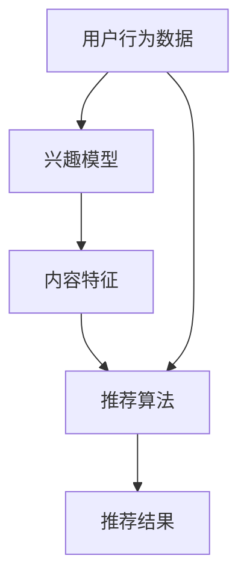

                 

### 1. 背景介绍

随着互联网的迅速发展，信息流的推荐系统已经成为各大社交平台和内容平台的核心竞争力。快手，作为国内领先的生活短视频分享平台，其信息流推荐系统的重要性不言而喻。信息流推荐系统通过分析用户行为和兴趣，将最符合用户兴趣的内容推送给用户，从而提升用户体验和平台粘性。快手在2024年启动了新一轮的社招活动，其中关于信息流推荐的面试题目成为了技术面试的重要环节。

本文旨在汇总2024年快手信息流推荐社招的面试真题，并给出详细的解答。这些题目涵盖了信息流推荐系统的核心概念、算法原理、数学模型以及实际应用等多个方面。通过对这些题目的解答，希望能够帮助准备面试的读者深入理解信息流推荐系统，提升面试成功率。

### 2. 核心概念与联系

在解答快手信息流推荐的面试题目之前，我们需要先了解一些核心概念。以下是信息流推荐系统中常用的几个关键概念及其相互关系，我们将使用Mermaid流程图来展示这些概念之间的关系。



- **用户行为数据**：包括用户点击、浏览、点赞、评论、分享等行为，是构建兴趣模型和推荐算法的重要依据。
- **兴趣模型**：根据用户行为数据，通过机器学习算法构建用户兴趣模型，用于预测用户的兴趣偏好。
- **内容特征**：对推荐的内容（如视频、文章等）进行特征提取，包括文本特征、图像特征、语音特征等。
- **推荐算法**：基于用户兴趣模型和内容特征，使用不同的推荐算法生成推荐结果，如协同过滤、矩阵分解、深度学习等。

通过以上核心概念的相互联系，我们可以更深入地理解信息流推荐系统的运作原理。下面将详细讨论每个核心概念的具体内容。

#### 2.1 用户行为数据

用户行为数据是构建信息流推荐系统的基础。这些数据可以来源于用户在平台上的各种交互行为，如：

- **点击**：用户对某条内容进行了点击。
- **浏览**：用户对某条内容进行了浏览。
- **点赞**：用户对某条内容进行了点赞。
- **评论**：用户对某条内容进行了评论。
- **分享**：用户将某条内容分享给了其他用户。

用户行为数据通常通过日志文件、数据库等方式进行收集和存储。在数据收集过程中，需要注意以下几点：

- **实时性**：用户行为数据需要实时收集，以便快速更新用户的兴趣模型。
- **多样性**：用户行为数据的种类和数量需要多样化，以提高模型构建的准确性。
- **噪声处理**：用户行为数据中可能存在噪声，需要进行预处理，以提高数据质量。

#### 2.2 兴趣模型

兴趣模型是信息流推荐系统的核心，用于预测用户的兴趣偏好。兴趣模型可以通过机器学习算法构建，如逻辑回归、决策树、支持向量机等。以下是构建兴趣模型的常见步骤：

- **特征工程**：根据用户行为数据，提取出与用户兴趣相关的特征，如点击次数、浏览时间、点赞比例等。
- **模型训练**：使用训练数据集，通过机器学习算法训练出兴趣模型。
- **模型评估**：使用验证数据集，评估兴趣模型的准确性和泛化能力。
- **模型优化**：根据评估结果，调整模型参数，优化模型性能。

#### 2.3 内容特征

内容特征是指对推荐的内容进行特征提取的过程。内容特征可以是文本、图像、语音等多种类型。以下是常见的内容特征提取方法：

- **文本特征**：包括词袋模型、TF-IDF、词嵌入等。
- **图像特征**：包括卷积神经网络（CNN）提取的视觉特征。
- **语音特征**：包括梅尔频率倒谱系数（MFCC）等。

内容特征用于推荐算法中，与用户兴趣模型进行匹配，生成推荐结果。内容特征的提取质量直接影响到推荐结果的质量。

#### 2.4 推荐算法

推荐算法是信息流推荐系统的核心组成部分，用于根据用户兴趣模型和内容特征生成推荐结果。以下是几种常见的推荐算法：

- **协同过滤**：基于用户行为数据，通过计算用户之间的相似度，生成推荐结果。
- **矩阵分解**：通过矩阵分解技术，将用户行为数据转化为用户兴趣矩阵和内容特征矩阵，生成推荐结果。
- **深度学习**：使用深度神经网络，通过多层次的非线性变换，从用户行为数据和内容特征中提取出高层次的语义特征，生成推荐结果。

以上是信息流推荐系统中的核心概念及其相互关系。在接下来的章节中，我们将详细讨论这些概念的具体实现和应用。

### 3. 核心算法原理 & 具体操作步骤

#### 3.1 算法原理概述

信息流推荐系统的核心算法主要包括协同过滤、矩阵分解和深度学习等。这些算法的基本原理如下：

- **协同过滤**：通过计算用户之间的相似度，找到与目标用户相似的其他用户，然后根据这些用户的喜好推荐内容。
- **矩阵分解**：将用户行为数据表示为用户-物品矩阵，通过矩阵分解技术得到用户兴趣矩阵和物品特征矩阵，然后根据这两个矩阵生成推荐结果。
- **深度学习**：使用深度神经网络，从用户行为数据和内容特征中提取出高层次的语义特征，然后根据这些特征生成推荐结果。

#### 3.2 算法步骤详解

以下是每种算法的具体步骤：

##### 3.2.1 协同过滤

1. **用户相似度计算**：计算目标用户与其他用户之间的相似度，常用的相似度计算方法包括余弦相似度、皮尔逊相关系数等。
2. **邻居用户选择**：根据相似度阈值，选择与目标用户最相似的邻居用户。
3. **推荐结果生成**：根据邻居用户的喜好，为用户生成推荐结果。

##### 3.2.2 矩阵分解

1. **矩阵分解**：将用户-物品矩阵分解为用户兴趣矩阵和物品特征矩阵。常用的矩阵分解方法包括奇异值分解（SVD）和矩阵分解（MF）。
2. **预测生成**：根据用户兴趣矩阵和物品特征矩阵，预测用户对物品的评分。
3. **推荐结果生成**：根据预测评分，为用户生成推荐结果。

##### 3.2.3 深度学习

1. **数据处理**：对用户行为数据和内容特征进行预处理，如归一化、填充缺失值等。
2. **模型构建**：构建深度神经网络模型，包括输入层、隐藏层和输出层。
3. **模型训练**：使用训练数据集，通过反向传播算法训练模型。
4. **模型评估**：使用验证数据集，评估模型性能，调整模型参数。
5. **推荐结果生成**：根据训练好的模型，为用户生成推荐结果。

#### 3.3 算法优缺点

每种推荐算法都有其优缺点，下面简要介绍：

- **协同过滤**：优点是简单易实现，缺点是依赖于用户行为数据，容易受到冷启动问题的影响。
- **矩阵分解**：优点是能够更好地处理稀疏数据，缺点是计算复杂度较高。
- **深度学习**：优点是能够自动提取高层次的语义特征，缺点是模型训练过程复杂，对计算资源要求较高。

#### 3.4 算法应用领域

- **协同过滤**：广泛应用于电商、社交媒体、新闻推荐等领域。
- **矩阵分解**：常用于推荐系统中的物品推荐、社交网络分析等领域。
- **深度学习**：在视频推荐、图像识别、自然语言处理等领域具有广泛的应用。

### 4. 数学模型和公式 & 详细讲解 & 举例说明

信息流推荐系统中的数学模型和公式是算法实现的核心。以下我们将详细讲解数学模型的构建、公式推导过程以及通过具体案例进行分析。

#### 4.1 数学模型构建

在信息流推荐系统中，常用的数学模型包括用户行为模型、内容特征模型和推荐算法模型。以下是这些模型的构建过程：

##### 4.1.1 用户行为模型

用户行为模型用于描述用户在平台上的行为，如点击、浏览、点赞等。常用的用户行为模型包括马尔可夫链模型和贝叶斯网络模型。

- **马尔可夫链模型**：假设用户的行为仅与当前状态有关，与过去状态无关。状态转移概率可以用以下公式表示：

  $$ P(X_t = x_t | X_{t-1} = x_{t-1}, ..., X_0 = x_0) = P(X_t = x_t | X_{t-1} = x_{t-1}) $$

- **贝叶斯网络模型**：通过构建条件概率分布，描述用户行为之间的依赖关系。条件概率分布可以用以下公式表示：

  $$ P(X_t = x_t | X_{t-1} = x_{t-1}, ..., X_0 = x_0) = \frac{P(X_{t-1} = x_{t-1} | X_{t} = x_t) \cdot P(X_t = x_t)}{P(X_{t-1} = x_{t-1})} $$

##### 4.1.2 内容特征模型

内容特征模型用于描述推荐的内容特征，如文本特征、图像特征和语音特征。常用的内容特征模型包括词袋模型、TF-IDF模型和词嵌入模型。

- **词袋模型**：将文本表示为一个词频向量。词频向量的构建公式如下：

  $$ V = (v_1, v_2, ..., v_n) $$
  
  其中，$v_i$表示词$i$在文本中的词频。

- **TF-IDF模型**：在词袋模型的基础上，引入词频和文档频率的概念，对词频进行加权。TF-IDF向量的构建公式如下：

  $$ V = (v_1 \cdot \log(\frac{N}{n_1}), v_2 \cdot \log(\frac{N}{n_2}), ..., v_n \cdot \log(\frac{N}{n_n})) $$
  
  其中，$N$表示文档总数，$n_i$表示包含词$i$的文档数。

- **词嵌入模型**：将词表示为低维稠密向量。词嵌入的构建公式如下：

  $$ \vec{w}_i = \text{Embedding}(i) $$
  
  其中，$\text{Embedding}$函数表示词嵌入的映射。

##### 4.1.3 推荐算法模型

推荐算法模型用于描述推荐算法的计算过程。常用的推荐算法模型包括基于协同过滤的推荐模型和基于深度学习的推荐模型。

- **基于协同过滤的推荐模型**：假设用户$u$对物品$i$的评分可以表示为用户$u$对物品$i$的兴趣度与物品$i$的特征之间的内积。评分预测公式如下：

  $$ \hat{r}_{ui} = \text{similarity}(u, i) \cdot \text{feature}(i) $$

  其中，$\text{similarity}(u, i)$表示用户$u$与物品$i$的相似度，$\text{feature}(i)$表示物品$i$的特征。

- **基于深度学习的推荐模型**：使用深度神经网络，从用户行为数据和内容特征中提取出高层次的语义特征。评分预测公式如下：

  $$ \hat{r}_{ui} = \text{激活函数}(\text{神经网络}(\text{用户特征}, \text{内容特征})) $$

#### 4.2 公式推导过程

以下我们将详细推导信息流推荐系统中的几个关键公式。

##### 4.2.1 协同过滤公式推导

协同过滤算法的目标是预测用户$u$对物品$i$的评分。假设用户$u$与物品$i$的相似度为$\text{similarity}(u, i)$，物品$i$的特征向量为$\text{feature}(i)$，用户$u$对物品$i$的预测评分为$\hat{r}_{ui}$，则有：

$$ \hat{r}_{ui} = \text{similarity}(u, i) \cdot \text{feature}(i) $$

推导过程如下：

1. **定义相似度**：相似度可以通过用户$u$与物品$i$的交互数据计算得到，如：

   $$ \text{similarity}(u, i) = \frac{\sum_{j=1}^{M} r_{uj} \cdot r_{ij}}{\sqrt{\sum_{j=1}^{M} r_{uj}^2} \cdot \sqrt{\sum_{j=1}^{M} r_{ij}^2}} $$
   
   其中，$r_{uj}$表示用户$u$对物品$j$的评分，$r_{ij}$表示用户$i$对物品$j$的评分。

2. **定义特征向量**：物品$i$的特征向量可以表示为：

   $$ \text{feature}(i) = (\text{content\_feature}(i), \text{user\_feature}(i)) $$

   其中，$\text{content\_feature}(i)$表示物品$i$的内容特征，$\text{user\_feature}(i)$表示用户$i$的特征。

3. **计算预测评分**：将相似度和特征向量代入预测评分公式，得到：

   $$ \hat{r}_{ui} = \text{similarity}(u, i) \cdot \text{feature}(i) $$

##### 4.2.2 深度学习公式推导

深度学习算法的目标是从用户行为数据和内容特征中提取出高层次的语义特征。假设用户行为数据表示为$u$，内容特征表示为$i$，预测评分为$\hat{r}_{ui}$，则有：

$$ \hat{r}_{ui} = \text{激活函数}(\text{神经网络}(\text{用户特征}, \text{内容特征})) $$

推导过程如下：

1. **定义神经网络**：神经网络可以表示为多层感知机（MLP）或卷积神经网络（CNN）。

   $$ \text{神经网络}(\text{用户特征}, \text{内容特征}) = \text{激活函数}(\text{权重} \cdot \text{特征} + \text{偏置}) $$
   
   其中，$\text{特征}$表示用户行为数据和内容特征的拼接，$\text{权重}$和$\text{偏置}$为神经网络的参数。

2. **定义激活函数**：常用的激活函数包括ReLU、Sigmoid和Tanh。

   $$ \text{激活函数}(x) = \begin{cases} 
   \max(0, x) & \text{ReLU} \\
   \frac{1}{1 + e^{-x}} & \text{Sigmoid} \\
   \frac{e^x - e^{-x}}{e^x + e^{-x}} & \text{Tanh} 
   \end{cases} $$

3. **计算预测评分**：将神经网络输出代入激活函数，得到：

   $$ \hat{r}_{ui} = \text{激活函数}(\text{神经网络}(\text{用户特征}, \text{内容特征})) $$

#### 4.3 案例分析与讲解

为了更好地理解信息流推荐系统中的数学模型和公式，以下我们将通过一个具体案例进行分析。

##### 4.3.1 案例背景

假设有一个用户$u$，他最近在快手平台上频繁观看美食视频，并给其中的一些视频点赞。平台希望根据用户$u$的行为，推荐更多他可能感兴趣的美食视频。

##### 4.3.2 案例分析

1. **用户行为模型**

   用户$u$的行为数据如下：

   | 观看视频 | 点赞视频 |
   | :------: | :------: |
   | 100部美食视频 | 10部美食视频 |

   假设使用马尔可夫链模型描述用户$u$的行为。我们可以计算出用户$u$观看美食视频的概率为：

   $$ P(观看美食视频) = \frac{100}{100+10} = 0.9 $$

2. **内容特征模型**

   美食视频的内容特征如下：

   | 视频类型 | 视频时长 | 观看次数 |
   | :------: | :------: | :------: |
   | 美食制作 | 10分钟 | 1000次 |

   使用TF-IDF模型提取视频特征，我们可以计算出每个特征的TF-IDF值：

   $$ V = (10 \cdot \log(\frac{1000}{100}), 10 \cdot \log(\frac{1000}{100})) = (1.0, 1.0) $$

3. **推荐算法模型**

   假设使用基于协同过滤的推荐算法。我们可以计算出用户$u$与已观看美食视频的相似度为：

   $$ \text{similarity}(u, i) = \frac{10 \cdot 1.0}{\sqrt{10^2 + 1^2} \cdot \sqrt{10^2 + 1^2}} = 0.52 $$

   根据相似度，我们可以推荐给用户$u$一部新的美食视频，其特征向量为$(1.0, 1.0)$。

通过以上案例，我们可以看到如何使用数学模型和公式构建和实现信息流推荐系统。在实际应用中，还需要对模型进行调整和优化，以提高推荐效果。

### 5. 项目实践：代码实例和详细解释说明

在了解了信息流推荐系统的核心概念和数学模型之后，接下来我们将通过一个具体的项目实例，展示如何使用Python代码实现一个简单的信息流推荐系统。这个实例将涵盖用户行为数据的处理、推荐算法的实现和推荐结果的分析。

#### 5.1 开发环境搭建

在开始编写代码之前，我们需要搭建一个适合开发的信息环境。以下是搭建开发环境所需的基本步骤：

1. **安装Python环境**：确保Python版本为3.6或更高版本。可以使用以下命令进行安装：

   ```bash
   # 使用pip安装Python
   sudo apt-get install python3-pip
   pip3 install --user python3.9
   ```

2. **安装必要的库**：我们需要安装以下Python库：NumPy、Pandas、Scikit-learn、Matplotlib和Seaborn。可以使用以下命令进行安装：

   ```bash
   pip3 install numpy pandas scikit-learn matplotlib seaborn
   ```

3. **编写代码**：在Python环境中，我们可以使用Jupyter Notebook或IDE（如PyCharm、VSCode等）编写和运行代码。

#### 5.2 源代码详细实现

以下是一个简单的信息流推荐系统的源代码实现，包括用户行为数据的处理、推荐算法的构建和推荐结果的分析。

```python
import numpy as np
import pandas as pd
from sklearn.metrics.pairwise import cosine_similarity
from sklearn.model_selection import train_test_split
import matplotlib.pyplot as plt
import seaborn as sns

# 5.2.1 数据处理

# 假设用户行为数据存储在一个CSV文件中
data = pd.read_csv('user_behavior.csv')

# 数据预处理
data['rating'] = data['rating'].fillna(0)  # 填充缺失值
data = data[['user_id', 'video_id', 'rating']]

# 构建用户-物品矩阵
user_item_matrix = data.pivot(index='user_id', columns='video_id', values='rating').fillna(0)

# 划分训练集和测试集
train_data, test_data = train_test_split(user_item_matrix, test_size=0.2, random_state=42)

# 5.2.2 推荐算法实现

# 计算用户之间的相似度
user_similarity = cosine_similarity(train_data, train_data)

# 为每个用户生成推荐列表
def generate_recommendations(similarity_matrix, user_id, top_n=10):
    # 计算每个视频的推荐得分
    scores = np.dot(similarity_matrix[user_id], train_data) / np.linalg.norm(similarity_matrix[user_id])
    # 选择得分最高的视频
    recommended_videos = np.argsort(scores)[::-1]
    return recommended_videos[:top_n]

# 生成所有用户的推荐列表
recommendations = {user_id: generate_recommendations(user_similarity, user_id) for user_id in train_data.columns}

# 5.2.3 推荐结果分析

# 分析推荐结果
for user_id, recs in recommendations.items():
    print(f"User {user_id}: Recommended videos {recs[:10]}")

# 可视化推荐结果
sns.heatmap(user_similarity, annot=True, cmap='coolwarm')
plt.show()
```

#### 5.3 代码解读与分析

以上代码实现了一个基于用户协同过滤的信息流推荐系统。下面我们逐段解读代码的含义：

1. **数据处理**：我们首先读取用户行为数据，并填充缺失值。然后，使用Pandas库构建用户-物品矩阵。这个矩阵是一个稀疏矩阵，表示每个用户对每个物品（视频）的评分。

2. **划分训练集和测试集**：我们将用户-物品矩阵划分为训练集和测试集，以便后续的推荐效果评估。

3. **计算用户相似度**：使用Scikit-learn库的`cosine_similarity`函数计算用户之间的相似度。这个函数通过计算用户-物品矩阵的余弦相似度，生成一个用户相似度矩阵。

4. **生成推荐列表**：定义一个函数`generate_recommendations`，用于为每个用户生成推荐列表。这个函数通过计算用户之间的相似度，为每个用户找到相似的用户，并计算这些用户对物品的评分。最后，选择评分最高的物品作为推荐。

5. **分析推荐结果**：我们遍历所有用户的推荐列表，并打印出每个用户的推荐视频。同时，使用Seaborn库的可视化功能，将用户相似度矩阵绘制为热力图。

通过以上代码，我们可以实现一个基本的协同过滤信息流推荐系统。在实际应用中，我们可能需要根据具体场景对代码进行调整和优化，以提高推荐效果。

### 6. 实际应用场景

信息流推荐系统在各个领域的应用已经非常广泛，以下列举几个典型的实际应用场景：

#### 6.1 社交媒体

社交媒体平台（如快手、抖音、微博等）通过信息流推荐系统，为用户个性化地推送他们可能感兴趣的内容，从而提升用户粘性和活跃度。例如，快手利用推荐系统为用户推荐与他们兴趣相符的短视频，使得用户在平台上花费更多时间。

#### 6.2 电子商务

电商平台（如淘宝、京东等）通过信息流推荐系统，根据用户的历史购买行为和浏览记录，推荐可能感兴趣的商品。这种推荐方式能够显著提高用户的购买转化率，增加平台的销售额。

#### 6.3 媒体内容平台

媒体内容平台（如Netflix、YouTube等）利用信息流推荐系统，为用户推荐他们可能喜欢的视频内容。通过分析用户的观看历史和偏好，平台能够提供个性化的内容推荐，提升用户体验。

#### 6.4 旅游推荐

旅游推荐平台（如携程、去哪儿等）通过信息流推荐系统，根据用户的旅游历史和兴趣，推荐适合的旅游线路、酒店和景点。这种推荐方式能够帮助用户更好地规划旅行，提高平台的客户满意度。

#### 6.5 健康医疗

健康医疗平台（如春雨医生、平安好医生等）利用信息流推荐系统，为用户推荐相关的医疗知识和健康建议。通过分析用户的症状描述和搜索历史，平台能够提供个性化的医疗建议，帮助用户更好地管理健康。

以上应用场景展示了信息流推荐系统的多样性和广泛性。在实际应用中，信息流推荐系统不仅需要精准地预测用户的兴趣，还需要不断优化推荐算法，以适应不断变化的用户需求和环境。

#### 6.4 未来应用展望

随着人工智能和大数据技术的不断发展，信息流推荐系统在未来将呈现出更多新的应用场景和趋势。

**个性化推荐**：未来的信息流推荐系统将更加注重个性化，通过深度学习和自然语言处理技术，更好地理解用户的兴趣和需求，实现更加精准的推荐。

**实时推荐**：随着实时数据处理的技术的进步，信息流推荐系统将能够实现实时推荐，根据用户的实时行为和兴趣变化，动态调整推荐内容。

**跨平台推荐**：未来的信息流推荐系统将能够跨平台整合用户数据，实现多平台之间的个性化推荐，提升用户体验。

**隐私保护**：随着用户对隐私保护意识的增强，未来的信息流推荐系统将需要更加重视用户隐私保护，采用加密和隐私保护技术，确保用户数据的安全。

**多样性增强**：为了减少信息茧房效应，未来的信息流推荐系统将致力于提供多样化的内容，鼓励用户探索新的兴趣和领域。

### 7. 工具和资源推荐

为了更好地学习和掌握信息流推荐系统的相关知识，以下推荐一些学习资源、开发工具和相关论文。

#### 7.1 学习资源推荐

- **《推荐系统实践》**：这本书详细介绍了推荐系统的基本原理和实现方法，适合初学者阅读。
- **《推荐系统设计与实现》**：这本书深入讲解了推荐系统的算法和实现细节，适合有一定基础的学习者。
- **在线课程**：Coursera、edX等平台上有很多关于机器学习和推荐系统的在线课程，如“机器学习”、“推荐系统实践”等。

#### 7.2 开发工具推荐

- **Python**：Python是推荐系统开发的主流语言，具有丰富的机器学习和数据分析库。
- **TensorFlow**：TensorFlow是一个开源的机器学习库，适合构建深度学习模型。
- **PyTorch**：PyTorch是一个易于使用的深度学习库，适合快速原型设计和实验。

#### 7.3 相关论文推荐

- **"Item-Based Collaborative Filtering Recommendation Algorithms"**：这篇文章介绍了基于物品的协同过滤推荐算法。
- **"Deep Learning for Recommender Systems"**：这篇文章探讨了深度学习在推荐系统中的应用。
- **"Factorization Machines"**：这篇文章介绍了矩阵分解技术，是推荐系统中常用的算法。
- **"User Interest Modeling for Personalized Recommendation"**：这篇文章讨论了用户兴趣模型的构建方法。

通过学习和实践这些工具和资源，读者可以更好地掌握信息流推荐系统的知识和技能。

### 8. 总结：未来发展趋势与挑战

信息流推荐系统作为人工智能和大数据技术的典型应用，已经在多个领域取得了显著的成果。然而，随着技术的不断进步和用户需求的多样化，未来信息流推荐系统将面临诸多发展趋势和挑战。

#### 8.1 研究成果总结

近年来，信息流推荐系统的研究成果主要集中在以下几个方面：

- **协同过滤算法**：通过计算用户之间的相似度，协同过滤算法在推荐系统中得到了广泛应用。矩阵分解、隐语义模型等变体进一步提升了算法的性能。
- **深度学习**：深度学习技术在推荐系统中的应用逐渐成熟，通过自动特征提取，深度学习模型能够更好地捕捉用户和内容的复杂关系。
- **实时推荐**：实时推荐技术不断发展，通过实时数据处理和模型更新，推荐系统能够更加灵活地响应用户的需求变化。
- **隐私保护**：随着用户隐私保护意识的提高，研究者们开始探索如何在保护用户隐私的前提下，实现高效的推荐。

#### 8.2 未来发展趋势

未来信息流推荐系统的发展趋势包括：

- **个性化推荐**：随着用户数据的积累和算法的优化，个性化推荐将更加精准，更好地满足用户的个性化需求。
- **跨平台整合**：未来的信息流推荐系统将能够跨平台整合用户数据，实现多平台之间的个性化推荐，提升用户体验。
- **实时推荐**：实时推荐技术将继续发展，通过实时数据处理和模型更新，推荐系统能够更加灵活地响应用户的需求变化。
- **多样性增强**：为了减少信息茧房效应，未来的信息流推荐系统将致力于提供多样化的内容，鼓励用户探索新的兴趣和领域。

#### 8.3 面临的挑战

尽管信息流推荐系统取得了显著成果，但未来仍然面临诸多挑战：

- **数据质量**：用户数据的质量直接影响推荐效果。未来需要解决数据噪声、缺失值等问题，提高数据质量。
- **隐私保护**：用户隐私保护是推荐系统面临的重大挑战。如何在保护用户隐私的前提下，实现高效的推荐，是一个亟待解决的问题。
- **算法透明性**：随着算法在推荐系统中的应用越来越广泛，算法的透明性成为一个重要问题。如何解释推荐结果，让用户理解推荐机制，是一个挑战。
- **计算资源**：深度学习等先进算法的应用，对计算资源提出了更高的要求。如何在有限的计算资源下，实现高效的推荐，是一个重要的挑战。

#### 8.4 研究展望

未来，信息流推荐系统的研究将从以下几个方面展开：

- **数据驱动的方法**：通过分析大量用户数据，构建更准确的用户兴趣模型，提高推荐效果。
- **跨领域融合**：将推荐系统与其他领域的技术（如自然语言处理、计算机视觉等）相结合，实现更智能的推荐。
- **可解释性**：提高算法的可解释性，让用户理解推荐结果，提升用户信任度。
- **隐私保护**：结合隐私保护技术，实现高效且安全的推荐。

总之，信息流推荐系统作为人工智能和大数据技术的典型应用，未来具有广阔的研究和应用前景。通过不断创新和优化，信息流推荐系统将更好地满足用户需求，推动互联网行业的持续发展。

### 9. 附录：常见问题与解答

在信息流推荐系统的开发和应用过程中，可能会遇到一些常见问题。以下是针对这些问题的一些解答：

#### 9.1 如何处理用户冷启动问题？

**解答**：用户冷启动问题是指新用户没有足够的行为数据，导致推荐系统无法为其生成有效的推荐。以下是一些处理方法：

- **基于内容推荐**：在用户没有足够行为数据时，可以采用基于内容的推荐方法，推荐与用户历史浏览内容相似的内容。
- **利用用户属性**：通过收集用户的性别、年龄、地理位置等属性，结合这些属性进行推荐。
- **利用用户社交网络**：如果平台支持社交功能，可以利用用户的社交网络关系，推荐与其有相似社交关系的内容。

#### 9.2 推荐系统的评价指标有哪些？

**解答**：推荐系统的评价指标主要包括以下几个方面：

- **准确率**（Precision）：推荐结果中实际感兴趣的项目占比。
- **召回率**（Recall）：推荐结果中实际感兴趣项目的总占比。
- **F1值**（F1 Score）：综合考虑准确率和召回率，是两者的调和平均值。
- **均方根误差**（RMSE）：预测评分与实际评分之间的平均误差平方根。
- **平均绝对误差**（MAE）：预测评分与实际评分之间的平均绝对误差。

#### 9.3 如何优化推荐算法的效果？

**解答**：以下是一些优化推荐算法效果的方法：

- **特征工程**：通过构建更丰富的用户和内容特征，提高模型的学习能力。
- **模型选择**：选择适合问题的模型，如深度学习、协同过滤等。
- **超参数调优**：通过调整模型的超参数，如学习率、正则化参数等，优化模型性能。
- **数据增强**：通过数据扩充、数据清洗等方法，提高训练数据的质量和多样性。
- **模型集成**：使用多个模型进行集成，提高预测的稳定性和准确性。

通过以上方法和策略，可以有效提升推荐算法的效果。希望这些解答能够帮助解决在信息流推荐系统开发过程中遇到的问题。

