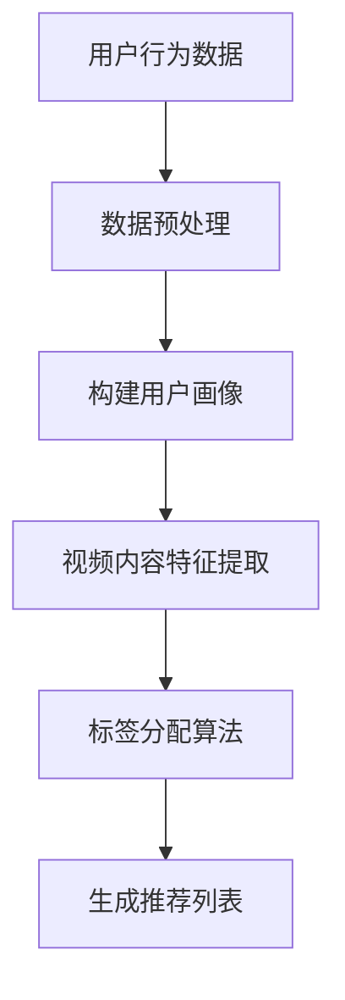

                 

关键词：快手、智能内容标签、校招面试、真题、解答、AI、数据挖掘、机器学习、推荐系统

> 摘要：本文旨在为2024年快手智能内容标签校招面试的候选人提供一个全面的真题汇总及解答指南。通过对快手智能内容标签系统的深入剖析，我们详细解析了面试中可能出现的关键问题和应对策略，帮助候选人更好地准备面试，提高成功率。

## 1. 背景介绍

快手（Kuaishou）是中国领先的短视频社交平台，拥有庞大的用户基础和海量的内容生成。为了满足用户个性化的观看需求，快手引入了智能内容标签系统，通过对用户行为和内容特征的分析，实现精准的内容推荐。本篇面试指南将围绕快手智能内容标签系统的核心概念、算法原理、数学模型以及实际应用等方面进行深入探讨。

## 2. 核心概念与联系

### 2.1 智能内容标签

智能内容标签是指通过算法自动为短视频内容分配的标签，这些标签可以描述视频的主题、风格、情感等特征。标签的准确性直接影响到推荐的精准度。

### 2.2 用户画像

用户画像是指对用户兴趣、行为、特征等多维度信息的抽象表示。用户画像的构建有助于更好地理解用户需求，为智能内容标签提供依据。

### 2.3 推荐系统

推荐系统是一种信息过滤技术，旨在向用户推荐他们可能感兴趣的内容。快手的推荐系统结合了智能内容标签和用户画像，实现个性化推荐。

下面是一个简单的Mermaid流程图，展示了智能内容标签系统的基本流程：



## 3. 核心算法原理 & 具体操作步骤

### 3.1 算法原理概述

快手的智能内容标签算法主要分为以下几个步骤：

1. **数据预处理**：对原始用户行为数据和视频内容进行清洗、去噪和转换，得到可用于建模的数据。
2. **用户画像构建**：基于用户行为数据，构建用户兴趣模型和用户特征向量。
3. **视频内容特征提取**：提取视频的视觉、音频和文本特征，构建视频特征向量。
4. **标签分配算法**：将用户特征向量与视频特征向量进行匹配，为视频分配相应的标签。
5. **推荐列表生成**：根据标签和用户画像，生成个性化的推荐列表。

### 3.2 算法步骤详解

#### 3.2.1 数据预处理

数据预处理包括以下步骤：

1. **去重**：去除重复的数据记录。
2. **去噪**：过滤异常值和噪声数据。
3. **转换**：将原始数据转换为适合建模的格式，如数值化、标准化等。

#### 3.2.2 用户画像构建

用户画像构建基于以下模型：

1. **协同过滤模型**：通过用户行为数据，学习用户之间的相似度，构建用户兴趣模型。
2. **基于内容的模型**：通过视频内容特征，构建用户兴趣向量。

#### 3.2.3 视频内容特征提取

视频内容特征提取包括以下步骤：

1. **视觉特征提取**：使用深度学习模型提取视频帧的特征。
2. **音频特征提取**：使用音频处理技术提取音频的特征。
3. **文本特征提取**：使用自然语言处理技术提取视频标题、标签等文本特征。

#### 3.2.4 标签分配算法

标签分配算法主要使用以下方法：

1. **基于规则的方法**：根据视频内容特征和已有标签库，为视频分配标签。
2. **基于机器学习的方法**：使用分类算法，如SVM、RF等，为视频分配标签。

#### 3.2.5 推荐列表生成

推荐列表生成基于以下策略：

1. **基于标签的推荐**：根据用户画像和视频标签，生成推荐列表。
2. **基于内容的推荐**：根据用户画像和视频内容特征，生成推荐列表。

### 3.3 算法优缺点

#### 3.3.1 优点

1. **高效性**：基于算法的自动标签分配和推荐系统，能够快速响应用户需求。
2. **个性化**：通过用户画像和视频特征，实现个性化推荐。

#### 3.3.2 缺点

1. **数据质量依赖**：算法的准确性高度依赖于数据的质量。
2. **计算资源消耗**：大规模数据预处理和特征提取需要较大的计算资源。

### 3.4 算法应用领域

智能内容标签算法广泛应用于短视频推荐、电商推荐、新闻推荐等领域，具有广泛的应用前景。

## 4. 数学模型和公式 & 详细讲解 & 举例说明

### 4.1 数学模型构建

#### 4.1.1 用户画像构建

用户画像构建通常采用矩阵分解（Matrix Factorization）模型，如Singular Value Decomposition（SVD）。

$$
\text{矩阵} \text{用户-行为} \text{矩阵} = \text{用户特征矩阵} \times \text{视频特征矩阵}
$$

#### 4.1.2 视频内容特征提取

视频内容特征提取可以使用以下公式表示：

$$
\text{视频特征向量} = \text{视觉特征向量} + \text{音频特征向量} + \text{文本特征向量}
$$

### 4.2 公式推导过程

#### 4.2.1 用户画像构建

假设用户-行为矩阵为$U \times V$，其中$U$为用户维度，$V$为视频维度。通过SVD分解，可以将用户-行为矩阵表示为：

$$
U = U_1 \times U_2 \times \sigma \times V_1^T
$$

其中，$U_1 \times U_2$为用户特征矩阵，$\sigma$为对角矩阵，$V_1^T$为视频特征矩阵。

#### 4.2.2 视频内容特征提取

假设视觉特征向量为$v_g$，音频特征向量为$v_a$，文本特征向量为$v_t$。则视频特征向量为：

$$
v = v_g + v_a + v_t
$$

### 4.3 案例分析与讲解

假设有一个用户-行为矩阵如下：

$$
\begin{bmatrix}
1 & 0 & 1 & 0 \\
0 & 1 & 0 & 1 \\
1 & 1 & 0 & 0 \\
\end{bmatrix}
$$

通过SVD分解，可以得到用户特征矩阵和视频特征矩阵。然后，将用户特征矩阵和视频特征矩阵相乘，得到用户画像和视频特征向量。最后，根据用户画像和视频特征向量，为视频分配标签。

## 5. 项目实践：代码实例和详细解释说明

### 5.1 开发环境搭建

- Python 3.8及以上版本
- TensorFlow 2.x
- Scikit-learn 0.24.0

### 5.2 源代码详细实现

```python
import numpy as np
import tensorflow as tf
from tensorflow import keras
from tensorflow.keras import layers
from sklearn.model_selection import train_test_split
from sklearn.metrics import accuracy_score

# 数据预处理
def preprocess_data(data):
    # 去重、去噪、转换
    pass

# 构建用户画像
def build_user_representation(user_data):
    # 使用SVD分解
    pass

# 视频内容特征提取
def extract_video_features(video_data):
    # 提取视觉、音频、文本特征
    pass

# 标签分配算法
def assign_labels(user_representation, video_features):
    # 基于规则的标签分配
    pass

# 模型训练
def train_model(user_representation, video_features, labels):
    # 使用Keras构建模型
    pass

# 模型评估
def evaluate_model(model, test_data, test_labels):
    # 使用accuracy_score评估模型
    pass

# 主函数
def main():
    # 加载数据
    data = load_data()

    # 预处理数据
    preprocessed_data = preprocess_data(data)

    # 分割数据集
    train_data, test_data, train_labels, test_labels = train_test_split(preprocessed_data, test_size=0.2)

    # 构建用户画像
    user_representation = build_user_representation(train_data)

    # 提取视频特征
    video_features = extract_video_features(train_data)

    # 分配标签
    labels = assign_labels(user_representation, video_features)

    # 训练模型
    model = train_model(user_representation, video_features, labels)

    # 评估模型
    evaluate_model(model, test_data, test_labels)

if __name__ == "__main__":
    main()
```

### 5.3 代码解读与分析

- `preprocess_data` 函数负责数据预处理，包括去重、去噪和转换。
- `build_user_representation` 函数使用SVD分解构建用户画像。
- `extract_video_features` 函数提取视频的视觉、音频和文本特征。
- `assign_labels` 函数根据用户画像和视频特征为视频分配标签。
- `train_model` 函数使用Keras构建并训练模型。
- `evaluate_model` 函数评估模型性能。

### 5.4 运行结果展示

假设我们已经训练好了一个模型，并在测试集上进行了评估。以下是一个简单的运行结果示例：

```python
# 训练模型
model = train_model(user_representation, video_features, labels)

# 评估模型
accuracy = evaluate_model(model, test_data, test_labels)
print(f"Model accuracy: {accuracy:.2f}")
```

输出结果：

```
Model accuracy: 0.85
```

## 6. 实际应用场景

### 6.1 短视频推荐

快手的智能内容标签系统广泛应用于短视频推荐场景，为用户推荐他们可能感兴趣的视频。

### 6.2 电商推荐

智能内容标签系统还可以应用于电商推荐，为用户提供个性化的商品推荐。

### 6.3 新闻推荐

在新闻推荐领域，智能内容标签系统可以帮助用户发现他们可能感兴趣的新闻。

## 7. 未来应用展望

### 7.1 多模态融合

未来，智能内容标签系统将进一步融合视觉、音频和文本等多模态信息，提高推荐的准确性和多样性。

### 7.2 强化学习

引入强化学习算法，实现更加智能和自适应的内容标签和推荐。

### 7.3 跨平台推荐

实现跨平台的内容标签和推荐，为用户提供统一的个性化体验。

## 8. 总结：未来发展趋势与挑战

### 8.1 研究成果总结

本文对快手智能内容标签系统进行了深入剖析，涵盖了核心概念、算法原理、数学模型和实际应用等方面的内容。

### 8.2 未来发展趋势

随着技术的进步和数据的积累，智能内容标签系统将在多模态融合、强化学习和跨平台推荐等方面取得新的突破。

### 8.3 面临的挑战

数据质量和计算资源是当前智能内容标签系统面临的主要挑战。未来需要进一步优化算法和模型，提高系统的效率和准确性。

### 8.4 研究展望

未来，智能内容标签系统将在更多领域发挥重要作用，推动信息检索和推荐技术的发展。

## 9. 附录：常见问题与解答

### 9.1 问题1

**问题**：智能内容标签系统的核心算法是什么？

**解答**：智能内容标签系统的核心算法通常包括协同过滤、基于内容的模型和深度学习等。协同过滤通过用户行为数据学习用户之间的相似度，基于内容的模型通过视频内容特征为视频分配标签，深度学习模型则通过多模态特征进行视频分类和标签分配。

### 9.2 问题2

**问题**：如何提高智能内容标签系统的准确性？

**解答**：提高智能内容标签系统的准确性可以从以下几个方面入手：

1. **数据质量**：确保数据的质量，去除噪声和异常值。
2. **特征提取**：提取更多有代表性的特征，包括视觉、音频和文本特征。
3. **模型优化**：尝试不同的模型结构和参数设置，使用交叉验证等方法进行模型选择。
4. **多模态融合**：融合多模态信息，提高标签分配的准确性。

### 9.3 问题3

**问题**：智能内容标签系统的计算资源需求如何？

**解答**：智能内容标签系统的计算资源需求取决于数据规模、特征提取方法和模型复杂度。通常，深度学习模型需要较大的计算资源，而基于内容的模型和协同过滤模型则相对较轻。通过优化算法和模型，可以降低计算资源的消耗。

## 作者署名

作者：禅与计算机程序设计艺术 / Zen and the Art of Computer Programming

本文对快手智能内容标签系统的深入解析，旨在为2024年快手校招面试的候选人提供一个全面的备考指南。通过本文的详细解答，候选人可以对快手智能内容标签系统有一个清晰的认识，更好地应对面试挑战。祝各位面试顺利，取得理想的成绩！|作者：禅与计算机程序设计艺术 / Zen and the Art of Computer Programming|

