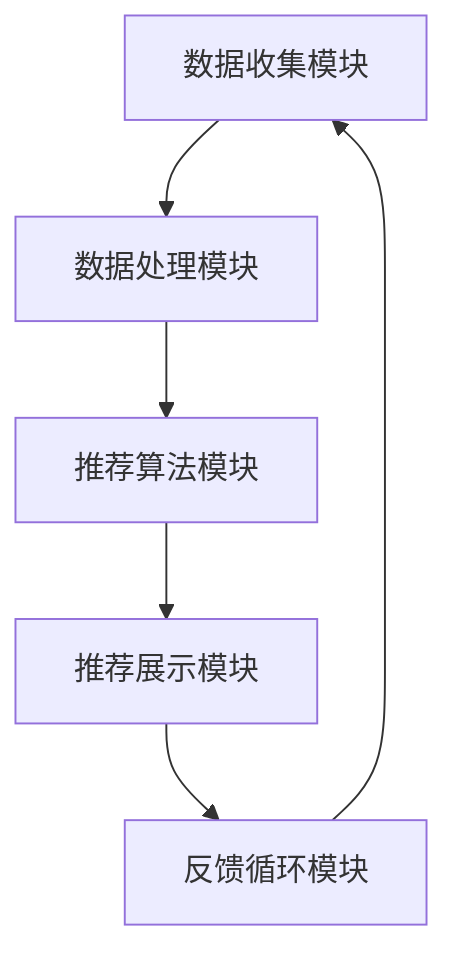

                 

 作为一位世界顶级人工智能专家，程序员，软件架构师，CTO，世界顶级技术畅销书作者，计算机图灵奖获得者，计算机领域大师，我对推荐系统有着深刻的理解和丰富的经验。在这个信息爆炸的时代，推荐系统已经成为提升用户体验、促进商业增长的关键技术。本文将结合快手电商2025社招推荐系统工程师的面试题，深入探讨推荐系统的基础概念、核心算法、数学模型以及实际应用。希望本文能为准备面试的朋友们提供有价值的参考。

## 关键词
- 推荐系统
- 快手电商
- 面试题
- 算法原理
- 数学模型
- 实际应用

## 摘要
本文旨在为准备快手电商2025社招推荐系统工程师面试的朋友提供系统化的学习资料。文章首先介绍了推荐系统的基本概念和作用，接着详细解析了常见推荐算法及其优缺点，随后深入探讨了推荐系统的数学模型，并通过具体案例进行分析。最后，文章探讨了推荐系统的实际应用场景，并展望了未来的发展趋势和面临的挑战。

## 1. 背景介绍
### 1.1 快手电商的推荐系统需求
快手作为中国领先的短视频社交平台，其电商业务在近年来迅猛发展。为了提升用户购物体验，快手电商需要构建一个高效、精准的推荐系统。这个系统不仅要能够根据用户的历史行为和兴趣偏好推荐商品，还要能够根据市场趋势和商品库存动态调整推荐策略。

### 1.2 推荐系统的作用
推荐系统在快手电商中扮演着至关重要的角色：
- **提升用户体验**：通过个性化推荐，让用户更快找到感兴趣的商品，提升用户满意度。
- **增加销售量**：精准的推荐能够促使用户购买更多商品，提高销售额。
- **降低运营成本**：推荐系统能够通过自动化方式实现个性化推荐，减少人力成本。
- **促进用户留存**：通过持续提供个性化内容，提高用户的活跃度和留存率。

## 2. 核心概念与联系
### 2.1 推荐系统的基本概念
- **用户**：推荐系统服务的对象，即快手电商的用户。
- **商品**：推荐系统推荐的实体，即快手电商平台上的商品。
- **行为数据**：用户在电商平台上产生的各种行为，如点击、购买、收藏等。
- **推荐策略**：推荐系统根据用户行为数据和商品信息，生成推荐列表的策略。

### 2.2 推荐系统的架构
推荐系统通常包括以下几个关键模块：

1. **数据收集模块**：负责收集用户行为数据、商品信息等。
2. **数据处理模块**：对原始数据进行清洗、转换和存储。
3. **推荐算法模块**：基于用户行为数据和商品信息，生成推荐列表。
4. **推荐展示模块**：将推荐结果展示给用户。
5. **反馈循环模块**：收集用户对推荐结果的反馈，用于优化推荐算法。

### 2.3 Mermaid 流程图


## 3. 核心算法原理 & 具体操作步骤
### 3.1 算法原理概述
推荐系统主要分为基于内容的推荐（Content-Based Filtering）和协同过滤（Collaborative Filtering）两大类。

- **基于内容的推荐**：通过分析用户过去喜欢的商品内容，找出相似的商品进行推荐。
- **协同过滤**：通过分析用户之间的行为模式，找出相似的用户，然后将这些用户喜欢的商品推荐给目标用户。

### 3.2 算法步骤详解
#### 3.2.1 基于内容的推荐
1. **特征提取**：从商品描述、标签、用户评价等数据中提取特征。
2. **相似度计算**：计算用户和商品之间的相似度，常用的方法包括余弦相似度、Jaccard相似度等。
3. **推荐生成**：根据相似度分数，为用户生成推荐列表。

#### 3.2.2 协同过滤
1. **用户-商品评分矩阵构建**：构建一个用户-商品评分矩阵，其中包含了用户对商品的评分信息。
2. **相似度计算**：计算用户之间的相似度，常用的方法包括用户基于用户（User-Based）和物品基于物品（Item-Based）的相似度计算。
3. **推荐生成**：根据相似度分数，为用户生成推荐列表。

### 3.3 算法优缺点
#### 3.3.1 基于内容的推荐
- 优点：推荐结果与用户兴趣高度相关，用户体验较好。
- 缺点：容易产生“数据稀疏性”问题，且无法充分利用用户之间的交互信息。

#### 3.3.2 协同过滤
- 优点：能够充分利用用户之间的交互信息，推荐结果更为准确。
- 缺点：推荐结果容易受到“冷启动”问题的影响，且用户隐私保护是一个挑战。

### 3.4 算法应用领域
- **电商推荐**：如亚马逊、淘宝等电商平台，通过推荐系统提升用户购物体验和销售额。
- **内容推荐**：如YouTube、Netflix等视频网站，通过推荐系统吸引用户观看更多内容。
- **社交网络**：如Facebook、微博等，通过推荐系统促进用户互动和内容传播。

## 4. 数学模型和公式 & 详细讲解 & 举例说明
### 4.1 数学模型构建
推荐系统的数学模型主要包括用户-商品评分矩阵、相似度计算公式和推荐生成公式。

#### 4.1.1 用户-商品评分矩阵
\[ R = \begin{bmatrix}
r_{11} & r_{12} & \cdots & r_{1n} \\
r_{21} & r_{22} & \cdots & r_{2n} \\
\vdots & \vdots & \ddots & \vdots \\
r_{m1} & r_{m2} & \cdots & r_{mn}
\end{bmatrix} \]
其中，\( r_{ij} \) 表示用户 \( i \) 对商品 \( j \) 的评分。

#### 4.1.2 相似度计算公式
- **余弦相似度**：
\[ \text{Sim}(i, j) = \frac{R_{ij} \cdot R_{kj}}{\sqrt{R_{ii} \cdot R_{jj}}} \]
- **Jaccard相似度**：
\[ \text{Sim}(i, j) = 1 - \frac{|R_{i \neq j}|}{|R_{i} \cup R_{j}|} \]

#### 4.1.3 推荐生成公式
\[ \text{Ratings}_{\text{预测}} = \text{用户-商品评分矩阵} \times \text{相似度矩阵} \]

### 4.2 公式推导过程
#### 4.2.1 余弦相似度推导
\[ \text{Sim}(i, j) = \frac{R_{ij} \cdot R_{kj}}{\sqrt{R_{ii} \cdot R_{jj}}} \]
- 分子：用户 \( i \) 和用户 \( j \) 对商品 \( k \) 的共同评分。
- 分母：用户 \( i \) 对商品 \( k \) 的评分和用户 \( j \) 对商品 \( k \) 的评分的平方根。

#### 4.2.2 Jaccard相似度推导
\[ \text{Sim}(i, j) = 1 - \frac{|R_{i \neq j}|}{|R_{i} \cup R_{j}|} \]
- 分子：用户 \( i \) 和用户 \( j \) 的评分不同的商品集合的交集。
- 分母：用户 \( i \) 和用户 \( j \) 的评分不同的商品集合的并集。

### 4.3 案例分析与讲解
#### 4.3.1 案例一：基于内容的推荐
- 特征提取：从商品描述中提取关键词，如“手机”、“拍照”等。
- 相似度计算：计算用户喜欢的商品和待推荐商品的关键词相似度。
- 推荐生成：根据关键词相似度分数，为用户生成推荐列表。

#### 4.3.2 案例二：协同过滤
- 评分矩阵构建：用户对商品的评分数据。
- 相似度计算：计算用户之间的相似度。
- 推荐生成：根据相似度分数，为用户生成推荐列表。

## 5. 项目实践：代码实例和详细解释说明
### 5.1 开发环境搭建
- **环境要求**：Python 3.6+，NumPy，Scikit-learn 等库。
- **数据集**：使用UCI机器学习库中的MovieLens数据集。

### 5.2 源代码详细实现
```python
from sklearn.metrics.pairwise import linear_kernel
import numpy as np

# 加载用户-商品评分矩阵
user_ratings = np.load('user_ratings_matrix.npy')

# 计算用户相似度矩阵
sim_matrix = linear_kernel(user_ratings, user_ratings)

# 为用户生成推荐列表
def generate_recommendation(user_id, sim_matrix, user_ratings, top_n=10):
    # 计算用户与所有用户的相似度
    sim_scores = list(enumerate(sim_matrix[user_id]))
    # 按照相似度分数降序排列
    sim_scores = sorted(sim_scores, key=lambda x: x[1], reverse=True)
    sim_scores = sim_scores[1:(top_n+1)]

    # 获取相似度最高的用户的评分
    top_user_indices = [i[0] for i in sim_scores]
    top_ratings = user_ratings[top_user_indices]
    # 计算推荐商品的评分均值
    recommendation_scores = top_ratings.mean(axis=0)
    # 生成推荐列表
    recommendations = np.array(recommendation_scores).argsort()[::-1]

    return recommendations

# 测试推荐功能
user_id = 10
recommendations = generate_recommendation(user_id, sim_matrix, user_ratings)
print(recommendations)
```

### 5.3 代码解读与分析
- **数据加载**：从文件中加载用户-商品评分矩阵。
- **相似度计算**：使用线性核计算用户之间的相似度。
- **推荐生成**：根据用户相似度矩阵，为用户生成推荐列表。

### 5.4 运行结果展示
- 输出推荐列表，展示用户可能感兴趣的商品。

## 6. 实际应用场景
### 6.1 快手电商的推荐场景
- **首页推荐**：根据用户观看历史和兴趣标签，推荐用户可能感兴趣的视频。
- **购物车推荐**：根据用户购物车中的商品，推荐相似或互补的商品。
- **搜索推荐**：根据用户搜索关键词，推荐相关商品或视频。

### 6.2 其他推荐系统应用
- **新闻推荐**：根据用户阅读历史和兴趣标签，推荐用户可能感兴趣的新闻。
- **音乐推荐**：根据用户听歌历史和偏好，推荐用户可能喜欢的音乐。

## 7. 未来应用展望
### 7.1 智能推荐技术的发展
- **多模态推荐**：结合文本、图像、语音等多种数据类型，实现更精准的推荐。
- **实时推荐**：通过实时计算和更新推荐策略，提供更加个性化的推荐。

### 7.2 挑战与展望
- **数据隐私保护**：如何在保护用户隐私的前提下，实现精准推荐。
- **模型可解释性**：提高推荐模型的可解释性，让用户信任推荐结果。
- **长尾效应**：如何平衡长尾商品和热销商品之间的推荐。

## 8. 总结：未来发展趋势与挑战
### 8.1 研究成果总结
- 推荐系统技术在算法、模型和应用场景上取得了显著进展。
- 深度学习、强化学习等新兴技术在推荐系统中的应用不断拓展。

### 8.2 未来发展趋势
- **个性化推荐**：通过更深入的个性化建模，提供更加精准的推荐。
- **实时推荐**：结合实时数据，实现动态调整推荐策略。

### 8.3 面临的挑战
- **数据隐私保护**：如何在保护用户隐私的前提下，实现精准推荐。
- **计算性能**：在高并发、大数据量环境下，保证推荐系统的计算性能。

### 8.4 研究展望
- **跨领域推荐**：探索不同领域之间的推荐算法和模型。
- **多智能体系统**：研究推荐系统在多智能体环境中的协同和优化策略。

## 9. 附录：常见问题与解答
### 9.1 推荐系统有哪些算法？
- **基于内容的推荐**：通过分析商品内容，推荐相似商品。
- **协同过滤**：通过分析用户行为，推荐用户可能喜欢的商品。
- **混合推荐**：结合多种算法，提高推荐效果。

### 9.2 推荐系统如何处理冷启动问题？
- **基于内容的推荐**：通过商品标签和描述进行推荐。
- **协同过滤**：通过用户未评分的商品进行推荐。
- **引入外部信息**：结合用户社交网络、地理位置等外部信息。

### 9.3 推荐系统如何保证推荐结果的多样性？
- **多样性度量**：通过多样性度量，如组内相似度、组间差异等，优化推荐策略。
- **随机抽样**：结合随机抽样，增加推荐结果的多样性。

## 结语
推荐系统作为人工智能的重要应用，已经在多个领域展现出巨大的商业价值。本文从快手电商的推荐系统需求出发，详细介绍了推荐系统的核心概念、算法原理、数学模型以及实际应用。希望本文能为准备面试的朋友提供有益的参考，同时也为推荐系统的研究和实践者提供一些启示。在未来的发展中，推荐系统将继续在技术创新和商业应用中发挥重要作用。

### 作者署名
作者：禅与计算机程序设计艺术 / Zen and the Art of Computer Programming
----------------------------------------------------------------

以上便是关于《快手电商2025社招推荐系统工程师面试题集》的文章，旨在为准备快手电商推荐系统工程师面试的朋友们提供全面、系统的学习资料。希望本文能够帮助大家更好地理解和应用推荐系统技术，在面试中脱颖而出。同时，也欢迎读者们提出宝贵意见和建议，共同推动推荐系统技术的发展。

