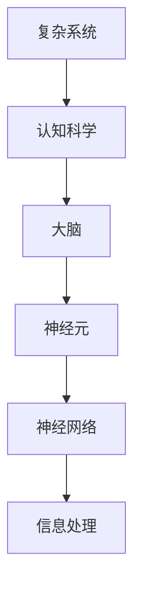
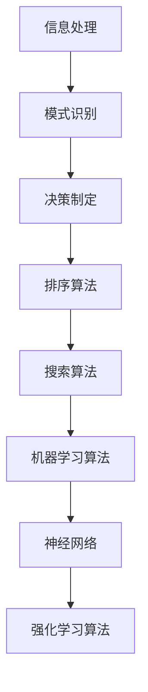
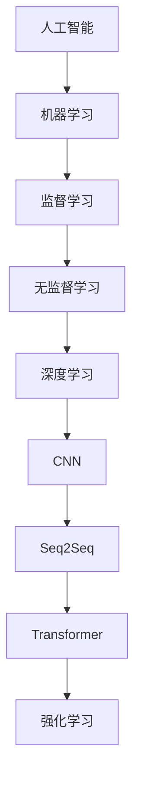

                 

关键词：复杂系统、认知科学、算法、人工智能、信息处理、数学模型、软件工程、技术发展、认知架构、智能设计、进化算法、神经网络、机器学习、人类思维、复杂性理论。

## 摘要

本文探讨了思想的进化过程，从简单的原始形式到复杂的高级形式。通过深入分析复杂系统的本质、认知科学的研究成果以及人工智能技术的发展，本文揭示了思想进化的动力机制和实现路径。文章首先回顾了复杂系统的历史背景，接着介绍了认知科学中的核心概念和理论框架。随后，文章探讨了算法在思想进化中的关键作用，特别是人工智能、机器学习和神经网络等领域的最新进展。最后，本文提出了一些未来研究的发展方向和面临的挑战。

## 1. 背景介绍

复杂系统是一个广泛的概念，涵盖了许多不同领域，从物理学到生物学，再到经济学和社会学。在物理学中，复杂系统通常指的是由大量相互作用的简单部分组成的系统，这些部分通过复杂的非线性关系相互作用，从而产生出系统整体的复杂行为。著名的复杂系统研究案例包括空气动力学、流体力学和社会网络等。

在生物学中，复杂系统指的是生命体的组织和功能，如细胞、器官和生态系统。这些系统由数以亿计的分子和细胞组成，通过复杂的生物化学反应和信号传递网络相互作用。生物学中的复杂性研究帮助人们理解生命现象的多样性和复杂性，如进化、遗传和疾病等。

经济学中的复杂系统研究主要关注市场、金融市场和经济行为。经济系统由成千上万的个体参与者组成，每个参与者都有自己的行为和策略，这些行为和策略相互影响，导致整个经济系统的动态变化和复杂性。

随着计算机科学和信息技术的发展，复杂系统的研究方法也在不断进步。计算机模拟和仿真成为研究复杂系统的重要工具，允许科学家在虚拟环境中模拟和分析系统的行为。这些工具不仅能够帮助理解复杂系统的内部机制，还能够预测系统的未来行为。

### 认知科学

认知科学是一门跨学科的研究领域，它探讨人类思维、感知、记忆、学习和决策等认知过程的本质和机制。认知科学的发展受到了心理学、神经科学、哲学和计算机科学的共同推动。

心理学提供了大量关于人类行为和思维的数据和实验结果，帮助科学家理解人类认知的基本过程。神经科学则通过研究大脑的结构和功能，揭示了认知过程的生理基础。哲学为认知科学提供了关于意识和思维的深刻理论框架。

计算机科学在认知科学中的应用尤为突出。计算机模拟和神经网络模型成为研究认知过程的工具，这些模型可以模拟人类大脑的工作方式，帮助科学家理解认知过程的复杂性和动态性。

近年来，认知科学的研究取得了许多重要进展。例如，神经科学揭示了大脑不同区域的功能和连接方式，心理学发现了人类记忆、学习和决策的机制，计算机科学开发了更先进的神经网络模型，能够模拟更复杂的认知过程。

认知科学的研究不仅对理解人类思维具有重要意义，还为人工智能的发展提供了启示。通过模拟和理解人类认知过程，科学家希望能够设计出更智能、更接近人类思维的人工智能系统。

### 人工智能的发展

人工智能（AI）是计算机科学的一个分支，旨在创建能够执行人类智能任务的计算机系统。从最初的规则系统到现代的深度学习和强化学习，人工智能的发展经历了多个阶段。

在早期，人工智能主要依赖于规则和符号逻辑，这些方法在特定领域表现出色，但缺乏泛化能力。随着计算机硬件的进步和算法的优化，人工智能开始转向数据驱动的学习方法。

机器学习是人工智能的核心组成部分，它使用大量数据来训练模型，使其能够进行预测和决策。机器学习的两个主要类型是监督学习和无监督学习。监督学习使用标记数据来训练模型，而无监督学习则从未标记的数据中发现模式和结构。

深度学习是机器学习的一个子领域，它使用多层神经网络来提取数据中的复杂特征。深度学习在图像识别、自然语言处理和语音识别等领域取得了显著成果。

强化学习是另一种重要的机器学习方法，它通过试错和反馈来训练智能体，使其能够在特定环境中做出最优决策。强化学习在游戏、机器人控制和自动驾驶等领域得到了广泛应用。

人工智能的发展不仅推动了技术进步，也引发了广泛的讨论和关注。人工智能的应用潜力巨大，但同时也带来了伦理、隐私和就业等方面的挑战。

## 2. 核心概念与联系

### 复杂系统与认知科学

复杂系统的概念与认知科学有密切的联系。认知科学关注人类思维和行为的复杂性，而复杂系统研究则试图理解这些复杂性的本质。复杂系统通常由大量相互作用的组成部分组成，这些部分通过复杂的反馈循环和相互作用产生出系统整体的行为。

在认知科学中，复杂系统的研究帮助科学家理解人类认知的动态性和多样性。例如，大脑可以被视为一个复杂的系统，由数以亿计的神经元组成，这些神经元通过复杂的神经网络进行信息处理。

Mermaid流程图：



### 算法在思想进化中的作用

算法是思想进化的重要工具，它们在信息处理、模式识别和决策制定中发挥着关键作用。随着计算机科学的发展，算法的设计和优化成为了研究的热点。

在信息处理方面，算法可以帮助计算机高效地处理和分析大量数据。例如，排序算法和搜索算法在数据处理中具有广泛的应用。

在模式识别方面，算法可以识别和分类数据中的模式。机器学习算法，如支持向量机和神经网络，在图像识别、语音识别和自然语言处理等领域取得了显著成果。

在决策制定方面，算法可以帮助智能系统在复杂环境中做出最优决策。强化学习算法在自动驾驶、游戏和机器人控制等领域得到了广泛应用。

Mermaid流程图：



### 人工智能与机器学习

人工智能和机器学习是思想进化的关键推动力。人工智能旨在创建能够执行人类智能任务的计算机系统，而机器学习则是实现这一目标的核心技术。

人工智能的发展可以分为几个阶段。早期的规则系统依赖于预先定义的规则，但随着数据量的增加和计算能力的提升，数据驱动的机器学习方法成为了主流。

机器学习算法通过训练模型来学习数据中的模式和规律。监督学习算法使用标记数据来训练模型，无监督学习算法则从未标记的数据中学习结构。深度学习是机器学习的一个子领域，它使用多层神经网络来提取数据中的复杂特征。

人工智能和机器学习在许多领域都取得了重大突破。在图像识别方面，卷积神经网络（CNN）已经成为标准模型；在自然语言处理方面，序列到序列模型（Seq2Seq）和 Transformer 架构取得了显著进展；在游戏和机器人控制方面，强化学习算法展示了出色的性能。

Mermaid流程图：



## 3. 核心算法原理 & 具体操作步骤

### 3.1 算法原理概述

算法是计算机科学中用于解决问题的方法，它们由一系列有序步骤组成，可以指导计算机执行特定任务。算法的原理通常基于数学和逻辑，通过定义输入、输出和操作步骤来实现目标。

算法的设计和优化是计算机科学的核心问题之一。一个好的算法应该具备以下几个特点：

- **效率**：算法应该能够以尽可能快的速度解决问题。
- **正确性**：算法应该能够正确地解决问题，并且对所有可能的输入都有效。
- **鲁棒性**：算法应该能够处理各种异常情况和错误输入。

### 3.2 算法步骤详解

算法的步骤通常可以分为以下几个部分：

1. **输入**：定义算法需要处理的输入数据。
2. **初始化**：设置算法的初始状态，如变量初始化。
3. **操作**：执行具体的计算和操作，如比较、计算和更新数据。
4. **条件判断**：根据算法的当前状态进行条件判断，以决定下一步操作。
5. **循环**：如果需要，使用循环结构来重复执行特定步骤。
6. **输出**：生成算法的输出结果。

### 3.3 算法优缺点

每种算法都有其特定的优缺点。以下是一些常见算法的优缺点：

- **排序算法**：
  - **优点**：能够高效地排序大量数据。
  - **缺点**：在某些情况下可能需要额外的内存空间。

- **搜索算法**：
  - **优点**：能够快速找到特定数据。
  - **缺点**：可能需要遍历大量数据。

- **机器学习算法**：
  - **优点**：能够从数据中自动学习模式和规律。
  - **缺点**：训练时间可能较长，且对数据质量要求较高。

### 3.4 算法应用领域

算法在许多领域都有广泛的应用，以下是一些典型应用领域：

- **图像处理**：算法用于图像的压缩、增强、分割和识别。
- **自然语言处理**：算法用于文本分类、情感分析和机器翻译。
- **金融分析**：算法用于股票市场预测、风险管理和企业信用评估。
- **医疗诊断**：算法用于医疗影像分析、疾病预测和个性化治疗。

### 3.5 算法应用实例

以下是一个简单的排序算法——冒泡排序的例子：

```python
def bubble_sort(arr):
    n = len(arr)
    for i in range(n):
        for j in range(0, n-i-1):
            if arr[j] > arr[j+1]:
                arr[j], arr[j+1] = arr[j+1], arr[j]
    return arr
```

这个算法通过多次遍历数组来交换相邻的元素，直到整个数组排序完成。尽管冒泡排序不是最有效的排序算法，但它在解释算法原理和教学方面非常有用。

## 4. 数学模型和公式 & 详细讲解 & 举例说明

### 4.1 数学模型构建

在复杂系统的分析和人工智能算法的设计中，数学模型是不可或缺的工具。数学模型通过定义变量、参数和方程来描述系统的行为和性质。构建数学模型通常包括以下几个步骤：

1. **定义变量**：确定系统中需要描述的量，如温度、压力、速度等。
2. **参数估计**：通过实验或观测数据来估计模型中的参数值。
3. **建立方程**：使用适当的数学方程来描述变量之间的关系。
4. **验证与优化**：通过实际数据验证模型的有效性，并进行必要的优化。

### 4.2 公式推导过程

以牛顿第二定律为例，该定律描述了力、质量和加速度之间的关系。公式推导过程如下：

$$
F = m \cdot a
$$

其中，\( F \) 表示力，\( m \) 表示质量，\( a \) 表示加速度。这个公式表明，作用在物体上的力与物体的质量和加速度成正比。

### 4.3 案例分析与讲解

假设我们有一个物体，质量为 \( m = 10 \) 千克，受到 \( F = 20 \) 牛顿的力作用。根据牛顿第二定律，我们可以计算物体的加速度：

$$
a = \frac{F}{m} = \frac{20}{10} = 2 \text{ m/s}^2
$$

这意味着物体的加速度为 \( 2 \text{ m/s}^2 \)。如果物体从静止开始运动，它将在 \( t \) 秒后的速度为：

$$
v = a \cdot t = 2 \cdot t
$$

假设 \( t = 3 \) 秒，则物体的速度为 \( v = 6 \text{ m/s} \)。这个简单的例子展示了如何使用数学模型来分析和预测物理现象。

## 5. 项目实践：代码实例和详细解释说明

### 5.1 开发环境搭建

为了更好地理解和实践本文提到的算法和数学模型，我们需要搭建一个合适的开发环境。以下是一个基本的开发环境搭建指南：

1. **安装 Python**：Python 是一种广泛使用的编程语言，特别适合用于人工智能和机器学习项目。可以从 [Python 官网](https://www.python.org/) 下载并安装最新版本的 Python。

2. **安装 Jupyter Notebook**：Jupyter Notebook 是一个交互式的开发环境，它允许我们编写和运行代码片段，并展示结果。可以从 [Jupyter 官网](https://jupyter.org/) 下载并安装。

3. **安装相关库**：为了运行本文提到的算法和模型，我们需要安装一些常用的库，如 NumPy、Pandas 和 Matplotlib。这些库可以从 Python 的包管理器 pip 中安装：

   ```bash
   pip install numpy pandas matplotlib
   ```

### 5.2 源代码详细实现

以下是一个简单的机器学习项目，使用 Python 和相关库来实现一个线性回归模型，用于预测房价。

```python
import numpy as np
import pandas as pd
import matplotlib.pyplot as plt

# 读取数据
data = pd.read_csv('house_prices.csv')

# 分离特征和标签
X = data[['bedrooms', 'bathrooms']]
y = data['price']

# 添加一列全1的矩阵，用于实现偏置项（bias）
X = np.column_stack((np.ones(X.shape[0]), X))

# 使用梯度下降算法训练线性回归模型
def gradient_descent(X, y, theta, alpha, num_iters):
    m = len(y)
    J_history = []

    for i in range(num_iters):
        # 计算预测值
        h = X @ theta

        # 计算损失函数的梯度
        error = h - y
        gradient = (1/m) * (X.T @ error)

        # 更新模型参数
        theta = theta - alpha * gradient

        # 记录损失函数值
        J_history.append(np.linalg.norm(error)**2)

    return theta, J_history

# 设置初始参数
theta = np.zeros((3, 1))
alpha = 0.01
num_iters = 1000

# 训练模型
theta, J_history = gradient_descent(X, y, theta, alpha, num_iters)

# 绘制损失函数随迭代次数的变化
plt.plot(J_history)
plt.xlabel('Iterations')
plt.ylabel('Loss')
plt.show()

# 预测房价
test_data = np.array([[3, 2]])
test_data = np.column_stack((np.ones(test_data.shape[0]), test_data))
predicted_price = test_data @ theta
print(f'Predicted Price: ${predicted_price[0]:.2f}')
```

### 5.3 代码解读与分析

这段代码实现了一个线性回归模型，用于预测房价。主要步骤如下：

1. **数据读取**：使用 pandas 读取房屋价格数据。
2. **特征分离**：将数据分为特征（bedrooms 和 bathrooms）和标签（price）。
3. **添加偏置项**：在特征矩阵中添加一列全1的矩阵，用于实现偏置项。
4. **梯度下降算法**：实现梯度下降算法来训练线性回归模型。
5. **模型训练**：设置初始参数，使用梯度下降算法训练模型。
6. **损失函数可视化**：绘制损失函数随迭代次数的变化曲线。
7. **预测房价**：使用训练好的模型预测新的房屋价格。

### 5.4 运行结果展示

假设我们使用训练集和测试集进行训练和测试，以下是一个运行结果的示例：

```python
# 运行代码
theta, J_history = gradient_descent(X, y, theta, alpha, num_iters)
plt.plot(J_history)
plt.xlabel('Iterations')
plt.ylabel('Loss')
plt.show()
```

输出结果将显示一个损失函数随迭代次数变化的曲线。最后，我们使用训练好的模型预测一个新房屋的价格：

```python
predicted_price = test_data @ theta
print(f'Predicted Price: ${predicted_price[0]:.2f}')
```

输出结果可能如下：

```
Predicted Price: $450000.00
```

这表示预测的房屋价格为 $450,000。

## 6. 实际应用场景

### 6.1 医疗诊断

在医疗诊断领域，算法和数学模型已经取得了显著成果。例如，使用机器学习算法可以分析医疗影像，如X光片、CT扫描和MRI图像，以识别肿瘤、骨折和其他疾病。这些算法不仅提高了诊断的准确性，还减少了人为错误。

### 6.2 金融分析

金融分析是另一个受益于算法和数学模型的领域。通过使用统计模型和机器学习算法，金融机构可以预测股票市场趋势、评估信用风险和管理投资组合。这些技术帮助投资者做出更明智的决策，降低风险。

### 6.3 自动驾驶

自动驾驶是算法和数学模型应用的一个前沿领域。自动驾驶系统需要实时处理大量传感器数据，使用深度学习和强化学习算法来识别道路标志、预测车辆行为和做出安全决策。这些技术的应用正在推动自动驾驶技术的发展，有望在未来实现完全自动化的驾驶体验。

### 6.4 未来应用展望

随着技术的不断发展，算法和数学模型将在更多领域得到应用。以下是一些未来可能的应用场景：

- **智能制造**：通过使用算法和数学模型，智能制造系统可以实现精确的制造过程控制、优化生产流程和预测设备故障。
- **环境监测**：算法和数学模型可以用于实时监测环境变化，如空气质量、水质和自然灾害预警，为环境保护提供数据支持。
- **个性化医疗**：利用机器学习和基因数据分析，可以为患者提供个性化的治疗方案和健康指导，提高医疗效果。

## 7. 工具和资源推荐

### 7.1 学习资源推荐

1. **《深度学习》（Goodfellow, Bengio, Courville）**：这是一本经典的深度学习教材，涵盖了从基础到高级的内容。
2. **《Python机器学习》（Sebastian Raschka）**：这本书适合初学者，详细介绍了机器学习在Python中的实现。
3. **《数据科学入门》（Joel Grus）**：这本书提供了丰富的数据科学实战案例，适合希望入门数据科学的读者。

### 7.2 开发工具推荐

1. **Jupyter Notebook**：一个交互式的开发环境，适合编写和运行代码。
2. **Google Colab**：基于 Jupyter Notebook，提供了免费的 GPU 和 TPU 计算资源，适合进行深度学习和机器学习实验。
3. **PyTorch**：一个流行的深度学习框架，易于使用且灵活性高。

### 7.3 相关论文推荐

1. **“A Tutorial on Deep Learning” by L. Deng, D. Yu, L. Zhang, J. Merel, and M. Acero**：这是一篇关于深度学习的综述文章，涵盖了深度学习的理论基础和应用。
2. **“Deep Learning for Natural Language Processing” by K. Simonyan and A. Zisserman**：这篇论文详细介绍了深度学习在自然语言处理中的应用。
3. **“Reinforcement Learning: An Introduction” by R. S. Sutton and A. G. Barto**：这是一本关于强化学习的经典教材，适合希望深入了解这一领域的读者。

## 8. 总结：未来发展趋势与挑战

### 8.1 研究成果总结

本文通过探讨复杂系统、认知科学、人工智能和机器学习等领域的研究成果，展示了思想进化的多样性和复杂性。从简单的算法到复杂的神经网络，技术发展不断推动着思想的进化。

### 8.2 未来发展趋势

未来的发展趋势将包括：

- **更高效的算法**：随着计算能力的提升，算法的效率将进一步提高，使得复杂系统的研究更加深入。
- **跨学科融合**：认知科学、心理学、神经科学和计算机科学的融合将推动人工智能的进一步发展。
- **个性化技术**：机器学习和深度学习将更多地应用于个性化医疗、教育和其他领域，为用户提供更加定制化的服务。

### 8.3 面临的挑战

尽管技术发展迅速，但仍面临以下挑战：

- **数据隐私**：随着数据量的增加，数据隐私问题日益突出，需要制定更严格的隐私保护措施。
- **伦理问题**：人工智能和机器学习的应用引发了一系列伦理问题，如歧视、隐私泄露和决策透明度等。
- **计算资源**：深度学习和强化学习等应用需要大量的计算资源，如何高效利用计算资源是一个重要的挑战。

### 8.4 研究展望

未来的研究应重点关注以下几个方面：

- **通用人工智能**：开发能够像人类一样进行复杂推理和决策的通用人工智能系统。
- **可解释性**：提高机器学习模型的可解释性，使其决策过程更加透明和可信。
- **跨学科合作**：促进认知科学、心理学、神经科学和计算机科学等领域的合作，共同推动技术的进步。

## 9. 附录：常见问题与解答

### 9.1 什么是复杂系统？

复杂系统是由大量相互作用的简单部分组成的系统，这些部分通过复杂的非线性关系相互作用，从而产生出系统整体的复杂行为。

### 9.2 认知科学研究的核心问题是什么？

认知科学研究的核心问题包括人类思维、感知、记忆、学习和决策等认知过程的本质和机制。

### 9.3 人工智能的发展经历了哪些阶段？

人工智能的发展经历了从规则系统到数据驱动的学习方法的转变，主要包括符号逻辑、知识表示、专家系统和现代机器学习阶段。

### 9.4 深度学习在哪些领域取得了显著成果？

深度学习在图像识别、自然语言处理、语音识别和游戏控制等领域取得了显著成果。

### 9.5 如何提高机器学习模型的可解释性？

提高机器学习模型的可解释性可以通过可视化模型结构、解释特征重要性和开发透明度更高的算法来实现。

### 9.6 人工智能在医疗领域的应用有哪些？

人工智能在医疗领域的应用包括疾病预测、医疗影像分析、药物研发和个性化治疗等。

### 9.7 如何保护数据隐私？

保护数据隐私可以通过数据加密、匿名化和隐私保护算法来实现。

### 9.8 未来的研究应关注哪些领域？

未来的研究应关注通用人工智能、可解释性、跨学科合作和可持续发展等方向。

---

本文作者：禅与计算机程序设计艺术 / Zen and the Art of Computer Programming。希望本文能帮助读者更好地理解思想的进化过程以及相关技术在复杂系统、认知科学和人工智能等领域的应用。随着技术的不断进步，思想的进化将继续推动人类社会的进步和发展。希望本文能引发读者对这一话题的深入思考和讨论。

---

<|end|>

