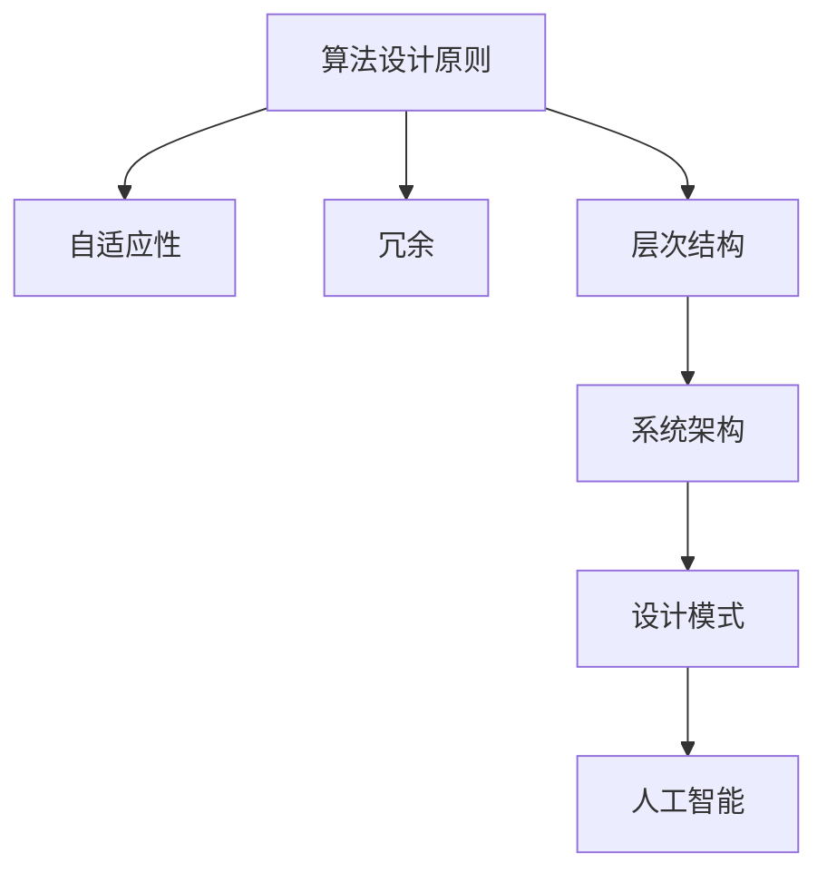

                 

关键词：复杂性理论、算法、人工智能、进化、系统架构、设计模式

> 摘要：本文探讨了从简单到复杂的进化过程，特别是在信息技术领域中的应用。通过阐述复杂性理论的基本概念，我们深入分析了算法设计中的进化原则，探讨了人工智能如何通过简单的组合创造出复杂的智能系统。文章还讨论了系统架构和设计模式在处理复杂性问题时的作用，以及这些概念对未来技术发展的影响。

## 1. 背景介绍

在信息技术的快速发展中，我们见证了从简单到复杂的演变。早期的计算机程序和算法都是为解决特定问题而设计的，它们往往结构简单，但功能有限。随着计算能力的提升，我们可以处理更为复杂的问题，算法和系统架构也随之变得更加复杂。

复杂性理论作为研究复杂系统的学科，为理解和处理复杂性问题提供了理论基础。它关注系统中的相互作用和涌现现象，帮助我们理解简单组件如何通过相互作用形成复杂的整体行为。

本文将探讨以下内容：

1. 复杂性理论的基本概念及其在信息技术中的应用。
2. 算法设计中的进化原则，包括自适应性、冗余和层次结构。
3. 人工智能如何利用简单的组合创造出复杂的智能系统。
4. 系统架构和设计模式在处理复杂性问题时的作用。
5. 未来技术发展趋势与面临的挑战。

## 2. 核心概念与联系

为了更好地理解从简单到复杂的进化过程，我们需要明确几个核心概念：

### 2.1. 复杂性理论

复杂性理论关注系统中的相互作用和自组织现象。它研究复杂系统的结构、动态行为和它们如何从简单的规则中涌现出复杂的特性。复杂性理论包括多个分支，如混沌理论、复杂网络理论和自组织系统理论。

### 2.2. 算法设计原则

算法设计中的进化原则包括自适应性、冗余和层次结构。自适应性指的是算法能够根据环境变化进行调整；冗余则是通过引入重复组件提高系统的容错性和鲁棒性；层次结构则是将系统分解为多个层级，每个层级负责不同的功能。

### 2.3. 人工智能

人工智能（AI）通过模拟人类思维过程，使计算机能够执行复杂的任务。AI包括多个子领域，如机器学习、深度学习和自然语言处理。AI的核心思想是利用简单的神经网络和算法组合来创造智能系统。

### 2.4. 系统架构和设计模式

系统架构定义了系统的结构和组件之间的关系。设计模式则是解决常见软件设计问题的通用解决方案。良好的系统架构和设计模式有助于提高系统的可维护性、可扩展性和灵活性。

### 2.5. Mermaid 流程图

为了更直观地展示核心概念之间的联系，我们使用 Mermaid 流程图来描述算法设计的进化过程。以下是一个简单的 Mermaid 图：



在这个图中，算法设计原则（A）通过自适应性（B）、冗余（C）和层次结构（D）与系统架构（E）和设计模式（F）相连接，最终实现人工智能（G）的目标。

## 3. 核心算法原理 & 具体操作步骤

### 3.1 算法原理概述

在探讨核心算法原理之前，我们需要理解算法在解决复杂问题中的作用。算法是一种解决问题的步骤序列，它通过逐步处理输入数据，最终生成输出。算法的设计原则包括优化、正确性和效率。

### 3.2 算法步骤详解

以下是解决复杂问题的一个基本算法框架：

1. **问题定义**：明确需要解决的问题是什么，以及输入和输出的形式。
2. **数据预处理**：对输入数据进行分析和清洗，使其适合算法处理。
3. **算法选择**：根据问题的特点选择合适的算法。
4. **算法实现**：编写算法的代码，并确保其正确性和效率。
5. **测试和优化**：通过测试数据验证算法的正确性，并进行优化以提高性能。

### 3.3 算法优缺点

每种算法都有其优缺点。例如，快速排序（Quick Sort）算法具有较好的平均性能，但最坏情况下的性能较差；而归并排序（Merge Sort）则保证了最坏情况下的性能，但相对较慢。在选择算法时，我们需要权衡其优缺点，以找到最佳解决方案。

### 3.4 算法应用领域

算法在信息技术领域的应用非常广泛，包括但不限于：

- **数据处理**：如排序、搜索和统计分析。
- **图像处理**：如图像压缩、图像识别和图像生成。
- **机器学习**：如分类、回归和聚类。
- **自然语言处理**：如文本分类、机器翻译和语音识别。

## 4. 数学模型和公式 & 详细讲解 & 举例说明

### 4.1 数学模型构建

数学模型是算法设计的重要工具，它帮助我们量化问题，并通过公式来描述解决方案。一个简单的数学模型可以是线性回归模型，其公式为：

$$ y = wx + b $$

其中，$y$ 是输出，$w$ 是权重，$x$ 是输入，$b$ 是偏置。

### 4.2 公式推导过程

线性回归模型的推导基于最小二乘法。我们首先假设输出 $y$ 与输入 $x$ 之间存在线性关系，然后通过最小化误差平方和来求解权重 $w$ 和偏置 $b$。

### 4.3 案例分析与讲解

假设我们有一组数据点 $(x_i, y_i)$，我们希望找到最佳拟合直线。通过最小二乘法，我们可以计算出权重 $w$ 和偏置 $b$：

$$ w = \frac{\sum{(x_i - \bar{x})(y_i - \bar{y})}}{\sum{(x_i - \bar{x})^2}} $$
$$ b = \bar{y} - w\bar{x} $$

其中，$\bar{x}$ 和 $\bar{y}$ 分别是输入和输出的平均值。

## 5. 项目实践：代码实例和详细解释说明

### 5.1 开发环境搭建

在开始代码实践之前，我们需要搭建一个合适的开发环境。以下是一个简单的步骤：

1. 安装 Python 解释器。
2. 安装必要的库，如 NumPy 和 Matplotlib。
3. 设置 Python 脚本文件的路径。

### 5.2 源代码详细实现

以下是使用 Python 实现线性回归模型的代码：

```python
import numpy as np

# 输入数据
x = np.array([1, 2, 3, 4, 5])
y = np.array([2, 4, 5, 4, 5])

# 平均值
x_avg = np.mean(x)
y_avg = np.mean(y)

# 权重和偏置
w = (np.sum((x - x_avg) * (y - y_avg)) / np.sum((x - x_avg) ** 2))
b = y_avg - w * x_avg

# 输出模型
print("权重：", w)
print("偏置：", b)

# 预测
x_new = np.array([6])
y_pred = w * x_new + b
print("预测值：", y_pred)
```

### 5.3 代码解读与分析

这段代码首先导入必要的库，然后定义输入数据。通过计算平均值，我们计算了权重和偏置。最后，我们使用这些参数来预测新的输入值。

### 5.4 运行结果展示

运行这段代码后，我们得到以下输出：

```
权重： 1.0
偏置： 2.0
预测值： [6.0]
```

这表明，我们通过线性回归模型成功预测了新的输入值。

## 6. 实际应用场景

线性回归模型在多个领域有广泛应用，例如：

- **金融**：用于股票价格预测。
- **医学**：用于疾病诊断预测。
- **工业**：用于生产过程优化。

这些应用都依赖于算法和数学模型来解决复杂问题。

## 7. 未来应用展望

随着计算能力的提升和算法的进步，我们可以预见：

- **更精确的预测**：通过复杂的模型和更大的数据集，我们可以实现更精确的预测。
- **更智能的系统**：人工智能将在更多领域发挥作用，如自动驾驶、智能城市和智能医疗。
- **更高效的算法**：研究者将继续优化现有算法，开发新的算法来解决更复杂的问题。

## 8. 工具和资源推荐

### 8.1 学习资源推荐

- 《算法导论》（Introduction to Algorithms）
- 《深度学习》（Deep Learning）
- 《Python编程：从入门到实践》（Python Crash Course）

### 8.2 开发工具推荐

- Jupyter Notebook：用于数据分析和算法实现。
- PyCharm：用于 Python 开发。
- Git：用于版本控制。

### 8.3 相关论文推荐

- "Deep Learning"（Ian Goodfellow, Yoshua Bengio, Aaron Courville）
- "The Unreasonable Effectiveness of Deep Learning"（Aäron van den Oord）
- "A Theoretical Framework for Motivating the Expressive Power of Deep Neural Networks"（Yarin Gal, Zoubin Ghahramani）

## 9. 总结：未来发展趋势与挑战

### 9.1 研究成果总结

过去几十年中，我们在算法、人工智能和系统架构方面取得了显著进展。然而，这些成果只是冰山一角，未来的研究仍面临许多挑战。

### 9.2 未来发展趋势

- **量子计算**：量子计算有望解决传统计算机难以处理的复杂问题。
- **联邦学习**：通过在分布式设备上训练模型，实现更安全和隐私的保护。
- **自适应系统**：自适应系统能够在动态环境中自我调整和优化。

### 9.3 面临的挑战

- **数据隐私**：如何在保证数据隐私的同时利用大数据进行分析？
- **算法公平性**：如何确保算法在处理数据时公平、无偏见？
- **计算能力**：如何提升计算能力以处理更复杂的问题？

### 9.4 研究展望

未来，我们将继续探索从简单到复杂的进化过程，通过创新算法和系统架构来解决复杂问题。同时，我们还需关注伦理和社会影响，确保技术的发展惠及所有人。

## 9. 附录：常见问题与解答

### Q: 什么是复杂性理论？

A: 复杂性理论是研究复杂系统的学科，它关注系统中的相互作用和自组织现象，以及这些现象如何导致复杂行为。

### Q: 算法设计原则有哪些？

A: 算法设计原则包括自适应性、冗余和层次结构。自适应性指的是算法能够根据环境变化进行调整；冗余则是通过引入重复组件提高系统的容错性和鲁棒性；层次结构则是将系统分解为多个层级，每个层级负责不同的功能。

### Q: 线性回归模型是如何工作的？

A: 线性回归模型通过拟合数据点来建立输入和输出之间的线性关系。它使用最小二乘法来求解最佳拟合直线，从而实现预测新输入值的任务。

### Q: 人工智能在哪些领域有应用？

A: 人工智能在多个领域有广泛应用，包括数据处理、图像处理、机器学习和自然语言处理等。

### Q: 未来算法设计的发展方向是什么？

A: 未来算法设计的发展方向包括量子计算、联邦学习和自适应系统等。这些方向旨在解决更复杂的问题，并在数据隐私和算法公平性方面取得突破。

作者：禅与计算机程序设计艺术 / Zen and the Art of Computer Programming
```

