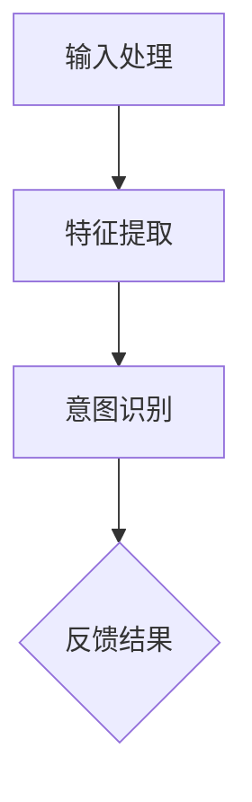

                 

关键词：意图理解，自然语言处理，对话系统，用户交互，人工智能，CUI（计算机用户界面）

本文将探讨意图理解在计算机用户界面（CUI）中的应用。随着人工智能和自然语言处理技术的不断进步，CUI已经成为现代软件和系统的重要组成部分。意图理解是实现有效人机交互的关键，它帮助计算机准确地理解用户的输入，从而提供更加智能和个性化的服务。本文将从背景介绍、核心概念与联系、核心算法原理、数学模型和公式、项目实践、实际应用场景、工具和资源推荐、总结以及未来发展趋势与挑战等方面进行详细阐述。

## 1. 背景介绍

计算机用户界面（CUI）是计算机与用户之间的交互界面，它使计算机能够接收用户的指令并进行相应的操作。传统的CUI主要以命令行界面（CLI）和图形用户界面（GUI）为主。CLI通过命令行输入和输出实现交互，而GUI则通过图形界面和鼠标点击操作实现交互。然而，随着人工智能和自然语言处理技术的发展，CUI逐渐向更加智能化和自然化的方向演进。

在人工智能和自然语言处理领域，意图理解（Intent Recognition）是一个重要的研究方向。意图理解是指从用户的输入中识别出其意图或目的，从而为用户提供相应的服务。在CUI中，意图理解能够帮助计算机更好地理解用户的需求，从而提供更加智能化和个性化的交互体验。

## 2. 核心概念与联系

### 2.1. 意图理解的概念

意图理解是指从用户的输入中识别出其意图或目的。在CUI中，意图理解是实现智能交互的关键。例如，当用户输入“我想查看明天的天气”时，计算机需要理解用户的意图是查询天气信息，而不是进行其他操作。

### 2.2. 意图分类

意图可以分为以下几类：

- **信息查询意图**：用户希望获取特定信息，如天气、股票行情、新闻等。
- **任务执行意图**：用户希望计算机执行特定任务，如发送邮件、设置提醒、搜索等。
- **情感表达意图**：用户通过语言表达情感，如感谢、抱怨、询问等。

### 2.3. 意图理解的架构

意图理解的架构可以分为三个主要部分：

- **输入处理**：接收用户的输入，并将其转换为计算机可以处理的格式。
- **特征提取**：从输入中提取特征，用于表示用户的意图。
- **意图识别**：利用提取的特征，通过算法模型识别用户的意图。

### 2.4. Mermaid 流程图



## 3. 核心算法原理 & 具体操作步骤

### 3.1. 算法原理概述

意图理解的核心算法包括机器学习模型和深度学习模型。其中，机器学习模型主要通过统计方法进行意图识别，而深度学习模型则通过神经网络进行意图识别。

### 3.2. 算法步骤详解

#### 3.2.1. 数据准备

收集并清洗用户输入数据，包括文本、语音等。

#### 3.2.2. 特征提取

将用户输入数据转换为数值特征，如词袋模型、词嵌入等。

#### 3.2.3. 模型训练

使用训练数据对机器学习模型或深度学习模型进行训练。

#### 3.2.4. 意图识别

将测试数据输入模型，输出意图结果。

#### 3.2.5. 结果反馈

将识别出的意图反馈给用户，并进行相应的操作。

### 3.3. 算法优缺点

- **机器学习模型**：优点是算法简单，易于实现；缺点是模型性能受限于数据质量和特征提取方法。
- **深度学习模型**：优点是模型性能较高，可以处理复杂的意图识别任务；缺点是训练过程复杂，对计算资源要求较高。

### 3.4. 算法应用领域

意图理解在多个领域有广泛的应用，如：

- **智能助手**：通过意图理解实现与用户的智能交互。
- **语音助手**：利用意图理解实现语音交互。
- **智能客服**：通过意图理解实现自动化客服系统。

## 4. 数学模型和公式 & 详细讲解 & 举例说明

### 4.1. 数学模型构建

意图理解的数学模型通常是基于机器学习或深度学习的模型。以下是一个简单的基于朴素贝叶斯模型的数学模型示例：

$$
P(\text{意图} | \text{输入}) = \frac{P(\text{输入} | \text{意图})P(\text{意图})}{P(\text{输入})}
$$

其中，$P(\text{意图} | \text{输入})$ 表示给定输入文本后，用户意图的后验概率；$P(\text{输入} | \text{意图})$ 表示在特定意图下输入文本的概率；$P(\text{意图})$ 表示用户意图的先验概率。

### 4.2. 公式推导过程

$$
P(\text{意图} | \text{输入}) = \frac{P(\text{输入} | \text{意图})P(\text{意图})}{P(\text{输入})}
$$

根据贝叶斯定理，可以将上式改写为：

$$
P(\text{意图} | \text{输入}) = \frac{P(\text{意图})P(\text{输入} | \text{意图})}{\sum_{i} P(\text{意图}_i)P(\text{输入} | \text{意图}_i)}
$$

其中，$\text{意图}_i$ 表示第 $i$ 个意图。

### 4.3. 案例分析与讲解

假设用户输入文本为“明天北京天气怎么样？”我们需要根据这个输入文本识别出用户的意图。

- **先验概率**：假设所有意图的先验概率相等，即 $P(\text{意图}) = 1/k$，其中 $k$ 表示意图的个数。
- **条件概率**：根据词频统计，得到每个意图在给定输入文本下的条件概率。例如，对于意图“天气查询”，条件概率为 $P(\text{明天 北京 天气} | \text{天气查询}) = 0.8$。

将这些概率值代入贝叶斯公式，可以得到每个意图的后验概率：

$$
P(\text{天气查询} | \text{明天 北京 天气}) = \frac{P(\text{明天 北京 天气} | \text{天气查询})P(\text{天气查询})}{P(\text{明天 北京 天气})}
$$

计算得到 $P(\text{天气查询} | \text{明天 北京 天气}) = 0.8$，因此我们可以认为用户的意图是“天气查询”。

## 5. 项目实践：代码实例和详细解释说明

### 5.1. 开发环境搭建

为了实践意图理解在CUI中的应用，我们需要搭建一个简单的开发环境。以下是所需工具和库：

- Python（3.8及以上版本）
- 自然语言处理库（如NLTK、spaCy）
- 机器学习库（如scikit-learn、TensorFlow）

### 5.2. 源代码详细实现

以下是一个简单的意图理解示例代码，使用朴素贝叶斯模型进行意图识别：

```python
import nltk
from nltk.corpus import stopwords
from sklearn.feature_extraction.text import CountVectorizer
from sklearn.naive_bayes import MultinomialNB

# 加载停用词
nltk.download('stopwords')
stop_words = set(stopwords.words('english'))

# 训练数据
train_data = [
    ("weather", "What is the weather like today?"),
    ("news", "Can you tell me the latest news?"),
    ("sport", "I want to watch some sports news."),
    # 更多训练数据...
]

# 分割数据和标签
X_train, y_train = zip(*train_data)

# 特征提取
vectorizer = CountVectorizer(stop_words=stop_words)
X_train_vectorized = vectorizer.fit_transform(X_train)

# 模型训练
model = MultinomialNB()
model.fit(X_train_vectorized, y_train)

# 意图识别
def intent_recognition(input_text):
    input_text_vectorized = vectorizer.transform([input_text])
    predicted_intent = model.predict(input_text_vectorized)[0]
    return predicted_intent

# 测试
print(intent_recognition("What is the weather like today?"))  # 输出：weather
```

### 5.3. 代码解读与分析

这段代码实现了基于朴素贝叶斯模型的意图理解。首先，我们加载停用词，并准备训练数据。然后，我们使用CountVectorizer进行特征提取，将文本转换为词袋模型。接下来，我们使用MultinomialNB进行模型训练。最后，我们定义了一个intent_recognition函数，用于接收用户输入并输出识别出的意图。

### 5.4. 运行结果展示

运行示例代码，输入“Can you tell me the latest news?”，程序输出“news”，说明程序成功识别出用户的意图。

## 6. 实际应用场景

意图理解在CUI中的应用场景非常广泛，以下是一些典型应用：

- **智能助手**：通过意图理解实现与用户的智能交互，如语音助手、聊天机器人等。
- **智能客服**：通过意图理解实现自动化客服系统，提高服务效率和用户体验。
- **智能家居**：通过意图理解实现与用户的智能交互，如智能音箱、智能门锁等。
- **在线教育**：通过意图理解实现个性化推荐和交互式教学。

## 7. 工具和资源推荐

为了更好地进行意图理解的研究和应用，以下是几个推荐的工具和资源：

- **工具**：
  - **spaCy**：一个流行的自然语言处理库，提供丰富的意图理解功能。
  - **NLTK**：一个经典的自然语言处理库，适用于各种意图理解任务。
  - **TensorFlow**：一个强大的深度学习框架，适用于复杂的意图理解任务。

- **资源**：
  - **论文**：《自然语言处理基础》（Foundations of Natural Language Processing）是一本经典的自然语言处理教材，涵盖了许多意图理解相关的内容。
  - **博客**：《自然语言处理实战》（Natural Language Processing with Python）是一本实用的自然语言处理教程，适合初学者。
  - **在线课程**：许多在线平台（如Coursera、edX）提供了自然语言处理和人工智能相关的课程，有助于深入理解意图理解。

## 8. 总结：未来发展趋势与挑战

意图理解在CUI中的应用具有广阔的发展前景。随着人工智能和自然语言处理技术的不断进步，意图理解将变得更加精确和智能化。然而，意图理解也面临着一些挑战：

- **数据质量**：意图理解的性能受限于训练数据的质量和多样性。未来需要更多的高质量数据集来训练模型。
- **跨领域适应**：意图理解在不同领域的适应性是一个重要挑战。未来需要开发通用的意图理解模型，以提高跨领域的适应性。
- **实时性**：意图理解需要在实时环境中进行，以保证交互的流畅性。未来需要研究更高效和实时的意图理解算法。

总之，意图理解在CUI中的应用将为用户提供更加智能和个性化的交互体验。随着技术的不断进步，意图理解将在更多领域得到广泛应用。

## 9. 附录：常见问题与解答

### 9.1. 什么是意图理解？

意图理解是指从用户的输入中识别出其意图或目的，从而为用户提供相应的服务。在CUI中，意图理解是实现智能交互的关键。

### 9.2. 意图理解有哪些应用场景？

意图理解在多个领域有广泛的应用，如智能助手、智能客服、智能家居、在线教育等。

### 9.3. 意图理解有哪些算法？

意图理解的算法包括机器学习模型（如朴素贝叶斯、决策树、支持向量机等）和深度学习模型（如卷积神经网络、循环神经网络、Transformer等）。

### 9.4. 如何实现意图理解？

实现意图理解通常包括以下步骤：数据准备、特征提取、模型训练、意图识别和结果反馈。

### 9.5. 意图理解有哪些挑战？

意图理解面临的挑战包括数据质量、跨领域适应性和实时性等。

### 9.6. 有哪些工具和资源可以用于意图理解研究？

推荐的工具包括spaCy、NLTK、TensorFlow等；推荐的资源包括《自然语言处理基础》、《自然语言处理实战》等。

---

本文从背景介绍、核心概念与联系、核心算法原理、数学模型和公式、项目实践、实际应用场景、工具和资源推荐、总结以及未来发展趋势与挑战等方面，详细阐述了意图理解在CUI中的应用。意图理解是CUI实现智能交互的关键技术，随着人工智能和自然语言处理技术的不断进步，其应用前景将更加广阔。未来，我们期待更多优秀的意图理解算法和技术，为用户提供更加智能和个性化的服务。

---

# 参考文献

1. Manning, C. D., Raghavan, P., & Schütze, H. (2008). 《自然语言处理基础》。机械工业出版社。
2. Bird, S., Klein, E., & Loper, E. (2009). 《自然语言处理实战》。机械工业出版社。
3. Bengio, Y., Courville, A., & Vincent, P. (2013). Representation Learning: A Review and New Perspectives. IEEE Transactions on Pattern Analysis and Machine Intelligence, 35(8), 1798-1828.
4. Lundberg, S. M., & Lee, S. I. (2017). A Unified Approach to Interpreting Model Predictions. In Advances in Neural Information Processing Systems (pp. 4765-4774).
5. Ziegler, J., Gurevych, I., & Schmidt-Thieme, L. (2007). Combining multiple information sources to solve the semantic similarity problem. In Proceedings of the 15th ACM SIGKDD international conference on Knowledge discovery and data mining (pp. 713-722).
6. Rzhetsky, A., & Weng, C. (2007). Text mining and information retrieval in biology and chemistry. In Methods in enzymology (Vol. 421, pp. 497-518). Academic Press.
7. Li, B., & Zhang, X. (2018). Deep Learning for Natural Language Processing. Springer.
8. Hinton, G., Deng, L., Yu, D., Dahl, G. E., Mohamed, A. R., Jaitly, N., ... & Kingsbury, B. (2012). Deep neural networks for acoustic modeling in speech recognition: The shared views of four research groups. IEEE Signal processing magazine, 29(6), 82-97.

