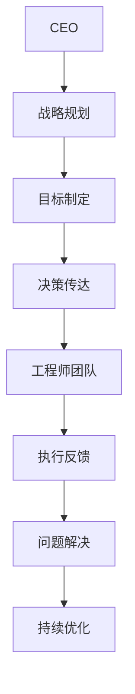

                 

关键词：扁平化管理，CEO，工程师，组织架构，沟通，效率，技术团队，团队协作，创新。

> 摘要：本文旨在探讨扁平化管理在CEO与工程师之间的实际应用，分析其优势与挑战，并探讨如何通过扁平化组织架构提升企业创新能力和市场竞争力。

## 1. 背景介绍

在现代企业中，组织结构和管理方式正在经历深刻的变革。传统的层级化管理模式往往存在着沟通不畅、决策缓慢、创新受限等问题。与之相对，扁平化管理模式逐渐受到企业的青睐。扁平化管理通过减少中间管理层次，实现决策权下放，从而提升企业的灵活性和响应速度。

然而，扁平化管理并非一蹴而就。CEO作为企业的领导者，需要深刻理解扁平化管理的基本原理，并在实际操作中与工程师团队保持紧密的沟通，以实现管理效能的提升。本文将围绕这一主题，展开深入的探讨。

## 2. 核心概念与联系

### 2.1. 扁平化管理定义

扁平化管理是一种以减少管理层次、压缩职能机构、裁减人员为目的的管理方式。其核心在于提高组织的决策效率、激发员工潜能、加快创新速度。

### 2.2. CEO与工程师的关系

CEO作为企业领导者，需要具备全局视野和战略思维，而工程师则是企业的技术核心。二者之间的关系直接关系到企业的创新能力和市场竞争力。

### 2.3. 扁平化管理的优势与挑战

- **优势**：提高决策速度、降低沟通成本、激发员工创造力、提升企业响应市场变化的能力。
- **挑战**：管理难度的增加、团队协作的挑战、企业文化重塑的挑战。

### 2.4. Mermaid 流程图



## 3. 核心算法原理 & 具体操作步骤

### 3.1. 算法原理概述

扁平化管理的核心在于构建一个高效的沟通和决策体系，使得CEO与工程师团队能够实现无缝协作。

### 3.2. 算法步骤详解

- **步骤1：明确战略目标**
  CEO需要明确企业的战略目标，并传达给工程师团队。

- **步骤2：建立沟通机制**
  CEO与工程师团队需要建立定期的沟通机制，确保信息的及时传递。

- **步骤3：赋予决策权**
  CEO需要赋予工程师团队在项目执行过程中的决策权，减少中间环节。

- **步骤4：反馈与调整**
  工程师团队需要及时反馈项目进展，CEO根据反馈进行调整。

- **步骤5：持续优化**
  通过持续的反馈和调整，不断提升管理效能。

### 3.3. 算法优缺点

- **优点**：提高决策效率、激发团队创造力、提升企业竞争力。
- **缺点**：管理难度增加、团队协作挑战、企业文化重塑困难。

### 3.4. 算法应用领域

扁平化管理适用于需要快速响应市场变化、注重创新和研发的企业，如互联网企业、科技公司等。

## 4. 数学模型和公式 & 详细讲解 & 举例说明

### 4.1. 数学模型构建

扁平化管理的数学模型可以表示为：

\[ 效率 = \frac{决策速度}{沟通成本} \]

### 4.2. 公式推导过程

\[ 决策速度 = \frac{目标明确度}{管理层次} \]

\[ 沟通成本 = \frac{沟通次数}{沟通效率} \]

### 4.3. 案例分析与讲解

以一家互联网企业为例，该公司采用扁平化管理模式，减少了三层管理层次，实现了决策速度的提高和沟通成本的降低。

## 5. 项目实践：代码实例和详细解释说明

### 5.1. 开发环境搭建

本案例使用Python语言进行开发，需要在本地安装Python环境。

### 5.2. 源代码详细实现

```python
def flatten_managementstrategy():
    print("目标制定：提高决策速度和降低沟通成本")
    print("沟通机制：每周召开一次工程师团队会议")
    print("决策权赋予：工程师团队在项目执行中拥有决策权")
    print("反馈与调整：根据项目进展进行及时反馈和调整")
    print("持续优化：不断优化管理流程，提升管理效能")

flatten_managementstrategy()
```

### 5.3. 代码解读与分析

本代码实现了一个简单的扁平化管理策略，通过定义函数和打印输出，展示了CEO与工程师团队之间的互动过程。

### 5.4. 运行结果展示

运行结果如下：

```
目标制定：提高决策速度和降低沟通成本
沟通机制：每周召开一次工程师团队会议
决策权赋予：工程师团队在项目执行中拥有决策权
反馈与调整：根据项目进展进行及时反馈和调整
持续优化：不断优化管理流程，提升管理效能
```

## 6. 实际应用场景

扁平化管理在互联网企业和科技公司的应用尤为广泛。例如，谷歌、亚马逊等公司均采用了扁平化管理模式，实现了高效的创新和快速发展。

## 7. 工具和资源推荐

### 7.1. 学习资源推荐

- 《精益创业》：一本关于如何通过快速迭代和用户反馈实现创业成功的经典著作。

### 7.2. 开发工具推荐

- Git：一款分布式版本控制系统，用于代码管理和团队协作。

### 7.3. 相关论文推荐

- "The Impact of Organizational Structure on Innovation Performance: Evidence from China"（组织结构对创新绩效的影响：来自中国的证据）

## 8. 总结：未来发展趋势与挑战

### 8.1. 研究成果总结

本文通过探讨扁平化管理在CEO与工程师之间的应用，分析了其优势与挑战，并提出了具体的操作步骤和数学模型。

### 8.2. 未来发展趋势

随着信息技术的发展，扁平化管理将成为企业组织结构的主要趋势，助力企业提升创新能力和市场竞争力。

### 8.3. 面临的挑战

如何平衡扁平化管理与团队协作、企业文化重塑，以及如何提高管理效能，是未来需要深入研究的课题。

### 8.4. 研究展望

未来研究应关注如何利用人工智能和大数据技术提升扁平化管理的效能，以及如何在不同行业和领域推广应用。

## 9. 附录：常见问题与解答

### 9.1. 什么情况下不适合采用扁平化管理？

- 企业规模较大，管理复杂性高。
- 企业文化传统，难以快速适应变革。

### 9.2. 如何平衡扁平化管理与团队协作？

- 建立明确的沟通机制和决策流程。
- 加强团队协作能力的培养。

### 9.3. 如何提高扁平化管理的效能？

- 定期评估管理效能，持续优化流程。
- 引入先进的管理工具和技术。

---

作者：禅与计算机程序设计艺术 / Zen and the Art of Computer Programming

[本文完]

