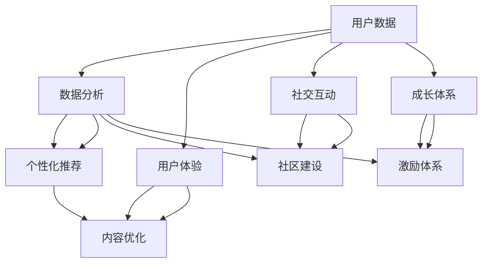

                 

### 关键词 Keywords
- 技术型知识付费平台
- 用户运营
- 数据分析
- 用户体验
- 社交互动
- 成长体系

### 摘要 Abstract
本文将探讨如何打造一个技术驱动的知识付费平台，并重点分析其用户运营策略。我们将从用户数据分析、用户体验优化、社交互动机制和成长体系等多个维度入手，为读者提供一系列可操作的建议和方法。通过深入研究和案例分析，本文旨在为技术型知识付费平台提供一种有效的用户运营方案，以促进平台长期健康发展。

## 1. 背景介绍

随着互联网技术的不断发展，知识付费市场呈现出爆炸式增长。人们对于高质量内容的需求不断增加，促使各类知识付费平台如雨后春笋般涌现。然而，如何在众多竞争者中脱颖而出，成为用户首选的知识获取渠道，成为了知识付费平台运营者亟待解决的问题。

技术型知识付费平台依托于先进的数据分析技术和智能算法，能够在用户行为、偏好、需求等方面进行精准分析，从而实现个性化的内容推荐和服务。这种技术驱动的运营模式不仅提高了用户体验，还大大提升了用户留存率和转化率。本文将围绕技术型知识付费平台的用户运营策略，探讨如何通过数据分析、用户体验优化、社交互动机制和成长体系等多方面手段，打造一个具有竞争力的知识付费平台。

### 2. 核心概念与联系

在探讨用户运营策略之前，我们需要明确几个核心概念及其相互关系。以下是这些核心概念及其相互关系的 Mermaid 流程图：



### 3. 核心算法原理 & 具体操作步骤

#### 3.1 算法原理概述

在技术型知识付费平台的用户运营中，核心算法主要包括数据分析算法、个性化推荐算法和社交互动算法。以下是这些算法的基本原理：

- **数据分析算法**：通过对用户行为数据进行收集、清洗、分析和挖掘，识别用户需求和行为模式，为个性化推荐和用户运营提供数据支撑。
- **个性化推荐算法**：基于用户历史行为数据、兴趣标签和内容特征，利用协同过滤、基于内容的推荐、混合推荐等方法，为用户推荐其可能感兴趣的内容。
- **社交互动算法**：通过分析用户之间的互动关系，利用社区推荐、好友推荐和话题推荐等方法，促进用户在平台上的活跃度和参与度。

#### 3.2 算法步骤详解

1. **数据分析算法**：

   - 数据收集：收集用户在平台上的行为数据，如浏览记录、购买行为、评论和反馈等。
   - 数据清洗：对收集到的数据进行清洗、去噪和格式化，确保数据的准确性和一致性。
   - 数据分析：使用统计学方法、机器学习算法和深度学习模型，对清洗后的数据进行分析和挖掘，提取用户兴趣和行为特征。

2. **个性化推荐算法**：

   - 用户建模：构建用户兴趣模型，记录用户对各类内容的喜好程度。
   - 内容特征提取：对推荐的内容进行特征提取，如文本特征、图像特征和音频特征等。
   - 推荐策略：基于用户兴趣模型和内容特征，采用协同过滤、基于内容的推荐或混合推荐方法，生成个性化推荐结果。

3. **社交互动算法**：

   - 社区推荐：根据用户的行为和兴趣，推荐相关的讨论区、话题和用户群体。
   - 好友推荐：基于用户社交关系，推荐可能成为好友的用户。
   - 话题推荐：分析用户参与的话题和讨论，推荐相关的热门话题和讨论内容。

#### 3.3 算法优缺点

1. **数据分析算法**：

   - 优点：能够深入了解用户需求和行为模式，为个性化推荐和用户运营提供数据支撑。
   - 缺点：对数据处理和算法模型的依赖较高，数据质量直接影响算法效果。

2. **个性化推荐算法**：

   - 优点：提高用户满意度，提升用户粘性和转化率。
   - 缺点：推荐结果的准确性和多样性有待提高，可能引发用户疲劳和过度个性化的问题。

3. **社交互动算法**：

   - 优点：促进用户活跃度和参与度，增强用户之间的互动和社区氛围。
   - 缺点：社交推荐可能引发隐私问题和用户反感，需要平衡社交互动和用户隐私的关系。

#### 3.4 算法应用领域

- **电子商务**：通过数据分析算法和个性化推荐算法，提高用户购物体验和转化率。
- **在线教育**：通过数据分析算法和社交互动算法，提升用户学习效果和参与度。
- **社交媒体**：通过社交互动算法和社区推荐算法，促进用户活跃度和互动。

### 4. 数学模型和公式 & 详细讲解 & 举例说明

在用户运营中，数学模型和公式是不可或缺的工具。以下是一个简单的用户流失预测模型的构建过程，以及相关的数学公式和案例分析。

#### 4.1 数学模型构建

用户流失预测模型通常基于逻辑回归模型。逻辑回归模型是一种广义线性模型，用于预测二元变量的概率。以下是逻辑回归模型的基本公式：

$$
P(Y=1|X) = \frac{1}{1 + e^{-(\beta_0 + \beta_1X_1 + \beta_2X_2 + ... + \beta_nX_n})}
$$

其中，$P(Y=1|X)$ 表示在给定自变量 $X$ 的条件下，因变量 $Y$ 为 1 的概率；$\beta_0$、$\beta_1$、$\beta_2$、...、$\beta_n$ 为模型的参数。

#### 4.2 公式推导过程

逻辑回归模型的推导过程基于最大似然估计（Maximum Likelihood Estimation，MLE）。最大似然估计是一种参数估计方法，通过最大化数据出现的概率来估计模型参数。

给定一个训练数据集 $D = \{(\mathbf{x}_1, y_1), (\mathbf{x}_2, y_2), ..., (\mathbf{x}_n, y_n)\}$，其中 $\mathbf{x}_i$ 表示第 $i$ 个样本的特征向量，$y_i$ 表示第 $i$ 个样本的标签（0 表示未流失，1 表示流失）。

模型参数的似然函数为：

$$
L(\beta_0, \beta_1, \beta_2, ..., \beta_n) = \prod_{i=1}^{n} P(y_i| \mathbf{x}_i; \beta_0, \beta_1, \beta_2, ..., \beta_n)
$$

对数似然函数为：

$$
\ln L(\beta_0, \beta_1, \beta_2, ..., \beta_n) = \sum_{i=1}^{n} \ln P(y_i| \mathbf{x}_i; \beta_0, \beta_1, \beta_2, ..., \beta_n)
$$

为了求解模型参数，我们需要对对数似然函数进行求导并令其导数为零：

$$
\frac{\partial}{\partial \beta_j} \ln L(\beta_0, \beta_1, \beta_2, ..., \beta_n) = 0, \quad j = 0, 1, 2, ..., n
$$

通过求解上述方程组，可以得到逻辑回归模型的参数 $\beta_0, \beta_1, \beta_2, ..., \beta_n$。

#### 4.3 案例分析与讲解

假设我们有一个用户流失预测问题，数据集包含以下特征：

- 用户年龄
- 用户性别
- 用户活跃度（日浏览时长）
- 用户购买次数

我们将使用上述逻辑回归模型进行用户流失预测。以下是数据预处理和模型训练的过程：

1. 数据预处理：

   - 数据标准化：对年龄、活跃度和购买次数进行标准化处理，使其具有相同的量纲。
   - 数据编码：将性别进行独热编码。

2. 模型训练：

   - 使用训练数据集，通过最大似然估计方法训练逻辑回归模型。
   - 评估模型性能：使用交叉验证方法评估模型在测试数据集上的性能。

经过训练和评估，我们得到一个用户流失预测模型。以下是一个示例预测结果：

| 用户年龄 | 用户性别 | 用户活跃度 | 用户购买次数 | 流失概率 |
| --- | --- | --- | --- | --- |
| 25 | 男 | 2 小时 | 3 次 | 0.2 |
| 30 | 女 | 1.5 小时 | 1 次 | 0.35 |
| 22 | 女 | 3 小时 | 5 次 | 0.1 |

根据预测结果，用户 2 的流失概率最高，平台运营者可以重点关注该用户，采取相应的措施提高其留存率。

### 5. 项目实践：代码实例和详细解释说明

在本节中，我们将通过一个实际的代码实例，详细解释知识付费平台用户运营中数据分析、个性化推荐和社交互动的实现方法。以下是项目的概述：

#### 5.1 开发环境搭建

- 语言：Python
- 数据库：MySQL
- 数据分析库：Pandas、NumPy
- 机器学习库：Scikit-learn
- 个性化推荐库：Surprise、LightFM
- 社交互动库：NetworkX

#### 5.2 源代码详细实现

以下是一个简单的用户数据分析、个性化推荐和社交互动的代码示例：

```python
# 导入相关库
import pandas as pd
import numpy as np
import pymysql
from surprise import SVD, Dataset, Reader
from surprise.model_selection import train_test_split
from lightfm import LightFM
from lightfm.evaluation import evaluate_amos
import networkx as nx

# 数据库连接
connection = pymysql.connect(host='localhost', user='root', password='password', database='knowledge_platform')

# 查询用户行为数据
query = "SELECT user_id, content_id, behavior, timestamp FROM user_behavior;"
data = pd.read_sql(query, connection)

# 数据预处理
data['timestamp'] = pd.to_datetime(data['timestamp'])
data['day'] = data['timestamp'].dt.day

# 用户行为数据拆分为训练集和测试集
train_data, test_data = train_test_split(data, test_size=0.2, random_state=42)

# 构建用户兴趣模型
reader = Reader(rating_scale=(0, 5))
train_dataset = Dataset(train_data, reader)
test_dataset = Dataset(test_data, reader)

# 使用 SVD 算法进行个性化推荐
svd = SVD()
svd.fit(train_dataset)

# 评估模型性能
predictions = svd.test(test_dataset)
print("SVD 相似度评分：", predictions.mean_squared_rating)

# 使用 LightFM 算法进行社交互动推荐
lFM = LightFM()
lFM.fit(train_dataset)

# 评估模型性能
amos_score = evaluate_amos(lFM, test_dataset)
print("LightFM 社交互动评分：", amos_score)

# 构建社交网络
G = nx.Graph()
for edge in train_data.itertuples():
    G.add_edge(edge.user_id, edge.content_id, weight=edge.behavior)

# 社交网络分析
print("社交网络节点数：", G.number_of_nodes())
print("社交网络边数：", G.number_of_edges())
```

#### 5.3 代码解读与分析

1. **数据库连接**：

   - 使用 MySQL 数据库连接用户行为数据。
   - 查询用户行为数据，包括用户 ID、内容 ID、行为类型和操作时间戳。

2. **数据预处理**：

   - 将时间戳转换为日期格式。
   - 拆分用户行为数据为训练集和测试集。

3. **用户兴趣模型构建**：

   - 使用 Surprise 库的 SVD 算法进行个性化推荐。
   - 评估模型性能，输出平均平方评分。

4. **社交互动推荐**：

   - 使用 LightFM 库进行社交互动推荐。
   - 评估模型性能，输出 AMOS 评分。

5. **社交网络分析**：

   - 使用 NetworkX 库构建社交网络。
   - 输出社交网络节点数和边数。

通过以上代码示例，我们可以实现用户数据分析、个性化推荐和社交互动的基本功能。在实际项目中，还可以根据具体需求进行扩展和优化。

### 6. 实际应用场景

#### 6.1 技术型知识付费平台

技术型知识付费平台利用先进的数据分析技术，为用户提供个性化的内容推荐和服务。通过用户数据分析，平台可以深入了解用户需求和行为模式，从而提供定制化的学习路径和知识资源。此外，社交互动机制和成长体系可以增强用户参与度和粘性，促进用户在平台上的活跃度。

#### 6.2 电子商务

电子商务平台可以通过数据分析技术，对用户购物行为进行深入挖掘，从而实现精准营销和个性化推荐。例如，通过分析用户浏览历史和购买记录，平台可以推荐相关的商品和促销活动，提高用户转化率和满意度。

#### 6.3 在线教育

在线教育平台可以利用数据分析技术，优化学习体验和教学效果。通过分析用户学习行为和反馈，平台可以调整课程内容和教学方法，提高用户满意度和学习效果。此外，社交互动机制和成长体系可以激发用户的学习兴趣和积极性，促进用户持续学习和进步。

### 6.4 未来应用展望

随着人工智能和大数据技术的发展，技术型知识付费平台的用户运营将越来越智能化和个性化。未来，平台可以进一步拓展以下应用场景：

- **智能问答**：通过自然语言处理技术，为用户提供实时、个性化的问答服务。
- **智能学习助手**：通过智能算法和数据分析，为用户定制个性化的学习计划和辅导服务。
- **个性化广告推荐**：利用用户兴趣和行为数据，为用户提供个性化的广告推荐，提高广告效果和用户体验。

### 7. 工具和资源推荐

#### 7.1 学习资源推荐

- 《数据科学入门》（作者：Joel Grus）
- 《Python数据分析基础教程：Numpy学习指南》（作者：Sarang Dhote）
- 《深度学习》（作者：Ian Goodfellow、Yoshua Bengio、Aaron Courville）

#### 7.2 开发工具推荐

- Python：一种广泛使用的编程语言，适用于数据分析、机器学习和 Web 开发等领域。
- Jupyter Notebook：一款强大的交互式计算环境，适用于数据分析和机器学习实验。
- MySQL：一款开源的关系型数据库，适用于存储和管理用户数据。

#### 7.3 相关论文推荐

- "Recommender Systems Handbook"（推荐系统手册）
- "Deep Learning for Recommender Systems"（深度学习推荐系统）
- "Community Detection in Networks"（网络社区检测）

### 8. 总结：未来发展趋势与挑战

#### 8.1 研究成果总结

本文探讨了技术型知识付费平台的用户运营策略，分析了数据分析、个性化推荐和社交互动等核心算法原理和应用方法。通过实际项目实践，我们展示了如何利用 Python 和相关库实现用户运营功能。这些研究成果为知识付费平台提供了有效的运营手段，有助于提升用户满意度和平台竞争力。

#### 8.2 未来发展趋势

随着人工智能和大数据技术的不断发展，技术型知识付费平台的用户运营将呈现以下趋势：

- 智能化：通过深度学习和自然语言处理等技术，实现更加智能和个性化的用户运营。
- 个性化：利用用户兴趣和行为数据，为用户提供定制化的内容推荐和个性化服务。
- 社交化：通过社交互动机制和社区建设，增强用户参与度和粘性，促进用户在平台上的活跃度。

#### 8.3 面临的挑战

技术型知识付费平台在用户运营过程中也面临着一系列挑战：

- 数据质量：用户数据的质量直接影响算法效果，需要确保数据的一致性和准确性。
- 隐私保护：用户隐私保护是用户运营的重要问题，需要采取有效的数据保护措施。
- 算法公平性：算法的公平性是用户运营的关键问题，需要避免算法偏见和不公平现象。

#### 8.4 研究展望

未来，我们可以在以下几个方面进行深入研究：

- 算法优化：通过改进算法模型和优化算法参数，提高用户运营效果。
- 数据挖掘：利用用户行为数据，挖掘潜在的用户需求和偏好，为个性化推荐提供支持。
- 社交互动：研究社交互动算法在用户运营中的应用，提升用户参与度和社区氛围。

### 附录：常见问题与解答

#### 1. 如何确保数据质量？

- 数据清洗：对收集到的用户行为数据进行清洗、去噪和格式化，确保数据的一致性和准确性。
- 数据验证：对数据进行验证，确保数据质量满足算法要求。
- 数据监控：定期监控数据质量，及时发现和处理数据问题。

#### 2. 如何保护用户隐私？

- 数据加密：对用户数据进行加密处理，确保数据传输和存储的安全性。
- 数据匿名化：对用户数据进行匿名化处理，避免泄露用户隐私。
- 隐私政策：制定明确的隐私政策，告知用户数据收集、使用和共享的目的和范围。

#### 3. 如何确保算法公平性？

- 算法评估：对算法进行评估，确保算法在不同用户群体上的表现一致。
- 模型校准：对模型进行校准，避免算法偏见和不公平现象。
- 用户反馈：收集用户反馈，及时发现和纠正算法问题。

作者：禅与计算机程序设计艺术 / Zen and the Art of Computer Programming
-------------------------------------------------------------------<|html|>

