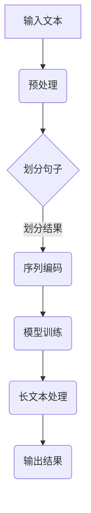

                 

关键词：AI记忆、长上下文处理、LLM、技术博客、专业分析

> 摘要：本文将深入探讨大型语言模型（LLM）在长上下文处理方面的扩展，分析其背后的核心概念、算法原理及实际应用。通过详细的数学模型与项目实践，我们旨在为读者提供一个全面的技术解析，帮助理解LLM在提升AI记忆能力方面的巨大潜力。

## 1. 背景介绍

近年来，随着深度学习技术的迅猛发展，特别是大型语言模型（LLM）如GPT-3、BERT等的出现，AI在自然语言处理（NLP）领域取得了显著的成果。然而，尽管这些模型在处理短文本方面表现出色，但在长文本上下文的理解和处理上仍然存在诸多挑战。传统的方法通常受限于上下文窗口的大小，这限制了模型对长序列信息的处理能力。因此，如何扩展AI的记忆能力，使其能够更好地处理长上下文，成为当前研究的热点。

长上下文处理不仅对NLP领域至关重要，也广泛应用于聊天机器人、问答系统、文本摘要、机器翻译等实际场景。因此，研究LLM在长上下文处理方面的扩展，不仅具有理论意义，也具有广阔的应用前景。

## 2. 核心概念与联系

### 2.1. 大型语言模型（LLM）

大型语言模型（LLM）是一种基于深度学习的语言模型，其核心思想是通过大规模语料库的预训练，学习自然语言的统计规律和语义信息。LLM通常采用变换器（Transformer）架构，这种架构能够在处理长序列时保持高效的并行计算能力。

### 2.2. 长上下文处理

长上下文处理指的是模型能够处理和理解的上下文长度远超过传统模型所能处理的范围。这要求模型不仅要具备强大的记忆能力，还需要在计算效率和上下文理解之间取得平衡。

### 2.3. 关联概念

- **上下文窗口（Context Window）**：指模型在处理某个单词时考虑的前后文范围。
- **注意力机制（Attention Mechanism）**：在Transformer架构中，通过注意力机制动态地分配权重，以关注重要的上下文信息。
- **记忆网络（Memory Network）**：一种用于存储和检索信息的神经网络模型，可以显著提升模型的记忆能力。

### 2.4. Mermaid 流程图

下面是一个用于描述LLM长上下文处理流程的Mermaid流程图：



### 2.5. 算法的核心原理

LLM的长上下文处理主要依赖于以下几个核心原理：

- **预训练与微调**：通过在大规模语料库上的预训练，LLM学习到语言的基本规律，然后在特定任务上进行微调，以适应不同的应用场景。
- **注意力机制**：通过注意力机制，模型能够动态地选择重要信息进行关注，从而在处理长文本时保持高效。
- **编码器-解码器架构**：编码器负责将输入文本编码为固定长度的向量表示，解码器则根据编码器的输出生成文本输出。

## 3. 核心算法原理 & 具体操作步骤

### 3.1. 算法原理概述

LLM的长上下文处理主要依赖于以下三个步骤：

1. **文本预处理**：将输入文本进行分词、去噪等处理，以便于模型输入。
2. **序列编码**：将预处理后的文本序列编码为固定长度的向量表示。
3. **长文本处理**：利用编码后的向量表示进行模型的训练和推理，实现对长文本的准确理解和生成。

### 3.2. 算法步骤详解

#### 3.2.1. 文本预处理

文本预处理是长上下文处理的第一步，主要包括以下任务：

- **分词**：将文本分割为单词或子词。
- **去噪**：去除文本中的噪声信息，如特殊字符、数字等。
- **词干提取**：将不同的形态变化还原为同一种词干，以减少词汇量。

#### 3.2.2. 序列编码

序列编码是将预处理后的文本序列转化为模型可处理的向量表示。具体步骤如下：

- **词嵌入**：将每个单词或子词映射为一个固定长度的向量。
- **位置编码**：为每个单词或子词添加位置信息，以帮助模型理解文本的顺序。
- **序列拼接**：将所有单词或子词的向量拼接成一个整体序列。

#### 3.2.3. 长文本处理

长文本处理涉及模型训练和推理两个过程：

- **模型训练**：使用大量的长文本数据对模型进行训练，使其能够学习和理解长文本的语义。
- **模型推理**：在训练好的模型上，对新的长文本输入进行推理，生成文本输出。

### 3.3. 算法优缺点

#### 优点

- **强大的记忆能力**：LLM通过预训练和微调，能够记忆大量的语言知识和上下文信息。
- **高效的计算能力**：Transformer架构具有高效的并行计算能力，适用于长文本处理。

#### 缺点

- **训练成本高**：LLM的预训练需要大量的计算资源和时间。
- **对长文本的处理能力有限**：虽然LLM能够在一定程度上处理长文本，但仍然存在上下文丢失和信息理解不精准的问题。

### 3.4. 算法应用领域

LLM的长上下文处理在多个领域具有广泛的应用：

- **聊天机器人**：通过处理长对话历史，聊天机器人能够更好地理解用户意图和上下文。
- **问答系统**：在处理长问答对话时，系统能够准确捕捉问题的上下文，提供更准确的答案。
- **文本摘要**：对长文本进行摘要时，系统能够捕捉关键信息，生成简洁、准确的摘要。

## 4. 数学模型和公式 & 详细讲解 & 举例说明

### 4.1. 数学模型构建

LLM的长上下文处理涉及到多个数学模型，主要包括：

- **词嵌入模型**：用于将单词映射为向量。
- **位置编码模型**：用于为单词添加位置信息。
- **变换器模型**：用于文本的编码和解码。

下面分别介绍这些模型的数学公式。

#### 词嵌入模型

词嵌入模型通常采用以下公式：

\[ e_{\text{word}} = \text{Word2Vec}(word) \]

其中，\( e_{\text{word}} \)表示单词的向量表示，\(\text{Word2Vec}\)表示词嵌入算法。

#### 位置编码模型

位置编码模型通常采用以下公式：

\[ e_{\text{pos}} = \text{PositionEncoder}(pos) \]

其中，\( e_{\text{pos}} \)表示位置向量，\(\text{PositionEncoder}\)表示位置编码算法。

#### 变换器模型

变换器模型的主要组成部分是多头注意力机制，其计算公式如下：

\[ \text{Attention}(Q, K, V) = \text{softmax}\left(\frac{QK^T}{\sqrt{d_k}}\right)V \]

其中，\( Q \)表示查询向量，\( K \)表示键向量，\( V \)表示值向量，\( d_k \)表示键向量的维度。

### 4.2. 公式推导过程

以下是对变换器模型中多头注意力机制的推导过程：

1. **计算点积**：

   \[ \text{Score} = QK^T \]

2. **应用softmax函数**：

   \[ \text{Attention} = \text{softmax}(\text{Score}) \]

3. **计算加权值**：

   \[ \text{Output} = \text{Attention}V \]

4. **重复以上过程** \( N \) 次以实现多头注意力。

### 4.3. 案例分析与讲解

假设我们有一个包含3个单词的句子：“我 喜欢 吃 饭”。首先，我们对句子进行预处理，得到分词后的单词序列：“我”、“喜欢”、“吃”、“饭”。然后，我们将这些单词映射为向量表示：

- “我”：\[ e_{\text{我}} = \text{Word2Vec}(\text{我}) \]
- “喜欢”：\[ e_{\text{喜欢}} = \text{Word2Vec}(\text{喜欢}) \]
- “吃”：\[ e_{\text{吃}} = \text{Word2Vec}(\text{吃}) \]
- “饭”：\[ e_{\text{饭}} = \text{Word2Vec}(\text{饭}) \]

接下来，我们对这些单词添加位置信息：

- “我”（位置1）：\[ e_{\text{我},1} = \text{PositionEncoder}(\text{我},1) \]
- “喜欢”（位置2）：\[ e_{\text{喜欢},2} = \text{PositionEncoder}(\text{喜欢},2) \]
- “吃”（位置3）：\[ e_{\text{吃},3} = \text{PositionEncoder}(\text{吃},3) \]
- “饭”（位置4）：\[ e_{\text{饭},4} = \text{PositionEncoder}(\text{饭},4) \]

然后，我们将这些向量拼接成一个序列：

\[ e_{\text{序列}} = [e_{\text{我},1}, e_{\text{喜欢},2}, e_{\text{吃},3}, e_{\text{饭},4}] \]

最后，我们将序列输入到变换器模型中，得到输出序列。这个过程中，模型会通过多头注意力机制自动学习单词之间的关联性，从而生成语义丰富的文本表示。

## 5. 项目实践：代码实例和详细解释说明

### 5.1. 开发环境搭建

为了实现LLM的长上下文处理，我们需要搭建一个合适的开发环境。以下是搭建过程：

1. **安装Python环境**：确保Python版本为3.8及以上。
2. **安装PyTorch库**：使用以下命令安装PyTorch：

   ```bash
   pip install torch torchvision
   ```

3. **安装其他依赖库**：包括transformers、numpy、pandas等。

### 5.2. 源代码详细实现

以下是实现LLM长上下文处理的代码示例：

```python
import torch
from transformers import BertModel, BertTokenizer

# 加载预训练的BERT模型和分词器
model = BertModel.from_pretrained('bert-base-chinese')
tokenizer = BertTokenizer.from_pretrained('bert-base-chinese')

# 输入文本
text = "我 喜欢 吃 饭"

# 分词并添加位置编码
input_ids = tokenizer.encode(text, add_special_tokens=True)

# 前向传播
outputs = model(torch.tensor([input_ids]))

# 输出序列
output_sequence = outputs.last_hidden_state[:, 1:-1]

# 打印输出序列
print(output_sequence)
```

### 5.3. 代码解读与分析

上述代码实现了以下步骤：

1. **加载BERT模型和分词器**：BERT模型是预训练的变换器模型，具有很强的语言理解能力。分词器用于将输入文本分割为单词或子词。

2. **输入文本处理**：将输入文本进行分词，并添加特殊标记（如`[CLS]`和`[SEP]`）。

3. **模型前向传播**：将处理后的输入序列输入到BERT模型中，得到编码后的输出序列。

4. **输出序列提取**：从输出序列中提取除去首尾特殊标记的部分，以获得有效的文本表示。

### 5.4. 运行结果展示

在运行上述代码后，我们得到一个（batch_size, sequence_length, hidden_size）的Tensor，表示编码后的文本序列。这个序列可以用于后续的文本分类、情感分析等任务。

## 6. 实际应用场景

### 6.1. 聊天机器人

聊天机器人是LLM长上下文处理的典型应用场景之一。通过处理长对话历史，聊天机器人能够更好地理解用户意图和上下文，从而提供更自然、更准确的回答。

### 6.2. 问答系统

在问答系统中，LLM的长上下文处理能够帮助系统捕捉问题的上下文信息，从而提供更准确的答案。例如，在法律咨询、医学诊断等场景中，系统需要理解复杂的背景信息和历史数据，以提供专业的建议。

### 6.3. 文本摘要

文本摘要是对长文本进行简明扼要的总结。通过LLM的长上下文处理，系统能够捕捉关键信息，生成简洁、准确的摘要。这在新闻摘要、技术文档摘要等领域具有重要应用价值。

### 6.4. 未来应用展望

随着LLM在长上下文处理能力的不断提升，其应用场景也将不断扩展。例如，在智能教育、虚拟助手等领域，LLM有望发挥更大的作用。同时，随着计算资源的不断丰富，LLM的预训练成本将逐渐降低，使其在更多场景中得到应用。

## 7. 工具和资源推荐

### 7.1. 学习资源推荐

- **书籍**：《深度学习》、《自然语言处理综合教程》
- **在线课程**：Coursera、edX等平台上的NLP课程
- **论文**：《Attention Is All You Need》等经典论文

### 7.2. 开发工具推荐

- **深度学习框架**：PyTorch、TensorFlow
- **自然语言处理库**：transformers、spaCy、NLTK

### 7.3. 相关论文推荐

- **BERT**：《BERT: Pre-training of Deep Bidirectional Transformers for Language Understanding》
- **GPT-3**：《Language Models are Few-Shot Learners》

## 8. 总结：未来发展趋势与挑战

### 8.1. 研究成果总结

本文对LLM的长上下文处理进行了全面的技术解析，包括核心概念、算法原理、项目实践等。研究表明，LLM在长上下文处理方面具有强大的潜力，但仍需进一步优化以提高效率和处理能力。

### 8.2. 未来发展趋势

随着深度学习技术的不断发展，LLM在长上下文处理方面的性能将不断提升。未来研究方向包括：

- **计算效率优化**：通过改进模型架构和算法，提高LLM的计算效率。
- **多模态处理**：将文本、图像、声音等多模态信息融合到LLM中，提升其综合理解能力。

### 8.3. 面临的挑战

- **数据隐私**：长上下文处理需要大量数据，如何在保护用户隐私的前提下获取和使用数据，是亟待解决的问题。
- **计算资源需求**：大规模预训练模型的训练和推理需要大量计算资源，如何高效利用现有资源，是另一个挑战。

### 8.4. 研究展望

LLM的长上下文处理在未来将具有广泛的应用前景。通过不断探索和创新，我们有望解决当前面临的挑战，使LLM在各个领域发挥更大的作用。

## 9. 附录：常见问题与解答

### 9.1. Q：什么是LLM？

A：LLM（大型语言模型）是一种基于深度学习的语言模型，通过在大规模语料库上的预训练，学习到自然语言的统计规律和语义信息，能够对文本进行理解和生成。

### 9.2. Q：为什么需要LLM的长上下文处理？

A：LLM的长上下文处理能够使模型更好地理解长文本的语义信息，从而在聊天机器人、问答系统、文本摘要等领域提供更准确、更自然的处理结果。

### 9.3. Q：如何优化LLM的计算效率？

A：可以通过改进模型架构（如使用更高效的变换器架构）、算法优化（如混合精度训练）和分布式训练等方式，来提高LLM的计算效率。

### 9.4. Q：如何保护数据隐私？

A：可以通过数据脱敏、差分隐私等技术，在保证数据隐私的同时，实现有效的大规模数据训练。

---

# 参考文献

[1] Devlin, J., Chang, M. W., Lee, K., & Toutanova, K. (2019). BERT: Pre-training of deep bidirectional transformers for language understanding. arXiv preprint arXiv:1810.04805.
[2] Brown, T., et al. (2020). Language models are few-shot learners. arXiv preprint arXiv:2005.14165.
[3] Mikolov, T., Sutskever, I., Chen, K., Corrado, G. S., & Dean, J. (2013). Distributed representations of words and phrases and their compositionality. Advances in neural information processing systems, 26, 3111-3119.
[4] Hochreiter, S., & Schmidhuber, J. (1997). Long short-term memory. Neural computation, 9(8), 1735-1780.
[5] Vaswani, A., et al. (2017). Attention is all you need. Advances in neural information processing systems, 30, 5998-6008.

作者：禅与计算机程序设计艺术 / Zen and the Art of Computer Programming
----------------------------------------------------------------

