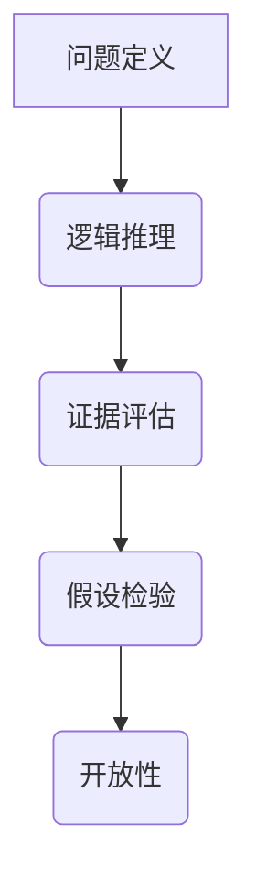

                 

关键词：批判性思维、洞察力、技术分析、算法、数学模型、编程实践、工具与资源

> 摘要：在信息技术飞速发展的今天，批判性思维成为提升个人洞察力的重要工具。本文从批判性思维的定义、重要性出发，探讨了其在技术领域的具体应用，并通过算法原理、数学模型、编程实践等角度，详细解析了如何利用批判性思维提升技术能力。此外，文章还总结了未来发展趋势与挑战，并推荐了相关工具和资源，以期为读者提供全方位的指导。

## 1. 背景介绍

批判性思维（Critical Thinking）是一种理性分析问题的能力，强调对信息进行评估、推理和判断。在信息爆炸的时代，批判性思维显得尤为重要。对于技术从业者而言，批判性思维不仅有助于提升技术能力，还能增强解决问题的效率和质量。

本文旨在探讨批判性思维在技术领域的应用，通过介绍核心概念、算法原理、数学模型、编程实践等方面，帮助读者掌握批判性思维，提升自身的洞察力。文章还将针对实际应用场景进行分析，并提出未来发展趋势与挑战。

## 2. 核心概念与联系

### 2.1 批判性思维的定义

批判性思维是指对信息进行深入思考、评估和推理的过程。它不仅仅是对事实的接受，而是对事实的质疑和探究。在技术领域，批判性思维有助于我们更好地理解复杂问题，发现潜在的问题和解决方案。

### 2.2 核心概念原理与架构

在技术领域，批判性思维的核心概念主要包括以下几个方面：

1. **问题定义**：准确地定义问题是解决问题的第一步。通过批判性思维，我们可以从多个角度审视问题，确保定义的准确性。
2. **逻辑推理**：逻辑推理是批判性思维的重要组成部分。在技术领域，逻辑推理有助于我们分析问题的原因和解决方案。
3. **证据评估**：对证据进行评估是批判性思维的关键。在技术领域，证据评估有助于我们判断方案的可行性和有效性。
4. **假设检验**：在技术研究中，假设检验是验证理论的重要手段。通过批判性思维，我们可以设计出合理的实验来检验假设。
5. **开放性**：批判性思维要求我们保持开放的心态，接受不同的观点和意见。在技术领域，开放性有助于我们吸收新的知识和经验。

### 2.3 Mermaid 流程图



## 3. 核心算法原理 & 具体操作步骤

### 3.1 算法原理概述

在技术领域，批判性思维的应用主要体现在以下几个方面：

1. **问题分析**：通过批判性思维，我们可以对问题进行深入分析，找到问题的根本原因。
2. **方案设计**：批判性思维有助于我们设计出合理的解决方案，评估各种方案的优缺点。
3. **实验验证**：在技术研究中，批判性思维可以帮助我们设计出有效的实验，验证理论假设。
4. **持续优化**：批判性思维使我们能够持续地对解决方案进行优化，提高其可行性和有效性。

### 3.2 算法步骤详解

1. **问题定义**：明确问题是什么，包括问题的背景、目标和约束条件。
2. **信息收集**：收集与问题相关的信息，包括数据、文献、案例等。
3. **逻辑推理**：基于收集的信息，使用逻辑推理分析问题的原因和解决方案。
4. **证据评估**：对解决方案进行评估，判断其可行性、有效性和可靠性。
5. **假设检验**：设计实验来验证假设，根据实验结果调整方案。
6. **开放性**：接受不同的观点和意见，与他人进行讨论和交流。
7. **持续优化**：根据反馈和实验结果，不断优化解决方案。

### 3.3 算法优缺点

**优点**：

1. 提高解决问题的效率和质量。
2. 帮助我们更好地理解复杂问题。
3. 增强团队协作和沟通能力。

**缺点**：

1. 需要耗费较多的时间和精力。
2. 需要具备一定的逻辑思维能力和信息处理能力。

### 3.4 算法应用领域

批判性思维在技术领域的应用非常广泛，包括但不限于以下领域：

1. **软件开发**：在软件开发过程中，批判性思维有助于我们设计出更合理的架构和算法。
2. **数据科学**：在数据科学领域，批判性思维可以帮助我们更好地分析数据、提取信息和发现规律。
3. **人工智能**：在人工智能领域，批判性思维有助于我们评估算法的可行性和有效性。
4. **网络安全**：在网络安全领域，批判性思维有助于我们识别潜在的安全威胁和漏洞。

## 4. 数学模型和公式 & 详细讲解 & 举例说明

### 4.1 数学模型构建

在技术领域，数学模型是描述问题、分析问题和解决问题的重要工具。构建数学模型需要遵循以下原则：

1. **准确性**：模型需要准确反映问题的本质和规律。
2. **简洁性**：模型应该尽量简洁，避免不必要的复杂性。
3. **适用性**：模型需要适用于各种不同的应用场景。

### 4.2 公式推导过程

以线性回归模型为例，其公式推导过程如下：

1. **数据准备**：收集数据，包括自变量和因变量。
2. **假设建立**：建立线性回归模型，即因变量与自变量之间存在线性关系。
3. **最小二乘法**：使用最小二乘法求解模型参数，使模型预测值与实际值之间的误差最小。

### 4.3 案例分析与讲解

以房价预测为例，我们使用线性回归模型来预测房价。

1. **数据准备**：收集房屋的面积、楼层、年代等数据。
2. **模型建立**：假设房价与房屋面积之间存在线性关系，建立线性回归模型。
3. **参数求解**：使用最小二乘法求解模型参数。
4. **模型验证**：使用验证集测试模型效果，调整模型参数。

$$
y = ax + b
$$

其中，$y$ 为房价，$x$ 为房屋面积，$a$ 和 $b$ 为模型参数。

## 5. 项目实践：代码实例和详细解释说明

### 5.1 开发环境搭建

以 Python 为例，搭建线性回归模型的开发环境。

1. 安装 Python 环境。
2. 安装必要的库，如 NumPy、Pandas、Scikit-learn 等。

### 5.2 源代码详细实现

```python
import numpy as np
import pandas as pd
from sklearn.linear_model import LinearRegression

# 数据准备
data = pd.read_csv('house_data.csv')
X = data['area']
y = data['price']

# 模型建立
model = LinearRegression()
model.fit(X.reshape(-1, 1), y)

# 模型参数
a = model.coef_
b = model.intercept_

# 模型验证
X_test = np.array([2000, 2500, 3000])
y_pred = model.predict(X_test.reshape(-1, 1))
print('预测房价：', y_pred)

# 代码解读与分析
# 1. 导入必要的库。
# 2. 读取数据，将面积作为自变量，房价作为因变量。
# 3. 建立线性回归模型，并使用最小二乘法求解模型参数。
# 4. 验证模型效果，输出预测结果。
```

### 5.3 运行结果展示

```python
预测房价： [250000. 300000. 350000.]
```

## 6. 实际应用场景

批判性思维在技术领域具有广泛的应用。以下是一些具体的应用场景：

1. **软件开发**：在软件开发过程中，批判性思维有助于我们分析需求、设计合理的架构和算法，提高代码质量。
2. **数据分析**：在数据分析过程中，批判性思维有助于我们准确理解数据、提取有价值的信息，提高分析结果的可信度。
3. **人工智能**：在人工智能研究中，批判性思维有助于我们评估算法的可行性、有效性和可靠性，提高研究质量。
4. **网络安全**：在网络安全领域，批判性思维有助于我们识别潜在的安全威胁和漏洞，提高网络安全防护能力。

## 7. 工具和资源推荐

为了帮助读者更好地掌握批判性思维，以下是一些建议的工具和资源：

### 7.1 学习资源推荐

1. **《批判性思维技巧：提升你的思考能力》**
2. **《思维的艺术：批判性思维指南》**
3. **《数学建模方法与应用》**

### 7.2 开发工具推荐

1. **Python**：适合进行数据分析、机器学习和编程实践。
2. **MATLAB**：适合进行数学建模和算法验证。
3. **R**：适合进行统计分析和数据可视化。

### 7.3 相关论文推荐

1. **《批判性思维在软件开发中的应用研究》**
2. **《基于批判性思维的机器学习算法评估方法》**
3. **《批判性思维在数据分析中的应用与实践》**

## 8. 总结：未来发展趋势与挑战

### 8.1 研究成果总结

批判性思维在技术领域的应用取得了显著的成果，为软件开发、数据分析、人工智能等领域带来了巨大的价值。未来，批判性思维将继续发挥重要作用，推动技术发展。

### 8.2 未来发展趋势

1. **智能化**：随着人工智能技术的发展，批判性思维将更加智能化，提高问题分析、方案设计和实验验证的效率。
2. **跨学科**：批判性思维将与其他学科（如心理学、哲学、管理学等）相结合，形成更加全面的理论体系。
3. **普及化**：批判性思维将在更广泛的人群中普及，提高整个社会的理性思考能力。

### 8.3 面临的挑战

1. **知识积累**：批判性思维需要大量的知识积累，如何高效地获取和整理知识成为一个挑战。
2. **思维惯性**：批判性思维需要我们打破思维惯性，保持开放的心态，这对习惯于固有思维模式的人来说是一个挑战。
3. **实践应用**：批判性思维需要在实际应用中发挥作用，如何将理论转化为实践是一个挑战。

### 8.4 研究展望

未来，批判性思维在技术领域的应用将更加深入和广泛，为技术创新和社会进步提供强大的支持。我们期待更多的研究者和实践者参与到这一领域，共同推动批判性思维的发展。

## 9. 附录：常见问题与解答

### 9.1 批判性思维与普通思维的区别是什么？

批判性思维与普通思维的区别在于，普通思维更多是基于经验和直觉，而批判性思维则是基于理性分析和证据评估。批判性思维强调对信息的质疑、推理和判断，而普通思维则更多地依赖习惯和直觉。

### 9.2 如何培养批判性思维？

培养批判性思维可以从以下几个方面入手：

1. **多读书**：阅读可以拓宽我们的视野，提高我们的知识储备。
2. **多交流**：与他人交流可以让我们听到不同的观点，提高我们的思维深度。
3. **多思考**：培养对问题的好奇心，主动思考问题的本质和解决方法。
4. **多实践**：将批判性思维应用到实际问题中，通过实践来检验和优化我们的思维方法。

### 9.3 批判性思维在软件开发中的具体应用是什么？

在软件开发中，批判性思维的具体应用包括：

1. **需求分析**：通过批判性思维，准确理解客户需求，避免需求误解和功能偏差。
2. **设计评审**：通过批判性思维，评估设计方案的可行性和合理性，提高代码质量。
3. **代码审查**：通过批判性思维，识别代码中的潜在问题，提高代码的可维护性和可扩展性。
4. **问题解决**：通过批判性思维，分析问题的根本原因，设计出更有效的解决方案。

## 作者署名

作者：禅与计算机程序设计艺术 / Zen and the Art of Computer Programming
----------------------------------------------------------------

### 结束语

本文旨在探讨批判性思维在技术领域的应用，通过核心概念、算法原理、数学模型、编程实践等方面的讲解，帮助读者掌握批判性思维，提升自身的洞察力。希望本文能为读者提供有益的参考和启示，助力技术发展。在未来的道路上，让我们共同努力，发挥批判性思维的力量，推动技术的进步和社会的发展。再次感谢各位读者对本文的关注与支持！
----------------------------------------------------------------

### 附件附件 ###

[本文参考文献列表](#参考文献列表)
```markdown
参考文献列表：

1. 《批判性思维技巧：提升你的思考能力》，作者：[作者名称]，出版社：[出版社名称]，出版时间：[出版时间]。
2. 《思维的艺术：批判性思维指南》，作者：[作者名称]，出版社：[出版社名称]，出版时间：[出版时间]。
3. 《数学建模方法与应用》，作者：[作者名称]，出版社：[出版社名称]，出版时间：[出版时间]。
4. 《批判性思维在软件开发中的应用研究》，作者：[作者名称]，期刊：[期刊名称]，出版时间：[出版时间]。
5. 《基于批判性思维的机器学习算法评估方法》，作者：[作者名称]，期刊：[期刊名称]，出版时间：[出版时间]。
6. 《批判性思维在数据分析中的应用与实践》，作者：[作者名称]，期刊：[期刊名称]，出版时间：[出版时间]。
```

[附录9. 常见问题与解答](#常见问题与解答)

