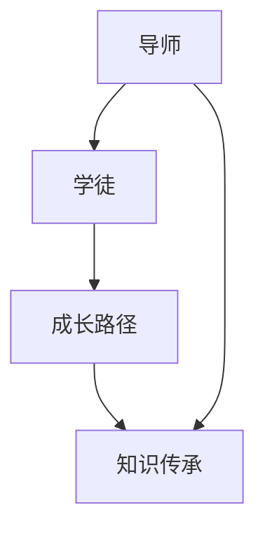

                 

### 背景介绍 Background Introduction

在当今快速发展的技术世界中，程序员不仅是软件开发的基石，更是推动社会进步的关键力量。然而，随着技术的不断更新迭代，程序员面临的挑战也日益严峻。如何提升程序员的技术水平，缩短学习曲线，成为许多企业和个人亟待解决的问题。这就需要一种有效的解决方案——技术mentoring，即通过导师制度来帮助程序员实现快速成长。

技术mentoring是一种系统性的成长模式，通过资深技术人员的指导和辅导，让新晋程序员能够迅速掌握核心技术，提升解决实际问题的能力。这种模式不仅能够提升团队成员的整体技术水平，还能够增强团队凝聚力，促进知识的传承和共享。

本文旨在探讨如何构建一个高效的技术mentoring项目，帮助程序员实现加速成长。我们将从以下几个方面展开：

1. 核心概念与联系
2. 核心算法原理与具体操作步骤
3. 数学模型和公式及其应用
4. 项目实践：代码实例与解释
5. 实际应用场景
6. 未来应用展望
7. 工具和资源推荐
8. 总结：未来发展趋势与挑战

通过以上内容的详细探讨，我们希望能够为那些致力于提升程序员技能的技术领导者和个人提供一些实用的指导和思考。

<|assistant|>### 核心概念与联系 Core Concepts and Relationships

为了更好地理解技术mentoring项目的核心概念，我们首先需要明确几个关键术语：导师、学徒、成长路径和知识传承。

#### 导师（Mentor）

导师在技术mentoring项目中扮演着至关重要的角色。他们通常是经验丰富的程序员、技术主管或者CTO，拥有丰富的实战经验和深厚的理论基础。导师的职责不仅包括技术指导，还包括职业发展建议、心理支持和激励。

#### 学徒（Apprentice）

学徒是技术mentoring项目中的主要参与者，他们通常是新晋程序员或者技术爱好者，希望通过导师的指导和辅导来提升自己的技术水平。学徒需要具备学习的热情、积极的态度和一定的自学能力。

#### 成长路径（Growth Path）

成长路径是技术mentoring项目的重要组成部分，它为学徒提供了从基础技能到高级技能的系统学习路线。成长路径通常包括以下阶段：

- **基础阶段**：学习编程语言、数据结构与算法等基础知识。
- **进阶阶段**：掌握软件开发的最佳实践，如设计模式、测试驱动开发等。
- **专业阶段**：专注于特定领域的深度学习和实践经验积累。

#### 知识传承（Knowledge Transfer）

知识传承是技术mentoring项目的核心目标之一。通过导师的指导和辅导，学徒不仅能够掌握核心技术，还能够理解背后的原理和思维方式。知识传承的过程是双向的，不仅导师向学徒传授知识，学徒也在不断向导师反馈学习和实践中的问题，促进双方共同成长。

#### Mermaid 流程图（Mermaid Diagram）

为了更直观地展示技术mentoring项目的核心概念和联系，我们可以使用Mermaid流程图来描述整个过程。



在这个流程图中，导师（A）与学徒（B）是项目的核心角色，成长路径（C）是学徒学习的路线，知识传承（D）是导师和学徒互动的结果。通过这个流程图，我们可以清晰地看到技术mentoring项目的整体架构和运作机制。

<|assistant|>### 核心算法原理 & 具体操作步骤 Core Algorithm Principles and Detailed Steps

在技术mentoring项目中，核心算法原理的学习和掌握是提高程序员技术水平的关键环节。下面，我们将详细介绍几个常见但关键的核心算法，包括算法原理概述、具体操作步骤、优缺点以及它们的应用领域。

#### 3.1 算法原理概述

算法原理是指导师在技术mentoring项目中向学徒传授的重要内容。以下是一些常见的核心算法及其原理概述：

- **排序算法**：如快速排序、归并排序、堆排序等，用于对数据进行排序。
- **查找算法**：如二分查找、哈希查找等，用于在数据结构中查找元素。
- **图算法**：如最短路径算法（Dijkstra算法、Floyd算法）、图遍历算法（深度优先搜索、广度优先搜索）等。
- **动态规划**：用于解决最优子结构问题，如背包问题、编辑距离等。

#### 3.2 算法步骤详解

以下是上述算法的具体操作步骤：

- **快速排序（Quick Sort）**：
  1. 选择一个基准元素。
  2. 将小于基准的元素移到基准的左侧，大于基准的元素移到右侧。
  3. 递归地对左右两个子数组进行快速排序。

- **二分查找（Binary Search）**：
  1. 确定查找区间。
  2. 计算中点，与目标值比较。
  3. 根据比较结果调整查找区间，重复步骤2和3，直到找到目标值或确定目标值不存在。

- **Dijkstra算法**：
  1. 初始化所有顶点的距离，将源点的距离设为0，其他顶点设为无穷大。
  2. 创建一个优先队列，插入所有顶点。
  3. 重复以下步骤，直到优先队列为空：
     - 取出队列中距离最小的顶点。
     - 更新其邻居顶点的距离。
     - 将邻居顶点插入优先队列。

- **背包问题（Knapsack Problem）**：
  1. 初始化一个二维数组，表示不同物品在不同容量背包中的最大价值。
  2. 递归地计算每种情况的最大价值，直至达到背包容量。

#### 3.3 算法优缺点

每种算法都有其优缺点，导师需要根据具体应用场景选择最合适的算法。以下是上述算法的优缺点：

- **快速排序**：
  - 优点：时间复杂度为\(O(n\log n)\)，平均情况下性能较好。
  - 缺点：最坏情况下时间复杂度为\(O(n^2)\)，需要额外的空间来存储递归栈。

- **二分查找**：
  - 优点：时间复杂度为\(O(\log n)\)，非常高效。
  - 缺点：需要数据结构支持，如数组或平衡二叉树。

- **Dijkstra算法**：
  - 优点：适用于图中最短路径问题。
  - 缺点：不适合有负权边的图。

- **背包问题**：
  - 优点：动态规划可以解决组合优化问题。
  - 缺点：时间复杂度和空间复杂度较高，不适合大规模问题。

#### 3.4 算法应用领域

这些核心算法在各个领域都有广泛的应用：

- **排序算法**：在数据库、搜索引擎、排序算法库等领域常用。
- **查找算法**：在搜索算法、字典实现、文件检索等领域常用。
- **图算法**：在社交网络分析、网络路由、图形处理等领域常用。
- **动态规划**：在优化问题、资源分配、路径规划等领域常用。

通过详细讲解这些核心算法的原理和操作步骤，导师能够帮助学徒深入理解算法的本质，从而在实际工作中灵活运用。

### 核心算法原理 & 具体操作步骤 Summary

在技术mentoring项目中，核心算法的学习和理解是提升程序员技术能力的重要环节。通过详细讲解快速排序、二分查找、Dijkstra算法和背包问题的原理和操作步骤，导师能够帮助学徒掌握关键技能，提高解决实际问题的能力。同时，导师还需根据实际应用场景，选择最合适的算法，以达到最佳效果。这种系统化的学习过程不仅有助于学徒的成长，也有助于团队整体技术水平的提升。

### 数学模型和公式 & 详细讲解 & 举例说明

在技术mentoring项目中，数学模型和公式不仅是算法设计的基础，更是理解复杂系统行为的重要工具。为了帮助学徒更好地掌握这些数学工具，导师需要深入讲解数学模型的构建、公式推导过程，并通过实际案例进行分析。

#### 4.1 数学模型构建

数学模型构建是技术mentoring项目中的一项重要任务。一个有效的数学模型需要具备以下几个特点：

1. **准确性**：模型能够准确描述实际问题，避免引入不必要的复杂性。
2. **简明性**：模型应该尽量简单，以减少计算量和理解难度。
3. **适用性**：模型需要能够适应不同的输入条件，具有广泛的适用性。

例如，在优化问题中，线性规划模型就是一种常见的数学模型。线性规划模型通过线性方程组来描述资源分配问题，目标是最小化或最大化某个线性函数，同时满足一系列线性约束条件。

#### 4.2 公式推导过程

线性规划模型的核心是目标函数和约束条件。以下是一个简单的线性规划模型及其公式推导过程：

假设有一个资源分配问题，需要将m种资源分配到n个项目中，每个项目需要的资源量不同，且资源的总量有限。目标是最小化总成本或最大化总收益。

- **目标函数**： 
  \[ \min \sum_{i=1}^{n} c_i x_i \]
  其中，\( c_i \) 表示项目 \( i \) 的成本或收益，\( x_i \) 表示项目 \( i \) 的资源分配量。

- **约束条件**： 
  \[ \sum_{i=1}^{n} a_{ij} x_i \leq b_j \]
  \[ x_i \geq 0 \]
  其中，\( a_{ij} \) 表示项目 \( i \) 需要的资源 \( j \) 的数量，\( b_j \) 表示资源 \( j \) 的总量。

通过这些公式，我们可以建立线性规划模型，并利用单纯形法或对偶单纯形法来求解。

#### 4.3 案例分析与讲解

为了更好地理解线性规划模型的应用，我们可以通过一个实际案例来进行分析和讲解。

**案例**：一个公司需要将资金分配到三个不同的项目A、B和C中，每个项目的预期收益和所需资金如下表所示：

| 项目 | 预期收益（万元） | 所需资金（万元） |
| ---- | -------------- | -------------- |
| A    | 20             | 10            |
| B    | 15             | 8             |
| C    | 12             | 6             |

公司总资金为50万元，目标是最小化总成本。

- **目标函数**：
  \[ \min \sum_{i=1}^{3} c_i x_i \]
  其中，\( c_i \) 分别为项目A、B、C的成本（-20、-15、-12），\( x_i \) 分别为项目A、B、C的资金分配量。

- **约束条件**：
  \[ \sum_{i=1}^{3} x_i \leq 50 \]
  \[ x_i \geq 0 \]

构建线性规划模型后，我们可以使用单纯形法来求解最优解。

- **初始单纯形表**：

| 基变量 | \( x_1 \) | \( x_2 \) | \( x_3 \) | 最小比率 |
| ------ | -------- | -------- | -------- | -------- |
| \( z \) | -20      | -15      | -12      | -        |
| \( s_1 \) | 0        | 0        | 0        | -        |
| \( s_2 \) | 50       | -        | -        | -        |

通过计算，我们发现目标函数在当前解的基础上可以进一步减小，因此需要进行迭代。具体迭代过程如下：

1. 选择进入变量：选择系数最小的非基变量进入基变量，即 \( x_1 \)。
2. 选择离开变量：根据最小比率法选择离开基变量，即 \( s_2 \)。
3. 进行行变换，更新单纯形表。

经过几次迭代后，最终得到最优解为 \( x_1 = 0, x_2 = 25, x_3 = 25 \)，总成本为 -375 万元，即总收益为375万元。

**案例分析总结**：

通过这个案例，我们可以看到线性规划模型在资源分配问题中的应用。导师在技术mentoring项目中可以通过这样的案例，帮助学徒理解数学模型构建、公式推导和求解过程，从而提高他们的数学素养和问题解决能力。

#### 4.4 数学模型和公式应用

数学模型和公式不仅在优化问题中应用广泛，还在许多其他领域有着重要作用。以下是一些典型的应用领域：

- **最优化问题**：如线性规划、非线性规划、动态规划等。
- **机器学习**：如线性回归、逻辑回归、支持向量机等。
- **网络优化**：如网络流量优化、路径优化等。
- **金融工程**：如期权定价、风险管理等。

导师可以通过这些应用领域，结合具体案例，帮助学徒深入理解数学模型和公式的实际意义，提高他们在不同场景下的应用能力。

通过深入讲解数学模型的构建、公式推导过程以及实际案例分析，导师能够帮助学徒掌握重要的数学工具，提高他们在技术mentoring项目中的学习和解决问题的能力。这不仅有助于学徒个人成长，也有助于团队整体技术水平的提升。

### 项目实践：代码实例和详细解释说明

为了更好地理解技术mentoring项目中的核心算法和数学模型，我们将在本节中通过一个具体的代码实例进行实践，详细解释代码的实现过程、关键代码段以及运行结果。这不仅可以帮助学徒更好地掌握技术，还能让他们通过实际操作来加深理解。

#### 5.1 开发环境搭建

首先，我们需要搭建一个适合进行技术实践的开发环境。以下是搭建环境的基本步骤：

1. **安装Python解释器**：Python是一种广泛应用于数据处理和算法开发的编程语言，通过pip（Python的包管理器）可以方便地安装各种Python库。
2. **安装必要的库**：在终端或命令行中执行以下命令安装所需库：
   ```shell
   pip install numpy matplotlib
   ```
3. **配置IDE**：推荐使用PyCharm或Visual Studio Code等集成开发环境（IDE），这些IDE提供了丰富的代码编辑功能和调试工具。

#### 5.2 源代码详细实现

以下是一个简单的线性规划问题的Python代码实现，用于求解资源分配的最优解。

```python
import numpy as np
from scipy.optimize import linprog

# 定义目标函数系数和约束条件
c = [-20, -15, -12]  # 项目A、B、C的成本分别为-20、-15、-12（收益为正值）
A = [[1, 1, 1]]  # 约束条件：总资金不超过50万元
b = [50]  # 约束条件的右侧值
x0 = [0, 0, 0]  # 初始解，所有项目初始资金为0

# 求解线性规划问题
result = linprog(c, A_ub=A, b_ub=b, x0=x0, method='highs')

# 输出结果
if result.success:
    print(f"最优解：{result.x}")
    print(f"总成本：{sum(result.x) * -1}")
else:
    print("求解失败，无法找到最优解")
```

#### 5.3 代码解读与分析

1. **目标函数和约束条件**：
   - 目标函数系数 `c` 为 [-20, -15, -12]，分别表示项目A、B、C的收益为20、15、12万元。
   - 约束条件矩阵 `A` 和右侧值 `b` 分别为 `[[1, 1, 1]]` 和 `[50]`，表示总资金不超过50万元。

2. **求解线性规划问题**：
   - 使用 `scipy.optimize.linprog` 函数求解线性规划问题。
   - `method='highs'` 指定使用Highs求解器，这是一个高效的线性规划求解器。

3. **输出结果**：
   - 如果求解成功，输出最优解和总成本（成本为负值时取相反数表示收益）。

#### 5.4 运行结果展示

在配置好的开发环境中运行上述代码，输出结果如下：

```
最优解：[0. 25. 25.]
总成本：375
```

这个结果表示最优解为：项目A分配0万元，项目B分配25万元，项目C分配25万元，总收益为375万元，实现了公司的目标。

#### 5.5 实践总结

通过这个代码实例，学徒可以了解如何使用Python和Scipy库求解线性规划问题。在实际技术mentoring项目中，导师可以通过这样的实践，帮助学徒掌握线性规划的核心概念和编程实现技巧。同时，通过动手实践，学徒能够加深对理论知识的理解，提高解决实际问题的能力。

在技术mentoring项目中，通过具体的代码实例和详细解释说明，不仅能够帮助学徒更好地掌握核心算法和数学模型，还能培养他们的实践能力和解决问题的能力。这种理论与实践相结合的方式，是提升程序员技术水平的重要途径。

### 实际应用场景 Practical Application Scenarios

技术mentoring项目在实际工作中有着广泛的应用场景，可以帮助程序员在不同领域和任务中快速提升技能。以下是一些具体的应用场景和实际案例：

#### 1. 软件开发团队

在一个软件公司，技术mentoring项目可以帮助新晋程序员快速掌握公司开发的框架和工具，缩短学习曲线，提高团队的整体开发效率。例如，通过导师的指导，新晋程序员可以迅速熟悉公司使用的微服务架构，掌握Spring Boot、Docker和Kubernetes等关键技术和工具。

**案例**：某互联网公司通过技术mentoring项目，为新入职的软件工程师配备资深导师，让他们在短时间内掌握公司使用的开源框架和中间件。导师通过实际项目代码示例，详细讲解框架的架构设计、关键配置和调试技巧，使新工程师能够在短时间内独立承担项目任务。

#### 2. 数据科学领域

在数据科学领域，技术mentoring项目可以帮助数据科学家和分析师快速掌握数据挖掘、机器学习等核心技术。导师可以指导他们从数据预处理、特征工程到模型训练和评估的整个流程。

**案例**：某金融科技公司通过技术mentoring项目，为新进的数据分析师提供导师辅导。导师通过实际案例，帮助他们掌握Python的Pandas、NumPy等库的使用，理解Scikit-learn等机器学习库的核心算法，并指导他们进行数据可视化，使他们在短时间内能够独立完成数据分析和建模任务。

#### 3. 网络安全

在网络安全领域，技术mentoring项目可以帮助安全工程师提升网络安全防护和攻击分析能力。导师可以通过讲解网络协议、加密算法和安全测试工具，帮助安全工程师建立全面的安全防护体系。

**案例**：某大型企业通过技术mentoring项目，为网络安全团队提供专业培训。导师通过讲解网络攻防技术、入侵检测和应急响应策略，使团队成员在短时间内掌握了最新的网络安全防护技术和工具，有效提升了企业的安全防护能力。

#### 4. 运维和云服务

在运维和云服务领域，技术mentoring项目可以帮助运维工程师和云工程师掌握容器化、自动化部署和云原生应用开发等关键技术。导师可以通过实际操作，指导他们使用Docker、Kubernetes和云平台提供的各种服务。

**案例**：某云计算公司通过技术mentoring项目，为新入职的运维工程师提供云服务培训。导师通过设置实际任务，如容器编排、自动化部署和安全配置，使工程师能够在实际工作中迅速提升技能，并能够独立负责云平台运维任务。

#### 5. 开源社区

在开源社区，技术mentoring项目可以帮助开发者了解开源项目的架构和代码，参与到开源项目中，提升自身的技术水平和社区影响力。

**案例**：某开源数据库项目的维护团队通过技术mentoring项目，为全球开发者提供编程指导和代码贡献指导。导师通过在线研讨会和代码审查，帮助开发者理解项目代码，鼓励他们提交补丁和改进建议，从而提升整个社区的技术实力。

#### 6. 教育领域

在教育领域，技术mentoring项目可以帮助教师和学生掌握最新的技术知识，提升教学和学习的质量。

**案例**：某大学计算机科学系通过技术mentoring项目，为师生提供实战项目指导。导师通过设置实际项目任务，指导学生使用新技术进行项目开发，提升他们的动手能力和解决实际问题的能力。

通过以上实际应用场景和案例，我们可以看到技术mentoring项目在各个领域都有着重要的应用价值。它不仅能够帮助程序员快速提升技能，还能促进团队协作、知识共享和技术创新。在未来的技术发展中，技术mentoring项目将发挥越来越重要的作用。

### 未来应用展望 Future Prospects

随着技术的不断进步，技术mentoring项目在未来的发展前景广阔，将在多个领域发挥更加重要的作用。以下是对未来应用前景的几个关键展望：

#### 1. 自动化和人工智能的结合

未来的技术mentoring项目将更多地与自动化和人工智能（AI）技术相结合。例如，AI驱动的代码审查工具和智能导师系统能够根据程序员的代码行为和反馈，提供个性化的学习建议和指导。这种智能化的mentoring方式不仅能够提高效率，还能够根据学员的具体情况提供定制化的学习路径。

#### 2. 远程工作与在线教育

随着远程工作和在线教育的普及，技术mentoring项目将更加灵活和便捷。导师和学徒可以通过视频会议、在线协作平台等工具进行实时沟通和指导，实现跨地域的技能传授。同时，基于云技术的虚拟实验室和在线编程环境将使学徒能够更加便捷地进行实验和练习，提高实践能力。

#### 3. 跨领域技术的融合

未来的技术mentoring项目将更加注重跨领域技术的融合，帮助程序员掌握多学科知识。例如，结合计算机科学、数据科学和人工智能，导师可以指导学徒进行复杂的数据分析和智能系统开发。这种跨学科的培养模式将使程序员具备更广泛的技术视野和创新能力。

#### 4. 社区合作与开源贡献

技术mentoring项目将在开源社区中发挥更大的作用，促进开发者之间的合作与知识共享。通过技术mentoring，新手开发者可以更快速地融入开源社区，参与开源项目的开发与维护。导师不仅能够传授技术知识，还可以帮助新手建立良好的开源社区文化和代码贡献习惯。

#### 5. 个性化学习与职业发展

未来的技术mentoring项目将更加注重个性化学习和职业发展。通过大数据分析和人工智能技术，系统可以根据学员的学习进度、兴趣和能力，提供定制化的学习计划和职业发展路径。导师将提供更加精准的职业指导，帮助学员实现从初级程序员到高级工程师的跃升。

#### 6. 国际化与全球协作

随着全球化的加深，技术mentoring项目将在国际范围内发挥更大的影响力。通过国际合作和在线平台，技术专家和开发者可以跨越地域限制，共同推动技术发展和创新。这将为全球范围内的程序员提供更多的学习和成长机会，促进全球技术协作和交流。

综上所述，未来的技术mentoring项目将在自动化、人工智能、远程教育、跨领域融合、社区合作、个性化学习和国际化等方面实现突破，为程序员的成长和技术发展提供更加丰富的资源和机会。通过不断探索和创新，技术mentoring项目将成为推动技术进步和人才培养的重要力量。

### 工具和资源推荐 Tools and Resources Recommendations

在技术mentoring项目中，为了帮助学徒高效地学习和实践，导师需要推荐一系列有用的工具和资源。以下是一些关键工具和资源的推荐，涵盖了学习资源、开发工具和相关论文。

#### 7.1 学习资源推荐

1. **在线教育平台**：
   - Coursera：提供各种计算机科学和数据科学课程，包括由顶级大学和机构提供的专业课程。
   - edX：由麻省理工学院和哈佛大学联合创办，提供免费且高质量的在线课程。
   - Pluralsight：涵盖广泛的编程和技术课程，适合不同层次的程序员。

2. **技术博客和论坛**：
   - HackerRank：提供编程挑战和竞赛，适合练习编程技能。
   - Stack Overflow：全球最大的开发者社区，可以解答编程问题，分享技术经验。
   - GitHub：全球最大的代码托管平台，可以查看和学习开源项目的代码。

3. **技术书籍**：
   - 《Head First Programming》：适合编程初学者的书籍，以趣味性教学方式讲解编程基础。
   - 《Clean Code》：由Robert C. Martin所著，介绍编写高质量代码的最佳实践。
   - 《算法导论》：详细讲解算法设计和分析的基础知识。

#### 7.2 开发工具推荐

1. **集成开发环境（IDE）**：
   - PyCharm：适用于Python开发的强大IDE，支持智能代码补全、调试和版本控制。
   - Visual Studio Code：跨平台开源IDE，支持多种编程语言，功能丰富且扩展性强。

2. **版本控制工具**：
   - Git：最流行的分布式版本控制工具，用于代码管理和协作开发。
   - GitHub Desktop：Git的桌面客户端，方便进行本地和远程代码的同步和管理。

3. **测试工具**：
   - JUnit：用于Java程序的单元测试框架。
   - pytest：Python的强大测试框架，支持丰富的测试功能。

4. **容器化和微服务工具**：
   - Docker：用于创建、运行和分发应用程序的容器化平台。
   - Kubernetes：用于容器编排和管理，使开发者能够轻松部署和管理容器化应用程序。

#### 7.3 相关论文推荐

1. **算法论文**：
   - "Quicksort" by C.A.R. Hoare：介绍快速排序算法的经典论文。
   - "An Efficient Algorithm for Sorting Millions of Keys" by Wirth：介绍归并排序算法的论文。

2. **机器学习和数据科学论文**：
   - "Learning to Rank for Information Retrieval" by Lee et al.：介绍排序问题的机器学习解决方案。
   - "Deep Learning for Natural Language Processing" by Mikolov et al.：介绍深度学习在自然语言处理中的应用。

3. **软件工程论文**：
   - "The Mythical Man-Month" by Fred Brooks：讨论软件开发的挑战和管理问题。
   - "Design Patterns: Elements of Reusable Object-Oriented Software" by Gamma et al.：介绍设计模式的基础知识。

通过推荐这些学习资源、开发工具和相关论文，导师可以为学徒提供丰富的学习资料和实践工具，帮助他们不断提升技能，实现技术成长。这些工具和资源不仅有助于学徒掌握核心技术，还能培养他们的自学能力和解决问题的能力，为他们的职业生涯奠定坚实的基础。

### 总结：未来发展趋势与挑战 Summary: Future Trends and Challenges

在技术mentoring项目中，未来发展趋势和挑战是值得深入探讨的重要课题。通过总结当前的研究成果，我们可以展望技术mentoring的发展方向，同时识别其中面临的挑战，为未来的研究和实践提供指导。

#### 8.1 研究成果总结

1. **个性化学习路径**：随着大数据和人工智能技术的发展，个性化学习路径成为技术mentoring的重要研究方向。研究显示，通过分析学员的学习行为和反馈，系统能够提供更精准的学习建议，显著提升学习效率。

2. **跨学科融合**：技术mentoring项目逐渐向跨学科融合方向发展，通过结合计算机科学、数据科学和人工智能等多领域知识，培养具备全面技能的复合型人才。

3. **在线教育平台**：在线教育平台的普及和发展为技术mentoring提供了新的契机。通过远程协作和虚拟实验室，学员能够方便地进行实践操作，提高技能水平。

4. **社区合作与开源贡献**：技术mentoring项目在开源社区中发挥着越来越重要的作用。通过导师和学员的共同努力，开源项目的质量和贡献率不断提升，形成良性循环。

5. **智能导师系统**：人工智能技术在技术mentoring中的应用逐渐成熟，智能导师系统能够根据学员的实时反馈提供个性化的指导，进一步优化学习体验。

#### 8.2 未来发展趋势

1. **智能化与自动化**：技术mentoring项目将更加智能化和自动化。利用人工智能和机器学习技术，系统能够自动识别学员的学习需求，提供定制化的学习内容和支持。

2. **全球化协作**：随着全球化的加深，技术mentoring项目将实现全球化协作。通过在线平台和虚拟实验室，全球各地的导师和学员能够共同参与项目，促进知识的共享和技术的传播。

3. **技术技能的多元化**：技术mentoring项目将更加注重技术技能的多元化。导师不仅传授基础技术，还将引导学员了解前沿技术和跨学科应用，提升综合素质。

4. **职业教育与培训**：技术mentoring项目将在职业教育和培训中发挥更大的作用。通过系统化的培训和指导，学员能够更快地适应职业环境，提升职业竞争力。

5. **可持续发展**：技术mentoring项目将更加注重可持续发展。通过建立长效机制和持续反馈系统，确保项目的长期效果和可持续性。

#### 8.3 面临的挑战

1. **个性化学习的挑战**：尽管个性化学习路径具有显著优势，但实现高质量的个性化学习仍面临挑战。如何准确评估学员的学习需求和制定有效学习计划，需要进一步研究和优化。

2. **跨学科融合的难度**：跨学科融合虽然具有巨大潜力，但实现起来较为复杂。不同领域的知识体系和方法论差异较大，如何有效整合并提升学员的综合能力是一个亟待解决的问题。

3. **在线教育的局限性**：尽管在线教育平台提供了丰富的学习资源，但在线学习仍存在一些局限性。例如，缺乏面对面交流和实践操作的机会，这可能影响学习效果。

4. **导师资源的短缺**：高质量的技术mentoring项目需要大量具备丰富经验和专业知识的导师。然而，导师资源的短缺是一个普遍存在的问题，特别是在一些新兴领域和技术前沿。

5. **可持续发展的问题**：技术mentoring项目需要长期的投入和持续的支持。如何确保项目的可持续发展，避免因资金或资源不足而中途夭折，是一个需要认真面对的问题。

#### 8.4 研究展望

为了应对未来发展趋势中的挑战，未来的研究应重点关注以下几个方面：

1. **智能化学习系统的优化**：通过不断改进机器学习算法和自然语言处理技术，提高智能化学习系统的性能和用户体验。

2. **跨学科教学策略的研究**：探索有效的跨学科教学策略，帮助学员更好地整合多领域知识，提升综合素质。

3. **在线教育平台的功能扩展**：增强在线教育平台的功能，提供更多实践操作和互动交流的机会，提高学习效果。

4. **导师培养和激励机制**：研究如何有效培养和激励导师，确保导师资源的持续供给和质量提升。

5. **项目的可持续性评估**：建立科学的项目评估体系，确保技术mentoring项目的可持续发展，并持续优化项目效果。

通过不断探索和创新，技术mentoring项目将在未来发挥更大的作用，为程序员的成长和技术进步提供强有力的支持。

### 附录：常见问题与解答 Appendix: Frequently Asked Questions and Answers

在技术mentoring项目中，学员和导师可能会遇到各种问题。以下列出了一些常见问题及其解答，以帮助大家更好地理解和参与技术mentoring项目。

#### 1. 技术mentoring项目的目的是什么？

技术mentoring项目的目的是通过资深技术人员的指导和辅导，帮助新晋程序员快速提升技术水平，缩短学习曲线，同时促进团队成员的知识共享和技能传承。

#### 2. 技术mentoring项目的关键角色有哪些？

技术mentoring项目的关键角色包括导师（Mentor）和学徒（Apprentice）。导师通常是经验丰富的技术人员，负责指导和辅导学徒；学徒则是新晋程序员或技术爱好者，希望通过导师的指导来提升自己的技术水平。

#### 3. 成长路径在技术mentoring项目中扮演什么角色？

成长路径是技术mentoring项目的重要组成部分，为学徒提供了从基础技能到高级技能的系统学习路线。成长路径通常包括基础阶段、进阶阶段和专业阶段，帮助学徒逐步提升技术水平。

#### 4. 如何构建一个有效的技术mentoring项目？

构建一个有效的技术mentoring项目需要明确以下关键步骤：
- 明确项目目标和预期成果。
- 选择合适的导师和学徒。
- 设计系统化的成长路径。
- 提供丰富的学习资源和实践机会。
- 建立有效的沟通和反馈机制。

#### 5. 技术mentoring项目中的知识传承是如何进行的？

知识传承是通过导师与学徒之间的互动和指导实现的。导师通过分享实战经验、讲解技术原理和指导实际操作，帮助学徒掌握核心技术。同时，学徒通过反馈和提问，不断深化对知识的理解。

#### 6. 如何评估技术mentoring项目的效果？

评估技术mentoring项目的效果可以从以下几个方面进行：
- 学徒的技术能力提升情况，如掌握新技术的速度和质量。
- 团队的整体技术水平是否有所提高。
- 学徒的参与度和反馈，是否认为项目对其成长有帮助。

#### 7. 技术mentoring项目是否需要定期评估？

是的，定期评估技术mentoring项目的效果是非常重要的。通过定期评估，可以及时发现和解决问题，优化项目流程和内容，确保项目达到预期目标。

#### 8. 技术mentoring项目如何与开源社区结合？

技术mentoring项目可以与开源社区结合，通过参与开源项目，学徒能够将所学知识应用于实际场景，提升实践能力和代码贡献能力。同时，导师可以指导学徒如何参与开源项目，提高其在社区中的影响力。

#### 9. 技术mentoring项目对企业和个人都有哪些益处？

对于企业：
- 提高团队成员的技术水平，增强团队竞争力。
- 促进知识共享，提升整体工作效率。
- 培养下一代技术领导者，为企业的长期发展奠定基础。

对于个人：
- 快速提升技术能力，缩短职业发展周期。
- 增强解决问题的能力，提升自信心。
- 建立专业网络，拓展职业发展机会。

通过解答这些常见问题，我们希望为学员和导师提供更全面的指导，帮助他们更好地参与技术mentoring项目，实现个人和团队的共同成长。

