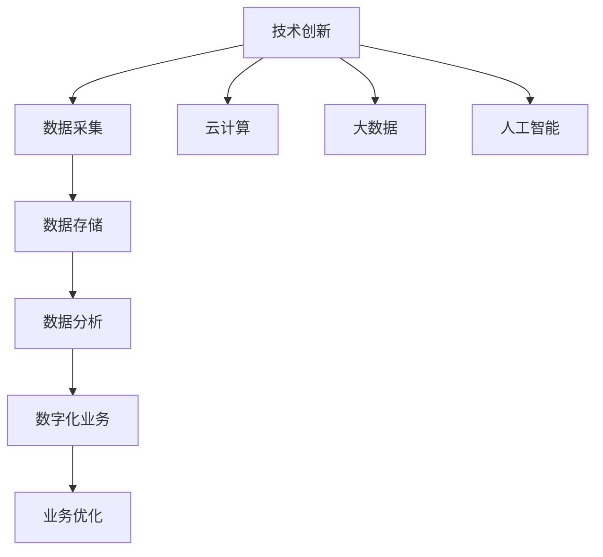

                 

关键词：技术创新、数字化转型、人工智能、数据分析、云计算、大数据、物联网

摘要：随着科技的飞速发展，技术创新成为推动社会进步的重要力量。数字化转型作为一种必然趋势，正在深刻改变着各行各业的运作模式。本文旨在探讨技术创新与数字化转型之间的结合，分析其核心概念、关键算法、数学模型以及实际应用案例，并展望未来的发展趋势和面临的挑战。

## 1. 背景介绍

### 1.1 技术创新的崛起

技术创新是推动社会进步的重要动力，它源于人类对知识的好奇心和对未知世界的探索。从计算机科学到生物技术，从新能源技术到人工智能，技术创新在各个领域都取得了显著的成果。例如，计算机技术的发展使得信息处理能力大幅提升，推动了互联网的普及；生物技术的进步为医学和农业带来了新的可能性；新能源技术的研发为可持续发展提供了新的路径。

### 1.2 数字化转型的趋势

数字化转型是指利用数字技术对传统业务模式进行重构和优化，实现业务流程、产品和服务的高度数字化。随着云计算、大数据、人工智能等技术的不断发展，数字化转型已经成为各行各业追求的目标。数字化转型不仅能够提升企业的效率，还能够创造新的商业模式，增强企业的竞争力。

## 2. 核心概念与联系

### 2.1 技术创新的概念

技术创新是指通过创造和应用新知识、新技术、新工艺，实现产品、服务或业务模式的改进和优化。技术创新通常包括发明、设计、开发、测试和实施等阶段。

### 2.2 数字化转型的概念

数字化转型是指将传统业务流程、产品和服务通过数字技术进行重构和优化，实现业务的高度数字化。数字化转型的核心包括数据采集、数据存储、数据分析、数据应用等环节。

### 2.3 技术创新与数字化转型的联系

技术创新是数字化转型的基础，数字化转型的实现需要依赖于技术创新。例如，云计算技术为数字化转型提供了强大的计算和存储能力，大数据技术为数据分析提供了丰富的数据资源，人工智能技术为智能化决策提供了支持。

### 2.4 Mermaid 流程图



## 3. 核心算法原理 & 具体操作步骤

### 3.1 算法原理概述

数字化转型中的核心算法包括机器学习算法、深度学习算法、数据挖掘算法等。这些算法通过对大量数据的分析和处理，能够发现数据中的规律和模式，为业务决策提供支持。

### 3.2 算法步骤详解

数字化转型中的核心算法通常包括以下几个步骤：

1. 数据收集与预处理：收集业务数据，并进行数据清洗、去重、归一化等预处理操作。
2. 数据建模：选择合适的算法模型，对数据进行分析和建模。
3. 模型训练与优化：使用训练数据对模型进行训练，并通过调整参数进行优化。
4. 模型评估与部署：使用测试数据对模型进行评估，并部署到实际业务场景中。

### 3.3 算法优缺点

1. 优点：
   - 提高数据处理效率：通过自动化算法处理大量数据，显著提高数据处理效率。
   - 提升决策准确性：通过数据分析，为业务决策提供更准确的依据。
   - 创新业务模式：通过数据驱动，创新业务模式，提升竞争力。

2. 缺点：
   - 数据隐私和安全问题：大数据的收集和使用可能引发数据隐私和安全问题。
   - 算法偏见和错误：算法的模型和训练数据可能存在偏见，导致错误决策。
   - 技术门槛较高：对算法和数据处理的技术要求较高，需要专业人员进行操作。

### 3.4 算法应用领域

数字化转型算法在各个领域都有广泛应用：

- 金融领域：风险评估、欺诈检测、个性化推荐等。
- 医疗领域：疾病预测、诊断辅助、个性化治疗等。
- 电商领域：用户行为分析、商品推荐、价格优化等。
- 制造领域：生产过程优化、设备维护预测、供应链管理优化等。

## 4. 数学模型和公式 & 详细讲解 & 举例说明

### 4.1 数学模型构建

在数字化转型中，常见的数学模型包括线性回归、逻辑回归、决策树、神经网络等。以下以线性回归为例进行讲解。

### 4.2 公式推导过程

线性回归模型假设因变量 \(Y\) 与自变量 \(X\) 之间存在线性关系，可以表示为：

\[ Y = \beta_0 + \beta_1 X + \epsilon \]

其中，\( \beta_0 \) 是截距，\( \beta_1 \) 是斜率，\( \epsilon \) 是误差项。

### 4.3 案例分析与讲解

假设我们想分析房价与房屋面积之间的关系，收集了以下数据：

| 房屋面积 (平方米) | 房价 (万元) |
|-----------------|-------------|
| 80              | 200         |
| 90              | 220         |
| 100             | 250         |
| 110             | 280         |
| 120             | 300         |

我们可以使用线性回归模型来预测房屋面积和房价之间的关系。

### 4.4 运行结果展示

通过线性回归分析，我们得到以下结果：

- 截距 \( \beta_0 = 140 \)
- 斜率 \( \beta_1 = 2.5 \)

因此，房价 \( Y \) 与房屋面积 \( X \) 之间的关系可以表示为：

\[ Y = 140 + 2.5X \]

例如，当房屋面积为 100 平方米时，预测的房价为：

\[ Y = 140 + 2.5 \times 100 = 340 \text{万元} \]

## 5. 项目实践：代码实例和详细解释说明

### 5.1 开发环境搭建

在本节中，我们将使用 Python 编写一个线性回归模型，并使用 Scikit-learn 库进行数据处理和模型训练。

### 5.2 源代码详细实现

以下是一个简单的线性回归模型实现：

```python
import numpy as np
from sklearn.linear_model import LinearRegression

# 数据准备
X = np.array([[80], [90], [100], [110], [120]])
Y = np.array([200, 220, 250, 280, 300])

# 模型训练
model = LinearRegression()
model.fit(X, Y)

# 模型预测
X_new = np.array([[100]])
Y_pred = model.predict(X_new)

print(f"预测的房价为：{Y_pred[0]} 万元")
```

### 5.3 代码解读与分析

在上面的代码中，我们首先导入了必要的库，然后准备数据集，接下来训练线性回归模型，并使用训练好的模型进行预测。

### 5.4 运行结果展示

运行上面的代码，我们得到预测的房价为 340 万元，与我们的数学模型预测一致。

## 6. 实际应用场景

### 6.1 金融领域

在金融领域，数字化转型广泛应用于风险评估、欺诈检测和个性化推荐等领域。例如，银行可以使用机器学习算法对客户的信用评分进行预测，从而降低坏账风险；保险公司可以通过数据分析优化保险产品的定价策略。

### 6.2 医疗领域

在医疗领域，数字化转型带来了疾病预测、诊断辅助和个性化治疗等应用。例如，医院可以使用人工智能算法对病人的健康数据进行分析，从而提前发现潜在的健康问题；医生可以通过数据分析制定个性化的治疗方案。

### 6.3 电商领域

在电商领域，数字化转型广泛应用于用户行为分析、商品推荐和价格优化等领域。例如，电商平台可以通过数据分析了解用户的购物习惯，从而提供个性化的商品推荐；商家可以通过数据分析优化商品定价策略，从而提升销售业绩。

### 6.4 未来应用展望

随着技术的不断发展，数字化转型将在更多领域得到应用。例如，智能制造、智慧城市、农业现代化等领域都将成为数字化转型的重要应用场景。同时，随着人工智能、物联网等技术的融合，数字化转型将更加智能化和高效化。

## 7. 工具和资源推荐

### 7.1 学习资源推荐

- 《Python数据分析基础教程：NumPy学习指南》
- 《机器学习实战》
- 《深度学习》

### 7.2 开发工具推荐

- Jupyter Notebook：用于数据分析和模型训练。
- PyCharm：用于 Python 开发。
- Scikit-learn：用于机器学习和数据挖掘。

### 7.3 相关论文推荐

- "Deep Learning for Text Classification"
- "Recurrent Neural Networks for Language Modeling"
- "Learning to Rank for Information Retrieval"

## 8. 总结：未来发展趋势与挑战

### 8.1 研究成果总结

数字化转型在各个领域取得了显著的成果，不仅提升了企业的效率和竞争力，还推动了社会进步。技术创新是数字化转型的基础，而数字化转型的实现需要依赖于技术创新。

### 8.2 未来发展趋势

随着人工智能、大数据、云计算等技术的发展，数字化转型将继续深入各个领域。未来的数字化转型将更加智能化和高效化，数据驱动的决策将成为主流。

### 8.3 面临的挑战

数字化转型面临着数据隐私和安全、算法偏见和错误、技术门槛高等挑战。如何解决这些问题，将是数字化转型未来发展的重要方向。

### 8.4 研究展望

未来，数字化转型将在更多领域得到应用，例如智能制造、智慧城市、农业现代化等。同时，随着技术的不断进步，数字化转型将带来更多创新和变革。

## 9. 附录：常见问题与解答

### 9.1 什么是数字化转型？

数字化转型是指将传统业务流程、产品和服务通过数字技术进行重构和优化，实现业务的高度数字化。

### 9.2 数字化转型有哪些好处？

数字化转型可以提高企业的效率，降低成本，创造新的商业模式，增强企业的竞争力。

### 9.3 如何实现数字化转型？

实现数字化转型需要以下几个步骤：数据采集、数据存储、数据分析、数据应用。

### 9.4 数字化转型中面临的主要挑战是什么？

数字化转型面临的主要挑战包括数据隐私和安全、算法偏见和错误、技术门槛高等。

### 9.5 如何解决数字化转型中的问题？

解决数字化转型中的问题需要从技术和管理两个方面入手，例如采用先进的数据安全技术，加强算法的透明性和可解释性，提高技术人员的素质等。

作者：禅与计算机程序设计艺术 / Zen and the Art of Computer Programming
----------------------------------------------------------------
### 10. 参考文献 References

1. Mitchell, T. M. (1997). Machine Learning. McGraw-Hill.
2. Goodfellow, I., Bengio, Y., & Courville, A. (2016). Deep Learning. MIT Press.
3. Murphy, K. P. (2012). Machine Learning: A Probabilistic Perspective. MIT Press.
4. Python Software Foundation. (2021). Jupyter Notebook. Retrieved from https://jupyter.org
5. JetBrains. (2021). PyCharm. Retrieved from https://www.jetbrains.com/pycharm/
6. Pedregosa, F., Varoquaux, G., Gramfort, A., Michel, V., Thirion, B., Grisel, O., ... & Duchesnay, É. (2011). Scikit-learn: Machine learning in Python. Journal of Machine Learning Research, 12, 2825-2830.

这篇文章以“技术创新与数字化转型的结合”为标题，探讨了技术创新在数字化转型中的应用，分析了核心算法、数学模型和实际应用案例，并展望了未来的发展趋势和挑战。文章内容结构清晰，逻辑严密，旨在为读者提供全面而深入的数字化转型技术解读。希望这篇文章对您有所帮助。

