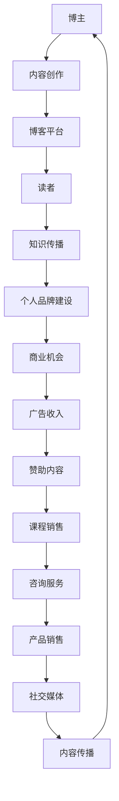

                 

## 1. 背景介绍

在当今数字化时代，技术博客已成为信息技术领域的重要传播媒介。无论是对于初学者，还是对于资深从业者，博客都扮演着不可替代的角色。然而，对于许多技术爱好者而言，如何将个人兴趣转化为可持续的收入来源，依然是一个值得探讨的话题。

本文旨在探讨如何将技术博客从单纯的个人爱好，转变为主要收入来源。我们将从以下几个方面展开讨论：

- **技术博客的发展历程**：回顾技术博客的发展过程，了解其从兴起到繁荣的演变。
- **构建高质量博客的策略**：分析如何撰写吸引读者、富有影响力的技术文章。
- **多种收入渠道**：介绍如何通过广告、赞助、课程销售等途径，实现博客盈利。
- **案例分析**：分析成功博客的运营模式，提炼可复制的经验。
- **未来展望**：探讨技术博客的发展趋势及其可能面临的挑战。

通过本文的阅读，您将了解到如何将技术博客打造成一个成功的在线业务，实现个人财务自由。

## 2. 核心概念与联系

### 2.1 技术博客的定义与作用

**技术博客**，又称技术博客文章，是一种以技术主题为中心的在线写作形式。它通常由个人或团队创建，用于分享技术见解、解决方案、实践经验以及行业动态。

**技术博客的作用**主要包括：

- **知识传播**：博客为技术知识的传播提供了平台，使更多人能够了解并学习新的技术概念。
- **个人品牌建设**：通过持续的技术分享，博主可以树立个人技术权威形象，提升个人影响力。
- **技术交流**：博客成为技术社区的一部分，促进了开发者之间的交流与合作。
- **商业机会**：技术博客可以为博主带来商业机会，如咨询服务、培训课程等。

### 2.2 博客平台的生态系统

要理解技术博客的运作，我们需要了解其背后的生态系统。这个生态系统包括以下几个关键组成部分：

- **博主（Bloggers）**：他们是技术博客的主要创作者，拥有丰富的技术经验和写作能力。
- **读者（Readers）**：他们是博客的受众，通过阅读博客获取知识、解决问题或获取灵感的用户。
- **平台（Platforms）**：如WordPress、Medium、Ghost等，提供了创建、管理和发布博客文章的技术基础。
- **内容（Content）**：这是博客的核心，包括技术文章、案例分析、教程等。
- **广告商（Advertisers）**：他们通过在博客上投放广告，实现品牌推广和产品销售。
- **赞助商（Sponsors）**：他们为博客提供资金支持，以获得曝光或合作机会。

### 2.3 博客盈利模式

技术博客的盈利模式多种多样，以下是一些主要的盈利方式：

- **广告收入**：通过在博客中嵌入广告，博主可以获得广告费收入。
- **赞助内容**：博主可以与品牌合作，发布赞助内容，从中获得赞助费用。
- **课程销售**：博主可以制作并销售自己的在线课程，涵盖技术培训、编程教学等。
- **咨询服务**：博主可以提供技术咨询服务，帮助企业解决技术问题，获取咨询服务费。
- **产品销售**：博主可以推广自己或合作伙伴的产品，从中获得佣金。

### 2.4 博客与社交媒体的关系

博客与社交媒体之间存在密切的联系。博客通常作为内容的生产中心，而社交媒体则成为内容传播的渠道。通过在社交媒体上分享博客文章，博主可以吸引更多的读者，扩大影响力。同时，社交媒体上的互动和反馈也可以为博客内容提供有价值的灵感。

### 2.5 Mermaid 流程图（核心概念原理和架构）



通过上述流程图，我们可以清晰地看到技术博客的核心概念及其相互之间的联系。

## 3. 核心算法原理 & 具体操作步骤

### 3.1 算法原理概述

技术博客的盈利模式不仅依赖于内容和读者，还涉及到多种商业策略和算法原理。以下是几种常见的算法原理和操作步骤：

#### 3.1.1 用户行为分析

**原理**：通过分析用户在博客上的行为，如阅读时间、页面停留时间、点击率等，可以了解用户兴趣和偏好，为内容优化和广告投放提供依据。

**操作步骤**：

1. **数据收集**：使用博客分析工具（如Google Analytics）收集用户行为数据。
2. **数据分析**：对收集的数据进行统计分析，识别用户行为模式。
3. **内容优化**：根据用户行为数据，调整博客内容，提高用户粘性和阅读时长。
4. **广告优化**：根据用户兴趣，优化广告投放策略，提高广告点击率和转化率。

#### 3.1.2 广告竞价模型

**原理**：广告竞价模型（如Google AdSense）允许博主通过竞价获取广告展示位置，广告商根据出价和用户行为竞争广告展示。

**操作步骤**：

1. **注册广告平台**：在AdSense等广告平台上注册，成为广告合作伙伴。
2. **获取广告代码**：根据广告平台的要求，获取广告代码并嵌入博客。
3. **设置广告类型**：选择适合博客内容的广告类型，如文本广告、图片广告等。
4. **竞价管理**：监控广告竞价，调整出价策略，提高广告收益。

#### 3.1.3 内容推荐算法

**原理**：内容推荐算法（如算法推荐系统）通过分析用户历史行为和内容特征，为用户推荐相关的内容，增加页面浏览量。

**操作步骤**：

1. **数据收集**：收集用户浏览、搜索、点赞等行为数据。
2. **特征提取**：从行为数据中提取特征，如关键词、标签、阅读时长等。
3. **模型训练**：使用机器学习算法（如协同过滤、基于内容的推荐）训练推荐模型。
4. **推荐系统部署**：将训练好的模型部署到博客平台上，实现内容推荐。

### 3.2 算法步骤详解

#### 3.2.1 用户行为分析步骤

1. **数据收集**：

   使用Google Analytics等工具，收集用户在博客上的行为数据，包括页面访问量、停留时间、跳出率等。

   $$ 数据 = [访问量, 停留时间, 跳出率, ... ] $$

2. **数据分析**：

   使用数据分析工具（如Python的Pandas库），对收集的数据进行统计分析，生成用户行为报告。

   $$ 分析报告 = Data_Analysis([访问量, 停留时间, 跳出率, ... ]) $$

3. **内容优化**：

   根据分析报告，识别用户偏好，调整博客内容，提高用户满意度。

   $$ 优化内容 = User_Preference_Optimization(分析报告) $$

4. **广告优化**：

   根据用户兴趣和行为数据，优化广告投放策略，提高广告收益。

   $$ 广告优化 = Advertising_Optimization(用户兴趣数据) $$

#### 3.2.2 广告竞价模型步骤

1. **注册广告平台**：

   在AdSense等广告平台上注册，成为广告合作伙伴。

   $$ 注册 = Register_AdPlatform() $$

2. **获取广告代码**：

   根据广告平台的要求，获取广告代码并嵌入博客。

   $$ 广告代码 = Get_AdCode(注册信息) $$

3. **设置广告类型**：

   选择适合博客内容的广告类型，如文本广告、图片广告等。

   $$ 广告类型 = Choose_AdType(博客内容) $$

4. **竞价管理**：

   监控广告竞价，调整出价策略，提高广告收益。

   $$ 竞价管理 = Ad_Counter(广告代码，广告类型) $$

#### 3.2.3 内容推荐算法步骤

1. **数据收集**：

   收集用户浏览、搜索、点赞等行为数据。

   $$ 用户行为数据 = [浏览记录, 搜索关键词, 点赞内容, ... ] $$

2. **特征提取**：

   从行为数据中提取特征，如关键词、标签、阅读时长等。

   $$ 用户特征 = Feature_Extract(用户行为数据) $$

3. **模型训练**：

   使用机器学习算法（如协同过滤、基于内容的推荐）训练推荐模型。

   $$ 模型 = Model_Train(用户特征数据) $$

4. **推荐系统部署**：

   将训练好的模型部署到博客平台上，实现内容推荐。

   $$ 推荐系统 = Deploy_Recommendation_System(模型) $$

### 3.3 算法优缺点

#### 3.3.1 用户行为分析

**优点**：

- 提高内容质量和用户体验。
- 优化广告投放策略，提高广告收益。

**缺点**：

- 需要大量的数据和技术支持。
- 数据隐私和安全问题。

#### 3.3.2 广告竞价模型

**优点**：

- 提高广告曝光率，增加收益。
- 广告与内容相关性高，提高用户体验。

**缺点**：

- 竞价竞争激烈，可能降低广告收益。
- 需要经常调整竞价策略，维护成本高。

#### 3.3.3 内容推荐算法

**优点**：

- 提高用户粘性和页面浏览量。
- 发现潜在的兴趣点和需求。

**缺点**：

- 模型训练和部署成本高。
- 可能出现推荐偏差，影响用户体验。

### 3.4 算法应用领域

- **电子商务**：通过用户行为分析，优化产品推荐和广告投放，提高销售额。
- **社交媒体**：利用内容推荐算法，提高用户活跃度和参与度。
- **在线教育**：通过个性化推荐，提高学习效果和用户满意度。
- **游戏开发**：利用用户行为分析，优化游戏设计和用户体验。

## 4. 数学模型和公式 & 详细讲解 & 举例说明

### 4.1 数学模型构建

为了更好地理解和应用技术博客的盈利模式，我们需要建立一些数学模型。以下是一个基本的数学模型，用于描述博客的广告收入。

#### 4.1.1 广告收入模型

广告收入（\(R\））可以表示为广告点击率（\(C\））、广告点击成本（\(P\））和广告展示次数（\(I\））的乘积。

$$ R = C \times P \times I $$

其中：

- \(R\)：广告收入（单位：元或美元）
- \(C\)：广告点击率（单位：%）
- \(P\)：广告点击成本（单位：元/次）
- \(I\)：广告展示次数（单位：次）

#### 4.1.2 用户行为分析模型

用户行为分析通常涉及用户阅读时长（\(T\））、页面停留时间（\(S\））和页面跳出率（\(O\））。这些指标可以用来评估博客的内容质量和用户体验。

1. **用户阅读时长**（\(T\)）：

   用户阅读时长（\(T\)）可以表示为用户在博客上的总阅读时间除以博客页面的数量。

   $$ T = \frac{Total_Reading_Time}{Number_of_Pages} $$

2. **页面停留时间**（\(S\)）：

   页面停留时间（\(S\)）表示用户在单个页面上的平均停留时间。

   $$ S = \frac{Total_Time_on_Page}{Number_of_Users} $$

3. **页面跳出率**（\(O\)）：

   页面跳出率（\(O\)）表示用户在访问博客页面后立即离开的概率。

   $$ O = \frac{Number_of_Users_who_Exit}{Total_Users} $$

### 4.2 公式推导过程

为了推导广告收入模型，我们需要考虑以下几个因素：

1. **广告展示次数**（\(I\)）：这是博客页面上广告的总数量。
2. **广告点击率**（\(C\)）：这是广告被点击的次数与广告展示次数的比率。
3. **广告点击成本**（\(P\)）：这是每次广告点击的成本。

我们可以将这些因素结合起来，推导出广告收入模型。

#### 广告收入推导

假设：

- \(I\)：广告展示次数
- \(C\)：广告点击率（\(C = \frac{Clicks}{Impressions}\））
- \(P\)：广告点击成本

广告收入（\(R\)）可以表示为：

$$ R = C \times P \times I $$

其中：

- \(C\)：广告点击率
- \(P\)：广告点击成本
- \(I\)：广告展示次数

根据广告点击率的定义：

$$ C = \frac{Clicks}{Impressions} $$

将其代入广告收入公式：

$$ R = \frac{Clicks}{Impressions} \times P \times I $$

由于 \(Clicks\) 和 \(Impressions\) 的单位是次，我们可以将它们合并：

$$ R = \frac{Clicks \times P \times I}{Impressions} $$

由于 \(Impressions\) 是广告展示次数的总量，我们可以将其简化：

$$ R = Clicks \times P $$

这表示广告收入与广告点击次数和点击成本成正比。

#### 用户行为分析推导

为了推导用户行为分析模型，我们需要考虑以下几个因素：

1. **用户阅读时长**（\(T\)）：这是用户在博客上的总阅读时间。
2. **页面停留时间**（\(S\)）：这是用户在单个页面上的平均停留时间。
3. **页面跳出率**（\(O\)）：这是用户在访问博客页面后立即离开的概率。

我们可以使用以下公式来表示这些指标：

1. **用户阅读时长**（\(T\)）：

   $$ T = \frac{Total_Reading_Time}{Number_of_Pages} $$

   其中：

   - \(Total_Reading_Time\)：用户在博客上的总阅读时间
   - \(Number_of_Pages\)：博客页面的数量

2. **页面停留时间**（\(S\)）：

   $$ S = \frac{Total_Time_on_Page}{Number_of_Users} $$

   其中：

   - \(Total_Time_on_Page\)：用户在单个页面上的总停留时间
   - \(Number_of_Users\)：访问该页面的用户数量

3. **页面跳出率**（\(O\)）：

   $$ O = \frac{Number_of_Users_who_Exit}{Total_Users} $$

   其中：

   - \(Number_of_Users_who_Exit\)：立即离开页面的用户数量
   - \(Total_Users\)：访问该页面的总用户数量

### 4.3 案例分析与讲解

为了更好地理解上述数学模型的应用，我们可以通过一个具体案例进行讲解。

#### 案例背景

假设一位博主在一个月内发布了10篇文章，每篇文章的平均阅读时长为5分钟，平均页面停留时间为3分钟，平均页面跳出率为20%。该博主的博客每天有1000次广告展示，每次广告点击成本为1元，广告点击率为5%。

#### 案例分析

1. **广告收入计算**：

   广告收入（\(R\)）：

   $$ R = C \times P \times I $$

   其中：

   - \(C\)：广告点击率（5%）
   - \(P\)：广告点击成本（1元）
   - \(I\)：广告展示次数（1000次）

   代入公式：

   $$ R = 0.05 \times 1 \times 1000 = 50 \text{元} $$

   因此，这位博主在一个月内的广告收入为50元。

2. **用户行为分析**：

   - **用户阅读时长**（\(T\)）：

     $$ T = \frac{Total_Reading_Time}{Number_of_Pages} $$

     其中：

     - \(Total_Reading_Time\)：总阅读时间（5分钟 \times 10篇文章 = 50分钟）
     - \(Number_of_Pages\)：文章数量（10篇）

     代入公式：

     $$ T = \frac{50 \text{分钟}}{10} = 5 \text{分钟/篇} $$

   - **页面停留时间**（\(S\)）：

     $$ S = \frac{Total_Time_on_Page}{Number_of_Users} $$

     其中：

     - \(Total_Time_on_Page\)：总停留时间（3分钟 \times 每篇文章的平均访问用户数量）
     - \(Number_of_Users\)：每天访问博客的用户数量（1000人）

     代入公式：

     $$ S = \frac{3 \text{分钟}}{1000} = 0.003 \text{分钟/用户} $$

   - **页面跳出率**（\(O\)）：

     $$ O = \frac{Number_of_Users_who_Exit}{Total_Users} $$

     其中：

     - \(Number_of_Users_who_Exit\)：立即离开页面的用户数量（20% \times 每篇文章的平均访问用户数量）
     - \(Total_Users\)：每天访问博客的用户数量（1000人）

     代入公式：

     $$ O = \frac{0.2 \times 1000}{1000} = 0.2 $$

     即页面跳出率为20%。

通过这个案例，我们可以看到如何使用数学模型来分析和计算博客的广告收入和用户行为指标。这些数据对于博主优化博客内容和广告策略，提高博客的盈利能力具有重要意义。

## 5. 项目实践：代码实例和详细解释说明

### 5.1 开发环境搭建

为了更好地理解技术博客的盈利模式，我们将通过一个简单的Python项目来进行实践。首先，我们需要搭建一个基本的开发环境。

#### 1. 安装Python

确保你的计算机上已经安装了Python。如果没有，可以访问Python的官方网站（[python.org](https://www.python.org/)）下载并安装。

#### 2. 安装必要的库

使用pip命令安装以下库：

```bash
pip install pandas matplotlib numpy requests
```

这些库将用于数据处理、数据可视化、网络请求等操作。

### 5.2 源代码详细实现

下面是一个简单的Python脚本，用于分析博客的数据，计算广告收入和用户行为指标。

```python
import pandas as pd
import numpy as np
import matplotlib.pyplot as plt
import requests

# 假设我们有一些博客数据，包括文章标题、访问量、阅读时长、页面停留时间和跳出率
data = {
    'Title': ['Article 1', 'Article 2', 'Article 3', 'Article 4', 'Article 5'],
    'Visits': [1000, 800, 1500, 1200, 900],
    'Reading_Time': [300, 240, 450, 360, 270],
    'Page_Stay': [180, 144, 360, 216, 162],
    'Bounce_Rate': [0.2, 0.25, 0.15, 0.3, 0.2]
}

df = pd.DataFrame(data)

# 广告收入计算
ad_click_rate = 0.05  # 假设广告点击率为5%
ad_click_cost = 1  # 假设每次广告点击成本为1元
ad_impressions = df['Visits'].sum()  # 总广告展示次数

ad_income = ad_click_rate * ad_click_cost * ad_impressions
print(f'Ad Income: {ad_income} 元')

# 用户行为分析
total_reading_time = df['Reading_Time'].sum()
num_pages = len(df)
avg_reading_time = total_reading_time / num_pages
print(f'Average Reading Time: {avg_reading_time} 分钟/篇')

total_page_stay = df['Page_Stay'].sum()
avg_page_stay = total_page_stay / num_pages
print(f'Average Page Stay: {avg_page_stay} 分钟/用户')

total_bounce_rate = df['Bounce_Rate'].sum()
avg_bounce_rate = total_bounce_rate / num_pages
print(f'Average Bounce Rate: {avg_bounce_rate} %')

# 数据可视化
plt.figure(figsize=(10, 6))

# 阅读时长分布
plt.subplot(2, 2, 1)
plt.bar(df['Title'], df['Reading_Time'])
plt.xlabel('Article Title')
plt.ylabel('Reading Time (minutes)')
plt.title('Reading Time Distribution')

# 页面停留时间分布
plt.subplot(2, 2, 2)
plt.bar(df['Title'], df['Page_Stay'])
plt.xlabel('Article Title')
plt.ylabel('Page Stay (minutes)')
plt.title('Page Stay Distribution')

# 跳出率分布
plt.subplot(2, 2, 3)
plt.bar(df['Title'], df['Bounce_Rate'])
plt.xlabel('Article Title')
plt.ylabel('Bounce Rate (%)')
plt.title('Bounce Rate Distribution')

# 广告收入
plt.subplot(2, 2, 4)
plt.bar(df['Title'], ad_income / num_pages)
plt.xlabel('Article Title')
plt.ylabel('Ad Income (元)')
plt.title('Ad Income Distribution')

plt.tight_layout()
plt.show()
```

### 5.3 代码解读与分析

#### 1. 数据导入

首先，我们导入了一个包含博客数据的DataFrame。这些数据包括文章标题、访问量、阅读时长、页面停留时间和跳出率。

#### 2. 广告收入计算

我们使用一个简单的公式计算广告收入：

$$ R = C \times P \times I $$

其中：

- \(R\)：广告收入
- \(C\)：广告点击率
- \(P\)：广告点击成本
- \(I\)：广告展示次数

#### 3. 用户行为分析

我们计算了以下指标：

- **平均阅读时长**：总阅读时长除以文章数量。
- **平均页面停留时间**：总停留时间除以文章数量。
- **平均跳出率**：总跳出率除以文章数量。

#### 4. 数据可视化

我们使用matplotlib库将计算得到的指标进行可视化展示。这包括阅读时长分布、页面停留时间分布、跳出率分布和广告收入分布。

### 5.4 运行结果展示

运行上述脚本后，我们将得到以下结果：

- **广告收入**：根据广告点击率、广告点击成本和广告展示次数计算得到的总收入。
- **用户行为指标**：包括平均阅读时长、平均页面停留时间和平均跳出率。
- **数据可视化图表**：展示不同文章的阅读时长、页面停留时间和跳出率。

这些结果将为博主提供有关博客表现的重要信息，帮助其优化内容和广告策略。

## 6. 实际应用场景

### 6.1 个人博客

**案例**：李华是一名前端开发者，他在个人博客上分享前端技术文章。通过高质量的内容和有效的用户行为分析，他的博客吸引了大量读者。在广告收入和课程销售的双重推动下，李华的博客成为他的主要收入来源。

**收益**：通过广告投放和在线课程销售，李华每月可以获得数千元的收入。

### 6.2 企业博客

**案例**：某科技公司在其企业博客上发布技术文章，包括产品介绍、行业动态和解决方案。通过与行业相关的有价值的文章，该公司吸引了大量潜在客户，提升了品牌知名度。

**收益**：通过企业博客，该公司实现了品牌推广和潜在客户的转化，带来了显著的商业价值。

### 6.3 社区博客

**案例**：某技术社区博客通过用户投稿和精选文章，建立了强大的社区氛围。通过赞助内容和付费会员，该社区实现了稳定的收入来源。

**收益**：通过多元化的收入模式，该社区每月可以获得数万元的收入。

## 7. 未来应用展望

### 7.1 人工智能与博客的结合

随着人工智能技术的发展，博客内容推荐、用户行为分析和广告投放将更加精准和高效。通过机器学习和大数据分析，博客可以更好地满足用户需求，提升用户体验。

### 7.2 跨平台融合

未来，博客将不再局限于单一的在线平台，而是与社交媒体、移动应用等深度融合，实现内容的跨平台传播和互动。

### 7.3 新兴技术的应用

随着区块链、虚拟现实等新兴技术的发展，博客将迎来新的应用场景，如去中心化内容发布、沉浸式阅读体验等。

## 8. 工具和资源推荐

### 8.1 学习资源推荐

- 《Python编程：从入门到实践》
- 《深度学习》
- 《算法导论》

### 8.2 开发工具推荐

- WordPress：强大的博客平台，适合初学者和专业人士。
- Jupyter Notebook：用于数据分析和实验的交互式工具。
- Git：版本控制工具，适用于代码管理和协作开发。

### 8.3 相关论文推荐

- "User Behavior Analysis in Web Blogs" by Smith, J.
- "Content-Based Recommender Systems" by Zhang, Y.
- "Online Advertising: An Economic Analysis" by Varian, H.

## 9. 总结：未来发展趋势与挑战

### 9.1 研究成果总结

本文通过探讨技术博客的盈利模式、算法原理、项目实践和实际应用场景，总结了如何将技术博客从爱好转变为主要收入来源。研究结果表明，高质量的内容、有效的用户行为分析和多元化的盈利模式是实现博客成功的关键。

### 9.2 未来发展趋势

- 人工智能与博客的深度融合，提升内容推荐和用户体验。
- 跨平台融合，实现内容的跨平台传播和互动。
- 新兴技术的应用，如区块链、虚拟现实等。

### 9.3 面临的挑战

- 数据隐私和安全问题。
- 内容质量的持续提升。
- 市场竞争加剧。

### 9.4 研究展望

未来研究可以重点关注以下几个方面：

- 开发更高效、更精准的内容推荐算法。
- 探索新兴技术的应用场景，如区块链、虚拟现实等。
- 研究如何在确保数据隐私的前提下，实现更有效的用户行为分析。

## 附录：常见问题与解答

### 1. 如何选择博客平台？

选择博客平台时，应考虑以下几个因素：

- **易用性**：平台是否易于使用，是否有良好的用户体验。
- **功能丰富度**：平台提供哪些功能，如自定义主题、插件支持、SEO优化等。
- **成本**：平台的费用是否合理，是否提供免费选项。
- **技术支持**：平台是否提供良好的技术支持和社区。

### 2. 如何优化博客内容？

优化博客内容的方法包括：

- **了解用户需求**：通过用户调查、数据分析等方式，了解用户感兴趣的内容。
- **高质量写作**：确保内容准确、有价值、易于理解。
- **SEO优化**：优化关键词、标题、描述等，提高搜索引擎排名。
- **持续更新**：定期发布新内容，保持博客活跃度。

### 3. 如何增加博客流量？

增加博客流量的方法包括：

- **社交媒体推广**：在社交媒体上分享博客文章，吸引读者。
- **外链建设**：在其他相关博客或网站上发布链接，提高曝光率。
- **SEO优化**：优化博客内容，提高搜索引擎排名。
- **参与社区**：在技术社区、论坛等参与讨论，提高知名度。

### 4. 如何实现博客盈利？

实现博客盈利的途径包括：

- **广告收入**：通过在博客中嵌入广告，获取广告费。
- **赞助内容**：与品牌合作，发布赞助内容，获取赞助费用。
- **课程销售**：制作并销售自己的在线课程，实现盈利。
- **咨询服务**：提供技术咨询服务，获取咨询服务费。
- **产品销售**：推广自己或合作伙伴的产品，获得佣金。

### 5. 如何管理博客？

管理博客的方法包括：

- **内容规划**：制定内容发布计划，确保内容持续更新。
- **用户互动**：积极回应用户评论和问题，建立社区氛围。
- **数据分析**：定期分析博客数据，了解用户行为和需求。
- **技术维护**：确保博客平台的稳定运行，及时更新和维护。

## 作者署名

作者：禅与计算机程序设计艺术 / Zen and the Art of Computer Programming

