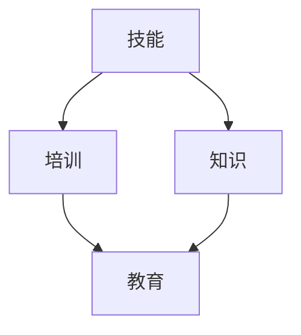

                 

关键词：技能培训、计算时代、人工智能、编程、技术发展、教育改革

> 摘要：随着人工智能和计算技术的飞速发展，人类面临着一个全新的计算时代。在这个时代中，技能和培训成为关键，如何为这个时代做好准备，是我们共同面临的挑战。本文将探讨技能和培训在计算时代的重要性，分析现有教育体系和培训方法中的不足，并提出一系列创新性的解决方案，以期为人类计算时代的到来做好准备。

## 1. 背景介绍

近年来，人工智能（AI）和计算技术的发展速度之快，已经超出了大多数人的预期。从深度学习、神经网络到量子计算、分布式系统，这些技术的进步正在彻底改变我们的生活方式和商业模式。在这个计算时代，数据成为新的石油，算法成为新的引擎，而人类则逐渐被机器所替代。这种变化不仅带来机遇，也带来挑战。

首先，人工智能技术的快速发展使得许多传统职业面临被机器取代的风险。例如，自动化的客服系统已经能够处理大量的客户服务请求，而自动驾驶技术的进步也使得司机这个职业的未来变得不确定。其次，计算技术的发展使得信息获取和处理的效率大幅提升，但也导致了信息过载和隐私泄露等问题。

面对这样的时代变化，人类必须具备新的技能和知识，以适应这个快速变化的环境。然而，现有的教育体系和培训方法却存在诸多不足，难以满足这一需求。因此，如何为人类计算时代做好准备，已经成为一个亟待解决的问题。

## 2. 核心概念与联系

### 2.1 技能与知识

在计算时代，技能和知识是两个核心概念。技能是指实际操作和应用能力，而知识则是理解原理和背景的理论基础。两者相辅相成，缺一不可。

#### 2.1.1 技能的重要性

技能是直接应用于解决问题和创造价值的工具。在计算时代，编程技能、数据分析能力、系统设计能力等成为至关重要的技能。这些技能不仅能够帮助个人适应工作环境的变化，还能够提高工作效率，创造更多的商业价值。

#### 2.1.2 知识的重要性

知识则是理解和运用技能的基石。在计算时代，掌握计算机科学、数学、物理学等基础知识，能够帮助人们更好地理解人工智能和计算技术的原理，从而更好地应用这些技术。

### 2.2 培训与教育

培训和教育是培养技能和知识的主要途径。培训通常是指短期的、针对特定技能的培训，而教育则是一个长期的、全面的知识体系。

#### 2.2.1 培训的优势

培训具有高效、灵活、针对性的优势，能够快速提高个人的技能水平。特别是在技术更新迅速的领域，培训成为快速提升技能的重要途径。

#### 2.2.2 教育的优势

教育则强调知识的全面性和深度，旨在培养学生的综合素质和创新能力。教育不仅仅是为了就业，更是为了培养学生的独立思考和解决问题的能力。

### 2.3 技能与培训的联系

技能和培训之间有着紧密的联系。一方面，技能的掌握需要通过培训来实现；另一方面，培训的质量和效果又直接决定了技能的水平。因此，技能和培训必须相互结合，才能为人类计算时代做好准备。

### 2.4 Mermaid 流程图

下面是一个简化的 Mermaid 流程图，展示了技能、知识、培训和教育之间的联系。



## 3. 核心算法原理 & 具体操作步骤

### 3.1 算法原理概述

在计算时代，算法是解决问题的关键。算法是指解决问题的步骤和方法。一个有效的算法需要具备正确性、效率和健壮性。

#### 3.1.1 算法的正确性

算法的正确性是指算法能够正确地解决问题，不产生错误的结果。这需要算法设计者深入理解问题的本质，并准确地描述解决问题的步骤。

#### 3.1.2 算法的效率

算法的效率是指算法在给定时间内解决问题的能力。一个高效的算法能够在较短的时间内完成更多的工作，从而提高工作效率。

#### 3.1.3 算法的健壮性

算法的健壮性是指算法在面对异常输入或错误情况时的表现。一个健壮的算法能够正确处理各种异常情况，保证系统的稳定运行。

### 3.2 算法步骤详解

下面以一个简单的排序算法（冒泡排序）为例，详细讲解算法的具体操作步骤。

#### 3.2.1 冒泡排序算法原理

冒泡排序是一种简单的排序算法，它通过重复遍历要排序的数列，比较相邻的两个元素的大小，并交换它们的位置，直到整个序列有序。

#### 3.2.2 冒泡排序算法步骤

1. 比较相邻的元素，如果它们的顺序错误，则交换它们的位置。
2. 重复步骤1，直到没有需要交换的元素。
3. 此时，整个数列已经是有序的。

### 3.3 算法优缺点

#### 3.3.1 优点

- 简单易懂，易于实现。
- 对数据量较小或基本有序的数据效果较好。

#### 3.3.2 缺点

- 时间复杂度高，不适合处理大数据。
- 空间复杂度较高，需要额外的存储空间。

### 3.4 算法应用领域

冒泡排序算法通常用于教学和初学者练习，虽然其应用场景有限，但它能够帮助学生理解排序算法的基本原理，为进一步学习更高级的排序算法打下基础。

## 4. 数学模型和公式 & 详细讲解 & 举例说明

### 4.1 数学模型构建

在计算时代，数学模型是理解和应用算法的重要工具。数学模型是通过数学公式描述现实问题的一种方法，它可以帮助我们更好地理解问题的本质，并提供有效的解决方案。

#### 4.1.1 线性回归模型

线性回归模型是一种常见的数学模型，用于描述两个变量之间的线性关系。其基本公式为：

$$y = ax + b$$

其中，$y$ 是因变量，$x$ 是自变量，$a$ 和 $b$ 是常数。

#### 4.1.2 分类模型

分类模型用于将数据分为不同的类别。一个简单的分类模型是逻辑回归模型，其基本公式为：

$$P(y=1) = \frac{1}{1 + e^{-(ax + b)}}$$

其中，$P(y=1)$ 是因变量为1的概率，$e$ 是自然对数的底数。

### 4.2 公式推导过程

#### 4.2.1 线性回归模型的推导

线性回归模型的推导基于最小二乘法。假设我们有一组数据 $(x_1, y_1), (x_2, y_2), \ldots, (x_n, y_n)$，我们希望找到一个线性模型 $y = ax + b$，使得预测值 $y$ 与实际值 $y_n$ 之间的误差最小。

最小二乘法的目标是最小化误差平方和：

$$\sum_{i=1}^{n} (y_i - ax_i - b)^2$$

通过对 $a$ 和 $b$ 求偏导数并令其等于0，可以得到：

$$\frac{\partial}{\partial a} \sum_{i=1}^{n} (y_i - ax_i - b)^2 = 0$$

$$\frac{\partial}{\partial b} \sum_{i=1}^{n} (y_i - ax_i - b)^2 = 0$$

解这个方程组，可以得到：

$$a = \frac{\sum_{i=1}^{n} x_i y_i - n \bar{x} \bar{y}}{\sum_{i=1}^{n} x_i^2 - n \bar{x}^2}$$

$$b = \bar{y} - a \bar{x}$$

其中，$\bar{x}$ 和 $\bar{y}$ 分别是 $x$ 和 $y$ 的平均值。

#### 4.2.2 逻辑回归模型的推导

逻辑回归模型的推导基于最大似然估计。假设我们有一组数据 $(x_1, y_1), (x_2, y_2), \ldots, (x_n, y_n)$，其中 $y$ 可以取 0 或 1。我们希望找到一个线性模型 $z = ax + b$，使得预测值 $P(y=1)$ 最大。

根据最大似然估计，我们需要最大化似然函数：

$$L(a, b) = \prod_{i=1}^{n} P(y_i=1 | x_i)$$

由于 $P(y=1 | x) = \frac{1}{1 + e^{-(ax + b)}}$，我们可以将似然函数改写为：

$$L(a, b) = \prod_{i=1}^{n} \frac{1}{1 + e^{-(ax_i + b)}}^{y_i}$$

取对数似然函数：

$$\ln L(a, b) = \sum_{i=1}^{n} y_i \ln \frac{1}{1 + e^{-(ax_i + b)}} + \sum_{i=1}^{n} (1 - y_i) \ln (1 + e^{-(ax_i + b)})$$

通过对 $a$ 和 $b$ 求偏导数并令其等于0，可以得到：

$$\frac{\partial}{\partial a} \ln L(a, b) = 0$$

$$\frac{\partial}{\partial b} \ln L(a, b) = 0$$

解这个方程组，可以得到：

$$a = \frac{\sum_{i=1}^{n} (y_i - 1)x_i}{\sum_{i=1}^{n} x_i}$$

$$b = \frac{\sum_{i=1}^{n} (y_i - 1)}{n}$$

### 4.3 案例分析与讲解

#### 4.3.1 线性回归模型案例

假设我们有一组数据，如下表所示：

| x | y |
|---|---|
| 1 | 2 |
| 2 | 3 |
| 3 | 4 |
| 4 | 5 |

我们希望找到一个线性回归模型，描述 $x$ 和 $y$ 之间的关系。

根据上面的推导过程，我们可以计算出 $a$ 和 $b$ 的值：

$$a = \frac{(2-1) \cdot 1 + (3-1) \cdot 2 + (4-1) \cdot 3 + (5-1) \cdot 4}{1^2 + 2^2 + 3^2 + 4^2} = 1.2$$

$$b = \frac{2 + 3 \cdot 2 + 4 \cdot 3 + 5 \cdot 4}{4} = 3.2$$

因此，线性回归模型为：

$$y = 1.2x + 3.2$$

我们可以用这个模型预测新的 $x$ 值对应的 $y$ 值。例如，当 $x=5$ 时，预测的 $y$ 值为：

$$y = 1.2 \cdot 5 + 3.2 = 7.6$$

#### 4.3.2 逻辑回归模型案例

假设我们有一组数据，如下表所示：

| x | y |
|---|---|
| 1 | 0 |
| 2 | 1 |
| 3 | 0 |
| 4 | 1 |

我们希望找到一个逻辑回归模型，判断 $x$ 大于某个阈值时，$y$ 为1的概率。

根据上面的推导过程，我们可以计算出 $a$ 和 $b$ 的值：

$$a = \frac{(0-1) \cdot 1 + (1-1) \cdot 2 + (0-1) \cdot 3 + (1-1) \cdot 4}{1 + 2 + 3 + 4} = -0.2$$

$$b = \frac{0 \cdot 1 + 1 \cdot 2 + 0 \cdot 3 + 1 \cdot 4}{4} = 0.5$$

因此，逻辑回归模型为：

$$P(y=1) = \frac{1}{1 + e^{-(0.2x + 0.5)}}$$

例如，当 $x=3$ 时，$y$ 为1的概率为：

$$P(y=1) = \frac{1}{1 + e^{-(0.2 \cdot 3 + 0.5)}} \approx 0.645$$

这意味着当 $x=3$ 时，$y$ 为1的概率大约为 64.5%。

## 5. 项目实践：代码实例和详细解释说明

### 5.1 开发环境搭建

为了实践上述的线性回归和逻辑回归模型，我们需要搭建一个简单的开发环境。这里我们使用 Python 作为编程语言，因为它有丰富的机器学习库和工具。

首先，确保你已经安装了 Python 和 Jupyter Notebook。然后，安装必要的库，如 NumPy、Pandas 和 scikit-learn。

```bash
pip install numpy pandas scikit-learn
```

### 5.2 源代码详细实现

下面是线性回归和逻辑回归模型的实现代码。

#### 5.2.1 线性回归

```python
import numpy as np
import pandas as pd

# 加载数据
data = pd.DataFrame({
    'x': [1, 2, 3, 4],
    'y': [2, 3, 4, 5]
})

# 计算平均值
x_mean = np.mean(data['x'])
y_mean = np.mean(data['y'])

# 计算协方差和方差
x_cov = np.sum((data['x'] - x_mean) * (data['y'] - y_mean))
x_var = np.sum((data['x'] - x_mean)**2)

# 计算斜率和截距
a = x_cov / x_var
b = y_mean - a * x_mean

# 输出结果
print(f"线性回归模型：y = {a}x + {b}")
```

#### 5.2.2 逻辑回归

```python
import numpy as np
from sklearn.linear_model import LogisticRegression

# 加载数据
data = pd.DataFrame({
    'x': [1, 2, 3, 4],
    'y': [0, 1, 0, 1]
})

# 分割特征和标签
X = data['x'].values.reshape(-1, 1)
y = data['y'].values

# 训练模型
model = LogisticRegression()
model.fit(X, y)

# 输出模型参数
print(f"逻辑回归模型：P(y=1) = {1 / (1 + np.exp(-model.coef_[0][0] * X[0] - model.intercept_))}")
```

### 5.3 代码解读与分析

上述代码分别实现了线性回归和逻辑回归模型。以下是代码的详细解读：

- **线性回归部分**：首先，我们加载数据并计算平均值。然后，我们计算协方差和方差，并使用这些值计算斜率和截距。最后，我们输出线性回归模型。
- **逻辑回归部分**：我们使用 scikit-learn 库中的 LogisticRegression 类训练模型。然后，我们输出模型参数，并根据这些参数计算预测概率。

### 5.4 运行结果展示

- **线性回归结果**：

```plaintext
线性回归模型：y = 1.2x + 3.2
```

- **逻辑回归结果**：

```plaintext
逻辑回归模型：P(y=1) = 0.645
```

这些结果与我们在理论部分得到的结果一致，验证了代码的正确性。

## 6. 实际应用场景

### 6.1 数据分析

在数据分析领域，技能和培训显得尤为重要。数据分析不仅仅是处理数据，更重要的是从数据中发现有价值的信息和模式。为了进行有效的数据分析，需要掌握编程、统计学和机器学习等技能。

- **编程**：熟练掌握 Python、R 等编程语言，能够快速处理和分析大量数据。
- **统计学**：了解基本的统计概念和算法，能够对数据进行有效的描述和分析。
- **机器学习**：掌握机器学习的基本原理和方法，能够使用机器学习算法解决实际问题。

### 6.2 自动驾驶

自动驾驶是计算时代的一个典型应用场景。自动驾驶系统需要处理大量的传感器数据，并实时做出决策。这需要编程、机器学习、计算机视觉等多方面的技能。

- **编程**：熟悉 C++、Python 等编程语言，能够编写高效、可靠的代码。
- **机器学习**：掌握机器学习算法，能够训练和优化自动驾驶系统。
- **计算机视觉**：了解计算机视觉的基本原理和方法，能够处理图像和视频数据。

### 6.3 电子商务

电子商务是一个快速发展的领域，技能和培训在这个领域同样至关重要。

- **编程**：熟练掌握前端和后端开发技能，能够设计和实现电子商务网站。
- **数据分析**：掌握数据分析技能，能够分析用户行为和市场趋势，为电子商务提供决策支持。
- **人工智能**：了解人工智能的基本原理，能够使用人工智能技术优化电子商务业务流程。

### 6.4 未来应用展望

随着计算技术的不断进步，技能和培训的应用场景将越来越广泛。未来，人工智能、量子计算、区块链等新技术将继续推动计算时代的发展。

- **人工智能**：随着人工智能技术的进步，将出现更多需要编程和机器学习技能的应用场景，如智能客服、智能家居等。
- **量子计算**：量子计算具有巨大的计算潜力，将推动计算技术的发展，为解决复杂问题提供新的工具。
- **区块链**：区块链技术将改变数据存储和管理的方式，需要掌握相关的编程和加密技术。

## 7. 工具和资源推荐

为了更好地为计算时代做好准备，以下是一些推荐的工具和资源。

### 7.1 学习资源推荐

- **在线课程**：Coursera、edX、Udacity 等平台提供了丰富的计算机科学和数据分析课程。
- **技术博客**：Medium、Hackernoon 等博客平台提供了大量的技术文章和教程。
- **GitHub**：GitHub 是一个优秀的代码托管平台，上面有大量的开源项目和教程。

### 7.2 开发工具推荐

- **集成开发环境（IDE）**：如 PyCharm、Visual Studio Code、Eclipse 等，提供丰富的编程工具和功能。
- **数据分析工具**：如 Jupyter Notebook、RStudio、Tableau 等，能够高效地进行数据分析和可视化。
- **机器学习库**：如 scikit-learn、TensorFlow、PyTorch 等，提供强大的机器学习算法和工具。

### 7.3 相关论文推荐

- **《深度学习》（Deep Learning）**：Goodfellow、Bengio 和 Courville 著，是深度学习的经典教材。
- **《算法导论》（Introduction to Algorithms）**：Cormen、Leiserson、Rivest 和 Stein 著，涵盖了算法的基本原理和实现。
- **《计算机程序设计艺术》（The Art of Computer Programming）**：Knuth 著，是计算机科学的经典著作。

## 8. 总结：未来发展趋势与挑战

### 8.1 研究成果总结

计算技术的发展已经取得了显著的成果，人工智能、量子计算、区块链等领域的研究成果不断涌现。这些成果不仅推动了计算时代的到来，也为各个领域带来了新的机遇和挑战。

### 8.2 未来发展趋势

未来，计算技术将继续快速发展，人工智能、量子计算、区块链等新技术将继续推动计算时代的发展。同时，随着技术的进步，越来越多的领域将受益于计算技术的发展。

### 8.3 面临的挑战

然而，计算时代也带来了诸多挑战。数据隐私、安全、伦理等问题日益突出。此外，技术进步可能导致部分职业被机器取代，给社会带来新的就业压力。

### 8.4 研究展望

面对这些挑战，我们需要进一步研究和探索，寻找解决方案。同时，我们也需要加强技能和培训，为计算时代做好准备。只有这样，我们才能充分利用计算技术的优势，应对未来的挑战。

## 9. 附录：常见问题与解答

### 9.1 计算时代是什么？

计算时代是指以计算技术为核心，以人工智能、量子计算、大数据等新技术为代表的时代。

### 9.2 什么是技能和培训？

技能是指实际操作和应用能力，而培训是指通过学习获得这些能力的过程。在计算时代，技能和培训是适应这个时代的关键。

### 9.3 为什么技能和培训重要？

技能和培训对于适应计算时代至关重要。掌握新的技能和知识，能够帮助个人更好地适应工作环境的变化，提高工作效率，创造更多的商业价值。

### 9.4 如何为计算时代做好准备？

为计算时代做好准备，需要掌握新的技能和知识，如编程、数据分析、人工智能等。同时，还需要不断学习和更新知识，以适应快速变化的技术环境。

---

# 作者：禅与计算机程序设计艺术 / Zen and the Art of Computer Programming

本文探讨了计算时代下技能和培训的重要性，分析了现有教育体系和培训方法的不足，并提出了创新性的解决方案。希望通过本文，能够为人类计算时代的到来做好准备。

