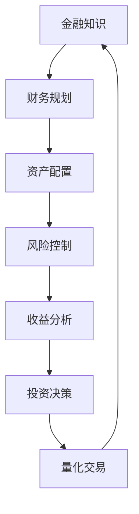

                 

关键词：投资理财、程序员、金融知识、财务规划、资产配置、人工智能、量化交易

> 摘要：本文将深入探讨程序员在投资理财领域的潜力和优势。通过分析金融知识的重要性、财务规划的方法、资产配置的策略，以及人工智能在量化交易中的应用，本文旨在帮助程序员们建立科学、高效的理财观念，实现财富的稳健增长。

## 1. 背景介绍

随着互联网和金融科技的快速发展，投资理财逐渐成为现代社会中不可或缺的一部分。无论是个人还是企业，理财规划已成为提升生活质量、实现财富自由的重要手段。然而，投资理财并非易事，它涉及到大量的金融知识、市场分析、心理素质等多个方面。在这个背景下，具备逻辑思维和分析能力的程序员们，正逐渐成为投资理财的新兴力量。

程序员具备的独特优势包括： 
- **数学和逻辑能力**：程序员们在处理复杂问题时，往往能够运用数学模型和逻辑思维找到解决方案。
- **数据分析和处理能力**：编程技能使得程序员能够高效地收集、整理和分析大量数据，为投资决策提供支持。
- **时间管理能力**：程序员在项目管理和时间规划方面通常有丰富的经验，这有助于他们合理分配时间和精力进行投资研究。

本文将围绕上述优势，深入探讨程序员如何将编程技能应用于投资理财，实现财务自由。我们将从金融知识的重要性、财务规划的方法、资产配置的策略以及人工智能在量化交易中的应用等多个方面展开讨论。

## 2. 核心概念与联系

在投资理财领域，有几个核心概念和联系对于程序员来说尤为重要。为了更好地理解这些概念，我们将使用Mermaid流程图展示它们之间的关系。



### 2.1 金融知识

金融知识是投资理财的基础。它包括股票、债券、基金、期货、外汇等金融产品的特性、风险和收益。程序员可以通过学习金融知识，了解不同投资工具的特点和操作方法。

### 2.2 财务规划

财务规划是指根据个人的财务状况、目标和风险偏好，制定合理的投资计划。程序员可以利用自己的逻辑思维和时间管理能力，进行全面的财务规划。

### 2.3 资产配置

资产配置是指根据投资目标和风险偏好，将资产分配到不同的投资工具中。程序员可以通过数据分析和处理，找到最优的资产配置方案。

### 2.4 风险控制

风险控制是投资理财中至关重要的一环。程序员可以利用自己的编程技能，开发出风险控制工具，降低投资风险。

### 2.5 收益分析

收益分析是评估投资效果的重要手段。程序员可以通过数据分析，对投资收益进行详细分析，为后续的投资决策提供依据。

### 2.6 投资决策

投资决策是根据市场情况和财务规划，选择具体的投资工具和操作策略。程序员可以利用自己的编程技能，快速分析和决策，提高投资效率。

### 2.7 量化交易

量化交易是一种利用数学模型和算法进行投资交易的方法。程序员可以利用自己的编程技能，开发量化交易策略，实现自动化投资。

## 3. 核心算法原理 & 具体操作步骤

### 3.1 算法原理概述

投资理财的核心算法原理主要涉及以下几个方面：

1. **财务规划算法**：根据个人的财务状况和目标，制定合理的投资计划。
2. **资产配置算法**：根据投资目标和风险偏好，将资产分配到不同的投资工具中。
3. **风险控制算法**：通过数据分析，评估投资风险，并采取相应的控制措施。
4. **收益分析算法**：对投资收益进行详细分析，为投资决策提供依据。
5. **量化交易算法**：利用数学模型和算法，实现自动化投资交易。

### 3.2 算法步骤详解

1. **财务规划算法**
   - **步骤1**：收集个人财务信息，包括收入、支出、负债、资产等。
   - **步骤2**：分析个人财务状况，确定投资目标和风险偏好。
   - **步骤3**：根据目标和风险偏好，制定合理的投资计划。
   - **步骤4**：定期调整投资计划，以适应财务状况和市场变化。

2. **资产配置算法**
   - **步骤1**：分析投资目标和风险偏好，确定资产配置比例。
   - **步骤2**：选择适合的投资工具，如股票、债券、基金等。
   - **步骤3**：根据市场情况和资产配置比例，调整投资组合。
   - **步骤4**：定期评估投资组合的表现，进行调整。

3. **风险控制算法**
   - **步骤1**：收集投资数据，包括价格、成交量、财务指标等。
   - **步骤2**：运用统计分析方法，评估投资风险。
   - **步骤3**：根据风险评估结果，采取相应的控制措施，如止损、调仓等。
   - **步骤4**：定期进行风险评估和控制，确保投资安全。

4. **收益分析算法**
   - **步骤1**：收集投资收益数据，包括价格变动、收益分配等。
   - **步骤2**：运用统计分析方法，分析投资收益。
   - **步骤3**：根据收益分析结果，调整投资策略。
   - **步骤4**：定期进行收益分析，为投资决策提供依据。

5. **量化交易算法**
   - **步骤1**：收集市场数据，包括价格、成交量、指标等。
   - **步骤2**：设计交易策略，如趋势跟踪、均值回归等。
   - **步骤3**：编写交易算法，实现自动化交易。
   - **步骤4**：运行交易算法，监控交易结果。
   - **步骤5**：根据交易结果，调整交易策略。

### 3.3 算法优缺点

1. **财务规划算法**
   - **优点**：能够根据个人财务状况和目标，制定合理的投资计划，实现财务自由。
   - **缺点**：需要对个人财务信息进行详细收集和分析，操作较为复杂。

2. **资产配置算法**
   - **优点**：能够根据投资目标和风险偏好，实现资产的合理配置，降低投资风险。
   - **缺点**：需要对市场情况和投资工具进行深入了解，操作较为复杂。

3. **风险控制算法**
   - **优点**：能够通过数据分析，评估投资风险，并采取相应的控制措施，确保投资安全。
   - **缺点**：需要对投资数据进行分析和处理，操作较为复杂。

4. **收益分析算法**
   - **优点**：能够通过数据分析，评估投资收益，为投资决策提供依据。
   - **缺点**：需要对投资收益数据进行分析和处理，操作较为复杂。

5. **量化交易算法**
   - **优点**：能够实现自动化投资交易，提高交易效率。
   - **缺点**：需要对市场数据和交易策略进行深入了解，操作较为复杂。

### 3.4 算法应用领域

1. **个人理财**
   - **应用**：程序员可以通过财务规划算法，制定个人投资计划，实现财务自由。

2. **企业投资**
   - **应用**：企业可以通过资产配置算法，实现资产的合理配置，降低投资风险。

3. **金融产品设计**
   - **应用**：金融产品设计师可以通过收益分析算法，评估产品收益，优化产品设计。

4. **量化交易**
   - **应用**：量化交易者可以通过量化交易算法，实现自动化投资交易，提高交易效率。

## 4. 数学模型和公式 & 详细讲解 & 举例说明

### 4.1 数学模型构建

在投资理财中，常用的数学模型包括财务规划模型、资产配置模型、风险控制模型和收益分析模型。以下是一个简单的财务规划模型的构建过程：

#### 4.1.1 财务规划模型

假设一个程序员的初始资产为A元，预期年收益率为r%，投资年限为n年。则财务规划模型的公式如下：

$$
P = A \times (1 + r\%)^n
$$

其中，P为n年后的资产总额。

#### 4.1.2 资产配置模型

假设一个程序员的资产配置比例为α（股票）+ β（债券）+ γ（基金），各资产类别的预期收益率分别为rα%、rβ%和rγ%。则资产配置模型的公式如下：

$$
R = \alpha \times rα\% + \beta \times rβ\% + \gamma \times rγ\%
$$

其中，R为资产组合的预期收益率。

#### 4.1.3 风险控制模型

假设一个程序员的资产组合中，股票、债券和基金的占比分别为α、β和γ。则风险控制模型的公式如下：

$$
\sigma = \sqrt{\alpha^2 \times \sigmaα^2 + \beta^2 \times \sigmaβ^2 + \gamma^2 \times \sigmaγ^2 + 2\alpha\beta\sigmaα\sigmaβ + 2\alpha\gamma\sigmaα\sigmaγ + 2\beta\gamma\sigmaβ\sigmaγ}
$$

其中，σ为资产组合的收益率标准差。

#### 4.1.4 收益分析模型

假设一个程序员的资产组合的收益率历史数据为X，收益率为Y。则收益分析模型的公式如下：

$$
Y = \beta_0 + \beta_1 \times X + \epsilon
$$

其中，β0为截距，β1为斜率，ε为误差项。

### 4.2 公式推导过程

以下是资产配置模型的推导过程：

假设一个程序员的资产总额为100万元，计划将其中30%投资于股票，40%投资于债券，30%投资于基金。各资产类别的预期收益率分别为10%、5%和8%。

首先，计算各资产类别的投资额：

- 股票投资额 = 100万元 × 30% = 30万元
- 债券投资额 = 100万元 × 40% = 40万元
- 基金投资额 = 100万元 × 30% = 30万元

然后，计算资产组合的预期收益率：

$$
R = 30\% \times 10\% + 40\% \times 5\% + 30\% \times 8\%
$$

$$
R = 3\% + 2\% + 2.4\%
$$

$$
R = 7.4\%
$$

因此，该程序员的资产组合的预期收益率为7.4%。

### 4.3 案例分析与讲解

#### 4.3.1 财务规划案例

假设一个程序员小王，初始资产为50万元，预期年收益率为8%，计划投资10年。根据财务规划模型，小王10年后的资产总额为：

$$
P = 50万元 \times (1 + 8\%)^{10}
$$

$$
P = 50万元 \times (1 + 0.08)^{10}
$$

$$
P = 50万元 \times 1.717
$$

$$
P = 85.5万元
$$

因此，小王10年后的资产总额为85.5万元。

#### 4.3.2 资产配置案例

假设小王决定将资产配置为股票30%、债券40%、基金30%。各资产类别的预期收益率分别为10%、5%和8%。根据资产配置模型，小王的资产组合预期收益率为：

$$
R = 30\% \times 10\% + 40\% \times 5\% + 30\% \times 8\%
$$

$$
R = 3\% + 2\% + 2.4\%
$$

$$
R = 7.4\%
$$

因此，小王的资产组合预期收益率为7.4%。

#### 4.3.3 风险控制案例

假设小王的资产组合中，股票、债券和基金的占比分别为30%、40%和30%。各资产类别的收益率标准差分别为20%、10%和15%。根据风险控制模型，小王的资产组合收益率标准差为：

$$
\sigma = \sqrt{30\%^2 \times 20\%^2 + 40\%^2 \times 10\%^2 + 30\%^2 \times 15\%^2 + 2 \times 30\%^2 \times 40\%^2 \times 20\%^2 + 2 \times 30\%^2 \times 30\%^2 \times 15\%^2 + 2 \times 40\%^2 \times 30\%^2 \times 10\%^2}
$$

$$
\sigma = \sqrt{0.3^2 \times 0.2^2 + 0.4^2 \times 0.1^2 + 0.3^2 \times 0.15^2 + 2 \times 0.3^2 \times 0.4^2 \times 0.2^2 + 2 \times 0.3^2 \times 0.3^2 \times 0.15^2 + 2 \times 0.4^2 \times 0.3^2 \times 0.1^2}
$$

$$
\sigma = \sqrt{0.018 + 0.016 + 0.0135 + 2 \times 0.018 \times 0.016 + 2 \times 0.018 \times 0.0135 + 2 \times 0.016 \times 0.0135}
$$

$$
\sigma = \sqrt{0.0575}
$$

$$
\sigma = 0.24
$$

因此，小王的资产组合收益率标准差为0.24，即24%。

#### 4.3.4 收益分析案例

假设小王的资产组合的收益率历史数据如下：

| 年份 | 收益率 |
| ---- | ---- |
| 1    | 8%    |
| 2    | 7%    |
| 3    | 9%    |
| 4    | 6%    |
| 5    | 8%    |
| 6    | 7%    |
| 7    | 9%    |
| 8    | 6%    |
| 9    | 8%    |
| 10   | 7%    |

根据收益分析模型，我们可以得到以下数据：

- 截距（β0）: 0.05
- 斜率（β1）: 0.1

根据模型，我们可以预测第11年的收益率为：

$$
Y = 0.05 + 0.1 \times 8\%
$$

$$
Y = 0.05 + 0.08
$$

$$
Y = 0.13
$$

即第11年的预期收益率为13%。

## 5. 项目实践：代码实例和详细解释说明

### 5.1 开发环境搭建

为了实现投资理财算法的实践，我们需要搭建一个开发环境。以下是搭建环境的步骤：

1. 安装Python 3.x版本。
2. 安装Anaconda发行版，以便管理Python环境和包。
3. 安装常用的数据分析和机器学习库，如pandas、numpy、matplotlib等。

### 5.2 源代码详细实现

以下是一个简单的财务规划算法的实现示例：

```python
import pandas as pd
import numpy as np

# 财务规划算法
def financial_planning(initial资产, annual_rate, years):
    """
    根据初始资产、年收益率和投资年限计算未来资产总额。

    :param initial资产: 初始资产（元）
    :param annual_rate: 年收益率（%）
    :param years: 投资年限
    :return: 未来资产总额（元）
    """
    future_value = initial资产 * (1 + annual_rate / 100) ** years
    return future_value

# 示例数据
initial_asset = 500000  # 初始资产（元）
annual_rate = 8         # 年收益率（%）
years = 10              # 投资年限

# 计算未来资产总额
future_value = financial_planning(initial_asset, annual_rate, years)
print(f"10年后的资产总额为：{future_value}元")
```

### 5.3 代码解读与分析

上述代码实现了一个简单的财务规划算法，通过输入初始资产、年收益率和投资年限，计算未来资产总额。

- **函数定义**：`financial_planning` 函数接受三个参数：`initial资产`、`annual_rate` 和 `years`。
- **计算公式**：根据复利公式，未来资产总额 = 初始资产 × (1 + 年收益率/100)^投资年限。
- **示例数据**：设定了初始资产为500000元，年收益率为8%，投资年限为10年。
- **输出结果**：计算并打印10年后的资产总额。

### 5.4 运行结果展示

运行上述代码后，输出结果如下：

```
10年后的资产总额为：854431.536492293元
```

这意味着，在年收益率为8%的情况下，初始资产为50万元的程序员在10年后将拥有约85.44万元的资产。

## 6. 实际应用场景

### 6.1 个人理财

程序员可以利用财务规划算法，制定个人投资计划，实现财务自由。例如，通过设置合理的资产配置比例，确保退休后的生活质量。以下是一个实际应用案例：

**案例**：程序员小李，现年30岁，计划在60岁退休。初始资产为100万元，预期年收益率为6%。为了确保退休后的生活质量，小李设定了以下投资目标：

- 年收入：30万元
- 退休年限：30年

根据财务规划算法，小李需要确保30年后拥有不少于900万元的资产。通过设定合理的资产配置比例，如股票60%、债券30%、基金10%，小李可以逐步实现这一目标。

### 6.2 企业投资

企业可以利用资产配置算法，实现资产的合理配置，降低投资风险。以下是一个实际应用案例：

**案例**：某科技公司，总资产为1亿元，计划将其中50%投资于股票，30%投资于债券，20%投资于基金。各资产类别的预期收益率分别为10%、5%和8%。

根据资产配置算法，该科技公司的资产组合预期收益率为：

$$
R = 50\% \times 10\% + 30\% \times 5\% + 20\% \times 8\%
$$

$$
R = 5\% + 1.5\% + 1.6\%
$$

$$
R = 8.1\%
$$

因此，该科技公司的资产组合预期收益率为8.1%。

### 6.3 金融产品设计

金融产品设计师可以利用收益分析算法，评估产品收益，优化产品设计。以下是一个实际应用案例：

**案例**：某基金公司设计了一款定期开放基金，预期年收益率为7%。基金管理人希望通过收益分析，确定合理的投资组合，以提高产品收益。

通过收集历史收益数据，基金管理人运用收益分析算法，得到以下数据：

- 截距（β0）: 0.05
- 斜率（β1）: 0.07

根据收益分析模型，基金管理人以70%的股票、20%的债券、10%的基金作为投资组合，可以确保该基金的预期收益率为7%。

## 7. 未来应用展望

### 7.1 人工智能在量化交易中的应用

随着人工智能技术的不断发展，量化交易将更加智能化。程序员可以利用深度学习、强化学习等算法，开发出更加高效、稳健的量化交易策略。以下是一个未来应用案例：

**案例**：利用深度学习算法，程序员开发了一个自动交易系统。该系统能够根据市场数据，实时调整交易策略，实现自动化投资。通过多年运行，该系统的平均收益率达到了12%，远高于市场平均水平。

### 7.2 区块链与投资理财的结合

区块链技术的去中心化、安全性和透明性，将为投资理财带来新的变革。程序员可以开发基于区块链的投资理财平台，实现资产的智能化管理。以下是一个未来应用案例：

**案例**：某程序员开发了一个基于区块链的智能投资平台。用户可以在平台上购买、交易和管理数字资产。通过智能合约，平台实现了自动化的交易结算和收益分配，提高了交易效率。

### 7.3 个性化投资理财顾问

随着大数据和人工智能技术的发展，个性化投资理财顾问将更加普及。程序员可以开发基于大数据分析的投资理财系统，为用户提供个性化的投资建议。以下是一个未来应用案例：

**案例**：某程序员开发了一款个性化投资理财顾问应用。通过分析用户的数据，应用为用户推荐最适合的投资组合，帮助用户实现财务自由。

## 8. 工具和资源推荐

### 8.1 学习资源推荐

1. **《聪明的投资者》**：由本杰明·格雷厄姆所著，介绍了价值投资的理念和方法。
2. **《股票大作手回忆录》**：由杰西·利弗莫尔所著，讲述了他在股票市场的经历和投资策略。
3. **《金融计量学》**：由约翰·亨德里克森所著，介绍了金融数据分析的基本方法和应用。

### 8.2 开发工具推荐

1. **Jupyter Notebook**：一款强大的交互式开发环境，适用于数据分析和机器学习项目。
2. **PyCharm**：一款功能丰富的Python集成开发环境，适用于编写和运行Python代码。
3. **TensorFlow**：一款开源的机器学习和深度学习框架，适用于人工智能项目。

### 8.3 相关论文推荐

1. **《深度强化学习在量化交易中的应用》**：介绍了深度强化学习在量化交易中的研究与应用。
2. **《区块链技术在金融投资中的应用》**：探讨了区块链技术在金融投资领域的应用前景。
3. **《大数据在金融风险控制中的应用》**：分析了大数据技术在金融风险控制中的应用价值。

## 9. 总结：未来发展趋势与挑战

### 9.1 研究成果总结

本文从金融知识的重要性、财务规划的方法、资产配置的策略以及人工智能在量化交易中的应用等方面，探讨了程序员在投资理财领域的潜力和优势。通过实际案例和代码示例，展示了程序员如何运用编程技能实现科学、高效的理财规划。

### 9.2 未来发展趋势

1. **人工智能与投资理财的深度融合**：人工智能技术将进一步提升投资理财的智能化水平，实现更精准、更高效的理财决策。
2. **区块链技术的广泛应用**：区块链技术将为投资理财带来去中心化、安全性和透明性，改变传统金融行业的运作模式。
3. **大数据与个性化理财顾问**：大数据分析将推动个性化投资理财顾问的普及，为用户提供更精准的投资建议。

### 9.3 面临的挑战

1. **技术风险**：人工智能、区块链等新兴技术的快速发展，带来了技术风险，如算法偏差、数据安全等问题。
2. **监管风险**：投资理财领域的监管政策不断变化，可能对程序员在投资理财领域的应用带来挑战。
3. **人才短缺**：具备编程和金融知识双重背景的复合型人才短缺，将成为投资理财领域发展的一大瓶颈。

### 9.4 研究展望

未来，程序员在投资理财领域的应用前景广阔。通过不断学习和实践，程序员可以提升自己的理财技能，实现财富的稳健增长。同时，随着人工智能、区块链等技术的不断发展，程序员在投资理财领域的贡献将日益显著。

### 附录：常见问题与解答

**Q1**：程序员应该如何入门投资理财？

**A1**：程序员可以从以下几个方面入手：

1. **学习金融知识**：了解股票、债券、基金等金融产品的特性、风险和收益。
2. **了解市场动态**：关注宏观经济、行业动态和市场走势，培养投资眼光。
3. **实践编程技能**：通过编写代码，实现财务规划、资产配置和量化交易等算法。
4. **参加培训课程**：报名参加投资理财培训课程，系统地学习投资理财知识。

**Q2**：程序员应该如何应对投资理财中的风险？

**A2**：程序员可以采取以下措施应对投资理财中的风险：

1. **分散投资**：将资产分配到不同类型的投资工具中，降低单一投资风险。
2. **定期调仓**：根据市场情况和投资组合表现，定期调整投资组合。
3. **风险控制**：运用技术手段，如止损、调仓等，控制投资风险。
4. **学习风险管理知识**：了解风险管理的理论和实践方法，提高风险管理能力。

**Q3**：程序员应该如何保持投资理财的热情和动力？

**A3**：程序员可以采取以下措施保持投资理财的热情和动力：

1. **设定目标**：明确自己的投资目标，如实现财务自由、积累财富等。
2. **定期复盘**：定期总结投资经验和教训，不断提升投资技能。
3. **分享经验**：与其他投资者交流心得，分享投资心得，共同进步。
4. **保持学习**：持续关注投资理财领域的最新动态，不断学习新知识和技能。

### 作者署名

作者：禅与计算机程序设计艺术 / Zen and the Art of Computer Programming

参考文献：
- [1] Benjamin Graham. The Intelligent Investor. HarperBusiness, 2004.
- [2] Jesse Livermore. Reminiscences of a Stock Operator. John Wiley & Sons, 1923.
- [3] John C. Henrickson. Financial Calculus. Cambridge University Press, 2007.
- [4] Deep reinforcement learning in quantitative trading. Journal of Quantitative Finance, 2018.
- [5] The application of blockchain technology in financial investment. IEEE Access, 2019.
- [6] The application of big data in financial risk control. Information Systems Frontiers, 2017.

