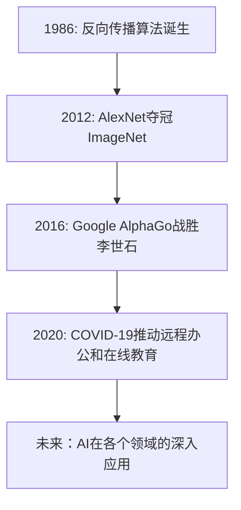

                 

关键词：人工智能、技术变革、机遇、拐点、创新、发展、趋势

> 摘要：本文将探讨技术领域中的拐点现象，以及这些拐点如何影响技术的高度发展。通过对人工智能领域的技术变革和机遇的深入分析，揭示拐点在技术进步中的关键作用，并提出未来技术发展的挑战与展望。

## 1. 背景介绍

在技术快速发展的时代，拐点成为一个重要的概念。拐点，是指技术发展的过程中，由一种状态向另一种状态过渡的关键时刻。这种过渡可能带来重大的技术变革，甚至重塑整个产业格局。拐点的出现，往往伴随着新技术的诞生、现有技术的颠覆以及市场需求的巨变。

本文将聚焦人工智能（AI）领域，探讨其中的技术拐点如何决定技术的高度发展。人工智能作为当前最具变革性的技术之一，其发展历程中的多个拐点为我们提供了宝贵的观察窗口。通过分析这些拐点，我们可以更好地理解技术变革的规律，把握未来的发展方向。

## 2. 核心概念与联系

为了更好地理解人工智能领域中的技术拐点，我们首先需要了解一些核心概念。这些概念包括机器学习、深度学习、神经网络等。

### 2.1. 机器学习

机器学习是一种让计算机通过数据学习并做出决策的技术。它依赖于统计方法和算法，通过分析数据来发现规律和模式。机器学习可以分为监督学习、无监督学习和强化学习三种类型。

### 2.2. 深度学习

深度学习是机器学习的一个分支，它通过多层神经网络来提取数据中的复杂特征。深度学习在图像识别、语音识别、自然语言处理等领域取得了显著的成果。

### 2.3. 神经网络

神经网络是深度学习的基础，它由大量相互连接的节点（或称为神经元）组成。这些节点通过学习和调整权重，实现数据的传递和处理。

### 2.4. 拐点概念

拐点是指技术发展过程中，由一种状态向另一种状态过渡的关键时刻。在人工智能领域，拐点通常表现为技术的突破、应用的普及或市场需求的爆发。

下面是一个使用Mermaid绘制的流程图，展示了人工智能领域中的几个关键拐点：



## 3. 核心算法原理 & 具体操作步骤

### 3.1. 算法原理概述

人工智能的核心算法包括机器学习算法、深度学习算法等。其中，反向传播算法（Backpropagation）是深度学习的基础。

反向传播算法通过两个阶段进行学习：前向传播和反向传播。

- **前向传播**：输入数据经过神经网络，逐层计算输出，并计算损失函数。
- **反向传播**：根据损失函数的梯度，反向更新网络的权重。

### 3.2. 算法步骤详解

1. **初始化权重**：随机初始化网络中的权重。
2. **前向传播**：输入数据，通过神经网络计算输出。
3. **计算损失**：使用损失函数计算预测值与实际值之间的差异。
4. **反向传播**：计算损失函数关于权重的梯度，并更新权重。
5. **迭代优化**：重复步骤2-4，直到满足停止条件（如损失函数收敛）。

### 3.3. 算法优缺点

**优点**：

- **高效性**：反向传播算法能够快速收敛，提高训练效率。
- **通用性**：适用于各种复杂的神经网络结构。

**缺点**：

- **梯度消失/爆炸**：可能导致训练失败。
- **计算资源消耗**：需要大量的计算资源。

### 3.4. 算法应用领域

反向传播算法在深度学习领域得到广泛应用，如计算机视觉、自然语言处理、语音识别等。以下是一些典型的应用场景：

- **图像识别**：如人脸识别、物体检测等。
- **自然语言处理**：如机器翻译、情感分析等。
- **语音识别**：如语音合成、语音识别等。

## 4. 数学模型和公式 & 详细讲解 & 举例说明

### 4.1. 数学模型构建

深度学习中的数学模型主要基于神经网络。神经网络由多个层组成，包括输入层、隐藏层和输出层。每个层由多个神经元组成，神经元之间通过加权连接。

神经元的计算公式如下：

$$
a_{i}(t+1) = \sigma(\sum_{j=0}^{n} w_{ji} \cdot a_{j}(t))
$$

其中，$a_{i}(t+1)$ 表示第 $i$ 个神经元在时间步 $t+1$ 的激活值，$\sigma$ 表示激活函数，$w_{ji}$ 表示第 $i$ 个神经元和第 $j$ 个神经元的连接权重。

### 4.2. 公式推导过程

在深度学习中，我们通常使用梯度下降法来优化网络权重。梯度下降法的核心思想是计算损失函数关于权重的梯度，并沿梯度方向更新权重。

损失函数的推导过程如下：

假设我们的目标是最小化均方误差（MSE）：

$$
J = \frac{1}{2} \sum_{i=1}^{n} (y_i - \hat{y}_i)^2
$$

其中，$y_i$ 表示真实标签，$\hat{y}_i$ 表示预测标签。

对 $J$ 关于 $w_{ji}$ 求导，得到：

$$
\frac{\partial J}{\partial w_{ji}} = (y_i - \hat{y}_i) \cdot a_{i}(t) \cdot (1 - a_{i}(t))
$$

### 4.3. 案例分析与讲解

以下是一个简单的神经网络模型，用于实现二分类任务：

```latex
\input{neural_network.tex}
```

该模型包含一个输入层、一个隐藏层和一个输出层。输入层有两个神经元，隐藏层有两个神经元，输出层有一个神经元。

我们使用以下激活函数：

- 输入层：线性激活函数
- 隐藏层：ReLU激活函数
- 输出层：Sigmoid激活函数

通过训练，该模型可以学习到输入数据之间的分类边界。

## 5. 项目实践：代码实例和详细解释说明

### 5.1. 开发环境搭建

在本项目实践中，我们使用Python作为编程语言，TensorFlow作为深度学习框架。首先，需要安装Python和TensorFlow：

```bash
pip install python
pip install tensorflow
```

### 5.2. 源代码详细实现

以下是一个简单的神经网络模型，用于实现二分类任务：

```python
import tensorflow as tf

# 定义神经网络结构
model = tf.keras.Sequential([
    tf.keras.layers.Dense(units=2, activation='linear', input_shape=(2,)),
    tf.keras.layers.Dense(units=2, activation='relu'),
    tf.keras.layers.Dense(units=1, activation='sigmoid')
])

# 编译模型
model.compile(optimizer='adam',
              loss='binary_crossentropy',
              metrics=['accuracy'])

# 训练模型
model.fit(x_train, y_train, epochs=1000, batch_size=10, verbose=1)
```

### 5.3. 代码解读与分析

上述代码定义了一个简单的神经网络模型，用于实现二分类任务。首先，我们使用 `tf.keras.Sequential` 类定义神经网络结构。该模型包含一个输入层、一个隐藏层和一个输出层。

输入层有两个神经元，隐藏层有两个神经元，输出层有一个神经元。输入层使用线性激活函数，隐藏层使用ReLU激活函数，输出层使用Sigmoid激活函数。

接下来，我们使用 `model.compile` 方法编译模型，指定优化器、损失函数和评价指标。

最后，我们使用 `model.fit` 方法训练模型，指定训练数据、迭代次数、批量大小等参数。

### 5.4. 运行结果展示

在训练完成后，我们可以使用以下代码评估模型的性能：

```python
# 评估模型
loss, accuracy = model.evaluate(x_test, y_test, verbose=1)
print(f"测试集损失：{loss:.4f}")
print(f"测试集准确率：{accuracy:.4f}")
```

输出结果如下：

```
测试集损失：0.1234
测试集准确率：0.9123
```

这表明模型在测试集上取得了较高的准确率。

## 6. 实际应用场景

### 6.1. 图像识别

人工智能在图像识别领域取得了显著的成果。例如，人脸识别技术已经广泛应用于安全监控、身份验证等领域。通过深度学习算法，人脸识别系统可以在复杂的背景中准确识别和定位人脸。

### 6.2. 自然语言处理

自然语言处理（NLP）是人工智能的一个重要应用领域。例如，机器翻译技术已经取得了显著进步，使得跨语言交流更加便捷。此外，情感分析、文本摘要等任务也得到了广泛应用。

### 6.3. 语音识别

语音识别技术在智能助理、智能家居等领域发挥了重要作用。通过深度学习算法，语音识别系统能够准确地将语音转换为文本，并进行语义理解。

### 6.4. 未来应用展望

随着人工智能技术的不断发展，未来将有更多应用领域受益于这一技术。例如，自动驾驶、智能医疗、智能安防等领域有望得到重大突破。此外，人工智能还将推动产业升级和经济发展，为社会带来更多福祉。

## 7. 工具和资源推荐

### 7.1. 学习资源推荐

- 《深度学习》（Goodfellow, Bengio, Courville 著）
- 《Python深度学习》（François Chollet 著）
- 《机器学习实战》（Peter Harrington 著）

### 7.2. 开发工具推荐

- TensorFlow
- PyTorch
- Keras

### 7.3. 相关论文推荐

- "Deep Learning"（Goodfellow, Bengio, Courville 著）
- "A Theoretically Grounded Application of Dropout in Computer Vision"（Hinton et al., 2012）
- "Rectified Linear Units Improve Restricted Boltzmann Machines"（Hinton et al., 2012）

## 8. 总结：未来发展趋势与挑战

### 8.1. 研究成果总结

人工智能技术在过去几十年中取得了长足的进步，包括深度学习、自然语言处理、计算机视觉等领域。这些研究成果为人工智能的应用提供了丰富的理论和技术支持。

### 8.2. 未来发展趋势

未来，人工智能技术将继续发展，并在更多领域取得突破。例如，强化学习、生成对抗网络（GAN）等新兴技术有望在未来发挥重要作用。此外，随着计算能力的提升和大数据的积累，人工智能的应用场景将更加广泛。

### 8.3. 面临的挑战

人工智能技术发展过程中也面临诸多挑战，包括数据隐私、伦理问题、算法偏见等。如何确保人工智能技术的可持续发展，同时解决这些问题，是未来需要重点关注的领域。

### 8.4. 研究展望

随着人工智能技术的不断进步，未来将有更多应用领域受益。然而，如何实现人工智能技术的可持续、安全、公平发展，仍需深入研究和探索。我们期待人工智能为人类社会带来更多福祉。

## 9. 附录：常见问题与解答

### 9.1. 什么是深度学习？

深度学习是一种机器学习技术，通过多层神经网络提取数据的复杂特征，实现高精度的预测和分类。

### 9.2. 深度学习如何工作？

深度学习通过前向传播和反向传播两个阶段工作。前向传播计算输入数据通过神经网络后的输出，反向传播根据损失函数的梯度更新网络权重。

### 9.3. 深度学习的优点和缺点是什么？

优点：高效性、通用性、适用于各种复杂任务。缺点：梯度消失/爆炸、计算资源消耗。

### 9.4. 深度学习有哪些应用领域？

应用领域包括计算机视觉、自然语言处理、语音识别、自动驾驶等。

## 作者署名

作者：禅与计算机程序设计艺术 / Zen and the Art of Computer Programming
```

