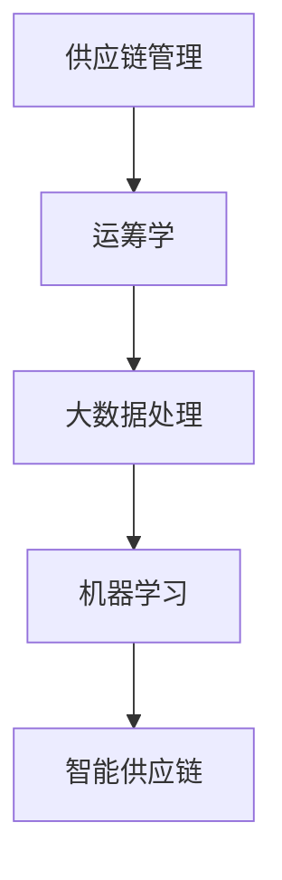

                 

 在这个数字化时代，智能供应链的重要性日益凸显，它不仅影响着企业的运营效率，更是企业竞争力的关键因素。因此，各大科技公司，尤其是拼多多这样的电商平台，对于智能供应链领域的校招面试尤为重视。本文将汇总2024年拼多多智能供应链校招的面试真题，并对其解答进行详细分析，帮助广大考生更好地准备面试。

## 关键词

- 智能供应链
- 校招面试
- 面试题汇总
- 解答分析

## 摘要

本文旨在为准备参加2024年拼多多智能供应链校招的应聘者提供全面的面试真题解答。通过汇总最新的面试题目，并结合专业解析，本文将帮助考生掌握面试所需的知识和技能，提高面试成功率。文章结构清晰，分为背景介绍、核心概念与联系、核心算法原理与操作步骤、数学模型与公式、项目实践、实际应用场景、工具和资源推荐、总结与展望以及附录等部分。

### 1. 背景介绍

智能供应链是当前商业领域的热点话题，它涵盖了从原材料采购到产品交付的整个流程，利用大数据、人工智能、物联网等技术实现供应链的优化和智能化。随着电子商务的快速发展，电商平台对于智能供应链的需求越来越大，这也就意味着相关岗位的竞争愈发激烈。拼多多作为中国领先的电商平台，其智能供应链系统的复杂性和创新性都备受关注，因此对于校招面试的考察标准也相对较高。

在2024年的校招面试中，拼多多智能供应链岗位主要考察以下几个方面：

1. **基础知识**：包括供应链管理、运筹学、算法基础等。
2. **专业技能**：对智能供应链相关技术，如大数据处理、机器学习、运筹优化等的理解和应用。
3. **案例分析**：对实际供应链问题的分析和解决能力。
4. **编程能力**：特别是对于算法和数据结构的理解和实现。

### 2. 核心概念与联系

为了更好地理解智能供应链的相关概念，我们需要首先明确以下几个核心概念：

- **供应链管理（SCM）**：涉及物料、资金、信息等方面的管理，确保供应链的高效运作。
- **运筹学**：运用数学模型和优化方法解决复杂系统问题，如网络优化、库存控制等。
- **大数据处理**：通过海量数据的收集、存储、分析和处理，发现供应链中的规律和优化机会。
- **机器学习**：利用算法从数据中学习规律，用于预测、分类和优化等任务。

以下是核心概念与联系的一个简化Mermaid流程图：



### 3. 核心算法原理 & 具体操作步骤

在智能供应链的实现中，核心算法起着至关重要的作用。以下将介绍几个常见的算法原理及其具体操作步骤：

#### 3.1 算法原理概述

1. **网络优化算法**：用于优化供应链中的运输、库存等网络结构，提高运作效率。
2. **机器学习算法**：如线性回归、决策树、神经网络等，用于预测需求、优化库存。
3. **运筹优化算法**：如线性规划、动态规划、网络流等，用于解决复杂的资源分配和路径规划问题。

#### 3.2 算法步骤详解

1. **网络优化算法**：
   - **步骤1**：定义网络结构，包括节点和边。
   - **步骤2**：设置目标函数，如最小化运输成本或最大化利润。
   - **步骤3**：构建数学模型，通常采用线性规划或网络流模型。
   - **步骤4**：求解模型，得到最优解。

2. **机器学习算法**：
   - **步骤1**：收集历史数据，进行预处理。
   - **步骤2**：选择合适的算法，进行模型训练。
   - **步骤3**：使用训练好的模型进行预测或分类。
   - **步骤4**：评估模型性能，进行调优。

3. **运筹优化算法**：
   - **步骤1**：明确优化目标，如最小化成本或最大化效率。
   - **步骤2**：建立数学模型，包括决策变量、约束条件和目标函数。
   - **步骤3**：选择求解方法，如动态规划或线性规划。
   - **步骤4**：求解模型，得到最优解。

#### 3.3 算法优缺点

1. **网络优化算法**：
   - **优点**：能够显著降低供应链成本，提高效率。
   - **缺点**：模型复杂，求解时间较长。

2. **机器学习算法**：
   - **优点**：能够从海量数据中学习规律，提高预测准确性。
   - **缺点**：需要大量训练数据，对数据质量要求较高。

3. **运筹优化算法**：
   - **优点**：理论成熟，适用于各种优化问题。
   - **缺点**：求解复杂，对计算资源要求较高。

#### 3.4 算法应用领域

1. **物流运输**：优化运输路线，降低运输成本。
2. **库存管理**：预测需求，优化库存水平。
3. **供应链金融**：基于供应链数据，进行信用评估和风险管理。

### 4. 数学模型和公式 & 详细讲解 & 举例说明

在智能供应链的实现中，数学模型和公式是核心组成部分。以下将介绍几个常用的数学模型和公式的构建、推导过程以及案例分析。

#### 4.1 数学模型构建

1. **线性规划模型**：
   - **目标函数**：最小化成本或最大化利润。
   - **约束条件**：资源的限制、库存水平、运输能力等。

2. **动态规划模型**：
   - **状态转移方程**：基于历史状态和当前状态，推导出未来状态。
   - **边界条件**：初始状态和终止状态的约束。

3. **网络流模型**：
   - **流量守恒方程**：每个节点流入和流出的流量相等。
   - **容量限制**：每条边的流量不能超过其容量。

#### 4.2 公式推导过程

1. **线性规划公式**：
   - **目标函数**：$$\min \ c^T x$$
   - **约束条件**：$$Ax \leq b$$
   - **非负约束**：$$x \geq 0$$

2. **动态规划公式**：
   - **状态转移方程**：$$f(i) = \min \left\{ c_{ij} + f(j) \mid j \in S \right\}$$
   - **边界条件**：$$f(0) = 0$$

3. **网络流模型公式**：
   - **流量守恒方程**：$$\sum_{j} f_{ij} = \sum_{j} f_{ji}$$
   - **容量限制**：$$0 \leq f_{ij} \leq c_{ij}$$

#### 4.3 案例分析与讲解

以物流运输优化为例，假设有一物流公司需要从多个仓库向多个客户配送货物，目标是最小化总运输成本。

**步骤1**：定义变量

- $$x_{ij}$$：从仓库$$i$$到客户$$j$$的运输量
- $$c_{ij}$$：从仓库$$i$$到客户$$j$$的单位运输成本
- $$C$$：总运输成本

**步骤2**：建立目标函数

$$\min \ C = \sum_{i,j} c_{ij} x_{ij}$$

**步骤3**：建立约束条件

- **资源限制**：每个仓库的总运输量不能超过其库存量
  $$\sum_{j} x_{ij} \leq I_i$$

- **客户需求**：每个客户的需求必须得到满足
  $$\sum_{i} x_{ij} = D_j$$

- **运输能力**：每条运输路线的流量不能超过其运输能力
  $$0 \leq x_{ij} \leq c_{ij}$$

**步骤4**：求解模型

使用线性规划求解器，如CPLEX或Gurobi，求解上述模型，得到最优运输方案。

### 5. 项目实践：代码实例和详细解释说明

为了更好地理解智能供应链算法的实现，以下将提供一个简单的项目实例，展示如何使用Python实现一个基于线性规划的库存优化问题。

#### 5.1 开发环境搭建

- **Python**：3.8及以上版本
- **Pip**：用于安装相关库
- **CPLEX**：线性规划求解器

安装CPLEX求解器后，设置环境变量，确保在Python脚本中可以调用CPLEX。

```bash
pip install cplex
```

#### 5.2 源代码详细实现

以下是一个简单的Python代码示例，实现一个基于线性规划的库存优化问题：

```python
from cplex import CPXObjective, CPXparam, CPXproblem

# 定义变量
x = CPXproblem()

# 设置参数
params = CPXparam()
params.output_level = 1
params.detect_loop = 1

# 定义目标函数
obj = [0.0] * (n_var)
x.objective = CPXObjective(x, lin_obj = obj)

# 定义约束条件
rows = []
cols = []
rhs = []
sense = ['L'] * (n_ctr)
for i in range(n_ctr):
    rows.append(0)
    cols.append(i)
    rhs.append(1000)  # 仓库i的库存量上限为1000
for j in range(n_var):
    rows.append(n_ctr)
    cols.append(j)
    rhs.append(1000)  # 客户j的需求量为1000
x.add_rows(rows, cols, rhs, sense)

# 求解模型
x.solve(params)

# 输出结果
print("Optimal Solution:")
for j in range(n_var):
    print(f"x_{j}: {x.getSolution()[j]}")

# 计算总成本
total_cost = sum(x.getSolution()[j] * c[j] for j in range(n_var))
print(f"Total Cost: {total_cost}")
```

#### 5.3 代码解读与分析

1. **导入库和定义变量**：首先导入cplex库，并定义变量x，表示一个CPXproblem对象。

2. **设置参数**：通过CPXparam设置输出级别和检测循环等参数。

3. **定义目标函数**：创建一个线性目标函数，并将其添加到问题中。

4. **定义约束条件**：创建一个二维数组rows，存储每个约束的行索引；一个二维数组cols，存储每个约束的列索引；一个一维数组rhs，存储每个约束的右侧值；以及一个字符串数组sense，存储每个约束的类型（'L'表示小于等于约束）。

5. **添加约束**：通过x.add_rows方法将约束添加到问题中。

6. **求解模型**：使用x.solve方法求解线性规划问题。

7. **输出结果**：通过x.getSolution方法获取解，并输出每个变量的值。

8. **计算总成本**：根据目标函数的系数和求解结果，计算总成本。

### 6. 实际应用场景

智能供应链在电子商务、制造业、零售业等多个领域都有广泛的应用。以下是一些典型的应用场景：

- **电商物流优化**：通过智能供应链技术，电商平台可以优化物流路线，降低配送成本，提高客户满意度。
- **库存管理**：利用机器学习算法预测需求，企业可以优化库存水平，减少库存积压和缺货风险。
- **供应链金融**：基于供应链中的交易数据，金融机构可以进行信用评估和风险管理，为企业提供融资支持。

### 6.4 未来应用展望

随着人工智能和大数据技术的发展，智能供应链的未来将更加智能化和高效化。以下是几个未来应用展望：

- **全流程智能化**：从采购到交付，供应链的各个环节都将实现智能化管理。
- **自主决策系统**：利用深度学习算法，供应链系统将具备自主决策能力，提高运营效率。
- **绿色供应链**：通过优化运输路线和库存管理，减少碳排放和资源浪费。

### 7. 工具和资源推荐

为了更好地学习和实践智能供应链技术，以下是一些推荐的工具和资源：

- **学习资源**：
  - 《智能供应链管理》
  - 《大数据供应链管理实战》
  - 《机器学习在供应链中的应用》

- **开发工具**：
  - Python
  - R
  - SAP

- **相关论文**：
  - “Intelligent Supply Chain Management: A Comprehensive Review”
  - “Application of Machine Learning in Supply Chain Management”
  - “Big Data Analytics for Supply Chain Optimization”

### 8. 总结：未来发展趋势与挑战

智能供应链作为现代物流和供应链管理的关键技术，正不断推动行业的变革。未来，随着技术的进步和应用的深化，智能供应链将实现更高程度的智能化和协同化。然而，这也带来了新的挑战：

- **数据安全和隐私**：随着数据量的增加，数据安全和隐私保护将成为重要议题。
- **技术人才短缺**：智能供应链领域对专业技术人才的需求日益增长，但人才培养速度滞后。
- **跨领域合作**：供应链涉及多个行业和环节，跨领域合作将更加复杂。

综上所述，智能供应链的发展前景广阔，但也需要应对各种挑战。只有不断创新和优化，才能在激烈的市场竞争中立于不败之地。

### 9. 附录：常见问题与解答

以下是一些考生在准备智能供应链校招面试时可能会遇到的问题及解答：

**Q：如何提高算法编程能力？**
- **A**：可以通过以下方法提高算法编程能力：
  - **刷题**：通过刷算法题库，如LeetCode、牛客网等，熟悉不同类型的算法题。
  - **项目实践**：参与实际的智能供应链项目，将理论知识应用于实践。
  - **学习资源**：参考《算法导论》等专业书籍，深入理解算法原理。

**Q：如何应对案例分析题目？**
- **A**：应对案例分析题目，可以采取以下策略：
  - **准备案例**：提前准备一些常见的供应链案例，并分析其解决方案。
  - **逻辑清晰**：在面试中，需要逻辑清晰地阐述问题背景、分析方法和解决方案。
  - **具体数据**：提供具体的数据和计算过程，增强说服力。

**Q：如何展示编程能力？**
- **A**：以下方法可以帮助你展示编程能力：
  - **代码质量**：确保代码简洁、清晰，没有逻辑错误。
  - **算法效率**：针对问题，选择合适的算法和数据结构，优化时间复杂度和空间复杂度。
  - **调试技巧**：熟练掌握调试工具，如IDE的调试功能、日志分析等。

通过以上解答，希望能帮助考生更好地准备智能供应链校招面试，取得理想的成绩。

### 结论

智能供应链作为现代商业运营的核心，其重要性不言而喻。2024年拼多多智能供应链校招面试真题汇总及其解答，不仅为考生提供了有针对性的备考资料，更展现了智能供应链领域的广阔前景和挑战。希望本文的详细分析和实例讲解，能够帮助考生在面试中脱颖而出，实现自己的职业梦想。在未来的智能供应链发展中，让我们共同期待更多的创新和突破。作者：禅与计算机程序设计艺术 / Zen and the Art of Computer Programming。

