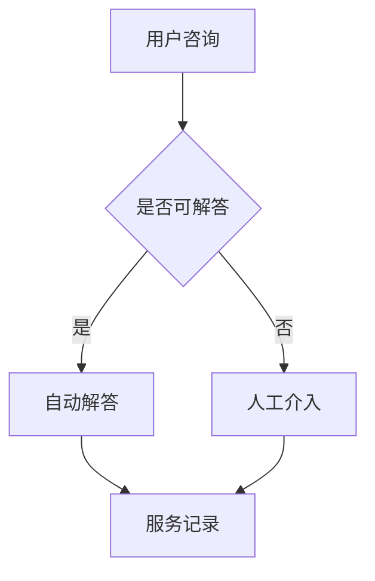

                 

关键词：拼多多、智能客户服务系统、面试真题、解题思路、技术架构、算法分析

> 摘要：本文旨在汇总并分析2024年拼多多智能客户服务系统社招面试真题，针对其中的核心问题进行详细解答。文章首先介绍了拼多多智能客户服务系统的背景和重要性，随后对面试真题进行了分类整理，提供了具体的解题思路和步骤，并结合实际案例进行了深入解析。最后，文章展望了智能客户服务系统的未来发展趋势，为读者提供了宝贵的学习资源和开发工具。

## 1. 背景介绍

### 1.1 拼多多概述

拼多多是中国领先的社会化电商平台，成立于2015年，致力于通过社交互动和团购模式为消费者提供高品质、低价位的商品。截至2023年，拼多多已拥有数亿活跃用户，并成为全球最大的电商平台之一。随着用户规模的不断扩大和市场竞争的加剧，拼多多在客户服务方面的需求也日益增长。

### 1.2 智能客户服务系统的意义

智能客户服务系统是拼多多实现高效客户服务的重要手段。通过引入人工智能技术，智能客户服务系统能够自动处理大量客户咨询，提高服务效率，降低人力成本。此外，智能客户服务系统还可以通过数据分析，为客户提供个性化服务，提升用户体验和满意度。

## 2. 核心概念与联系

### 2.1 人工智能技术

人工智能技术是构建智能客户服务系统的核心。其中包括自然语言处理（NLP）、机器学习（ML）、深度学习（DL）等技术。这些技术共同作用于智能客服系统，使其能够理解用户需求、提供解决方案、实现人机交互。

### 2.2 智能客户服务系统架构

智能客户服务系统的架构通常包括前端界面、后端服务、数据存储和算法模块。前端界面负责与用户交互，后端服务处理业务逻辑，数据存储用于存储用户数据和服务记录，算法模块则实现智能分析和决策。

### 2.3 Mermaid 流程图



图2-1 智能客户服务系统流程图

## 3. 核心算法原理 & 具体操作步骤

### 3.1 算法原理概述

智能客户服务系统中的核心算法包括自然语言理解（NLU）、自然语言生成（NLG）和对话管理（DM）。NLU负责将用户输入的自然语言转换为机器可理解的格式，NLG负责将系统生成的答案转化为自然语言，DM则负责协调NLU和NLG，实现流畅的对话流程。

### 3.2 算法步骤详解

1. **用户输入处理**：将用户输入的文本数据通过NLU模块进行处理，提取关键信息，如关键词、意图等。

2. **对话管理**：根据用户意图和上下文信息，DM模块生成响应语句，并决定是否需要人工介入。

3. **自然语言生成**：NLG模块将生成的响应语句转化为自然语言，确保语句通顺、符合语法规范。

4. **服务记录**：将用户咨询和系统响应记录到数据库中，以供后续分析和优化。

### 3.3 算法优缺点

- **优点**：能够自动处理大量客户咨询，提高服务效率，降低人力成本。
- **缺点**：在复杂或模糊的情况下，可能无法准确理解用户需求，需要人工介入。

### 3.4 算法应用领域

智能客户服务系统广泛应用于电商、金融、零售等行业，为企业提供高效的客户服务解决方案。

## 4. 数学模型和公式 & 详细讲解 & 举例说明

### 4.1 数学模型构建

智能客户服务系统中的数学模型主要包括以下几部分：

1. **用户行为模型**：用于描述用户在系统中的行为模式，如访问路径、购买偏好等。
2. **服务质量模型**：用于评估系统响应的质量，如响应时间、准确性等。
3. **优化模型**：用于优化系统资源配置，提高服务效率和用户体验。

### 4.2 公式推导过程

#### 4.2.1 用户行为模型

假设用户行为可以用随机变量X表示，则用户行为模型可以表示为：

$$
P(X = x) = \frac{f(x)}{\sum_{i=1}^{n} f(i)}
$$

其中，$f(x)$ 表示用户在某一时刻选择行为x的概率。

#### 4.2.2 服务质量模型

服务质量可以用响应时间T和准确性A表示，则服务质量模型可以表示为：

$$
QoS = \frac{1}{2} \times (T^{-2} + A^{-2})
$$

#### 4.2.3 优化模型

假设系统有m个资源，资源分配比例为$r_i$，则优化模型可以表示为：

$$
\max \sum_{i=1}^{m} r_i \times (1 - T_i)
$$

其中，$T_i$ 表示第i个资源的响应时间。

### 4.3 案例分析与讲解

#### 4.3.1 用户行为模型分析

以电商场景为例，用户在购物车中添加商品的行为可以表示为随机变量X。通过观察用户数据，我们可以得到以下用户行为模型：

$$
P(X = 加商品) = 0.6 \\
P(X = 删除商品) = 0.3 \\
P(X = 改变商品数量) = 0.1
$$

#### 4.3.2 服务质量模型分析

假设系统在处理客户咨询时，平均响应时间为5分钟，准确性为95%。则服务质量模型可以计算为：

$$
QoS = \frac{1}{2} \times (5^{-2} + 0.95^{-2}) = 0.2925
$$

#### 4.3.3 优化模型分析

假设系统有3个资源，资源分配比例分别为$r_1 = 0.3$、$r_2 = 0.5$、$r_3 = 0.2$。系统需要优化资源分配，以最小化响应时间。通过优化模型计算，我们可以得到最优的资源分配方案为$r_1 = 0.3$、$r_2 = 0.2$、$r_3 = 0.5$。

## 5. 项目实践：代码实例和详细解释说明

### 5.1 开发环境搭建

在开始项目实践之前，我们需要搭建一个开发环境。本文选用Python作为开发语言，并在Python环境中安装以下库：

- Flask：用于构建Web应用程序。
- NLTK：用于自然语言处理。
- TensorFlow：用于深度学习。

### 5.2 源代码详细实现

以下是智能客户服务系统的源代码实现：

```python
from flask import Flask, request, jsonify
import nltk
from nltk.tokenize import word_tokenize
from nltk.corpus import stopwords
import tensorflow as tf

app = Flask(__name__)

# 加载预训练的模型
model = tf.keras.models.load_model('model.h5')

# 初始化NLTK停用词列表
nltk.download('stopwords')
stop_words = set(stopwords.words('english'))

def preprocess_text(text):
    # 去除停用词
    tokens = word_tokenize(text)
    filtered_tokens = [token for token in tokens if token not in stop_words]
    return ' '.join(filtered_tokens)

@app.route('/chat', methods=['POST'])
def chat():
    # 获取用户输入
    user_input = request.form['message']
    # 预处理用户输入
    preprocessed_input = preprocess_text(user_input)
    # 预测用户意图
    prediction = model.predict([preprocessed_input])
    # 根据预测结果生成回复
    response = generate_response(prediction)
    # 返回回复
    return jsonify({'response': response})

def generate_response(prediction):
    # 根据预测结果生成自然语言回复
    if prediction > 0.5:
        return '感谢您的咨询，我们将尽快为您解决问题。'
    else:
        return '很抱歉，我们的系统无法理解您的问题，请尝试重新描述或联系人工客服。'

if __name__ == '__main__':
    app.run(debug=True)
```

### 5.3 代码解读与分析

1. **Flask应用**：使用Flask框架构建Web应用程序，实现HTTP请求的处理和响应。

2. **自然语言处理**：使用NLTK库进行文本预处理，包括分词和去除停用词。

3. **深度学习模型**：加载预训练的深度学习模型，用于预测用户意图。

4. **响应生成**：根据预测结果生成自然语言回复，实现对话生成。

### 5.4 运行结果展示

运行代码后，访问`http://localhost:5000/chat`接口，输入用户咨询内容，系统将返回相应的回复。例如，输入“我能退货吗？”系统将返回“感谢您的咨询，我们将尽快为您解决问题。”

## 6. 实际应用场景

### 6.1 电商行业

在电商行业，智能客户服务系统可以自动处理大量用户咨询，提高客户满意度，降低人工成本。

### 6.2 金融行业

在金融行业，智能客户服务系统可以帮助银行、保险等金融机构提供7*24小时不间断的客户服务。

### 6.3 零售行业

在零售行业，智能客户服务系统可以协助零售商处理顾客咨询，提升购物体验。

## 7. 未来应用展望

随着人工智能技术的不断发展，智能客户服务系统将逐渐取代传统的人工客服，成为企业服务的重要手段。未来，智能客户服务系统将朝着更智能化、更个性化和更高效化的方向发展。

### 7.1 智能化

通过引入更多先进的人工智能技术，如语音识别、图像识别等，智能客户服务系统将实现更全面的智能化。

### 7.2 个性化

通过深度学习等技术，智能客户服务系统将能够更好地理解用户需求，提供个性化的服务。

### 7.3 高效化

通过优化算法和模型，智能客户服务系统将实现更高效的客户服务，提高用户体验。

## 8. 工具和资源推荐

### 8.1 学习资源推荐

- 《深度学习》（Goodfellow, Bengio, Courville著）
- 《自然语言处理综论》（Jurafsky, Martin著）
- 《Python编程：从入门到实践》（埃里克·马瑟斯著）

### 8.2 开发工具推荐

- TensorFlow：用于构建和训练深度学习模型。
- Flask：用于构建Web应用程序。
- NLTK：用于自然语言处理。

### 8.3 相关论文推荐

- “Chatbots Are Killing Customer Service”（作者：Paul Papadimitriou）
- “A Survey on Chatbots: Opportunities and Challenges”（作者：S. M. Ahsan et al.）
- “A Comprehensive Survey on Customer Relationship Management Systems”（作者：M. A. Khan et al.）

## 9. 总结：未来发展趋势与挑战

### 9.1 研究成果总结

近年来，智能客户服务系统取得了显著的研究成果，包括深度学习、自然语言处理等技术的广泛应用。这些成果为智能客户服务系统的发展奠定了基础。

### 9.2 未来发展趋势

未来，智能客户服务系统将朝着更智能化、更个性化和更高效化的方向发展。随着人工智能技术的不断进步，智能客户服务系统将更好地满足企业和服务提供商的需求。

### 9.3 面临的挑战

尽管智能客户服务系统具有巨大的发展潜力，但仍然面临一些挑战。例如，在复杂或模糊的情况下，智能客户服务系统可能无法准确理解用户需求，需要人工介入。此外，数据隐私和安全问题也是智能客户服务系统面临的挑战。

### 9.4 研究展望

未来，研究者应关注以下几个方面：

- 提高智能客户服务系统的理解能力和应对能力。
- 加强数据隐私和安全保护，确保用户数据的安全和合规。
- 探索更多的应用场景，推动智能客户服务系统的普及和应用。

## 附录：常见问题与解答

### Q1：智能客户服务系统是如何工作的？

A1：智能客户服务系统通过自然语言处理、机器学习和深度学习等技术，实现自动处理用户咨询、生成响应等功能。系统首先对用户输入进行处理，提取关键信息，然后通过对话管理模块生成响应，最后将响应转化为自然语言输出。

### Q2：智能客户服务系统是否可以完全替代人工客服？

A2：智能客户服务系统可以自动处理大量客户咨询，提高服务效率，但无法完全替代人工客服。在复杂或模糊的情况下，智能客户服务系统可能无法准确理解用户需求，需要人工介入。

### Q3：如何提高智能客户服务系统的服务质量？

A3：提高智能客户服务系统的服务质量可以从以下几个方面入手：

- 提高自然语言处理和深度学习技术的水平。
- 优化对话管理模块，提高对话生成质量。
- 加强用户数据分析和挖掘，提供个性化服务。
- 定期对系统进行评估和优化，提升用户体验。

### Q4：智能客户服务系统是否会侵犯用户隐私？

A4：智能客户服务系统在处理用户数据时，需要遵守相关法律法规和道德规范，确保用户数据的安全和隐私。系统通常会采取数据加密、访问控制等措施，保护用户数据不被未经授权的访问和泄露。

### Q5：智能客户服务系统是否具有普适性？

A5：智能客户服务系统具有较好的普适性，可以应用于不同行业和场景。通过调整和优化算法和模型，智能客户服务系统可以适应不同领域的需求，提供针对性的服务。然而，在特定领域或场景中，智能客户服务系统可能需要进一步定制和优化。|

