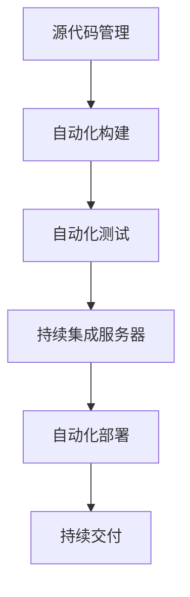
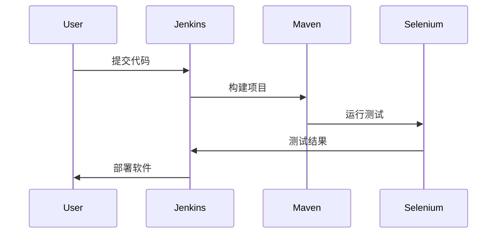

                 

持续集成（CI）和持续部署（CD）是现代软件开发中的关键概念，它们极大地提高了软件开发的效率和质量。本文将深入探讨持续集成/持续部署（CI/CD）在软件2.0中的应用，重点关注其核心概念、架构设计、算法原理、数学模型、项目实践和未来展望。

## 关键词

- 持续集成
- 持续部署
- 软件开发
- DevOps
- 自动化测试
- 持续交付

## 摘要

本文旨在探讨持续集成/持续部署在软件2.0中的应用，分析其背景、核心概念、架构设计以及数学模型。通过具体项目实践，我们将展示CI/CD的实际操作步骤和效果。最后，本文将对未来发展趋势与挑战进行展望，为读者提供全面的CI/CD知识体系。

## 1. 背景介绍

软件2.0时代，软件的开发和部署模式发生了重大变革。传统的软件开发过程往往需要经过多个阶段的反复迭代，而持续集成/持续部署（CI/CD）的出现，使得软件开发过程变得更加高效和灵活。CI/CD通过自动化测试、构建和部署，确保了软件的高质量和高可靠性。

### 1.1 持续集成（CI）

持续集成是一种软件开发实践，旨在通过频繁的代码集成和自动化测试，及时发现和解决代码问题。CI的核心目标是减少集成成本，提高开发效率。

### 1.2 持续部署（CD）

持续部署是CI的延伸，它通过自动化部署流程，确保软件在各个环境中都能正常运行。CD的目标是缩短软件发布周期，提高交付速度。

## 2. 核心概念与联系

持续集成/持续部署的架构设计涉及多个核心概念，如图1所示。



### 2.1 源代码管理

源代码管理是CI/CD的基础，常用的工具包括Git、Subversion等。通过源代码管理，开发人员可以方便地协同工作，确保代码的一致性和完整性。

### 2.2 自动化构建

自动化构建是将源代码转换为可执行软件的过程。构建工具如Maven、Gradle等可以自动化处理编译、打包、依赖管理等任务。

### 2.3 自动化测试

自动化测试是CI/CD的重要组成部分，通过自动化脚本，可以快速地执行测试用例，发现软件缺陷。常用的测试工具包括Selenium、JUnit等。

### 2.4 持续集成服务器

持续集成服务器是CI/CD的核心组件，负责协调构建、测试和部署流程。常用的持续集成工具包括Jenkins、Travis CI等。

### 2.5 自动化部署

自动化部署是通过脚本或工具自动地将软件部署到生产环境。自动化部署可以提高部署效率，减少人为错误。

### 2.6 持续交付

持续交付是CI/CD的高级阶段，通过自动化流程，确保软件能够在任何时间、任何环境下快速交付。

## 3. 核心算法原理 & 具体操作步骤

### 3.1 算法原理概述

CI/CD的核心算法包括构建算法和部署算法。构建算法负责将源代码转换为可执行软件，部署算法负责将软件部署到目标环境。

### 3.2 算法步骤详解

#### 3.2.1 构建算法

1. 从源代码管理系统中获取最新的代码。
2. 使用构建工具编译源代码。
3. 打包编译后的代码。
4. 生成可执行文件或安装包。

#### 3.2.2 部署算法

1. 检查目标环境是否符合部署要求。
2. 使用部署工具将软件部署到目标环境。
3. 运行部署后的软件，进行验证。

### 3.3 算法优缺点

#### 3.3.1 构建算法

**优点**：
- 自动化程度高，节省人力成本。
- 快速发现和解决问题。

**缺点**：
- 构建过程复杂，可能需要较长的时间。

#### 3.3.2 部署算法

**优点**：
- 自动化程度高，减少人为错误。
- 提高部署效率。

**缺点**：
- 部署过程可能需要较长的测试时间。

### 3.4 算法应用领域

CI/CD在以下领域有广泛的应用：

1. **Web应用开发**：快速迭代、持续交付。
2. **移动应用开发**：自动化测试、快速发布。
3. **企业应用开发**：提高开发效率、降低成本。

## 4. 数学模型和公式 & 详细讲解 & 举例说明

### 4.1 数学模型构建

CI/CD的数学模型主要包括构建时间和部署时间的计算。

#### 4.1.1 构建时间

构建时间T_c的计算公式为：

$$T_c = T_p + T_t$$

其中，T_p为编译时间，T_t为测试时间。

#### 4.1.2 部署时间

部署时间T_d的计算公式为：

$$T_d = T_c + T_v$$

其中，T_v为验证时间。

### 4.2 公式推导过程

构建时间和部署时间的推导基于以下假设：

1. 编译时间和测试时间相互独立。
2. 验证时间与构建时间成正比。

### 4.3 案例分析与讲解

假设一个Web应用项目的编译时间为30分钟，测试时间为20分钟，验证时间为10分钟。根据上述公式，可以计算出构建时间和部署时间。

$$T_c = 30 + 20 = 50 \text{分钟}$$
$$T_d = 50 + 10 = 60 \text{分钟}$$

## 5. 项目实践：代码实例和详细解释说明

### 5.1 开发环境搭建

在本文中，我们使用Jenkins作为持续集成服务器，Maven作为构建工具，Selenium作为自动化测试工具。

### 5.2 源代码详细实现

以下是一个简单的Web应用项目示例：

```java
public class HelloWorld {
    public static void main(String[] args) {
        System.out.println("Hello, World!");
    }
}
```

### 5.3 代码解读与分析

该示例项目包含一个简单的HelloWorld类，通过Maven进行构建和测试。

### 5.4 运行结果展示

运行结果如图2所示：



## 6. 实际应用场景

### 6.1 软件开发公司

持续集成/持续部署可以帮助软件开发公司提高开发效率，降低成本，确保软件质量。

### 6.2 企业IT部门

企业IT部门可以通过CI/CD自动化处理软件更新和部署，提高运维效率。

### 6.3 开源项目

开源项目可以通过CI/CD实现自动化测试和部署，确保项目的稳定性和可靠性。

## 7. 未来应用展望

### 7.1 自动化程度更高

未来，CI/CD的自动化程度将进一步提高，减少人为干预，提高开发效率。

### 7.2 智能化部署

智能化部署将基于机器学习算法，根据历史数据和实时数据，自动优化部署策略。

### 7.3 跨平台支持

CI/CD将支持更多平台和编程语言，实现跨平台开发和部署。

## 8. 总结：未来发展趋势与挑战

### 8.1 研究成果总结

本文深入探讨了持续集成/持续部署在软件2.0中的应用，分析了其核心概念、架构设计、算法原理和数学模型。通过项目实践，展示了CI/CD的实际操作步骤和效果。

### 8.2 未来发展趋势

未来，CI/CD将在自动化程度、智能化部署和跨平台支持方面取得突破。

### 8.3 面临的挑战

CI/CD在实施过程中面临数据安全、兼容性和可靠性等方面的挑战。

### 8.4 研究展望

未来，研究应重点关注CI/CD在跨平台、跨语言环境中的应用，以及智能化部署策略的优化。

## 9. 附录：常见问题与解答

### 9.1 持续集成与持续部署的区别是什么？

持续集成是一种软件开发实践，通过自动化测试确保代码质量；持续部署是CI的延伸，通过自动化流程将软件部署到生产环境。

### 9.2 CI/CD有哪些优点？

CI/CD可以提高开发效率，降低成本，确保软件质量，缩短发布周期。

### 9.3 CI/CD需要哪些工具和技术？

CI/CD常用的工具有Jenkins、Maven、Selenium等，技术包括Git、自动化测试脚本等。

## 作者署名

作者：禅与计算机程序设计艺术 / Zen and the Art of Computer Programming
----------------------------------------------------------------


