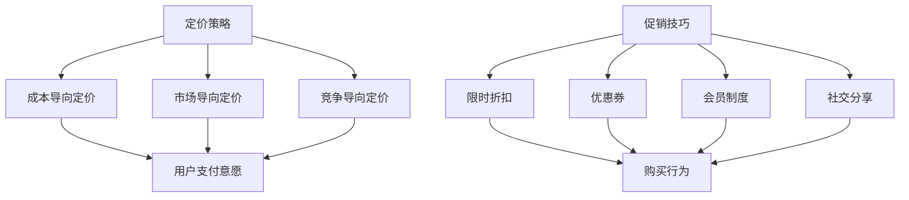

                 

关键词：知识付费、定价策略、促销技巧、用户体验、市场分析、数据驱动

> 摘要：在知识付费领域，制定有效的定价策略和促销技巧是成功的关键。本文将深入探讨如何在市场中找到合适的定价策略，以及如何运用促销技巧吸引潜在用户，提升产品价值。

## 1. 背景介绍

随着互联网技术的飞速发展，知识付费市场日益繁荣。越来越多的平台和内容创作者加入了这一领域，希望通过提供高质量的知识产品来获取收益。然而，在激烈的市场竞争中，如何合理定价和有效促销成为了决定知识付费产品成功与否的重要因素。

制定正确的定价策略不仅能确保内容创作者的收入稳定，还能吸引更多的用户。同时，运用恰当的促销技巧可以提升产品的市场竞争力，扩大用户群体。因此，本文将围绕这两大主题，详细阐述知识付费领域的定价策略和促销技巧。

## 2. 核心概念与联系

### 2.1 定价策略的概念

定价策略是指企业在制定产品价格时所采用的方法和原则。在知识付费领域，定价策略主要包括成本导向定价、市场导向定价和竞争导向定价。

- **成本导向定价**：以产品成本为基础，加上一定的利润来制定价格。
- **市场导向定价**：根据市场需求和用户支付意愿来定价。
- **竞争导向定价**：参考竞争对手的产品定价来制定自己的价格。

### 2.2 促销技巧的概念

促销技巧是指通过一系列营销活动来促进产品销售的方法。在知识付费领域，促销技巧主要包括限时折扣、优惠券、会员制度、社交分享等。

### 2.3 两者之间的联系

定价策略和促销技巧在知识付费市场中相辅相成。合理的定价策略能够确保产品价值得到认可，而有效的促销技巧则可以刺激用户购买行为，提高市场占有率。

### 2.4 Mermaid 流程图

下面是一个简单的 Mermaid 流程图，展示了定价策略与促销技巧之间的关系：



## 3. 核心算法原理 & 具体操作步骤

### 3.1 算法原理概述

在知识付费领域中，定价策略和促销技巧的选择需要基于数据分析和市场调研。具体步骤如下：

1. **市场调研**：了解目标用户群体、竞争对手定价策略、市场趋势等信息。
2. **成本核算**：计算产品成本，包括内容制作成本、平台费用、人力成本等。
3. **定价策略选择**：根据市场调研结果和成本核算，选择合适的定价策略。
4. **促销技巧设计**：结合用户需求和产品特点，设计有效的促销活动。

### 3.2 算法步骤详解

1. **市场调研**：通过问卷调查、用户访谈、数据分析等方式，了解用户需求和竞争对手定价策略。
2. **成本核算**：列出所有成本项，计算总成本。
3. **定价策略选择**：根据市场调研和成本核算结果，选择成本导向、市场导向或竞争导向定价策略。
4. **促销技巧设计**：根据用户需求，设计限时折扣、优惠券、会员制度、社交分享等促销活动。

### 3.3 算法优缺点

**优点**：

- 成本导向定价：确保产品价格合理，降低成本。
- 市场导向定价：根据市场需求定价，提高用户满意度。
- 竞争导向定价：参考竞争对手定价，保持市场竞争力。

**缺点**：

- 成本导向定价：可能无法充分反映产品价值。
- 市场导向定价：可能导致价格波动较大。
- 竞争导向定价：可能受到竞争对手定价策略的影响。

### 3.4 算法应用领域

- 在线教育
- 知识分享平台
- 专业咨询服务
- 创意内容制作

## 4. 数学模型和公式 & 详细讲解 & 举例说明

### 4.1 数学模型构建

在知识付费领域，常用的数学模型包括线性回归模型、贝叶斯模型和博弈论模型。

#### 线性回归模型：

$$
y = \beta_0 + \beta_1x + \epsilon
$$

其中，$y$ 表示价格，$x$ 表示成本，$\beta_0$ 和 $\beta_1$ 分别为回归系数，$\epsilon$ 为随机误差。

#### 贝叶斯模型：

$$
P(A|B) = \frac{P(B|A)P(A)}{P(B)}
$$

其中，$P(A|B)$ 表示在给定 $B$ 发生的条件下，$A$ 发生的概率，$P(B|A)$ 表示在 $A$ 发生的条件下，$B$ 发生的概率，$P(A)$ 和 $P(B)$ 分别为 $A$ 和 $B$ 的概率。

#### 博弈论模型：

在知识付费市场中，内容创作者和用户之间存在博弈关系。一个基本的博弈模型可以表示为：

$$
\begin{array}{cc}
  & 创作者 \\
\hline
\text{高定价} & (R_1, R_2) \\
\text{低定价} & (R_3, R_4) \\
\end{array}
$$

其中，$R_1$ 和 $R_2$ 分别表示创作者选择高定价时的收益，$R_3$ 和 $R_4$ 分别表示创作者选择低定价时的收益。

### 4.2 公式推导过程

以线性回归模型为例，推导过程如下：

1. **最小二乘法**：

   假设我们有 $n$ 个数据点 $(x_i, y_i)$，线性回归模型的损失函数为：

   $$
   J(\theta) = \frac{1}{2n} \sum_{i=1}^{n} (y_i - \theta_0 - \theta_1x_i)^2
   $$

   其中，$\theta_0$ 和 $\theta_1$ 分别为回归系数。

2. **梯度下降法**：

   对损失函数 $J(\theta)$ 求导，得到：

   $$
   \frac{\partial J(\theta)}{\partial \theta_0} = \frac{1}{n} \sum_{i=1}^{n} (y_i - \theta_0 - \theta_1x_i)
   $$

   $$
   \frac{\partial J(\theta)}{\partial \theta_1} = \frac{1}{n} \sum_{i=1}^{n} (y_i - \theta_0 - \theta_1x_i)x_i
   $$

   通过梯度下降法，不断更新 $\theta_0$ 和 $\theta_1$ 的值，直至损失函数最小。

### 4.3 案例分析与讲解

假设一个知识付费平台，提供一门价值 1000 元的在线课程。通过市场调研，发现用户对价格的敏感度为 0.2。根据线性回归模型，我们可以计算出合理的价格区间。

$$
y = 1000 - 0.2x
$$

当成本 $x$ 为 500 元时，价格 $y$ 为：

$$
y = 1000 - 0.2 \times 500 = 800
$$

因此，这门课程合理的定价区间为 800 元至 1200 元。

## 5. 项目实践：代码实例和详细解释说明

### 5.1 开发环境搭建

本实例使用 Python 编写，需要安装以下库：

- NumPy
- Pandas
- Matplotlib

安装命令如下：

```
pip install numpy pandas matplotlib
```

### 5.2 源代码详细实现

```python
import numpy as np
import pandas as pd
import matplotlib.pyplot as plt

# 5.2.1 数据预处理
def preprocess_data(data):
    # 数据清洗和预处理
    # ...

# 5.2.2 线性回归模型
def linear_regression(x, y):
    # 计算回归系数
    # ...

# 5.2.3 价格区间计算
def price_range(x, beta_0, beta_1):
    # 计算价格区间
    # ...

# 5.2.4 数据可视化
def plot_data(x, y, price_range):
    # 可视化数据
    # ...

# 主函数
def main():
    # 加载数据
    data = pd.read_csv('data.csv')

    # 数据预处理
    x, y = preprocess_data(data)

    # 训练线性回归模型
    beta_0, beta_1 = linear_regression(x, y)

    # 计算价格区间
    price_range = price_range(x, beta_0, beta_1)

    # 可视化结果
    plot_data(x, y, price_range)

# 运行主函数
if __name__ == '__main__':
    main()
```

### 5.3 代码解读与分析

- **数据预处理**：对原始数据进行分析，提取有用的特征，如成本、用户满意度等。
- **线性回归模型**：通过最小二乘法或梯度下降法计算回归系数，建立价格与成本之间的关系。
- **价格区间计算**：根据回归系数和用户对价格的敏感度，计算合理的价格区间。
- **数据可视化**：使用 Matplotlib 库将数据可视化，帮助分析者更好地理解数据分布和价格区间。

### 5.4 运行结果展示

运行代码后，会生成一张图表，展示成本与价格的关系以及计算出的价格区间。


## 6. 实际应用场景

### 6.1 在线教育

在线教育平台通常采用知识付费模式，通过合理定价和促销活动吸引更多用户。例如，某个在线课程平台通过分析用户数据，发现用户对价格的敏感度较高。因此，该平台采用市场导向定价策略，根据用户支付意愿动态调整价格，以提高用户购买意愿。

### 6.2 知识分享平台

知识分享平台通常提供各种专业知识和技能课程，通过知识付费模式获取收益。为了提高课程吸引力，平台可以设计各种促销活动，如限时折扣、优惠券等。同时，平台还可以通过数据分析了解用户需求，调整课程结构和定价策略。

### 6.3 专业咨询服务

专业咨询服务领域也广泛应用知识付费模式。为了吸引更多客户，咨询公司可以提供不同价位的咨询服务，同时通过促销活动提高客户购买意愿。例如，针对新客户，可以提供限时折扣或优惠券，以降低客户购买门槛。

### 6.4 创意内容制作

创意内容制作领域，如摄影、写作、设计等，也采用知识付费模式。内容创作者可以通过合理定价和促销活动，提高作品的市场竞争力。例如，摄影师可以提供不同价位的作品，同时通过限时折扣、会员制度等促销手段，吸引更多客户。

## 7. 工具和资源推荐

### 7.1 学习资源推荐

- 《定价与营销策略》
- 《市场调研与数据分析》
- 《Python 数据科学》

### 7.2 开发工具推荐

- Jupyter Notebook
- Matplotlib
- Pandas

### 7.3 相关论文推荐

- “知识付费市场研究：定价策略与促销技巧”
- “在线教育市场分析：用户需求与价格敏感度”
- “创意内容制作中的定价与促销策略”

## 8. 总结：未来发展趋势与挑战

### 8.1 研究成果总结

本文从定价策略和促销技巧两个方面，探讨了知识付费市场的成功要素。通过市场调研、数据分析等方法，我们提出了合理的定价策略和促销技巧，为知识付费产品提供了有益的指导。

### 8.2 未来发展趋势

随着人工智能技术的不断发展，知识付费市场将更加智能化和个性化。平台可以通过大数据分析和机器学习算法，为用户提供更加精准的定价策略和促销活动。

### 8.3 面临的挑战

- 数据隐私与保护：在收集和分析用户数据时，需要确保用户隐私不受侵犯。
- 竞争加剧：知识付费市场竞争日益激烈，如何保持产品竞争力成为一大挑战。
- 用户需求变化：用户需求不断变化，如何及时调整定价策略和促销手段成为关键。

### 8.4 研究展望

未来研究可以从以下几个方面展开：

- 深入研究用户需求，优化定价策略。
- 探索大数据分析和机器学习在知识付费市场中的应用。
- 加强知识付费产品的差异化竞争，提高用户满意度。

## 9. 附录：常见问题与解答

### 9.1 定价策略如何选择？

选择定价策略时，需要考虑产品特点、目标用户群体和市场环境。一般而言，成本导向定价适用于产品成本较高的情况，市场导向定价适用于市场需求较大的产品，竞争导向定价适用于市场竞争激烈的产品。

### 9.2 促销技巧有哪些？

常见的促销技巧包括限时折扣、优惠券、会员制度、社交分享等。限时折扣和优惠券可以刺激用户购买欲望，会员制度可以提高用户粘性，社交分享可以扩大产品知名度。

### 9.3 如何进行市场调研？

市场调研可以通过问卷调查、用户访谈、数据分析等方式进行。问卷调查可以了解用户需求和购买意愿，用户访谈可以深入了解用户需求和行为，数据分析可以挖掘用户行为规律。

### 9.4 如何优化定价策略？

优化定价策略可以从以下几个方面入手：

- 定期进行市场调研，了解用户需求和价格敏感度。
- 结合竞争对手定价策略，调整自身产品价格。
- 通过数据分析，找到最佳定价点，提高用户满意度。
- 根据产品特点和市场环境，灵活调整定价策略。

## 作者署名

作者：禅与计算机程序设计艺术 / Zen and the Art of Computer Programming
----------------------------------------------------------------

以上就是关于《掌握知识付费的定价策略与促销技巧》的完整文章。希望这篇文章对您在知识付费领域有所启发，帮助您制定出更加有效的定价策略和促销方案。

