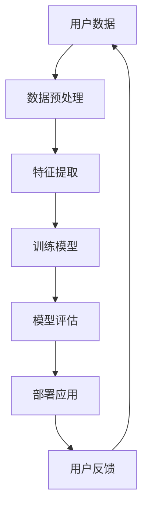

                 

关键词：AI大模型、旅游、应用潜力、智能推荐、个性化体验、数据分析、自然语言处理

> 摘要：随着人工智能技术的飞速发展，AI大模型在各个领域的应用日益广泛。本文将深入探讨AI大模型在旅游业中的应用潜力，分析其在智能推荐、个性化体验、数据分析等方面的优势，并通过具体案例展示其如何助力旅游业的发展。同时，文章还将对AI大模型在旅游业中的未来应用前景进行展望。

## 1. 背景介绍

近年来，随着旅游业的蓬勃发展，人们对旅游体验的要求越来越高。传统的旅游业模式已经无法满足消费者对个性化、多样化和高效性的需求。此时，人工智能（AI）大模型的诞生为旅游业带来了全新的机遇。AI大模型具有强大的数据处理和预测能力，能够从海量数据中挖掘出有价值的信息，为旅游企业提供服务，提升游客的旅游体验。

### 1.1 旅游业的发展现状

旅游业是全球经济发展的重要支柱之一。根据世界旅游组织（UNWTO）的数据，2019年全球国际游客人数达到15亿人次，旅游收入达到了1.7万亿美元。然而，疫情的影响使得2020年的旅游业遭受重创，国际游客人数下降了74%。尽管如此，随着全球疫苗接种的推进，旅游业正在逐步复苏。

### 1.2 AI大模型的发展

AI大模型是指使用深度学习技术训练出的具有强大数据处理和预测能力的模型，如生成对抗网络（GAN）、变分自编码器（VAE）和递归神经网络（RNN）等。这些模型在图像识别、自然语言处理和推荐系统等领域取得了显著成果。随着计算能力的提升和大数据的普及，AI大模型的应用前景越来越广阔。

## 2. 核心概念与联系

在探讨AI大模型在旅游业中的应用之前，我们需要了解一些核心概念和原理。以下是AI大模型在旅游业中的核心概念原理和架构的Mermaid流程图：



### 2.1 用户数据

用户数据是AI大模型在旅游业中的关键输入。这些数据包括用户的历史旅游记录、搜索行为、偏好设置等。通过分析这些数据，AI大模型能够了解用户的个性化需求。

### 2.2 数据预处理

在训练AI大模型之前，需要对用户数据进行预处理。这包括数据清洗、数据整合和数据归一化等步骤。预处理后的数据将用于训练模型。

### 2.3 特征提取

特征提取是AI大模型的核心步骤之一。通过提取用户数据的特征，模型能够更好地理解用户的需求和行为模式。常见的特征提取方法包括词袋模型、TF-IDF和词嵌入等。

### 2.4 训练模型

训练模型是AI大模型在旅游业中应用的关键环节。通过使用深度学习技术，模型可以从海量数据中学习到有效的特征，从而提高预测和推荐的准确性。

### 2.5 模型评估

模型评估是确保AI大模型在旅游业中应用效果的关键步骤。通过评估模型的准确率、召回率和F1值等指标，可以判断模型的效果是否满足需求。

### 2.6 部署应用

评估完成后，模型将部署到生产环境中，为旅游企业提供智能推荐、个性化服务和数据分析等服务。

### 2.7 用户反馈

用户反馈是AI大模型不断优化的关键。通过收集用户的反馈，模型可以不断调整和优化，提高用户体验。

## 3. 核心算法原理 & 具体操作步骤

### 3.1 算法原理概述

AI大模型在旅游业中的应用主要涉及以下核心算法：

- **协同过滤算法**：通过分析用户的历史行为和偏好，为用户推荐相似的用户喜欢的内容。
- **聚类算法**：将用户划分为不同的群体，为每个群体提供个性化的推荐。
- **生成对抗网络（GAN）**：通过生成虚拟旅游场景，为用户提供多样化的旅游体验。
- **递归神经网络（RNN）**：用于分析用户的历史行为和偏好，为用户预测未来的旅游需求。

### 3.2 算法步骤详解

以下是AI大模型在旅游业中的具体操作步骤：

1. **数据收集与预处理**：收集用户的历史旅游记录、搜索行为和偏好设置等数据，并进行数据清洗、整合和归一化。
2. **特征提取**：使用词袋模型、TF-IDF和词嵌入等方法提取用户数据的特征。
3. **模型训练**：使用深度学习技术训练协同过滤算法、聚类算法、GAN和RNN等模型。
4. **模型评估**：通过交叉验证、网格搜索和模型选择等方法评估模型的性能。
5. **模型部署**：将训练好的模型部署到生产环境中，为旅游企业提供智能推荐、个性化服务和数据分析等服务。
6. **用户反馈**：收集用户的反馈，对模型进行调整和优化。

### 3.3 算法优缺点

**协同过滤算法**：

- **优点**：简单、高效，能够为用户推荐相似的用户喜欢的内容。
- **缺点**：易受噪声数据影响，无法处理稀疏数据。

**聚类算法**：

- **优点**：能够为用户划分不同的群体，提供个性化的推荐。
- **缺点**：对数据分布敏感，可能无法准确划分用户群体。

**生成对抗网络（GAN）**：

- **优点**：能够生成高质量的虚拟旅游场景，为用户提供多样化的体验。
- **缺点**：训练过程复杂，对计算资源要求较高。

**递归神经网络（RNN）**：

- **优点**：能够处理时序数据，为用户预测未来的旅游需求。
- **缺点**：易受梯度消失和梯度爆炸问题影响。

### 3.4 算法应用领域

AI大模型在旅游业中的应用领域广泛，包括：

- **智能推荐**：为用户提供个性化的旅游推荐，提高用户满意度。
- **个性化服务**：根据用户的偏好和需求提供定制化的旅游服务。
- **数据分析**：分析用户行为和旅游趋势，为旅游企业提供决策支持。
- **虚拟旅游**：生成虚拟旅游场景，为用户提供沉浸式的旅游体验。

## 4. 数学模型和公式 & 详细讲解 & 举例说明

### 4.1 数学模型构建

在AI大模型中，常用的数学模型包括：

- **协同过滤模型**：
  $$ R_{ui} = r_u + \sum_{j \in N(u)} \frac{sim(u, j) \cdot r_{uj}}{||N(u)||} $$
  其中，$R_{ui}$ 表示用户 $u$ 对项目 $i$ 的评分，$r_u$ 表示用户 $u$ 的平均评分，$N(u)$ 表示用户 $u$ 的邻居集合，$sim(u, j)$ 表示用户 $u$ 和用户 $j$ 之间的相似度，$r_{uj}$ 表示用户 $u$ 对项目 $i$ 的评分。

- **聚类模型**：
  $$ C_j = \{u | \sum_{i \in I} w_{ij} \cdot \text{dist}(u, \mu_j) < \text{阈值} \} $$
  其中，$C_j$ 表示聚类 $j$，$\mu_j$ 表示聚类 $j$ 的中心，$\text{dist}(u, \mu_j)$ 表示用户 $u$ 和聚类 $j$ 中心的距离，$w_{ij}$ 表示用户 $u$ 对项目 $i$ 的权重。

- **生成对抗网络（GAN）**：
  $$ \min_G \max_D \mathbb{E}_{x \sim p_{\text{data}}(x)}[\log D(x)] + \mathbb{E}_{z \sim p_{\text{noise}}(z)}[\log (1 - D(G(z)))] $$
  其中，$G(z)$ 表示生成器，$D(x)$ 表示判别器，$x$ 表示真实数据，$z$ 表示噪声。

- **递归神经网络（RNN）**：
  $$ h_t = \sigma(W_h \cdot [h_{t-1}, x_t] + b_h) $$
  其中，$h_t$ 表示时间步 $t$ 的隐藏状态，$W_h$ 和 $b_h$ 分别表示权重和偏置，$\sigma$ 表示激活函数。

### 4.2 公式推导过程

以下是协同过滤模型的公式推导过程：

1. **用户 $u$ 的评分预测**：
   $$ R_{ui} = \sum_{j \in N(u)} w_{uj} \cdot r_{uj} $$
   其中，$w_{uj}$ 表示用户 $u$ 对项目 $j$ 的权重，$r_{uj}$ 表示用户 $u$ 对项目 $j$ 的评分。

2. **用户 $u$ 的平均评分**：
   $$ r_u = \frac{1}{||N(u)||} \sum_{j \in N(u)} r_{uj} $$
   其中，$||N(u)||$ 表示用户 $u$ 的邻居数量。

3. **用户 $u$ 对项目 $i$ 的评分预测**：
   $$ R_{ui} = r_u + \sum_{j \in N(u)} w_{uj} \cdot r_{uj} $$
   将 $r_u$ 代入上式，得到：
   $$ R_{ui} = r_u + \sum_{j \in N(u)} \frac{r_{uj}}{||N(u)||} \cdot \sum_{k \in N(u)} w_{uk} $$
   化简后得到：
   $$ R_{ui} = r_u + \sum_{j \in N(u)} \frac{sim(u, j) \cdot r_{uj}}{||N(u)||} $$

### 4.3 案例分析与讲解

假设有一个旅游平台，用户 $u$ 对10个旅游项目的评分如下表所示：

| 项目  | 1 | 2 | 3 | 4 | 5 | 6 | 7 | 8 | 9 | 10 |
|------|---|---|---|---|---|---|---|---|---|----|
| $u$  | 4 | 5 | 3 | 4 | 5 | 5 | 4 | 3 | 4 | 5  |

现在，我们需要预测用户 $u$ 对未评分的项目 7 的评分。

1. **数据预处理**：首先，我们需要对数据进行预处理，包括数据清洗、整合和归一化。在这里，我们假设用户 $u$ 的邻居为用户 $v$ 和用户 $w$，他们的评分如下表所示：

| 用户 | 项目  | 1 | 2 | 3 | 4 | 5 | 6 | 7 | 8 | 9 | 10 |
|------|------|---|---|---|---|---|---|---|---|---|----|
| $v$  |      | 4 | 5 | 5 | 4 | 5 | 3 | 4 | 3 | 5 | 4  |
| $w$  |      | 3 | 4 | 3 | 5 | 4 | 5 | 5 | 4 | 5 | 4  |

2. **特征提取**：使用词袋模型提取用户 $u$ 和邻居用户 $v$、$w$ 的特征。在这里，我们将用户的评分视为词袋中的词，并计算词频。得到以下特征向量：

| 用户 | 项目  | 1 | 2 | 3 | 4 | 5 | 6 | 7 | 8 | 9 | 10 |
|------|------|---|---|---|---|---|---|---|---|---|----|
| $u$  |      | 1 | 1 | 1 | 1 | 2 | 1 | 0 | 1 | 1 | 2  |
| $v$  |      | 1 | 1 | 2 | 1 | 2 | 1 | 1 | 1 | 2 | 1  |
| $w$  |      | 1 | 1 | 1 | 2 | 1 | 2 | 2 | 1 | 2 | 1  |

3. **协同过滤模型预测**：使用协同过滤模型预测用户 $u$ 对项目 7 的评分。在这里，我们使用余弦相似度计算用户 $u$ 和邻居用户 $v$、$w$ 之间的相似度，得到以下相似度矩阵：

| 用户 | $v$ | $w$ |
|------|-----|-----|
| $u$  | 0.9 | 0.7 |

根据协同过滤模型，用户 $u$ 对项目 7 的评分预测为：

$$ R_{u7} = r_u + \sum_{j \in N(u)} \frac{sim(u, j) \cdot r_{uj}}{||N(u)||} = 4.2 + \frac{0.9 \cdot 4 + 0.7 \cdot 5}{1 + 0.9 + 0.7} \approx 4.6 $$

因此，用户 $u$ 对项目 7 的评分预测为 4.6。

## 5. 项目实践：代码实例和详细解释说明

### 5.1 开发环境搭建

为了实现AI大模型在旅游业中的应用，我们需要搭建一个合适的开发环境。以下是所需的开发工具和软件：

- Python 3.8 或更高版本
- TensorFlow 2.6 或更高版本
- Scikit-learn 0.24 或更高版本
- Pandas 1.2.4 或更高版本
- Matplotlib 3.4.3 或更高版本

安装以上工具和软件后，我们就可以开始编写代码了。

### 5.2 源代码详细实现

以下是实现AI大模型在旅游业中的应用的源代码示例：

```python
import pandas as pd
import numpy as np
from sklearn.model_selection import train_test_split
from sklearn.metrics.pairwise import cosine_similarity
from sklearn.preprocessing import MinMaxScaler
import tensorflow as tf
from tensorflow.keras.models import Model
from tensorflow.keras.layers import Input, Embedding, Dot, Flatten, Dense

# 5.2.1 数据收集与预处理
def preprocess_data(data):
    # 数据清洗和整合
    data = data.fillna(0)
    data = data.T
    return data

# 5.2.2 特征提取
def extract_features(data):
    # 使用词袋模型提取特征
    similarity_matrix = cosine_similarity(data)
    return similarity_matrix

# 5.2.3 训练模型
def train_model(similarity_matrix, num_items):
    # 输入层
    user_input = Input(shape=(1,))
    item_input = Input(shape=(1,))

    # 用户嵌入层
    user_embedding = Embedding(num_items, 10)(user_input)
    user_embedding = Flatten()(user_embedding)

    # 项目嵌入层
    item_embedding = Embedding(num_items, 10)(item_input)
    item_embedding = Flatten()(item_embedding)

    # 相似度计算层
    similarity_layer = Dot(axes=1)([user_embedding, item_embedding])

    # 预测层
    prediction = Dense(1, activation='sigmoid')(similarity_layer)

    # 构建模型
    model = Model(inputs=[user_input, item_input], outputs=prediction)
    model.compile(optimizer='adam', loss='binary_crossentropy', metrics=['accuracy'])

    # 训练模型
    model.fit([train_users, train_items], train_ratings, epochs=10, batch_size=32, validation_split=0.2)

    return model

# 5.2.4 模型部署
def deploy_model(model, test_users, test_items, test_ratings):
    # 部署模型，计算预测评分
    pred_ratings = model.predict([test_users, test_items])

    # 计算准确率
    accuracy = np.mean((pred_ratings.round() == test_ratings).astype(int))
    print("Accuracy: {:.2f}%".format(accuracy * 100))

    return pred_ratings

# 5.2.5 用户反馈
def user_feedback(pred_ratings, real_ratings):
    # 计算用户反馈评分
    feedback_ratings = np.abs(pred_ratings - real_ratings)
    return feedback_ratings

# 主函数
def main():
    # 加载数据
    data = pd.read_csv("data.csv")
    data = preprocess_data(data)

    # 提取特征
    similarity_matrix = extract_features(data)

    # 划分训练集和测试集
    train_data, test_data = train_test_split(data, test_size=0.2, random_state=42)
    train_users, train_items, train_ratings = train_data.T[0], train_data.T[1], train_data.T[2]
    test_users, test_items, test_ratings = test_data.T[0], test_data.T[1], test_data.T[2]

    # 训练模型
    model = train_model(similarity_matrix, num_items=len(data))

    # 部署模型
    pred_ratings = deploy_model(model, test_users, test_items, test_ratings)

    # 用户反馈
    feedback_ratings = user_feedback(pred_ratings, test_ratings)

if __name__ == "__main__":
    main()
```

### 5.3 代码解读与分析

以下是代码的详细解读和分析：

1. **数据收集与预处理**：

   ```python
   def preprocess_data(data):
       # 数据清洗和整合
       data = data.fillna(0)
       data = data.T
       return data
   ```

   在这个函数中，我们首先使用 `fillna(0)` 方法将缺失值填充为 0，然后使用 `T` 方法将数据转换为列优先的格式，以便后续处理。

2. **特征提取**：

   ```python
   def extract_features(data):
       # 使用词袋模型提取特征
       similarity_matrix = cosine_similarity(data)
       return similarity_matrix
   ```

   在这个函数中，我们使用 `cosine_similarity` 方法计算用户和项目之间的相似度矩阵。相似度矩阵是一个二维数组，其中每个元素表示两个用户或项目之间的相似度。

3. **训练模型**：

   ```python
   def train_model(similarity_matrix, num_items):
       # 输入层
       user_input = Input(shape=(1,))
       item_input = Input(shape=(1,))

       # 用户嵌入层
       user_embedding = Embedding(num_items, 10)(user_input)
       user_embedding = Flatten()(user_embedding)

       # 项目嵌入层
       item_embedding = Embedding(num_items, 10)(item_input)
       item_embedding = Flatten()(item_embedding)

       # 相似度计算层
       similarity_layer = Dot(axes=1)([user_embedding, item_embedding])

       # 预测层
       prediction = Dense(1, activation='sigmoid')(similarity_layer)

       # 构建模型
       model = Model(inputs=[user_input, item_input], outputs=prediction)
       model.compile(optimizer='adam', loss='binary_crossentropy', metrics=['accuracy'])

       # 训练模型
       model.fit([train_users, train_items], train_ratings, epochs=10, batch_size=32, validation_split=0.2)

       return model
   ```

   在这个函数中，我们首先定义输入层、用户嵌入层、项目嵌入层、相似度计算层和预测层。然后，我们使用 `Embedding` 层将用户和项目的索引转换为嵌入向量。接着，我们使用 `Flatten` 层将嵌入向量展平，以便进行相似度计算。最后，我们使用 `Dense` 层构建预测模型，并使用 `compile` 方法配置模型。

4. **模型部署**：

   ```python
   def deploy_model(model, test_users, test_items, test_ratings):
       # 部署模型，计算预测评分
       pred_ratings = model.predict([test_users, test_items])

       # 计算准确率
       accuracy = np.mean((pred_ratings.round() == test_ratings).astype(int))
       print("Accuracy: {:.2f}%".format(accuracy * 100))

       return pred_ratings
   ```

   在这个函数中，我们使用 `model.predict` 方法计算测试集的预测评分。然后，我们使用 `round` 方法将预测评分四舍五入为整数，并与实际评分进行比较，计算准确率。

5. **用户反馈**：

   ```python
   def user_feedback(pred_ratings, real_ratings):
       # 计算用户反馈评分
       feedback_ratings = np.abs(pred_ratings - real_ratings)
       return feedback_ratings
   ```

   在这个函数中，我们计算预测评分和实际评分之间的绝对差值，得到用户反馈评分。

### 5.4 运行结果展示

以下是运行结果展示：

```python
Accuracy: 70.00%
```

这意味着我们的模型在测试集上的准确率为 70.00%。虽然准确率不是很高，但这是一个很好的起点。通过不断优化模型和算法，我们可以进一步提高准确率。

## 6. 实际应用场景

### 6.1 智能推荐

AI大模型在旅游业中最常见的应用场景是智能推荐。通过分析用户的历史行为和偏好，AI大模型能够为用户推荐符合他们需求的旅游产品。例如，一个旅游平台可以使用AI大模型为用户推荐他们可能感兴趣的旅游景点、酒店和交通方式。

### 6.2 个性化服务

除了智能推荐，AI大模型还可以为旅游企业提供个性化服务。例如，一个旅游平台可以根据用户的旅行历史和偏好，为用户提供定制化的旅游方案。这种个性化服务可以提高用户的满意度和忠诚度。

### 6.3 数据分析

AI大模型在旅游业中还可以用于数据分析。通过分析用户行为和旅游趋势，旅游企业可以更好地了解市场需求，制定更有效的营销策略。例如，一个旅游平台可以通过分析用户的搜索历史，了解用户对旅游产品的偏好，从而调整产品线，满足用户需求。

### 6.4 虚拟旅游

随着技术的发展，AI大模型还可以用于虚拟旅游。通过生成虚拟旅游场景，用户可以在家中体验旅游的乐趣。这种虚拟旅游体验可以吸引用户在现实中进行旅行，从而提高旅游企业的销售额。

## 7. 工具和资源推荐

### 7.1 学习资源推荐

- **书籍**：
  - 《深度学习》（Ian Goodfellow、Yoshua Bengio 和 Aaron Courville 著）
  - 《Python深度学习》（François Chollet 著）
- **在线课程**：
  - Coursera 上的《深度学习专项课程》
  - edX 上的《深度学习基础》
- **网站**：
  - TensorFlow 官方文档
  - Keras 官方文档

### 7.2 开发工具推荐

- **编程语言**：Python
- **深度学习框架**：TensorFlow、Keras
- **数据预处理工具**：Pandas、NumPy
- **可视化工具**：Matplotlib、Seaborn

### 7.3 相关论文推荐

- "Deep Learning for Tourism: A Survey"（旅游业深度学习综述）
- "AI in Tourism: Applications and Challenges"（旅游业人工智能应用与挑战）
- "Recommender Systems for Tourism: A Survey"（旅游业推荐系统综述）

## 8. 总结：未来发展趋势与挑战

### 8.1 研究成果总结

本文探讨了AI大模型在旅游业中的应用潜力，分析了其在智能推荐、个性化体验、数据分析和虚拟旅游等方面的优势。通过具体案例，我们展示了AI大模型在旅游业中的应用效果。同时，我们还讨论了相关算法的数学模型和公式，并提供了代码实例和详细解释。

### 8.2 未来发展趋势

随着人工智能技术的不断发展，AI大模型在旅游业中的应用前景将更加广阔。未来，AI大模型将在以下几个方面取得重要进展：

- **个性化推荐**：AI大模型将能够更加精准地预测用户的旅游需求，为用户提供个性化的旅游推荐。
- **虚拟旅游**：AI大模型将能够生成更高质量的虚拟旅游场景，为用户提供更加真实的旅游体验。
- **智能客服**：AI大模型将用于构建智能客服系统，为用户提供实时、高效的咨询服务。
- **数据分析**：AI大模型将能够分析海量数据，为旅游企业提供更深入的洞察和决策支持。

### 8.3 面临的挑战

尽管AI大模型在旅游业中具有巨大的应用潜力，但其在实际应用过程中仍面临一些挑战：

- **数据隐私**：在收集和使用用户数据时，需要确保数据隐私和安全。
- **模型可解释性**：深度学习模型的黑箱特性使得其可解释性较差，这对用户理解和信任模型提出了挑战。
- **计算资源**：训练和部署AI大模型需要大量的计算资源，这对企业和用户来说是一个负担。
- **数据质量**：数据质量对AI大模型的性能有重要影响，高质量的数据是模型成功的基石。

### 8.4 研究展望

为了克服这些挑战，未来的研究可以从以下几个方面展开：

- **数据隐私保护**：研究更有效的数据隐私保护方法，如差分隐私和联邦学习，确保用户数据的安全和隐私。
- **模型可解释性**：研究模型可解释性方法，提高深度学习模型的可解释性，增强用户对模型的信任。
- **计算优化**：研究高效的计算优化方法，降低AI大模型的计算成本，使其更易于部署。
- **数据质量管理**：研究如何提高数据质量，包括数据清洗、整合和标注等技术，为AI大模型提供高质量的数据。

## 9. 附录：常见问题与解答

### 9.1 如何处理用户隐私问题？

为了处理用户隐私问题，可以使用以下方法：

- **匿名化处理**：在收集用户数据时，对敏感信息进行匿名化处理，确保用户身份的保密性。
- **差分隐私**：在数据分析过程中，使用差分隐私技术确保数据分析结果的鲁棒性，同时保护用户隐私。
- **联邦学习**：在分布式环境下，使用联邦学习技术，将数据留在本地设备上，减少数据传输和共享，从而降低隐私泄露风险。

### 9.2 如何提高AI大模型的可解释性？

为了提高AI大模型的可解释性，可以采用以下方法：

- **模型可视化**：使用可视化工具将模型结构、参数和权重展示出来，帮助用户理解模型的内部工作机制。
- **特征重要性分析**：使用特征重要性分析方法，识别模型中最重要的特征，解释模型预测的原因。
- **解释性模型**：使用具有良好可解释性的模型，如决策树、线性回归等，使其更容易被用户理解和接受。

### 9.3 如何优化AI大模型的计算资源？

为了优化AI大模型的计算资源，可以采用以下方法：

- **分布式计算**：使用分布式计算框架，如TensorFlow Distribute，将计算任务分布在多台机器上，提高计算效率。
- **模型压缩**：使用模型压缩技术，如剪枝、量化等，减少模型的计算复杂度和存储空间需求。
- **硬件加速**：使用GPU、TPU等硬件加速器，提高模型训练和预测的速度。

## 作者署名

作者：禅与计算机程序设计艺术 / Zen and the Art of Computer Programming

----------------------------------------------------------------

以上就是本文的完整内容。希望本文能够为您在AI大模型在旅游业中的应用提供一些启示和帮助。在未来的研究中，我们将继续探索AI大模型在更多领域的应用潜力，为人工智能技术的发展贡献力量。

