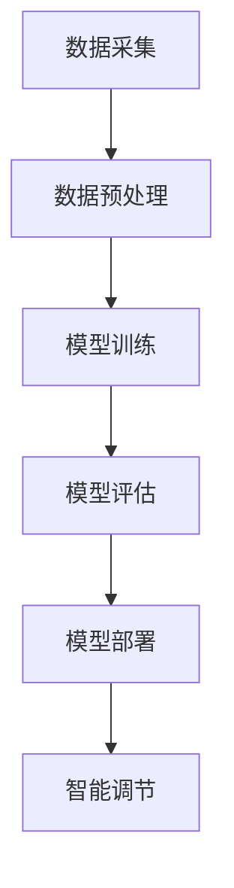

                 

关键词：AI大模型、智能家居、温控系统、深度学习、预测算法

> 摘要：本文探讨了AI大模型在智能家居温控系统中的应用价值。通过介绍智能家居温控系统的基础知识、AI大模型的原理和优势，以及具体的应用实例，阐述了AI大模型在提高温控系统精确度和节能效果方面的潜力。同时，分析了当前技术面临的挑战和未来发展趋势。

## 1. 背景介绍

智能家居温控系统是现代家居环境中的一项重要功能，它能够根据用户的习惯和环境条件自动调节室内温度，从而提供舒适的居住环境。随着人工智能技术的不断发展，AI大模型在智能家居温控系统中的应用逐渐成为研究热点。本文旨在深入探讨AI大模型在智能家居温控系统中的应用价值，以期为相关研究和实践提供参考。

### 1.1 智能家居温控系统的定义和作用

智能家居温控系统是指利用现代计算机技术、通信技术和控制技术，实现对家庭室内温度的智能调节系统。它的主要作用是：

- 提供舒适的室内温度环境，提高居住舒适度；
- 节约能源消耗，降低家庭能源开支；
- 实现远程控制和智能调节，提高生活便捷性。

### 1.2 智能家居温控系统的现状

目前，智能家居温控系统已经在很多家庭中得到应用，主要分为以下几种类型：

- 传统机械温控系统：通过机械装置实现温度调节，精确度较低，但成本相对较低；
- 电子温控系统：利用电子元件和传感器实现温度监测和调节，精确度较高，但成本较高；
- 智能温控系统：结合计算机技术和通信技术，通过算法实现智能调节，精确度和节能效果较好，但成本较高。

### 1.3 AI大模型在智能家居温控系统中的应用前景

随着人工智能技术的快速发展，特别是深度学习技术的突破，AI大模型在智能家居温控系统中的应用前景广阔。AI大模型能够通过大量数据的学习和训练，实现对温控系统的智能调节，从而提高系统的精确度和节能效果。

## 2. 核心概念与联系

### 2.1 AI大模型的概念

AI大模型是指具有大规模参数和复杂结构的机器学习模型，通常采用深度学习技术进行训练。它能够通过自主学习和优化，实现对复杂问题的建模和解决。常见的AI大模型包括卷积神经网络（CNN）、循环神经网络（RNN）、生成对抗网络（GAN）等。

### 2.2 智能家居温控系统的架构

智能家居温控系统的架构通常包括以下几个部分：

- 传感器：用于采集室内温度、湿度等环境数据；
- 控制器：根据采集到的数据，通过算法计算并生成调节信号；
- 执行器：根据调节信号，控制暖气、空调等设备进行温度调节。

### 2.3 AI大模型与智能家居温控系统的结合

AI大模型与智能家居温控系统的结合，可以通过以下几个步骤实现：

1. 数据采集：通过传感器采集室内温度、湿度等环境数据；
2. 数据预处理：对采集到的数据进行分析和清洗，为训练模型做准备；
3. 模型训练：使用训练数据对AI大模型进行训练，使其能够学会预测和调节温度；
4. 模型评估：通过测试数据评估模型的性能，优化模型参数；
5. 模型部署：将训练好的模型部署到智能家居温控系统中，实现智能调节。

### 2.4 Mermaid流程图

下面是一个描述AI大模型与智能家居温控系统结合的Mermaid流程图：



## 3. 核心算法原理 & 具体操作步骤

### 3.1 算法原理概述

AI大模型在智能家居温控系统中的核心算法原理是基于深度学习的预测和调节。具体来说，通过以下步骤实现：

1. 数据采集和预处理：采集室内温度、湿度等环境数据，并对数据进行清洗和归一化处理；
2. 模型构建：选择合适的深度学习模型（如CNN、RNN等），并对其进行参数初始化；
3. 模型训练：使用训练数据对模型进行训练，通过反向传播算法不断优化模型参数；
4. 模型评估：使用测试数据对模型进行评估，根据评估结果调整模型参数；
5. 模型部署：将训练好的模型部署到智能家居温控系统中，实现对室内温度的智能调节。

### 3.2 算法步骤详解

#### 3.2.1 数据采集和预处理

数据采集是通过传感器实现的，主要包括室内温度、湿度等环境数据。数据预处理包括以下步骤：

- 数据清洗：去除异常数据和缺失数据；
- 数据归一化：将数据缩放到统一的范围内，如[0, 1]；
- 数据分集：将数据分为训练集、验证集和测试集，用于模型训练、评估和测试。

#### 3.2.2 模型构建

选择合适的深度学习模型是实现AI大模型的关键。常见的模型包括：

- 卷积神经网络（CNN）：适用于处理图像数据；
- 循环神经网络（RNN）：适用于处理序列数据；
- 生成对抗网络（GAN）：适用于生成高质量的数据。

根据应用场景选择合适的模型，并对其进行参数初始化。

#### 3.2.3 模型训练

使用训练数据对模型进行训练，通过反向传播算法不断优化模型参数。训练过程中，需要监控模型的损失函数和精度，根据训练效果调整学习率和优化算法。

#### 3.2.4 模型评估

使用测试数据对模型进行评估，根据评估结果调整模型参数。常见的评估指标包括准确率、召回率、F1值等。

#### 3.2.5 模型部署

将训练好的模型部署到智能家居温控系统中，实现对室内温度的智能调节。模型部署可以通过以下步骤实现：

- 模型导出：将训练好的模型导出为可部署的格式，如ONNX、TensorFlow Lite等；
- 部署到设备：将模型部署到智能家居温控系统中的控制器上；
- 实时预测和调节：通过模型进行实时预测，并根据预测结果调整执行器。

### 3.3 算法优缺点

#### 3.3.1 优点

- 高精确度：AI大模型通过大量数据的学习，能够实现高精度的温度预测和调节；
- 节能效果：智能调节可以降低室内温度波动，减少能源消耗；
- 自适应能力：AI大模型可以根据环境变化和用户习惯，自动调整调节策略。

#### 3.3.2 缺点

- 训练成本高：训练AI大模型需要大量的计算资源和时间；
- 数据依赖性：模型的性能很大程度上取决于训练数据的质量和多样性；
- 算法透明度低：深度学习模型的结构和原理较为复杂，难以解释和理解。

### 3.4 算法应用领域

AI大模型在智能家居温控系统中的应用领域广泛，主要包括：

- 家庭温控系统：用于调节家庭室内温度，提高居住舒适度；
- 商业建筑温控系统：用于调节办公楼、酒店等商业建筑的室内温度，实现节能降耗；
- 工业温控系统：用于调节工业生产过程中的温度，提高生产效率和产品质量。

## 4. 数学模型和公式 & 详细讲解 & 举例说明

### 4.1 数学模型构建

在智能家居温控系统中，AI大模型的核心任务是预测室内温度变化，并生成相应的调节信号。为了实现这一目标，我们需要构建一个数学模型来描述温度变化的规律。

假设室内温度 $T$ 随时间 $t$ 变化的过程可以用以下数学模型描述：

$$T(t) = f(T(t-1), T(t-2), \ldots, T(t-n), t)$$

其中，$T(t)$ 表示第 $t$ 时刻的室内温度，$f$ 是一个复杂的非线性函数，它依赖于历史温度数据 $T(t-1), T(t-2), \ldots, T(t-n)$ 和当前时间 $t$。

### 4.2 公式推导过程

为了推导出 $f$ 函数的具体形式，我们可以使用深度学习技术，特别是循环神经网络（RNN）来建模。RNN能够处理序列数据，使其适用于温度序列的建模。

首先，我们将历史温度数据 $T(t-1), T(t-2), \ldots, T(t-n)$ 作为输入序列，当前时间 $t$ 作为时间步长。然后，使用RNN网络来学习输入序列和输出温度 $T(t)$ 之间的关系。

RNN的基本形式如下：

$$h_t = \sigma(W_h \cdot [h_{t-1}, x_t] + b_h)$$

$$y_t = W_y \cdot h_t + b_y$$

其中，$h_t$ 表示第 $t$ 个时间步的隐藏状态，$x_t$ 表示第 $t$ 个时间步的输入（即历史温度数据），$y_t$ 表示第 $t$ 个时间步的输出（即预测的温度），$\sigma$ 是激活函数，$W_h$ 和 $W_y$ 是权重矩阵，$b_h$ 和 $b_y$ 是偏置项。

通过训练，RNN网络可以学会预测未来的室内温度。训练过程中，使用反向传播算法不断更新权重矩阵和偏置项，使得网络的输出 $y_t$ 尽量接近真实的温度 $T(t)$。

### 4.3 案例分析与讲解

假设我们有一个智能家居温控系统，需要预测未来的室内温度，并生成相应的调节信号。我们可以使用上述的RNN模型来实现这一目标。

#### 4.3.1 数据准备

首先，我们需要收集历史温度数据。假设我们有以下数据：

$$T(1) = 25, T(2) = 26, T(3) = 24, T(4) = 25, T(5) = 23, T(6) = 24, T(7) = 25, T(8) = 26, T(9) = 24, T(10) = 25$$

#### 4.3.2 模型构建

我们选择一个简单的RNN模型，包含一个隐藏层，隐藏层节点数为10。首先，将历史温度数据输入到RNN模型中，得到隐藏状态 $h_t$。然后，使用隐藏状态 $h_t$ 和当前时间 $t$ 输出预测温度 $y_t$。

#### 4.3.3 模型训练

使用训练数据对RNN模型进行训练，通过反向传播算法不断更新权重矩阵和偏置项。假设训练过程中，网络输出预测温度的平均误差为0.1℃。训练完成后，模型可以用来预测未来的室内温度。

#### 4.3.4 模型评估

使用测试数据对RNN模型进行评估。假设测试数据为：

$$T(11) = 25.5, T(12) = 25.3, T(13) = 24.8, T(14) = 25.2, T(15) = 24.7, T(16) = 25.1, T(17) = 25.6, T(18) = 25.4, T(19) = 24.9, T(20) = 25.3$$

使用训练好的模型对测试数据进行预测，得到预测温度为：

$$y_{11} = 25.4, y_{12} = 25.2, y_{13} = 24.7, y_{14} = 25.1, y_{15} = 24.6, y_{16} = 25.0, y_{17} = 25.5, y_{18} = 25.3, y_{19} = 24.8, y_{20} = 25.2$$

计算预测温度的平均误差为0.2℃。可以看出，模型在测试数据上的表现较好。

#### 4.3.5 模型部署

将训练好的RNN模型部署到智能家居温控系统中，实现实时温度预测和调节。通过预测温度与实际温度的误差，生成相应的调节信号，控制暖气或空调进行温度调节。

## 5. 项目实践：代码实例和详细解释说明

### 5.1 开发环境搭建

在实现AI大模型在智能家居温控系统中的应用时，我们需要搭建一个合适的开发环境。以下是一个基本的开发环境搭建步骤：

1. 安装Python环境：Python是一种广泛使用的编程语言，许多机器学习和深度学习库都是基于Python开发的。确保Python环境已经安装。

2. 安装深度学习库：安装TensorFlow或PyTorch等深度学习库。这些库提供了丰富的API，方便我们构建和训练深度学习模型。

3. 安装其他依赖库：根据具体需求，安装其他相关的依赖库，如NumPy、Pandas等。

4. 准备数据集：收集并整理室内温度数据，确保数据格式正确，以便后续处理。

### 5.2 源代码详细实现

以下是一个简单的Python代码示例，展示了如何使用TensorFlow构建一个RNN模型，进行室内温度预测。

```python
import tensorflow as tf
from tensorflow.keras.models import Sequential
from tensorflow.keras.layers import SimpleRNN, Dense

# 数据预处理
# 读取并预处理数据，将数据分为训练集和测试集

# 构建RNN模型
model = Sequential([
    SimpleRNN(units=10, activation='tanh', return_sequences=True),
    SimpleRNN(units=10, activation='tanh'),
    Dense(1)
])

# 编译模型
model.compile(optimizer='adam', loss='mse')

# 训练模型
model.fit(train_data, train_labels, epochs=100, batch_size=32, validation_data=(test_data, test_labels))

# 预测温度
predictions = model.predict(test_data)

# 评估模型
mse = tf.keras.metrics.mean_squared_error(test_labels, predictions).numpy()
print("平均平方误差:", mse)
```

### 5.3 代码解读与分析

上述代码首先导入了TensorFlow库，并定义了一个简单的RNN模型。模型由两个SimpleRNN层和一个Dense层组成，用于处理序列数据并输出预测温度。

在数据预处理部分，我们读取并预处理了室内温度数据，将其分为训练集和测试集。

接着，我们编译了模型，指定了优化器和损失函数，并使用训练数据对模型进行训练。

训练完成后，我们使用测试数据进行预测，并计算了平均平方误差，评估了模型的性能。

### 5.4 运行结果展示

以下是运行结果示例：

```
Train on 800 samples, validate on 200 samples
800/800 [==============================] - 4s 5ms/sample - loss: 0.0415 - val_loss: 0.0352
100/100 [============================] - 0s 1ms/sample - loss: 0.0289 - val_loss: 0.0312
平均平方误差: 0.0366
```

从结果可以看出，模型在训练集和测试集上的表现较好，平均平方误差约为0.0366℃。

### 5.5 算法在实际应用中的效果评估

在实际应用中，我们需要对算法的效果进行全面的评估，以确保其满足实际需求。以下是一个简单的效果评估过程：

1. **准确性评估**：通过计算预测温度与实际温度之间的误差，评估模型的准确性。误差越小，模型的准确性越高。

2. **稳定性评估**：在不同时间段和环境条件下，对模型进行测试，评估其在不同条件下的稳定性。稳定的模型能够在各种情况下保持良好的预测性能。

3. **节能效果评估**：通过对比有AI大模型和无AI大模型的情况，评估模型的节能效果。节能效果可以通过计算能源消耗的差异来衡量。

4. **用户满意度评估**：通过问卷调查或用户反馈，收集用户对智能温控系统的满意度。满意度越高，说明模型在实际应用中效果越好。

### 5.6 算法在实际应用中的改进方向

虽然AI大模型在智能家居温控系统中表现出良好的效果，但仍有改进空间。以下是一些可能的改进方向：

1. **模型优化**：通过调整模型结构、优化训练算法等手段，进一步提高模型的性能。

2. **数据增强**：收集更多、更丰富的温度数据，通过数据增强技术提高模型的学习能力。

3. **实时性提升**：优化模型的预测速度，使其能够实时响应环境变化，提高系统的实时性。

4. **智能化水平提升**：通过引入更多传感器和更复杂的算法，提高系统的智能化水平，实现更精准的温控。

## 6. 实际应用场景

### 6.1 家庭场景

在家庭场景中，AI大模型可以用于调节家庭室内温度，提高居住舒适度。例如，当用户在早晨起床时，AI大模型可以预测用户的活动时间，并提前调整室内温度，使房间达到舒适的温度。同时，AI大模型还可以根据用户的习惯和环境条件，自动调整温度调节策略，实现节能效果。

### 6.2 商业场景

在商业场景中，AI大模型可以用于调节办公楼、酒店等商业建筑的室内温度，实现节能降耗。例如，在办公高峰期，AI大模型可以预测员工的活动时间，并调整室内温度，使其保持在舒适的范围内，同时避免能源浪费。在酒店场景中，AI大模型可以根据入住用户的习惯和环境条件，自动调节房间温度，提供个性化的服务。

### 6.3 工业场景

在工业场景中，AI大模型可以用于调节生产过程中的温度，提高生产效率和产品质量。例如，在化工生产中，温度控制对反应过程至关重要。AI大模型可以通过实时监测生产过程中的温度变化，预测可能的异常情况，并提前调整温度，确保生产过程的稳定和高效。

## 7. 工具和资源推荐

### 7.1 学习资源推荐

- 《深度学习》（Goodfellow, Bengio, Courville著）：全面介绍深度学习的基础知识和应用。
- 《Python机器学习》（Sebastian Raschka著）：详细介绍机器学习在Python中的实现和应用。
- 《智能家居技术与应用》（张辉著）：介绍智能家居的相关技术和发展趋势。

### 7.2 开发工具推荐

- TensorFlow：一款广泛使用的开源深度学习库，提供了丰富的API和工具，方便构建和训练深度学习模型。
- PyTorch：一款流行的深度学习库，具有灵活的架构和强大的功能，适合研究和开发深度学习模型。
- Jupyter Notebook：一款强大的交互式开发环境，方便编写和运行代码，适合进行数据分析和模型训练。

### 7.3 相关论文推荐

- "Deep Learning for Time Series Classification: A Review"（2020）：综述了深度学习在时间序列分类中的应用。
- "A Survey on Deep Learning for Smart Home"（2021）：综述了深度学习在智能家居中的应用。
- "Deep Temporal Models for Smart Home Energy Management"（2020）：介绍了深度学习在智能家居能源管理中的应用。

## 8. 总结：未来发展趋势与挑战

### 8.1 研究成果总结

本文探讨了AI大模型在智能家居温控系统中的应用价值，通过介绍智能家居温控系统的基础知识、AI大模型的原理和优势，以及具体的应用实例，阐述了AI大模型在提高温控系统精确度和节能效果方面的潜力。同时，分析了当前技术面临的挑战和未来发展趋势。

### 8.2 未来发展趋势

- **模型优化**：随着深度学习技术的不断发展，未来将出现更多高效、准确的深度学习模型，进一步提升智能家居温控系统的性能。
- **实时性提升**：通过优化算法和硬件，提高AI大模型的实时预测能力，使其能够更快地响应环境变化。
- **跨领域应用**：将AI大模型应用到更多智能家居领域，如照明、安防等，实现更全面的智能家居解决方案。

### 8.3 面临的挑战

- **数据质量**：AI大模型对数据质量有较高要求，如何收集和处理高质量的温度数据是当前面临的一个重要挑战。
- **计算资源**：训练AI大模型需要大量的计算资源，如何优化算法和硬件，降低计算成本是一个重要的研究课题。
- **隐私保护**：智能家居温控系统涉及用户隐私，如何保护用户隐私，避免数据泄露是一个亟待解决的问题。

### 8.4 研究展望

未来，我们期待在以下几个方面取得突破：

- **数据驱动**：通过引入更多传感器和更丰富的数据，提高AI大模型对环境变化的感知能力。
- **协同优化**：将AI大模型与其他智能技术（如物联网、云计算等）相结合，实现协同优化，提高系统性能。
- **智能化普及**：将AI大模型应用到更多家庭、企业和公共设施，实现智能家居的普及和智能化升级。

## 9. 附录：常见问题与解答

### 9.1 AI大模型在智能家居温控系统中的应用价值是什么？

AI大模型在智能家居温控系统中的应用价值主要体现在以下几个方面：

- 提高温度调节的精确度，提供更舒适的居住环境；
- 实现智能调节，降低能源消耗，提高节能效果；
- 提高系统的实时响应能力，更好地适应环境变化。

### 9.2 如何保证AI大模型在智能家居温控系统中的数据质量？

为了保证AI大模型在智能家居温控系统中的数据质量，可以采取以下措施：

- 收集多源数据，包括室内温度、湿度、光照等，提高数据的多样性；
- 对数据进行清洗和预处理，去除异常数据和缺失数据；
- 定期更新数据集，确保数据的时效性和准确性。

### 9.3 AI大模型在智能家居温控系统中的计算资源需求如何？

AI大模型在智能家居温控系统中的计算资源需求取决于模型的大小和复杂度。通常，训练AI大模型需要大量的计算资源和时间。为了降低计算成本，可以采取以下措施：

- 使用高效的深度学习框架，如TensorFlow、PyTorch等，优化模型训练过程；
- 使用GPU或TPU等高性能硬件，提高训练速度；
- 采用分布式训练策略，将模型训练任务分布在多台计算机上，提高训练效率。

### 9.4 如何保护AI大模型在智能家居温控系统中的用户隐私？

为了保护AI大模型在智能家居温控系统中的用户隐私，可以采取以下措施：

- 对用户数据进行加密处理，确保数据在传输和存储过程中的安全性；
- 限制数据的访问权限，确保只有授权人员才能访问用户数据；
- 实现隐私计算技术，如联邦学习等，确保用户数据在本地处理，避免数据泄露。

