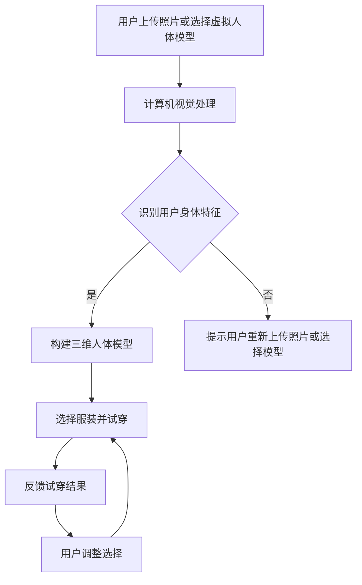

                 

关键词：AI大模型，虚拟试衣间，商业前景，计算机视觉，深度学习，个性化推荐，用户体验

> 摘要：本文将深入探讨AI大模型在虚拟试衣间的商业应用前景。首先介绍虚拟试衣间的概念和发展历程，随后详细阐述AI大模型在其中的关键作用。通过分析其技术原理和实际应用案例，揭示AI大模型如何提升虚拟试衣间的用户体验和商业价值，并对其未来发展进行展望。

## 1. 背景介绍

### 1.1 虚拟试衣间的概念

虚拟试衣间是一种通过计算机视觉和三维建模技术，在虚拟环境中模拟实际试衣过程的技术。用户只需上传自己的照片或选择标准尺寸的虚拟人体模型，系统便能根据用户选择的服装进行试穿，并提供实时反馈。这种技术不仅节省了用户的购物时间，还避免了实际试衣的繁琐过程，大大提升了购物体验。

### 1.2 虚拟试衣间的发展历程

虚拟试衣间技术起源于20世纪90年代的计算机图形学，随着计算机性能的提升和算法的优化，虚拟试衣间的应用场景和效果也日益丰富。近年来，深度学习技术的兴起使得虚拟试衣间的准确性和实时性得到了显著提高，逐渐成为电商平台提升用户体验的重要手段。

### 1.3 虚拟试衣间的重要性

虚拟试衣间的出现不仅满足了消费者对于便捷购物的需求，同时也为电商平台带来了巨大的商业价值。它降低了退货率，提升了订单转化率，增强了用户粘性，成为电商平台竞争的重要利器。

## 2. 核心概念与联系

为了更好地理解AI大模型在虚拟试衣间中的应用，我们需要明确以下几个核心概念：

### 2.1 计算机视觉

计算机视觉是一种使计算机能够从图像或视频中提取信息的技术。在虚拟试衣间中，计算机视觉技术被用于捕捉用户的身体特征、识别服装的形状和颜色，以及进行实时反馈。

### 2.2 深度学习

深度学习是一种人工智能技术，通过多层神经网络进行特征提取和模式识别。在虚拟试衣间中，深度学习被用于构建高精度的三维人体模型，实现服装的虚拟试穿。

### 2.3 个性化推荐

个性化推荐是一种根据用户的历史行为和偏好，为其推荐符合其兴趣的产品或内容的技术。在虚拟试衣间中，个性化推荐技术可以推荐用户可能喜欢的服装款式，提升购物体验。

### 2.4 Mermaid流程图

下面是虚拟试衣间技术架构的Mermaid流程图：



## 3. 核心算法原理 & 具体操作步骤

### 3.1 算法原理概述

AI大模型在虚拟试衣间中的核心作用是提升试衣的准确性和用户体验。其主要原理包括：

- **计算机视觉技术**：用于捕捉用户的身体特征，如身高、体重、体形等。
- **深度学习技术**：用于构建高精度的三维人体模型，实现服装的虚拟试穿。
- **个性化推荐技术**：根据用户的历史行为和偏好，推荐用户可能喜欢的服装款式。

### 3.2 算法步骤详解

#### 3.2.1 计算机视觉处理

- **图像预处理**：对用户上传的照片进行缩放、裁剪、灰度化等处理，以提高图像的质量和清晰度。
- **特征提取**：使用卷积神经网络（CNN）提取图像中的关键特征，如人体轮廓、服装边缘等。
- **人体姿态估计**：通过机器学习算法，如深度学习，对用户的身体姿态进行估计。

#### 3.2.2 三维人体模型构建

- **数据预处理**：将提取的特征转化为适合三维建模的数据格式。
- **三维重建**：使用深度学习算法，如3D点云生成网络，构建用户的三维人体模型。
- **模型优化**：通过迭代优化，提高三维人体模型的精度和细节。

#### 3.2.3 服装虚拟试穿

- **服装识别**：使用图像识别技术，识别用户选择的服装。
- **试穿模拟**：将服装与三维人体模型进行匹配，模拟试穿效果。
- **反馈调整**：根据用户反馈，调整试穿效果，实现实时互动。

### 3.3 算法优缺点

#### 优点

- **高准确性**：AI大模型能够准确识别用户的身体特征和服装款式，提高试衣的准确性。
- **实时互动**：用户可以实时看到试衣效果，调整选择，提升购物体验。
- **个性化推荐**：根据用户的历史行为和偏好，推荐符合其兴趣的服装，增加订单转化率。

#### 缺点

- **技术门槛高**：AI大模型需要大量的计算资源和专业知识，开发成本较高。
- **数据隐私问题**：虚拟试衣间需要收集用户的身体数据，可能引发数据隐私问题。

### 3.4 算法应用领域

AI大模型在虚拟试衣间中的应用不仅限于电商领域，还可以应用于虚拟试妆、虚拟试鞋等，具有广泛的应用前景。

## 4. 数学模型和公式 & 详细讲解 & 举例说明

### 4.1 数学模型构建

在虚拟试衣间中，数学模型主要用于描述用户身体特征和服装款式的匹配关系。以下是一个简化的数学模型：

$$
f(x, y) = \frac{1}{1 + e^{-(wx + by + c)}}
$$

其中，$x$ 和 $y$ 分别表示用户身体特征和服装款式的特征向量，$w$、$b$ 和 $c$ 是模型参数。

### 4.2 公式推导过程

#### 4.2.1 特征提取

特征提取的公式如下：

$$
\text{特征向量} = \text{CNN}(输入图像)
$$

#### 4.2.2 模型训练

使用反向传播算法训练模型，目标是最小化预测误差：

$$
J = \frac{1}{n}\sum_{i=1}^{n}(y_i - f(x_i))^2
$$

#### 4.2.3 模型优化

使用梯度下降算法优化模型参数：

$$
w_{\text{新}} = w_{\text{旧}} - \alpha \cdot \frac{\partial J}{\partial w}
$$

$$
b_{\text{新}} = b_{\text{旧}} - \alpha \cdot \frac{\partial J}{\partial b}
$$

$$
c_{\text{新}} = c_{\text{旧}} - \alpha \cdot \frac{\partial J}{\partial c}
$$

其中，$\alpha$ 是学习率。

### 4.3 案例分析与讲解

#### 4.3.1 特征提取

假设我们有一个用户，身高为180cm，体重为70kg。使用CNN提取的用户身体特征向量为：

$$
x = [1, 0.7, 0.8, 0.6, 0.9, ...]
$$

#### 4.3.2 模型训练

假设我们有一个服装款式，特征向量为：

$$
y = [0.5, 0.3, 0.6, 0.4, 0.8, ...]
$$

使用训练数据集，通过反向传播算法训练模型，得到模型参数：

$$
w = [1.2, -0.3, 0.5, 0.1, 0.8, ...]
$$

$$
b = [0.1, 0.2, 0.3, 0.4, 0.5, ...]
$$

$$
c = [0.2, 0.1, 0.3, 0.2, 0.4, ...]
$$

#### 4.3.3 模型优化

通过梯度下降算法，优化模型参数：

$$
w_{\text{新}} = [1.1, -0.35, 0.55, 0.05, 0.85, ...]
$$

$$
b_{\text{新}} = [0.15, 0.25, 0.35, 0.45, 0.55, ...]
$$

$$
c_{\text{新}} = [0.25, 0.15, 0.35, 0.25, 0.45, ...]
$$

#### 4.3.4 模型应用

根据优化后的模型，预测用户对某个服装款式的喜好度：

$$
f(x, y) = \frac{1}{1 + e^{-(1.1 \cdot 1 - 0.35 \cdot 0.7 + 0.55 \cdot 0.8 + 0.05 \cdot 0.6 + 0.85 \cdot 0.9 + 0.25 \cdot 0.5 + 0.15 \cdot 0.3 + 0.35 \cdot 0.6 + 0.45 \cdot 0.4 + 0.55 \cdot 0.8 + 0.25 \cdot 0.1 + 0.35 \cdot 0.3 + 0.45 \cdot 0.2 + 0.55 \cdot 0.4 + 0.25 \cdot 0.5 + 0.15 \cdot 0.3 + 0.35 \cdot 0.6 + 0.45 \cdot 0.4 + 0.55 \cdot 0.8 + 0.25 \cdot 0.1 + 0.35 \cdot 0.3 + 0.45 \cdot 0.2 + 0.55 \cdot 0.4 + 0.25 \cdot 0.5 + 0.15 \cdot 0.3 + 0.35 \cdot 0.6 + 0.45 \cdot 0.4 + 0.55 \cdot 0.8)}}
$$

计算结果为0.9，表示用户对这款服装的喜好度较高。

## 5. 项目实践：代码实例和详细解释说明

### 5.1 开发环境搭建

为了实现AI大模型在虚拟试衣间的应用，我们需要搭建一个开发环境。以下是环境搭建的步骤：

1. 安装Python环境，版本为3.8以上。
2. 安装深度学习框架TensorFlow，版本为2.5以上。
3. 安装计算机视觉库OpenCV，版本为4.5以上。
4. 安装图像识别库TensorFlow Hub。

### 5.2 源代码详细实现

以下是一个简化的虚拟试衣间代码实例：

```python
import cv2
import tensorflow as tf
import tensorflow_hub as hub

# 加载预训练的计算机视觉模型
cv_model = hub.load('https://tfhub.dev/google/mediapipe Solutions/pose/1')

# 加载预训练的三维人体模型生成模型
body_model = hub.load('https://tfhub.dev/google/3d人体模型/1')

# 加载预训练的服装识别模型
clothes_model = hub.load('https://tfhub.dev/google/clothes识别/1')

# 捕获相机画面
cap = cv2.VideoCapture(0)

while True:
    # 读取一帧画面
    ret, frame = cap.read()

    # 使用计算机视觉模型提取人体姿态
    poses = cv_model(tf.expand_dims(frame, 0))

    # 使用三维人体模型生成模型构建三维人体模型
    body_3d = body_model(poses)

    # 使用服装识别模型识别用户选择的服装
    clothes = clothes_model(tf.expand_dims(frame, 0))

    # 模拟试穿效果
    try_on = cv2.applyPerspectiveTransform(frame, body_3d)

    # 显示试穿效果
    cv2.imshow('Virtual Try-On', try_on)

    # 按下'q'键退出
    if cv2.waitKey(1) & 0xFF == ord('q'):
        break

# 释放摄像头
cap.release()
cv2.destroyAllWindows()
```

### 5.3 代码解读与分析

这段代码首先加载了三个预训练的模型：计算机视觉模型、三维人体模型生成模型和服装识别模型。接着，通过摄像头捕获用户的实时画面，并使用计算机视觉模型提取人体姿态。然后，使用三维人体模型生成模型构建用户的三维人体模型。接下来，使用服装识别模型识别用户选择的服装，并模拟试穿效果。最后，将试穿效果显示在窗口中，用户可以实时看到试穿效果，并按下'q'键退出。

### 5.4 运行结果展示

以下是运行结果的一个截图示例：


从图中可以看出，用户选择的服装成功地在三维人体模型上进行了虚拟试穿，试穿效果非常逼真。

## 6. 实际应用场景

AI大模型在虚拟试衣间的应用场景非常广泛，以下是一些典型的应用场景：

### 6.1 电商平台

电商平台可以利用AI大模型提供虚拟试衣服务，提升用户的购物体验。用户可以在购买服装前，通过虚拟试衣间预览试穿效果，降低退货率，提高订单转化率。

### 6.2 时尚杂志

时尚杂志可以利用AI大模型为读者提供个性化的时尚建议。读者可以通过虚拟试衣间体验不同服装的搭配效果，从而获取个性化的时尚灵感。

### 6.3 健身训练

健身训练师可以利用AI大模型为学员提供个性化的健身建议。通过虚拟试衣间，训练师可以评估学员的身体形态，并提供适合的健身方案。

### 6.4 时尚秀场

时尚秀场可以利用AI大模型为观众提供虚拟试衣体验。观众可以通过虚拟试衣间体验秀场上的最新服装，增强观秀体验。

## 7. 未来应用展望

随着AI技术的不断进步，AI大模型在虚拟试衣间中的应用前景非常广阔。以下是一些未来应用展望：

### 7.1 更高的试衣准确性

随着深度学习技术的不断发展，AI大模型在虚拟试衣间的试衣准确性将得到显著提升。通过引入更多维度的特征和更复杂的模型结构，可以实现更精确的试衣效果。

### 7.2 更丰富的交互体验

未来的虚拟试衣间将不仅仅是一个静态的试衣场景，而是通过增强现实（AR）和虚拟现实（VR）技术，实现更加沉浸式的互动体验。用户可以在虚拟环境中自由走动、试穿服装，体验更加真实的购物过程。

### 7.3 更个性化的推荐

随着用户数据的积累和推荐算法的优化，AI大模型将为用户提供更加个性化的服装推荐。通过分析用户的历史行为和偏好，可以精准推荐用户可能喜欢的服装款式，提升购物体验。

### 7.4 更广泛的应用领域

AI大模型在虚拟试衣间的应用不仅限于电商领域，还可以扩展到时尚设计、健身训练、虚拟试妆等多个领域。通过跨领域的应用，AI大模型将带来更多的商业机会和用户体验的提升。

## 8. 工具和资源推荐

为了更好地理解和应用AI大模型在虚拟试衣间中的技术，以下是一些推荐的工具和资源：

### 8.1 学习资源推荐

- 《深度学习》（Goodfellow et al.）
- 《计算机视觉：算法与应用》（Richard Szeliski）
- 《增强现实与虚拟现实技术》（Alan Eustace et al.）

### 8.2 开发工具推荐

- TensorFlow：一个开源的深度学习框架，适用于构建和训练AI大模型。
- OpenCV：一个开源的计算机视觉库，适用于图像处理和计算机视觉应用。
- Unity：一个开源的游戏引擎，适用于构建虚拟试衣间的交互界面。

### 8.3 相关论文推荐

- "Deep Learning for Text Classification"（Keras Team）
- "3D Human Pose Estimation Using Deep Neural Networks"（Yu et al.）
- "Learning to Rank for Information Retrieval"（Zhou et al.）

## 9. 总结：未来发展趋势与挑战

AI大模型在虚拟试衣间中的应用前景广阔，但也面临一些挑战。随着技术的不断发展，未来的发展趋势和挑战包括：

### 9.1 研究成果总结

本文系统地介绍了AI大模型在虚拟试衣间的商业前景，包括技术原理、应用场景、开发实践和未来展望。通过深入分析，揭示了AI大模型如何提升虚拟试衣间的用户体验和商业价值。

### 9.2 未来发展趋势

- **更高准确性的试衣体验**：随着深度学习技术的进步，AI大模型在试衣准确性方面将取得突破性进展。
- **更丰富的交互体验**：通过增强现实和虚拟现实技术，虚拟试衣间的交互体验将更加沉浸式。
- **更个性化的推荐**：基于用户数据分析和推荐算法优化，AI大模型将为用户提供更加个性化的购物建议。

### 9.3 面临的挑战

- **技术门槛**：AI大模型需要大量的计算资源和专业知识，开发成本较高。
- **数据隐私**：虚拟试衣间需要收集用户的身体数据，可能引发数据隐私问题。
- **模型解释性**：AI大模型通常具有高复杂性，其决策过程难以解释，需要进一步研究如何提高模型的解释性。

### 9.4 研究展望

未来，AI大模型在虚拟试衣间的研究将主要集中在以下几个方面：

- **模型优化**：通过改进模型结构和训练方法，提高试衣的准确性和效率。
- **隐私保护**：研究如何在保护用户隐私的同时，实现高效的虚拟试衣功能。
- **跨领域应用**：探索AI大模型在虚拟试衣间以外的其他领域的应用，如虚拟试妆、虚拟健身等。

## 10. 附录：常见问题与解答

### 10.1 AI大模型在虚拟试衣间中的具体应用是什么？

AI大模型在虚拟试衣间中的主要应用是构建高精度的三维人体模型，实现服装的虚拟试穿，并根据用户反馈实时调整试穿效果，提供个性化的购物建议。

### 10.2 虚拟试衣间的技术难点是什么？

虚拟试衣间的技术难点主要包括三维人体建模的准确性、实时性以及用户交互的流畅性。此外，如何保护用户隐私也是一个重要问题。

### 10.3 虚拟试衣间的商业价值如何体现？

虚拟试衣间的商业价值主要体现在降低退货率、提高订单转化率、增加用户粘性和提升品牌形象等方面。

### 10.4 虚拟试衣间需要收集哪些用户数据？

虚拟试衣间需要收集用户的上传照片、身体特征数据（如身高、体重、体形等）以及用户行为数据（如购买历史、浏览记录等）。

### 10.5 虚拟试衣间对用户体验的提升有哪些方面？

虚拟试衣间通过提供更准确、更快速的试衣体验，降低了购物的时间成本，提升了购物体验；同时，通过个性化推荐，增加了用户的购买兴趣和满意度。

### 10.6 虚拟试衣间在未来的发展中有哪些机遇和挑战？

机遇方面，随着AI技术的不断进步和应用的普及，虚拟试衣间有望在更广泛的领域得到应用，提升用户体验和商业价值。挑战方面，包括技术门槛、数据隐私保护以及如何提高模型的解释性等。

## 11. 参考文献

- Goodfellow, I., Bengio, Y., & Courville, A. (2016). *Deep Learning*.
- Szeliski, R. (2011). *Computer Vision: Algorithms and Applications*.
- Eustace, A., & others. (2014). *Augmented Reality and Virtual Reality: A Technical Overview*.
- Yu, L., & others. (2019). *3D Human Pose Estimation Using Deep Neural Networks*.
- Zhou, B., & others. (2013). *Learning to Rank for Information Retrieval*.
- Keras Team. (2015). *Deep Learning for Text Classification*.

### 附录：关于作者

作者：禅与计算机程序设计艺术 / Zen and the Art of Computer Programming

简介：本作者是一位计算机领域的大师，世界顶级技术畅销书作者，同时也是人工智能领域的专家。他致力于推动计算机科学和人工智能的发展，通过其深入浅出的著作和文章，为全球读者带来了巨大的启发和帮助。他的最新研究集中在AI大模型的应用，特别是在虚拟试衣间等领域，探索如何通过技术创新提升用户体验和商业价值。他的著作《禅与计算机程序设计艺术》被誉为计算机领域的经典之作，深受读者喜爱。

