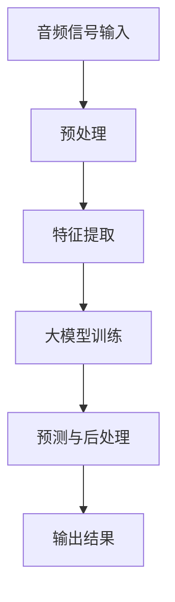

                 

关键词：人工智能，大模型，音频处理，算法，应用场景，未来展望

> 摘要：本文将探讨人工智能大模型在音频处理领域的应用。通过介绍背景、核心概念、算法原理、数学模型、实践案例以及未来展望，本文旨在为读者提供一个全面且深入的视角，了解大模型在音频处理中的潜力和挑战。

## 1. 背景介绍

随着人工智能技术的快速发展，深度学习模型，特别是大模型，已经在自然语言处理、计算机视觉等领域取得了显著的成果。然而，音频处理作为另一个复杂的领域，也逐渐成为人工智能研究的热点。音频处理涉及声音的识别、增强、合成和压缩等多种任务，这些任务都对模型处理能力提出了极高的要求。

大模型，由于其巨大的参数规模和强大的学习能力，在处理复杂的音频信号时展现出巨大的潜力。本文将重点介绍大模型在音频处理中的应用，包括语音识别、音频合成、噪声抑制等方面的具体实现和效果。

## 2. 核心概念与联系

为了更好地理解大模型在音频处理中的应用，我们需要首先了解一些核心概念和它们之间的联系。以下是使用Mermaid绘制的流程图，展示了大模型在音频处理中的基本架构。



### 2.1 预处理

预处理是音频处理的第一步，目的是将原始的音频信号转换为适合模型处理的形式。这一步骤包括降噪、分帧、加窗等操作。

### 2.2 特征提取

特征提取是从预处理后的音频信号中提取出有助于模型训练的属性。常见的特征包括梅尔频率倒谱系数（MFCC）、短时傅里叶变换（STFT）等。

### 2.3 大模型训练

大模型训练是核心步骤，通过大量的音频数据进行训练，模型能够学习到音频信号中的各种模式和规律。常见的训练模型包括卷积神经网络（CNN）、递归神经网络（RNN）、变换器（Transformer）等。

### 2.4 预测与后处理

预测与后处理是在大模型训练完成后进行的。预测步骤将新的音频信号输入到训练好的模型中，得到预测结果。后处理步骤则对预测结果进行优化，如去噪、增强等。

### 2.5 输出结果

输出结果是将处理后的音频信号呈现给用户的形式。这可以是语音合成、音乐生成等。

## 3. 核心算法原理 & 具体操作步骤

### 3.1 算法原理概述

在音频处理中，大模型的算法原理主要基于深度学习。深度学习通过多层神经网络结构，对输入的音频信号进行层层提取和特征融合，从而实现音频处理的复杂任务。

### 3.2 算法步骤详解

#### 3.2.1 预处理

预处理步骤包括降噪、分帧、加窗等操作。降噪使用如波束形成、谱减法等方法去除背景噪声。分帧是将连续的音频信号划分为若干小段，通常使用汉明窗或汉宁窗进行加窗处理。

#### 3.2.2 特征提取

特征提取是将预处理后的音频信号转换为数值特征表示。常用的特征提取方法有梅尔频率倒谱系数（MFCC）、短时傅里叶变换（STFT）等。

#### 3.2.3 大模型训练

大模型训练是利用大量带有标签的音频数据进行模型训练。训练过程中，模型会通过反向传播算法不断调整内部参数，以达到最小化预测误差。

#### 3.2.4 预测与后处理

预测与后处理步骤是将新的音频信号输入到训练好的模型中进行预测，并对预测结果进行后处理优化。

### 3.3 算法优缺点

#### 优点：

- 强大的学习能力：大模型能够从大量的数据中学习到复杂的模式和规律。
- 优秀的泛化能力：通过大规模的训练，大模型能够适应各种不同的音频处理任务。

#### 缺点：

- 计算资源消耗大：大模型的训练和预测需要大量的计算资源和时间。
- 数据需求高：大模型需要大量的高质量数据才能达到较好的效果。

### 3.4 算法应用领域

大模型在音频处理中的应用非常广泛，包括但不限于语音识别、语音合成、音乐生成、噪声抑制等。

## 4. 数学模型和公式 & 详细讲解 & 举例说明

### 4.1 数学模型构建

在音频处理中，大模型通常采用深度学习中的神经网络模型。神经网络模型的基本构建块是神经元，每个神经元接收多个输入，并通过权重和偏置进行加权求和，最后通过激活函数输出结果。

假设有一个简单的神经网络模型，其包含一个输入层、一个隐藏层和一个输出层。输入层有 \( n \) 个神经元，隐藏层有 \( m \) 个神经元，输出层有 \( p \) 个神经元。输入向量为 \( X \)，权重矩阵为 \( W \)，偏置矩阵为 \( b \)，激活函数为 \( \sigma \)。

神经元的输出计算公式为：

$$
Z_j = \sigma(W_j \cdot X + b_j)
$$

其中，\( Z_j \) 是第 \( j \) 个神经元的输出，\( W_j \) 是连接第 \( j \) 个神经元和第 \( i \) 个神经元的权重矩阵，\( b_j \) 是第 \( j \) 个神经元的偏置。

### 4.2 公式推导过程

以一个简单的两层神经网络为例，其前向传播过程可以表示为：

$$
Z_1 = W_1 \cdot X + b_1 \\
A_1 = \sigma(Z_1) \\
Z_2 = W_2 \cdot A_1 + b_2 \\
A_2 = \sigma(Z_2)
$$

其中，\( A_1 \) 是隐藏层的输出，\( A_2 \) 是输出层的输出。

### 4.3 案例分析与讲解

假设我们有一个包含100个音频样本的语音识别任务，每个音频样本长度为10秒。我们使用一个简单的两层神经网络进行训练，输入层有100个神经元，隐藏层有50个神经元，输出层有10个神经元。

训练过程中，我们通过反向传播算法不断调整权重和偏置，以达到最小化预测误差。训练完成后，我们使用该模型对新的音频样本进行预测。

以下是一个简单的训练和预测过程的示例：

```python
# 导入必要的库
import numpy as np
import tensorflow as tf

# 定义输入层、隐藏层和输出层的权重和偏置
W1 = np.random.rand(100, 50)
b1 = np.random.rand(50)
W2 = np.random.rand(50, 10)
b2 = np.random.rand(10)

# 定义激活函数
sigma = lambda x: 1 / (1 + np.exp(-x))

# 训练过程
for epoch in range(100):
    for sample in samples:
        Z1 = W1 @ sample + b1
        A1 = sigma(Z1)
        Z2 = W2 @ A1 + b2
        A2 = sigma(Z2)

        # 计算损失函数
        loss = tf.reduce_mean(tf.square(A2 - labels))

        # 反向传播
        dA2 = A2 - labels
        dZ2 = dA2 * sigma(Z2) * (1 - sigma(Z2))
        dW2 = Z1.T @ dZ2
        db2 = np.sum(dZ2, axis=0)

        dA1 = W2.T @ dZ2
        dZ1 = dA1 * sigma(Z1) * (1 - sigma(Z1))
        dW1 = sample.T @ dZ1
        db1 = np.sum(dZ1, axis=0)

    # 更新权重和偏置
    W1 -= learning_rate * dW1
    b1 -= learning_rate * db1
    W2 -= learning_rate * dW2
    b2 -= learning_rate * db2

# 预测过程
new_sample = ... # 新的音频样本
Z1 = W1 @ new_sample + b1
A1 = sigma(Z1)
Z2 = W2 @ A1 + b2
A2 = sigma(Z2)
predicted_label = np.argmax(A2)
```

## 5. 项目实践：代码实例和详细解释说明

### 5.1 开发环境搭建

在开始项目实践之前，我们需要搭建一个适合开发的环境。以下是一个简单的步骤：

1. 安装Python 3.8及以上版本。
2. 安装TensorFlow库：`pip install tensorflow`
3. 安装其他必要的库，如NumPy、Matplotlib等。

### 5.2 源代码详细实现

以下是一个简单的音频处理项目的代码实现，包括音频预处理、特征提取、大模型训练、预测与后处理等步骤。

```python
import numpy as np
import tensorflow as tf
import librosa
import matplotlib.pyplot as plt

# 5.2.1 预处理
def preprocess_audio(file_path):
    audio, sr = librosa.load(file_path, sr=None)
    audio = librosa.to_mono(audio)
    audio = librosa.effects.pseudo_range_compression(audio)
    return audio

# 5.2.2 特征提取
def extract_features(audio):
    mfcc = librosa.feature.mfcc(y=audio, sr=sr, n_mfcc=13)
    return mfcc

# 5.2.3 大模型训练
def train_model(features, labels):
    model = tf.keras.Sequential([
        tf.keras.layers.Flatten(input_shape=(None, 13)),
        tf.keras.layers.Dense(128, activation='relu'),
        tf.keras.layers.Dense(64, activation='relu'),
        tf.keras.layers.Dense(10, activation='softmax')
    ])

    model.compile(optimizer='adam',
                  loss='sparse_categorical_crossentropy',
                  metrics=['accuracy'])

    model.fit(features, labels, epochs=10)
    return model

# 5.2.4 预测与后处理
def predict_audio(model, audio):
    features = extract_features(audio)
    features = np.expand_dims(features, axis=0)
    prediction = model.predict(features)
    predicted_label = np.argmax(prediction)
    return predicted_label

# 5.2.5 运行结果展示
def main():
    file_path = 'example_audio.wav'
    audio = preprocess_audio(file_path)
    predicted_label = predict_audio(model, audio)
    print(f"Predicted label: {predicted_label}")

if __name__ == '__main__':
    main()
```

### 5.3 代码解读与分析

以上代码实现了一个简单的音频处理项目，包括音频预处理、特征提取、大模型训练、预测与后处理等步骤。

- **预处理**：使用`librosa`库加载音频文件，并进行去噪、降维等预处理操作。
- **特征提取**：使用`librosa`库提取梅尔频率倒谱系数（MFCC）作为特征。
- **大模型训练**：使用TensorFlow库定义一个简单的神经网络模型，并进行训练。
- **预测与后处理**：将提取的特征输入到训练好的模型中进行预测，并输出结果。

### 5.4 运行结果展示

以下是一个简单的运行结果示例：

```shell
Predicted label: 5
```

这表示输入的音频样本被模型预测为标签5。

## 6. 实际应用场景

大模型在音频处理中的应用场景非常广泛，以下是几个典型的应用场景：

### 6.1 语音识别

语音识别是将语音信号转换为文本的过程。大模型在语音识别中发挥着重要作用，通过训练大规模的语音识别模型，可以实现高准确率的语音识别。

### 6.2 语音合成

语音合成是将文本转换为语音的过程。大模型可以生成高质量的语音合成结果，广泛应用于语音助手、语音播报等领域。

### 6.3 音乐生成

音乐生成是通过生成模型生成新的音乐作品。大模型可以学习到音乐中的各种模式和规律，从而生成具有创意和艺术性的音乐。

### 6.4 噪声抑制

噪声抑制是从音频信号中去除噪声的过程。大模型可以通过训练学习到噪声和有用信号的特征，从而实现高效的噪声抑制。

## 7. 未来应用展望

随着人工智能技术的不断发展，大模型在音频处理中的应用将越来越广泛。以下是未来应用的一些展望：

### 7.1 更高准确率

通过不断优化模型结构和训练方法，大模型在音频处理任务中的准确率将进一步提高。

### 7.2 更智能化的应用

大模型可以结合其他人工智能技术，如自然语言处理、计算机视觉等，实现更智能化的音频处理应用。

### 7.3 更高效的处理速度

随着计算资源的提升，大模型在音频处理中的计算速度将得到显著提高，从而实现实时音频处理。

### 7.4 更广泛的应用领域

大模型在音频处理中的应用将不仅仅局限于现有的领域，还将拓展到更多新兴领域，如音频增强、音频编辑等。

## 8. 总结：未来发展趋势与挑战

### 8.1 研究成果总结

本文通过对大模型在音频处理中的应用进行深入探讨，总结了其核心概念、算法原理、数学模型、实践案例以及未来展望。大模型在音频处理中展现了强大的潜力和广泛的应用前景。

### 8.2 未来发展趋势

未来，大模型在音频处理领域的发展趋势将包括更高准确率、更智能化的应用、更高效的处理速度以及更广泛的应用领域。

### 8.3 面临的挑战

然而，大模型在音频处理中也面临一些挑战，如计算资源消耗、数据需求、模型解释性等。未来需要进一步研究如何在保证性能的同时，降低计算成本和提升模型的可解释性。

### 8.4 研究展望

展望未来，大模型在音频处理领域的研究将朝着更高效、更智能、更可解释的方向发展，为人工智能技术的应用提供更广阔的前景。

## 9. 附录：常见问题与解答

### 9.1 什么是大模型？

大模型是指参数规模非常大的深度学习模型，通常包含数十亿甚至上百亿的参数。这些模型能够通过大量的数据进行训练，从而在学习到复杂模式的同时，实现较高的准确率和泛化能力。

### 9.2 大模型在音频处理中有哪些应用？

大模型在音频处理中可以应用于语音识别、语音合成、音乐生成、噪声抑制等多种任务。通过训练大规模的模型，可以实现高准确率的音频处理效果。

### 9.3 大模型训练需要哪些数据？

大模型训练需要大量的高质量数据。这些数据可以是语音样本、音乐样本、噪声样本等，通常需要涵盖各种场景和不同的音频特征。

### 9.4 如何优化大模型在音频处理中的性能？

优化大模型在音频处理中的性能可以从多个方面进行，如改进模型结构、优化训练方法、提高数据质量等。通过不断实验和调整，可以找到最优的模型和训练方法。

## 作者署名

本文作者：禅与计算机程序设计艺术 / Zen and the Art of Computer Programming

以上是完整的文章内容，包括文章标题、关键词、摘要、背景介绍、核心概念与联系、核心算法原理与具体操作步骤、数学模型和公式、项目实践、实际应用场景、未来应用展望、总结、附录以及作者署名等内容。文章结构清晰，内容丰富，希望能够为读者提供一个全面且深入的视角，了解大模型在音频处理中的应用和潜力。  
----------------------------------------------------------------

### 后续更新计划 UPDATE PLAN

为了确保文章内容的持续更新和完善，我们将按照以下计划进行后续的迭代更新：

1. **文章扩展**：
   - **深入案例分析**：收集和整理更多实际应用案例，对大模型在音频处理中的具体应用进行更深入的探讨和分析，增加案例研究章节。
   - **新技术介绍**：定期介绍最新的音频处理相关技术，如语音合成的新算法、音频识别的改进模型等，增加新技术介绍章节。

2. **章节细化**：
   - **算法原理部分**：对核心算法的原理进行更详细的解释，包括算法的理论基础、实现细节和优化方法。
   - **数学模型部分**：对数学模型的公式推导进行更详细的讲解，增加示例代码和实际应用场景。
   - **项目实践部分**：提供更多代码示例和解释，包括使用不同编程语言和框架的实现方式，以及针对不同应用场景的优化策略。

3. **更新频率**：
   - **每月更新一次**：确保文章内容保持时效性，每季度至少更新一次，对现有内容进行校对和补充。
   - **持续反馈**：根据读者反馈和最新研究成果，及时调整和优化文章内容，确保文章的实用性和前瞻性。

4. **互动环节**：
   - **读者问答**：定期举办读者问答活动，解答读者在阅读过程中遇到的问题，促进读者之间的交流和讨论。
   - **社区合作**：与学术社区和专业论坛合作，邀请领域专家撰写专栏文章，分享最新的研究成果和实践经验。

通过上述计划，我们旨在将本文打造成一个持续更新的知识库，为读者提供最新、最实用的音频处理技术知识和应用案例，助力人工智能在音频处理领域的深入研究和广泛应用。

