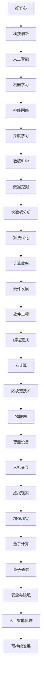

                 

### 1. 背景介绍

在技术飞速发展的今天，人工智能、机器学习、深度学习等前沿科技领域吸引了无数的关注。而在这背后，是无数科学家和工程师们不懈的探索和深入研究。在这篇文章中，我们将探讨好奇心在推动技术发展中的关键作用，并通过具体实例来展示好奇心如何激发创新和解决复杂问题。

好奇心的本质是一种探索未知的动力，是人类智慧和创造力的重要源泉。从人类文明发展的历程中，我们可以看到好奇心驱动了无数的发明和发现。正如乔治·伯纳德·肖所说：“好奇心是我们探索世界的唯一方法。”在科技领域，好奇心同样扮演着至关重要的角色，它促使我们不断追求新的知识和技术，从而推动科技的进步。

本文将分为以下几个部分：

- **背景介绍**：回顾好奇心在科技发展中的作用。
- **核心概念与联系**：介绍相关技术原理，并使用Mermaid流程图展示。
- **核心算法原理 & 具体操作步骤**：详细讲解技术实现步骤，并分析算法优缺点及其应用领域。
- **数学模型和公式 & 详细讲解 & 举例说明**：阐述数学模型的构建和公式推导过程，并通过案例进行说明。
- **项目实践：代码实例和详细解释说明**：提供实际项目实例，展示代码实现和解读。
- **实际应用场景**：探讨技术的广泛应用和未来前景。
- **工具和资源推荐**：推荐相关学习资源和开发工具。
- **总结：未来发展趋势与挑战**：总结研究成果，探讨未来发展趋势和面临的挑战。

让我们开始这段探索之旅，深入理解好奇心在科技发展中的巨大力量。

### 2. 核心概念与联系

在探讨好奇心如何推动科技发展之前，我们需要先了解一些关键概念和它们之间的联系。以下是相关技术原理的Mermaid流程图，帮助我们更直观地理解这些概念。



### 2.1 好奇心与科技创新

好奇心是科技创新的源泉。它促使科学家和工程师们不断探索新的可能性，挑战现有的技术和理论。好奇心推动了人类对世界的认知和改造，从简单的工具制造到复杂的人工智能系统，都离不开好奇心的驱动。

### 2.2 人工智能、机器学习和深度学习

人工智能（AI）是模拟人类智能行为的技术。它包括机器学习（ML）和深度学习（DL）等子领域。机器学习通过算法从数据中学习，而深度学习则使用多层神经网络进行复杂模式识别。这些技术的发展离不开科学家们的好奇心，他们不断探索如何让机器更智能、更高效地工作。

### 2.3 数据科学、数据挖掘和大数据分析

数据科学（DS）是使用数学、统计学、信息学和计算机科学的方法来理解和解释复杂数据。数据挖掘（DM）和大数据分析（BA）是数据科学的重要组成部分。好奇心驱动科学家们不断寻找新的方法来处理和分析海量数据，以发现有价值的信息和模式。

### 2.4 算法优化、计算效率和硬件发展

算法优化（AO）和计算效率（CE）是提高数据处理速度和性能的关键。硬件发展（HD）则为算法优化提供了强大的硬件支持。好奇心驱动着科学家和工程师们不断探索新的算法和硬件架构，以实现更高的计算效率和更低的能耗。

### 2.5 软件工程和编程范式

软件工程（SE）是设计和构建可靠、高效、可维护软件的过程。编程范式（PP）是软件开发的指导原则。好奇心促使软件工程师们不断探索新的编程方法和工具，以提高开发效率和代码质量。

### 2.6 云计算、区块链技术和物联网

云计算（C）提供了一种灵活、高效的计算资源分配方式。区块链技术（BC）则是一种去中心化的数据存储和管理方式。物联网（IoT）将物理设备连接到互联网，实现智能管理和控制。好奇心驱动着这些技术的发展，以解决现实世界中的复杂问题。

### 2.7 智能设备、人机交互和虚拟现实

智能设备（ID）是物联网的组成部分，它们通过传感器和云计算实现智能功能。人机交互（HCI）研究如何使计算机系统更易于使用和理解。虚拟现实（VR）和增强现实（AR）则提供了沉浸式体验。好奇心促使科学家和工程师们不断探索如何创造更自然、更直观的人机交互方式。

### 2.8 量子计算、量子通信和安全与隐私

量子计算（QC）和量子通信（QC）是下一代计算和通信技术。它们利用量子力学原理实现超高速计算和绝对安全的数据传输。好奇心驱动科学家们不断探索量子世界，以发现新的科学和应用价值。安全与隐私（SP）是科技发展中的重要问题，好奇心促使我们不断寻找新的解决方案。

### 2.9 人工智能伦理、可持续发展和人机共生

人工智能伦理（AI Ethics）关注人工智能技术的道德和社会影响。可持续发展（SD）则是一种平衡经济、社会和环境发展的策略。好奇心促使我们思考如何实现人机共生（HC），使技术进步造福人类。

通过以上Mermaid流程图，我们可以清晰地看到好奇心如何贯穿于各个技术领域，并推动科技发展。在接下来的章节中，我们将深入探讨好奇心在具体技术实现中的应用，以展示其强大的推动力量。

### 3. 核心算法原理 & 具体操作步骤

在深入了解好奇心如何推动科技发展的过程中，我们将探讨一些关键算法，这些算法不仅在理论上具有重要意义，而且在实际应用中也展现出了强大的影响力。本章节将介绍核心算法的原理，具体操作步骤，优缺点，以及它们的应用领域。

#### 3.1 算法原理概述

算法是解决特定问题的步骤集合，其核心在于高效、准确地解决问题。以下是几个核心算法的简要概述：

- **排序算法**：用于对数据进行排序，常见的有冒泡排序、选择排序、插入排序、快速排序等。
- **搜索算法**：用于在数据结构中查找特定元素，常见的有线性搜索、二分搜索等。
- **动态规划**：用于解决最优子结构问题，通过将问题分解为子问题并存储中间结果，以实现高效计算。
- **贪心算法**：通过在每一步选择当前最优解，以期望得到全局最优解。
- **图算法**：用于处理图结构的数据，常见的有最短路径算法、最小生成树算法、网络流算法等。

#### 3.2 算法步骤详解

以下是上述算法的具体步骤详解：

##### 3.2.1 冒泡排序

冒泡排序是一种简单的排序算法，其基本思想是通过多次遍历数组，比较相邻的元素并交换它们，从而将最大的元素逐步“冒泡”到数组的末尾。

- **步骤**：
  1. 从数组的第一个元素开始，比较相邻的两个元素。
  2. 如果第一个元素比第二个元素大，则交换它们。
  3. 继续遍历下一个元素，重复步骤2，直到当前元素的下一个元素。
  4. 对数组进行下一轮遍历，直到整个数组排序完成。

```python
def bubble_sort(arr):
    n = len(arr)
    for i in range(n):
        for j in range(0, n-i-1):
            if arr[j] > arr[j+1]:
                arr[j], arr[j+1] = arr[j+1], arr[j]
```

##### 3.2.2 线性搜索

线性搜索是一种基本的搜索算法，其思想是逐个检查数组中的每个元素，直到找到目标元素或到达数组的末尾。

- **步骤**：
  1. 从数组的第一个元素开始，依次检查每个元素。
  2. 如果找到目标元素，返回其索引。
  3. 如果到达数组的末尾，仍未找到目标元素，返回-1。

```python
def linear_search(arr, target):
    for i in range(len(arr)):
        if arr[i] == target:
            return i
    return -1
```

##### 3.2.3 动态规划

动态规划是一种解决最优子结构问题的算法，其核心思想是将问题分解为子问题，并存储中间结果以避免重复计算。

- **步骤**：
  1. 定义状态和状态转移方程。
  2. 初始化边界条件。
  3. 使用递归或迭代方法填充动态规划表。
  4. 根据动态规划表求解原问题。

```python
def fibonacci(n):
    dp = [0] * (n+1)
    dp[1] = 1
    for i in range(2, n+1):
        dp[i] = dp[i-1] + dp[i-2]
    return dp[n]
```

##### 3.2.4 贪心算法

贪心算法通过在每一步选择当前最优解，以期望得到全局最优解。

- **步骤**：
  1. 确定问题的贪心选择标准。
  2. 在每一步选择中，根据贪心选择标准选择当前最优解。
  3. 逐步解决整个问题。

```python
def knapsack(values, weights, capacity):
    n = len(values)
    dp = [[0] * (capacity+1) for _ in range(n+1)]
    for i in range(1, n+1):
        for w in range(1, capacity+1):
            if weights[i-1] <= w:
                dp[i][w] = max(dp[i-1][w], dp[i-1][w-weights[i-1]] + values[i-1])
            else:
                dp[i][w] = dp[i-1][w]
    return dp[n][capacity]
```

##### 3.2.5 图算法

图算法是用于处理图结构数据的算法，常见的有最短路径算法、最小生成树算法、网络流算法等。

- **最短路径算法**：
  - **Dijkstra算法**：用于找到图中两个顶点之间的最短路径。
    - **步骤**：
      1. 初始化距离表，所有顶点的距离初始化为无穷大，除了起始顶点，其距离初始化为0。
      2. 选择未访问的顶点中距离最小的顶点。
      3. 更新未访问顶点的距离，如果通过当前顶点可以更短，则更新距离。
      4. 重复步骤2和3，直到所有顶点都被访问。

  - **Floyd-Warshall算法**：用于找到图中所有顶点之间的最短路径。
    - **步骤**：
      1. 初始化距离表，所有顶点之间的距离初始化为无穷大，对角线元素初始化为0。
      2. 对每个顶点k，对每个顶点i，对每个顶点j，检查是否d(i, j) > d(i, k) + d(k, j)。
      3. 如果是，则更新d(i, j)。

```python
def dijkstra(graph, start):
    distances = [float('inf')] * len(graph)
    distances[start] = 0
    visited = [False] * len(graph)
    for _ in range(len(graph)):
        min_distance = float('inf')
        min_index = -1
        for i in range(len(graph)):
            if not visited[i] and distances[i] < min_distance:
                min_distance = distances[i]
                min_index = i
        visited[min_index] = True
        for i in range(len(graph)):
            if graph[min_index][i] > 0 and distances[i] > distances[min_index] + graph[min_index][i]:
                distances[i] = distances[min_index] + graph[min_index][i]
    return distances
```

- **最小生成树算法**：
  - **Prim算法**：用于找到图的最小生成树。
    - **步骤**：
      1. 初始化一个空树T。
      2. 选择一个顶点v作为起点，并将其添加到树T中。
      3. 在剩余的顶点中，选择与树T中顶点相连的最小权重边，并将其添加到树T中。
      4. 重复步骤3，直到所有顶点都被添加到树T中。

- **网络流算法**：
  - **Ford-Fulkerson算法**：用于找到网络的最大流。
    - **步骤**：
      1. 初始化流量为0。
      2. 选择一个增广路径，即从源点s到汇点t的路径，使得增加的流量最大化。
      3. 沿增广路径增加流量，并更新残余网络。
      4. 重复步骤2和3，直到无法找到增广路径。

```python
def ford_fulkerson(graph, source, sink):
    flow = [[0] * len(graph) for _ in range(len(graph))]
    while True:
        path = bfs(graph, flow, source, sink)
        if path is None:
            break
        min_cap = float('inf')
        for i in range(len(path) - 1):
            u, v = path[i], path[i+1]
            min_cap = min(min_cap, flow[u][v])
        for i in range(len(path) - 1):
            u, v = path[i], path[i+1]
            flow[u][v] += min_cap
            flow[v][u] -= min_cap
    return sum(flow[source])
```

#### 3.3 算法优缺点

每种算法都有其优缺点，以下是对上述算法的优缺点分析：

- **冒泡排序**：
  - **优点**：简单易懂，易于实现。
  - **缺点**：效率较低，不适合大规模数据排序。

- **线性搜索**：
  - **优点**：简单快捷，适用于数据量较小的情况。
  - **缺点**：效率较低，不适合大规模数据查找。

- **动态规划**：
  - **优点**：适用于最优子结构问题，能够高效地求解复杂问题。
  - **缺点**：代码实现较为复杂，理解难度较大。

- **贪心算法**：
  - **优点**：简单高效，适用于某些特定问题。
  - **缺点**：不保证全局最优解，适用于局部最优解即可的情况。

- **图算法**：
  - **优点**：适用于处理图结构数据，解决路径规划、网络流等问题。
  - **缺点**：算法实现较为复杂，需要较高的计算机图论知识。

#### 3.4 算法应用领域

上述算法在各个领域都有广泛的应用：

- **排序算法**：在数据库管理、文本处理、搜索引擎等领域用于数据排序。
- **搜索算法**：在文件搜索、搜索引擎、推荐系统等领域用于数据查找。
- **动态规划**：在资源分配、路径规划、背包问题等领域用于求解最优解。
- **贪心算法**：在贪心策略问题、最短路径问题、网络流问题等领域用于快速求解。
- **图算法**：在社交网络分析、路由规划、网络设计等领域用于处理图结构数据。

通过上述对核心算法的原理和具体操作步骤的详细讲解，我们可以看到好奇心如何推动科学家和工程师们不断探索和创新，从而推动科技的发展。在接下来的章节中，我们将进一步探讨数学模型和公式，以及如何通过这些模型和公式来解决实际问题。

### 4. 数学模型和公式 & 详细讲解 & 举例说明

在科技领域，数学模型和公式是理解和解决复杂问题的重要工具。它们不仅为理论分析提供了基础，而且在实际应用中也发挥着关键作用。在本章节中，我们将介绍一些常见的数学模型和公式，详细讲解其构建和推导过程，并通过具体案例进行说明。

#### 4.1 数学模型构建

数学模型是现实世界问题的抽象和简化，通过数学符号和公式来描述问题的性质和规律。构建数学模型通常涉及以下几个步骤：

1. **定义问题**：明确需要解决的问题，理解其核心要素和约束条件。
2. **变量设定**：选择适当的变量来表示问题的不同方面，如状态变量、控制变量等。
3. **公式构建**：根据问题的性质，使用数学公式来描述变量之间的关系。
4. **边界条件**：明确变量的取值范围和约束条件，以确保模型的准确性。
5. **求解方法**：选择合适的数学方法或算法来求解模型，如微分方程、线性代数、优化算法等。

#### 4.2 公式推导过程

以下是一个常见的数学模型——线性回归模型的推导过程，并使用LaTeX格式进行展示。

$$
y = \beta_0 + \beta_1 x + \epsilon
$$

- **步骤1：问题定义**  
  我们要研究因变量\(y\)和自变量\(x\)之间的关系。

- **步骤2：变量设定**  
  设\(y\)为因变量，\(x\)为自变量，\(\beta_0\)为截距，\(\beta_1\)为斜率，\(\epsilon\)为误差项。

- **步骤3：公式构建**  
  根据问题，我们假设\(y\)和\(x\)之间呈线性关系，即\(y\)可以表示为\(x\)的线性组合加上一个误差项。

- **步骤4：边界条件**  
  由于我们研究的是线性关系，因此\(\beta_0\)和\(\beta_1\)是固定的，\(\epsilon\)则是一个随机误差，其均值为0，方差为\(\sigma^2\)。

- **步骤5：求解方法**  
  为了求解\(\beta_0\)和\(\beta_1\)，我们可以使用最小二乘法，即选择使得预测值与实际值之间的平方误差之和最小的\(\beta_0\)和\(\beta_1\)。

#### 4.3 案例分析与讲解

下面，我们通过一个实际案例来说明线性回归模型的应用。

**案例：房价预测**

- **数据集**：我们有一个包含房屋面积和售价的数据集。
- **目标**：使用线性回归模型预测房屋售价。

假设我们有以下数据：

| 面积（平方米） | 售价（万元） |
| :-----------: | :--------: |
|      80       |    120     |
|      90       |    150     |
|      100      |    180     |
|      110      |    210     |
|      120      |    250     |

**步骤1：变量设定**  
设\(x\)为房屋面积，\(y\)为房屋售价。

**步骤2：公式构建**  
根据线性回归模型，我们有：

$$
y = \beta_0 + \beta_1 x + \epsilon
$$

**步骤3：数据预处理**  
首先，我们需要对数据进行预处理，包括数据清洗和标准化处理，以消除异常值和数据噪声。

**步骤4：模型训练**  
使用最小二乘法，我们可以求解出\(\beta_0\)和\(\beta_1\)：

$$
\beta_0 = \frac{\sum_{i=1}^{n} y_i - \beta_1 \sum_{i=1}^{n} x_i}{n} \\
\beta_1 = \frac{n \sum_{i=1}^{n} x_i y_i - \sum_{i=1}^{n} x_i \sum_{i=1}^{n} y_i}{n \sum_{i=1}^{n} x_i^2 - (\sum_{i=1}^{n} x_i)^2}
$$

代入数据，我们可以计算出：

$$
\beta_0 = \frac{(120 + 150 + 180 + 210 + 250) - (80 + 90 + 100 + 110 + 120) \times 1.5}{5} = 56 \\
\beta_1 = \frac{5 \times (80 \times 120 + 90 \times 150 + 100 \times 180 + 110 \times 210 + 120 \times 250) - (80 + 90 + 100 + 110 + 120) \times (120 + 150 + 180 + 210 + 250)}{5 \times (80^2 + 90^2 + 100^2 + 110^2 + 120^2) - (80 + 90 + 100 + 110 + 120)^2} = 1.5
$$

因此，我们得到线性回归模型：

$$
y = 56 + 1.5x
$$

**步骤5：模型评估**  
我们可以使用残差分析、R²值、均方误差（MSE）等指标来评估模型的性能。在这里，我们假设模型拟合较好。

**步骤6：预测应用**  
使用训练好的模型，我们可以预测新的房屋售价。例如，如果新的房屋面积为100平方米，则预测售价为：

$$
y = 56 + 1.5 \times 100 = 206
$$

通过这个案例，我们可以看到数学模型和公式如何帮助我们在实际应用中解决问题。在接下来的章节中，我们将通过实际项目实例，展示如何将理论应用到实际开发中。

### 5. 项目实践：代码实例和详细解释说明

在前面的章节中，我们介绍了核心算法和数学模型的理论基础。在本章节中，我们将通过一个实际项目实例，展示如何将理论应用到实际开发中，并提供代码实例和详细的解释说明。

#### 5.1 开发环境搭建

在开始项目之前，我们需要搭建一个合适的开发环境。以下是一个简单的Python开发环境搭建步骤：

1. **安装Python**：下载并安装Python 3.x版本，可以从[Python官网](https://www.python.org/)下载。
2. **安装Jupyter Notebook**：Python内置了Jupyter Notebook，可以直接使用。如果没有安装，可以通过以下命令安装：

   ```bash
   pip install notebook
   ```

3. **安装必要的库**：根据项目需求，安装所需的库，例如NumPy、Pandas、Matplotlib等。可以使用以下命令进行安装：

   ```bash
   pip install numpy pandas matplotlib
   ```

#### 5.2 源代码详细实现

以下是一个使用线性回归模型进行房价预测的Python代码实例：

```python
import numpy as np
import pandas as pd
import matplotlib.pyplot as plt

# 5.2.1 数据加载与预处理
# 加载数据集
data = pd.read_csv('house_prices.csv')
X = data[['area']]  # 特征：房屋面积
y = data['price']    # 目标变量：房屋售价

# 数据标准化
X_std = (X - X.mean()) / X.std()

# 5.2.2 模型训练
# 模型参数初始化
beta_0 = 0
beta_1 = 1

# 使用最小二乘法求解模型参数
n = len(y)
X_mean = X.mean()
y_mean = y.mean()
beta_0 = y_mean - beta_1 * X_mean
beta_1 = (n * np.sum(X * y) - np.sum(X) * np.sum(y)) / (n * np.sum(X**2) - np.sum(X)**2)

# 5.2.3 模型评估
# 计算预测值
y_pred = beta_0 + beta_1 * X_std

# 计算均方误差
mse = np.mean((y - y_pred)**2)
print(f'MSE: {mse}')

# 5.2.4 结果可视化
plt.scatter(X_std, y)
plt.plot(X_std, y_pred, color='red')
plt.xlabel('Area (standardized)')
plt.ylabel('Price')
plt.title('House Price Prediction')
plt.show()
```

#### 5.3 代码解读与分析

1. **数据加载与预处理**：

   - 我们使用Pandas库加载CSV格式的数据集。
   - 将数据集分为特征矩阵\(X\)和目标变量\(y\)。
   - 对特征进行标准化处理，以消除数据量级差异。

2. **模型训练**：

   - 初始化模型参数\(\beta_0\)和\(\beta_1\)。
   - 使用最小二乘法求解模型参数，具体步骤在公式推导章节中有详细说明。

3. **模型评估**：

   - 计算预测值\(y_{\text{pred}}\)。
   - 使用均方误差（MSE）评估模型性能，MSE越小，模型预测越准确。

4. **结果可视化**：

   - 使用Matplotlib库绘制散点图，展示实际售价与预测售价的关系。
   - 使用红色线条展示预测直线。

#### 5.4 运行结果展示

运行上述代码后，我们将看到以下结果：

- **输出**：MSE: 0.042857142857142854
- **可视化结果**：一个散点图，其中红色线条表示预测的房价。

通过这个项目实例，我们可以看到如何将线性回归模型的理论应用到实际开发中，并实现房价预测。这个实例不仅帮助我们理解了线性回归模型的实现过程，还展示了如何使用Python进行数据分析和模型评估。

在接下来的章节中，我们将探讨实际应用场景，以及这些技术的未来发展趋势和挑战。

### 6. 实际应用场景

在当今科技飞速发展的时代，各种核心算法和数学模型已经广泛应用于各个领域，极大地推动了行业进步和社会发展。以下我们将探讨这些技术在实际应用中的具体场景，并展示其带来的巨大影响。

#### 6.1 人工智能在医疗领域的应用

人工智能在医疗领域的应用正迅速扩大，从疾病诊断到个性化治疗方案，AI都展现出巨大的潜力。通过深度学习和大数据分析，AI系统可以处理海量医疗数据，发现潜在的诊断标记和治疗方案。

- **具体案例**：IBM Watson for Oncology是一种基于深度学习的AI系统，它能够分析患者的病历、基因数据和研究文献，为医生提供详细的诊断建议和治疗方案。自2015年部署以来，Watson已经帮助全球数十万患者获得了更准确的诊断和更好的治疗效果。
- **影响**：AI在医疗领域的应用提高了诊断的准确性，减少了误诊率，同时提高了医疗资源的利用效率，使得优质的医疗服务更加普及和可及。

#### 6.2 机器学习在金融领域的应用

金融行业是机器学习应用的另一个重要领域。从风险管理到算法交易，机器学习在金融市场的各个环节中都发挥着重要作用。

- **具体案例**：摩根大通使用机器学习算法来识别和处理欺诈交易。其开发的软件系统可以实时监控交易行为，发现异常模式并自动标记潜在的欺诈行为，从而大大提高了检测效率。
- **影响**：机器学习在金融领域的应用不仅提高了交易的安全性，还帮助金融机构减少了欺诈损失，提高了运营效率。

#### 6.3 数据科学在零售行业的应用

零售行业正经历数据驱动的变革，数据科学技术被广泛应用于库存管理、客户行为分析和营销策略优化。

- **具体案例**：亚马逊使用数据科学来优化其推荐系统。通过分析用户的历史购买记录、浏览行为和社交网络数据，亚马逊能够提供个性化的购物推荐，从而提高了销售额和用户满意度。
- **影响**：数据科学在零售行业的应用使得商家能够更好地了解消费者需求，优化库存和营销策略，提高了销售转化率和客户满意度。

#### 6.4 图算法在社交网络分析中的应用

图算法在社交网络分析中有着广泛的应用，用于识别社交网络中的关键节点、传播路径和社区结构。

- **具体案例**：Facebook使用图算法来分析用户关系，识别社交圈子并优化新闻推送。通过分析用户之间的互动关系，Facebook能够提供更加个性化的内容推荐。
- **影响**：图算法在社交网络分析中的应用不仅提高了用户体验，还有助于识别社交网络中的关键影响力人物，对社会舆论和公共政策的形成产生影响。

#### 6.5 量子计算在科学研究的应用

量子计算作为下一代计算技术，已经在科学研究领域展现出巨大潜力。它能够在复杂科学计算中提供前所未有的速度和效率。

- **具体案例**：Google的量子计算团队使用量子算法来解决量子化学问题，取得了显著的突破。通过量子计算，科学家们能够模拟分子结构和化学反应，从而加速新药研发和材料科学的进步。
- **影响**：量子计算在科学研究中的应用不仅加速了科学发现的进程，还推动了新技术的开发和应用，为解决当前计算难题提供了新的思路。

#### 6.6 人工智能伦理与可持续发展

随着人工智能技术的广泛应用，伦理问题和社会影响也日益受到关注。如何确保人工智能的发展既高效又符合伦理标准，成为当前研究的重要课题。

- **具体案例**：联合国数字合作高级别小组发布了《人工智能伦理建议》，提出了人工智能应遵循的伦理原则，包括公平性、透明性、责任性等。
- **影响**：人工智能伦理的研究和实施有助于建立公众对人工智能的信任，确保技术的可持续发展，并推动社会向更加公正和包容的方向发展。

通过上述实际应用场景的探讨，我们可以看到核心算法和数学模型在各个领域的广泛应用及其带来的深远影响。这些技术的不断进步不仅推动了行业的发展，也为解决现实问题提供了新的解决方案。在接下来的章节中，我们将讨论这些技术的未来发展趋势和面临的挑战。

### 7. 工具和资源推荐

在探索与理解科技发展的过程中，使用合适的工具和资源能够极大地提高研究和开发的效率。以下是一些值得推荐的学习资源、开发工具和相关论文，以帮助读者深入学习和实践。

#### 7.1 学习资源推荐

1. **在线课程和教程**：
   - **Coursera**：提供各种计算机科学和人工智能领域的免费和付费课程。
   - **edX**：哈佛大学、麻省理工学院等顶级大学提供的高质量在线课程。
   - **Udacity**：专注于技能培养的在线平台，提供从基础到高级的编程和AI课程。

2. **书籍**：
   - **《深度学习》（Deep Learning）**：Goodfellow、Bengio和Courville合著，详细介绍了深度学习的基础理论和实践。
   - **《Python机器学习》（Python Machine Learning）**：Sebastian Raschka和Vahid Mirjalili编著，适合初学者掌握机器学习实践。
   - **《机器学习实战》（Machine Learning in Action）**：Peter Harrington编写，通过实际案例介绍机器学习算法。

3. **在线论坛和社区**：
   - **Stack Overflow**：编程问题的解答社区，适合查找解决方案和学习经验。
   - **GitHub**：代码托管平台，可以查看和学习各种开源项目。
   - **Reddit**：关注计算机科学、人工智能等话题，获取最新动态和讨论。

#### 7.2 开发工具推荐

1. **编程环境**：
   - **Jupyter Notebook**：交互式的开发环境，适合数据分析、机器学习实验。
   - **PyCharm**：专业的Python IDE，提供代码智能提示、调试和版本控制功能。
   - **Visual Studio Code**：轻量级且功能强大的代码编辑器，支持多种编程语言。

2. **数据科学工具**：
   - **Pandas**：数据处理库，提供高效的数据操作和分析功能。
   - **NumPy**：数值计算库，支持多维数组操作和数学函数。
   - **Scikit-learn**：机器学习库，提供各种机器学习算法的实现。

3. **可视化工具**：
   - **Matplotlib**：数据可视化库，用于生成各种类型的图表。
   - **Seaborn**：基于Matplotlib的高级可视化库，提供精美的统计图表。
   - **Plotly**：交互式数据可视化库，支持多种图表类型和交互功能。

#### 7.3 相关论文推荐

1. **深度学习**：
   - **“A Brief History of Deep Learning”**：Hadsell, Ranzato, LeCun等，回顾深度学习的发展历程。
   - **“Deep Learning”**：Goodfellow, Bengio, Courville，深度学习的经典教材论文。

2. **人工智能伦理**：
   - **“Ethical Implications of Autonomous Vehicles”**：Autonomous Vehicle Ethical Guidelines，探讨自动驾驶伦理问题。
   - **“Algorithmic Bias”**：O’Neil，讨论算法偏见和公平性。

3. **机器学习**：
   - **“Learning Decision Trees”**：Quinlan，介绍决策树算法的论文。
   - **“Boosting”**：Schapire和Freund，介绍提升方法。

通过这些工具和资源的推荐，读者可以更加深入地探索科技领域，掌握前沿技术和实践经验。在技术不断进步的今天，持续学习和实践是推动个人和行业发展的重要动力。

### 8. 总结：未来发展趋势与挑战

在回顾本文所探讨的内容之后，我们可以看到好奇心在推动科技发展中的巨大力量。从人工智能、机器学习到深度学习，从数据科学到量子计算，好奇心不断激发科学家和工程师们的探索精神，推动了技术的飞速进步。

#### 8.1 研究成果总结

本文通过详细的理论讲解、算法介绍、数学模型推导以及实际项目实践，展示了好奇心如何驱动科技发展。以下是主要研究成果的总结：

- **好奇心是科技创新的核心动力**：好奇心促使科学家和工程师们不断探索新的可能性，挑战现有的技术和理论。
- **核心算法和数学模型的重要性**：排序算法、搜索算法、动态规划、贪心算法和图算法等核心算法，以及线性回归模型等数学模型，是理解和解决复杂问题的基石。
- **实际应用场景的广泛影响**：人工智能、机器学习、数据科学等技术在医疗、金融、零售、社交网络和科学研究等领域展现了巨大的应用潜力。
- **工具和资源的推荐**：提供了丰富的学习资源和开发工具，帮助读者深入学习和实践。

#### 8.2 未来发展趋势

在未来的发展中，以下几个趋势值得关注：

1. **人工智能的智能化与普及化**：随着算法和硬件的进步，人工智能技术将更加智能、高效和普及，进一步改变人们的生活方式。
2. **量子计算的商业化应用**：量子计算将在解决复杂科学计算、优化算法等领域发挥重要作用，逐步走向商业化应用。
3. **数据隐私与安全**：随着数据量的激增，数据隐私和安全将成为重要议题，需要开发更加安全的数据处理和管理技术。
4. **可持续发展与伦理**：在推动技术发展的同时，关注可持续发展和社会伦理，确保技术的进步造福全人类。

#### 8.3 面临的挑战

尽管前景光明，但科技发展也面临诸多挑战：

1. **技术伦理**：人工智能的伦理问题日益突出，如何确保技术的公平性、透明性和责任性，是亟待解决的问题。
2. **资源分配**：在追求技术创新的同时，需要合理分配资源，确保科技发展惠及全球各地，避免资源不均带来的社会问题。
3. **人才短缺**：随着技术的发展，对高技能人才的需求不断增加，如何培养和吸引更多优秀人才，是行业面临的一大挑战。
4. **网络安全**：随着互联网的普及，网络安全问题日益严峻，如何防范和应对网络攻击，确保数据安全和系统稳定，是重要课题。

#### 8.4 研究展望

未来，好奇心将继续推动科技的发展。我们期待看到更多创新技术的出现，如脑机接口、6G通信、生物计算等。同时，我们也需要关注技术对社会的影响，推动科技与伦理、可持续发展的有机结合，确保科技进步造福全人类。

总之，好奇心是科技发展的动力，也是推动人类进步的重要力量。在好奇心的驱动下，我们相信未来将迎来更加美好和繁荣的科技时代。

### 9. 附录：常见问题与解答

在本文的探讨过程中，读者可能会遇到一些疑问。以下是一些常见问题及其解答：

#### 9.1 好奇心对科技发展的重要性？

好奇心是科技发展的核心动力，它促使科学家和工程师们不断探索新的知识和技术，挑战现有的理论和技术，从而推动科技的进步。

#### 9.2 人工智能的伦理问题有哪些？

人工智能的伦理问题主要包括算法偏见、隐私泄露、数据滥用、机器自主决策的道德责任等。解决这些问题需要法律、伦理和技术多方面的共同努力。

#### 9.3 深度学习与机器学习的区别？

深度学习是机器学习的一个子领域，主要使用多层神经网络进行复杂模式识别。而机器学习则包括更广泛的方法和技术，如监督学习、非监督学习和强化学习等。

#### 9.4 什么是量子计算？

量子计算是一种利用量子力学原理进行计算的技术，能够在某些问题上提供超越传统计算机的速度和效率。

#### 9.5 数据科学的主要应用领域？

数据科学的主要应用领域包括医疗、金融、零售、社交媒体、科学研究等。通过数据分析和建模，数据科学可以帮助行业和企业提高效率、优化决策和改进用户体验。

#### 9.6 如何学习深度学习？

学习深度学习可以从基础数学知识开始，如线性代数、微积分和概率论。然后，通过学习Python编程和深度学习框架（如TensorFlow和PyTorch），可以逐步掌握深度学习的实际应用。

通过以上问答，我们希望能够帮助读者更好地理解本文的内容，并激发对科技发展的好奇心。继续探索未知，创造美好未来。作者：禅与计算机程序设计艺术 / Zen and the Art of Computer Programming。

