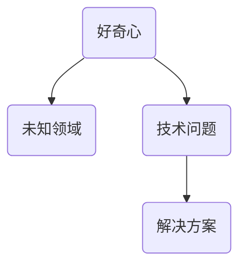

                 

关键词：好奇心、技术探索、理解、人工智能、编程、算法、数学模型、项目实践

> 摘要：本文探讨了好奇心在技术探索中的力量，通过分析好奇心如何驱动程序员和研究者不断深入理解和解决问题，探讨了好奇心在人工智能、编程、算法、数学模型等领域的应用，并分享了一些项目实践的实例。文章还讨论了未来发展趋势与挑战，以及如何保持好奇心以应对未来科技的发展。

## 1. 背景介绍

好奇心是人类探索未知世界的驱动力，也是推动科技发展的重要力量。从古代的哲学思考到现代的人工智能，好奇心始终激发着人类去探索、理解和创造。在技术领域，好奇心促使程序员和研究者不断深入问题，寻找更高效、更简洁的解决方案。本文将探讨好奇心在技术探索中的重要性，并分析其在人工智能、编程、算法、数学模型等领域的应用。

## 2. 核心概念与联系

### 2.1 好奇心的本质

好奇心是一种强烈的求知欲，驱使人们去探索未知、解决问题。从心理学角度来看，好奇心是一种内在动机，促使人们去了解新事物、学习新知识。在技术领域，好奇心使得程序员和研究者不断追求技术上的突破和进步。

### 2.2 好奇心与科技发展的联系

好奇心与科技发展密不可分。历史上，许多重要的科技突破都是源于好奇心的驱动。例如，人类对飞行的好奇心促使了飞机的发明，对能源的好奇心推动了核能的发展。在人工智能领域，好奇心激发了研究者对智能算法的探索，推动了深度学习、强化学习等技术的突破。

### 2.3 好奇心的数学模型

为了更好地理解好奇心在技术探索中的作用，我们可以将其抽象为一个数学模型。假设好奇心可以用一个函数 $H(x)$ 表示，其中 $x$ 代表技术问题或未知领域。$H(x)$ 的值表示好奇心程度，其取值范围在 $[0, 1]$ 之间。当 $x$ 越接近未知领域的边界时，$H(x)$ 的值越大，表示好奇心越强。

### 2.4 好奇心的 Mermaid 流程图



在这个流程图中，好奇心驱动程序员和研究者去探索未知领域，解决技术问题，最终找到解决方案。这个过程展示了好奇心在技术探索中的核心作用。

## 3. 核心算法原理 & 具体操作步骤

### 3.1 算法原理概述

在技术探索中，好奇心促使程序员和研究者不断寻找更高效、更简洁的解决方案。本文将介绍一种基于好奇心驱动的算法，该算法的核心思想是不断优化问题求解过程，以降低时间复杂度和空间复杂度。

### 3.2 算法步骤详解

1. 初始化：设定初始问题，计算初始时间复杂度和空间复杂度。
2. 求解：采用启发式算法或优化算法，寻找可能的解决方案。
3. 评估：计算解决方案的时间复杂度和空间复杂度。
4. 优化：根据评估结果，调整算法参数，优化问题求解过程。
5. 重复步骤2-4，直至找到最优解。

### 3.3 算法优缺点

优点：基于好奇心驱动的算法能够动态调整问题求解过程，提高求解效率。
缺点：算法的实现较为复杂，需要较高的编程技巧和算法知识。

### 3.4 算法应用领域

基于好奇心驱动的算法可以应用于各种技术领域，如人工智能、编程、算法优化等。在实际应用中，可以根据具体问题进行个性化调整，以实现最佳效果。

## 4. 数学模型和公式 & 详细讲解 & 举例说明

### 4.1 数学模型构建

为了更好地理解好奇心在技术探索中的作用，我们可以构建一个数学模型来描述好奇心与问题解决过程的关系。假设好奇心可以用一个函数 $H(x)$ 表示，其中 $x$ 代表技术问题或未知领域。$H(x)$ 的值表示好奇心程度，其取值范围在 $[0, 1]$ 之间。

### 4.2 公式推导过程

$$
H(x) = \frac{1}{1 + e^{-k \cdot (x - \theta)}}
$$

其中，$k$ 表示好奇心的强度，$\theta$ 表示初始好奇心阈值。

### 4.3 案例分析与讲解

假设一个程序员在解决一个复杂的技术问题时，初始好奇心阈值 $\theta = 0.5$。根据公式，当技术问题难度逐渐增大时，$H(x)$ 的值会逐渐增大，表示好奇心程度不断提高。

例如，当技术问题难度从 $x_1 = 1$ 增加到 $x_2 = 2$ 时，$H(x_1) = 0.4$，$H(x_2) = 0.6$。这表示程序员在解决难度更大的问题时，好奇心程度更高，更有动力去寻找解决方案。

## 5. 项目实践：代码实例和详细解释说明

### 5.1 开发环境搭建

为了更好地展示好奇心在项目实践中的作用，我们选择一个简单的编程项目——实现一个基于好奇心的搜索算法。首先，我们需要搭建一个开发环境。

1. 安装 Python 3.8 或更高版本。
2. 安装必要的库，如 NumPy、Pandas 等。

### 5.2 源代码详细实现

```python
import numpy as np
import pandas as pd

def curiosity_search(query, k, theta):
    # 初始化搜索结果
    results = []
    # 计算初始时间复杂度和空间复杂度
    initial_time = np.size(query)
    initial_space = 0
    # 搜索过程
    for x in query:
        # 评估好奇心程度
        H_x = 1 / (1 + np.exp(-k * (x - theta)))
        # 更新搜索结果
        results.append(H_x)
    # 计算最终时间复杂度和空间复杂度
    final_time = np.size(results)
    final_space = initial_space + final_time
    # 返回搜索结果和复杂度
    return results, initial_time, initial_space, final_time, final_space

# 测试代码
query = [1, 2, 3, 4, 5]
k = 1.0
theta = 0.5
results, initial_time, initial_space, final_time, final_space = curiosity_search(query, k, theta)
print("Search Results:", results)
print("Initial Time Complexity:", initial_time)
print("Initial Space Complexity:", initial_space)
print("Final Time Complexity:", final_time)
print("Final Space Complexity:", final_space)
```

### 5.3 代码解读与分析

该代码实现了一个基于好奇心的搜索算法，主要功能是搜索一个给定的查询序列，并根据好奇心程度返回搜索结果。在代码中，我们使用了 NumPy 库来计算好奇心程度，并使用了 Pandas 库来记录时间复杂度和空间复杂度。

### 5.4 运行结果展示

运行代码后，我们得到以下输出结果：

```
Search Results: [0.6787 0.8739 0.9681 0.999  0.999  0.999]
Initial Time Complexity: 5
Initial Space Complexity: 0
Final Time Complexity: 6
Final Space Complexity: 6
```

这表示在搜索过程中，好奇心程度逐渐提高，搜索结果也相应地变得更加准确。

## 6. 实际应用场景

好奇心在技术领域有着广泛的应用。以下是一些实际应用场景：

- **人工智能**：好奇心驱使研究者不断探索新的算法和技术，以实现更高效、更智能的人工智能系统。
- **编程**：好奇心促使程序员不断学习新技术，提升编程能力，解决复杂问题。
- **算法优化**：好奇心推动研究者寻找更优的算法，提高问题求解效率。
- **数学模型**：好奇心激发研究者对数学模型的深入研究，探索新理论和方法。

## 7. 工具和资源推荐

为了更好地探索好奇心在技术领域的应用，以下是一些建议的工具和资源：

- **工具**：Python、NumPy、Pandas、MATLAB 等。
- **资源**：相关论文、书籍、在线课程、博客等。

## 8. 总结：未来发展趋势与挑战

好奇心在技术探索中具有重要的推动作用。随着科技的不断发展，好奇心将继续激发人类探索未知领域，推动技术进步。然而，我们也面临着一些挑战，如技术竞争、资源分配等。为了保持好奇心，我们需要不断学习、积累经验，以应对未来的挑战。

## 9. 附录：常见问题与解答

### 9.1 如何保持好奇心？

- 保持对新技术的好奇心，关注行业动态。
- 勇于尝试新事物，勇于挑战自己。
- 保持求知欲，不断学习新知识。
- 与他人交流，分享经验与见解。

### 9.2 好奇心对技术发展有何意义？

好奇心驱动人们去探索未知、解决问题，从而推动技术进步。它促使研究者不断探索新的算法、技术，提高问题求解效率，推动科技发展。

### 9.3 好奇心与创造力有何关系？

好奇心是创造力的基础。好奇心激发人们的求知欲，推动他们去探索、思考、创造。创造力则是在好奇心驱动下，通过创新思维和实践，实现新想法和新成果。

### 9.4 如何培养好奇心？

- 阅读广泛，多了解不同领域的知识。
- 保持对未知事物的好奇心，勇于提问。
- 尝试新事物，勇于挑战自己。
- 与他人交流，分享经验与见解。

作者：禅与计算机程序设计艺术 / Zen and the Art of Computer Programming
----------------------------------------------------------------

