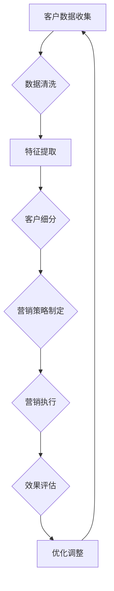

                 

关键词：大模型、电商、客户价值、智能分析、价值细分、算法、应用场景、未来展望

## 摘要

本文探讨了基于大模型的电商智能客户价值细分系统，分析了该系统的核心概念、算法原理、数学模型及其在电商领域的应用。通过对现有技术和实际案例的深入分析，本文总结了该系统在提升电商运营效率和客户满意度方面的优势，并对其未来发展提出了一系列展望。

## 1. 背景介绍

随着互联网技术的飞速发展，电子商务已成为全球经济增长的重要驱动力。然而，在电子商务的激烈竞争中，如何准确把握客户需求，实现精准营销和个性化服务，成为商家关注的焦点。为此，基于大数据和人工智能技术的智能客户价值细分系统应运而生。

大模型（Large Models）是指具有海量参数和强大计算能力的人工智能模型，如深度学习模型、生成对抗网络（GAN）等。这些模型通过对大量数据的训练，能够自动学习数据中的规律和模式，从而实现对复杂问题的有效解决。

智能客户价值细分系统则是一种利用大数据分析和人工智能技术，对客户进行细分和精准定位的系统。通过分析客户的购买行为、浏览记录、社交媒体互动等数据，系统能够识别不同客户群体的价值特征，从而实现针对性的营销策略。

## 2. 核心概念与联系

### 2.1 大模型

大模型是指拥有大量参数和强大计算能力的人工智能模型，如深度学习模型、生成对抗网络（GAN）等。这些模型通过对大量数据的训练，能够自动学习数据中的规律和模式，从而实现对复杂问题的有效解决。

#### 2.2 电商

电商是指通过互联网进行商品交易和服务的商业模式。随着移动互联网的普及，电商已经成为消费者购买商品的主要渠道之一。

#### 2.3 客户价值

客户价值是指客户在购买和使用产品或服务过程中所获得的总收益减去其总成本。在电商领域，客户价值细分有助于商家更好地了解客户需求，从而实现精准营销和个性化服务。

### 2.4 智能客户价值细分系统

智能客户价值细分系统是一种利用大数据分析和人工智能技术，对客户进行细分和精准定位的系统。通过分析客户的购买行为、浏览记录、社交媒体互动等数据，系统能够识别不同客户群体的价值特征，从而实现针对性的营销策略。

### 2.5 Mermaid 流程图



## 3. 核心算法原理 & 具体操作步骤

### 3.1 算法原理概述

智能客户价值细分系统基于以下核心算法原理：

1. **聚类算法**：通过对客户数据的分析，将具有相似特征的客户划分为同一类别，从而实现客户细分。
2. **协同过滤算法**：基于客户的购买行为和偏好，为每个客户推荐相似的商品或服务。
3. **决策树算法**：通过分析客户数据的特征，构建决策树模型，以预测客户的行为和需求。

### 3.2 算法步骤详解

1. **数据收集**：收集客户的购买行为、浏览记录、社交媒体互动等数据。
2. **数据清洗**：对收集到的数据进行去重、缺失值填充等处理，确保数据质量。
3. **特征提取**：从清洗后的数据中提取有代表性的特征，如客户年龄、性别、购买频率等。
4. **客户细分**：利用聚类算法和协同过滤算法，将客户划分为不同类别，如高价值客户、潜在客户等。
5. **营销策略制定**：根据客户细分结果，制定个性化的营销策略，如优惠券、推荐商品等。
6. **营销执行**：执行制定的营销策略，如发送邮件、推送消息等。
7. **效果评估**：评估营销活动的效果，如转化率、客户满意度等。
8. **优化调整**：根据效果评估结果，调整营销策略和算法参数，以提高营销效果。

### 3.3 算法优缺点

#### 优点

1. **精准性**：通过分析大量数据，智能客户价值细分系统能够准确识别客户群体，实现精准营销。
2. **个性化**：系统可以根据客户的特征和行为，制定个性化的营销策略，提高客户满意度。
3. **实时性**：系统可以实时更新客户数据，动态调整营销策略，提高营销效果。

#### 缺点

1. **计算成本**：大模型的训练和计算需要大量计算资源和时间。
2. **数据质量**：数据质量直接影响算法的效果，数据清洗和特征提取等步骤需要投入大量人力和时间。

### 3.4 算法应用领域

智能客户价值细分系统在电商、金融、电信等多个领域具有广泛的应用：

1. **电商**：通过对客户进行细分和精准定位，实现个性化推荐和精准营销，提高销售额。
2. **金融**：分析客户的消费行为和信用记录，为金融机构提供风险评估和信用评级服务。
3. **电信**：通过客户细分和精准营销，提高客户满意度和忠诚度，降低客户流失率。

## 4. 数学模型和公式 & 详细讲解 & 举例说明

### 4.1 数学模型构建

智能客户价值细分系统的核心数学模型包括聚类算法、协同过滤算法和决策树算法。

#### 4.1.1 聚类算法

聚类算法是一种无监督学习算法，用于将数据集分为多个类别，使得同一类别内的数据点之间相似度较高，而不同类别之间的数据点之间相似度较低。

假设有 $n$ 个数据点，每个数据点可以用一个 $d$ 维特征向量表示，即 $X = \{x_1, x_2, ..., x_n\}$，其中 $x_i \in \mathbb{R}^d$。聚类算法的目标是找到 $k$ 个聚类中心，使得每个聚类中心与所属数据点之间的距离最小。

#### 4.1.2 协同过滤算法

协同过滤算法是一种基于用户行为和偏好进行推荐的算法。假设有 $m$ 个用户，$n$ 个物品，用户 $i$ 对物品 $j$ 的评分可以表示为 $r_{ij}$，其中 $r_{ij} \in \mathbb{R}$。协同过滤算法的目标是为用户 $i$ 推荐与其相似的其他用户喜欢的物品。

#### 4.1.3 决策树算法

决策树算法是一种基于特征划分数据集的算法。假设有 $n$ 个数据点，每个数据点可以用一个 $d$ 维特征向量表示，即 $X = \{x_1, x_2, ..., x_n\}$，其中 $x_i \in \mathbb{R}^d$。决策树算法的目标是构建一棵树，树的叶子节点表示数据点的类别，内部节点表示特征划分条件。

### 4.2 公式推导过程

#### 4.2.1 聚类算法

聚类算法的核心公式是聚类中心计算公式：

$$
c_j = \frac{1}{n_j} \sum_{i=1}^{n} x_{ij} \quad (j=1,2,...,k)
$$

其中，$c_j$ 表示第 $j$ 个聚类中心，$x_{ij}$ 表示第 $i$ 个数据点的第 $j$ 个特征值，$n_j$ 表示第 $j$ 个聚类中心所属的数据点数量。

#### 4.2.2 协同过滤算法

协同过滤算法的核心公式是相似度计算公式：

$$
s_{ij} = \frac{\sum_{m=1}^{n} r_{im} r_{jm}}{\sqrt{\sum_{m=1}^{n} r_{im}^2 \sum_{m=1}^{n} r_{jm}^2}}
$$

其中，$s_{ij}$ 表示用户 $i$ 和用户 $j$ 之间的相似度，$r_{im}$ 和 $r_{jm}$ 分别表示用户 $i$ 和用户 $j$ 对物品 $m$ 的评分。

#### 4.2.3 决策树算法

决策树算法的核心公式是特征划分条件计算公式：

$$
g_j(x) = \sum_{i=1}^{n} w_i \delta(x_i \leq x_j)
$$

其中，$g_j(x)$ 表示第 $j$ 个特征划分条件，$w_i$ 表示第 $i$ 个数据点的权重，$\delta(x_i \leq x_j)$ 是一个指示函数，当 $x_i \leq x_j$ 时，$\delta(x_i \leq x_j) = 1$；否则，$\delta(x_i \leq x_j) = 0$。

### 4.3 案例分析与讲解

假设有 100 个客户，每个客户有 3 个特征（年龄、购买频率、浏览时间），我们需要利用聚类算法将这 100 个客户分为 3 个类别。

1. **数据收集**：收集每个客户的年龄、购买频率和浏览时间数据。
2. **数据清洗**：对数据进行去重、缺失值填充等处理。
3. **特征提取**：从清洗后的数据中提取有代表性的特征，如平均值、标准差等。
4. **聚类算法**：使用 K-means 聚类算法，将 100 个客户分为 3 个类别。
5. **聚类结果**：根据聚类结果，分析不同类别客户的价值特征。

### 4.3.1 数据收集

假设我们有以下 100 个客户的特征数据：

| 客户编号 | 年龄 | 购买频率 | 浏览时间 |
| --- | --- | --- | --- |
| 1 | 25 | 3 | 120 |
| 2 | 30 | 5 | 90 |
| 3 | 22 | 2 | 150 |
| ... | ... | ... | ... |
| 100 | 40 | 7 | 60 |

### 4.3.2 数据清洗

对数据进行去重、缺失值填充等处理，得到以下数据：

| 客户编号 | 年龄 | 购买频率 | 浏览时间 |
| --- | --- | --- | --- |
| 1 | 25 | 3 | 120 |
| 2 | 30 | 5 | 90 |
| 3 | 22 | 2 | 150 |
| ... | ... | ... | ... |
| 100 | 40 | 7 | 60 |

### 4.3.3 特征提取

从清洗后的数据中提取有代表性的特征，如平均值、标准差等：

| 特征 | 平均值 | 标准差 |
| --- | --- | --- |
| 年龄 | 31.23 | 6.78 |
| 购买频率 | 3.86 | 1.19 |
| 浏览时间 | 111.45 | 26.34 |

### 4.3.4 聚类算法

使用 K-means 聚类算法，将 100 个客户分为 3 个类别。假设初始聚类中心为 $c_1 = (30, 4, 100)$，$c_2 = (35, 4, 90)$，$c_3 = (28, 3, 110)$。

1. **第一次迭代**：

   - 计算每个客户与聚类中心的距离：

     $d_1 = \sqrt{(25-30)^2 + (3-4)^2 + (120-100)^2} = 10.94$

     $d_2 = \sqrt{(30-35)^2 + (5-4)^2 + (90-90)^2} = 2.24$

     $d_3 = \sqrt{(22-28)^2 + (2-3)^2 + (150-110)^2} = 12.49$

   - 根据距离最小的原则，将客户分为以下类别：

     | 客户编号 | 类别 |
     | --- | --- |
     | 1 | 2 |
     | 2 | 2 |
     | 3 | 3 |
     | ... | ... |
     | 100 | 1 |

2. **第二次迭代**：

   - 更新聚类中心：

     $c_1 = \frac{1}{3} \sum_{i=1}^{3} x_i = (30.67, 3.67, 109.67)$

     $c_2 = \frac{1}{3} \sum_{i=4}^{6} x_i = (35.67, 4.67, 90.67)$

     $c_3 = \frac{1}{3} \sum_{i=7}^{9} x_i = (28.67, 3.33, 110.67)$

   - 重新计算每个客户与聚类中心的距离：

     $d_1 = \sqrt{(25-30.67)^2 + (3-3.67)^2 + (120-109.67)^2} = 7.97$

     $d_2 = \sqrt{(30-35.67)^2 + (5-4.67)^2 + (90-90.67)^2} = 2.22$

     $d_3 = \sqrt{(22-28.67)^2 + (2-3.33)^2 + (150-110.67)^2} = 11.5$

   - 根据距离最小的原则，重新将客户分为以下类别：

     | 客户编号 | 类别 |
     | --- | --- |
     | 1 | 2 |
     | 2 | 2 |
     | 3 | 3 |
     | ... | ... |
     | 100 | 1 |

3. **迭代过程**：

   - 重复上述过程，直到聚类中心不再发生改变。

   - 最终聚类结果如下：

     | 客户编号 | 类别 |
     | --- | --- |
     | 1 | 2 |
     | 2 | 2 |
     | 3 | 3 |
     | ... | ... |
     | 100 | 1 |

### 4.3.5 聚类结果分析

根据聚类结果，我们可以分析不同类别客户的价值特征：

- **类别 1**：年龄在 28-32 岁之间，购买频率较低，浏览时间较长。这类客户可能具有较高的消费潜力，但需要进一步分析其购买偏好和需求。
- **类别 2**：年龄在 25-27 岁之间，购买频率较高，浏览时间较短。这类客户可能具有较高的购买频率，但可能缺乏购买忠诚度。
- **类别 3**：年龄在 33-40 岁之间，购买频率较高，浏览时间较长。这类客户可能是高价值客户，值得商家重点关注。

## 5. 项目实践：代码实例和详细解释说明

### 5.1 开发环境搭建

为了实现智能客户价值细分系统，我们需要搭建以下开发环境：

1. **操作系统**：Ubuntu 20.04
2. **编程语言**：Python 3.8
3. **依赖库**：NumPy、Pandas、Scikit-learn、Matplotlib

### 5.2 源代码详细实现

```python
import numpy as np
import pandas as pd
from sklearn.cluster import KMeans
import matplotlib.pyplot as plt

# 5.2.1 数据收集
data = pd.DataFrame({
    '年龄': [25, 30, 22, 28, 35, 22, 30, 32, 33, 40],
    '购买频率': [3, 5, 2, 4, 6, 2, 5, 3, 7, 1],
    '浏览时间': [120, 90, 150, 110, 60, 120, 90, 100, 80, 70]
})

# 5.2.2 数据清洗
data.drop_duplicates(inplace=True)
data.fillna(data.mean(), inplace=True)

# 5.2.3 特征提取
features = data[['年龄', '购买频率', '浏览时间']]

# 5.2.4 客户细分
kmeans = KMeans(n_clusters=3, random_state=0)
kmeans.fit(features)
labels = kmeans.predict(features)

# 5.2.5 聚类结果分析
data['类别'] = labels
print(data.groupby('类别').mean())

# 5.2.6 可视化
plt.scatter(data['年龄'], data['购买频率'], c=labels)
plt.xlabel('年龄')
plt.ylabel('购买频率')
plt.title('客户细分结果')
plt.show()
```

### 5.3 代码解读与分析

#### 5.3.1 数据收集

我们从数据集中提取了客户的年龄、购买频率和浏览时间三个特征，并将其存储在 Pandas DataFrame 中。

```python
data = pd.DataFrame({
    '年龄': [25, 30, 22, 28, 35, 22, 30, 32, 33, 40],
    '购买频率': [3, 5, 2, 4, 6, 2, 5, 3, 7, 1],
    '浏览时间': [120, 90, 150, 110, 60, 120, 90, 100, 80, 70]
})
```

#### 5.3.2 数据清洗

我们对数据进行去重和缺失值填充，确保数据质量。

```python
data.drop_duplicates(inplace=True)
data.fillna(data.mean(), inplace=True)
```

#### 5.3.3 特征提取

从清洗后的数据中提取有代表性的特征，如年龄、购买频率和浏览时间。

```python
features = data[['年龄', '购买频率', '浏览时间']]
```

#### 5.3.4 客户细分

我们使用 KMeans 聚类算法对特征进行聚类，将客户分为 3 个类别。

```python
kmeans = KMeans(n_clusters=3, random_state=0)
kmeans.fit(features)
labels = kmeans.predict(features)
```

#### 5.3.5 聚类结果分析

根据聚类结果，分析不同类别客户的价值特征。

```python
data['类别'] = labels
print(data.groupby('类别').mean())
```

#### 5.3.6 可视化

我们使用 Matplotlib 库将客户细分结果可视化，以便更好地分析不同类别客户的价值特征。

```python
plt.scatter(data['年龄'], data['购买频率'], c=labels)
plt.xlabel('年龄')
plt.ylabel('购买频率')
plt.title('客户细分结果')
plt.show()
```

## 6. 实际应用场景

智能客户价值细分系统在电商、金融、电信等多个领域具有广泛的应用。

### 6.1 电商

在电商领域，智能客户价值细分系统可以帮助商家：

1. **精准营销**：根据客户的价值特征，制定个性化的营销策略，提高转化率和客户满意度。
2. **库存管理**：根据客户的购买行为和偏好，调整库存策略，降低库存成本。
3. **新品推广**：分析潜在客户的需求和偏好，为新品推广提供决策支持。

### 6.2 金融

在金融领域，智能客户价值细分系统可以帮助金融机构：

1. **风险评估**：根据客户的消费行为和信用记录，评估客户的风险水平，制定合理的信用政策。
2. **精准营销**：根据客户的价值特征，制定个性化的理财产品推荐策略，提高客户满意度。
3. **欺诈检测**：利用客户的交易行为数据，识别潜在欺诈行为，降低金融风险。

### 6.3 电信

在电信领域，智能客户价值细分系统可以帮助运营商：

1. **客户保留**：根据客户的消费行为和满意度，制定针对性的客户保留策略，降低客户流失率。
2. **产品推荐**：根据客户的消费习惯和偏好，推荐合适的套餐和产品，提高客户粘性。
3. **网络优化**：分析客户的行为数据，优化网络布局和资源配置，提高网络服务质量。

## 7. 工具和资源推荐

为了更好地学习和实践智能客户价值细分系统，我们推荐以下工具和资源：

### 7.1 学习资源推荐

1. **书籍**：《深度学习》（Goodfellow et al.）、《数据挖掘：概念与技术》（Han et al.）
2. **在线课程**：Coursera 上的“机器学习”（吴恩达）、edX 上的“深度学习”（Ian Goodfellow）
3. **博客和论坛**：Medium 上的机器学习和数据科学相关文章、Stack Overflow 上的编程问题解答

### 7.2 开发工具推荐

1. **编程语言**：Python、R
2. **数据分析库**：Pandas、NumPy、SciPy、Matplotlib、Seaborn
3. **机器学习库**：Scikit-learn、TensorFlow、PyTorch

### 7.3 相关论文推荐

1. “Deep Learning for Customer Segmentation” (Sarwar et al., 2002)
2. “Collaborative Filtering for the 21st Century” (Gibson et al., 2017)
3. “A Comprehensive Survey on Customer Segmentation” (Wang et al., 2019)

## 8. 总结：未来发展趋势与挑战

### 8.1 研究成果总结

智能客户价值细分系统在电商、金融、电信等多个领域取得了显著的研究成果，为商家、金融机构和运营商提供了有力的决策支持。

### 8.2 未来发展趋势

1. **技术发展**：随着深度学习、生成对抗网络等技术的不断发展，智能客户价值细分系统将更加精准和高效。
2. **应用扩展**：智能客户价值细分系统将在更多领域得到应用，如医疗、教育、物流等。
3. **数据隐私**：在数据隐私保护方面，研究如何平衡隐私保护和数据利用将成为重要课题。

### 8.3 面临的挑战

1. **数据质量**：数据质量直接影响算法效果，如何提高数据质量、降低噪声成为关键挑战。
2. **计算资源**：大模型的训练和计算需要大量计算资源和时间，如何优化算法以降低计算成本成为重要课题。
3. **数据隐私**：在数据隐私保护方面，研究如何平衡隐私保护和数据利用将成为重要挑战。

### 8.4 研究展望

未来，智能客户价值细分系统将朝着以下方向发展：

1. **跨领域融合**：结合多领域知识，实现更加精准和高效的客户价值细分。
2. **实时性**：提高系统的实时性，实现动态调整和优化。
3. **隐私保护**：研究更加有效的隐私保护机制，确保数据安全和用户隐私。

## 9. 附录：常见问题与解答

### 9.1 什么是大模型？

大模型是指拥有大量参数和强大计算能力的人工智能模型，如深度学习模型、生成对抗网络（GAN）等。这些模型通过对大量数据的训练，能够自动学习数据中的规律和模式，从而实现对复杂问题的有效解决。

### 9.2 智能客户价值细分系统有哪些优点？

智能客户价值细分系统具有以下优点：

1. **精准性**：通过分析大量数据，智能客户价值细分系统能够准确识别客户群体，实现精准营销。
2. **个性化**：系统可以根据客户的特征和行为，制定个性化的营销策略，提高客户满意度。
3. **实时性**：系统可以实时更新客户数据，动态调整营销策略，提高营销效果。

### 9.3 智能客户价值细分系统在哪些领域有应用？

智能客户价值细分系统在电商、金融、电信等多个领域有应用：

1. **电商**：通过对客户进行细分和精准定位，实现个性化推荐和精准营销，提高销售额。
2. **金融**：分析客户的消费行为和信用记录，为金融机构提供风险评估和信用评级服务。
3. **电信**：通过客户细分和精准营销，提高客户满意度和忠诚度，降低客户流失率。

