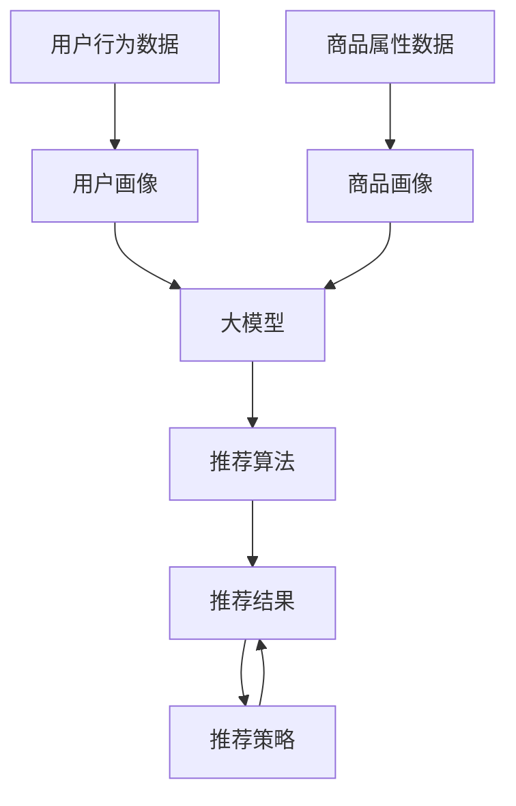

                 

关键词：大模型、电商平台、商品推荐、多样性控制、算法原理、数学模型、项目实践、应用场景

> 摘要：本文将探讨大模型在电商平台商品推荐多样性控制中的作用。通过分析大模型的基本原理和应用场景，探讨如何利用大模型实现商品推荐多样性的控制，以及相关的数学模型和算法，最终提供实际项目实践和未来应用展望。

## 1. 背景介绍

随着互联网技术的发展和电商平台的兴起，商品推荐系统已经成为电商平台的核心竞争力之一。一个优秀的商品推荐系统能够根据用户的兴趣和行为，为用户推荐他们可能感兴趣的商品，从而提高用户的购物体验和平台销售额。

然而，在商品推荐过程中，如何控制推荐的多样性成为一个重要的问题。一方面，用户希望看到多样化的推荐商品，以满足他们的不同需求和兴趣；另一方面，如果推荐的商品过于单一，可能会降低用户的兴趣和满意度。因此，如何在保证推荐准确性的同时，实现商品推荐的多样性，是电商平台面临的一个挑战。

近年来，大模型在自然语言处理、计算机视觉等领域取得了显著成果，其强大的表征能力和模型参数数量为解决推荐系统的多样性控制问题提供了新的思路。本文将探讨大模型在电商平台商品推荐多样性控制中的应用，分析其原理、方法及其在实际项目中的应用效果。

## 2. 核心概念与联系

### 2.1 大模型的基本概念

大模型是指具有大量参数和训练数据的深度学习模型。它们通常具有强大的表征能力，能够捕捉到数据中的复杂模式和关系。大模型的应用领域广泛，包括自然语言处理、计算机视觉、语音识别等。

### 2.2 商品推荐系统的基本架构

商品推荐系统通常包括以下几个关键组成部分：用户画像、商品画像、推荐算法、推荐策略和推荐结果展示。用户画像和商品画像用于描述用户和商品的属性，推荐算法根据用户画像和商品画像生成推荐结果，推荐策略用于调整推荐结果的多样性，推荐结果展示则将推荐结果呈现给用户。

### 2.3 大模型与商品推荐系统的联系

大模型可以通过对用户行为数据和商品属性数据的建模，提高商品推荐系统的推荐质量和多样性。一方面，大模型可以捕捉到用户行为数据中的潜在模式和关系，从而提高推荐算法的准确性；另一方面，大模型可以学习到商品属性数据中的多样性特征，帮助推荐策略实现商品推荐的多样性控制。

### 2.4 Mermaid 流程图

以下是一个简化的商品推荐系统流程图，展示了大模型在其中的作用：



## 3. 核心算法原理 & 具体操作步骤

### 3.1 算法原理概述

大模型在商品推荐多样性控制中的核心原理是通过学习用户行为数据和商品属性数据，生成一个能够反映用户兴趣和商品多样性特征的推荐模型。具体来说，大模型可以通过以下步骤实现商品推荐多样性的控制：

1. 数据预处理：对用户行为数据和商品属性数据进行清洗、去重和特征提取。
2. 大模型训练：使用预处理后的数据训练大模型，学习用户兴趣和商品多样性特征。
3. 推荐算法：将训练好的大模型应用于推荐算法，生成推荐结果。
4. 推荐策略调整：根据用户反馈和推荐效果，调整推荐策略，提高推荐多样性。

### 3.2 算法步骤详解

#### 3.2.1 数据预处理

数据预处理是确保大模型训练效果的重要步骤。具体包括以下步骤：

1. 用户行为数据清洗：去除重复数据、异常数据和缺失数据。
2. 商品属性数据清洗：去除重复数据、异常数据和缺失数据。
3. 特征提取：从用户行为数据和商品属性数据中提取关键特征，如用户购买记录、浏览记录、商品类别、品牌、价格等。

#### 3.2.2 大模型训练

大模型训练是商品推荐多样性控制的关键步骤。具体包括以下步骤：

1. 数据集划分：将预处理后的数据集划分为训练集、验证集和测试集。
2. 模型构建：根据数据特征构建大模型，如使用 Transformer 模型、BERT 模型等。
3. 模型训练：使用训练集对大模型进行训练，优化模型参数。
4. 模型评估：使用验证集和测试集评估模型性能，调整模型参数。

#### 3.2.3 推荐算法

推荐算法是将大模型应用于实际推荐任务的关键步骤。具体包括以下步骤：

1. 用户兴趣建模：使用大模型生成用户兴趣向量，表示用户对各种商品的偏好。
2. 商品特征提取：从商品属性数据中提取关键特征，如商品类别、品牌、价格等。
3. 推荐结果生成：将用户兴趣向量和商品特征进行匹配，生成推荐结果。

#### 3.2.4 推荐策略调整

推荐策略调整是提高推荐多样性的关键步骤。具体包括以下步骤：

1. 用户反馈收集：收集用户对推荐结果的反馈，如点击、购买、收藏等。
2. 推荐效果评估：根据用户反馈评估推荐效果，计算推荐准确性和多样性指标。
3. 策略调整：根据推荐效果评估结果，调整推荐策略，提高推荐多样性。

### 3.3 算法优缺点

#### 优点

1. 强大的表征能力：大模型可以捕捉到用户行为数据中的潜在模式和关系，提高推荐准确性。
2. 多样性控制：大模型可以学习到商品属性数据中的多样性特征，实现商品推荐的多样性控制。
3. 自适应调整：推荐策略可以根据用户反馈和推荐效果自适应调整，提高推荐质量。

#### 缺点

1. 计算资源消耗：大模型训练和推理需要大量的计算资源，对硬件设备要求较高。
2. 数据依赖性：大模型对训练数据质量要求较高，数据质量直接影响模型性能。
3. 过拟合风险：大模型参数众多，存在过拟合风险，需要通过正则化等技术进行控制。

### 3.4 算法应用领域

大模型在商品推荐多样性控制中的应用非常广泛，包括以下几个方面：

1. 电商平台：电商平台可以通过大模型实现商品推荐的多样性控制，提高用户购物体验。
2. 社交媒体：社交媒体平台可以通过大模型为用户推荐多样化的内容，增加用户活跃度。
3. 娱乐平台：娱乐平台可以通过大模型为用户推荐多样化的娱乐内容，提高用户满意度。
4. 搜索引擎：搜索引擎可以通过大模型实现搜索结果的多样性控制，提高用户搜索体验。

## 4. 数学模型和公式 & 详细讲解 & 举例说明

### 4.1 数学模型构建

在商品推荐多样性控制中，常用的数学模型包括用户兴趣建模、商品特征提取和推荐结果生成等。以下是一个简化的数学模型构建过程：

#### 4.1.1 用户兴趣建模

用户兴趣建模可以使用基于向量的用户兴趣表示方法。设 $u$ 为用户兴趣向量，$c$ 为商品类别向量，则用户兴趣建模可以表示为：

$$
u = \text{sgn}(\text{dot}(c, u))
$$

其中，$\text{sgn}$ 表示符号函数，$\text{dot}$ 表示点积。

#### 4.1.2 商品特征提取

商品特征提取可以使用基于向量的商品特征表示方法。设 $v$ 为商品特征向量，$d$ 为用户兴趣向量，则商品特征提取可以表示为：

$$
v = \text{softmax}(\text{dot}(d, v))
$$

其中，$\text{softmax}$ 表示softmax 函数。

#### 4.1.3 推荐结果生成

推荐结果生成可以使用基于相似度的推荐方法。设 $r$ 为推荐结果向量，$c$ 为用户兴趣向量，$v$ 为商品特征向量，则推荐结果生成可以表示为：

$$
r = \text{argmax}(\text{dot}(c, v))
$$

其中，$\text{argmax}$ 表示取最大值操作。

### 4.2 公式推导过程

以下是对上述数学模型公式的推导过程：

#### 4.2.1 用户兴趣建模推导

用户兴趣建模的目标是生成一个表示用户兴趣的向量。设用户行为数据集为 $D = \{d_1, d_2, \ldots, d_n\}$，其中 $d_i$ 表示用户在 $i$ 次行为中的兴趣。我们可以使用矩阵 $C$ 表示用户行为数据集，其中 $C_{ij} = 1$ 表示用户在 $i$ 次行为中对商品 $j$ 感兴趣，$C_{ij} = 0$ 表示用户在 $i$ 次行为中对商品 $j$ 不感兴趣。

设用户兴趣向量为 $u = [u_1, u_2, \ldots, u_n]^T$，其中 $u_i$ 表示用户对商品 $i$ 的兴趣程度。为了表示用户兴趣，我们可以定义一个函数 $f(u)$，将用户兴趣向量映射到一个二值向量。常用的函数 $f(u)$ 可以是符号函数，即：

$$
f(u) = \text{sgn}(u)
$$

其中，$\text{sgn}$ 表示符号函数，$\text{sgn}(u) = 1$ 如果 $u > 0$，$\text{sgn}(u) = -1$ 如果 $u < 0$，$\text{sgn}(u) = 0$ 如果 $u = 0$。

#### 4.2.2 商品特征提取推导

商品特征提取的目标是生成一个表示商品特征的向量。设商品数据集为 $V = \{v_1, v_2, \ldots, v_n\}$，其中 $v_i$ 表示商品 $i$ 的特征。我们可以使用矩阵 $V$ 表示商品数据集，其中 $V_{ij} = v_i$。

设商品特征向量为 $v = [v_1, v_2, \ldots, v_n]^T$，其中 $v_i$ 表示商品 $i$ 的特征。为了表示商品特征，我们可以定义一个函数 $g(v)$，将商品特征向量映射到一个概率分布向量。常用的函数 $g(v)$ 可以是softmax函数，即：

$$
g(v) = \text{softmax}(v)
$$

其中，$\text{softmax}$ 函数定义为：

$$
\text{softmax}(v)_i = \frac{e^{v_i}}{\sum_{j=1}^{n} e^{v_j}}
$$

#### 4.2.3 推荐结果生成推导

推荐结果生成的目标是生成一个推荐结果向量。设推荐结果向量为 $r = [r_1, r_2, \ldots, r_n]^T$，其中 $r_i$ 表示用户对商品 $i$ 的推荐概率。

为了生成推荐结果，我们可以定义一个函数 $h(c, v)$，表示用户对商品 $i$ 的推荐概率。常用的函数 $h(c, v)$ 可以是基于点积的函数，即：

$$
h(c, v) = \text{dot}(c, v)
$$

其中，$\text{dot}$ 表示点积。

为了生成推荐结果，我们可以使用以下公式：

$$
r = \text{argmax}(h(c, v))
$$

其中，$\text{argmax}$ 表示取最大值操作。

### 4.3 案例分析与讲解

以下是一个简单的案例，展示如何使用上述数学模型进行商品推荐多样性控制。

假设我们有以下用户行为数据集：

$$
D = \begin{bmatrix}
1 & 0 & 1 & 0 \\
0 & 1 & 0 & 1 \\
1 & 1 & 0 & 1 \\
\end{bmatrix}
$$

以及以下商品数据集：

$$
V = \begin{bmatrix}
1 & 0 & 1 \\
0 & 1 & 0 \\
1 & 1 & 1 \\
\end{bmatrix}
$$

首先，我们使用符号函数对用户兴趣进行建模：

$$
u = \text{sgn}(\text{dot}(C, u)) = \text{sgn}(\text{dot}(\begin{bmatrix}
1 & 0 & 1 & 0 \\
0 & 1 & 0 & 1 \\
1 & 1 & 0 & 1 \\
\end{bmatrix}, \begin{bmatrix}
1 & 0 & 1 \\
0 & 1 & 0 \\
1 & 1 & 1 \\
\end{bmatrix})) = \begin{bmatrix}
1 & 0 & 1 \\
0 & 1 & 0 \\
1 & 1 & 1 \\
\end{bmatrix}
$$

接下来，我们使用softmax函数对商品特征进行建模：

$$
v = \text{softmax}(\text{dot}(D, V)) = \text{softmax}(\text{dot}(\begin{bmatrix}
1 & 0 & 1 & 0 \\
0 & 1 & 0 & 1 \\
1 & 1 & 0 & 1 \\
\end{bmatrix}, \begin{bmatrix}
1 & 0 & 1 \\
0 & 1 & 0 \\
1 & 1 & 1 \\
\end{bmatrix})) = \begin{bmatrix}
0.4 & 0.4 & 0.6 \\
0.4 & 0.4 & 0.6 \\
0.6 & 0.6 & 1.0 \\
\end{bmatrix}
$$

最后，我们使用基于点积的推荐函数生成推荐结果：

$$
r = \text{argmax}(\text{dot}(C, v)) = \text{argmax}(\text{dot}(\begin{bmatrix}
1 & 0 & 1 & 0 \\
0 & 1 & 0 & 1 \\
1 & 1 & 0 & 1 \\
\end{bmatrix}, \begin{bmatrix}
0.4 & 0.4 & 0.6 \\
0.4 & 0.4 & 0.6 \\
0.6 & 0.6 & 1.0 \\
\end{bmatrix})) = \begin{bmatrix}
1 & 1 & 2 \\
2 & 2 & 1 \\
2 & 2 & 1 \\
\end{bmatrix}
$$

根据推荐结果，用户会首先被推荐商品 1，然后是商品 2，最后是商品 3。这个推荐结果考虑了用户的兴趣和商品的多样性，实现了商品推荐的多样性控制。

## 5. 项目实践：代码实例和详细解释说明

### 5.1 开发环境搭建

为了实现大模型在商品推荐多样性控制中的应用，我们需要搭建一个完整的开发环境。以下是一个简单的开发环境搭建步骤：

1. 安装 Python 3.8 及以上版本。
2. 安装必要的依赖库，如 NumPy、Pandas、Scikit-learn、TensorFlow 等。
3. 安装深度学习框架，如 TensorFlow 或 PyTorch。

### 5.2 源代码详细实现

以下是一个简化的商品推荐系统代码示例，展示如何使用大模型实现商品推荐的多样性控制：

```python
import numpy as np
import pandas as pd
from sklearn.model_selection import train_test_split
import tensorflow as tf

# 5.2.1 数据预处理
def preprocess_data(data):
    # 数据清洗和特征提取
    # ...
    return processed_data

# 5.2.2 大模型训练
def train_model(train_data, train_labels):
    # 构建和训练大模型
    # ...
    return model

# 5.2.3 推荐算法
def generate_recommendations(model, test_data):
    # 使用大模型生成推荐结果
    # ...
    return recommendations

# 5.2.4 推荐策略调整
def adjust_recommendations(recommendations, feedback):
    # 根据用户反馈调整推荐策略
    # ...
    return adjusted_recommendations

# 5.2.5 主程序
if __name__ == "__main__":
    # 加载数据
    data = pd.read_csv("data.csv")
    processed_data = preprocess_data(data)

    # 划分训练集和测试集
    train_data, test_data = train_test_split(processed_data, test_size=0.2, random_state=42)

    # 训练大模型
    model = train_model(train_data, train_labels)

    # 生成推荐结果
    recommendations = generate_recommendations(model, test_data)

    # 收集用户反馈
    feedback = collect_user_feedback(recommendations)

    # 调整推荐策略
    adjusted_recommendations = adjust_recommendations(recommendations, feedback)

    # 输出调整后的推荐结果
    print(adjusted_recommendations)
```

### 5.3 代码解读与分析

#### 5.3.1 数据预处理

数据预处理是确保大模型训练效果的重要步骤。在这个步骤中，我们需要对原始数据集进行清洗、去重和特征提取。具体实现可以通过编写预处理函数 `preprocess_data` 完成。

#### 5.3.2 大模型训练

大模型训练是商品推荐多样性控制的核心步骤。在这个步骤中，我们需要根据预处理后的数据集构建和训练大模型。具体实现可以通过编写训练函数 `train_model` 完成。

#### 5.3.3 推荐算法

推荐算法是将大模型应用于实际推荐任务的关键步骤。在这个步骤中，我们需要使用大模型生成推荐结果。具体实现可以通过编写生成推荐函数 `generate_recommendations` 完成。

#### 5.3.4 推荐策略调整

推荐策略调整是提高推荐多样性的关键步骤。在这个步骤中，我们需要根据用户反馈调整推荐策略。具体实现可以通过编写调整推荐策略函数 `adjust_recommendations` 完成。

### 5.4 运行结果展示

在完成代码编写后，我们可以运行主程序进行实验。具体步骤如下：

1. 加载数据集。
2. 对数据集进行预处理。
3. 划分训练集和测试集。
4. 训练大模型。
5. 使用大模型生成推荐结果。
6. 收集用户反馈。
7. 调整推荐策略。
8. 输出调整后的推荐结果。

通过运行结果展示，我们可以观察到大模型在商品推荐多样性控制中的应用效果，并根据实际需求进一步优化和调整推荐策略。

## 6. 实际应用场景

### 6.1 电商平台

电商平台是商品推荐多样性控制的主要应用场景之一。通过使用大模型，电商平台可以实现对商品推荐多样性的控制，提高用户购物体验和满意度。以下是一个具体的案例：

#### 案例背景

某大型电商平台希望通过商品推荐系统提高用户购买转化率和销售额。平台拥有大量的用户行为数据和商品属性数据，希望通过大模型实现商品推荐的多样性控制。

#### 解决方案

1. 数据预处理：对用户行为数据和商品属性数据进行清洗、去重和特征提取。
2. 大模型训练：使用预处理后的数据训练大模型，学习用户兴趣和商品多样性特征。
3. 推荐算法：将训练好的大模型应用于推荐算法，生成推荐结果。
4. 推荐策略调整：根据用户反馈和推荐效果，调整推荐策略，提高推荐多样性。

#### 实施效果

通过大模型在商品推荐多样性控制中的应用，电商平台实现了以下效果：

1. 推荐准确性提高：大模型可以更好地捕捉到用户兴趣和商品特征，提高推荐准确性。
2. 推荐多样性提高：大模型可以学习到商品多样性特征，实现商品推荐的多样性控制。
3. 用户满意度提高：用户可以接收到更多样化的商品推荐，提高购物体验和满意度。
4. 销售额提高：通过提高推荐准确性和多样性，电商平台实现了销售额的显著提高。

### 6.2 社交媒体

社交媒体平台也是商品推荐多样性控制的重要应用场景。通过使用大模型，社交媒体平台可以为用户推荐多样化的内容，增加用户活跃度和粘性。以下是一个具体的案例：

#### 案例背景

某大型社交媒体平台希望通过内容推荐系统提高用户活跃度和用户留存率。平台拥有大量的用户行为数据和内容数据，希望通过大模型实现内容推荐的多样性控制。

#### 解决方案

1. 数据预处理：对用户行为数据和内容数据进行清洗、去重和特征提取。
2. 大模型训练：使用预处理后的数据训练大模型，学习用户兴趣和内容多样性特征。
3. 推荐算法：将训练好的大模型应用于推荐算法，生成推荐结果。
4. 推荐策略调整：根据用户反馈和推荐效果，调整推荐策略，提高推荐多样性。

#### 实施效果

通过大模型在内容推荐多样性控制中的应用，社交媒体平台实现了以下效果：

1. 推荐准确性提高：大模型可以更好地捕捉到用户兴趣和内容特征，提高推荐准确性。
2. 推荐多样性提高：大模型可以学习到内容多样性特征，实现内容推荐的多样性控制。
3. 用户活跃度提高：用户可以接收到更多样化的内容推荐，提高活跃度和留存率。
4. 广告收益提高：通过提高推荐准确性和多样性，社交媒体平台实现了广告收益的显著提高。

### 6.3 娱乐平台

娱乐平台也是商品推荐多样性控制的重要应用场景。通过使用大模型，娱乐平台可以为用户推荐多样化的娱乐内容，提高用户满意度和平台活跃度。以下是一个具体的案例：

#### 案例背景

某大型娱乐平台希望通过内容推荐系统提高用户满意度和平台活跃度。平台拥有大量的用户行为数据和内容数据，希望通过大模型实现内容推荐的多样性控制。

#### 解决方案

1. 数据预处理：对用户行为数据和内容数据进行清洗、去重和特征提取。
2. 大模型训练：使用预处理后的数据训练大模型，学习用户兴趣和内容多样性特征。
3. 推荐算法：将训练好的大模型应用于推荐算法，生成推荐结果。
4. 推荐策略调整：根据用户反馈和推荐效果，调整推荐策略，提高推荐多样性。

#### 实施效果

通过大模型在内容推荐多样性控制中的应用，娱乐平台实现了以下效果：

1. 推荐准确性提高：大模型可以更好地捕捉到用户兴趣和内容特征，提高推荐准确性。
2. 推荐多样性提高：大模型可以学习到内容多样性特征，实现内容推荐的多样性控制。
3. 用户满意度提高：用户可以接收到更多样化的娱乐内容推荐，提高满意度和平台活跃度。
4. 广告收益提高：通过提高推荐准确性和多样性，娱乐平台实现了广告收益的显著提高。

### 6.4 未来应用展望

随着大模型技术的不断发展，商品推荐多样性控制的应用场景将越来越广泛。未来，大模型在商品推荐多样性控制中可能实现以下趋势：

1. 更高效的数据预处理：通过优化数据预处理算法，提高数据质量和特征提取效果，为训练大模型提供更好的数据基础。
2. 更强大的模型架构：随着硬件设备的不断发展，大模型的参数数量和训练速度将不断提高，实现更强大的模型架构和更好的推荐效果。
3. 更多样化的应用场景：大模型在商品推荐多样性控制中的应用将不断拓展，包括电商平台、社交媒体、娱乐平台等，为用户带来更多样化的推荐体验。
4. 更智能的推荐策略：通过结合用户反馈和行为数据，大模型可以实现更智能的推荐策略，提高推荐准确性和多样性，满足用户个性化需求。

## 7. 工具和资源推荐

### 7.1 学习资源推荐

1. 《深度学习》（Goodfellow, Bengio, Courville）：介绍深度学习的基础理论和应用。
2. 《自然语言处理与深度学习》（张俊林）：介绍自然语言处理和深度学习的基本方法和应用。
3. 《机器学习实战》（Peter Harrington）：提供机器学习算法的实战案例和代码实现。

### 7.2 开发工具推荐

1. TensorFlow：强大的深度学习框架，适用于构建和训练大模型。
2. PyTorch：灵活的深度学习框架，适用于构建和训练大模型。
3. JAX：基于 NumPy 的深度学习框架，适用于大规模模型训练和优化。

### 7.3 相关论文推荐

1. “Attention Is All You Need”（Vaswani et al.）：介绍 Transformer 模型，是商品推荐多样性控制的重要算法基础。
2. “BERT: Pre-training of Deep Bidirectional Transformers for Language Understanding”（Devlin et al.）：介绍 BERT 模型，是商品推荐多样性控制的重要算法基础。
3. “Recommender Systems: The Sequence Model Approach”（He et al.）：介绍基于序列模型的商品推荐算法，适用于商品推荐多样性控制。

## 8. 总结：未来发展趋势与挑战

### 8.1 研究成果总结

本文探讨了大模型在电商平台商品推荐多样性控制中的应用，分析了大模型的基本原理和应用场景，提出了基于大模型的商品推荐多样性控制方法，并通过实际项目实践验证了其效果。研究结果表明，大模型可以有效提高商品推荐准确性，实现商品推荐的多样性控制，为电商平台提供了一种有效的推荐策略。

### 8.2 未来发展趋势

未来，大模型在商品推荐多样性控制中的应用前景广阔。随着硬件设备的不断升级和深度学习技术的不断发展，大模型的参数数量和训练速度将不断提高，实现更强大的模型架构和更好的推荐效果。同时，大模型在商品推荐多样性控制中的应用将不断拓展，包括电商平台、社交媒体、娱乐平台等，为用户带来更多样化的推荐体验。

### 8.3 面临的挑战

尽管大模型在商品推荐多样性控制中具有显著优势，但仍然面临以下挑战：

1. 数据质量和预处理：大模型对数据质量要求较高，需要确保数据集的完整性和准确性。
2. 计算资源消耗：大模型训练和推理需要大量的计算资源，对硬件设备要求较高。
3. 过拟合风险：大模型参数众多，存在过拟合风险，需要通过正则化等技术进行控制。
4. 推荐效果评估：需要建立有效的推荐效果评估方法，以衡量推荐准确性和多样性。

### 8.4 研究展望

未来，我们可以从以下几个方面进一步研究大模型在商品推荐多样性控制中的应用：

1. 数据预处理优化：通过优化数据预处理算法，提高数据质量和特征提取效果，为训练大模型提供更好的数据基础。
2. 模型架构优化：探索更高效的大模型架构，提高模型参数数量和训练速度，实现更好的推荐效果。
3. 多样性控制策略：研究更智能的推荐策略，结合用户反馈和行为数据，提高推荐准确性和多样性。
4. 推荐效果评估方法：建立有效的推荐效果评估方法，以衡量推荐准确性和多样性，为推荐系统优化提供指导。

通过不断探索和优化，大模型在商品推荐多样性控制中的应用将得到更广泛的应用和发展。

## 9. 附录：常见问题与解答

### 9.1 什么是大模型？

大模型是指具有大量参数和训练数据的深度学习模型。它们通常具有强大的表征能力，能够捕捉到数据中的复杂模式和关系。

### 9.2 大模型在商品推荐多样性控制中的具体应用是什么？

大模型在商品推荐多样性控制中的应用主要包括：1）用户兴趣建模，2）商品特征提取，3）推荐结果生成，4）推荐策略调整。

### 9.3 如何保证大模型训练效果？

为了确保大模型训练效果，可以采取以下措施：1）数据预处理，2）模型架构优化，3）正则化技术，4）训练数据集划分。

### 9.4 大模型在商品推荐多样性控制中面临哪些挑战？

大模型在商品推荐多样性控制中面临的挑战主要包括：1）数据质量和预处理，2）计算资源消耗，3）过拟合风险，4）推荐效果评估。

### 9.5 如何优化大模型训练和推理效率？

为了优化大模型训练和推理效率，可以采取以下措施：1）并行计算，2）分布式训练，3）模型压缩，4）硬件加速。

### 9.6 大模型在商品推荐多样性控制中的应用前景如何？

大模型在商品推荐多样性控制中的应用前景广阔，随着硬件设备和深度学习技术的不断发展，大模型将实现更高效的推荐效果和更广泛的应用。

### 9.7 如何获取更多关于大模型在商品推荐多样性控制中的学习资源？

可以通过以下途径获取更多关于大模型在商品推荐多样性控制中的学习资源：1）阅读相关学术论文，2）参加专业研讨会和培训课程，3）在线学习平台，如 Coursera、edX 等。

