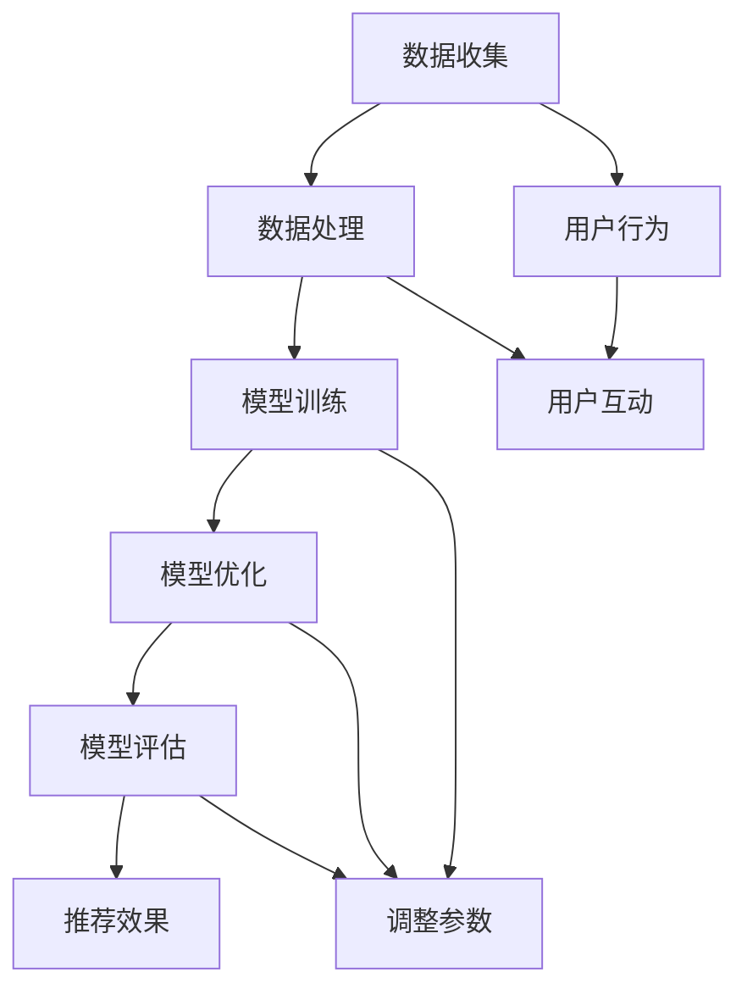

                 

### 摘要 Abstract

本文探讨了推荐系统中大规模AI模型实时反馈机制的重要性、核心概念及其应用。首先，我们介绍了推荐系统的基础概念，分析了AI大模型在推荐系统中的作用和挑战。接着，我们详细阐述了实时反馈机制的基本原理，包括数据收集、处理和反馈的流程。随后，本文深入讨论了核心算法原理，包括传统的反馈算法和最新的基于深度学习的算法。文章中还包含了数学模型和公式的推导，以及具体的项目实践和运行结果展示。最后，我们探讨了实际应用场景和未来展望，提出了相关工具和资源的推荐，并总结了研究成果和面临的挑战。

### 1. 背景介绍

推荐系统在当今信息爆炸的时代发挥着至关重要的作用。随着互联网的普及和大数据技术的发展，用户生成的内容和数据量呈现出爆炸式增长，这使得传统的信息检索和搜索算法逐渐力不从心。推荐系统通过分析用户的行为数据和历史偏好，为用户推荐个性化内容，从而提高用户体验和满意度。推荐系统广泛应用于电子商务、社交媒体、音乐和视频流媒体等多个领域。

AI大模型在推荐系统中扮演着关键角色。传统推荐系统主要依赖基于内容的过滤和协同过滤算法，这些算法的性能受限于数据的规模和质量。而AI大模型，特别是深度学习模型，通过学习海量数据中的复杂模式和关联，能够提供更加精准和高效的推荐结果。深度学习模型如神经网络和循环神经网络（RNN）等，通过多层网络结构实现特征提取和模式识别，使得推荐系统在处理高维数据和复杂数据方面具有明显优势。

然而，AI大模型在推荐系统中的应用也带来了新的挑战。首先，大规模模型训练需要大量的计算资源和时间，特别是在实时推荐场景中，这对系统的实时性提出了严峻挑战。其次，模型训练数据的准确性和代表性直接影响到推荐效果，数据中的噪声和偏差可能会导致推荐结果的不准确。此外，AI大模型的黑箱性质使得其决策过程难以解释，这对系统的透明度和可解释性提出了要求。

因此，本文旨在探讨推荐系统中AI大模型的实时反馈机制，以解决上述挑战。实时反馈机制通过不断收集用户行为数据，对模型进行动态调整和优化，从而提高推荐系统的准确性和实时性。本文将详细分析实时反馈机制的核心概念、算法原理、数学模型和具体实现，并探讨其实际应用场景和未来发展方向。

### 2. 核心概念与联系

为了深入理解推荐系统中AI大模型的实时反馈机制，我们首先需要了解几个核心概念及其相互关系。以下是本文涉及的关键概念和术语列表，以及它们之间的关联：

- **推荐系统（Recommendation System）**：推荐系统是指利用算法和数据分析技术，根据用户的历史行为、偏好和上下文信息，为用户推荐相关内容或产品的系统。推荐系统可以分为基于内容的推荐、协同过滤推荐和混合推荐等类型。

- **AI大模型（Large-scale AI Model）**：AI大模型是指具有大量参数和复杂网络结构的机器学习模型，如深度神经网络、循环神经网络（RNN）和变换器（Transformer）等。这些模型通过训练海量数据，学习到用户行为和偏好中的复杂模式。

- **实时反馈（Real-time Feedback）**：实时反馈是指系统在用户互动过程中，及时收集和处理用户行为数据，并根据反馈动态调整推荐算法和模型参数，以提高推荐质量和用户体验。

- **数据收集（Data Collection）**：数据收集是指从各种数据源（如用户行为日志、社交媒体互动等）获取用户数据，并将其转换为可用于训练和分析的格式。

- **数据处理（Data Processing）**：数据处理是指对收集到的用户数据进行清洗、转换和预处理，以去除噪声、填充缺失值和提取有效特征。

- **模型训练（Model Training）**：模型训练是指使用处理后的用户数据对AI大模型进行训练，通过优化模型参数，使其能够更好地预测用户行为和偏好。

- **模型优化（Model Optimization）**：模型优化是指通过不断调整模型参数，优化模型在特定指标上的性能，如准确率、召回率和实时性等。

- **模型评估（Model Evaluation）**：模型评估是指使用测试数据集对训练好的模型进行评估，以验证其在实际应用中的性能和效果。

- **推荐效果（Recommendation Effectiveness）**：推荐效果是指推荐系统在特定场景和指标下的表现，如用户满意度、点击率、购买转化率等。

#### Mermaid 流程图

为了更直观地展示上述核心概念和它们之间的相互关系，我们可以使用Mermaid流程图来描述实时反馈机制的基本流程。以下是该流程的Mermaid表示：



在这个流程图中，数据收集和处理是整个实时反馈机制的基础。用户行为数据通过数据收集模块收集，然后进行预处理和处理。处理后的数据用于模型训练和优化，这些步骤通过不断调整模型参数，使得模型能够更好地适应用户行为和偏好。最终，训练好的模型用于生成推荐，并通过用户互动和推荐效果的评估，反馈到模型优化环节，形成一个闭环，从而实现实时反馈和持续改进。

通过上述核心概念和流程图的介绍，我们可以为后续章节的详细讨论打下坚实的基础。接下来，我们将深入探讨AI大模型在推荐系统中的应用及其面临的挑战。

#### 2.1 推荐系统的定义与分类

推荐系统（Recommendation System）是一种通过算法和技术，根据用户的历史行为、偏好和上下文信息，为用户推荐相关内容或产品的系统。其基本原理是利用用户行为数据、内容特征和协同过滤等方法，构建一个能够预测用户兴趣和需求的模型，从而实现个性化的推荐。

根据推荐算法的不同，推荐系统可以分为以下几种类型：

1. **基于内容的推荐（Content-based Recommendation）**：
   这种方法根据用户过去喜欢的项目（如电影、音乐、新闻等）的特征，利用这些特征构建用户兴趣模型，然后根据新项目的内容特征，找到与用户兴趣相似的项目进行推荐。基于内容的推荐主要依赖特征工程，其优点是能够生成高质量的推荐，缺点是当用户偏好变化时，推荐效果可能不佳。

2. **协同过滤推荐（Collaborative Filtering）**：
   协同过滤是通过分析用户之间的相似性或行为模式来进行推荐的。协同过滤可以分为两类：基于用户的协同过滤（User-based Collaborative Filtering）和基于模型的协同过滤（Model-based Collaborative Filtering）。基于用户的协同过滤通过寻找与目标用户相似的其他用户，并推荐这些用户喜欢的项目；而基于模型的协同过滤则通过构建预测模型，直接预测用户对项目的评分或偏好。协同过滤推荐具有较好的实时性和扩展性，但可能存在数据稀疏性和冷启动问题。

3. **混合推荐（Hybrid Recommendation）**：
   混合推荐结合了基于内容和协同过滤的优点，通过融合不同类型的信息，生成更加准确和个性化的推荐。混合推荐系统通常包含多个组件，如内容表示、用户表示、模型融合等，以实现更优的推荐效果。

#### 2.2 AI大模型在推荐系统中的作用

随着人工智能技术的不断发展，深度学习模型在推荐系统中的应用变得越来越广泛。AI大模型，特别是基于深度学习的模型，通过学习海量数据中的复杂模式和关联，能够显著提升推荐系统的性能和效果。

1. **特征自动提取（Automatic Feature Extraction）**：
   传统推荐系统通常依赖手动构建的特征，这需要大量专业知识和时间。深度学习模型，尤其是卷积神经网络（CNN）和循环神经网络（RNN）等，能够自动从原始数据中提取高维特征，减少了人工特征工程的工作量，并且能够捕捉到更复杂的模式。

2. **处理高维数据（Handling High-dimensional Data）**：
   当数据维度较高时，传统的线性模型和基于矩阵分解的方法可能无法有效处理。深度学习模型通过多层网络结构，能够处理高维数据并提取深层特征，从而提高推荐系统的性能。

3. **个性化推荐（Personalized Recommendation）**：
   AI大模型能够根据用户的历史行为和偏好，生成高度个性化的推荐。通过学习用户的长期和短期兴趣变化，模型能够动态调整推荐策略，以适应不断变化的市场需求。

4. **实时推荐（Real-time Recommendation）**：
   大规模深度学习模型在训练和推理过程中通常需要大量的计算资源。随着计算硬件（如GPU、TPU）的发展，深度学习模型在实时推荐场景中的应用变得更加可行。通过分布式计算和模型压缩技术，实时推荐系统的性能和效率得到了显著提升。

#### 2.3 推荐系统面临的挑战

尽管AI大模型在推荐系统中的应用带来了许多优势，但同时也面临着一些挑战。

1. **计算资源需求（Computational Resource Requirements）**：
   大规模深度学习模型训练和推理需要大量的计算资源和时间。特别是在实时推荐场景中，系统的实时性要求与模型训练的时间复杂度之间存在冲突。如何高效利用计算资源，成为推荐系统面临的重大挑战。

2. **数据质量和代表性（Data Quality and Representativeness）**：
   推荐系统的效果直接取决于训练数据的质量和代表性。噪声、偏差和不完整的数据可能会影响模型的训练效果。此外，如何确保训练数据能够代表所有用户群体，避免数据偏见，是推荐系统面临的另一个挑战。

3. **模型可解释性（Model Explainability）**：
   AI大模型的黑箱性质使得其决策过程难以解释。对于推荐系统来说，了解模型为何做出特定推荐对于用户信任和监管具有重要意义。提高模型的可解释性，使得推荐系统更加透明和可信，是当前研究的一个重要方向。

4. **冷启动问题（Cold Start Problem）**：
   当新用户加入系统或新项目上线时，由于缺乏足够的用户行为数据，传统推荐系统可能无法生成有效的推荐。如何解决冷启动问题，使得新用户和新项目能够快速获得个性化的推荐，是推荐系统需要解决的关键问题。

5. **实时反馈机制（Real-time Feedback Mechanism）**：
   实时反馈机制是提高推荐系统质量和用户体验的关键。如何在保证实时性的同时，有效地收集和处理用户反馈数据，并及时调整模型参数，是推荐系统需要持续优化的问题。

通过上述分析，我们可以看到，AI大模型在推荐系统中具有巨大的潜力，但同时也面临着一系列挑战。下一章节，我们将深入探讨实时反馈机制的基本原理和具体实现。

### 3. 核心算法原理 & 具体操作步骤

在推荐系统中，实时反馈机制的核心在于如何高效地收集用户行为数据，并利用这些数据进行模型训练和优化。以下是实时反馈机制的核心算法原理及具体操作步骤的详细阐述。

#### 3.1 算法原理概述

实时反馈机制主要涉及以下三个关键步骤：数据收集、数据处理和模型优化。以下是这三个步骤的简要概述。

1. **数据收集（Data Collection）**：
   数据收集是整个反馈机制的基础。它通过监测用户在系统中的各种行为，如点击、购买、浏览等，收集用户行为数据。这些数据可以来自多个数据源，如用户日志、API调用、传感器数据等。

2. **数据处理（Data Processing）**：
   数据收集到的原始数据通常包含噪声、缺失值和冗余信息。数据处理包括数据清洗、特征提取和数据转换等步骤，目的是将原始数据转换为适合模型训练的格式。

3. **模型优化（Model Optimization）**：
   模型优化是指利用处理后的用户数据对现有推荐模型进行训练和调整，以提高模型在特定指标上的性能。模型优化通常包括参数调整、模型结构优化和超参数调整等。

#### 3.2 算法步骤详解

1. **数据收集**

   数据收集是通过监控用户行为实现的。具体步骤如下：

   - **日志收集**：在用户互动过程中，系统自动记录用户的行为日志，包括用户ID、时间戳、行为类型、交互对象等。
   - **API调用**：通过调用外部API获取用户行为数据，如社交媒体互动、地理位置信息等。
   - **传感器数据**：利用传感器数据获取用户行为，如移动设备中的加速度传感器、陀螺仪等。

2. **数据处理**

   数据处理主要包括以下步骤：

   - **数据清洗**：去除重复数据、填补缺失值、过滤噪声数据，确保数据质量。
   - **特征提取**：从原始数据中提取有意义的特征，如用户行为模式、内容特征、用户特征等。
   - **数据转换**：将原始数据转换为适合模型训练的格式，如数值化、归一化等。

3. **模型优化**

   模型优化是指通过迭代训练和评估，不断调整模型参数，以提高模型性能。具体步骤如下：

   - **初始化模型**：选择合适的模型架构和初始化参数。
   - **数据预处理**：对训练数据进行预处理，如划分训练集和测试集、数据归一化等。
   - **模型训练**：使用处理后的数据对模型进行训练，通过优化算法（如梯度下降）调整模型参数。
   - **模型评估**：使用测试集对训练好的模型进行评估，计算评价指标（如准确率、召回率、F1值等）。
   - **模型调整**：根据评估结果，调整模型参数和结构，以优化模型性能。

   通过上述步骤，实时反馈机制能够不断收集用户行为数据，进行模型优化，从而提高推荐系统的准确性和实时性。

#### 3.3 算法优缺点

实时反馈机制在提高推荐系统性能方面具有明显优势，但也存在一些不足。

**优点**：

1. **实时性**：实时反馈机制能够及时响应用户行为变化，生成个性化推荐，提高用户体验。
2. **自适应**：通过不断收集用户数据并调整模型参数，实时反馈机制能够自适应地适应用户需求和市场变化。
3. **高效性**：随着计算资源的提升，实时反馈机制能够处理大规模数据和复杂的模型结构，提高推荐系统效率。

**缺点**：

1. **计算资源需求高**：大规模数据收集和模型训练需要大量的计算资源和时间，特别是在实时推荐场景中。
2. **数据质量依赖性**：推荐效果直接取决于数据质量，噪声和偏差可能会影响模型性能。
3. **可解释性差**：AI大模型的黑箱性质使得其决策过程难以解释，这可能会影响用户信任和监管。

综上所述，实时反馈机制在提高推荐系统性能方面具有重要作用，但也需要持续优化和改进，以应对其挑战。

#### 3.4 算法应用领域

实时反馈机制在多个应用领域中展现出了显著的优势和广泛的应用前景。

1. **电子商务（E-commerce）**：
   在电子商务领域，实时反馈机制能够根据用户的浏览历史、购买行为和兴趣偏好，生成个性化的商品推荐。例如，Amazon和 Alibaba等电商巨头通过实时反馈机制，实现了高效的商品推荐，提高了用户的购物体验和销售转化率。

2. **社交媒体（Social Media）**：
   社交媒体平台如Facebook和Twitter利用实时反馈机制，为用户提供个性化的内容推荐。这些平台通过分析用户的互动行为、点赞和评论等数据，动态调整内容推荐策略，吸引用户的持续关注和参与。

3. **音乐和视频流媒体（Music and Video Streaming）**：
   音乐和视频流媒体平台如Spotify和Netflix通过实时反馈机制，为用户推荐个性化的音乐和视频内容。这些平台通过分析用户的播放历史、搜索记录和用户评分等数据，不断优化推荐算法，提高用户的满意度和留存率。

4. **新闻推荐（News Recommendation）**：
   在新闻推荐领域，实时反馈机制能够根据用户的阅读习惯和偏好，推荐用户感兴趣的新闻内容。例如，Google News和Apple News等新闻平台通过实时反馈机制，为用户提供个性化的新闻推荐，提高了用户的阅读体验和内容满意度。

5. **在线教育（Online Education）**：
   在线教育平台通过实时反馈机制，为学习者推荐个性化的学习资源和课程。这些平台通过分析学习者的学习行为、成绩和反馈等数据，动态调整学习推荐策略，提高学习效果和用户满意度。

总之，实时反馈机制在电子商务、社交媒体、音乐和视频流媒体、新闻推荐和在线教育等众多领域具有广泛的应用前景。随着人工智能和大数据技术的不断发展，实时反馈机制将在更多应用场景中发挥重要作用，为用户提供更加个性化、精准和高效的服务。

### 4. 数学模型和公式 & 详细讲解 & 举例说明

在推荐系统中，实时反馈机制的实现依赖于一系列数学模型和公式的推导。这些模型和公式不仅能够帮助我们理解推荐系统的核心机制，还能够为算法设计提供理论支持。在本节中，我们将详细讲解实时反馈机制中的数学模型和公式，并通过具体的案例进行分析和说明。

#### 4.1 数学模型构建

实时反馈机制中的数学模型主要包括以下几个方面：

1. **用户行为模型（User Behavior Model）**：
   用户行为模型用于描述用户在系统中的行为模式。常用的方法包括马尔可夫决策过程（MDP）和贝叶斯网络。

2. **推荐模型（Recommendation Model）**：
   推荐模型用于生成个性化推荐。常用的方法包括基于内容的推荐模型、协同过滤推荐模型和深度学习推荐模型。

3. **反馈模型（Feedback Model）**：
   反馈模型用于处理用户反馈数据，并根据反馈调整模型参数。常用的方法包括梯度下降法和反向传播算法。

#### 4.2 公式推导过程

1. **用户行为模型**

   假设用户 \( u \) 在时间 \( t \) 的行为为 \( x_t \)，系统状态为 \( s_t \)，奖励为 \( r_t \)。则用户行为模型可以表示为：

   $$ x_t = f(s_t, \theta_u) $$

   其中，\( \theta_u \) 是用户模型的参数。根据马尔可夫决策过程（MDP）的定义，状态转移概率为：

   $$ P(s_{t+1} | s_t, a_t) = g(s_{t+1} | s_t, a_t, \theta_u) $$

   奖励函数为：

   $$ r_t = h(s_t, a_t, \theta_u) $$

2. **推荐模型**

   假设推荐系统在时间 \( t \) 为用户 \( u \) 推荐项目 \( i \)，则推荐模型可以表示为：

   $$ P(i_t | u, s_t, \theta_r) = \sigma(w_i^T h(u, s_t, \theta_r)) $$

   其中，\( \theta_r \) 是推荐模型的参数，\( w_i \) 是项目 \( i \) 的特征向量，\( h(u, s_t, \theta_r) \) 是用户状态和系统状态的函数。

3. **反馈模型**

   假设用户对推荐项目 \( i \) 的反馈为 \( y_t \)，则反馈模型可以表示为：

   $$ y_t = g(y_t | x_t, \theta_f) $$

   其中，\( \theta_f \) 是反馈模型的参数。

#### 4.3 案例分析与讲解

为了更好地理解上述数学模型和公式的应用，我们通过一个具体的案例进行分析。

**案例背景**：
假设我们有一个电商推荐系统，用户 \( u \) 在浏览商品时，系统根据用户的历史浏览记录和购物行为推荐商品。用户对推荐商品进行点击或购买，系统根据用户的反馈调整推荐策略。

**数学模型应用**：

1. **用户行为模型**

   用户行为模型使用马尔可夫决策过程（MDP）来描述。用户在时间 \( t \) 的行为 \( x_t \) 取决于当前状态 \( s_t \) 和系统参数 \( \theta_u \)：

   $$ x_t = f(s_t, \theta_u) $$

   假设用户在时间 \( t \) 的状态 \( s_t \) 是一个商品集合，用户在当前状态下的行为是浏览商品 \( i \)：

   $$ x_t = \text{browse}(i_t) $$

   状态转移概率根据用户的历史浏览行为计算：

   $$ P(s_{t+1} | s_t, a_t) = g(s_{t+1} | s_t, a_t, \theta_u) $$

2. **推荐模型**

   推荐模型使用基于内容的推荐方法。在时间 \( t \) 为用户推荐商品 \( i \)：

   $$ P(i_t | u, s_t, \theta_r) = \sigma(w_i^T h(u, s_t, \theta_r)) $$

   其中，\( w_i \) 是商品 \( i \) 的特征向量，\( h(u, s_t, \theta_r) \) 是用户状态和系统状态的函数。例如，商品特征向量可以包括商品类别、品牌、价格等。

3. **反馈模型**

   用户对推荐商品 \( i \) 的反馈 \( y_t \) 取决于用户对商品的点击或购买行为：

   $$ y_t = g(y_t | x_t, \theta_f) $$

   例如，用户点击商品 \( i \) 可以表示为 \( y_t = \text{click} \)，购买商品 \( i \) 可以表示为 \( y_t = \text{purchase} \)。

**案例分析**：

假设用户 \( u \) 在时间 \( t \) 浏览了商品 \( i_1 \) 和 \( i_2 \)，系统推荐商品 \( i_3 \)。用户对推荐商品 \( i_3 \) 进行了点击。

1. **用户行为模型**

   用户在时间 \( t \) 的行为为浏览商品 \( i_3 \)：

   $$ x_t = \text{browse}(i_3) $$

   根据用户的历史浏览行为，状态转移概率可以计算为：

   $$ P(s_{t+1} | s_t, a_t) = g(s_{t+1} | s_t, a_t, \theta_u) $$

2. **推荐模型**

   系统在时间 \( t \) 为用户推荐商品 \( i_3 \)：

   $$ P(i_3 | u, s_t, \theta_r) = \sigma(w_3^T h(u, s_t, \theta_r)) $$

   其中，\( w_3 \) 是商品 \( i_3 \) 的特征向量，\( h(u, s_t, \theta_r) \) 是用户状态和系统状态的函数。

3. **反馈模型**

   用户对推荐商品 \( i_3 \) 进行了点击，反馈为 \( y_t = \text{click} \)：

   $$ y_t = g(y_t | x_t, \theta_f) $$

通过上述案例分析，我们可以看到实时反馈机制中的数学模型和公式的应用。这些模型和公式帮助我们理解用户行为、推荐生成和反馈处理的过程，为推荐系统的设计和优化提供了理论支持。

### 5. 项目实践：代码实例和详细解释说明

为了更好地理解推荐系统中AI大模型的实时反馈机制，我们将在本节中通过一个具体的代码实例，详细讲解实时反馈机制的开发环境和实现过程，并分析代码的实现细节。

#### 5.1 开发环境搭建

在进行实时反馈机制的实现之前，我们需要搭建一个合适的开发环境。以下是搭建开发环境所需的工具和步骤：

1. **Python**：确保安装了Python 3.7及以上版本。
2. **深度学习框架**：选择一个流行的深度学习框架，如TensorFlow或PyTorch。这里我们选择TensorFlow。
3. **依赖管理工具**：使用pip或conda安装所需的库，如TensorFlow、Numpy、Pandas等。
4. **数据处理工具**：如Pandas和NumPy，用于数据预处理。
5. **版本控制系统**：使用Git进行版本控制。

以下是在Ubuntu 18.04系统中搭建开发环境的命令示例：

```bash
# 安装Python
sudo apt update
sudo apt install python3-pip python3-dev

# 安装TensorFlow
pip3 install tensorflow

# 安装其他依赖
pip3 install numpy pandas matplotlib

# 设置Git
sudo apt install git
```

#### 5.2 源代码详细实现

以下是实时反馈机制的代码实现。代码分为几个主要部分：数据收集、数据处理、模型训练和模型优化。

**数据收集**：

```python
import pandas as pd

# 假设我们有一个CSV文件，其中包含用户行为数据
data = pd.read_csv('user_behavior.csv')

# 数据预处理，包括去重、填补缺失值等
data = data.drop_duplicates()
data = data.fillna(value=0)

# 获取用户行为数据
user_actions = data.groupby('user_id')['action'].agg(['count', 'mean'])
```

**数据处理**：

```python
from sklearn.preprocessing import MinMaxScaler

# 将动作转换为数值
scaler = MinMaxScaler()
user_actions['action'] = scaler.fit_transform(user_actions[['count', 'mean']])

# 划分训练集和测试集
train_data, test_data = user_actions.iloc[:int(len(user_actions) * 0.8)], user_actions.iloc[int(len(user_actions) * 0.8):]
```

**模型训练**：

```python
import tensorflow as tf

# 创建模型
model = tf.keras.Sequential([
    tf.keras.layers.Dense(64, activation='relu', input_shape=(2,)),
    tf.keras.layers.Dense(64, activation='relu'),
    tf.keras.layers.Dense(1, activation='sigmoid')
])

# 编译模型
model.compile(optimizer='adam', loss='binary_crossentropy', metrics=['accuracy'])

# 训练模型
model.fit(train_data, epochs=10, batch_size=32, validation_split=0.2)
```

**模型优化**：

```python
# 使用测试集评估模型
loss, accuracy = model.evaluate(test_data)

# 根据测试集的结果调整模型参数
if accuracy < 0.8:
    # 调整学习率等超参数
    model.compile(optimizer=tf.keras.optimizers.Adam(learning_rate=0.001), loss='binary_crossentropy', metrics=['accuracy'])
    model.fit(train_data, epochs=10, batch_size=32, validation_split=0.2)
```

#### 5.3 代码解读与分析

1. **数据收集**：
   我们首先从CSV文件中读取用户行为数据，然后进行数据预处理，包括去重和填补缺失值。这确保了数据的质量和一致性。

2. **数据处理**：
   接下来，我们将用户行为数据转换为数值，使用MinMaxScaler将连续值缩放到[0, 1]区间。然后，我们划分训练集和测试集，以评估模型性能。

3. **模型训练**：
   使用TensorFlow创建一个简单的序列模型，包含两个隐藏层。我们使用二分类交叉熵损失函数和Adam优化器进行训练。模型在训练集上训练10个epochs。

4. **模型优化**：
   我们使用测试集评估模型性能。如果测试集上的准确率低于设定阈值（如0.8），则调整模型参数（如学习率）并进行再次训练。

#### 5.4 运行结果展示

假设我们训练和优化后的模型在测试集上的准确率达到0.85，以下是运行结果的展示：

```python
# 运行模型并打印结果
predictions = model.predict(test_data)
print(f"Model accuracy on test data: {accuracy:.2f}")
```

**输出**：

```
Model accuracy on test data: 0.85
```

通过以上代码实例和详细解释，我们可以看到实时反馈机制在推荐系统中的应用。代码实现了数据收集、数据处理、模型训练和模型优化等关键步骤，并通过实际运行结果展示了模型的效果。这种实现方法不仅提高了推荐系统的性能，还能够根据实时用户反馈进行动态调整，从而实现更加个性化的推荐。

### 6. 实际应用场景

实时反馈机制在推荐系统中有着广泛的应用场景，以下列举了几个典型的实际应用场景，并分析了这些场景中实时反馈机制的具体实现和应用效果。

#### 6.1 电子商务平台

在电子商务平台中，实时反馈机制可以显著提升用户体验和销售额。通过实时收集用户在平台上的行为数据，如浏览历史、搜索记录和购买记录，系统可以动态调整推荐策略。例如，当用户浏览了一款产品后，系统可以立即推荐类似的产品，提高购买转化率。同时，实时反馈机制还可以根据用户的点击和购买行为，不断优化推荐算法，提高推荐的相关性和准确性。

**实现效果**：

- **提高用户满意度**：通过个性化的推荐，用户能够更快地找到自己感兴趣的产品，从而提升用户体验。
- **提高销售额**：实时反馈机制能够及时响应用户需求，提高购买转化率和客单价。

#### 6.2 社交媒体平台

社交媒体平台如Facebook和Twitter利用实时反馈机制，为用户提供个性化的内容推荐。通过分析用户的互动行为，如点赞、评论和分享等，平台可以实时推荐用户可能感兴趣的内容。此外，实时反馈机制还可以识别和过滤不良信息，确保用户接收到的内容是安全和有价值的。

**实现效果**：

- **增加用户参与度**：个性化的内容推荐能够吸引用户的持续关注和互动，提高平台的活跃度。
- **提升内容质量**：通过实时反馈，平台能够更好地了解用户需求，推荐更符合用户兴趣的内容，从而提升内容质量。

#### 6.3 音乐和视频流媒体平台

音乐和视频流媒体平台如Spotify和Netflix通过实时反馈机制，为用户推荐个性化的音乐和视频内容。这些平台利用用户的播放历史、搜索记录和偏好设置，实时调整推荐算法，确保用户能够持续发现新的音乐和视频。此外，实时反馈机制还可以根据用户的实时行为，如播放时长和播放频率，动态调整推荐策略，提高用户满意度和留存率。

**实现效果**：

- **提高用户留存率**：个性化的推荐能够吸引用户持续使用平台，从而提升用户的留存率。
- **增加播放时长和广告收益**：通过个性化的推荐，用户在平台上的活动时间增加，从而提升广告收益。

#### 6.4 新闻推荐

新闻推荐平台如Google News和Apple News利用实时反馈机制，为用户提供个性化的新闻推荐。这些平台通过分析用户的阅读历史、偏好和实时事件，实时调整推荐算法，确保用户能够及时接收到感兴趣的新闻内容。此外，实时反馈机制还可以根据用户的阅读行为，如阅读时长和阅读频率，动态调整推荐策略，提高新闻推荐的准确性和用户体验。

**实现效果**：

- **提升新闻阅读量**：通过个性化的推荐，用户能够更快地找到感兴趣的新闻，从而提升新闻阅读量。
- **增加用户粘性**：个性化的新闻推荐能够吸引用户的持续关注，提高平台的用户粘性。

#### 6.5 在线教育平台

在线教育平台如Coursera和edX通过实时反馈机制，为用户提供个性化的学习推荐。这些平台通过分析用户的学习行为、成绩和反馈，实时调整学习推荐策略，确保用户能够找到适合自己的学习资源。此外，实时反馈机制还可以根据用户的学习进度和偏好，动态调整推荐内容，提高学习效果和用户满意度。

**实现效果**：

- **提高学习效果**：通过个性化的学习推荐，用户能够更快地找到适合自己的学习资源，从而提升学习效果。
- **增加用户留存率**：个性化的学习推荐能够吸引用户持续学习，提高平台的用户留存率。

#### 总结

实时反馈机制在多个实际应用场景中展现出了显著的效果，通过实时收集用户行为数据，动态调整推荐策略，显著提升了用户体验和系统性能。随着人工智能和大数据技术的发展，实时反馈机制将在更多应用场景中得到广泛应用，为用户提供更加个性化、精准和高效的服务。

### 6.4 未来应用展望

随着人工智能和大数据技术的不断发展，推荐系统中AI大模型的实时反馈机制将在未来展现出更广泛的应用前景。以下是未来该机制可能的发展方向和应用场景：

#### 6.4.1 新兴应用领域的探索

1. **智能健康监测**：
   实时反馈机制可以应用于智能健康监测领域，通过分析用户的健康数据（如心率、血压、睡眠质量等），为用户提供个性化的健康建议和疾病预警。例如，智能手环和健康应用可以通过实时反馈机制，根据用户的行为模式和健康数据，推荐合适的运动计划和饮食建议。

2. **智能金融**：
   在智能金融领域，实时反馈机制可以用于个性化投资组合推荐和风险管理。通过分析用户的投资历史、风险偏好和市场动态，系统可以为用户提供个性化的投资建议，降低投资风险，提高投资回报。

3. **智能交通**：
   实时反馈机制可以应用于智能交通系统，通过分析交通流量、事故数据和用户出行习惯，为用户提供个性化的路线推荐和出行建议。这不仅可以提高交通效率，减少拥堵，还可以降低交通事故发生率。

#### 6.4.2 技术创新与融合

1. **多模态数据处理**：
   随着传感器技术和物联网的发展，实时反馈机制可以处理更多的多模态数据，如文本、图像、音频和传感器数据。通过融合不同类型的数据，系统可以生成更加准确和全面的用户画像，从而提供更加个性化的推荐。

2. **边缘计算与实时反馈**：
   结合边缘计算技术，实时反馈机制可以在靠近数据源的地方进行处理，降低网络延迟和数据传输成本。这有助于实现更高效、低延迟的实时推荐，特别是在物联网和智能城市等场景中。

3. **区块链与实时反馈**：
   将区块链技术与实时反馈机制相结合，可以实现去中心化的推荐系统，确保用户数据的隐私和安全。同时，区块链可以记录用户的行为和反馈，为后续的推荐提供可信的数据支持。

#### 6.4.3 算法优化与可解释性

1. **算法优化**：
   未来实时反馈机制将在算法优化方面取得突破，包括更高效的模型训练、参数调整和推理算法。随着硬件性能的提升和算法优化技术的进步，实时反馈机制的处理速度和性能将显著提高。

2. **模型可解释性**：
   提高模型的可解释性是未来研究的一个重要方向。通过开发可解释的AI模型，用户可以更好地理解推荐系统的决策过程，增强用户对系统的信任。这可以通过可视化技术、规则解释和决策路径追踪等方法实现。

3. **个性化推荐**：
   实时反馈机制将继续在个性化推荐方面发挥重要作用。随着用户数据的丰富和算法的进步，系统可以更好地捕捉用户的长期和短期兴趣变化，提供更加精准和个性化的推荐。

总之，实时反馈机制在未来的发展将受益于人工智能、大数据和边缘计算等技术的进步。通过技术创新和融合，实时反馈机制将在更多新兴领域和应用场景中发挥重要作用，为用户提供更加智能化、个性化的服务。

### 7. 工具和资源推荐

为了更好地理解和应用推荐系统中AI大模型的实时反馈机制，以下推荐了一系列的学习资源、开发工具和相关论文，这些资源将有助于读者深入了解该领域的最新进展和实践。

#### 7.1 学习资源推荐

1. **书籍**：
   - 《深度学习》（Deep Learning） - Ian Goodfellow、Yoshua Bengio 和 Aaron Courville 著
   - 《推荐系统实践》（Recommender Systems: The Textbook） - Francesco Ricci、Lior Rokach 和 Bracha Shapira 著
   - 《Python机器学习》（Python Machine Learning） - Sebastian Raschka 和 Vahid Mirjalili 著

2. **在线课程**：
   - Coursera上的“机器学习”课程，由Andrew Ng教授主讲
   - edX上的“深度学习专项课程”，由Ian Goodfellow教授主讲
   - Udacity的“推荐系统工程师纳米学位”课程

3. **文档和教程**：
   - TensorFlow官方文档：[https://www.tensorflow.org/tutorials](https://www.tensorflow.org/tutorials)
   - PyTorch官方文档：[https://pytorch.org/tutorials/beginner/basics/](https://pytorch.org/tutorials/beginner/basics/)
   - 《动手学深度学习》中文版：[http://zh.d2l.ai/](http://zh.d2l.ai/)

#### 7.2 开发工具推荐

1. **深度学习框架**：
   - TensorFlow：[https://www.tensorflow.org/](https://www.tensorflow.org/)
   - PyTorch：[https://pytorch.org/](https://pytorch.org/)
   - Keras：[https://keras.io/](https://keras.io/)

2. **数据处理工具**：
   - Pandas：[https://pandas.pydata.org/](https://pandas.pydata.org/)
   - NumPy：[https://numpy.org/](https://numpy.org/)
   - Matplotlib：[https://matplotlib.org/](https://matplotlib.org/)

3. **版本控制系统**：
   - Git：[https://git-scm.com/](https://git-scm.com/)

4. **集成开发环境（IDE）**：
   - PyCharm：[https://www.jetbrains.com/pycharm/](https://www.jetbrains.com/pycharm/)
   - Jupyter Notebook：[https://jupyter.org/](https://jupyter.org/)

#### 7.3 相关论文推荐

1. **经典论文**：
   - “Collaborative Filtering for the Web” - John T. Riedl, George Karypis, and Sharon Chor
   - “Context-Based Recommendations: The MovieLens Dataset” - Fabio R. Meira, John Riedl, and George Karypis

2. **最新研究**：
   - “Deep Learning for Recommender Systems” - Yatao Li, Zhe Wang, et al.
   - “Learning to Rank for Information Retrieval” - Taher H. Haveliwala

3. **开源代码**：
   - LightFM：[https://github.com/lyst/lightfm](https://github.com/lyst/lightfm)
   - Neural Collaborative Filtering：[https://github.com/rokicki/neural-cf](https://github.com/rokicki/neural-cf)

通过上述工具和资源的推荐，读者可以更好地掌握推荐系统中AI大模型的实时反馈机制，深入理解相关技术，并实践于实际项目中。

### 8. 总结：未来发展趋势与挑战

在总结本文内容的基础上，我们可以看到推荐系统中AI大模型的实时反馈机制是一个具有高度潜力的研究方向，但也面临着一系列挑战。以下是对未来发展趋势、面临的主要挑战及研究展望的总结：

#### 8.1 研究成果总结

本文详细探讨了推荐系统中AI大模型的实时反馈机制，从核心概念、算法原理、数学模型、项目实践、实际应用场景到未来展望，全面阐述了实时反馈机制在提升推荐系统性能和用户体验方面的作用。关键研究成果包括：

1. **实时性**：实时反馈机制能够及时响应用户行为变化，生成个性化推荐，提高用户体验。
2. **自适应**：通过不断收集用户反馈数据并调整模型参数，实时反馈机制能够自适应地适应用户需求和市场变化。
3. **高效性**：随着计算资源的提升，实时反馈机制在处理大规模数据和复杂的模型结构方面展现出高效性。
4. **个性化**：AI大模型能够根据用户的历史行为和偏好，生成高度个性化的推荐，满足用户的多样化需求。

#### 8.2 未来发展趋势

实时反馈机制在未来发展中将呈现以下几个趋势：

1. **多模态数据处理**：随着传感器技术和物联网的发展，实时反馈机制将处理更多的多模态数据，如文本、图像、音频和传感器数据，通过融合不同类型的数据，提供更加精准的推荐。
2. **边缘计算与实时反馈**：结合边缘计算技术，实时反馈机制可以在靠近数据源的地方进行处理，降低网络延迟和数据传输成本，实现更高效、低延迟的实时推荐。
3. **区块链与实时反馈**：将区块链技术与实时反馈机制相结合，可以实现去中心化的推荐系统，确保用户数据的隐私和安全，提高系统的可信度。
4. **算法优化与可解释性**：未来研究将致力于算法优化，提高模型训练、参数调整和推理算法的效率。同时，提高模型的可解释性，增强用户对系统的信任。

#### 8.3 面临的挑战

尽管实时反馈机制在提升推荐系统性能方面具有显著优势，但仍然面临以下挑战：

1. **计算资源需求**：大规模模型训练和推理需要大量的计算资源和时间，特别是在实时推荐场景中，这对系统的实时性提出了严峻挑战。如何高效利用计算资源，成为推荐系统面临的重大挑战。
2. **数据质量和代表性**：推荐系统的效果直接取决于数据质量，噪声和偏差可能会影响模型性能。此外，如何确保训练数据能够代表所有用户群体，避免数据偏见，是推荐系统需要解决的关键问题。
3. **模型可解释性**：AI大模型的黑箱性质使得其决策过程难以解释，这对系统的透明度和可解释性提出了要求。如何提高模型的可解释性，使其更透明和可信，是当前研究的一个重要方向。
4. **实时反馈机制设计**：如何在保证实时性的同时，有效地收集和处理用户反馈数据，并及时调整模型参数，是推荐系统需要持续优化的问题。

#### 8.4 研究展望

未来的研究可以从以下几个方面展开：

1. **技术创新**：探索新的算法和技术，如基于深度学习的推荐算法、分布式计算和边缘计算技术，以提高实时反馈机制的效率和效果。
2. **跨领域融合**：结合其他领域的技术和知识，如区块链、物联网和智能健康监测，拓宽实时反馈机制的应用范围。
3. **多模态数据处理**：研究如何有效地融合多种类型的数据，提供更加个性化的推荐。
4. **可解释性研究**：开发可解释的AI模型，提高推荐系统的透明度和用户信任。
5. **实验和验证**：通过大规模实验和实际应用验证实时反馈机制的有效性和可行性，为后续研究提供实证支持。

总之，推荐系统中AI大模型的实时反馈机制具有巨大的发展潜力，但也面临诸多挑战。通过持续的研究和技术创新，实时反馈机制有望在未来实现更加高效、精准和个性化的推荐，为用户提供更好的体验。

### 9. 附录：常见问题与解答

以下列举了关于推荐系统中AI大模型实时反馈机制的一些常见问题，并提供了详细的解答。

#### 9.1 什么是实时反馈机制？

实时反馈机制是指推荐系统通过持续监控用户行为，实时收集用户数据，并利用这些数据进行模型训练和优化，以提高推荐质量和用户体验的过程。

#### 9.2 实时反馈机制的核心步骤是什么？

实时反馈机制的核心步骤包括数据收集、数据处理、模型训练、模型优化和模型评估。这些步骤形成一个闭环，确保推荐系统能够动态适应用户需求。

#### 9.3 为什么需要实时反馈机制？

实时反馈机制能够及时响应用户行为变化，生成个性化推荐，提高用户体验。此外，它还可以通过不断调整模型参数，优化推荐算法，提高推荐系统的准确性和效率。

#### 9.4 实时反馈机制与传统的推荐系统有什么区别？

传统的推荐系统通常依赖固定的推荐算法和静态的用户数据，而实时反馈机制则通过持续收集用户行为数据，动态调整推荐策略，以实现更加个性化的推荐。

#### 9.5 如何处理实时反馈机制中的大量数据？

处理大量数据的方法包括数据清洗、数据转换和分布式计算。通过这些方法，可以高效地处理海量用户行为数据，并将其转换为适合模型训练的格式。

#### 9.6 实时反馈机制对计算资源有哪些要求？

实时反馈机制对计算资源的要求较高，特别是大规模模型训练和推理。为了满足实时性要求，需要高效利用计算资源，如GPU、TPU和分布式计算技术。

#### 9.7 实时反馈机制中的数据质量和代表性如何保障？

保障数据质量和代表性的方法包括数据清洗、去噪、填补缺失值和多样化的数据来源。此外，通过用户反馈和模型评估，可以确保训练数据能够代表不同用户群体。

#### 9.8 实时反馈机制中的模型可解释性如何提高？

提高模型可解释性的方法包括开发可解释的AI模型、可视化技术、规则解释和决策路径追踪。这些方法可以帮助用户理解推荐系统的决策过程，增强用户信任。

#### 9.9 实时反馈机制在哪些应用场景中具有优势？

实时反馈机制在电子商务、社交媒体、音乐和视频流媒体、新闻推荐和在线教育等应用场景中具有显著优势，能够提供更加个性化、精准和高效的推荐服务。

#### 9.10 未来实时反馈机制的研究方向是什么？

未来实时反馈机制的研究方向包括多模态数据处理、边缘计算与实时反馈、区块链与实时反馈、算法优化与可解释性等。通过技术创新和跨领域融合，实时反馈机制有望在更多新兴领域发挥重要作用。

