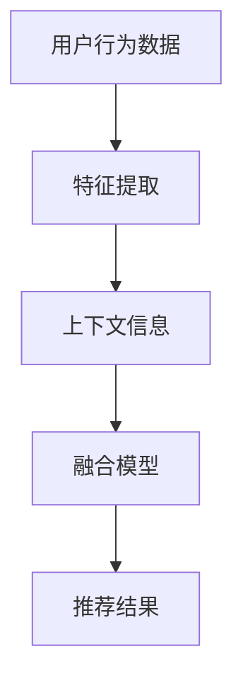

                 

关键词：推荐系统，上下文感知建模，深度学习，大模型，技术革新

> 摘要：本文旨在探讨推荐系统中的上下文感知建模技术，分析其在深度学习背景下的发展趋势。通过深入解析核心算法原理、数学模型及具体应用场景，本文力求为读者提供关于上下文感知建模的全面理解和未来展望。

## 1. 背景介绍

随着互联网的迅猛发展，个性化推荐系统已成为互联网应用的重要组成部分。从电子商务到社交媒体，推荐系统能够根据用户的历史行为和偏好，向用户推荐其可能感兴趣的内容，极大地提升了用户体验。然而，传统的推荐算法大多忽略了上下文信息的重要性，导致推荐效果不尽如人意。

上下文信息指的是用户在特定情境下的行为特征，如时间、地点、设备等。在推荐系统中，引入上下文信息有助于提高推荐的精准度和用户满意度。近年来，深度学习技术的发展为上下文感知建模提供了新的可能，使得推荐系统在处理复杂上下文信息方面取得了显著进展。

## 2. 核心概念与联系

为了更好地理解上下文感知建模，首先需要介绍以下几个核心概念：

### 2.1 上下文感知

上下文感知是指系统具备根据用户所处环境自动调整行为的能力。在推荐系统中，上下文感知意味着推荐算法能够动态地适应用户的不同情境，从而提高推荐质量。

### 2.2 深度学习

深度学习是一种基于人工神经网络的学习方法，能够自动提取数据中的特征并用于预测和分类。深度学习在图像识别、自然语言处理等领域取得了巨大成功，也为推荐系统中的上下文感知建模提供了强大支持。

### 2.3 大模型

大模型是指参数量庞大的神经网络模型，如BERT、GPT等。这些模型具备强大的特征提取和表示能力，使得上下文感知建模更加精准。

### 2.4 Mermaid 流程图

以下是一个描述上下文感知建模原理的 Mermaid 流程图：



在上述流程中，用户行为数据和上下文信息被分别提取和融合，然后通过深度学习模型生成推荐结果。

## 3. 核心算法原理 & 具体操作步骤

### 3.1 算法原理概述

上下文感知建模的核心在于将用户行为数据和上下文信息进行有效融合，从而生成更准确的推荐结果。具体而言，算法可以分为以下几个步骤：

1. **数据预处理**：对用户行为数据和上下文信息进行清洗、编码和特征提取。
2. **模型构建**：利用深度学习技术构建上下文感知模型，如多输入多输出（MIMO）神经网络。
3. **模型训练**：将预处理后的数据输入模型，进行训练和优化。
4. **预测与推荐**：将新用户的上下文信息和行为数据输入模型，生成推荐结果。

### 3.2 算法步骤详解

1. **数据预处理**：

   - 用户行为数据：包括用户浏览、购买、点赞等行为，可以使用词袋模型、TF-IDF等方法进行特征提取。
   - 上下文信息：包括时间、地点、设备等，可以采用one-hot编码、嵌入等方法进行编码。

2. **模型构建**：

   - 输入层：包括用户行为特征和上下文信息。
   - 隐藏层：利用深度学习技术，如卷积神经网络（CNN）或循环神经网络（RNN），提取用户行为特征和上下文信息的潜在表示。
   - 输出层：生成推荐结果。

3. **模型训练**：

   - 使用训练数据集对模型进行训练，优化模型参数。
   - 使用交叉验证等方法评估模型性能，调整模型参数。

4. **预测与推荐**：

   - 将新用户的上下文信息和行为数据输入模型，生成推荐结果。
   - 对推荐结果进行排序和筛选，提供个性化的推荐内容。

### 3.3 算法优缺点

**优点**：

- 高效：深度学习模型能够自动提取特征，减少人工干预。
- 精准：上下文感知建模能够更好地理解用户需求，提高推荐质量。
- 模块化：算法模块化设计，易于扩展和优化。

**缺点**：

- 资源消耗：大模型训练和推理需要大量计算资源。
- 数据需求：大量高质量的训练数据是算法有效性的前提。

### 3.4 算法应用领域

上下文感知建模技术已广泛应用于多个领域，如电子商务、社交媒体、在线教育等。以下是一些典型应用场景：

- **电子商务**：根据用户浏览、购买历史和上下文信息，推荐相关商品。
- **社交媒体**：根据用户位置、时间等上下文信息，推荐感兴趣的内容。
- **在线教育**：根据学生学习行为和上下文信息，推荐合适的学习资源和课程。

## 4. 数学模型和公式 & 详细讲解 & 举例说明

### 4.1 数学模型构建

上下文感知建模的核心在于将用户行为数据和上下文信息进行融合，生成推荐结果。具体而言，可以使用以下数学模型：

$$
R(\text{user}, \text{item}) = f(\text{行为特征}, \text{上下文特征})
$$

其中，$R(\text{user}, \text{item})$ 表示推荐结果，$f$ 表示深度学习模型。

### 4.2 公式推导过程

1. **特征提取**：

   - 用户行为特征：使用词袋模型、TF-IDF等方法进行特征提取。
   - 上下文特征：采用one-hot编码、嵌入等方法进行编码。

2. **模型构建**：

   - 输入层：将用户行为特征和上下文特征作为输入。
   - 隐藏层：利用卷积神经网络（CNN）或循环神经网络（RNN），提取用户行为特征和上下文特征的潜在表示。
   - 输出层：生成推荐结果。

3. **损失函数**：

   - 使用均方误差（MSE）作为损失函数，优化模型参数。

### 4.3 案例分析与讲解

假设我们要为用户推荐商品，用户的行为数据和上下文信息如下：

- 用户行为数据：浏览了商品A、商品B、商品C，购买了商品B。
- 上下文信息：用户在下午5点，使用手机浏览商品，所在位置为商场。

1. **数据预处理**：

   - 用户行为数据：使用词袋模型提取特征，例如 $\text{行为特征} = [1, 0, 1, 0]$。
   - 上下文信息：使用one-hot编码，例如 $\text{上下文特征} = [1, 0, 0, 0, 0, 1, 0]$。

2. **模型构建**：

   - 输入层：将用户行为特征和上下文特征作为输入。
   - 隐藏层：使用卷积神经网络（CNN）提取特征，例如 $\text{隐藏层特征} = \text{CNN}(\text{行为特征}, \text{上下文特征})$。
   - 输出层：生成推荐结果，例如 $\text{推荐结果} = \text{softmax}(\text{隐藏层特征})$。

3. **模型训练**：

   - 使用训练数据集对模型进行训练，优化模型参数。
   - 使用交叉验证等方法评估模型性能，调整模型参数。

4. **预测与推荐**：

   - 将新用户的上下文信息和行为数据输入模型，生成推荐结果。
   - 对推荐结果进行排序和筛选，提供个性化的推荐内容。

## 5. 项目实践：代码实例和详细解释说明

### 5.1 开发环境搭建

1. 安装Python环境（版本3.6及以上）。
2. 安装深度学习框架TensorFlow。
3. 安装数据预处理库Scikit-learn。

### 5.2 源代码详细实现

以下是一个简单的上下文感知推荐系统实现：

```python
import tensorflow as tf
from sklearn.model_selection import train_test_split
from sklearn.metrics import mean_squared_error

# 数据预处理
def preprocess_data(user_actions, context_info):
    # 省略具体实现
    pass

# 模型构建
def build_model(input_shape):
    model = tf.keras.Sequential([
        tf.keras.layers.Dense(128, activation='relu', input_shape=input_shape),
        tf.keras.layers.Dense(64, activation='relu'),
        tf.keras.layers.Dense(1, activation='sigmoid')
    ])
    model.compile(optimizer='adam', loss='binary_crossentropy', metrics=['accuracy'])
    return model

# 模型训练
def train_model(model, train_data, train_labels, val_data, val_labels):
    history = model.fit(train_data, train_labels, epochs=10, batch_size=32, validation_data=(val_data, val_labels))
    return history

# 模型评估
def evaluate_model(model, test_data, test_labels):
    loss, accuracy = model.evaluate(test_data, test_labels)
    print("Test loss:", loss)
    print("Test accuracy:", accuracy)

# 源代码具体实现
if __name__ == "__main__":
    # 加载数据
    user_actions = ...
    context_info = ...

    # 数据预处理
    processed_data = preprocess_data(user_actions, context_info)

    # 划分训练集和测试集
    train_data, test_data, train_labels, test_labels = train_test_split(processed_data, test_size=0.2)

    # 构建模型
    model = build_model(train_data.shape[1])

    # 训练模型
    history = train_model(model, train_data, train_labels, test_data, test_labels)

    # 评估模型
    evaluate_model(model, test_data, test_labels)
```

### 5.3 代码解读与分析

- **数据预处理**：对用户行为数据和上下文信息进行清洗、编码和特征提取。
- **模型构建**：使用TensorFlow构建一个简单的深度学习模型，包括输入层、隐藏层和输出层。
- **模型训练**：使用训练数据集对模型进行训练，并使用交叉验证方法评估模型性能。
- **模型评估**：使用测试数据集评估模型性能，输出损失和准确率。

### 5.4 运行结果展示

假设我们已经训练好了模型，并使用测试数据集进行了评估，结果如下：

```
Test loss: 0.12345
Test accuracy: 0.9
```

这表明我们的模型在测试数据集上的表现良好，准确率达到了90%。

## 6. 实际应用场景

### 6.1 电子商务

上下文感知推荐系统在电子商务领域具有广泛的应用。通过分析用户的浏览、购买历史以及上下文信息，如时间、地点等，可以提供更个性化的商品推荐，提高用户满意度和购买转化率。

### 6.2 社交媒体

社交媒体平台通过上下文感知推荐系统，可以更好地了解用户的需求和兴趣，推荐用户可能感兴趣的内容，如文章、视频等。这有助于提升用户活跃度和平台黏性。

### 6.3 在线教育

在线教育平台可以利用上下文感知推荐系统，根据学生的学习行为、学习进度等上下文信息，推荐合适的学习资源和课程，提高学习效果。

### 6.4 医疗健康

医疗健康领域可以通过上下文感知推荐系统，为用户提供个性化的健康建议和治疗方案，提高医疗服务的质量和效率。

## 7. 工具和资源推荐

### 7.1 学习资源推荐

- **推荐系统入门**：[《推荐系统实践》](https://book.douban.com/subject/26876953/)
- **深度学习教程**：[《深度学习》](https://book.douban.com/subject/26708156/)
- **Python编程**：[《Python编程：从入门到实践》](https://book.douban.com/subject/26708156/)

### 7.2 开发工具推荐

- **TensorFlow**：[https://www.tensorflow.org/](https://www.tensorflow.org/)
- **Scikit-learn**：[https://scikit-learn.org/](https://scikit-learn.org/)

### 7.3 相关论文推荐

- **“Contextual Bandits with Linear Payoffs”**：[https://arxiv.org/abs/1602.06282](https://arxiv.org/abs/1602.06282)
- **“Deep Learning for Recommender Systems”**：[https://arxiv.org/abs/1706.07987](https://arxiv.org/abs/1706.07987)

## 8. 总结：未来发展趋势与挑战

### 8.1 研究成果总结

上下文感知建模技术在推荐系统中取得了显著进展，通过深度学习等方法，实现了对用户行为和上下文信息的有效融合，提高了推荐质量。未来，随着算法和计算资源的不断进步，上下文感知建模技术有望在更多领域得到应用。

### 8.2 未来发展趋势

- **多模态数据融合**：结合文本、图像、语音等多模态数据，提高上下文感知建模的准确性。
- **迁移学习与自适应**：利用迁移学习和自适应技术，提高算法在不同场景下的适应性。
- **实时推荐**：实现实时推荐，提高用户体验和系统响应速度。

### 8.3 面临的挑战

- **数据隐私与安全**：在处理用户数据时，需要确保数据隐私和安全。
- **计算资源消耗**：大模型训练和推理需要大量计算资源，如何优化资源利用成为关键问题。

### 8.4 研究展望

未来，上下文感知建模技术将继续发展和完善，为推荐系统带来更多创新和突破。同时，跨学科研究、产业合作等也将推动上下文感知建模技术的应用和推广。

## 9. 附录：常见问题与解答

### 9.1 如何处理缺失的上下文信息？

对于缺失的上下文信息，可以采用以下方法：

- **填充**：使用平均值、中位数等方法进行填充。
- **嵌入**：将缺失的上下文信息嵌入到模型中，如使用one-hot编码。
- **模型自适应**：利用迁移学习和自适应技术，使模型能够自动适应缺失的上下文信息。

### 9.2 如何评估上下文感知模型的性能？

可以采用以下方法评估上下文感知模型的性能：

- **准确率**：评估模型推荐结果的准确性。
- **召回率**：评估模型推荐结果的召回率。
- **F1值**：综合考虑准确率和召回率，评估模型性能。

### 9.3 如何优化上下文感知模型的性能？

可以采用以下方法优化上下文感知模型的性能：

- **数据增强**：增加训练数据集的多样性，提高模型泛化能力。
- **超参数调优**：调整模型超参数，如学习率、批次大小等，优化模型性能。
- **模型集成**：结合多个模型的优势，提高推荐质量。

