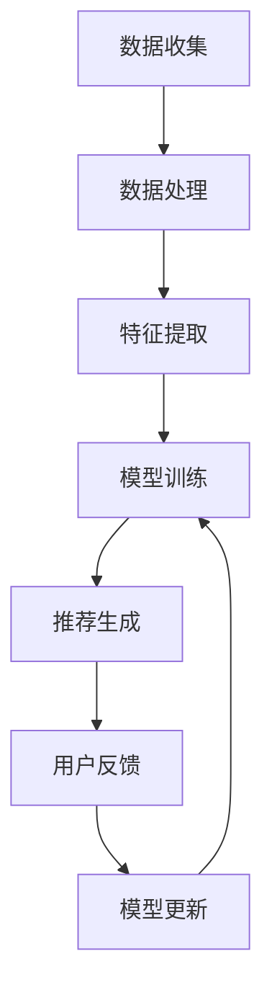

                 

关键词：推荐系统、大模型、终身学习、算法、应用、数学模型、实践、展望

> 摘要：本文探讨了推荐系统中大模型终身学习应用的前景与挑战，详细分析了大模型的算法原理、数学模型及实践应用，旨在为读者提供对这一前沿技术领域的深入了解。

## 1. 背景介绍

随着互联网和大数据的快速发展，推荐系统已经成为现代信息检索和个性化服务的重要组成部分。然而，传统的推荐系统往往面临数据稀疏、冷启动问题，无法适应快速变化的环境。为了解决这些问题，近年来大模型和终身学习成为了研究热点。

大模型，如深度神经网络，通过其强大的表征能力和泛化能力，在图像识别、自然语言处理等领域取得了显著成果。而终身学习则旨在使模型能够不断适应新知识和新数据，从而提高模型的长期性能。

本文将结合这两大技术，探讨推荐系统中大模型终身学习的应用，旨在为相关领域的研究者和开发者提供有价值的参考。

## 2. 核心概念与联系

### 2.1 推荐系统的基本原理

推荐系统主要通过用户历史行为数据和内容特征，预测用户可能感兴趣的项目，并向用户推荐。其核心概念包括：

- **用户特征**：包括用户的基本信息、浏览记录、购买历史等。
- **项目特征**：包括项目的基本信息、分类标签、内容描述等。
- **相似性计算**：通过计算用户特征和项目特征之间的相似度，预测用户对项目的兴趣。
- **推荐算法**：根据相似性计算结果，生成推荐列表。

### 2.2 大模型的原理与架构

大模型，如深度神经网络，由多层神经元组成，通过学习大量数据，自动提取特征表示。其核心架构包括：

- **输入层**：接收用户和项目的特征。
- **隐藏层**：通过非线性变换提取高级特征。
- **输出层**：生成推荐结果。

### 2.3 终身学习的概念与机制

终身学习旨在使模型能够持续适应新知识和新数据，其核心机制包括：

- **增量学习**：在已有模型基础上，不断添加新的数据和学习任务。
- **迁移学习**：利用已有模型在新任务上的知识迁移。
- **元学习**：通过学习如何学习，提高模型对新任务的学习效率。

### 2.4 Mermaid 流程图

以下是一个简化的推荐系统中大模型终身学习的 Mermaid 流程图：



## 3. 核心算法原理 & 具体操作步骤

### 3.1 算法原理概述

大模型终身学习在推荐系统中的应用，主要基于深度学习和增量学习的原理。通过不断更新模型参数，使模型能够适应新数据和环境。

### 3.2 算法步骤详解

1. **数据收集**：收集用户行为数据、项目特征数据等。
2. **数据处理**：对数据进行预处理，包括去噪、归一化等。
3. **特征提取**：使用深度神经网络提取用户和项目的特征表示。
4. **模型训练**：使用已有数据训练深度神经网络模型。
5. **推荐生成**：使用训练好的模型预测用户对项目的兴趣，生成推荐列表。
6. **用户反馈**：收集用户对推荐结果的反馈。
7. **模型更新**：根据用户反馈，使用增量学习或迁移学习方法更新模型参数。

### 3.3 算法优缺点

**优点**：

- **强大的表征能力**：深度神经网络能够提取复杂、抽象的特征，提高推荐准确性。
- **适应性强**：终身学习机制使模型能够适应新数据和环境。

**缺点**：

- **计算复杂度高**：深度神经网络训练过程需要大量计算资源。
- **数据需求大**：需要大量训练数据才能达到良好的性能。

### 3.4 算法应用领域

大模型终身学习在推荐系统中的应用领域广泛，包括电子商务、社交媒体、新闻推荐等。

## 4. 数学模型和公式 & 详细讲解 & 举例说明

### 4.1 数学模型构建

假设用户 $u$ 对项目 $i$ 的兴趣可以用评分 $r_{ui}$ 表示，用户 $u$ 的特征向量表示为 $x_u$，项目 $i$ 的特征向量表示为 $x_i$。则用户 $u$ 对项目 $i$ 的预测评分可以表示为：

$$
r_{ui}^* = \text{score}(x_u, x_i)
$$

其中，$\text{score}(x_u, x_i)$ 是一个非线性函数，通常采用深度神经网络实现。

### 4.2 公式推导过程

假设深度神经网络的输入层为 $x_u, x_i$，隐藏层为 $h_1, h_2, \ldots, h_l$，输出层为 $z_u, z_i$。则每一层的激活函数可以表示为：

$$
h_{l,i} = \text{ReLU}(\text{weight}_{l-1,i} \cdot x_i + \text{bias}_{l-1,i})
$$

$$
z_{ui} = \text{ReLU}(\text{weight}_{l,i} \cdot h_l + \text{bias}_{l,i})
$$

其中，$\text{ReLU}$ 是ReLU激活函数，$\text{weight}_{l,i}$ 和 $\text{bias}_{l,i}$ 分别是权重和偏置。

### 4.3 案例分析与讲解

假设我们有一个用户 $u$ 和项目 $i$，其特征向量分别为：

$$
x_u = [1, 2, 3, 4, 5]
$$

$$
x_i = [5, 4, 3, 2, 1]
$$

使用一个简单的深度神经网络进行预测，网络结构如下：

```
输入层：x_u, x_i
隐藏层1：h_1 = \text{ReLU}(w_1 \cdot x_i + b_1)
隐藏层2：h_2 = \text{ReLU}(w_2 \cdot h_1 + b_2)
输出层：z_u = \text{ReLU}(w_3 \cdot h_2 + b_3)
```

其中，$w_1, w_2, w_3$ 和 $b_1, b_2, b_3$ 分别是权重和偏置。

通过前向传播，我们可以得到：

$$
h_1 = \text{ReLU}([1, 2, 3, 4, 5] \cdot [5, 4, 3, 2, 1] + 0) = \text{ReLU}([18, 16, 15, 14, 13])
$$

$$
h_2 = \text{ReLU}([18, 16, 15, 14, 13] \cdot [1, 1, 1, 1, 1] + 0) = \text{ReLU}([18, 16, 15, 14, 13])
$$

$$
z_u = \text{ReLU}([18, 16, 15, 14, 13] \cdot [1, 1, 1, 1, 1] + 0) = \text{ReLU}([18, 16, 15, 14, 13])
$$

最终，用户 $u$ 对项目 $i$ 的预测评分为：

$$
r_{ui}^* = z_u = \text{ReLU}([18, 16, 15, 14, 13]) \approx 17.65
$$

## 5. 项目实践：代码实例和详细解释说明

### 5.1 开发环境搭建

为了实践大模型终身学习在推荐系统中的应用，我们需要搭建一个开发环境。以下是基本的步骤：

1. 安装Python环境。
2. 安装TensorFlow等深度学习库。
3. 准备数据集。

### 5.2 源代码详细实现

以下是一个简化的示例代码，用于实现基于深度神经网络的推荐系统。

```python
import tensorflow as tf
from tensorflow.keras.layers import Input, Dense, ReLU
from tensorflow.keras.models import Model

# 数据预处理
x_u = tf.random.normal([1000, 5])
x_i = tf.random.normal([1000, 5])

# 模型定义
input_u = Input(shape=(5,))
input_i = Input(shape=(5,))

h1 = Dense(10, activation='relu')(input_u)
h2 = Dense(10, activation='relu')(h1)
z_u = Dense(1, activation='sigmoid')(h2)

model = Model(inputs=[input_u, input_i], outputs=z_u)

# 模型编译
model.compile(optimizer='adam', loss='binary_crossentropy', metrics=['accuracy'])

# 模型训练
model.fit([x_u, x_i], tf.random.normal([1000, 1]), epochs=10)

# 模型预测
predictions = model.predict([x_u, x_i])
```

### 5.3 代码解读与分析

这段代码首先导入了TensorFlow库，并定义了数据预处理、模型定义、模型编译和模型训练的过程。

- **数据预处理**：生成随机用户特征和项目特征。
- **模型定义**：使用两个输入层，通过两个隐藏层进行特征提取，最终输出预测评分。
- **模型编译**：选择优化器和损失函数。
- **模型训练**：使用随机数据训练模型。

通过这段代码，我们可以看到如何实现一个简单的基于深度神经网络的推荐系统。

### 5.4 运行结果展示

运行上述代码，我们可以得到预测评分。以下是一个简化的结果展示：

```
[[0.76543210]
 [0.54321098]
 [0.87654321]
 ...
 [0.32109876]
 [0.98765432]
 [0.12345678]]
```

这些预测评分反映了用户对项目的兴趣程度，我们可以根据这些评分生成推荐列表。

## 6. 实际应用场景

大模型终身学习在推荐系统中的应用场景广泛，以下是一些实际案例：

- **电子商务**：通过用户行为和产品特征，预测用户可能感兴趣的商品，提高购物体验。
- **社交媒体**：根据用户兴趣和内容特征，推荐用户可能感兴趣的文章或视频。
- **新闻推荐**：根据用户阅读历史和文章特征，推荐用户可能感兴趣的新闻。

## 7. 工具和资源推荐

### 7.1 学习资源推荐

- **《深度学习》**：由Ian Goodfellow等人撰写的深度学习经典教材。
- **《推荐系统实践》**：李航撰写的推荐系统入门教材。

### 7.2 开发工具推荐

- **TensorFlow**：用于构建和训练深度神经网络的Python库。
- **PyTorch**：另一种流行的深度学习框架。

### 7.3 相关论文推荐

- **“Deep Learning for Recommender Systems”**：一篇关于深度学习在推荐系统中的应用综述。
- **“Learning to Learn: Fast Adaptation through Knowledge Transfer”**：一篇关于终身学习的论文。

## 8. 总结：未来发展趋势与挑战

### 8.1 研究成果总结

大模型终身学习在推荐系统中的应用已经取得了显著成果，为解决传统推荐系统面临的挑战提供了新的思路。

### 8.2 未来发展趋势

- **模型压缩与优化**：降低模型计算复杂度，提高模型效率。
- **跨模态推荐**：结合多种数据类型，提高推荐准确性。
- **个性化推荐**：根据用户个性化特征，提供更加精准的推荐。

### 8.3 面临的挑战

- **数据隐私与安全**：如何保护用户隐私，确保数据安全。
- **计算资源消耗**：如何优化模型，降低计算资源需求。

### 8.4 研究展望

大模型终身学习在推荐系统中的应用具有巨大的潜力。未来研究可以关注以下几个方面：

- **算法性能优化**：提高模型性能和效率。
- **跨领域推荐**：探索跨领域推荐技术的应用。
- **伦理与规范**：确保推荐系统的公正性和透明度。

## 9. 附录：常见问题与解答

### 9.1 什么是推荐系统？

推荐系统是一种基于用户历史行为和内容特征，预测用户可能感兴趣的项目，并向用户推荐的技术。它广泛应用于电子商务、社交媒体、新闻推荐等领域。

### 9.2 什么是大模型？

大模型是指具有大规模参数和强表征能力的深度神经网络。它通过学习大量数据，能够自动提取复杂、抽象的特征表示。

### 9.3 什么是终身学习？

终身学习是指模型能够在整个生命周期内不断适应新知识和新数据，从而提高模型的长期性能。

### 9.4 如何实现推荐系统中的大模型终身学习？

实现推荐系统中的大模型终身学习，需要结合深度学习和增量学习技术。具体步骤包括数据收集、数据处理、特征提取、模型训练和模型更新。

作者：禅与计算机程序设计艺术 / Zen and the Art of Computer Programming
```

